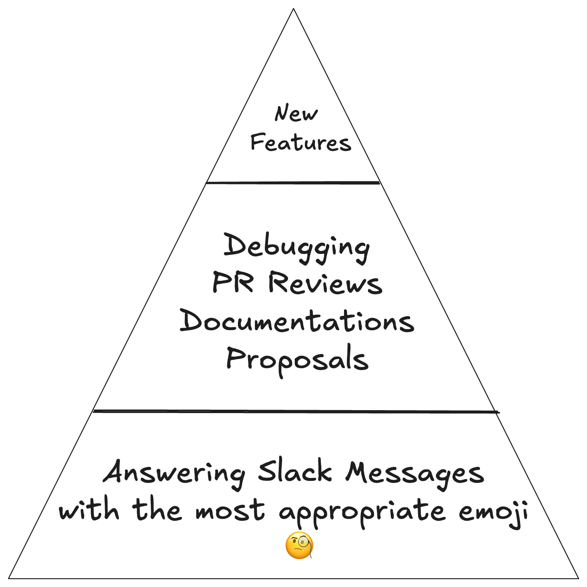
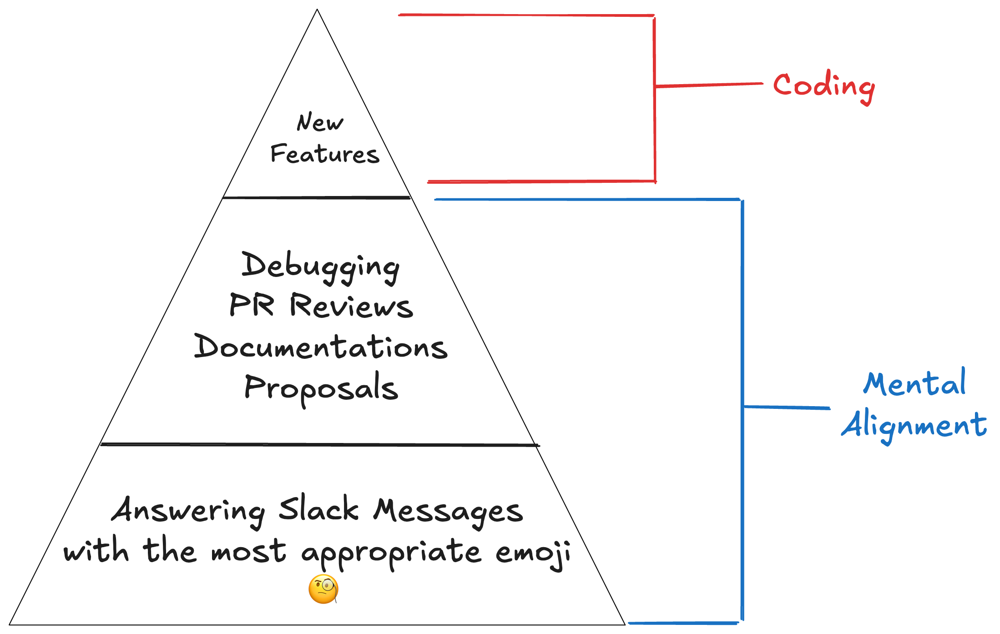
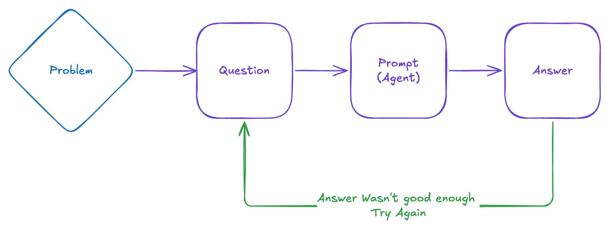
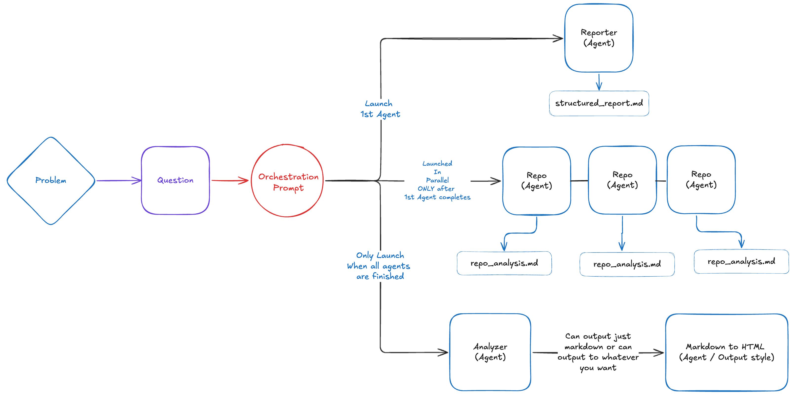

# Creating a Multi-Agent Flow

Building specialized AI agents that work together

<br />
<br />

> Jhonatan Salazar
> <small><em> SacTech '25 </em></small>

---

## What We'll Cover

1. What "Agents" actually are
2. How we use agents today & their limitations
3. Building your own custom agents
4. Specialized agents working independently
5. The power of multi-agent flows

---

# What do Software Engineers actually do?

---

<style>
img[alt~="center"] {
  display: block;
  margin: 0 auto;
}
</style>



---



---

# Agents can help my team align rapidly

---

# What is an Agent?

---

<style>
img[alt~="center"] {
  display: block;
  margin: 0 auto;
}
</style>


---

# An agent is an AI system that can:

- Understand a goal or task
- Make decisions about how to accomplish it
- Use tools to interact with the world
- Iterate until the task is complete

Think: **AI + Tools (Fetch, WebSearch, MCP) + Autonomy**

---

# Agents in the Wild

### Tools You're Already Using

All of these are **single-agent systems**

- **ChatGPT (Web)**: Conversational interface + plugins/actions
- **Claude (Web)**: Conversational interface + plugins/actions
- **Cursor**: Code completion + context-aware edits

All of these are **multi-agent systems**

- **Claude Code**: Long-context reasoning + tool use
- **Cursor (Agent Mode)**: Context-aware edits + tool use

---

# Single-Agent Systems



---

# The Single-Agent Problem

One agent trying to do everything:

- Same reasoning approach for different tasks
- No task-specific optimization

<br />

### Jack of all trades, master of none

---


---

# Build your own Custom Agents

---

## Building Custom Agents

### Using Claude's `/agent` Command

Create specialized agents with:

- Custom system prompts
- Specific tool sets (Fetch, WebSearch, MCPs)
  - Can also restrict usage
- Defined output formats
- Task-focused behavior

---

## Building Custom Agents

### Example: Creating a Specialized Agent

```bash
/agent
```

Define its purpose:

- You are an expert web developer and markdown specialist with deep expertise in semantic HTML5, CSS frameworks, and data visualization.
- Your primary responsibility is to convert markdown documents into well-structured, accessible, and beautifully styled HTML
- Use the Picnic CSS framework (https://picnicss.com/).

---

# DEMO!

---

# Okay, that's cool. But so what?!

---

## Specialized Agents

Each agent has a **single responsibility**:

1. **Reporter**: Analyze a GitHub issue deeply and provide comprehensive context about the problem, including identifying related repositories that should be examined for additional context.

2. **Repo Finder**: Given a specific repository and search context, clone it, analyze it for relevant files and patterns, and output your findings.

3. **Analyzer**: Synthesize all context from Agent Reporter and Agent Repo Getter to produce a comprehensive analysis of the GitHub issue. Your output will be the definitive resource for understanding the problem.

---

# Multi-Agent Flow in Action

### The Power of Orchestration

Using Claude's `/command` we can build an orchestration prompt that allows us to coordinate how all of these individual agents should work together

---



---

# Multi-Agent Flow in Action

### Why This Works

Each agent:

- Specializes in one thing
- Produces optimized output for its task
- Passes structured data to the next agent

**Result**: Better than any single agent could achieve

---

# Claude Commands

Create an Orchestration Prompt this within `./claude/commands`

```base
/analyze-issue https://github.com/TanStack/form/issues/1874
```

---

# DEMO & OUTPUT

---

## Key Takeaways

1. Single agents have inherent limitations
2. Specialization beats generalization
3. Custom agents are easier to build than you think
4. Multi-agent flows unlock new capabilities
5. You can start building today

---

## Questions?

Thank you!
