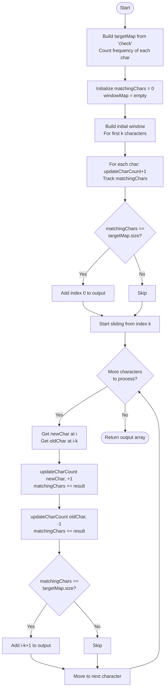

# 2025-12-17

## Moving faster

As I'm moving through these algorithms I feel like I'm moving faster

Yesterday I learned about [longest substring](https://algo.monster/problems/longest_substring_without_repeating_characters) 

---
# 2025-12-15

## Sliding Windows

