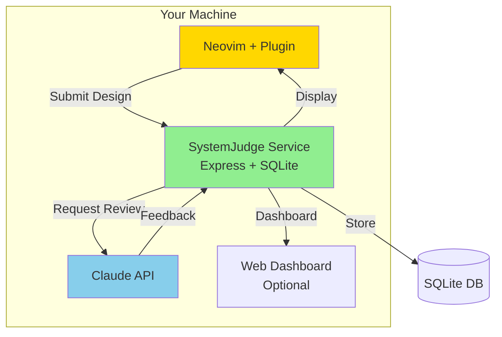
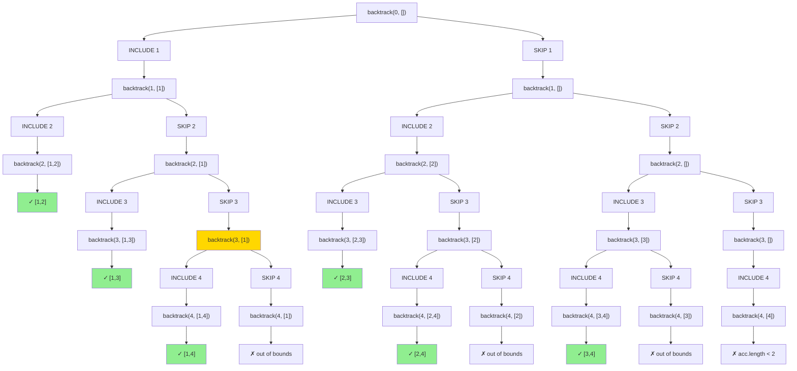
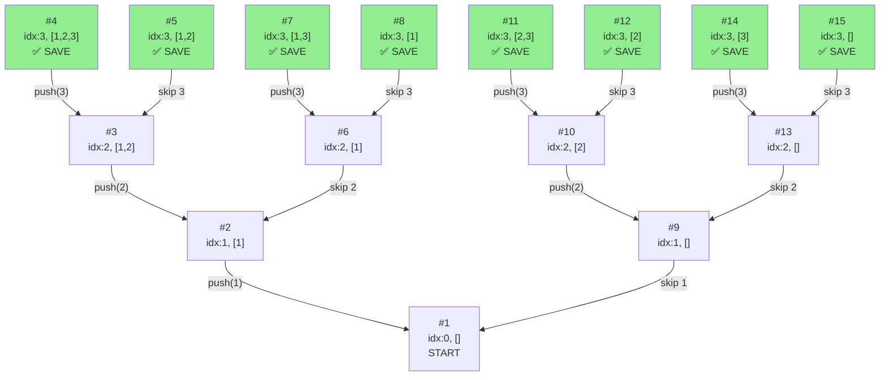

## Thu, Jan 29

---
## Wed, Jan 28

For [[784-Permutations]] I generated the following:

I'm looking at this problem and I need to go through each permutation by recognizing **that every letter is a branching point where I have two choices—uppercase or lowercase—while digits just pass through unchanged.** 

Instead of trying to generate all combinations upfront, I'll use backtracking to build permutations character by character: at each position, I'll make a choice (uppercase/lowercase), move to the next character with that choice added to my current string, and when I reach the end, I'll save that complete permutation. 

The key is that after exploring one choice (say, uppercase), the function returns and I naturally explore the other choice (lowercase) because I made both recursive calls. For digits, I only make one recursive call since there's no choice to make. By the time all recursive calls finish, I've explored every possible combination of uppercase/lowercase decisions across all letters—the recursion tree itself generates all permutations for me."  

---
## Tue, Jan 27

```mermaid
  graph LR                                                                                                           
      Start(["START<br/>mergeTwoLists([1,2,4], [1,3,4])"])                                                           
                                                                                                                     
      Call1["#1 CALL<br/>L1:[1,2,4] L2:[1,3,4]<br/>1 ≤ 1 → pick L1's 1<br/>recurse with L1.next"]                    
                                                                                                                     
      Call2["#2 CALL<br/>L1:[2,4] L2:[1,3,4]<br/>2 > 1 → pick L2's 1<br/>recurse with L2.next"]                      
                                                                                                                     
      Call3["#3 CALL<br/>L1:[2,4] L2:[3,4]<br/>2 < 3 → pick L1's 2<br/>recurse with L1.next"]                        
                                                                                                                     
      Call4["#4 CALL<br/>L1:[4] L2:[3,4]<br/>4 > 3 → pick L2's 3<br/>recurse with L2.next"]                          
                                                                                                                     
      Call5["#5 CALL<br/>L1:[4] L2:[4]<br/>4 ≤ 4 → pick L1's 4<br/>recurse with L1.next"]                            
                                                                                                                     
      Base["#6 BASE CASE<br/>L1:null L2:[4]<br/>return [4]"]                                                         
                                                                                                                     
      Ret5["#5 RETURN<br/>1→[4]<br/>result:[4,4]"]                                                                   
                                                                                                                     
      Ret4["#4 RETURN<br/>3→[4,4]<br/>result:[3,4,4]"]                                                               
                                                                                                                     
      Ret3["#3 RETURN<br/>2→[3,4,4]<br/>result:[2,3,4,4]"]                                                           
                                                                                                                     
      Ret2["#2 RETURN<br/>1→[2,3,4,4]<br/>result:[1,2,3,4,4]"]                                                       
                                                                                                                     
      Ret1["#1 RETURN<br/>1→[1,2,3,4,4]<br/>result:[1,1,2,3,4,4]"]                                                   
                                                                                                                     
      End(["FINAL RESULT<br/>[1,1,2,3,4,4]"])                                                                        
                                                                                                                     
      Start --> Call1                                                                                                
      Call1 --> Call2                                                                                                
      Call2 --> Call3                                                                                                
      Call3 --> Call4                                                                                                
      Call4 --> Call5                                                                                                
      Call5 --> Base                                                                                                 
      Base --> Ret5                                                                                                  
      Ret5 --> Ret4                                                                                                  
      Ret4 --> Ret3                                                                                                  
      Ret3 --> Ret2                                                                                                  
      Ret2 --> Ret1                                                                                                  
      Ret1 --> End                                                                                                   
                                                                                                                     
      style Base fill:#FFB6C1                                                                                        
      style Ret5 fill:#90EE90                                                                                        
      style Ret4 fill:#90EE90                                                                                        
      style Ret3 fill:#90EE90                                                                                        
      style Ret2 fill:#90EE90                                                                                        
      style Ret1 fill:#90EE90                                                                                        
      style End fill:#FFD700                                                                                         

```

---
## Mon, Jan 26

Looking through [[ysk/study-guides/078-subsets/mental-model|subsets]] again and it was revealing how much better I understood it with the following chart. Because it requires

---