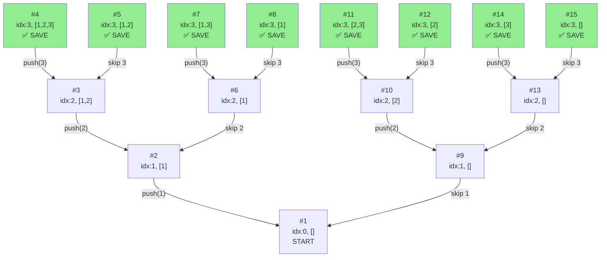

## Mon, Jan 26

Looking through [[ysk/study-guides/078-subsets/mental-model|subsets]] again and it was revealing how much better I understood it with the following chart. Because it requires

```mermaid
graph TB

A["#1<br/>idx:0, []<br/>START"]

B["#2<br/>idx:1, [1]"] -->|"push(1)"| A

C["#9<br/>idx:1, []"] -->|"skip 1"| A

D["#3<br/>idx:2, [1,2]"] -->|"push(2)"| B

E["#6<br/>idx:2, [1]"] -->|"skip 2"| B

F["#4<br/>idx:3, [1,2,3]<br/>✅ SAVE"] -->|"push(3)"| D

G["#5<br/>idx:3, [1,2]<br/>✅ SAVE"] -->|"skip 3"| D

H["#7<br/>idx:3, [1,3]<br/>✅ SAVE"] -->|"push(3)"| E

I["#8<br/>idx:3, [1]<br/>✅ SAVE"] -->|"skip 3"| E

J["#10<br/>idx:2, [2]"] -->|"push(2)"| C

K["#13<br/>idx:2, []"] -->|"skip 2"| C

L["#11<br/>idx:3, [2,3]<br/>✅ SAVE"] -->|"push(3)"| J

M["#12<br/>idx:3, [2]<br/>✅ SAVE"] -->|"skip 3"| J

N["#14<br/>idx:3, [3]<br/>✅ SAVE"] -->|"push(3)"| K

O["#15<br/>idx:3, []<br/>✅ SAVE"] -->|"skip 3"| K

style F fill:#90EE90

style G fill:#90EE90

style H fill:#90EE90

style I fill:#90EE90

style L fill:#90EE90

style M fill:#90EE90

style N fill:#90EE90

style O fill:#90EE90
```

---