# Recursion: How to Think About It

#pattern/recursion

A guide focused on **mental models** for approaching recursive problems, not just code templates.

---

## The Core Mental Shift

Most people think **iteratively** by default:
> "Start at the beginning, do something, move forward, repeat"

Recursion requires a different mindset:
> "Assume the smaller version is already solved. How do I use that?"

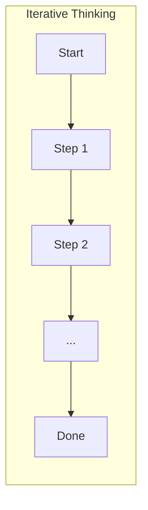

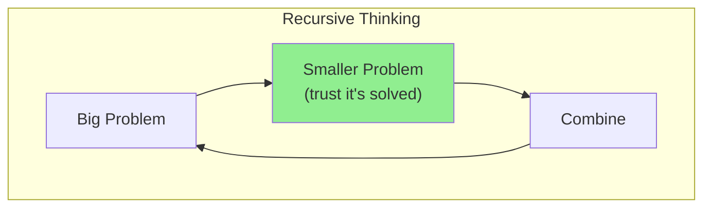

---

## The Three Questions Framework

Every recursive solution answers these three questions:

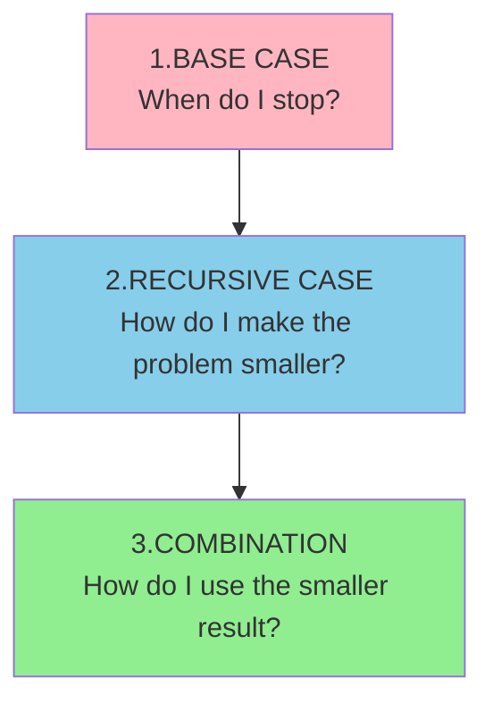

### The Questions Applied

| Question | Purpose | Example (Sum Array) |
|----------|---------|---------------------|
| **Base case** | Prevent infinite recursion | Empty array → return 0 |
| **Recursive case** | Make problem smaller | Sum of rest of array |
| **Combination** | Build up the answer | First element + sum of rest |

---

## Mental Model 1: The Leap of Faith

**The hardest part of recursion**: Trust that the recursive call works **without tracing through it**.

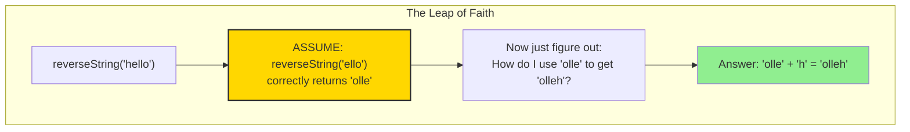

### Why This Works

You're not ignoring the recursive call—you're **defining what it should do**. If you define it correctly for `n`, and it works for the base case, mathematical induction guarantees it works for all cases.

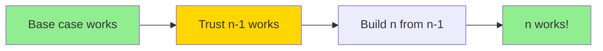

---

## Mental Model 2: The Decision Tree

Many recursive problems are about **exploring all possibilities**. Think of recursion as walking through a tree of choices.

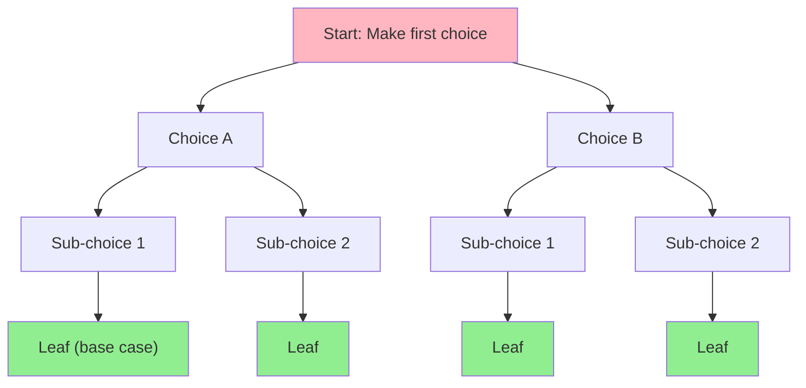

### Key Insight

At each node:
1. Make a choice
2. Recursively handle remaining choices
3. (For backtracking) Undo the choice and try another

---

## Mental Model 3: State at Each Level

Think about **what information each recursive call needs** and **what it returns**.

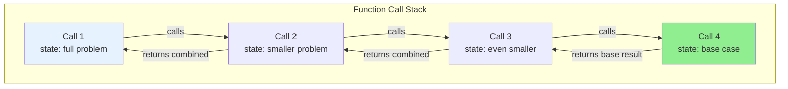

Ask yourself:
- What **changes** between calls? (This becomes a parameter)
- What **stays the same**? (This can be shared or constant)
- What does each level **return**?

---

## Pattern 1: Linear Recursion

**Structure**: Each call makes exactly ONE recursive call.

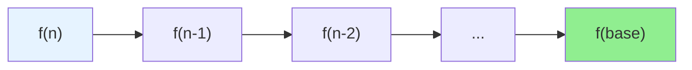

### Examples
- Factorial: `n! = n * (n-1)!`
- Sum array: `sum([1,2,3]) = 1 + sum([2,3])`
- Reverse string: `reverse("abc") = reverse("bc") + "a"`

### Template

```typescript
function linearRecursion(input) {
  // 1. Base case
  if (isBaseCase(input)) {
    return baseCaseResult;
  }

  // 2. Make problem smaller
  const smallerInput = makeSmallerProblem(input);

  // 3. Recursive call + combine
  return combine(
    currentPiece(input),
    linearRecursion(smallerInput)
  );
}
```

### Thinking Through: Reverse String

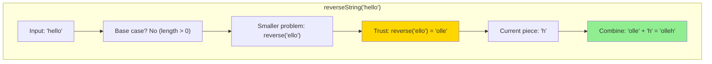

---

## Pattern 2: Tree Recursion

**Structure**: Each call makes MULTIPLE recursive calls.

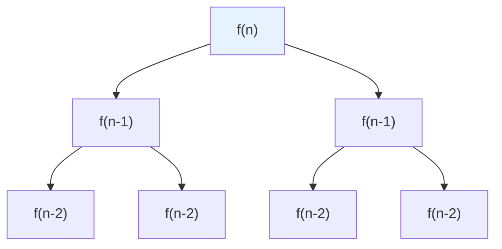

### Examples
- Fibonacci: `fib(n) = fib(n-1) + fib(n-2)`
- Binary tree traversal: recurse on left AND right
- Generate all subsets: include element OR exclude element

### Key Insight

Tree recursion often explores **all combinations** or **all paths**:

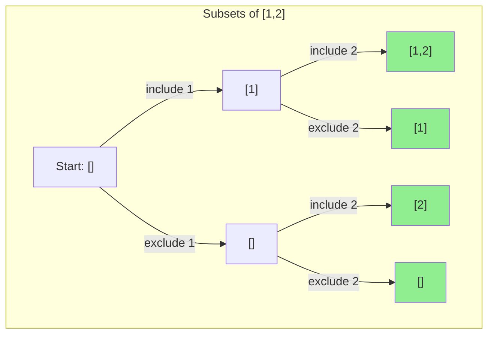

---

## Pattern 3: Accumulator Pattern

**Problem with basic recursion**: Results build up on the **return path**.

**Accumulator solution**: Build results on the **way down** by passing state.

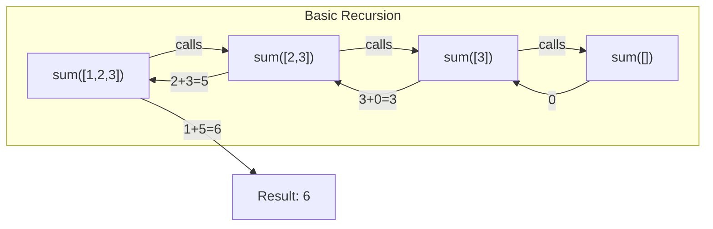

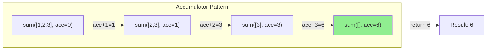

### When to Use Accumulators

- Building up a **collection** (string, array, path)
- Generating **all solutions** (pass current state to collect valid ones)
- **Backtracking** (accumulator is the current "path")

```typescript
// Without accumulator - builds result on return
function reverse(s: string): string {
  if (s.length === 0) return "";
  return reverse(s.slice(1)) + s[0];
}

// With accumulator - builds result going down
function reverse(s: string, acc = ""): string {
  if (s.length === 0) return acc;
  return reverse(s.slice(1), s[0] + acc);
}
```

---

## Example Problems

These patterns are best understood through practice. See:

- [[ysk/study-guides/022-generate-parentheses/study-guide]] — Tree recursion with constrained choices (backtracking)
- [[078-subsets]] — Tree recursion with include/exclude choices

---

## The Backtracking Pattern

Backtracking is recursion + **undo**. You explore a path, and if it doesn't work (or after collecting the result), you **undo your last choice** and try a different path.

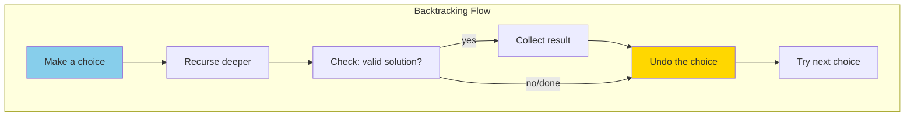

### The Template

```typescript
function backtrack(state, choices, results) {
  // Base case: found a valid solution
  if (isComplete(state)) {
    results.push(copy(state));
    return;
  }

  for (const choice of getValidChoices(choices)) {
    // Make choice
    applyChoice(state, choice);

    // Recurse
    backtrack(state, remainingChoices, results);

    // UNDO choice (this is the "backtrack")
    undoChoice(state, choice);
  }
}
```

### Visual: Backtracking in Action

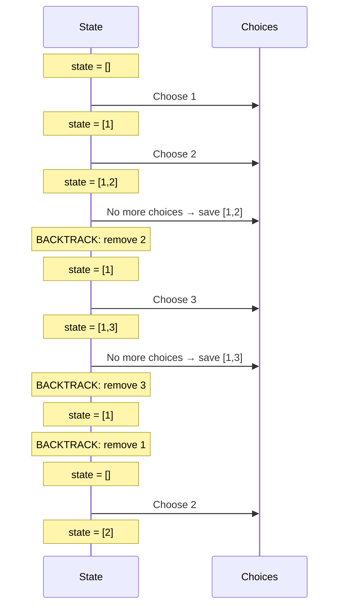

---

## Common Recursion Patterns Summary

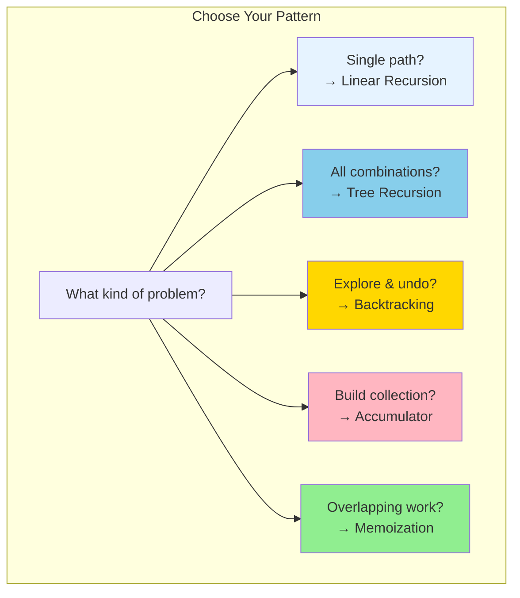

| Pattern | Use When | Examples |
|---------|----------|----------|
| **Linear** | One path through data | Factorial, list sum, string reverse |
| **Tree** | Multiple paths to explore | Fibonacci, subsets, permutations |
| **Backtracking** | Need to undo choices | N-Queens, sudoku, generate parentheses |
| **Accumulator** | Building up result | String building, path tracking |
| **Memoization** | Same subproblems repeat | Fibonacci, climbing stairs, coin change |

---

## How to Approach a New Recursive Problem

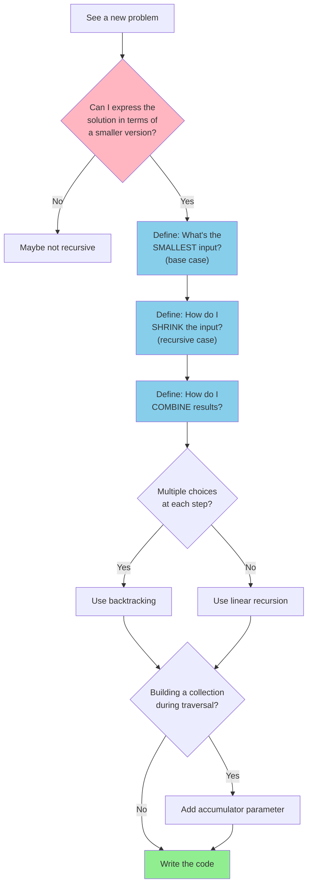

---

## Practice Problems by Concept

### Level 1: Linear Recursion
- [ ] Factorial
- [ ] Sum of array
- [ ] Reverse string
- [ ] Check if palindrome
- [ ] Power of two

### Level 2: Tree Recursion (Accumulator)
- [ ] Fibonacci
- [ ] Subsets
- [ ] Climbing stairs
- [ ] Generate binary strings of length n

### Level 3: Backtracking
- [ ] Generate Parentheses
- [ ] Permutations
- [ ] Combinations
- [ ] Letter combinations of phone number
- [ ] N-Queens

---

## Common Mistakes and How to Avoid Them

### Mistake 1: Missing Base Case

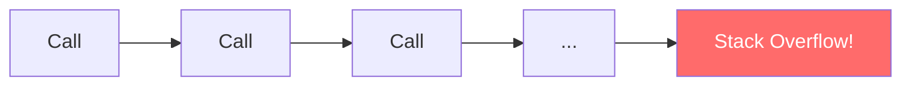

**Fix**: Always ask "When should I stop?"

### Mistake 2: Not Making Problem Smaller

```typescript
// WRONG: n doesn't change
function bad(n) {
  if (n === 0) return 0;
  return bad(n); // infinite recursion!
}
```

**Fix**: Each recursive call MUST use a "smaller" input.

### Mistake 3: Tracing Through Recursion

Don't try to trace every call in your head. Instead:
1. Trust the recursive call works
2. Focus on: "If I have the answer to the smaller problem, how do I build my answer?"

### Mistake 4: Forgetting to Copy in Backtracking

```typescript
// WRONG: all results point to same array
result.push(current);

// RIGHT: push a copy
result.push([...current]);
```

### Mistake 5: Not Undoing State Changes

```typescript
// WRONG: state change persists
current.push(choice);
backtrack(current);
// forgot to pop!

// RIGHT: undo the change
current.push(choice);
backtrack(current);
current.pop(); // undo!
```

---

## Mental Exercises

### Exercise 1: Describe the Leap

For each problem, complete: "Assume `f(smaller)` correctly returns ___. Then `f(current)` = ___."

| Problem | Leap of Faith |
|---------|---------------|
| `sum([1,2,3])` | Assume `sum([2,3])` returns 5. Then `sum([1,2,3])` = 1 + 5 = 6 |
| `reverse("abc")` | Assume `reverse("bc")` returns "cb". Then `reverse("abc")` = "cb" + "a" = "cba" |
| `countNodes(tree)` | Assume `countNodes(left)` and `countNodes(right)` return correct counts. Then total = 1 + left + right |

### Exercise 2: Draw the Tree

Before coding, sketch the decision tree for small inputs. This reveals:
- What choices exist at each step
- Where to prune invalid paths
- What state to track

### Exercise 3: Identify the State

For each problem, identify:
- What changes between recursive calls? (parameters)
- What stays constant? (can be outside the recursion)
- What needs to be returned?

---

## Key Takeaways

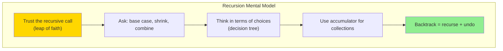

1. **Don't trace—trust**. Define what the function does, trust smaller calls work.
2. **Three questions**: Base case? Shrink? Combine?
3. **Decision trees** make the structure visible
4. **Accumulators** carry state down the recursion
5. **Backtracking** = make choice, recurse, undo choice

---

## Next Steps

After mastering these mental models:
1. Practice problems from each level above
2. Move to [[tree-problems]] (trees are recursive structures)
3. Then [[graph-problems]] (graphs use similar DFS patterns)
4. Finally [[dynamic-programming]] (recursion + memoization)

**Remember**: Recursion is a way of **thinking**, not just a technique. Once it clicks, you'll see it everywhere.
