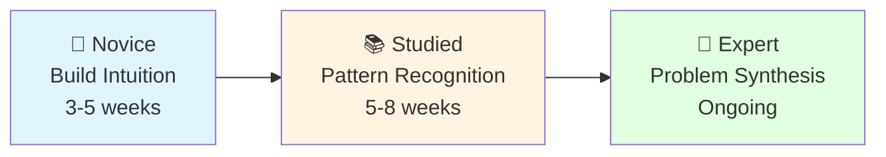

# Complete DSA Learning Path: Novice → Expert

> 📌 **Part of the [Master Interview Preparation Guide](../interview-prep/00-master-interview-guide.md)**
>
> This is the **DSA-focused** component of your interview prep. For the complete picture including System Design, Behavioral prep, and job search strategy, see the [Master Guide](../interview-prep/00-master-interview-guide.md).

---

## Philosophy

This curriculum is designed with **pedagogical progression** in mind:

- **Early topics** build problem-solving intuition with simpler structures
- **Middle topics** introduce algorithmic thinking and complexity
- **Late topics** combine everything into advanced problem-solving

Each phase has a purpose beyond just "learning a data structure."

---

## ⏱️ Timeline Assumptions

**Integrated Study Approach**: This DSA path is meant to be studied alongside [System Design](../system-design/00-complete-system-design-path.md).

**Time Allocation**:
- **Full-time**: 18-24 hours/week on DSA (60% of total study time)
- **Part-time**: 9-12 hours/week on DSA (60% of total study time)
- **Remaining time**: Dedicated to System Design study

The timelines below assume:
- ✅ You're following the integrated schedule in the [Master Interview Guide](../interview-prep/00-master-interview-guide.md)
- ✅ You're studying both DSA and System Design in parallel from Week 1
- ⚠️ Complex topics (recursion, DP, graphs) need processing time regardless of hours spent
- 💡 Quality practice > raw hours. Focus on understanding patterns deeply.

---

## 📍 The Three Phases

**Total time to "Studied" level: 8-13 weeks (2-3 months)**

---

## 🌱 Phase 1: Novice (3-5 weeks)

**Goal**: Build foundational problem-solving intuition with linear structures.

**Timeline at full-time pace**:

- Simple topics (arrays, hash maps, two pointers): 2-4 days each
- Complex topics (recursion, backtracking): 1-2 weeks
- Total: 3-5 weeks (vs 8-12 weeks part-time)

### Why Start Here?

- Arrays/strings are intuitive (you can visualize them)
- Teaches loop thinking and index manipulation
- Low cognitive overhead - focus on _problem-solving_ not _data structure complexity_
- Builds confidence with early wins

---

### Days 1-4: Arrays & Strings

**Duration**: 3-5 days (full-time)

**What You Learn**:

- Index manipulation
- Iteration patterns (forward, backward, both)
- In-place modifications
- String immutability handling

**Key Problems**:

- [x] Reverse array
- [x] Remove duplicates
- [x] Valid palindrome
- [x] Merge sorted arrays

**Why First**: Most fundamental structure. You need comfort here before anything else.

---

### Days 5-7: Hash Maps & Hash Sets

**Duration**: 2-3 days (full-time)

**What You Learn**:

- O(1) lookup power
- Trading space for time
- Frequency counting patterns
- Fast duplicate detection

**Key Problems**:

- [x] Two sum
- [x] Contains duplicate
- [x] Valid anagram
- [x] First unique character

**Why Now**: Essential tool you'll use EVERYWHERE. Learn it early so it's second nature.

---

### Days 8-10: Two Pointers

**Duration**: 2-3 days (full-time)

**What You Learn**:

- Multiple iteration variables
- Converging/diverging patterns
- In-place array manipulation
- Optimization thinking

**Key Problems**:

- [x] Container with most water
- [x] 3Sum
- [x] Remove element
- [x] Sort colors
- This one still stumped me initially, I had to resort to visual guide, but I mostly go it, will come back

**Why Now**: First real "technique" - teaches you that problems have patterns beyond brute force.

---

### Days 11-14: Sliding Window

**Duration**: 3-4 days (full-time)

**What You Learn**:

- Window state management
- Expand/contract logic
- Optimization of brute force
- Substring/subarray patterns

**Key Problems**:

- [x] Max sum subarray of size K
- [x] Longest substring without repeating chars
- [x] Minimum window substring
- [x] Permutation in string

**Why Now**: Natural extension of two pointers. Solidifies the idea that technique matters.

---

### Days 15-18: Linked Lists

**Duration**: 3-4 days (full-time)

**What You Learn**:

- Pointer manipulation
- Node-based thinking
- Reference vs value
- Edge case handling (null checks)

**Key Problems**:

- [x] Reverse linked list
- [x] Merge two sorted lists
- [x] Detect cycle
- [x] Remove Nth node from end

**Why Now**: First non-array structure. Teaches pointer thinking which is crucial for trees/graphs later.

---

### Days 19-21: Stack & Queue

**Duration**: 2-3 days (full-time)

**What You Learn**:

- LIFO vs FIFO thinking
- When order matters
- Auxiliary data structures
- Pairing/matching problems

**Key Problems**:

- [x] Valid parentheses
- [x] Min stack
- [x] Implement queue using stacks
- [x] Daily temperatures

**Why Now**: These patterns appear everywhere. Also critical for understanding recursion call stack.

---

### Week 4-5: Recursion & Backtracking Intro

**Duration**: 1-2 weeks (full-time) - Don't rush this!

**What You Learn**:

- Breaking problems into subproblems
- Base case thinking
- Call stack mental model
- Trust the recursion

**Key Problems**:

- [x] Fibonacci
- [x] Factorial
- [x] Reverse string recursively
- [x] Generate parentheses
- [x] Subsets

**Why Now**: CRITICAL checkpoint. You cannot progress without recursion. Take your time here.

---

### Days 22-26: Binary Search

**Duration**: 4-5 days (full-time)

**What You Learn**:

- Divide and conquer thinking
- Search space reduction
- Template-based problem solving
- Log(n) complexity benefits

**Key Problems**:

**Foundation (Start Here)**:
- [x] [704. Binary Search](https://leetcode.com/problems/binary-search/) - Classic implementation
- [x] [35. Search Insert Position](https://leetcode.com/problems/search-insert-position/) - Understanding boundaries
- [ ] [278. First Bad Version](https://leetcode.com/problems/first-bad-version/) - Pattern variation

**Rotated Arrays**:
- [x] [153. Find Minimum in Rotated Sorted Array](https://leetcode.com/problems/find-minimum-in-rotated-sorted-array/) - No duplicates
- [ ] [33. Search in Rotated Sorted Array](https://leetcode.com/problems/search-in-rotated-sorted-array/) - Target search

**2D Matrix**:
- [ ] [74. Search a 2D Matrix](https://leetcode.com/problems/search-a-2d-matrix/) - Row & column sorted
- [ ] [240. Search a 2D Matrix II](https://leetcode.com/problems/search-a-2d-matrix-ii/) - Advanced variation

**Bonus (If time permits)**:
- [ ] [69. Sqrt(x)](https://leetcode.com/problems/sqrtx/) - Binary search on answer
- [ ] [374. Guess Number Higher or Lower](https://leetcode.com/problems/guess-number-higher-or-lower/) - Interactive binary search

**Why Now**: First logarithmic algorithm. Introduces the idea that clever algorithms beat brute force.

---

## 🎓 Checkpoint: Novice → Studied

**You should now be able to**:
✅ Solve easy problems confidently (70%+ success rate)
✅ Recognize when to use hash map vs two pointers vs sliding window
✅ Write recursive solutions
✅ Understand time/space complexity
✅ Think about optimization

**Time invested**: 3-5 weeks of full-time study (42-49 hours/week)

---

## 📚 Phase 2: Studied (5-8 weeks)

**Goal**: Master hierarchical structures and graph algorithms. Develop pattern recognition.

**Timeline at full-time pace**:

- Trees/Heaps: 1-2 weeks total
- Graphs: 2-3 weeks (most important section)
- Backtracking: 1 week
- Dynamic Programming: 2-3 weeks (needs time to sink in)
- Total: 5-8 weeks (vs 12-16 weeks part-time)

### Why This Phase?

- Trees introduce hierarchical thinking (prerequisite for graphs)
- Graphs are the most complex structure - need strong foundation first
- Dynamic programming requires seeing overlapping subproblems
- You now have the tools (recursion, hash maps, etc.) to handle complexity

---

### Week 6: Binary Trees

**Duration**: 4-6 days (full-time)

**What You Learn**:

- Hierarchical data structures
- Tree traversals (pre/in/post-order)
- Recursive tree thinking
- Level-order traversal (BFS intro)

**Key Problems**:

- Max depth of binary tree
- Same tree
- Invert binary tree
- Diameter of binary tree
- Lowest common ancestor

**Why Now**: Trees are "training wheels" for graphs. Easier to visualize, no cycles, simpler rules.

---

### Week 7: Binary Search Trees

**Duration**: 3-4 days (full-time)

**What You Learn**:

- Ordered structures
- BST property
- In-order traversal gives sorted order
- Validation patterns

**Key Problems**:

- Validate BST
- Kth smallest element in BST
- Lowest common ancestor in BST
- Insert into BST

**Why Now**: Extends tree knowledge with ordering property. Common in interviews.

---

### Week 7-8: Heaps / Priority Queues

**Duration**: 3-4 days (full-time)

**What You Learn**:

- Maintaining order dynamically
- K-way problems
- Top K patterns
- O(log n) insertions

**Key Problems**:

- Kth largest element
- Top K frequent elements
- Merge K sorted lists
- Find median from data stream

**Why Now**: Powerful data structure. Often combined with graphs later (Dijkstra).

---

### Week 8-9: Graphs - Fundamentals

**Duration**: 4-6 days (full-time)

**What You Learn**:

- Graph representation (adjacency list/matrix)
- Directed vs undirected
- Weighted vs unweighted
- Identifying graph problems

**Key Problems**:

- Number of islands
- Clone graph
- Number of connected components
- Valid tree

**Why Now**: You finally have recursion, trees, and hash maps mastered. Ready for the complexity.

---

### Week 9-10: Graph Traversal (DFS)

**Duration**: 4-6 days (full-time)

**What You Learn**:

- Depth-first exploration
- Backtracking in graphs
- Cycle detection
- Path finding

**Key Problems**:

- All paths from source to target
- Course schedule (detect cycle)
- Number of provinces
- Surrounded regions

**Why Now**: After trees, DFS on graphs is natural. You already know recursion deeply.

---

### Week 10-11: Graph Traversal (BFS)

**Duration**: 4-6 days (full-time)

**What You Learn**:

- Breadth-first exploration
- Shortest path in unweighted graphs
- Level-by-level processing
- Multi-source BFS

**Key Problems**:

- Binary tree level order
- Shortest path in binary matrix
- Rotting oranges
- Word ladder

**Why Now**: After DFS, BFS is just "using a queue instead of recursion."

---

### Week 11: Advanced Graph Algorithms (Topological Sort!)

**Duration**: 4-6 days (full-time)

**What You Learn**:

- Topological sort (DFS + BFS approaches)
- Union Find / Disjoint Set
- Minimum spanning tree
- Shortest path (Dijkstra, Bellman-Ford)

**Key Problems**:

- Course schedule II (topological sort)
- Network delay time (Dijkstra)
- Redundant connection (Union Find)
- Cheapest flights within K stops

**Why Now**: Combines everything. You're ready for these complex algorithms.

---

### Week 11-12: Backtracking Deep Dive

**Duration**: 5-7 days (full-time)

**What You Learn**:

- State space tree exploration
- Pruning strategies
- Constraint satisfaction
- Combinatorial generation

**Key Problems**:

- Combinations
- Permutations
- N-Queens
- Sudoku solver
- Word search

**Why Now**: Advanced recursion. Requires strong foundation + graph DFS understanding.

---

### Week 12-13: Dynamic Programming - 1D

**Duration**: 1-2 weeks (full-time) - This is hard, take your time!

**What You Learn**:

- Overlapping subproblems
- Memoization vs tabulation
- State definition
- Recurrence relations

**Key Problems**:

- Climbing stairs
- House robber
- Coin change
- Longest increasing subsequence
- Decode ways

**Why Now**: Hardest paradigm. Needs strong recursion + pattern recognition from earlier phases.

---

### Week 13-14: Dynamic Programming - 2D

**Duration**: 1-2 weeks (full-time) - Still hard!

**What You Learn**:

- Multi-dimensional state
- Grid DP
- String DP
- Optimization

**Key problems**:

- Unique paths
- Longest common subsequence
- Edit distance
- Regular expression matching
- Burst balloons

**Why Now**: After 1D DP, extending to 2D is conceptual, not fundamentally new.

---

## 🎓 Checkpoint: Studied → Expert

**You should now be able to**:
✅ Solve most medium problems (60-70% success rate)
✅ Recognize graph patterns immediately
✅ Choose between DFS/BFS appropriately
✅ Identify DP problems and define states
✅ Handle complex backtracking problems
✅ Understand advanced algorithms (topological sort, Dijkstra, etc.)

**Time invested**: Additional 5-8 weeks (total: 8-13 weeks / 2-3 months)

---

## 🎯 Phase 3: Expert (Ongoing)

**Goal**: Combine techniques, optimize solutions, tackle hard problems.

### Week 14+: Advanced Topics

**Greedy Algorithms**:

- Interval scheduling
- Jump game
- Gas station
- Partition labels

**Tries**:

- Implement trie
- Word search II
- Design add and search words

**Advanced DP**:

- Knapsack variations
- DP on trees
- Bitmask DP
- DP with optimization

**Advanced Graph**:

- Strongly connected components
- Bridges and articulation points
- Minimum cut
- Network flow

**System Design**:

- LRU Cache
- LFU Cache
- Design Twitter
- Design search autocomplete

---

## 📊 Summary Roadmap

```mermaid
graph TB
    Start[Start: Complete Beginner]

    subgraph "🌱 NOVICE: 3-5 weeks"
        A1[Arrays/Strings<br/>3-5 days]
        A2[Hash Map/Set<br/>2-3 days]
        A3[Two Pointers<br/>2-3 days]
        A4[Sliding Window ⭐<br/>3-4 days]
        A5[Linked Lists<br/>3-4 days]
        A6[Stack/Queue<br/>2-3 days]
        A7[Recursion<br/>1-2 weeks]
        A8[Binary Search<br/>4-5 days]

        A1 --> A2 --> A3 --> A4 --> A5 --> A6 --> A7 --> A8
    end

    subgraph "📚 STUDIED: 5-8 weeks"
        B1[Binary Trees<br/>4-6 days]
        B2[BST<br/>3-4 days]
        B3[Heaps<br/>3-4 days]
        B4[Graph Fundamentals<br/>4-6 days]
        B5[DFS<br/>4-6 days]
        B6[BFS<br/>4-6 days]
        B7[Advanced Graphs<br/>4-6 days]
        B8[Backtracking<br/>5-7 days]
        B9[1D DP<br/>1-2 weeks]
        B10[2D DP<br/>1-2 weeks]

        B1 --> B2 --> B3 --> B4 --> B5 --> B6 --> B7 --> B8 --> B9 --> B10
    end

    subgraph "🎯 EXPERT: Ongoing"
        C1[Greedy]
        C2[Tries]
        C3[Advanced DP]
        C4[Advanced Graphs]
        C5[System Design]

        C1 --> C2 --> C3 --> C4 --> C5
    end

    Start --> A1
    A8 --> B1
    B10 --> C1

    style Start fill:#e1f5ff
    style A8 fill:#90EE90
    style B10 fill:#FFD700
    style C5 fill:#ff6b6b
```

---

## 🎯 Milestones & Expectations

| Phase       | Duration (Full-time) | Duration (Part-time) | Problems Solved | LeetCode Level  | Interview Ready |
| ----------- | -------------------- | -------------------- | --------------- | --------------- | --------------- |
| **Novice**  | 3-5 weeks            | 8-12 weeks           | 60-80           | Easy (80%+)     | Internships     |
| **Studied** | 5-8 weeks            | 12-16 weeks          | 150-200         | Medium (60-70%) | Mid-level roles |
| **Expert**  | Ongoing              | Ongoing              | 300+            | Hard (30-40%)   | Senior roles    |

**At 6-7 hours/day (full-time)**, you can reach "Studied" level in **2-3 months** vs 5-7 months part-time.

---

## 💡 Key Principles

### 1. **Depth over Breadth**

Spend 3-7 days truly mastering simple topics, 1-2 weeks for complex ones (recursion, DP). Don't rush.

### 2. **Spaced Repetition**

Revisit earlier topics. After learning graphs, go back and solve tree problems - they'll seem trivial.

### 3. **Build, Don't Memorize**

Understand WHY each technique works. The pattern recognition comes naturally.

### 4. **Progressive Difficulty**

Each topic is slightly harder than the last, but builds on previous knowledge.

### 5. **Trust the Process** (Full-time pace)

- Weeks 1-3: "This seems manageable"
- Weeks 4-6: "This is getting hard" (Recursion + Trees)
- Weeks 7-10: "This is really challenging" (Graphs + DFS/BFS)
- Weeks 11-14+: "Wait, this is starting to click" (DP + Advanced topics)

Even at full-time pace, complex topics need time to sink in. Don't rush DP just because you have more hours!

---

## 📖 How to Use This Guide

1. **Don't skip around**: The order matters
2. **Spend recommended time**: Rushing leads to gaps
3. **Practice consistently**: 6 focused hours/day > 12 distracted hours
   - Take breaks every 90 minutes
   - Quality study time matters more than quantity
   - Some days will feel slower - that's the learning process
4. **Review regularly**: Revisit old topics every week
5. **Build projects**: Implement data structures from scratch
6. **Join communities**: Discuss problems, learn from others
7. **Track progress**: Use `/memory/dsa-progress.md` to track your journey

---

## 🔄 Where You Are Right Now

**Your current position**: Stacks & Queues - Sliding Window ⭐

**What's ahead**:
- Critical milestone: Recursion (1-2 weeks) - Take your time here!
- Graphs & topological sort: Weeks 8-11 (~1.5-2 months from now)

**Your learning pace**: Full-time study (6-7 hours/day)

- You mentioned it's going slower than expected - **this is normal**!
- Quality > speed. Understanding deeply now saves time later.
- The timeline assumes thorough mastery, not just "completion"

**Recommendation**:

- Finish Sliding Window thoroughly before moving on
- Don't rush through Recursion (Week 4-5) - it's the foundation for graphs
- Review Arrays/Hash Maps periodically - they're used everywhere
- Consider the topological sort problem as a "future capstone" to motivate your learning

**Why this works**: You're building the exact foundation needed for graphs!

---

## 🎓 Final Thought

This path takes **2-3 months of full-time study** (or 5-7 months part-time) to reach "studied" level. That's normal! Companies like Google expect candidates to have spent months preparing. The key is:

✅ **Consistency** over intensity (6 focused hours > 10 distracted hours)
✅ **Understanding** over memorization (why it works, not just how)
✅ **Patience** with the process (slow days happen, keep going)
✅ **Confidence** that each week builds on the last (it compounds!)

You're not just learning algorithms - you're rewiring how you think about problems.

**You're already 2 weeks in. Trust the process. You'll get there.** 🚀
