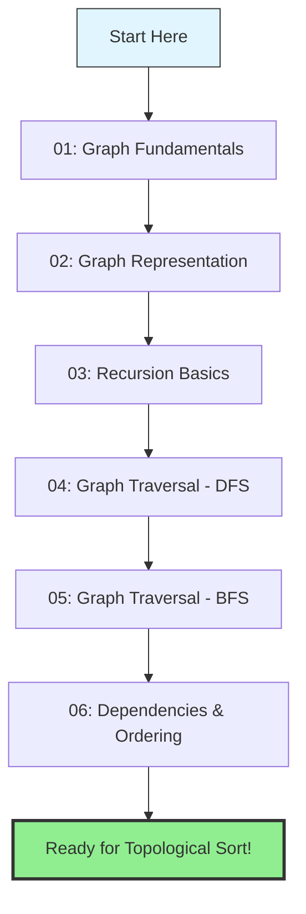
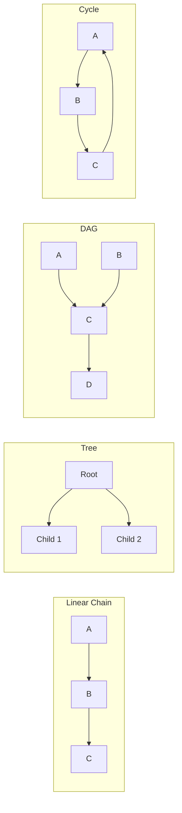

# Graph & Dependency Learning Path

## Overview

This learning path will build your understanding from fundamental concepts to advanced graph algorithms like topological sort. Each guide builds on the previous ones, so it's recommended to study them in order.

## Learning Path

## Prerequisites by Topic

### 01-graph-fundamentals.md
**Prerequisites**: None - Start here!

**You'll Learn**:
- What graphs are and why they matter
- Nodes (vertices) and edges
- Directed vs undirected graphs
- Weighted vs unweighted graphs
- Real-world graph examples

**Connects To**: Understanding task dependencies as a directed graph

---

### 02-graph-representation.md
**Prerequisites**: 01-graph-fundamentals

**You'll Learn**:
- How to represent graphs in memory
- Adjacency lists vs adjacency matrices
- Edge lists
- Maps and sets for efficient lookups
- Space and time tradeoffs

**Connects To**: Efficiently storing task dependencies for quick lookup

---

### 03-recursion-basics.md
**Prerequisites**: Basic programming knowledge

**You'll Learn**:
- What recursion is and how it works
- Base cases and recursive cases
- Call stack visualization
- Common recursion patterns
- When to use recursion vs iteration

**Connects To**: DFS uses recursion to explore dependencies

---

### 04-graph-traversal-dfs.md
**Prerequisites**: 01, 02, 03

**You'll Learn**:
- Depth-First Search algorithm
- Exploring as far as possible before backtracking
- Tracking visited nodes
- Detecting cycles
- Applications of DFS

**Connects To**: Core algorithm for topological sort

---

### 05-graph-traversal-bfs.md
**Prerequisites**: 01, 02

**You'll Learn**:
- Breadth-First Search algorithm
- Level-by-level exploration
- Queue-based processing
- Finding shortest paths
- Applications of BFS

**Connects To**: Alternative approach to topological sort (Kahn's algorithm)

---

### 06-dependencies-and-ordering.md
**Prerequisites**: 01, 02, 04, 05

**You'll Learn**:
- What dependency relationships mean
- Topological ordering concept
- Why some orderings are valid and others aren't
- DAGs (Directed Acyclic Graphs)
- Real-world dependency examples

**Connects To**: Directly prepares you for topological sort problem

---

## Recommended Study Plan

### Week 1: Foundations
- **Day 1-2**: Graph Fundamentals (01)
- **Day 3-4**: Graph Representation (02)
- **Day 5-7**: Practice representing different graphs, draw diagrams

### Week 2: Core Algorithms
- **Day 1-3**: Recursion Basics (03)
- **Day 4-7**: Graph Traversal - DFS (04)

### Week 3: Advanced Traversal
- **Day 1-3**: Graph Traversal - BFS (05)
- **Day 4-7**: Dependencies & Ordering (06)

### Week 4: Application
- **Day 1-7**: Tackle topological sort problem in `/topograph`

## Study Tips

1. **Draw Everything**: Graphs are visual - always sketch them out
2. **Trace Execution**: Walk through algorithms step-by-step with examples
3. **Connect to Real Life**: Think of social networks, file systems, task dependencies
4. **Build Incrementally**: Don't rush - each concept builds on the last
5. **Practice Recognition**: Learn to spot when a problem involves graphs

## Quick Reference

### When to Use Each Traversal

| Use DFS When... | Use BFS When... |
|----------------|-----------------|
| Exploring all paths | Finding shortest path |
| Detecting cycles | Level-order processing |
| Topological sort | Finding nearest neighbors |
| Backtracking problems | Minimum spanning tree |

### Common Graph Patterns

## After This Path

Once you've completed these guides, you'll be ready to:
- Solve topological sort problems
- Understand dependency resolution systems
- Tackle graph-based coding challenges
- Recognize when problems involve graph structures
- Choose appropriate graph algorithms for different problems

## Getting Stuck?

If you find a concept challenging:
1. Re-read the previous guide - you might have missed something foundational
2. Draw more diagrams - visual understanding is key
3. Create your own examples - smaller and simpler
4. Take breaks - graph concepts need time to sink in
5. Review the mermaid diagrams - they show relationships visually

Happy learning! Start with 01-graph-fundamentals.md