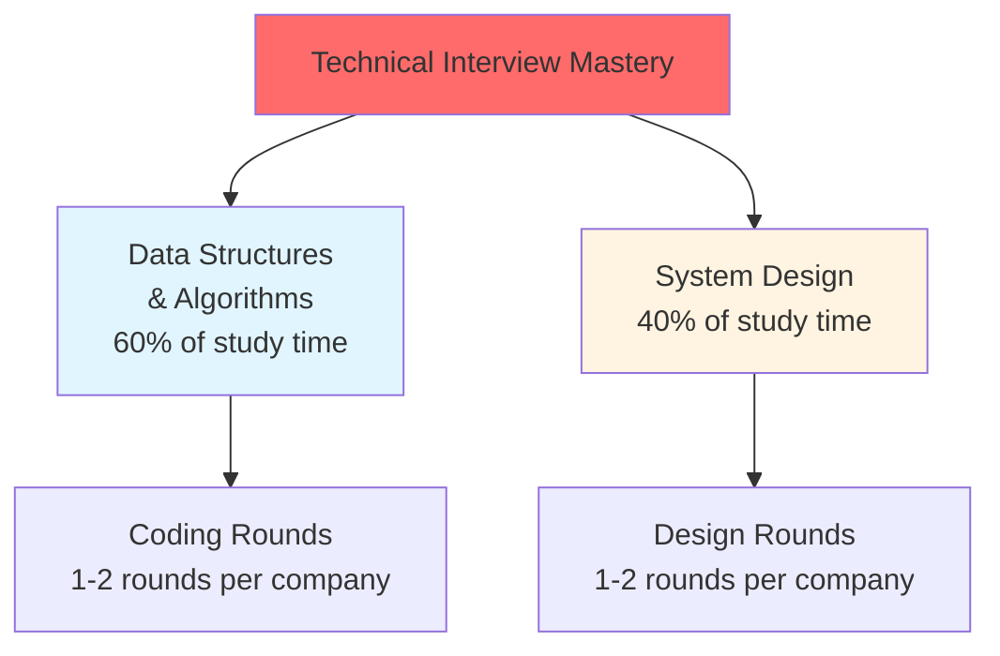
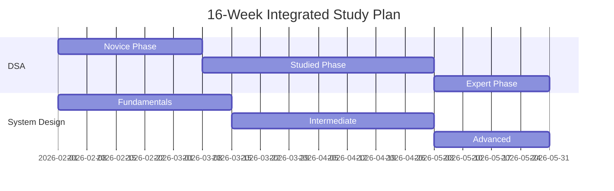

# Master Interview Preparation Guide

> **Your Single Source of Truth for DSA + System Design Mastery**

This guide orchestrates your DSA and System Design preparation into one integrated learning path.

---

## 🎯 The Big Picture

Technical interview preparation requires mastery of two core areas:

---

## ⏱️ Overall Timeline

**Full-time preparation**: 3-4 months of focused study (30-40 hours/week)

| Phase       | Duration  | DSA Focus                               | System Design Focus                                      |
| ----------- | --------- | --------------------------------------- | -------------------------------------------------------- |
| **Month 1** | 4-5 weeks | Novice: Arrays → Recursion              | Fundamentals: Components → Caching                       |
| **Month 2** | 4-5 weeks | Novice → Studied: Binary Search → Trees | Fundamentals → Intermediate: API Design → Simple Systems |
| **Month 3** | 4-5 weeks | Studied: Graphs → Backtracking          | Intermediate: Social → E-commerce Systems                |
| **Month 4** | 4+ weeks  | Studied → Expert: DP → Advanced         | Intermediate → Advanced: Distributed Systems             |

**Part-time preparation**: 6-8 months (15-20 hours/week)

---

## 📚 The Two Pillars

### 1. Data Structures & Algorithms (60% of prep time)

**Purpose**: Pass coding rounds at all tech companies

**Detailed Path**: [`/ysk/dsa/00-complete-dsa-path.md`](../dsa/00-complete-dsa-path.md)

**Timeline**:
- Phase 1 (Novice): 3-5 weeks
- Phase 2 (Studied): 5-8 weeks
- Phase 3 (Expert): Ongoing

**Study Time**: 18-24 hours/week (full-time) or 9-12 hours/week (part-time)

**Target**: Solve 150-200 problems, 70%+ success rate on medium problems

---

### 2. System Design (40% of prep time)

**Purpose**: Pass system design rounds (mid-level and above)

**Detailed Path**: [`/ysk/system-design/00-complete-system-design-path.md`](../system-design/00-complete-system-design-path.md)

**Timeline**:
- Phase 1 (Fundamentals): 4-6 weeks
- Phase 2 (Intermediate): 6-8 weeks
- Phase 3 (Advanced): Ongoing

**Study Time**: 12-16 hours/week (full-time) or 6-8 hours/week (part-time)

**Target**: Design 15+ systems confidently, understand trade-offs deeply

---

## 🗓️ Integrated Study Schedule

### How DSA and System Design Work Together

Both subjects are studied **in parallel** throughout your preparation:

---

## 📅 Week-by-Week Breakdown

### Month 1: Foundation (Weeks 1-5)

**Goal**: Master fundamentals of both DSA and System Design

| Week | DSA (18-24 hrs) | System Design (12-16 hrs) | Total Hrs |
|------|-----------------|---------------------------|-----------|
| **1** | Arrays, Strings, Hash Maps | Core Components (LB, DB, Cache, Queue) | 30-40 |
| **2** | Two Pointers, Sliding Window | Capacity Estimation, Networking Basics | 30-40 |
| **3** | Linked Lists, Stack/Queue | Database Deep Dive (Sharding, Replication) | 30-40 |
| **4** | Recursion & Backtracking (Start) | Caching Strategies & Patterns | 30-40 |
| **5** | Recursion & Backtracking (Continue) | API Design & Rate Limiting | 30-40 |

**Month 1 Checkpoint**:
- ✅ 40-60 DSA problems solved (mostly easy)
- ✅ Understand all core system components
- ✅ Can perform back-of-envelope calculations
- ✅ Comfortable with recursion basics

---

### Month 2: Pattern Recognition (Weeks 6-10)

**Goal**: Build pattern recognition for common problems and systems

| Week   | DSA (18-24 hrs)         | System Design (12-16 hrs)                      | Total Hrs |
| ------ | ----------------------- | ---------------------------------------------- | --------- |
| **6**  | Binary Search           | Simple Systems (URL Shortener, Pastebin)       | 30-40     |
| **7**  | Binary Trees            | Simple Systems (Key-Value Store, Rate Limiter) | 30-40     |
| **8**  | BST, Heaps              | Social Media (Twitter, Instagram)              | 30-40     |
| **9**  | Graph Fundamentals, DFS | Messaging (WhatsApp, Slack)                    | 30-40     |
| **10** | Graph BFS               | Search & Discovery (Autocomplete, Yelp)        | 30-40     |

**Month 2 Checkpoint**:
- ✅ 100-120 DSA problems solved
- ✅ 5-8 systems designed from scratch
- ✅ Recognize common DSA patterns instantly
- ✅ Can design simple-to-moderate systems

---

### Month 3: Advanced Topics (Weeks 11-15)

**Goal**: Handle complex problems and system designs confidently

| Week   | DSA (18-24 hrs)                         | System Design (12-16 hrs)                      | Total Hrs |
| ------ | --------------------------------------- | ---------------------------------------------- | --------- |
| **11** | Advanced Graphs (Topological, Dijkstra) | Video & Media (YouTube, Netflix)               | 30-40     |
| **12** | Backtracking Deep Dive                  | E-commerce & Payments                          | 30-40     |
| **13** | Dynamic Programming 1D                  | Infrastructure (Monitoring, Distributed Cache) | 30-40     |
| **14** | Dynamic Programming 2D                  | Review & Consolidate All Systems               | 30-40     |
| **15** | DP Practice & Review                    | Distributed Systems Fundamentals               | 30-40     |

**Month 3 Checkpoint**:
- ✅ 150-200 DSA problems solved
- ✅ 12-15 systems designed confidently
- ✅ Can solve medium problems 70%+ of the time
- ✅ Understand distributed systems basics

---

### Month 4: Mastery & Refinement (Weeks 16+)

**Goal**: Polish weak areas and tackle advanced topics

| Week | DSA Focus | System Design Focus | Total Hrs |
|------|-----------|---------------------|-----------|
| **16** | Greedy Algorithms, Tries | Advanced Systems (Uber, Google Drive) | 30-40 |
| **17+** | Company-specific practice | Deep dives on complex architectures | 30-40 |

---

## 📊 Daily Schedule Template

### Full-Time Prep (6-8 hours/day)

**Morning Block (3-4 hours)** - DSA Focus:
- 08:00-09:00: Warm up with 1 easy problem
- 09:00-11:00: 2 medium problems (or 1 hard problem)
- 11:00-12:00: Review solutions, study patterns

**Afternoon Block (2-3 hours)** - System Design:
- 13:00-14:30: Study 1 system design OR core concepts
- 14:30-15:30: Draw diagrams, watch tech talks
- 15:30-16:00: Read engineering blogs

**Evening Block (30-60 mins)** - Review:
- Review the day's learnings
- Plan tomorrow's focus

**Weekly Rhythm**:
- **Monday-Friday**: Standard schedule above
- **Saturday**: Longer practice sessions, weak area focus
- **Sunday**: Review week, plan next week, lighter study

---

### Part-Time Prep (3-4 hours/day)

**Weekday (3 hours)**:
- **Alternating Focus**:
  - Mon/Wed/Fri: 2 hours DSA + 1 hour SD
  - Tue/Thu: 1 hour DSA + 2 hours SD
  - This gives you ~8 hours DSA, ~7 hours SD per week

**Weekend (8-10 hours total)**:
- **Saturday** (4-5 hours):
  - 3 hours DSA
  - 2 hours SD
- **Sunday** (4-5 hours):
  - 2 hours DSA
  - 2 hours SD
  - 1 hour review/planning

**Weekly Total**: 15-20 hours (9-11 DSA, 6-9 SD)

---

## 🎯 Study Approach for Each Subject

### DSA Study Pattern

**For each topic** (e.g., Two Pointers, Binary Trees):

1. **Learn the Pattern** (30-60 mins):
   - Watch explanation video (NeetCode, Abdul Bari)
   - Read about the pattern
   - Understand when to use it

2. **Solve Problems** (2-4 hours):
   - Start with easy (2-3 problems)
   - Move to medium (3-5 problems)
   - Attempt hard if time permits (1-2 problems)

3. **Review** (30-60 mins):
   - Review optimal solutions
   - Identify the pattern in each
   - Write down key insights

**Key**: Quality > Quantity. Understand deeply, don't just memorize.

---

### System Design Study Pattern

**For each system** (e.g., Design Twitter):

1. **Study Components** (30-45 mins):
   - What components are needed?
   - How do they interact?

2. **Design the System** (45-60 mins):
   - Functional requirements
   - Back-of-envelope calculations
   - High-level design
   - Database schema
   - API design
   - Deep dives (2-3 areas)

3. **Review Real Implementations** (30-45 mins):
   - Read engineering blogs
   - Watch tech talks
   - Compare your design

4. **Draw It Again** (30 mins):
   - Redraw the architecture from memory
   - Refine based on learnings

**Key**: Understand trade-offs, not just architectures.

---

## 📈 Progress Tracking

### Weekly Self-Check

Every Sunday, answer these:

**DSA**:
- How many problems solved this week? [Target: 10-15]
- What patterns did I learn?
- What's still confusing?
- Success rate on medium problems?

**System Design**:
- How many systems designed? [Target: 1-2]
- What concepts clicked?
- What needs more study?
- Can I draw this system from memory?

**Overall**:
- Did I hit my hour targets?
- Energy level: Good / Okay / Burnt out?
- What to adjust next week?

---

### Monthly Milestones

| Milestone | DSA Target | SD Target | Status |
|-----------|-----------|-----------|--------|
| **End of Month 1** | 40-60 problems, recursion comfortable | All components understood, 2-3 simple systems | 🟡 |
| **End of Month 2** | 100-120 problems, trees/graphs solid | 5-8 systems designed | 🟡 |
| **End of Month 3** | 150-200 problems, DP understood | 12-15 systems, distributed basics | 🟡 |
| **End of Month 4** | 200+ problems, interview ready | 15+ systems, advanced topics | 🟡 |

Legend: 🔴 Behind | 🟡 In Progress | 🟢 On Track | ✅ Complete

---

## 💡 Key Principles

### 1. **Parallel Learning**
- Don't wait to "finish" DSA before starting System Design
- Both reinforce each other
- Variety prevents burnout

### 2. **Time Allocation Matters**
- DSA: 60% (it's tested more frequently, requires more practice)
- System Design: 40% (conceptual, less grinding needed)

### 3. **Depth Over Breadth**
- Better to deeply understand 150 problems than superficially know 300
- Better to design 15 systems well than sketch 30 poorly

### 4. **Spaced Repetition**
- Revisit DSA problems after 3 days, 1 week, 2 weeks
- Re-design systems from memory after 1 week

### 5. **Active Learning**
- DSA: Code every solution, don't just read
- System Design: Draw every architecture, don't just watch

---

## 🔥 Common Pitfalls to Avoid

### 1. **Only Doing DSA**
❌ "I'll do System Design later"
✅ Start both from Week 1, different mental muscles

### 2. **Only Doing System Design**
❌ "DSA is just grinding, boring"
✅ DSA is required for most companies, can't skip

### 3. **Going Too Fast**
❌ Solving 5 problems/day without understanding
✅ 2-3 problems/day with deep understanding

### 4. **No Review**
❌ Solve once and move on
✅ Revisit problems and systems regularly

### 5. **Imbalanced Time**
❌ 90% DSA, 10% System Design (or vice versa)
✅ Stick to 60/40 split roughly

### 6. **Burning Out**
❌ 12-hour days every day
✅ Sustainable 6-8 hours with breaks

---

## 🛠️ Tools & Resources

### DSA Practice
- **LeetCode** - Primary platform (Premium recommended)
  - Use NeetCode 150 or Blind 75 lists
- **NeetCode.io** - Video explanations
- **AlgoExpert** - Structured learning (optional)

### System Design Study
- **Excalidraw** - Free drawing tool for diagrams
- **ByteByteGo** - Visual system design explanations
- **System Design Primer** (GitHub) - Comprehensive reference
- **Engineering Blogs**:
  - Netflix Tech Blog
  - Uber Engineering
  - Meta Engineering
  - AWS Architecture Blog

### General
- **Notion/Obsidian** - Track progress and notes
- **Anki** - Spaced repetition for concepts
- **YouTube**: NeetCode, Gaurav Sen, Tech Dummies

---

## 📍 Your Current Position

**Current Week**: Week 1
**Current Phase**: Month 1 / Foundation

**DSA**: Starting Novice Phase
- See: [`/ysk/dsa/00-complete-dsa-path.md`](../dsa/00-complete-dsa-path.md)
- Current Topic: Arrays & Strings

**System Design**: Starting Fundamentals Phase
- See: [`/ysk/system-design/00-complete-system-design-path.md`](../system-design/00-complete-system-design-path.md)
- Current Topic: Core Components

**Next Milestones**:
1. Complete Week 1 (Arrays, Strings, Hash Maps + Core Components)
2. Solve first 15-20 DSA problems
3. Understand Load Balancers, Databases, Caches
4. Perform first capacity estimation

---

## 🚀 Getting Started (Week 1 Action Items)

### Setup (Day 1)
- [ ] Read this entire master guide
- [ ] Skim both DSA and System Design paths
- [ ] Set up LeetCode account (get Premium)
- [ ] Install Excalidraw or similar drawing tool
- [ ] Create simple tracking doc (problems solved, systems designed)

### DSA (Days 1-7)
- [ ] Start Arrays & Strings topic
- [ ] Solve 3-4 easy array problems
- [ ] Solve 2-3 easy string problems
- [ ] Start Hash Maps topic
- [ ] Solve 2-3 Hash Map problems
- [ ] **Target**: 10-12 problems total

### System Design (Days 1-7)
- [ ] Study Load Balancers (L4 vs L7)
- [ ] Study Databases (SQL vs NoSQL)
- [ ] Study Caching layers
- [ ] Study Message Queues
- [ ] Draw a basic 3-tier architecture
- [ ] Learn CAP theorem basics

---

## 📊 Sample Week 1 Detailed Schedule

### Full-Time Example

**Monday**:
- 08:00-09:00: LeetCode - Two Sum (easy)
- 09:00-10:30: LeetCode - Contains Duplicate, Valid Anagram
- 10:30-12:00: Study Hash Map pattern, review solutions
- 13:00-14:30: Study Load Balancers (types, algorithms)
- 14:30-16:00: Study Databases (SQL vs NoSQL, when to use each)

**Tuesday**:
- 08:00-09:00: LeetCode - Reverse String (easy)
- 09:00-10:30: LeetCode - Valid Palindrome, Longest Substring
- 10:30-12:00: Review string manipulation patterns
- 13:00-14:30: Study Caching (strategies, eviction policies)
- 14:30-16:00: Draw cache layer architecture

[Continue for rest of week...]

---

## 💪 Staying Motivated

### Remember Why You Started
- Landing dream job
- Better compensation
- Interesting technical work
- Career growth

### Celebrate Small Wins
- First problem solved independently
- First medium problem solved
- First system designed from scratch
- Week 4 completed (one month!)
- Month 2 milestone hit

### When It Gets Hard
- Week 1-2: "This is new but manageable"
- Week 3-5: "Recursion is tough" (normal!)
- Week 6-10: "So many patterns" (they'll click!)
- Week 11-15: "DP is hard" (everyone struggles!)
- Week 16+: "It's starting to come together!"

**Trust the process. Consistency compounds.** 🚀

---

## 📚 Quick Links

- **DSA Path**: [`/ysk/dsa/00-complete-dsa-path.md`](../dsa/00-complete-dsa-path.md)
- **System Design Path**: [`/ysk/system-design/00-complete-system-design-path.md`](../system-design/00-complete-system-design-path.md)

---

*Last Updated*: 2026-02-02
*Focus*: DSA + System Design Mastery
*Timeline*: 3-4 months to interview-ready
