# Graph Fundamentals

## What is a Graph?

A graph is a data structure that represents relationships between things. It consists of:
- **Nodes** (also called vertices): The "things" or entities
- **Edges** (also called connections): The relationships between nodes

Think of it like a social network: people are nodes, friendships are edges.

## Visual Understanding

### Basic Graph Structure

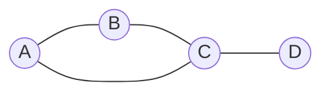

This graph has:
- 4 nodes: A, B, C, D
- 5 edges: A-B, B-C, A-C, C-D

## Directed vs Undirected Graphs

### Undirected Graph
Relationships go both ways (like mutual friendships).

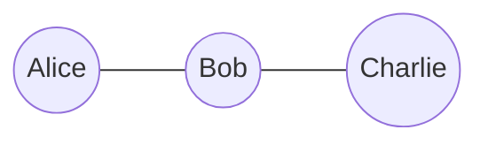

If Alice is connected to Bob, then Bob is connected to Alice.

### Directed Graph (Digraph)
Relationships have direction (like Twitter follows, file dependencies).

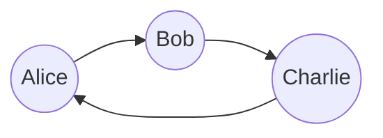

Alice follows Bob, but Bob might not follow Alice back.

**Connection to Topological Sort**: Task dependencies are directed! If B depends on A, there's an arrow from A → B.

## Real-World Examples

### Social Network (Undirected)

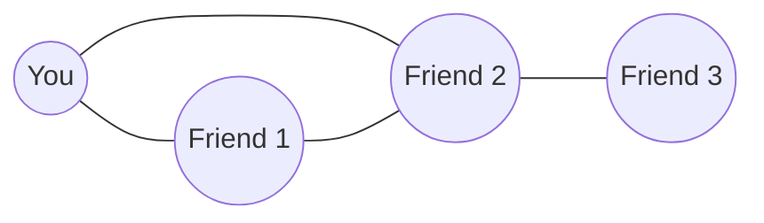

Friendships are mutual (undirected).

### File Dependencies (Directed)

main.js depends on utils.js, but not the other way around (directed).

### Course Prerequisites (Directed)

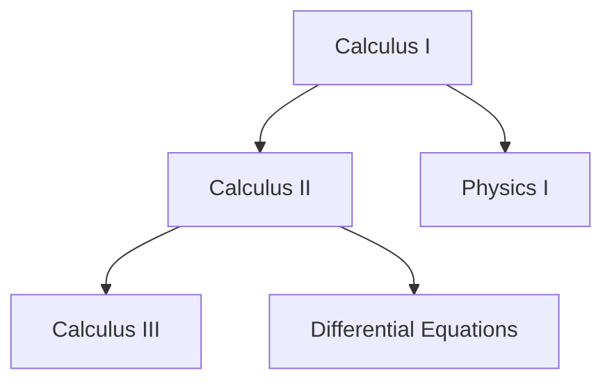

You must take Calculus I before Calculus II (directed).

**Connection to Topological Sort**: This is exactly what topological sort solves - finding a valid order to take courses!

## Graph Properties

### Degree
The number of edges connected to a node.

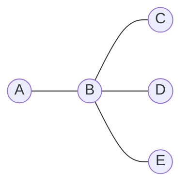

- Node B has degree 4 (connected to A, C, D, E)
- Node A has degree 1 (connected only to B)

### In-Degree and Out-Degree (Directed Graphs)

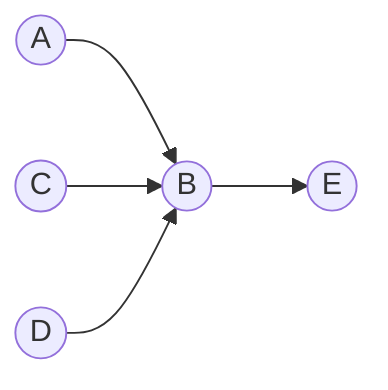

For node B:
- **In-degree** = 3 (edges coming in: from A, C, D)
- **Out-degree** = 1 (edges going out: to E)

**Connection to Topological Sort**: Tasks with in-degree 0 have no dependencies and can run first!

## Special Types of Graphs

### Tree
A connected graph with no cycles. Every node has exactly one parent (except root).

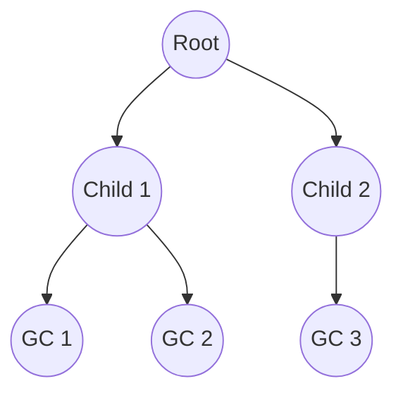

Properties:
- No cycles
- N nodes have N-1 edges
- One path between any two nodes

### DAG (Directed Acyclic Graph)
A directed graph with no cycles.

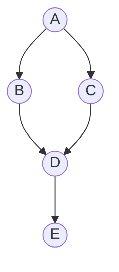

Properties:
- Has direction
- No cycles (can't get back to where you started)
- Can have multiple paths to the same node

**Connection to Topological Sort**: Task dependencies MUST form a DAG - otherwise you have circular dependencies!

### Cyclic Graph
A graph with at least one cycle.

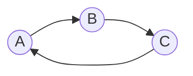

This has a cycle: A → B → C → A

**Why This Matters**: If your tasks have a cycle, there's no valid ordering! (Task A needs B, B needs C, C needs A - impossible!)

## Paths and Cycles

### Path
A sequence of nodes connected by edges.

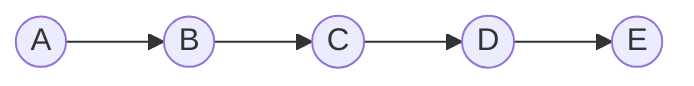

Path from A to E: A → B → C → D → E

### Cycle
A path that starts and ends at the same node.

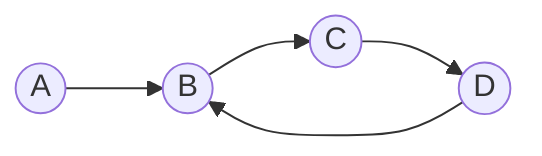

Cycle: B → C → D → B

## Connected vs Disconnected Graphs

### Connected Graph
Every node can be reached from every other node.

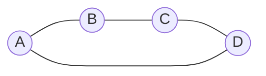

### Disconnected Graph
Some nodes can't reach others.

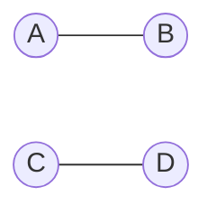

Two separate components: {A, B} and {C, D}

**Connection to Topological Sort**: Your task graph might be disconnected - that's okay! You process each component independently.

## Weighted vs Unweighted Graphs

### Unweighted
All edges are equal (just represent connection).

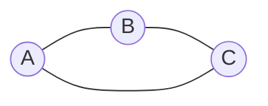

### Weighted
Edges have values (distance, cost, time, etc.).

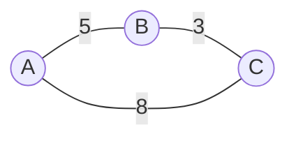

Numbers represent weights (e.g., miles between cities).

**Connection to Topological Sort**: Task dependencies are usually unweighted - you just care about the order, not "how much" one depends on another.

## Common Graph Terminology

| Term | Meaning | Example |
|------|---------|---------|
| **Vertex/Node** | A point in the graph | A person, a task, a city |
| **Edge** | Connection between vertices | Friendship, dependency, road |
| **Adjacent** | Two nodes connected by an edge | A and B are adjacent if there's an edge A-B |
| **Path** | Sequence of edges connecting nodes | A → B → C |
| **Cycle** | Path that returns to start | A → B → C → A |
| **Degree** | Number of edges at a node | Node with 3 connections has degree 3 |
| **Connected** | All nodes reachable from each other | Entire graph is one piece |
| **Component** | Subset of connected nodes | Separate islands in the graph |

## Why Graphs Matter

Graphs model countless real-world problems:
- **Social networks**: People and friendships
- **Maps**: Cities and roads
- **Dependencies**: Files, tasks, courses
- **Internet**: Web pages and links
- **Biology**: Molecules and bonds
- **Recommendations**: Items and similarities

## Mental Models

### Think of Graphs As...

1. **Networks**: Like a spider web of connections
2. **Maps**: Cities (nodes) connected by roads (edges)
3. **Organizations**: People (nodes) and reporting relationships (edges)
4. **Dependencies**: Tasks (nodes) and "requires" relationships (edges)

### Key Questions to Ask

When you see a graph problem:
1. Is it directed or undirected?
2. Are there cycles?
3. Is it weighted or unweighted?
4. Is it connected or disconnected?
5. What do nodes represent?
6. What do edges represent?

## Practice Recognition

### Which Graph Type?

**Scenario 1**: A family tree
- Answer: Directed, Acyclic (DAG), Tree structure
- Why: Parents point to children, no cycles, single parent

**Scenario 2**: A road network with distances
- Answer: Undirected, Weighted, May have cycles
- Why: Roads go both ways, distances matter, can have loops

**Scenario 3**: Build system dependencies
- Answer: Directed, Acyclic (DAG), Unweighted
- Why: File A depends on B (directed), no circular deps (acyclic), just ordering matters

**Scenario 4**: Flight routes with prices
- Answer: Directed, Weighted, Has cycles
- Why: Flights have direction, prices vary, can fly in circles

## Connecting to Topological Sort

The topological sort problem involves:
- **Directed graph**: Dependencies have direction
- **DAG**: Must be acyclic (no circular dependencies)
- **Unweighted**: Just care about ordering
- **Nodes**: Tasks
- **Edges**: Dependencies (A → B means "B depends on A")

Understanding these fundamentals makes it clear why topological sort works the way it does!

## Next Steps

Now that you understand what graphs are, the next step is learning how to represent them in code. Move on to **02-graph-representation.md** to learn about adjacency lists, adjacency matrices, and efficient data structures for graphs.

## Key Takeaways

- Graphs model relationships between things
- Directed graphs have one-way relationships
- DAGs (Directed Acyclic Graphs) are crucial for dependency problems
- In-degree tells you how many dependencies a node has
- Cycles make ordering impossible
- Real-world problems are often graph problems in disguise
