# Graph Representation in Code

## The Challenge

Graphs exist conceptually, but how do we store them in memory so we can actually work with them? We need data structures that let us efficiently:
- Find all neighbors of a node
- Check if an edge exists
- Add/remove nodes and edges
- Traverse the graph

## Three Main Representations

### 1. Edge List
### 2. Adjacency Matrix
### 3. Adjacency List

Let's explore each with this example graph:


## 1. Edge List

Simply store all edges as pairs.

### Conceptual View

```
Edges:
A → B
A → C
B → D
C → D
```

### Data Structure Visualization


### When to Use
- When you mainly iterate through all edges
- When you rarely need to find neighbors
- For simple graph storage

### Pros and Cons

✅ **Pros**:
- Simple to implement
- Space efficient: O(E) where E = number of edges
- Easy to add edges

❌ **Cons**:
- Finding neighbors is slow: O(E)
- Checking if edge exists: O(E)
- Poor for graph traversal

**Connection to Topological Sort**: Not ideal - we need to frequently find dependencies (neighbors), which is slow with edge lists.

## 2. Adjacency Matrix

Use a 2D matrix where matrix[i][j] = 1 if edge from i to j exists.

### Conceptual View

```
     A  B  C  D
  A [0  1  1  0]
  B [0  0  0  1]
  C [0  0  0  1]
  D [0  0  0  0]
```

matrix[A][B] = 1 means edge A → B exists
matrix[B][A] = 0 means edge B → A doesn't exist

### Visual Representation


### When to Use
- When you have dense graphs (many edges)
- When you need fast edge lookup
- When number of nodes is small and fixed

### Pros and Cons

✅ **Pros**:
- Fast edge lookup: O(1)
- Fast to add/remove edges: O(1)
- Good for dense graphs

❌ **Cons**:
- Space inefficient: O(V²) where V = number of nodes
- Finding neighbors: O(V)
- Wastes space if graph is sparse

**Connection to Topological Sort**: Not ideal - task dependency graphs are usually sparse (most tasks don't depend on most other tasks), so we'd waste lots of space.

## 3. Adjacency List

Store each node with a list of its neighbors.

### Conceptual View

```
A → [B, C]
B → [D]
C → [D]
D → []
```

Node A points to nodes B and C
Node D points to nothing

### Data Structure Visualization



```mermaid
graph LR
    subgraph "Adjacency List"
        A[Node A] --> AB[B]
        A --> AC[C]
        B[Node B] --> BD[D]
        C[Node C] --> CD[D]
        D[Node D] --> Empty[∅]
    end
```

### Different Implementation Options

#### Option 1: Map of Arrays


#### Option 2: Map of Sets


### When to Use
- Most graph algorithms (including topological sort!)
- When graph is sparse
- When you need to find neighbors frequently

### Pros and Cons

✅ **Pros**:
- Space efficient for sparse graphs: O(V + E)
- Fast neighbor lookup: O(1) with hash map
- Efficient iteration through neighbors: O(degree of node)
- Matches how we think about graphs

❌ **Cons**:
- Edge existence check: O(degree) without Set
- Slightly more complex than edge list

**Connection to Topological Sort**: Perfect! This is what we use. Quick neighbor lookup and space-efficient for sparse dependency graphs.

## Comparison Table

| Operation | Edge List | Adjacency Matrix | Adjacency List |
|-----------|-----------|------------------|----------------|
| **Space** | O(E) | O(V²) | O(V + E) |
| **Find neighbors** | O(E) | O(V) | O(degree) |
| **Check edge exists** | O(E) | O(1) | O(degree)* |
| **Add edge** | O(1) | O(1) | O(1) |
| **Remove edge** | O(E) | O(1) | O(degree) |
| **Best for** | Simple storage | Dense graphs | Sparse graphs |

\* O(1) if using Set instead of Array

## Choosing the Right Representation

### Decision Tree


### Graph Density

**Sparse Graph**: Few edges compared to possible edges
- Social networks (most people aren't friends with everyone)
- File dependencies (files don't depend on all other files)
- Use: **Adjacency List**

**Dense Graph**: Many edges
- Complete graph (every node connects to every other)
- Small, highly connected networks
- Use: **Adjacency Matrix**

## Maps and Sets for Efficiency

Understanding these data structures is crucial for efficient graph operations.

### Map (Dictionary/HashMap)


**Key Properties**:
- O(1) lookup by key
- O(1) insertion
- O(1) deletion
- Perfect for node → neighbors mapping

### Set


**Key Properties**:
- O(1) membership check
- O(1) insertion
- O(1) deletion
- No duplicates
- Perfect for tracking visited nodes

**Connection to Topological Sort**: We use:
- Map: to store task → dependencies
- Set: to track visited tasks

## Building Adjacency List from Task Dependencies

Let's see how task dependencies become an adjacency list.

### Given Data

```
Tasks:
- A: deps = []
- B: deps = [A]
- C: deps = [A]
- D: deps = [B, C]
```

### Step 1: Understand the Direction


B depends on A → edge from A to B
(A must come before B)

### Step 2: Build Adjacency List

```
Graph (task → what depends on it):
A → [B, C]
B → [D]
C → [D]
D → []
```

OR

```
Graph (task → what it depends on):
A → []
B → [A]
C → [A]
D → [B, C]
```

**Important**: Direction matters! Choose based on your algorithm.

For topological sort:
- **Forward direction** (task → dependents): Better for some algorithms
- **Reverse direction** (task → dependencies): Better for DFS approach

## Memory Layout Visualization

### Adjacency List in Memory

```mermaid
graph TB
    subgraph "Memory Layout"
        direction TB

        Map["Map/Object in Memory"]

        subgraph "Node A Entry"
            KeyA["Key: 'A'"]
            RefA["→ Reference"]
            ArrA["Array: ['B', 'C']"]
        end

        subgraph "Node B Entry"
            KeyB["Key: 'B'"]
            RefB["→ Reference"]
            ArrB["Array: ['D']"]
        end

        Map --> KeyA
        Map --> KeyB
        RefA --> ArrA
        RefB --> ArrB
    end
```



### Array vs Set Trade-off

**Array of neighbors**:
```
A → ['B', 'C']
```
- Maintains insertion order
- Allows duplicates (might not want this)
- Check if neighbor exists: O(n)

**Set of neighbors**:
```
A → Set{'B', 'C'}
```
- No duplicates automatically
- Check if neighbor exists: O(1)
- No guaranteed order

**Connection to Topological Sort**: Usually use Array (or Map) since we don't need frequent "is neighbor?" checks.

## Reverse Graph

Sometimes you need both directions.

### Original Graph


Adjacency List:
```
A → [B, C]
B → [D]
C → [D]
D → []
```

### Reverse Graph


Reverse Adjacency List:
```
A → []
B → [A]
C → [A]
D → [B, C]
```

**When Needed**:
- Finding what depends on a node
- Some topological sort variants
- Finding predecessors

## Implementation Patterns

### Pattern 1: Build from Edge List

```mermaid
graph LR
    subgraph "Input"
        Edges["Edges:<br/>[A,B]<br/>[A,C]<br/>[B,D]"]
    end

    Process["Process each edge<br/>Add to map"]

    subgraph "Output"
        AdjList["A → [B,C]<br/>B → [D]<br/>C → []<br/>D → []"]
    end

    Edges --> Process --> AdjList
```



### Pattern 2: Build from Objects with Dependencies

```mermaid
graph LR
    subgraph "Input"
        Tasks["Tasks:<br/>A: deps=[]<br/>B: deps=[A]<br/>C: deps=[A]"]
    end

    Process["For each task<br/>Map ID to deps"]

    subgraph "Output"
        DepMap["A → []<br/>B → [A]<br/>C → [A]"]
    end

    Tasks --> Process --> DepMap
```



**Connection to Topological Sort**: Pattern 2 is exactly what we do! We have tasks with dependencies, and we build a map.

## Space Complexity Deep Dive

### Why Adjacency List is O(V + E)


- V map entries (one per node)
- Total of E items across all lists (one per edge)

For sparse graphs where E ≈ V:
- Adjacency List: O(V)
- Adjacency Matrix: O(V²) 😱

## Common Pitfalls

### Pitfall 1: Wrong Direction

Building graph in reverse of what algorithm needs.

```mermaid
graph LR
    subgraph "Task Dependencies"
        B[B: deps=[A]]
    end

    Wrong["Wrong:<br/>B → [A]<br/>(task → dependencies)"]
    Right["Right for some algos:<br/>A → [B]<br/>(task → dependents)"]

    B -.-> Wrong
    B -.-> Right
```

**Solution**: Understand which direction your algorithm needs!

### Pitfall 2: Forgetting Nodes with No Edges

```
Graph: A → B
```

Don't forget to include B in your map!
```
Wrong: { A: [B] }
Right: { A: [B], B: [] }
```

### Pitfall 3: Using Array When Set Would Be Better

If checking "is X a neighbor?" frequently, use Set not Array.

## Key Takeaways

1. **Adjacency List** is the most common representation for sparse graphs
2. **Map** gives O(1) node lookup
3. **Set** gives O(1) duplicate prevention and membership checking
4. Direction matters - build graph based on algorithm needs
5. Space complexity O(V + E) is efficient for sparse graphs
6. Include all nodes in representation, even if they have no edges

## Connection to Topological Sort

In the topological sort problem:
- We receive tasks with dependencies
- We build a **Map** from task ID to task object
- We might build an adjacency list (depending on approach)
- We use **Set** to track visited tasks
- This is all **Adjacency List** representation!

Understanding these data structures is essential for implementing efficient graph algorithms.

## Next Steps

Now that you know how to represent graphs in memory, you need to understand **recursion** to implement depth-first search. Move on to **03-recursion-basics.md** to build that foundation.
