# Recursion Basics

## What is Recursion?

Recursion is when a function calls itself. It's a powerful technique for solving problems that can be broken down into smaller, similar subproblems.

Think of it like Russian nesting dolls - each doll contains a smaller version of itself, until you reach the smallest doll that doesn't contain anything.

## The Core Concept

### Visual Model: Opening Nesting Dolls

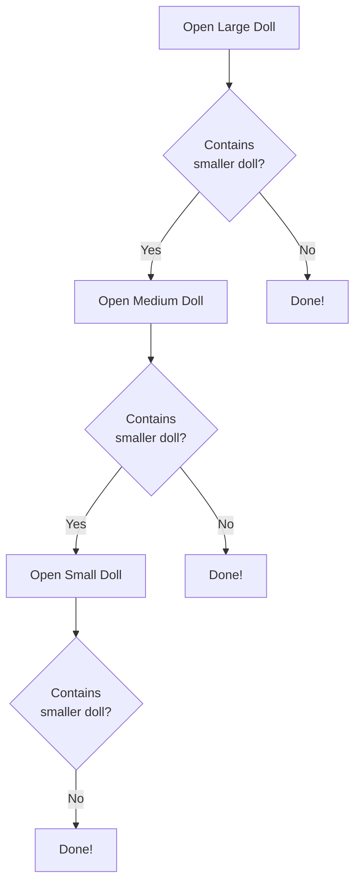

Each step follows the same process:
1. Open doll
2. Check if there's a smaller doll inside
3. If yes, repeat with smaller doll
4. If no, done!

This is recursion - doing the same thing on smaller versions until you can't anymore.

## Two Essential Parts

Every recursive function needs:

### 1. Base Case
The stopping condition - when to STOP recursing.

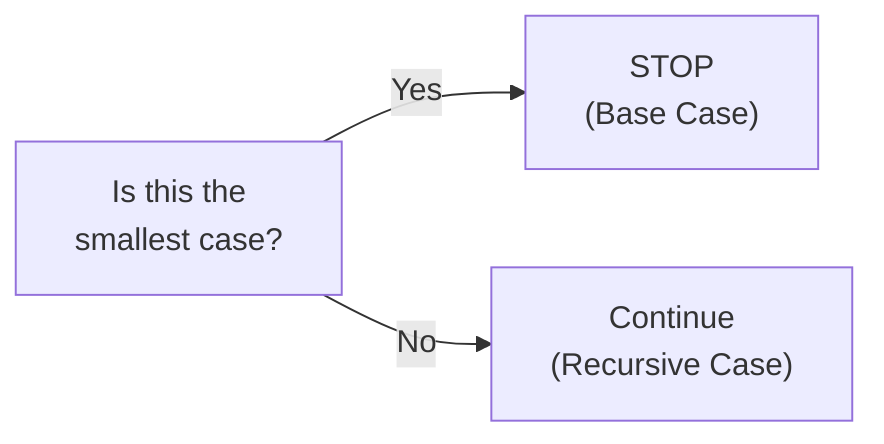

### 2. Recursive Case
The case where the function calls itself with a smaller problem.

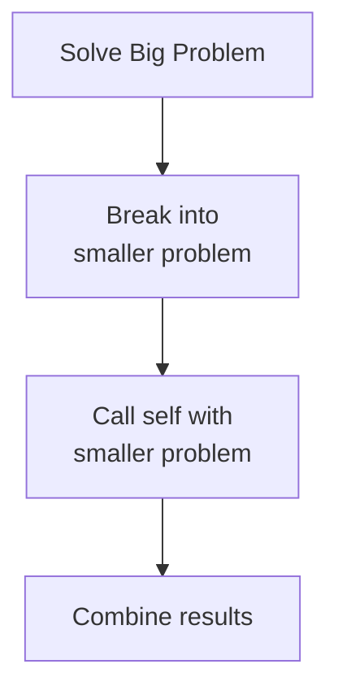

## Simple Example: Countdown

### Mental Model

Counting down from 3 to 1:

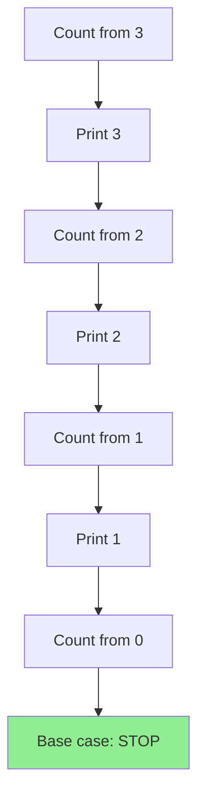

### Breakdown

```
countdown(3)
  Print "3"
  countdown(2)
    Print "2"
    countdown(1)
      Print "1"
      countdown(0)
        Base case! Stop.
```

**Base case**: When n = 0, stop
**Recursive case**: Print n, then countdown(n - 1)

## The Call Stack Visualized

When recursion happens, the computer uses a "call stack" to remember where it is.

### Stack Growth and Shrinkage

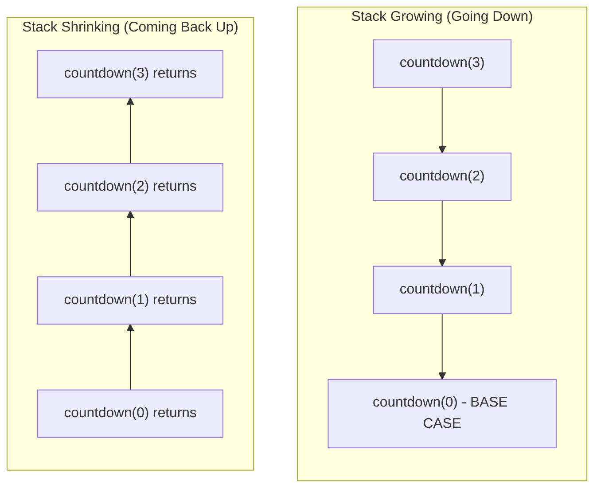

### Stack Frame Details

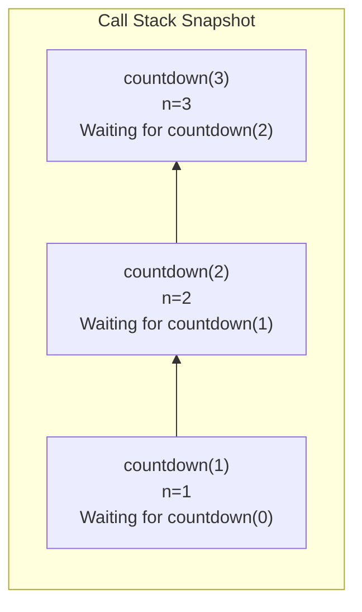

Each level remembers:
- Its own parameters
- Where to return to
- What to do after the recursive call returns

**Connection to Topological Sort**: When we recursively visit task dependencies, the call stack remembers which task we're processing and which dependencies we still need to visit.

## Classic Example: Factorial

Factorial of n: n! = n × (n-1) × (n-2) × ... × 1

### Recursive Thinking

```mermaid
graph TB
    Q["What is 5! ?"] --> Break["5 × (4!)"]
    Break --> Q2["What is 4! ?"]
    Q2 --> Break2["4 × (3!)"]
    Break2 --> Q3["What is 3! ?"]
    Q3 --> Break3["3 × (2!)"]
    Break3 --> Q4["What is 2! ?"]
    Q4 --> Break4["2 × (1!)"]
    Break4 --> Base["1! = 1<br/>(Base Case)"]

    style Base fill:#90EE90
```

### Unwinding the Stack

```mermaid
graph BT
    B["1! = 1"] --> R2["2! = 2 × 1 = 2"]
    R2 --> R3["3! = 3 × 2 = 6"]
    R3 --> R4["4! = 4 × 6 = 24"]
    R4 --> R5["5! = 5 × 24 = 120"]

    style B fill:#90EE90
    style R5 fill:#FFD700
```

**Key Insight**: We go all the way down to the base case, then build back up!

## Recursion vs Iteration

The same problem can often be solved iteratively (with loops) or recursively.

### Iterative Approach (Loop)

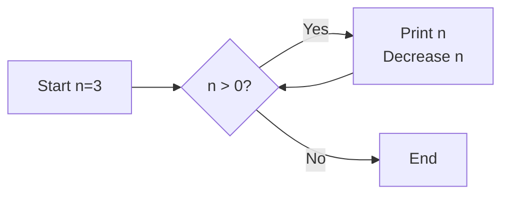

Sequential, straightforward, uses explicit loop.

### Recursive Approach (Function Calls)

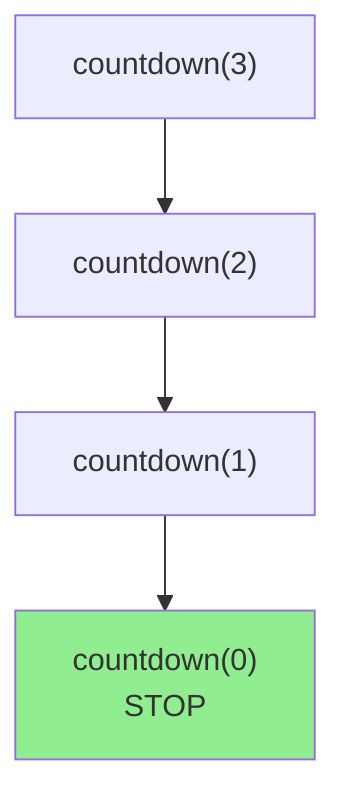

Elegant, self-referential, uses call stack.

### When to Choose Recursion

| Use Recursion When... | Use Iteration When... |
|----------------------|----------------------|
| Problem naturally divides into subproblems | Simple sequential processing |
| Working with trees/graphs | Simple loops |
| Solution is clearer with recursion | Performance is critical |
| Backtracking is needed | Stack space is limited |

**Connection to Topological Sort**: Graph traversal is naturally recursive - "to visit a node, first visit all its dependencies" is recursive thinking!

## Understanding the Call Stack Limit

Each recursive call takes stack space. Too many levels = stack overflow!

### Stack Overflow Visualization

```mermaid
graph TB
    subgraph "Call Stack"
        direction BT
        C1["Call 1"] --> C2["Call 2"]
        C2 --> C3["Call 3"]
        C3 --> Dots["..."]
        Dots --> C1000["Call 1000"]
        C1000 --> Overflow["Stack Overflow! 💥"]
    end

    style Overflow fill:#ff6b6b
```

**Important**: Most languages have a maximum call stack depth (often 1000-10000 calls).

For topological sort with reasonable task graphs (hundreds or thousands of tasks), this is rarely an issue.

## Tail Recursion

A special form where the recursive call is the last thing the function does.

### Regular Recursion (Not Tail)

```mermaid
graph TB
    F1["factorial(5)"] --> R1["Recursive call:<br/>factorial(4)"]
    R1 --> W1["Wait for result"]
    W1 --> M1["Multiply: 5 × result"]
```

Must remember to multiply after return!

### Tail Recursion

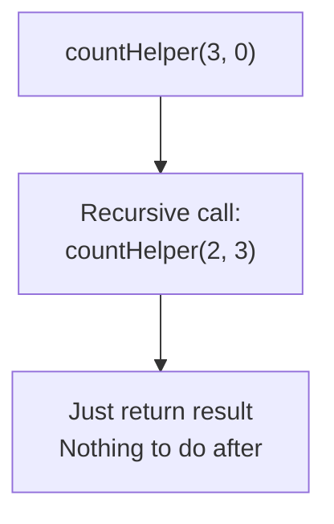

Some compilers optimize tail recursion to not use extra stack space.

## Common Recursion Patterns

### Pattern 1: Process and Recurse

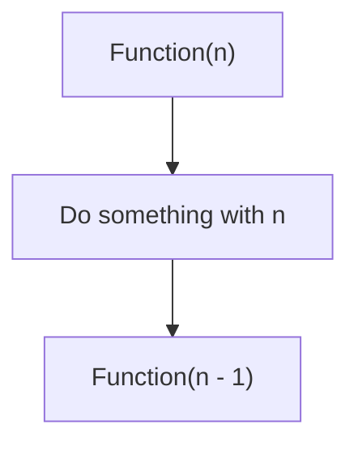

Example: Print, then recurse

### Pattern 2: Recurse and Process

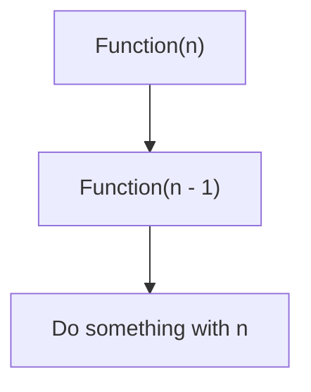

Example: Recurse first, then print (reverse order)

### Pattern 3: Multiple Recursion

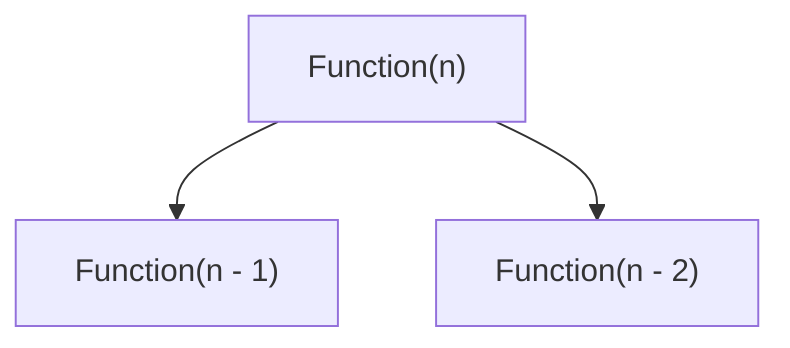

Example: Fibonacci (calls itself twice)

**Connection to Topological Sort**: We use Pattern 2 - visit dependencies first (recurse), then add task to result (process).

## Recursion with Multiple Branches

Some problems need to explore multiple paths.

### Binary Tree Traversal

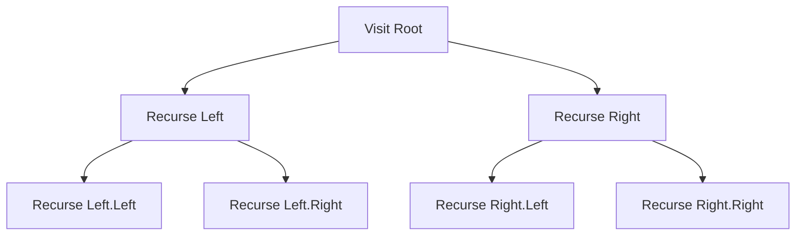

**Connection to Topological Sort**: Tasks can have multiple dependencies - we recurse into each one!

## Tracking State in Recursion

Often need to track what we've already processed.

### Without Tracking (Dangerous!)

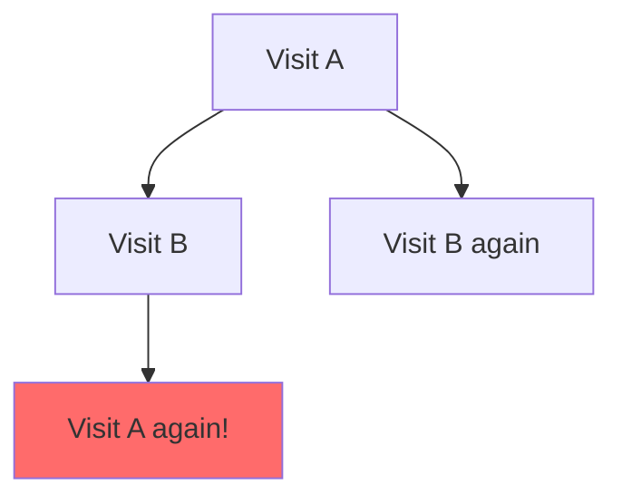

Can lead to infinite recursion or redundant work!

### With Tracking (Safe)

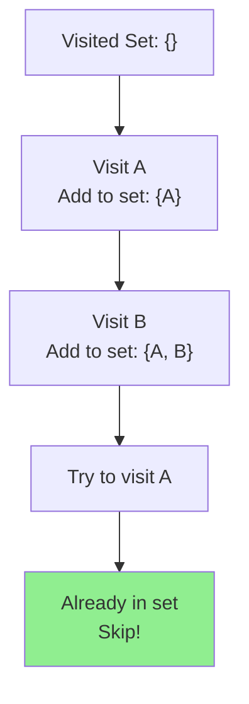

**Connection to Topological Sort**: We use a `visited` Set to avoid processing the same task twice!

## Recursion for Graph Traversal

This is the key concept for topological sort!

### Graph Structure

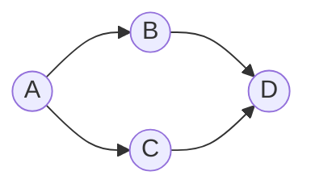

### Recursive Traversal

```mermaid
graph TB
    Start["Visit A<br/>Visited: {A}"] --> RecB["Recurse: Visit B<br/>Visited: {A, B}"]
    Start --> RecC["Recurse: Visit C<br/>Visited: {A, B, C}"]

    RecB --> RecD1["Recurse: Visit D<br/>Visited: {A, B, D}"]

    RecC --> CheckD["Try to visit D"]
    CheckD --> SkipD["Already visited!<br/>Skip"]

    style SkipD fill:#90EE90
```

**Key Points**:
1. Visit a node
2. Mark it as visited
3. Recursively visit all neighbors
4. Skip already-visited nodes

This is **Depth-First Search** - the foundation of our topological sort solution!

## Base Cases in Graph Traversal

### No More Neighbors

```mermaid
graph TB
    Node["Visit Node X"] --> Check{Has unvisited<br/>neighbors?}
    Check -->|No| Return["Base case!<br/>Return"]
    Check -->|Yes| Recurse["Recurse into<br/>neighbors"]
```

### Already Visited

```mermaid
graph TB
    Visit["Try to visit Node"] --> Checked{Already<br/>visited?}
    Checked -->|Yes| Early["Base case!<br/>Return early"]
    Checked -->|No| Process["Process node"]
```

**Connection to Topological Sort**: Both of these are base cases in our solution!

## Common Recursion Mistakes

### Mistake 1: Missing Base Case

```mermaid
graph TB
    F["Function(5)"] --> F2["Function(4)"]
    F2 --> F3["Function(3)"]
    F3 --> Dots["..."]
    Dots --> Boom["Never stops!<br/>Stack Overflow 💥"]

    style Boom fill:#ff6b6b
```

**Solution**: Always define when to stop!

### Mistake 2: Wrong Recursive Step

```mermaid
graph TB
    F["countdown(3)"] --> Wrong["countdown(3) again"]
    Wrong --> Forever["Infinite loop!"]

    style Forever fill:#ff6b6b
```

**Solution**: Ensure each recursive call moves toward the base case!

### Mistake 3: Forgetting to Return Result

```mermaid
graph TB
    Calc["Calculate result"] --> Recurse["Get recursive result"]
    Recurse --> Forgot["Forgot to return it! 🤦"]

    style Forgot fill:#ff6b6b
```

**Solution**: Don't forget to return or use the recursive result!

## Recursion and Memory

### Stack Memory Usage

```mermaid
graph TB
    subgraph "Memory Per Call"
        Params["Parameters"]
        Local["Local variables"]
        Return["Return address"]
    end

    Deep["Deep recursion<br/>(1000s of calls)"] --> HighMem["High memory usage"]
    Shallow["Shallow recursion<br/>(10s of calls)"] --> LowMem["Low memory usage"]

    style HighMem fill:#ffeb99
    style LowMem fill:#90EE90
```

**For Topological Sort**: Depth is limited by longest dependency chain, usually not a problem.

## Converting Recursion to Iteration

Sometimes you need to convert recursive solutions to iterative ones.

### Recursive Version

```mermaid
graph TB
    A["Visit(A)"] --> B["Visit(B)"]
    B --> D["Visit(D)"]
    D --> BaseD["Base: Return"]
    BaseD --> RetB["Return to B"]
    RetB --> RetA["Return to A"]
    RetA --> C["Visit(C)"]
```

### Iterative Version (Using Explicit Stack)

```mermaid
graph TB
    Stack["Stack: [A]"] --> Pop1["Pop A, process it<br/>Push neighbors [B, C]"]
    Pop1 --> Stack2["Stack: [B, C]"]
    Stack2 --> Pop2["Pop C, process it<br/>Push neighbors [D]"]
    Pop2 --> Stack3["Stack: [B, D]"]
    Stack3 --> Pop3["Pop D, process it<br/>No neighbors"]
    Pop3 --> Stack4["Stack: [B]"]
```

**Key Insight**: Explicit stack replaces call stack!

## Thinking Recursively

### The Mental Shift

Instead of thinking "How do I do all steps?", think:
1. "How do I do one step?"
2. "How do I reduce the problem?"
3. "What's the smallest case?"

### Example: Sum Array

**Iterative thinking**:
"Loop through all elements and add them"

**Recursive thinking**:
"The sum is: first element + sum of the rest"

```mermaid
graph TB
    Q["Sum([1,2,3,4])"] --> Break["1 + Sum([2,3,4])"]
    Break --> Q2["Sum([2,3,4])"]
    Q2 --> Break2["2 + Sum([3,4])"]
    Break2 --> Q3["Sum([3,4])"]
    Q3 --> Break3["3 + Sum([4])"]
    Break3 --> Q4["Sum([4])"]
    Q4 --> Base["Base: 4"]
```

**Connection to Topological Sort**: "To order tasks with dependencies, first order their dependencies"

## Key Takeaways

1. **Recursion** = function calling itself
2. Need **base case** (when to stop) and **recursive case** (call itself)
3. **Call stack** remembers where we are
4. Use **visited tracking** to avoid infinite loops in graphs
5. Recursion is natural for **tree/graph problems**
6. Each call has its own **local variables**
7. **Process-before-recurse** vs **recurse-before-process** matters

## Connection to Topological Sort

Our topological sort solution uses recursion to:
1. Visit a task
2. Recursively visit all its dependencies first
3. Mark task as visited
4. Add task to result only after dependencies are processed

This is the **recurse-before-process** pattern!

## Next Steps

Now that you understand recursion, you're ready to learn **Depth-First Search (DFS)**, which is recursive graph traversal. Move on to **04-graph-traversal-dfs.md** to see recursion applied to graphs!
