# Dependencies and Ordering

## What Are Dependencies?

A dependency is when one thing needs another thing to be completed first.

Think of it like cooking:
- You can't frost a cake before baking it
- You can't bake a cake before mixing the batter
- You can't mix batter before getting ingredients

**Dependency**: "Frost cake" depends on "Bake cake"

## Dependencies as Directed Graphs

Dependencies naturally form directed graphs.

### Example: Morning Routine

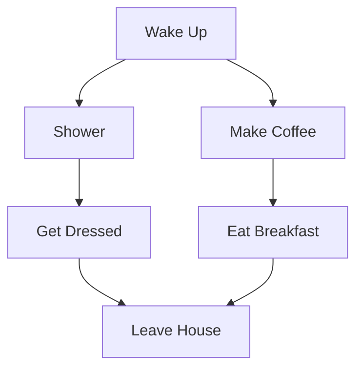

**Dependencies**:
- Can't dress before showering
- Can't leave before dressing AND eating
- Shower and coffee-making are independent (can be done in either order)

### Arrow Direction

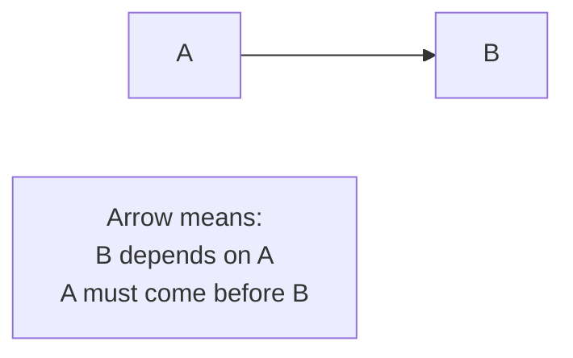

**Critical**: The arrow points FROM prerequisite TO dependent!

## What is Topological Ordering?

A topological ordering is a linear ordering of nodes where every node comes before all nodes that depend on it.

### Valid vs Invalid Orderings

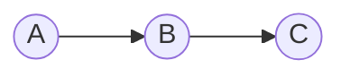

**Valid orderings**:
- A, B, C ✓
- (A before B before C)

**Invalid orderings**:
- B, A, C ✗ (A comes after B, but B depends on A!)
- C, B, A ✗ (Everything backwards!)

### Key Property

```mermaid
graph TB
    Property["For every edge A → B:<br/>A must appear before B<br/>in the ordering"]

    Check["In ordering [A, B, C]:<br/>A before B? ✓<br/>B before C? ✓<br/>Valid!"]
```

## DAGs: Directed Acyclic Graphs

Topological ordering only exists for DAGs.

### DAG (Directed Acyclic Graph)

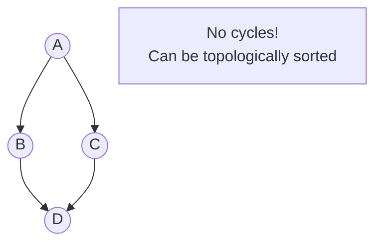

**Properties**:
- Has direction (arrows)
- No cycles (can't get back to where you started)
- Has at least one topological ordering

### Not a DAG (Has Cycle)

```mermaid
graph LR
    A((A)) --> B((B))
    B --> C((C))
    C --> A

    Note["Has cycle: A → B → C → A<br/>Cannot be topologically sorted!"]
```

**Why no topological ordering?**
- A must come before B (because A → B)
- B must come before C (because B → C)
- C must come before A (because C → A)
- Impossible! 🚫

## Real-World Dependency Examples

### 1. Build Systems

```mermaid
graph TB
    Config[config.ts] --> Utils[utils.ts]
    Utils --> API[api.ts]
    Utils --> UI[ui.ts]
    API --> Main[main.ts]
    UI --> Main

    Order["Topological order:<br/>config → utils → api/ui → main"]
```

**Meaning**: Compile files in order so dependencies are available.

### 2. Course Prerequisites

```mermaid
graph TB
    Calc1[Calculus I] --> Calc2[Calculus II]
    Calc2 --> Calc3[Calculus III]
    Calc1 --> Physics[Physics I]
    Calc2 --> DiffEq[Diff Eq]

    Order["Valid sequence:<br/>Calc1 → Calc2 → Calc3<br/>Physics and DiffEq can be anytime after their prereqs"]
```

### 3. Task Scheduling

```mermaid
graph LR
    Setup[Setup DB] --> Load[Load Data]
    Load --> Process[Process Data]
    Process --> Report[Generate Report]

    Order["Must run in order:<br/>Setup → Load → Process → Report"]
```

### 4. Package Installation

```mermaid
graph TB
    Python[Python] --> Pip[Pip]
    Pip --> Requests[Requests]
    Pip --> NumPy[NumPy]
    NumPy --> Pandas[Pandas]

    Order["Install order:<br/>Python → Pip → (NumPy/Requests) → Pandas"]
```

## Multiple Valid Orderings

Most DAGs have multiple valid topological orderings!

### Example Graph

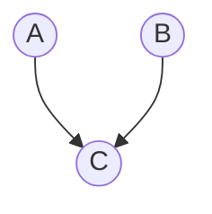

**Valid orderings**:
1. A, B, C ✓
2. B, A, C ✓

Both are correct because:
- A before C ✓
- B before C ✓
- Order of A and B doesn't matter (they're independent)

### Another Example

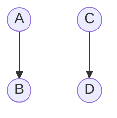

**Valid orderings** (many!):
1. A, B, C, D
2. A, C, B, D
3. A, C, D, B
4. C, A, B, D
5. C, A, D, B
6. C, D, A, B

All are valid because A→B and C→D constraints are maintained!

## The Two Phases of Topological Sort

### Phase 1: Discover All Required Nodes

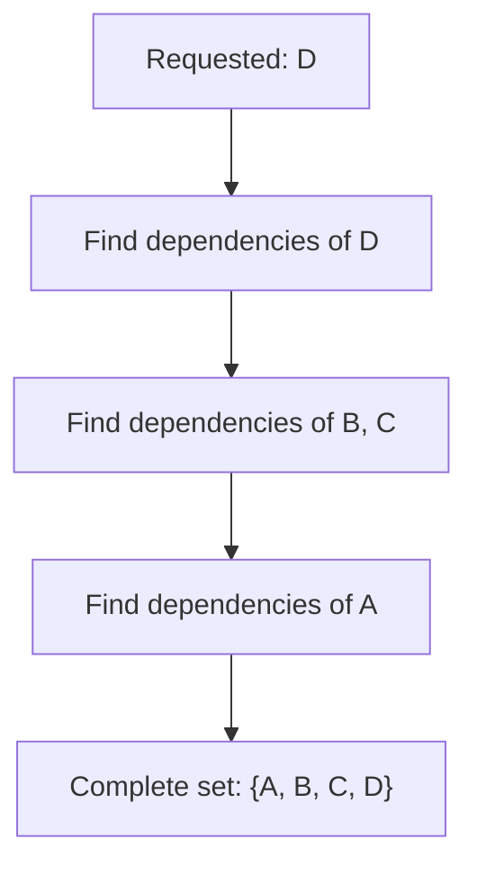

Start from what you want, work backwards to find all prerequisites.

### Phase 2: Order Them Correctly

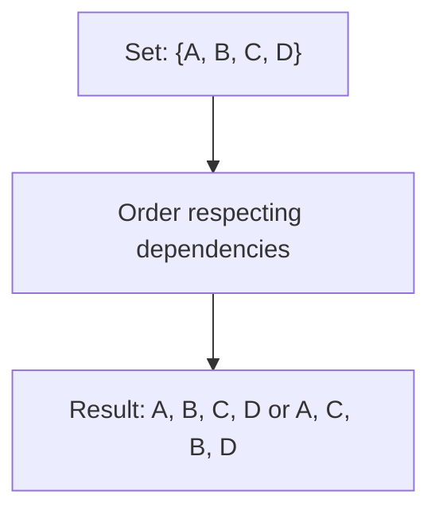

Arrange discovered nodes so dependencies come first.

## Transitive Dependencies

Dependencies of dependencies must be included!

### Example

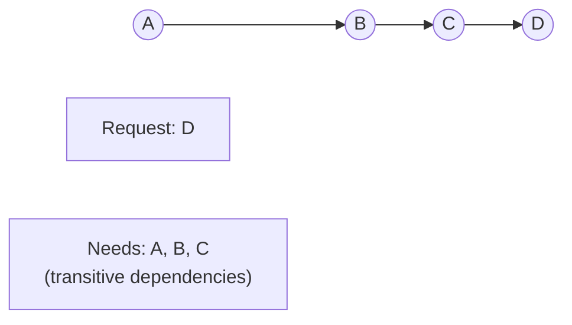

**Direct dependency**: D directly depends on C
**Transitive dependency**: D transitively depends on B and A (through C)

### Why They Matter

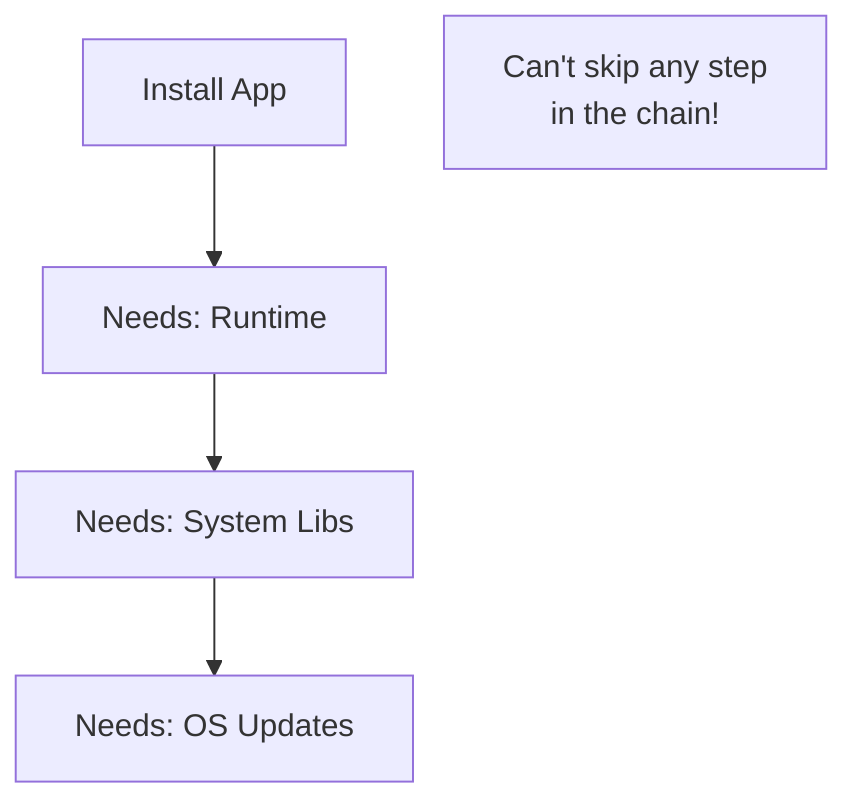

You can't install the app without the full dependency chain.

## The Diamond Problem

When multiple paths lead to the same dependency.

### Structure

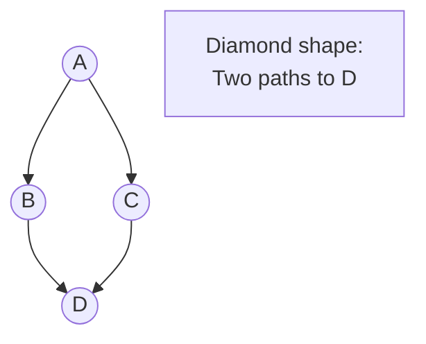

### Critical Question

**How many times should D appear in the result?**

```mermaid
graph LR
    Wrong["A, B, D, C, D ❌<br/>(D appears twice)"]
    Right["A, B, C, D ✓<br/>(D appears once)"]
```

**Answer**: Once! Each node should appear exactly once.

### Why This Happens

```mermaid
graph TB
    Process["Processing D"] --> Path1["Path 1: Request D → Visit B → Visit A"]
    Process --> Path2["Path 2: Request D → Visit C → Visit A"]

    Problem["A is reached via<br/>both paths!"]
```

**Solution**: Visited set prevents duplicate processing!

## Independent Tasks

Tasks with no dependency relationship can be ordered freely.

### Example

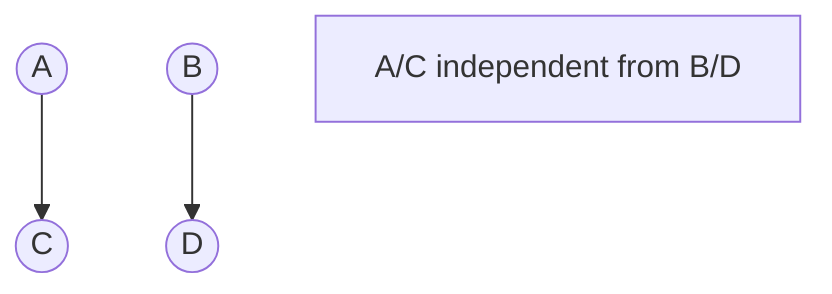

**Valid orderings**:
- A, B, C, D ✓
- A, C, B, D ✓
- B, A, C, D ✓
- B, D, A, C ✓
- Many more!

All that matters:
- A before C
- B before D

## How Topological Sort Works (Conceptually)

### DFS Approach (Post-Order)

```mermaid
graph TB
    Start["Visit node"] --> Recurse["Recursively visit<br/>all dependencies first"]
    Recurse --> Add["Add node to result<br/>AFTER dependencies"]
```

**Key**: Dependencies are added before the node that needs them.

### Example Trace

```mermaid
graph LR
    A((A)) --> B((B))
    B --> C((C))
```

**Execution**:
1. Visit C
2. Recurse into B
3. Recurse into A
4. A has no dependencies → add A to result: [A]
5. B's dependencies done → add B to result: [A, B]
6. C's dependencies done → add C to result: [A, B, C]

**Result**: [A, B, C] ✓

### BFS Approach (Kahn's Algorithm)

```mermaid
graph TB
    Start["Calculate in-degree<br/>for each node"] --> Find["Find nodes with<br/>in-degree 0"]
    Find --> Process["Process those nodes"]
    Process --> Reduce["Reduce in-degree<br/>of their dependents"]
    Reduce --> Repeat["Repeat"]
```

**Key**: Process nodes when all their dependencies are satisfied.

## In-Degree: A Key Concept

**In-degree** = number of incoming edges (dependencies).

### Example

```mermaid
graph LR
    A((A)) --> C((C))
    B((B)) --> C
    C --> D((D))
```

**In-degrees**:
- A: 0 (no dependencies)
- B: 0 (no dependencies)
- C: 2 (depends on A and B)
- D: 1 (depends on C)

### Why It Matters

```mermaid
graph TB
    Check{In-degree = 0?}
    Check -->|Yes| Ready["Ready to process!<br/>All dependencies satisfied"]
    Check -->|No| Wait["Must wait for<br/>dependencies"]
```

**Kahn's Algorithm**: Process nodes with in-degree 0, then reduce in-degree of neighbors.

## Partial Order vs Total Order

### Partial Order

Only some pairs have ordering relationship.

```mermaid
graph TB
    A((A)) --> C((C))
    B((B)) --> D((D))

    Note["A < C and B < D<br/>But A and B unrelated"]
```

Graph defines a **partial order** - not everything is comparable.

### Total Order

Every pair has a relationship.

```mermaid
graph LR
    A((A)) --> B((B))
    B --> C((C))
    C --> D((D))

    Note["A < B < C < D<br/>Every pair is ordered"]
```

Topological sort creates a **total order** from a **partial order**!

## Detecting Cycles

Cycles make topological sorting impossible.

### Three-Color DFS

```mermaid
stateDiagram-v2
    [*] --> White: Not visited
    White --> Gray: Visiting (in progress)
    Gray --> Black: Fully visited
    Gray --> Cycle: Found gray node (cycle!)
```

### How It Works

```mermaid
graph TB
    Visit["Visit node<br/>Mark GRAY"] --> Neighbors["Visit neighbors"]
    Neighbors --> FoundGray{Neighbor<br/>is GRAY?}
    FoundGray -->|Yes| Cycle["CYCLE!"]
    FoundGray -->|No| Continue["Continue"]
    Continue --> Done["All neighbors done<br/>Mark BLACK"]

    style Cycle fill:#ff6b6b
```

**If we encounter a GRAY node, we've found a back-edge (cycle)!**

### Example: Finding Cycle

```mermaid
graph LR
    A((A)) --> B((B))
    B --> C((C))
    C --> A

    Trace["Visit A (GRAY)<br/>Visit B (GRAY)<br/>Visit C (GRAY)<br/>Try to visit A<br/>A is GRAY → CYCLE!"]
```

## Why Cycles Break Topological Sort

### The Impossible Situation

```mermaid
graph LR
    A((A)) --> B((B))
    B --> C((C))
    C --> A
```

**Requirements**:
- A must come before B (A → B)
- B must come before C (B → C)
- C must come before A (C → A)

**Contradiction**: A must come before itself! Impossible!

### Real-World Example: Circular Dependencies

```mermaid
graph LR
    FileA[file_a.ts] --> FileB[file_b.ts]
    FileB --> FileC[file_c.ts]
    FileC --> FileA

    Error["Error: Circular dependency!<br/>Can't build!"]

    style Error fill:#ff6b6b
```

## Minimum vs Maximum Dependency Sets

Sometimes you only want to include necessary tasks.

### Example Request

```mermaid
graph TB
    A((A)) --> B((B))
    C((C)) --> D((D))
    B --> E((E))

    Request["Request: B"]
```

**Minimum set**: {A, B} (only what's needed for B)
**Full graph**: {A, B, C, D, E} (everything)

**Topological sort typically finds minimum set** - only include requested tasks and their dependencies!

## Building the Graph

Two possible representations based on perspective:

### Forward Graph (Task → Dependents)

```mermaid
graph LR
    A((A)) --> B((B))
    A --> C((C))

    Map["A → [B, C]<br/>B → []<br/>C → []"]
```

"Who depends on A?" → B and C

### Reverse Graph (Task → Dependencies)

```mermaid
graph LR
    B((B)) --> A((A))
    C((C)) --> A

    Map["A → []<br/>B → [A]<br/>C → [A]"]
```

"What does B depend on?" → A

**Choose based on your algorithm!**
- DFS topological sort often uses forward graph
- Kahn's algorithm uses in-degrees (derived from either)

## Common Patterns in Dependency Problems

### Pattern 1: Linear Chain

```mermaid
graph LR
    A((A)) --> B((B))
    B --> C((C))
    C --> D((D))
```

**Simplest**: Only one valid order (A, B, C, D)

### Pattern 2: Tree

```mermaid
graph TB
    Root((Root)) --> L((L))
    Root --> R((R))
    L --> LL((LL))
    L --> LR((LR))
```

**Multiple valid orders**: Root must be first, but children can vary

### Pattern 3: Diamond

```mermaid
graph TB
    A((A)) --> B((B))
    A --> C((C))
    B --> D((D))
    C --> D
```

**Shared dependency**: A must be first, D must be last, B/C flexible

### Pattern 4: Parallel Chains

```mermaid
graph LR
    A((A)) --> B((B))
    C((C)) --> D((D))
```

**Independent**: Chains can be interleaved freely

## Visualizing Valid vs Invalid Orders

### Valid Order Example

```mermaid
graph TB
    subgraph "Graph"
        A1((A)) --> B1((B))
        A1 --> C1((C))
        B1 --> D1((D))
    end

    subgraph "Order: A, B, C, D"
        O1[A] --> O2[B] --> O3[C] --> O4[D]
    end

    Check1["A before B? ✓<br/>A before C? ✓<br/>B before D? ✓<br/>VALID!"]
```

### Invalid Order Example

```mermaid
graph TB
    subgraph "Graph"
        A2((A)) --> B2((B))
        A2 --> C2((C))
        B2 --> D2((D))
    end

    subgraph "Order: B, A, C, D"
        O5[B] --> O6[A] --> O7[C] --> O8[D]
    end

    Check2["B before A? ✗<br/>A→B means A must come first!<br/>INVALID!"]

    style Check2 fill:#ff6b6b
```

## Incremental Discovery

Often you don't need the entire graph - just parts of it.

### Example

```mermaid
graph TB
    A((A)) --> B((B))
    B --> C((C))
    D((D)) --> E((E))
    E --> F((F))
```

**Request**: [C]
**Discover**: Only {A, B, C} (ignore D, E, F)

### Why This Matters

```mermaid
graph TB
    Large["Large dependency graph<br/>(1000s of tasks)"] --> Request["Request only 5 tasks"]
    Request --> Efficient["Only discover what's needed<br/>(maybe 20 tasks)"]
```

More efficient than processing entire graph!

## Key Takeaways

1. **Dependencies** create directed graphs
2. **Topological sort** orders nodes respecting dependencies
3. Only works on **DAGs** (no cycles)
4. **Multiple valid orderings** usually exist
5. **Transitive dependencies** must be included
6. **Diamond problem** → each node appears once
7. **In-degree 0** means ready to process (no dependencies)
8. **Cycles** make topological ordering impossible
9. **DFS post-order** or **BFS (Kahn's)** both work
10. **Discover only what's needed** for efficiency

## Putting It All Together

You now understand:
- ✓ What graphs are (01-graph-fundamentals)
- ✓ How to represent them (02-graph-representation)
- ✓ How recursion works (03-recursion-basics)
- ✓ How DFS explores graphs (04-graph-traversal-dfs)
- ✓ How BFS explores graphs (05-graph-traversal-bfs)
- ✓ What dependency ordering means (this guide)

**You're now ready to tackle topological sort!**

Go to `/topograph` and:
1. Review the study guide
2. Attempt the problem
3. Check the solution when ready

The topological sort problem is exactly this:
- Given tasks with dependencies (directed graph)
- Find all required tasks (discover dependencies)
- Order them correctly (topological sort)
- Handle shared dependencies (diamond problem)
- Do it efficiently (DFS with visited set)

All the pieces are now in place! 🎯
