# Binary Search Basics

## What is Binary Search?

Binary search is an efficient algorithm for finding a target value in a **sorted** array. Instead of checking every element one by one, it repeatedly divides the search space in half.

Think of it like looking up a word in a physical dictionary - you don't start at page 1 and flip through every page. You open to the middle, see if you're too far or not far enough, and repeat.

## The Core Concept

### Visual Model: Dictionary Lookup

Imagine you're looking for the word "penguin" in a dictionary:

```mermaid
graph TB
    Start["Open dictionary to middle<br/>Land on 'M'"] --> Check1{"Is 'penguin'<br/>before or after 'M'?"}
    Check1 -->|After| Right1["Look in right half<br/>(M-Z)"]
    Check1 -->|Before| Left1["Look in left half<br/>(A-M)"]

    Right1 --> Middle2["Open to middle of right half<br/>Land on 'S'"]
    Middle2 --> Check2{"Is 'penguin'<br/>before or after 'S'?"}
    Check2 -->|Before| Left2["Look in left half<br/>(M-S)"]

    Left2 --> Middle3["Open to middle<br/>Land on 'P'"]
    Middle3 --> Check3{"Is 'penguin'<br/>before, after, or IS 'P'?"}
    Check3 -->|Close!| Found["Found 'penguin'! ✓"]

    style Found fill:#90EE90
```

Key insight: Each step eliminates **half** of the remaining possibilities!

## Three Essential Components

Every binary search has three pointers that define the search space:


### 1. Left Pointer
The start of the current search space.

### 2. Right Pointer
The end of the current search space.

### 3. Middle Pointer
The point we're checking (always calculated from left and right).

## The Dictionary Search in Detail

Let's find the word "Python" in a dictionary with pages 1-1000:

```mermaid
graph TB
    subgraph "Step 1: First Check"
        S1["Pages 1-1000<br/>Left=1, Right=1000<br/>Middle=500"]
        S1 --> Check1["Check page 500<br/>Found: 'Marble'"]
        Check1 --> Decision1["'Python' comes AFTER 'Marble'<br/>Eliminate pages 1-500"]
    end

    subgraph "Step 2: Narrow Down"
        S2["Pages 501-1000<br/>Left=501, Right=1000<br/>Middle=750"]
        S2 --> Check2["Check page 750<br/>Found: 'Rabbit'"]
        Check2 --> Decision2["'Python' comes BEFORE 'Rabbit'<br/>Eliminate pages 751-1000"]
    end

    subgraph "Step 3: Getting Close"
        S3["Pages 501-750<br/>Left=501, Right=750<br/>Middle=625"]
        S3 --> Check3["Check page 625<br/>Found: 'Python'"]
        Check3 --> Found["FOUND! ✓"]
    end

    Decision1 --> S2
    Decision2 --> S3

    style Found fill:#90EE90
```

## Why "Sorted" Matters

Binary search ONLY works on sorted data. Here's why:

```mermaid
graph TB
    subgraph "Sorted Array - Works! ✓"
        Sorted["[1, 3, 5, 7, 9, 11, 13]<br/>Target: 9"]
        Sorted --> SCheck["Middle: 7"]
        SCheck --> SDecision["9 > 7<br/>Must be in right half!"]
        SDecision --> SCorrect["Safely ignore left half ✓"]
    end

    subgraph "Unsorted Array - Breaks! ✗"
        Unsorted["[7, 1, 9, 3, 13, 5, 11]<br/>Target: 9"]
        Unsorted --> UCheck["Middle: 3"]
        UCheck --> UDecision["9 > 3<br/>Search right half?"]
        UDecision --> UWrong["But 9 is in LEFT half! ✗"]
    end

    style SCorrect fill:#90EE90
    style UWrong fill:#ff6b6b
```

**Dictionary Connection**: Words are alphabetically sorted, so we know "Python" can't be before "Marble" in the alphabet.

## Simple Example: Finding a Number

Let's find **9** in `[1, 3, 5, 7, 9, 11, 13, 15, 17]`:

```mermaid
graph TB
    subgraph "Initial State"
        Init["Array: [1, 3, 5, 7, 9, 11, 13, 15, 17]<br/>Target: 9<br/>Left=0, Right=8"]
    end

    subgraph "Step 1"
        S1["Middle = (0 + 8) / 2 = 4<br/>Array[4] = 9"]
        S1 --> Compare1["9 == 9?"]
        Compare1 --> Found["YES! Found at index 4 ✓"]
    end

    Init --> S1

    style Found fill:#90EE90
```

That was lucky! Usually it takes more steps.

## Example: Multiple Steps Required

Let's find **15** in the same array:

```mermaid
graph TB
    subgraph "Step 1"
        I1["[1, 3, 5, 7, 9, 11, 13, 15, 17]<br/>L=0, R=8, M=4<br/>Array[4]=9"]
        I1 --> C1["15 > 9<br/>Search right half"]
        C1 --> U1["New: L=5, R=8"]
    end

    subgraph "Step 2"
        I2["[11, 13, 15, 17]<br/>L=5, R=8, M=6<br/>Array[6]=13"]
        I2 --> C2["15 > 13<br/>Search right half"]
        C2 --> U2["New: L=7, R=8"]
    end

    subgraph "Step 3"
        I3["[15, 17]<br/>L=7, R=8, M=7<br/>Array[7]=15"]
        I3 --> C3["15 == 15<br/>FOUND! ✓"]
    end

    U1 --> I2
    U2 --> I3

    style C3 fill:#90EE90
```

## The Three-Way Decision

At each middle point, we make one of three decisions:


**Dictionary Connection**:
- Target word < Middle word → Search left pages
- Target word > Middle word → Search right pages
- Target word == Middle word → Found it!

## The Search Loop

Binary search continues until one of two things happens:

```mermaid
graph TB
    Start["Start: left ≤ right"] --> Loop{"While<br/>left ≤ right"}

    Loop -->|Yes| CalcMid["Calculate middle<br/>middle = left + (right - left) / 2"]
    CalcMid --> Check["Check array[middle]"]
    Check --> Decision{"Compare"}

    Decision -->|Found| Return1["Return middle ✓"]
    Decision -->|Go Left| AdjustL["right = middle - 1"]
    Decision -->|Go Right| AdjustR["left = middle + 1"]

    AdjustL --> Loop
    AdjustR --> Loop

    Loop -->|No| Return2["Not found<br/>Return -1"]

    style Return1 fill:#90EE90
    style Return2 fill:#ffeb99
```

## Visualization: Complete Search Process

Finding **11** in `[1, 3, 5, 7, 9, 11, 13, 15, 17]`:

```mermaid
graph TB
    subgraph "State 1"
        S1["L=0, R=8, M=4<br/>[1, 3, 5, 7, |9|, 11, 13, 15, 17]<br/>11 > 9 → Go RIGHT"]
    end

    subgraph "State 2"
        S2["L=5, R=8, M=6<br/>[11, |13|, 15, 17]<br/>11 < 13 → Go LEFT"]
    end

    subgraph "State 3"
        S3["L=5, R=5, M=5<br/>[|11|]<br/>11 == 11 → FOUND! ✓"]
    end

    S1 --> S2
    S2 --> S3

    style S3 fill:#90EE90
```

## Element Not Found

What happens when we search for **10** (doesn't exist)?

```mermaid
graph TB
    subgraph "Step 1"
        St1["L=0, R=8, M=4<br/>Array[4]=9<br/>10 > 9 → RIGHT"]
    end

    subgraph "Step 2"
        St2["L=5, R=8, M=6<br/>Array[6]=13<br/>10 < 13 → LEFT"]
    end

    subgraph "Step 3"
        St3["L=5, R=5, M=5<br/>Array[5]=11<br/>10 < 11 → LEFT"]
    end

    subgraph "Step 4 - Exit"
        St4["L=5, R=4<br/>left > right<br/>STOP: Not found"]
        St4 --> Return["Return -1"]
    end

    St1 --> St2
    St2 --> St3
    St3 --> St4

    style Return fill:#ffeb99
```

**Key**: When `left > right`, the search space is empty - element doesn't exist!

## Binary Search vs Linear Search

### Linear Search (Sequential)

```mermaid
graph LR
    Start["Target: 15"] --> C1["Check 1"] --> C2["Check 3"] --> C3["Check 5"] --> C4["Check 7"] --> C5["Check 9"] --> C6["Check 11"] --> C7["Check 13"] --> C8["Check 15 ✓"]

    style C8 fill:#90EE90
```

**Steps needed**: 8 (checked 8 elements)

### Binary Search (Divide and Conquer)

```mermaid
graph TB
    Start["Target: 15"] --> M1["Check middle: 9<br/>Go right →"]
    M1 --> M2["Check middle: 13<br/>Go right →"]
    M2 --> M3["Check middle: 15 ✓"]

    style M3 fill:#90EE90
```

**Steps needed**: 3 (checked 3 elements)

## Time Complexity Comparison


**Dictionary Connection**: In a 1,000-page dictionary, you find any word in about 10 page flips, not 500 flips on average!

## Why Calculating Middle Matters

### Naive Approach (Can Overflow!)

```mermaid
graph TB
    Naive["middle = (left + right) / 2"] --> Problem["Problem: left + right might overflow!"]
    Problem --> Example["Example: left=2,000,000,000<br/>right=2,000,000,000<br/>Sum = 4,000,000,000 💥"]

    style Problem fill:#ff6b6b
```

### Safe Approach

```mermaid
graph TB
    Safe["middle = left + (right - left) / 2"] --> Why["Why it works"]
    Why --> Explain["Always: right - left < right<br/>So: left + (small number)<br/>Never overflows! ✓"]

    style Explain fill:#90EE90
```

## Recursive vs Iterative Binary Search

### Iterative Approach (Loop)

```mermaid
graph TB
    Start["left = 0<br/>right = n-1"] --> Loop{"left ≤ right?"}
    Loop -->|Yes| Calc["Calculate middle"]
    Calc --> Check["Check middle"]
    Check --> Update["Update left or right"]
    Update --> Loop
    Loop -->|No| End["Return -1"]

    Check -->|Found| Return["Return index"]

    style Return fill:#90EE90
```

**Advantages**: More space-efficient, no recursion overhead

### Recursive Approach (Function Calls)


**Advantages**: Elegant, easier to understand

## Edge Cases to Handle

### 1. Empty Array


### 2. Single Element

```mermaid
graph TB
    Single["Array: [5]<br/>Target: 5"] --> Pointers["left = 0, right = 0"]
    Pointers --> Middle["middle = 0"]
    Middle --> Compare["arr[0] == 5"]
    Compare --> Found["Found at index 0! ✓"]

    style Found fill:#90EE90
```

### 3. Target at Start

```mermaid
graph TB
    Start["Array: [1, 3, 5, 7, 9]<br/>Target: 1"] --> M1["Check middle: 5<br/>1 < 5 → LEFT"]
    M1 --> M2["Check middle: 3<br/>1 < 3 → LEFT"]
    M2 --> M3["Check index 0: 1<br/>Found! ✓"]

    style M3 fill:#90EE90
```

### 4. Target at End

```mermaid
graph TB
    End["Array: [1, 3, 5, 7, 9]<br/>Target: 9"] --> M1["Check middle: 5<br/>9 > 5 → RIGHT"]
    M1 --> M2["Check middle: 7<br/>9 > 7 → RIGHT"]
    M2 --> M3["Check index 4: 9<br/>Found! ✓"]

    style M3 fill:#90EE90
```

## Common Binary Search Variants

### 1. Find First Occurrence

When duplicates exist, find the **leftmost** match:

```mermaid
graph TB
    Array["[1, 3, 5, 5, 5, 7, 9]<br/>Target: 5"] --> Strategy["When found at middle:<br/>DON'T stop!<br/>Keep searching LEFT"]
    Strategy --> Result["Continue until you find<br/>the first occurrence"]

    style Result fill:#90EE90
```

### 2. Find Last Occurrence

When duplicates exist, find the **rightmost** match:

```mermaid
graph TB
    Array["[1, 3, 5, 5, 5, 7, 9]<br/>Target: 5"] --> Strategy["When found at middle:<br/>DON'T stop!<br/>Keep searching RIGHT"]
    Strategy --> Result["Continue until you find<br/>the last occurrence"]

    style Result fill:#90EE90
```

### 3. Find Insert Position

Where should we insert target to keep array sorted?

```mermaid
graph TB
    Array["[1, 3, 7, 9]<br/>Target: 5 (not found)"] --> Search["Binary search ends<br/>with left > right"]
    Search --> Position["'left' pointer shows<br/>insert position"]
    Position --> Insert["Insert at index 2:<br/>[1, 3, |5|, 7, 9]"]

    style Insert fill:#90EE90
```

## Common Mistakes

### Mistake 1: Wrong Loop Condition

```mermaid
graph TB
    Wrong["while (left < right)<br/>✗ Uses '<' instead of '≤'"] --> Problem["Misses when<br/>left == right"]
    Problem --> Miss["Can't find element<br/>when only 1 element left"]

    Correct["while (left ≤ right)<br/>✓ Correct condition"] --> Works["Checks all elements<br/>including last one"]

    style Miss fill:#ff6b6b
    style Works fill:#90EE90
```

### Mistake 2: Not Updating Pointers Correctly

```mermaid
graph TB
    Wrong["left = middle<br/>or<br/>right = middle"] --> Stuck["Can create<br/>infinite loop!"]

    Correct["left = middle + 1<br/>or<br/>right = middle - 1"] --> Progress["Always makes progress<br/>toward base case"]

    style Stuck fill:#ff6b6b
    style Progress fill:#90EE90
```

### Mistake 3: Integer Overflow in Middle Calculation

```mermaid
graph TB
    Bad["middle = (left + right) / 2"] --> Overflow["Can overflow<br/>with large indices"]

    Good["middle = left + (right - left) / 2"] --> Safe["Always safe<br/>from overflow"]

    style Overflow fill:#ff6b6b
    style Safe fill:#90EE90
```

## Search Space Visualization

Understanding how the search space shrinks:

```mermaid
graph TB
    subgraph "Search for 15 in array of size 16"
        Init["Size: 16 elements<br/>Range: [0-15]"]
        Step1["After step 1: 8 elements<br/>Range: [8-15]"]
        Step2["After step 2: 4 elements<br/>Range: [12-15]"]
        Step3["After step 3: 2 elements<br/>Range: [14-15]"]
        Step4["After step 4: 1 element<br/>Found or not found"]
    end

    Init --> Step1
    Step1 --> Step2
    Step2 --> Step3
    Step3 --> Step4

    Summary["Each step:<br/>Space ÷ 2"]

    style Step4 fill:#90EE90
```

**Pattern**: Size reduces as 16 → 8 → 4 → 2 → 1

**Formula**: Maximum steps = log₂(n) + 1

## The Power of Halving

```mermaid
graph TB
    subgraph "Why Binary Search is Fast"
        Concept["Each step eliminates<br/>HALF the remaining elements"]

        Example["Dictionary with 1024 pages"]
        Example --> S1["After 1 check: 512 pages left"]
        S1 --> S2["After 2 checks: 256 pages left"]
        S2 --> S3["After 3 checks: 128 pages left"]
        S3 --> S4["After 4 checks: 64 pages left"]
        S4 --> S5["After 5 checks: 32 pages left"]
        S5 --> Dots["..."]
        Dots --> Final["After 10 checks: Found!"]

        Result["1024 pages → Only 10 checks!"]
    end

    style Final fill:#90EE90
    style Result fill:#FFD700
```

## Binary Search Template

The standard pattern you can apply:

```mermaid
graph TB
    Template["Binary Search Template"] --> Init["1. Initialize<br/>left = 0<br/>right = array.length - 1"]
    Init --> Loop["2. While left ≤ right"]
    Loop --> Calc["3. Calculate middle<br/>middle = left + (right - left) / 2"]
    Calc --> Check["4. Check array[middle]"]
    Check --> Match["5. If match → return middle"]
    Check --> Less["6. If target < middle<br/>right = middle - 1"]
    Check --> Greater["7. If target > middle<br/>left = middle + 1"]
    Less --> Loop
    Greater --> Loop
    Loop --> NotFound["8. After loop:<br/>return -1 (not found)"]

    style Match fill:#90EE90
    style NotFound fill:#ffeb99
```

## When to Use Binary Search

```mermaid
graph TB
    Question["Should I use<br/>Binary Search?"] --> Sorted{"Is data<br/>sorted?"}

    Sorted -->|No| Sort{"Can I<br/>sort it?"}
    Sorted -->|Yes| Random{"Can I access<br/>any element<br/>quickly?"}

    Sort -->|No| NoBS["Use Linear Search<br/>or other algorithm"]
    Sort -->|Yes| Consider["Consider sorting first<br/>if searching multiple times"]

    Random -->|Yes| UseBS["✓ Use Binary Search!"]
    Random -->|No| NoBS2["✗ Binary Search won't help<br/>(e.g., linked lists)"]

    style UseBS fill:#90EE90
    style NoBS fill:#ffeb99
    style NoBS2 fill:#ffeb99
```

## Real-World Applications

### 1. Dictionary / Phone Book

```mermaid
graph LR
    Dict["Sorted alphabetically"] --> Quick["Quick word/name lookup"]
```

### 2. Finding Version Bugs

```mermaid
graph LR
    Versions["1000 code versions<br/>Bug introduced somewhere"] --> Binary["Use binary search<br/>to find bad version"]
    Binary --> Fast["Find in ~10 checks<br/>instead of 500"]
```

### 3. Database Indexes

```mermaid
graph LR
    DB["Sorted database index"] --> Search["Fast record lookup"]
```

### 4. Game: Guess the Number

```mermaid
graph TB
    Game["Number between 1-100"] --> Guess["Optimal strategy:<br/>Binary search!"]
    Guess --> Max["Max 7 guesses<br/>to find any number"]
```

## Key Insights

### The Logarithmic Magic

```mermaid
graph TB
    subgraph "Logarithmic Growth"
        Small["As array size<br/>DOUBLES"] --> Steps["Steps only<br/>INCREASE BY 1"]
    end

    subgraph "Concrete Example"
        E1["1,000 elements → 10 steps"]
        E2["2,000 elements → 11 steps"]
        E3["4,000 elements → 12 steps"]
        E4["8,000 elements → 13 steps"]

        E1 --> E2 --> E3 --> E4
    end

    Conclusion["This is why binary search<br/>is SO POWERFUL for large datasets!"]

    style Conclusion fill:#FFD700
```

## Debugging Binary Search

When your binary search isn't working:

```mermaid
graph TB
    Debug["Binary Search Not Working?"] --> Q1{"Is array<br/>actually sorted?"}

    Q1 -->|No| Fix1["Sort the array first!"]
    Q1 -->|Yes| Q2{"Using<br/>≤ or < in loop?"}

    Q2 -->|"Using <"| Fix2["Change to ≤"]
    Q2 -->|"Using ≤"| Q3{"Updating pointers<br/>with +1 and -1?"}

    Q3 -->|No| Fix3["Add +1 and -1<br/>to avoid infinite loop"]
    Q3 -->|Yes| Q4{"Middle calculation<br/>overflow-safe?"}

    Q4 -->|No| Fix4["Use: left + (right - left) / 2"]
    Q4 -->|Yes| Q5["Check your<br/>comparison logic"]

    style Fix1 fill:#90EE90
    style Fix2 fill:#90EE90
    style Fix3 fill:#90EE90
    style Fix4 fill:#90EE90
```

## Practice Problems Progression

```mermaid
graph TB
    Start["Start Here"] --> P1["1. Basic Binary Search<br/>Find element in sorted array"]
    P1 --> P2["2. First Occurrence<br/>Find leftmost duplicate"]
    P2 --> P3["3. Last Occurrence<br/>Find rightmost duplicate"]
    P3 --> P4["4. Insert Position<br/>Where to insert element"]
    P4 --> P5["5. Search in Rotated Array<br/>Array rotated at pivot"]
    P5 --> P6["6. Find Peak Element<br/>Element greater than neighbors"]
    P6 --> P7["7. Search 2D Matrix<br/>Apply binary search in 2D"]

    style P1 fill:#90EE90
    style P7 fill:#FFD700
```

## Key Takeaways

1. **Binary Search** = repeatedly divide search space in half
2. **Only works on sorted data** - like a dictionary
3. **Three pointers**: left, right, middle
4. **Three decisions**: found, go left, go right
5. **Loop condition**: `while (left ≤ right)` - don't forget the =
6. **Update pointers**: `left = mid + 1` or `right = mid - 1` - don't forget +1/-1
7. **Safe middle calculation**: `left + (right - left) / 2`
8. **Time complexity**: O(log n) - incredibly fast even for huge datasets
9. **Space complexity**: O(1) for iterative, O(log n) for recursive

## The Dictionary Analogy Summary

```mermaid
graph TB
    Dictionary["Looking up a word<br/>in a 1000-page dictionary"]

    Dictionary --> Method1["Linear Search:<br/>Start at page 1,<br/>check every page<br/>~500 pages on average"]

    Dictionary --> Method2["Binary Search:<br/>Open to middle,<br/>eliminate half,<br/>repeat<br/>~10 pages checked!"]

    style Method1 fill:#ff6b6b
    style Method2 fill:#90EE90
```

**Remember**: You already use binary search naturally when you look up words, find pages in a book, or guess numbers. The algorithm just formalizes this intuitive strategy!

## Next Steps

Now that you understand binary search, you can:
1. Practice implementing both iterative and recursive versions
2. Solve variants (first occurrence, last occurrence, insert position)
3. Apply binary search to non-obvious problems (finding minimums, peak elements)
4. Recognize when a problem can be solved with binary search even if not explicitly stated
