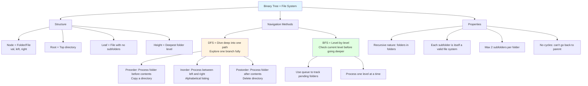
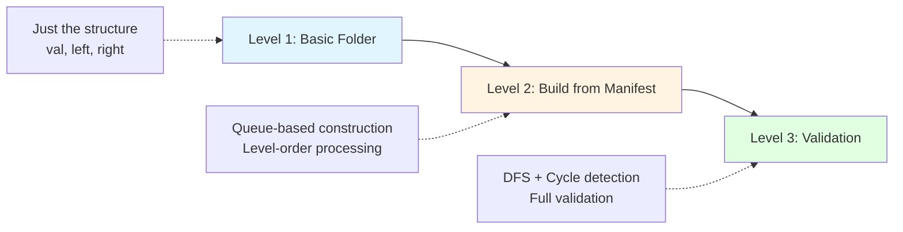
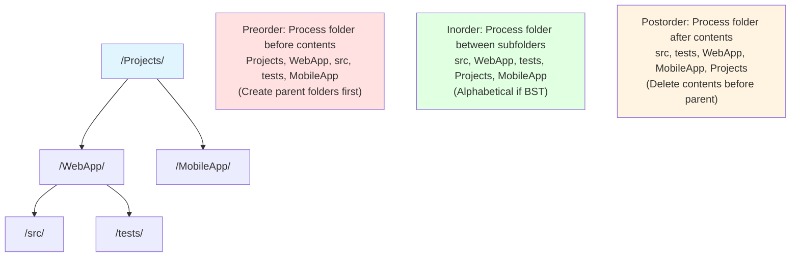
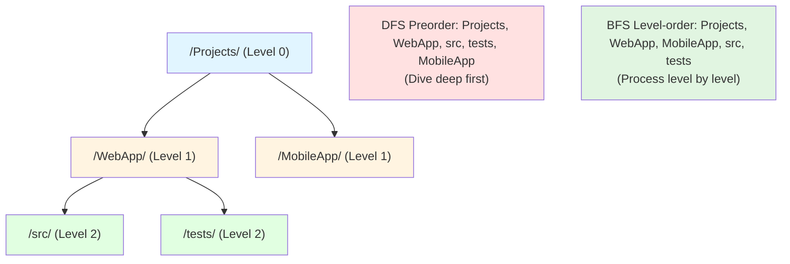
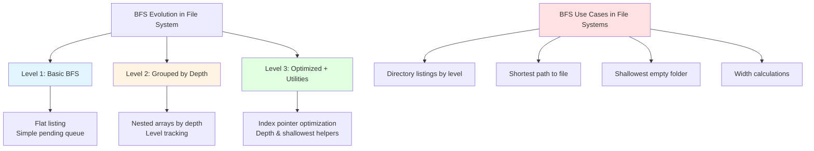
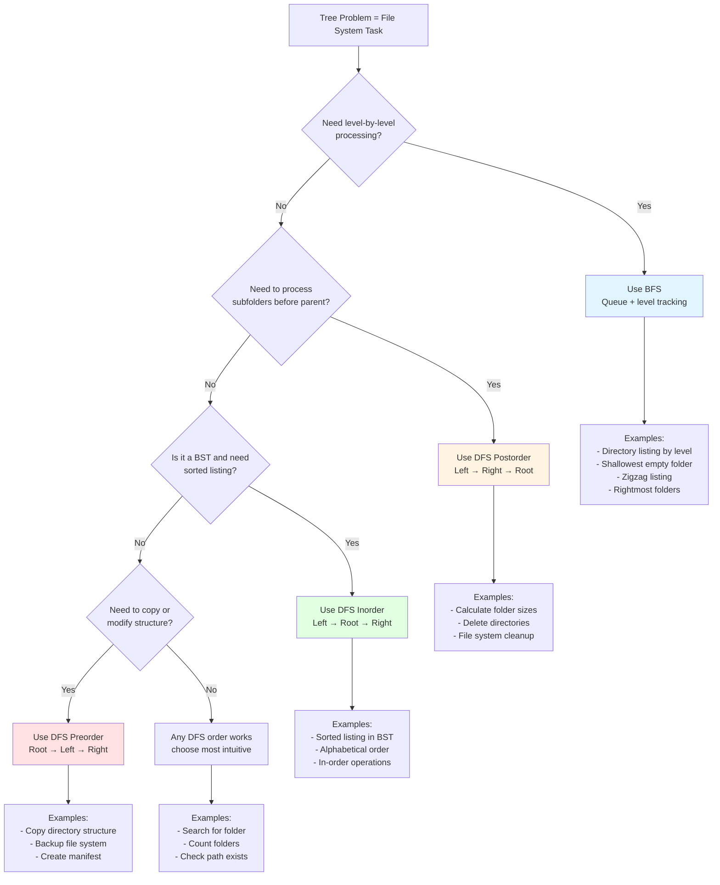

# Binary Trees - Fundamentals

> 📚 **Part of**: [Complete DSA Learning Path](../dsa/00-complete-dsa-path.md)
>
> **Generated**: February 7, 2026
>
> **Duration**: 4-6 days (full-time)
>
> **Prerequisites**:
> - Recursion & Backtracking (Week 4-5) - CRITICAL foundation
> - Linked Lists (Days 15-18) - Understanding pointer-based structures
> - Stack & Queue (Days 19-21) - LIFO/FIFO concepts for traversals

---

## 1. Overview

Binary trees represent **hierarchical relationships** where each node can have at most two children. Unlike the linear structures you've mastered (arrays, linked lists), trees branch out, creating parent-child relationships that mirror many real-world scenarios: file systems, organizational charts, decision trees, and DOM structures in web development.

**Why this matters in interviews**: Trees appear in 20-30% of coding interviews and test your ability to think recursively, visualize hierarchical data, and understand space-time tradeoffs. Master trees, and graphs become much more approachable.

**By the end of this guide, you'll be able to**:
- Visualize and reason about tree structures using file system navigation as your mental model
- Apply DFS (recursive) and BFS (iterative) traversal strategies
- Recognize common tree patterns and choose the right approach
- Build confidence with "trusting the recursion" for tree problems

---

## 2. Core Concept & Mental Model

### CRITICAL: Our Primary Analogy - File System Navigation

Throughout this entire guide, we'll use **computer file systems** as our mental model. This analogy is perfect because:
- Everyone understands folders and files
- Folders can contain other folders (hierarchy)
- Navigation patterns (depth-first vs breadth-first) map directly to tree traversals
- It's extensible to cover all tree concepts

**The Mapping**:
- **Tree Node** = Folder or file
- **Root** = The top-level directory (e.g., `/Users/you/`)
- **Children** = Subfolders within a folder
- **Leaf** = A file with no subfolders (or an empty folder)
- **Path** = The route from root to a specific file
- **Height** = How many folder levels deep you can go
- **Traversal** = Different ways to explore the file system

### Explanation

A binary tree is just like a **file system where each folder can have at most 2 subfolders**.

In your file system, you have:
1. A **root directory** (the starting point)
2. **Folders** that can contain up to 2 subfolders each (left and right)
3. **Files** at the bottom (leaves) that contain no subfolders

When you navigate your file system, you're doing tree traversal:
- **Depth-first**: Dive into one folder all the way to the bottom, then backtrack and try another
- **Breadth-first**: Explore all items at the current level before going deeper

**The formal terms**:
- Each folder/file is a **node**
- Each node holds a **value** (like a folder name)
- Each node has a **left subfolder** reference and a **right subfolder** reference (or null if none exists)
- Nodes with no children are **leaf nodes** (like files)

**Key insight**: Just like file systems are naturally recursive (folders contain folders contain folders...), tree operations are recursive. To count all files in a folder:
1. Count files in the current folder
2. Count files in the left subfolder (trust this works!)
3. Count files in the right subfolder (trust this works!)
4. Add them all together

### Concept Map



---

## 3. Building Blocks - Progressive Learning

### Building Block 1: Tree Node & Basic Structure

#### 🧠 Mental Model First

**What is this?**
A tree node is like a **folder** in your file system. It has:
- A name (the value)
- A "left" subfolder (or empty if none)
- A "right" subfolder (or empty if none)

**Why does this exist?**
We need a way to represent hierarchical data. Your file system isn't flat - it has structure. Some folders contain other folders, creating a hierarchy.

**How do we think about it using our file system analogy?**
Imagine you're in `/Users/you/Documents/`:
- This folder is the current node
- It has two subfolders: `Work/` (left child) and `Personal/` (right child)
- Each of those subfolders might have their own subfolders
- If there's no subfolder, that slot is empty (null)

**When would we use it?**
- Representing any hierarchical data (org charts, file systems, DOM trees)
- When relationships are one-to-many (one parent, multiple children)
- Efficient searching when the tree is balanced (Binary Search Trees)

#### Level 1: Simplest Form

**Conceptual Explanation**:

In our file system analogy, the simplest version is just **defining what a folder is**:
- It has a name (the value)
- It has space for a left subfolder
- It has space for a right subfolder

That's it! Think of it as creating a folder with two potential subfolders.

**Example Walkthrough**:

```
Goal: Create this file system structure:
/Documents/
    /Work/
    /Personal/

Process (in file system terms):
1. Create main folder "Documents" (value: 1)
2. Create subfolder "Work" (value: 2)
3. Create subfolder "Personal" (value: 3)
4. Set Documents.left = Work
5. Set Documents.right = Personal

Result: A three-folder structure
```

**Now the Code**:

```typescript
// TreeNode = Folder definition
class TreeNode {
  val: number;              // Folder name/value
  left: TreeNode | null;    // Left subfolder (or null if empty)
  right: TreeNode | null;   // Right subfolder (or null if empty)

  // Create a new folder
  // By default, it has no subfolders (they're null)
  constructor(val: number, left: TreeNode | null = null, right: TreeNode | null = null) {
    this.val = val;
    this.left = left;
    this.right = right;
  }
}

// Example: Build a simple file system
// Documents/
//   Work/
//   Personal/
function buildSimpleFileSystem(): TreeNode {
  // Create the leaf folders first (no subfolders)
  const work = new TreeNode(2);      // "Work" folder - empty inside
  const personal = new TreeNode(3);  // "Personal" folder - empty inside

  // Create root folder with two subfolders
  const documents = new TreeNode(1, work, personal);

  // File system analogy:
  // - documents is the main folder
  // - documents.left points to "Work" folder
  // - documents.right points to "Personal" folder
  // - work and personal are leaf nodes (no subfolders)

  return documents;
}
```

**What Makes This Simple**:
- We're manually creating the structure (like using `mkdir` commands)
- Only 3 folders total
- Not handling complex scenarios like building from arrays
- Edge case ignored: What if we want to represent this as a list? (Level 2 will address this)

---

#### Level 2: Adding Complexity - Building from Arrays

**Why We Need More**:

Manually creating folders is tedious. In coding interviews (and LeetCode), file systems are represented as **arrays** using level-order notation (think of it as a breadth-first listing):

- `[1, 2, 3, 4, 5]` represents:
  ```
  /Root(1)/
      /Folder2/
          /Folder4/
          /Folder5/
      /Folder3/
  ```

- `null` means "no folder here": `[1, 2, 3, null, null, 6, 7]`

**How does our file system analogy evolve?**
Instead of creating folders one by one, we're reading a **manifest file** that lists all folders level by level. We need to reconstruct the file system from this list.

**Conceptual Changes**:

The key insight: **Use a queue to track parent folders** as we build level by level.

Think of it like this:
- **Before**: We created each folder manually and connected them
- **Now**: We're reading a list that says "Folder 1 has subfolders 2 and 3, Folder 2 has subfolders 4 and 5..."
- **Pattern**: Process the list left-to-right, assigning subfolders to parents in order

**Example Walkthrough**:

```
Input array: [1, 2, 3, 4, 5, null, 6]

File system build process:
Step 1: Create root folder "1", pending parents: [1]
Step 2: Process folder "1" (from pending list)
        - Next in array: 2 → create left subfolder, add to pending
        - Next in array: 3 → create right subfolder, add to pending
        - Pending parents now: [2, 3]
Step 3: Process folder "2"
        - Next: 4 → create left subfolder
        - Next: 5 → create right subfolder
        - Pending: [3, 4, 5]
Step 4: Process folder "3"
        - Next: null → skip left subfolder
        - Next: 6 → create right subfolder
        - Pending: [4, 5, 6]
Step 5: Remaining folders have no children in our array

Result file system:
/1/
    /2/
        /4/
        /5/
    /3/
        /6/
```

**Updated Code**:

```typescript
// Build file system from breadth-first manifest (array)
// This is how LeetCode represents tree structures
function buildFromArray(arr: (number | null)[]): TreeNode | null {
  // Edge case: empty manifest
  if (arr.length === 0 || arr[0] === null) return null;

  // Create root folder (first item is always root)
  const root = new TreeNode(arr[0]);

  // Queue of parent folders waiting for subfolders to be assigned
  // Using file system analogy: folders that need their contents filled
  const pendingParents: TreeNode[] = [root];

  // Index to track position in manifest
  let i = 1; // Start at 1 because arr[0] is the root

  // Process the manifest, assigning subfolders to parents
  while (pendingParents.length > 0 && i < arr.length) {
    // Get next parent folder that needs subfolders
    const parent = pendingParents.shift()!;

    // Assign left subfolder (if exists in manifest)
    if (i < arr.length && arr[i] !== null) {
      parent.left = new TreeNode(arr[i]!);
      pendingParents.push(parent.left); // This folder might have subfolders later
    }
    i++; // Move to next manifest entry

    // Assign right subfolder (if exists in manifest)
    if (i < arr.length && arr[i] !== null) {
      parent.right = new TreeNode(arr[i]!);
      pendingParents.push(parent.right); // This folder might have subfolders later
    }
    i++; // Move to next manifest entry
  }

  // File system analogy:
  // - Queue ensures we process folders level by level (like `ls -R`)
  // - For each parent folder, we assign exactly two potential subfolders
  // - null values are skipped, leaving those subfolder slots empty
  // - By the end, all folders are created and linked

  return root;
}

// Example usage
const fileSystem = buildFromArray([1, 2, 3, 4, 5, null, 6]);
```

**Complexity Trade-offs**:

**What we gained**:
- Can quickly build file systems from array notation (common in interviews)
- Handles missing folders (null values) correctly
- Time: O(n) - process each manifest entry once
- Space: O(n) - queue holds up to n/2 folders in worst case (complete file system)

**What we sacrificed**:
- More complex than manual creation
- Requires understanding breadth-first pattern (queue-based level traversal)

---

#### Level 3: Full Pattern - File System Validation

**Complete Mental Model using File System Analogy**:

Now we can:
1. **Define** a folder structure (Level 1)
2. **Build** a file system from a manifest (Level 2)
3. **Validate** that our file system is actually valid

In our file system analogy, validation checks:
- **No cycles**: You can't have a folder that contains itself (infinite loop!)
- **Connected**: All folders are reachable from the root
- **Proper structure**: Each folder has at most 2 subfolders (already enforced by TreeNode)

**Edge Cases We're Now Handling**:

- **Empty file system**: `root = null` (valid! just empty)
- **Single folder**: `root = new TreeNode(1)` (valid file system with one folder)
- **Null subfolders**: Folders can have 0, 1, or 2 subfolders
- **Unbalanced**: One branch much deeper than another (still valid)
- **Duplicate names**: Allowed in general trees (not in BSTs, covered later)

**Production-Ready Code**:

```typescript
// Complete TreeNode (Folder) class with helper methods
class TreeNode {
  val: number;
  left: TreeNode | null;
  right: TreeNode | null;

  constructor(val: number, left: TreeNode | null = null, right: TreeNode | null = null) {
    this.val = val;
    this.left = left;
    this.right = right;
  }

  // Helper: Check if this is a leaf folder (no subfolders)
  isLeaf(): boolean {
    return this.left === null && this.right === null;
  }

  // Helper: Count total subfolders (0, 1, or 2)
  childrenCount(): number {
    let count = 0;
    if (this.left !== null) count++;
    if (this.right !== null) count++;
    return count;
  }
}

// Validate file system structure (basic checks)
function isValidFileSystem(root: TreeNode | null): boolean {
  // Empty file system is valid
  if (root === null) return true;

  // Use Set to detect cycles
  // In file system: have we visited this folder before?
  const visited = new Set<TreeNode>();

  // Helper: Explore file system depth-first, checking for cycles
  function explore(folder: TreeNode | null): boolean {
    // Base case: null folder (empty subfolder slot) is valid
    if (folder === null) return true;

    // Cycle detection: Have we already visited this folder?
    if (visited.has(folder)) {
      return false; // CYCLE DETECTED! Folder contains itself - invalid!
    }

    // Mark this folder as visited
    visited.add(folder);

    // Recursively validate left and right subfolders
    // File system analogy: check if both subfolders are valid
    return explore(folder.left) && explore(folder.right);
  }

  return explore(root);
}

// Build file system from manifest (Level 2 code)
function buildFileSystem(arr: (number | null)[]): TreeNode | null {
  if (arr.length === 0 || arr[0] === null) return null;

  const root = new TreeNode(arr[0]);
  const queue: TreeNode[] = [root];
  let i = 1;

  while (queue.length > 0 && i < arr.length) {
    const parent = queue.shift()!;

    // Left subfolder
    if (i < arr.length && arr[i] !== null) {
      parent.left = new TreeNode(arr[i]!);
      queue.push(parent.left);
    }
    i++;

    // Right subfolder
    if (i < arr.length && arr[i] !== null) {
      parent.right = new TreeNode(arr[i]!);
      queue.push(parent.right);
    }
    i++;
  }

  return root;
}

// Complete example: Build and validate file system
function createValidatedFileSystem(arr: (number | null)[]): TreeNode | null {
  const fileSystem = buildFileSystem(arr);

  if (!isValidFileSystem(fileSystem)) {
    throw new Error("Invalid file system structure detected!");
  }

  return fileSystem;
}

// Usage examples
const validFS = createValidatedFileSystem([1, 2, 3, 4, 5]);  // ✅ Valid
const emptyFS = createValidatedFileSystem([]);                // ✅ Valid (empty)
const singleFolder = createValidatedFileSystem([1]);          // ✅ Valid (one folder)
```

**Complexity Analysis**:

**Time Complexity: O(n)**
- **Why?** We visit each folder exactly once during exploration
- For n folders, we perform n constant-time operations (checking visited set, recursive calls)
- Building: O(n) - process each manifest entry
- Validating: O(n) - visit each folder once
- **Total: O(n)**

**Space Complexity: O(n)**
- **Why?** We're storing references in multiple places:
  1. The file system itself takes O(n) space (n folders)
  2. The visited set holds up to n folders: O(n)
  3. The recursion call stack (exploration depth) goes as deep as the file system:
     - Worst case (deeply nested folders): O(n)
     - Best case (balanced file system): O(log n)
     - We count worst case: O(n)
- **Total: O(n)**

**Why this is optimal**:
- We MUST visit every folder to validate (can't skip any)
- We MUST store folder references to build the structure
- Therefore, O(n) time and space is the minimum possible

**Visual Summary**:



---

### Building Block 2: Tree Traversals - Depth-First Search (DFS)

#### 🧠 Mental Model First

**What is this?**
DFS means "explore one path all the way to the deepest folder, then backtrack." In our file system analogy, it's like using the command line to dive deep into one folder before exploring others.

**Why does this exist?**
When exploring a file system, we need different strategies depending on what we're looking for. DFS is useful when you want to **go deep first** - like finding a specific file deep in a project folder.

**How do we think about it using our file system analogy?**
Imagine you're looking for a file in `/Projects/`:
- **DFS approach**: Open the first subfolder, keep going deeper until you hit a file with no subfolders, then backtrack
- Example: `/Projects/ → WebApp/ → src/ → components/ → Button.tsx` (dead end) → backtrack to `components/` → try `Header.tsx`

But **when** should you do something with each folder? This gives us three DFS orders:
- **Preorder**: Process the folder **before** diving into its contents (like copying a directory - create the parent folder first)
- **Inorder**: Process the folder **between** exploring left and right subfolders (like alphabetical sorting)
- **Postorder**: Process the folder **after** exploring all its contents (like deleting a directory - must delete contents first)

**When would we use it?**
- **Preorder**: Copying file systems, creating backups
- **Inorder**: Getting sorted listing (when combined with BST)
- **Postorder**: Calculating folder sizes, deleting directories

**Visual - Three DFS Orders in File System**:



#### Level 1: Simplest Form - Preorder Traversal

**Conceptual Explanation (using file system analogy)**:

Preorder is like **listing folders as you encounter them, before diving deeper**:
1. List the current folder name
2. Recursively list all folders in left subfolder
3. Recursively list all folders in right subfolder

File system example: If you're in `/Projects/` and want to copy the structure:
1. Create `/Projects/` folder first (process current)
2. Then copy everything from left subfolder (recursive)
3. Then copy everything from right subfolder (recursive)

**Example Walkthrough**:

```
File system:
/Projects(1)/
    /WebApp(2)/
        /src(4)/
        /tests(5)/
    /MobileApp(3)/

Preorder exploration (process folder before contents):
1. Visit /Projects(1)/ → output [1]
2. Visit left subfolder (/WebApp(2)/)
   a. Visit /WebApp(2)/ → output [1, 2]
   b. Visit left subfolder (/src(4)/)
      - Visit /src(4)/ → output [1, 2, 4]
      - No subfolders → return
   c. Visit right subfolder (/tests(5)/)
      - Visit /tests(5)/ → output [1, 2, 4, 5]
      - No subfolders → return
3. Visit right subfolder (/MobileApp(3)/)
   a. Visit /MobileApp(3)/ → output [1, 2, 4, 5, 3]
   b. No subfolders → return

Output: [1, 2, 4, 5, 3]
```

**Now the Code**:

```typescript
// Preorder Traversal: Process folder before exploring contents
// File system analogy: List folder names as you encounter them
function preorderTraversal(root: TreeNode | null): number[] {
  const result: number[] = []; // Collect folder names in order

  // Helper: Explore file system recursively
  function explore(folder: TreeNode | null): void {
    // Base case: null means no folder here (empty subfolder slot)
    if (folder === null) return;

    // PREORDER: Process current folder FIRST
    // File system: List this folder's name before diving into subfolders
    result.push(folder.val);

    // Then recursively explore left subfolder
    // Trust that this will visit all folders in left subtree in preorder
    explore(folder.left);

    // Then recursively explore right subfolder
    // By now, left is completely explored, so we explore right
    explore(folder.right);
  }

  explore(root);
  return result;
}

// Example
const fs = buildFileSystem([1, 2, 3, 4, 5]);
console.log(preorderTraversal(fs)); // [1, 2, 4, 5, 3]
```

**What Makes This Simple**:
- Just collecting folder names (not modifying file system)
- Single recursive function (no iterative version yet)
- Assuming valid file system (no cycle checks)
- Not handling very deep folder hierarchies (stack overflow risk)

---

#### Level 2: Adding Complexity - All Three DFS Orders

**Why We Need More using File System Analogy**:

Different tasks need different folder processing orders:
- Copying a directory structure → Preorder (create parent folders first)
- Alphabetical listing (with BST) → Inorder (sorted order)
- Calculating folder sizes → Postorder (need subfolder sizes first)
- Deleting directories → Postorder (delete contents before container)

**How does our file system analogy evolve?**
We're not changing HOW we explore (still depth-first), just WHEN we process each folder:
- **Preorder**: Process folder → explore left → explore right
- **Inorder**: Explore left → process folder → explore right
- **Postorder**: Explore left → explore right → process folder

Think of it as rearranging ONE operation (listing the folder name) in your exploration strategy.

**Conceptual Changes**:

The ONLY difference is **when we list/process the current folder**. The recursive structure is identical!

**Example Walkthrough**:

```
Same file system:
/Projects(1)/
    /WebApp(2)/
        /src(4)/
        /tests(5)/
    /MobileApp(3)/

Inorder (process folder between exploring left and right):
1. Go to deepest left folder: /src(4)/
2. No left subfolder, process /src(4)/ → [4]
3. No right subfolder, go back to parent /WebApp(2)/
4. Process /WebApp(2)/ → [4, 2]
5. Go right to /tests(5)/, process → [4, 2, 5]
6. Back to /Projects(1)/, process → [4, 2, 5, 1]
7. Go right to /MobileApp(3)/, process → [4, 2, 5, 1, 3]
Output: [4, 2, 5, 1, 3]

Postorder (process folder after exploring all contents):
1. Go to deepest left: /src(4)/, process → [4]
2. Go to sibling: /tests(5)/, process → [4, 5]
3. Now process parent /WebApp(2)/ → [4, 5, 2]
4. Go to /MobileApp(3)/, process → [4, 5, 2, 3]
5. Finally process root /Projects(1)/ → [4, 5, 2, 3, 1]
Output: [4, 5, 2, 3, 1]
```

**Updated Code**:

```typescript
// Inorder Traversal: Process folder between exploring left and right
// File system use case: Alphabetical listing (with BST)
function inorderTraversal(root: TreeNode | null): number[] {
  const result: number[] = [];

  function explore(folder: TreeNode | null): void {
    if (folder === null) return;

    // INORDER: Explore left subfolder first
    explore(folder.left);

    // Then process current folder (happens BETWEEN left and right)
    // File system: List folder after exploring left, before exploring right
    result.push(folder.val);

    // Then explore right subfolder
    explore(folder.right);
  }

  explore(root);
  return result;
}

// Postorder Traversal: Process folder after exploring all contents
// File system use case: Calculate folder sizes, delete directories
function postorderTraversal(root: TreeNode | null): number[] {
  const result: number[] = [];

  function explore(folder: TreeNode | null): void {
    if (folder === null) return;

    // POSTORDER: Explore left subfolder first
    explore(folder.left);

    // Then explore right subfolder
    explore(folder.right);

    // Then process current folder LAST (after both subfolders are done)
    // File system: List folder only after all contents are processed
    // This is how you'd delete a directory - delete contents first!
    result.push(folder.val);
  }

  explore(root);
  return result;
}

// All three together for comparison
const fs = buildFileSystem([1, 2, 3, 4, 5]);
console.log('Preorder: ', preorderTraversal(fs));   // [1, 2, 4, 5, 3]
console.log('Inorder:  ', inorderTraversal(fs));    // [4, 2, 5, 1, 3]
console.log('Postorder:', postorderTraversal(fs));  // [4, 5, 2, 3, 1]
```

**Complexity Trade-offs**:

**What we gained**:
- Complete toolkit for file system exploration
- Can choose the right order for each task
- All three have same complexity (same recursive structure)

**Time: O(n)** - visit each folder exactly once
**Space: O(h)** - recursion stack depth = file system depth
- Worst case (deeply nested): O(n)
- Best case (balanced): O(log n)

**File system insight**:
- Same exploration pattern, different processing order
- Inorder for sorted listing (with BST)
- Postorder for bottom-up tasks (sizes, deletion)

---

#### Level 3: Full Pattern - Iterative DFS with Explicit Stack

**Complete Mental Model using File System Analogy**:

Recursive DFS is elegant, but has limitations in our file system exploration:
- **Stack overflow** risk for very deeply nested folder structures
- **Harder to debug** (implicit call stack)
- Some interviewers want to see iterative solutions

**How does our file system analogy evolve?**
Think of the call stack as a **"folders to explore" todo list**. Instead of the computer managing this list for us (recursion), we manage it ourselves with an explicit stack.

File system navigation:
- **Recursive**: The system remembers where you were (implicit)
- **Iterative**: You write down which folders to visit next (explicit stack)
- Same exploration order, different memory management

**Edge Cases We're Now Handling**:

- **Very deep folder hierarchies**: No recursion limit (only heap memory limit)
- **Explicit control**: Can pause/resume exploration
- **Debugging**: Can inspect the "folders to explore" stack at any point
- **All three orders**: Can implement preorder, inorder, postorder iteratively

**Production-Ready Code**:

```typescript
// Iterative Preorder: Using explicit "folders to explore" stack
// File system: Manual tracking of which folders to visit next
function preorderIterative(root: TreeNode | null): number[] {
  if (root === null) return [];

  const result: number[] = [];
  const foldersToExplore: TreeNode[] = [root]; // Start with root folder

  // Process folders from our todo stack
  while (foldersToExplore.length > 0) {
    // Pop next folder to explore (LIFO - Last In, First Out)
    const currentFolder = foldersToExplore.pop()!;

    // Process it (preorder: process before exploring subfolders)
    result.push(currentFolder.val);

    // Add subfolders to exploration stack
    // IMPORTANT: Push RIGHT first, then LEFT
    // Why? Stack is LIFO, so we want left to be processed first (it's on top)
    // File system: Add subfolders to todo list in reverse order
    if (currentFolder.right !== null) foldersToExplore.push(currentFolder.right);
    if (currentFolder.left !== null) foldersToExplore.push(currentFolder.left);
  }

  return result;
}

// Iterative Inorder: More complex due to "process between left and right" requirement
// File system: Need to go all the way left first, then process, then go right
function inorderIterative(root: TreeNode | null): number[] {
  const result: number[] = [];
  const stack: TreeNode[] = [];
  let current: TreeNode | null = root;

  // File system: Go as far left as possible, then process, then go right
  while (current !== null || stack.length > 0) {
    // Go to deepest left folder, tracking path
    while (current !== null) {
      stack.push(current);
      current = current.left;
    }

    // We've hit the leftmost folder (no more left subfolders)
    // Pop and process (inorder: left is done, now process current)
    current = stack.pop()!;
    result.push(current.val);

    // Move to right subfolder (inorder: after current, explore right)
    current = current.right;
  }

  return result;
}

// Iterative Postorder: Most complex - process folder after all contents
// Trick: Do reverse preorder (Root → Right → Left), then reverse result
function postorderIterative(root: TreeNode | null): number[] {
  if (root === null) return [];

  const result: number[] = [];
  const stack: TreeNode[] = [root];

  // File system trick: Reverse preorder gives postorder!
  while (stack.length > 0) {
    const folder = stack.pop()!;
    result.push(folder.val);

    // Push LEFT first, then RIGHT (opposite of preorder)
    if (folder.left !== null) stack.push(folder.left);
    if (folder.right !== null) stack.push(folder.right);
  }

  // Reverse to get postorder
  // File system: We listed folders top-down, reverse to get bottom-up
  return result.reverse();
}

// Comparison: Recursive vs Iterative
const fs = buildFileSystem([1, 2, 3, 4, 5]);

console.log('Recursive Preorder:  ', preorderTraversal(fs));    // [1, 2, 4, 5, 3]
console.log('Iterative Preorder:  ', preorderIterative(fs));    // [1, 2, 4, 5, 3]

console.log('Recursive Inorder:   ', inorderTraversal(fs));     // [4, 2, 5, 1, 3]
console.log('Iterative Inorder:   ', inorderIterative(fs));     // [4, 2, 5, 1, 3]

console.log('Recursive Postorder: ', postorderTraversal(fs));   // [4, 5, 2, 3, 1]
console.log('Iterative Postorder: ', postorderIterative(fs));   // [4, 5, 2, 3, 1]
```

**Complexity Analysis**:

**Time: O(n)** (same as recursive)
- Still visit each folder exactly once
- Stack operations (push/pop) are O(1)

**Space: O(h)** where h = file system depth
- Explicit stack holds at most h folders (path from root to current)
- Worst case (deeply nested): O(n)
- Best case (balanced): O(log n)
- **Same as recursive!** We just made the stack explicit

**File system insight - When to use iterative?**
- ✅ Very deep folder hierarchies (no recursion limit)
- ✅ Need to pause/resume exploration
- ✅ Easier debugging (can inspect stack)
- ❌ More verbose code
- ❌ Less intuitive than recursive

---

### Building Block 3: Tree Traversals - Breadth-First Search (BFS)

#### 🧠 Mental Model First

**What is this?**
BFS means "explore level by level." In our file system analogy, it's like using `ls` to list the current directory, then listing each subdirectory, then their subdirectories, etc.

**Why does this exist?**
DFS dives deep into one path. But sometimes you want to process all folders **at the current depth** before going deeper:
- "How many files are at each level of my project?"
- "What's the shallowest folder with no subfolders?"
- "List all folders level by level"

**How do we think about it using our file system analogy?**
Imagine you're in `/Projects/`:
- **DFS**: Open first subfolder, keep diving deeper before trying other subfolders
- **BFS**: List ALL subfolders at current level first, THEN dive into each

Example BFS exploration:
```
Level 0: /Projects/
Level 1: /WebApp/, /MobileApp/
Level 2: /src/, /tests/ (from WebApp)
```

**When would we use it?**
- Level-by-level directory listing
- Finding shallowest file (shortest path)
- Processing folders by depth
- Level-wise operations (backup by level, permissions by level)

**Visual - BFS vs DFS in File System**:



#### Level 1: Simplest Form - Level Order Traversal

**Conceptual Explanation using File System Analogy**:

BFS uses a **queue** (not recursion, not stack). Think of it as a **"pending folders" list**:
1. Start with root folder in the queue
2. While queue is not empty:
   - Take the first folder from the queue
   - List it
   - Add its subfolders to the back of the queue

Why a queue? Because we want **FIFO** (First In, First Out):
- Folders added early (current level) are processed before folders added later (next level)
- This naturally gives us level-by-level ordering

File system: It's like listing folders breadth-first with `ls -R`, one level at a time.

**Example Walkthrough**:

```
File system:
/Projects(1)/
    /WebApp(2)/
        /src(4)/
        /tests(5)/
    /MobileApp(3)/

BFS exploration (level by level):
1. Pending: [Projects(1)] → Process Projects(1), add subfolders
   Result: [1], Pending: [WebApp(2), MobileApp(3)]
2. Pending: [WebApp(2), MobileApp(3)] → Process WebApp(2), add subfolders
   Result: [1, 2], Pending: [MobileApp(3), src(4), tests(5)]
3. Pending: [MobileApp(3), src(4), tests(5)] → Process MobileApp(3), no subfolders
   Result: [1, 2, 3], Pending: [src(4), tests(5)]
4. Pending: [src(4), tests(5)] → Process src(4), no subfolders
   Result: [1, 2, 3, 4], Pending: [tests(5)]
5. Pending: [tests(5)] → Process tests(5), no subfolders
   Result: [1, 2, 3, 4, 5], Pending: []
6. Queue empty → Done

Output: [1, 2, 3, 4, 5]
```

**Now the Code**:

```typescript
// BFS Level Order: Process file system level by level
// Uses queue (FIFO) to track pending folders
function levelOrderTraversal(root: TreeNode | null): number[] {
  if (root === null) return [];

  const result: number[] = [];
  const pendingFolders: TreeNode[] = [root]; // Start with root folder

  // Process folders level by level
  while (pendingFolders.length > 0) {
    // Take first folder from pending queue (FIFO)
    const currentFolder = pendingFolders.shift()!;

    // Process it (list the folder)
    result.push(currentFolder.val);

    // Add subfolders to back of queue (they'll be processed later)
    // File system: Add subfolders to pending list, left to right
    if (currentFolder.left !== null) pendingFolders.push(currentFolder.left);
    if (currentFolder.right !== null) pendingFolders.push(currentFolder.right);
  }

  return result;
}

// Example
const fs = buildFileSystem([1, 2, 3, 4, 5]);
console.log(levelOrderTraversal(fs)); // [1, 2, 3, 4, 5]
```

**What Makes This Simple**:
- Flat array result (not grouped by level)
- No level tracking (we'll add in Level 2)
- Using array as queue (shift() is O(n) - we'll optimize in Level 3)

---

#### Level 2: Adding Complexity - Grouped by Level

**Why We Need More using File System Analogy**:

Many tasks need to know **which level** each folder is on:
- "List all folders at each depth level"
- "Find the level with the most subfolders"
- "What's the directory structure level by level?"

We need to group folders by their depth, not just list them flat.

**How does our file system analogy evolve?**
Instead of processing folders one at a time, we process **one complete level at a time**.

The key insight: **Count how many folders are pending at the start of each level** - that's exactly how many folders are at this depth!

**Conceptual Changes**:

- **Before**: Process folders one by one until queue is empty
- **Now**: Process all folders at the current level together, then move to next level
- **Pattern**: At each level, we know exactly how many folders to process (queue size at that moment)

**Example Walkthrough**:

```
File system:
/Projects(1)/
    /WebApp(2)/
        /src(4)/
        /tests(5)/
    /MobileApp(3)/

BFS grouped by level:
Level 0:
  Pending: [Projects(1)] → Size = 1 (this level has 1 folder)
  Process Projects(1), add subfolders
  Result: [[1]], Pending: [WebApp(2), MobileApp(3)]

Level 1:
  Pending: [WebApp(2), MobileApp(3)] → Size = 2 (this level has 2 folders)
  Process WebApp(2), add subfolders → Pending: [MobileApp(3), src(4), tests(5)]
  Process MobileApp(3), no subfolders → Pending: [src(4), tests(5)]
  Result: [[1], [2, 3]]

Level 2:
  Pending: [src(4), tests(5)] → Size = 2 (this level has 2 folders)
  Process src(4), no subfolders → Pending: [tests(5)]
  Process tests(5), no subfolders → Pending: []
  Result: [[1], [2, 3], [4, 5]]

Output: [[1], [2, 3], [4, 5]]
```

**Updated Code**:

```typescript
// BFS with level grouping: Group folders by depth level
function levelOrderGrouped(root: TreeNode | null): number[][] {
  if (root === null) return [];

  const result: number[][] = []; // Each sub-array is one depth level
  const queue: TreeNode[] = [root];

  // Process level by level
  while (queue.length > 0) {
    const levelSize = queue.length; // How many folders at this depth?
    const currentLevel: number[] = []; // Collect folders for this level

    // Process exactly 'levelSize' folders (all folders at current depth)
    for (let i = 0; i < levelSize; i++) {
      const folder = queue.shift()!;
      currentLevel.push(folder.val);

      // Add subfolders for next level
      // File system: Add subfolders to pending queue
      if (folder.left !== null) queue.push(folder.left);
      if (folder.right !== null) queue.push(folder.right);
    }

    // After processing all folders at this depth, add to result
    result.push(currentLevel);
  }

  return result;
}

// Example
const fs = buildFileSystem([1, 2, 3, 4, 5]);
console.log(levelOrderGrouped(fs));
// [[1], [2, 3], [4, 5]]
```

**Complexity Trade-offs**:

**What we gained**:
- Can access folders by depth: `result[0]` = root level, `result[1]` = second level
- Can compute level-specific properties (max folders per level, average per level)
- Enables zigzag traversal, rightmost folder per level, etc.

**Time: O(n)** - still visit each folder once
**Space: O(w)** where w = maximum width of file system
- The queue holds at most the maximum number of folders at any depth level
- For a balanced file system, max width ≈ n/2 at deepest level → O(n)

---

#### Level 3: Full Pattern - Optimized Queue

**Complete Mental Model using File System Analogy**:

Now let's make BFS production-ready for large file systems:
1. **Optimize queue operations** (shift() is O(n), use index pointer instead)
2. **Handle all edge cases** (empty file system, single folder, very wide structures)
3. **Provide useful utilities** (depth calculation, shallowest empty folder)

**How does our file system analogy stay consistent?**
We're still doing level-by-level exploration, just optimizing HOW we track pending folders.

**Edge Cases We're Now Handling**:

- **Empty file system**: `root = null` → return `[]`
- **Single folder**: `root = 1` → return `[[1]]`
- **Unbalanced structures**: One branch much deeper than another
- **Very wide file systems**: Thousands of folders at one level
- **Efficient queue**: Use index pointer instead of shift() for better performance

**Production-Ready Code**:

```typescript
// Optimized BFS with efficient pending folder tracking
// Avoids O(n) shift() by using an index pointer
function levelOrderOptimized(root: TreeNode | null): number[][] {
  if (root === null) return []; // Empty file system

  const result: number[][] = [];
  const queue: TreeNode[] = [root];
  let queueIndex = 0; // Pointer to current position (avoids shift())

  while (queueIndex < queue.length) {
    const levelSize = queue.length - queueIndex; // Folders at current depth
    const currentLevel: number[] = [];

    // Process all folders at current depth
    for (let i = 0; i < levelSize; i++) {
      const folder = queue[queueIndex++]; // Get folder and move pointer
      currentLevel.push(folder.val);

      // Add subfolders for next level
      if (folder.left !== null) queue.push(folder.left);
      if (folder.right !== null) queue.push(folder.right);
    }

    result.push(currentLevel);
  }

  return result;
}

// Helper: Calculate file system depth using BFS
function maxDepthBFS(root: TreeNode | null): number {
  if (root === null) return 0;

  const queue: TreeNode[] = [root];
  let depth = 0;
  let queueIndex = 0;

  while (queueIndex < queue.length) {
    const levelSize = queue.length - queueIndex;
    depth++; // Increment for each level explored

    for (let i = 0; i < levelSize; i++) {
      const folder = queue[queueIndex++];
      if (folder.left !== null) queue.push(folder.left);
      if (folder.right !== null) queue.push(folder.right);
    }
  }

  return depth;
}

// Helper: Find shallowest empty folder (leaf)
// File system: Find the shortest path to a folder with no subfolders
// Why BFS is better than DFS: BFS finds first leaf faster (level by level)
function minDepthBFS(root: TreeNode | null): number {
  if (root === null) return 0;

  const queue: TreeNode[] = [root];
  let depth = 1; // Root is at depth 1
  let queueIndex = 0;

  while (queueIndex < queue.length) {
    const levelSize = queue.length - queueIndex;

    for (let i = 0; i < levelSize; i++) {
      const folder = queue[queueIndex++];

      // First folder with no subfolders = shallowest leaf (BFS guarantees this!)
      // File system: First empty folder we encounter at any level
      if (folder.left === null && folder.right === null) {
        return depth;
      }

      if (folder.left !== null) queue.push(folder.left);
      if (folder.right !== null) queue.push(folder.right);
    }

    depth++; // Move to next level
  }

  return depth;
}

// Complete example
const fs = buildFileSystem([1, 2, 3, 4, 5, null, 6]);
console.log('Level Order:', levelOrderOptimized(fs));
// [[1], [2, 3], [4, 5, 6]]

console.log('Max Depth:', maxDepthBFS(fs)); // 3
console.log('Min Depth:', minDepthBFS(fs)); // 2 (path: 1 → 3 → 6)
```

**Complexity Analysis**:

**Time: O(n)**
- Visit each folder exactly once
- Queue operations (push/access by index) are O(1)

**Space: O(w)** where w = max width
- Queue holds at most the maximum number of folders at any depth level
- For balanced file system: deepest level has ~n/2 folders → O(n)
- For deeply nested (linear): max width = 1 → O(1)
- **Worst case: O(n)**

**Why this is optimal**:
- Must visit all folders → O(n) time minimum
- Must store folders at widest level → O(w) space minimum
- Using index pointer avoids O(n) shift() overhead

**File System Insight - When to choose BFS over DFS?**
- ✅ Need level-by-level processing (directory listings by depth)
- ✅ Finding shortest path (BFS guarantees minimum distance)
- ✅ Finding shallowest empty folder (BFS stops at first leaf)
- ✅ Level-wise tasks (permissions by level, backup by level)
- ❌ Need sorted listing (use DFS inorder for BST)
- ❌ Need to process subfolders before parent (use DFS postorder)
- ❌ Very wide file systems (BFS queue can get large)

**Visual Summary**:



---

## 4. Key Patterns

### Pattern 1: Recursive Tree Processing (DFS)

**When to Use**:
- Need to visit every folder and apply some logic
- Problem has natural recursive structure ("do X for this folder, then for subfolders")
- Examples: max depth, total size, path sum, mirror file system

**File System Analogy**: This is like writing a script that processes a folder and all its subfolders recursively.

**Template**:

```typescript
// General recursive file system pattern
// This is the FOUNDATION of most tree problems
function recursiveFileSystemPattern(root: TreeNode | null): any {
  // Base case: no folder here
  if (root === null) {
    return baseValue; // Return appropriate value (0 for counts, null for searches)
  }

  // Optional: Check if this is an empty folder (leaf)
  if (root.left === null && root.right === null) {
    return leafValue; // Handle leaf case
  }

  // Recursive: process left and right subfolders
  const leftResult = recursiveFileSystemPattern(root.left);
  const rightResult = recursiveFileSystemPattern(root.right);

  // Combine results from subfolders + current folder
  // File system: Aggregate data from subfolders
  return combineResults(root.val, leftResult, rightResult);
}

// Example: Maximum depth (deepest level) of file system
function maxDepth(root: TreeNode | null): number {
  // Base: no folder = 0 depth
  if (root === null) return 0;

  // Recursive: depth = 1 (this folder) + max of subfolder depths
  const leftDepth = maxDepth(root.left);
  const rightDepth = maxDepth(root.right);

  // Combine: take the deeper path
  // File system: The deepest we can go from here
  return 1 + Math.max(leftDepth, rightDepth);
}

// Example: Has path with given sum (does any root-to-leaf path sum to target?)
function hasPathSum(root: TreeNode | null, targetSum: number): boolean {
  // Base: no folder = no path
  if (root === null) return false;

  // Leaf check: if we're at empty folder, check if remaining sum matches value
  if (root.left === null && root.right === null) {
    return root.val === targetSum;
  }

  // Recursive: subtract current value, check left or right path
  const remaining = targetSum - root.val;
  return hasPathSum(root.left, remaining) || hasPathSum(root.right, remaining);
}
```

**Complexity**:
- **Time: O(n)** - visit each folder once
- **Space: O(h)** - recursion stack depth = file system depth
  - Balanced: O(log n)
  - Deeply nested: O(n)

---

### Pattern 2: Level Order Traversal (BFS)

**When to Use**:
- Need to process folders level by level
- Finding shortest path or shallowest folder
- Level-specific calculations (average per level, max per level)
- Examples: zigzag listing, rightmost folders, level order grouping

**File System Analogy**: This is like running `ls -R` but grouping output by directory depth.

**Template**:

```typescript
// General BFS level-order pattern for file systems
function levelOrderPattern(root: TreeNode | null): any[][] {
  if (root === null) return [];

  const result: any[][] = [];
  const queue: TreeNode[] = [root];
  let queueIndex = 0;

  while (queueIndex < queue.length) {
    const levelSize = queue.length - queueIndex; // Folders at this depth
    const currentLevel: any[] = [];

    // Process all folders at current depth
    for (let i = 0; i < levelSize; i++) {
      const folder = queue[queueIndex++];

      // Apply your logic here (collect value, compute something, etc.)
      currentLevel.push(processFolder(folder));

      // Add subfolders for next level
      if (folder.left !== null) queue.push(folder.left);
      if (folder.right !== null) queue.push(folder.right);
    }

    // After processing entire level
    result.push(currentLevel);
  }

  return result;
}

// Example: Zigzag level order (alternate left-to-right, right-to-left)
function zigzagLevelOrder(root: TreeNode | null): number[][] {
  if (root === null) return [];

  const result: number[][] = [];
  const queue: TreeNode[] = [root];
  let queueIndex = 0;
  let leftToRight = true; // Toggle direction per level

  while (queueIndex < queue.length) {
    const levelSize = queue.length - queueIndex;
    const currentLevel: number[] = [];

    for (let i = 0; i < levelSize; i++) {
      const folder = queue[queueIndex++];

      // Add to front or back depending on direction
      // File system: List folders left-to-right, then right-to-left
      if (leftToRight) {
        currentLevel.push(folder.val);
      } else {
        currentLevel.unshift(folder.val); // Add to front for reverse
      }

      if (folder.left !== null) queue.push(folder.left);
      if (folder.right !== null) queue.push(folder.right);
    }

    result.push(currentLevel);
    leftToRight = !leftToRight; // Toggle for next level
  }

  return result;
}
```

**Complexity**:
- **Time: O(n)** - visit each folder once
- **Space: O(w)** - queue holds max width folders
  - Balanced: O(n/2) ≈ O(n)
  - Deeply nested: O(1)

---

### Pattern 3: Tree Construction & Modification

**When to Use**:
- Building file systems from listings
- Mirroring or inverting directory structures
- Modifying tree structure
- Examples: build from traversals, mirror file system, flatten to list

**File System Analogy**: This is like reorganizing your directory structure or cloning it with modifications.

**Template**:

```typescript
// Pattern: Modify file system structure recursively
function modifyFileSystem(root: TreeNode | null): TreeNode | null {
  // Base case: no folder stays null
  if (root === null) return null;

  // Recursive: modify subfolders first (postorder)
  const newLeft = modifyFileSystem(root.left);
  const newRight = modifyFileSystem(root.right);

  // Apply modification to current folder
  // File system: Could be swapping subfolders, reconnecting, etc.
  root.left = newRight;  // Example: swap subfolders
  root.right = newLeft;

  return root;
}

// Example: Mirror file system (invert binary tree)
function mirrorFileSystem(root: TreeNode | null): TreeNode | null {
  if (root === null) return null;

  // Swap left and right subfolders
  // File system: Mirror the entire directory structure
  const temp = root.left;
  root.left = mirrorFileSystem(root.right);
  root.right = mirrorFileSystem(temp);

  return root;
}
```

**Complexity**:
- **Time: O(n)** - visit each folder once
- **Space: O(h)** - recursion stack

---

## 5. Decision Framework



**Recognition Signals (File System Context)**:

| Signal | Technique |
|--------|-----------|
| "Process level by level", "by depth" | BFS |
| "Shortest path", "shallowest folder" | BFS (stops early) |
| "Calculate size", "delete directory" | DFS Postorder |
| "BST" + "sorted" | DFS Inorder |
| "Copy", "backup", "create manifest" | DFS Preorder |
| "Find a folder", "count folders" | Any DFS |

---

## 6. Common Gotchas & Edge Cases

### Typical Mistakes

1. **Forgetting null checks**
   ```typescript
   // ❌ Wrong: Crashes if no folder
   function maxDepth(root: TreeNode): number {
     return 1 + Math.max(maxDepth(root.left), maxDepth(root.right));
   }

   // ✅ Correct: Check null first
   function maxDepth(root: TreeNode | null): number {
     if (root === null) return 0;
     return 1 + Math.max(maxDepth(root.left), maxDepth(root.right));
   }
   ```

2. **Not trusting the recursion**
   - **Why this happens**: We try to trace through every recursive call
   - **File system analogy**: Trust that "count all files in subfolder" works - don't manually trace every subfolder
   - **How to avoid**: Focus on:
     1. Base case (no folder)
     2. Current folder logic
     3. How to combine results from subfolders

3. **Confusing depth vs height**
   - **Depth**: Distance from root to a folder (root has depth 0)
   - **Height**: Distance from folder to deepest leaf (leaves have height 0)
   - **File system**: Depth = how many levels from top; Height = how many levels below

4. **Using wrong traversal order**
   ```typescript
   // ❌ Wrong: Using preorder for sorted listing in BST
   // File system: Won't give alphabetical order

   // ✅ Correct: Inorder gives sorted values for BST
   // File system: Alphabetical listing
   ```

5. **Modifying while traversing**
   - Be careful when changing structure during exploration
   - Save references to subfolders BEFORE modifying

### Edge Cases to Always Test

- **Empty file system**: `root = null` → Return sensible default
- **Single folder**: `root = TreeNode(1)` → No subfolders, is also a leaf
- **Deeply nested** (linear structure): All folders in one path
- **Very wide**: Many folders at one level
- **Duplicate values**: Allowed unless specified otherwise

### Debugging Tips

1. **Visualize the file system**
   ```typescript
   function printFileSystem(root: TreeNode | null, indent = 0): void {
     if (root === null) {
       console.log(' '.repeat(indent) + '(empty)');
       return;
     }
     console.log(' '.repeat(indent) + `/${root.val}/`);
     printFileSystem(root.left, indent + 2);
     printFileSystem(root.right, indent + 2);
   }
   ```

2. **Test with simple structures first**
   - Start with null, single folder, two folders
   - Then test with unbalanced and balanced structures

---

## 7. Practice Path

### Starter Problems (Build Intuition)

- [ ] [104. Maximum Depth of Binary Tree](https://leetcode.com/problems/maximum-depth-of-binary-tree/) - [Study Guide](../study-guides/104-maximum-depth-of-binary-tree/mental-model.md) ⭐ **Start here!**
- [ ] [100. Same Tree](https://leetcode.com/problems/same-tree/) - Compare two file systems
- [ ] [226. Invert Binary Tree](https://leetcode.com/problems/invert-binary-tree/) - Mirror directory structure
- [ ] [101. Symmetric Tree](https://leetcode.com/problems/symmetric-tree/) - Check if mirrored

### Core Problems (Master the Pattern)

- [ ] [543. Diameter of Binary Tree](https://leetcode.com/problems/diameter-of-binary-tree/) - [Study Guide](../study-guides/543-diameter-of-binary-tree/mental-model.md)
- [ ] [112. Path Sum](https://leetcode.com/problems/path-sum/) - Root-to-leaf path
- [ ] [102. Binary Tree Level Order Traversal](https://leetcode.com/problems/binary-tree-level-order-traversal/) - BFS practice
- [ ] [236. Lowest Common Ancestor](https://leetcode.com/problems/lowest-common-ancestor-of-a-binary-tree/) - Recursive thinking

### Challenge Problems (Test Mastery)

- [ ] [105. Construct from Preorder and Inorder](https://leetcode.com/problems/construct-binary-tree-from-preorder-and-inorder-traversal/) - Tree construction
- [ ] [297. Serialize and Deserialize](https://leetcode.com/problems/serialize-and-deserialize-binary-tree/) - Advanced structure
- [ ] [124. Maximum Path Sum](https://leetcode.com/problems/binary-tree-maximum-path-sum/) - Complex postorder

### Suggested Order

1. **Start with 104 (Maximum Depth)** - Clearest example of recursive file system thinking
2. **Then try 100 (Same Tree)** - Comparing two file systems simultaneously
3. **Move to 226 (Invert Tree)** - Modifying directory structure
4. **Practice 102 (Level Order)** - Master BFS before harder problems
5. **Tackle 543 (Diameter)** - Combines multiple concepts
6. **Work through remaining problems** focusing on understanding patterns

---

✅ **Generated**: Binary Trees Fundamentals Guide

📁 **Saved to**: `ysk/fundamentals/binary-trees-fundamentals.md`

📊 **Guide Includes**:
- **Single Analogy**: File System Navigation throughout entire guide
- 3 Building Blocks with progressive learning (Node Structure → DFS → BFS)
- 3 Key Patterns with annotated templates
- 7 Mermaid diagrams (all using file system concepts)
- 9 Practice problems from your DSA path
- 2 Existing study guides linked (104-maximum-depth, 543-diameter)

🎯 **Prerequisites**:
- Recursion & Backtracking (Week 4-5) - CRITICAL!
- Linked Lists (Days 15-18)
- Stack & Queue (Days 19-21)

💡 **Next Steps**:
1. Read through "Core Concept & Mental Model" to internalize the **file system analogy**
2. Work through "Building Blocks" progressively (Level 1 → 2 → 3 for each block)
3. Notice how every section builds on the same file system mental model
4. Start practicing with problem 104 (Maximum Depth) - foundation problem!

Ready to dive in? The file system analogy will guide you through every concept! 🚀
