# Binary Search Trees - Fundamentals

> 📚 **Part of**: [Complete DSA Learning Path](../dsa/00-complete-dsa-path.md)
>
> **Generated**: February 20, 2026
>
> **Duration**: 3-4 days (full-time)
>
> **Prerequisites**:
> - Binary Trees (Week 6) - CRITICAL. BST is a binary tree with extra rules, so tree traversal must be solid
> - Recursion & Backtracking (Week 4-5) - BST operations are recursive by nature
> - Binary Search (Days 22-26) - The ordering property IS binary search applied to a tree structure

---

## 1. Overview

A Binary Search Tree is a binary tree with **one powerful additional rule**: at every single node, all values in the left subtree are smaller, and all values in the right subtree are larger. That one rule is what gives a BST its power — you can find, insert, and validate data in O(log n) time on average because you always know which direction to go.

**Why this matters in interviews**: BST problems test whether you understand the ordering property deeply — not just that "left is smaller," but what that guarantee means for every subtree, and how to exploit it. Four problems in your path come directly from this: insertion, validation, finding the Kth smallest, and the lowest common ancestor.

**By the end of this guide, you'll be able to**:
- Explain the BST property clearly, including the subtle full-subtree constraint
- Insert a node into a BST without breaking the property
- Validate a BST using the min/max bounds technique (the most commonly misunderstood approach)
- Use in-order traversal to extract sorted values in O(n)
- Find the LCA in a BST by exploiting the ordering, without any extra storage

---

## 2. Core Concept & Mental Model

### Primary Analogy: The Sorted Price Shelf

Imagine a store with a very specific rule for how it arranges products on a display shelf. Every product has a price, and at every shelf position:
- **Everything to the left** costs less
- **Everything to the right** costs more
- This rule applies not just to the immediate neighbors — it applies to **every item in every sub-shelf extending left or right**

When a customer asks "do you carry this item at $47?", the sales clerk doesn't scan the entire store. They start at the center item, compare the price, and immediately eliminate half the store with each comparison. That's a BST.

**The mapping**:
- **Node** = A product with a price tag
- **Left child** = The sub-shelf of everything cheaper
- **Right child** = The sub-shelf of everything more expensive
- **BST property** = The shelf rule that makes the whole system searchable

This extends cleanly to every operation:
- **Search**: Compare prices, go left or right, never need to check both
- **Insert**: Find where a new product would fit using the same compare-and-go logic
- **Validate**: Confirm that the shelf rule hasn't been violated anywhere
- **In-order traversal**: Walk left-to-right and you naturally visit products from cheapest to most expensive

### Concept Map


---

## 3. The BST Property — The Rule That Makes Everything Work

This is the most important section. Get this wrong and all four problems become confusing.

### The Surface-Level Understanding (Insufficient)

Most beginners think of BST as: "left child is smaller than the parent, right child is larger."

That describes *something*, but it's not the full BST property. This tree would pass that limited check and still be **invalid**:

```
      10
     /  \
    5    15
   / \
  1   12
```

Check `12`: it's the right child of `5`, so `12 > 5` ✓. It's in the left subtree of `10`, so `12 < 10` should also hold — but `12 > 10`. **This tree is broken.** The problem is that `12` violates the relationship with its *ancestor* `10`, not just its direct parent `5`.

### The Full BST Property

> For every node N: **all nodes in N's left subtree** must be less than N, and **all nodes in N's right subtree** must be greater than N.

Not just the immediate children. All descendants. This is why validation requires tracking bounds as you recurse down — you must carry the constraints from ancestors.


The key mental shift: **when you go left from node N, you inherit an upper bound of N's value. When you go right, you inherit a lower bound.** These bounds accumulate as you descend deeper.

---

## 4. Building Blocks

### Building Block 1: Search

#### Mental Model First

Search in a BST is **binary search applied to a tree structure**. At every node, you make a single comparison and eliminate half the remaining tree. You never need to check both branches.

This is the price shelf analogy in action: a customer asks for an item at $47. You're at the shelf center, which is $60:
- $47 < $60 → go left (the cheaper shelf)
- You never need to look at any of the more expensive items

#### How Search Works

```
Search for value 7 in this BST:

        10
       /  \
      5    15
     / \
    3   7

Step 1: At 10. Is 7 < 10? Yes → go left
Step 2: At 5.  Is 7 < 5?  No.  Is 7 > 5? Yes → go right
Step 3: At 7.  Is 7 == 7? Yes → found!
```



```mermaid
graph TD
    A["Start at root: 10<br/>7 < 10 → go left"]
    B["At node 5<br/>7 > 5 → go right"]
    C["At node 7<br/>7 == 7 → FOUND ✓"]

    A --> B --> C

    style C fill:#90EE90
```

**The recursion pattern**:
- If the current node is null → value not in tree
- If value equals current node → found it
- If value is less than current node → recurse into left subtree
- If value is greater → recurse into right subtree

#### Why This is O(log n) on Average

Each step eliminates roughly half the remaining nodes. With a balanced BST of 1,000,000 nodes, you find any value in about 20 comparisons. With a random array, you'd need up to 1,000,000.

The catch: this only holds when the tree is **balanced**. A degenerate BST (all values inserted in sorted order) degrades into a linked list, making search O(n). That's a real concern, which is why balanced BSTs (AVL trees, red-black trees) exist — but you won't need to implement those for these problems.

---

### Building Block 2: Insertion (Problem 701)

#### Mental Model First

Inserting into a BST is just **searching for where the new node belongs, then placing it at the null slot you find**. You never restructure existing nodes — you just find the right empty position.

In the price shelf analogy: you have a new product at $47. You walk through the shelf the same way a customer would search for it. When you hit an empty slot where the $47 product would logically go, you place it there.

#### How Insert Works

```
Insert 6 into this BST:

        10
       /  \
      5    15
     / \
    3   7

Step 1: At 10. 6 < 10 → go left
Step 2: At 5.  6 > 5  → go right
Step 3: At 7.  6 < 7  → go left
Step 4: Null slot → place 6 here

Result:
        10
       /  \
      5    15
     / \
    3   7
       /
      6
```



```mermaid
graph TD
    A["At root 10<br/>6 < 10 → go left"]
    B["At node 5<br/>6 > 5 → go right"]
    C["At node 7<br/>6 < 7 → go left"]
    D["Left child of 7 is null<br/>→ Insert 6 here ✓"]

    A --> B --> C --> D

    style D fill:#90EE90
```

**The recursion insight**: When you insert recursively, each function call asks "what node belongs at this position?" If the position is null, return the new node. If not, recurse left or right and return the current node unchanged. This is exactly the pattern problem 701 is looking for.

**Why the BST property is maintained**: Every node you pass while going left is larger than your new value. Every node you pass while going right is smaller. So when you land at null, that spot is the correct and valid place for your new node — every ancestor already confirmed it.

---

### Building Block 3: In-Order Traversal Gives Sorted Output

This is one of the most elegant properties of BSTs and the key insight for problem 230.

#### The Pattern

In-order traversal means: process left subtree → process current node → process right subtree.

For a BST, this visits every node from smallest to largest:

```
        10
       /  \
      5    15
     / \  /
    3   7 12

In-order: 3 → 5 → 7 → 10 → 12 → 15
```

That's sorted output. Always. Because of the BST property: everything left of a node is smaller, so you process all smaller values before the current node; everything right is larger, so you process all larger values after.


**Why this matters for problem 230 (Kth Smallest)**:

Finding the Kth smallest element is just doing in-order traversal and stopping at the Kth node you visit. You don't need to sort anything — the BST property guarantees the traversal order is already sorted. The strategy is to keep a counter, decrement it each time you visit a node, and return the node's value when the counter hits zero.

---

### Building Block 4: Validation — The Min/Max Bounds Technique (Problem 98)

#### The Wrong Approach (and Why It Fails)

Many people try to validate a BST by checking, at each node, that `left.val < node.val` and `right.val > node.val`. This fails for the reason shown in Section 3 — it only checks immediate children, not the full subtree constraint.

The example tree from Section 3 would pass this check incorrectly:
- Node 5: left is 1 (1 < 5 ✓), right is 12 (12 > 5 ✓)
- Node 10: left is 5 (5 < 10 ✓), right is 15 (15 > 10 ✓)
- But 12 is invalid because it's in the left subtree of 10 while being larger than 10

#### The Right Approach: Carry Bounds Down the Recursion

Every node is allowed to hold a certain range of values. That range comes from its ancestors. As you go deeper, the range gets narrower:
- Go **left** from a node with value `V` → everything in that subtree must be less than `V`. `V` becomes your new upper limit.
- Go **right** from a node with value `V` → everything in that subtree must be greater than `V`. `V` becomes your new lower limit.

Start at the root with no limits at all (-∞ to +∞). Each step down tightens the allowed range.

```mermaid
graph TD
    Root["10<br/>range: (-∞, +∞)<br/>✓ 10 is in range"]
    L["5<br/>range: (-∞, 10)<br/>✓ 5 is in range"]
    R["15<br/>range: (10, +∞)<br/>✓ 15 is in range"]
    LL["1<br/>range: (-∞, 5)<br/>✓ 1 is in range"]
    LR_bad["12<br/>range: (5, 10)<br/>❌ 12 is NOT in (5, 10)"]
    LR_good["7<br/>range: (5, 10)<br/>✓ 7 is in range"]

    Root -->|"upper bound = 10"| L
    Root -->|"lower bound = 10"| R
    L -->|"upper bound = 5"| LL
    L -->|"lower bound = 5, upper = 10"| LR_bad
    L -.->|"should be"| LR_good

    style LR_bad fill:#ff6b6b
    style LR_good fill:#90EE90
```



**Trace through a valid BST**:
```
Validate this tree:
        10
       /  \
      5    15
     / \
    3   7

validate(10, min=-∞, max=+∞):  -∞ < 10 < +∞ ✓
  validate(5, min=-∞, max=10):  -∞ < 5 < 10 ✓
    validate(3, min=-∞, max=5):  -∞ < 3 < 5 ✓
    validate(7, min=5, max=10):   5 < 7 < 10 ✓
  validate(15, min=10, max=+∞): 10 < 15 < +∞ ✓

All checks pass → Valid BST ✓
```

**Trace through the broken tree**:
```
Validate this tree:
        10
       /  \
      5    15
     / \
    1   12   ← this is wrong

validate(10, min=-∞, max=+∞): ✓
  validate(5, min=-∞, max=10): ✓
    validate(1, min=-∞, max=5): ✓
    validate(12, min=5, max=10):
      Is 5 < 12 < 10? NO — 12 is not < 10 ❌
      Return false immediately
```

**For problem 98**: Your function needs three arguments — the current node, the minimum value allowed, and the maximum value allowed. Going left? Pass the current node's value as the new max. Going right? Pass it as the new min. If you hit null, it's automatically valid — there's nothing there to break any rule.

---

### Building Block 5: LCA in BST vs General Binary Tree (Problem 235)

#### How LCA Works in a General Binary Tree

In a general binary tree (problem 236), finding the lowest common ancestor requires checking both subtrees of every node to see if both target values exist somewhere below. You need to explore the entire tree. The approach uses post-order traversal — check left subtree, check right subtree, then decide.

#### How LCA Works in a BST — The Ordering Shortcut

In a BST, you already know which direction to go at every node. You're looking for the LCA of nodes `p` and `q`. At each node `N`, ask:

- If **both `p` and `q` are less than `N`**: both must be in the left subtree → the LCA is also in the left subtree
- If **both `p` and `q` are greater than `N`**: both must be in the right subtree → the LCA is also in the right subtree
- If **`p` and `q` are on different sides** (one is less, one is greater), or one of them equals `N`: `N` is the LCA — it's the first "split point"

```mermaid
graph TD
    Root["6<br/>LCA of (2, 4)?"]
    L["2<br/>LCA of (2, 4)?"]
    R["8"]
    LL["0"]
    LR["4<br/>Split point found!<br/>LCA is 2? No — 2 IS p<br/>So 2 is the ancestor"]
    RL["7"]
    RR["9"]

    Root -->|"2 < 6 and 4 < 6<br/>→ go left"| L
    Root --> R
    L --> LL
    L -->|"2 ≤ 2 and 4 > 2<br/>→ split! L is LCA ✓"| LR
    R --> RL
    R --> RR

    style LR fill:#90EE90
```



**Concrete example**: Find LCA of 2 and 8 in this BST:
```
        6
       / \
      2   8
     / \ / \
    0  4 7  9

At 6: 2 < 6, 8 > 6 → they're on opposite sides. 6 is the split point → LCA = 6
```

**Another example**: Find LCA of 2 and 4:
```
At 6: both 2 and 4 are less than 6 → go left
At 2: 2 is p (equal), and 4 > 2 → split! LCA = 2
```

**Why this is cleaner than general tree LCA**: You never need to go back and check what you already passed. You move top-down, make one comparison per node, and stop when you hit the split. That's it. Problem 235 (BST) is noticeably simpler than problem 236 (general binary tree) because of this.

---

## 5. How BST Differs from Binary Tree Problems

This distinction matters because it changes your entire approach:

| Situation | General Binary Tree | BST |
|---|---|---|
| **Find a value** | Must search both branches (O(n)) | Compare once, eliminate half (O(log n)) |
| **Validate structure** | Check structural rules only | Must also check ordering with bounds |
| **Sorted output** | Sort after collecting values | In-order traversal is already sorted |
| **Find Kth element** | Collect all, sort, index | Count during in-order traversal |
| **Find LCA** | Post-order, check both subtrees | Top-down, follow the split point |

The core difference: **in a BST, you always know which direction to go**. You almost never need to check both branches. That's what makes BST problems feel different from general tree problems — you're using the ordering to skip work, not just walking through everything.

---

## 6. The Problem Set — How Each One Connects

### 701: Insert into a Binary Search Tree

**What it's testing**: Whether you understand the insertion pattern — search for the right null slot, place the node, return the updated tree.

**The connection**: This is Building Block 2 above. Insertion is just a search that keeps going until it hits null — then it drops the new node there. The recursive pattern where each call returns the node at its position is what makes the code work cleanly.

**Watch out for**: Each recursive call needs to return the node that belongs at that position. If you forget to return it, the new node gets created internally but never actually connected to the tree.

---

### 98: Validate Binary Search Tree

**What it's testing**: Whether you know the min/max bounds technique (Building Block 4). Almost everyone who attempts this problem first tries to compare only immediate children and gets stuck on failing test cases like the `[5, 1, 4, null, null, 3, 6]` example.

**The connection**: The bounds you pass down are accumulated constraints from all ancestors. Going left narrows the max. Going right narrows the min.

**The LeetCode gotcha**: The problem uses integers that can be `Integer.MIN_VALUE` and `Integer.MAX_VALUE` in Java, which can cause edge case issues if you use those as initial bounds. In JavaScript/TypeScript, use `-Infinity` and `Infinity` as your initial bounds — they work cleanly.

---

### 230: Kth Smallest Element in a BST

**What it's testing**: Whether you know that in-order traversal gives sorted order (Building Block 3).

**The connection**: In-order traversal visits nodes in ascending order. To find the Kth smallest, you keep a counter during traversal. The first node visited is the smallest, the second is the second smallest, and so on. When your counter reaches K, you've found the answer.

**The approach**: You can do this iteratively (using an explicit stack to simulate in-order traversal) or recursively with a counter tracked through the recursion. The iterative version is useful here because you can stop early the moment you hit K, rather than traversing the whole tree.

---

### 235: Lowest Common Ancestor of a Binary Search Tree

**What it's testing**: Whether you can exploit the BST property to find the LCA without exploring both subtrees (Building Block 5).

**The connection**: Compare `p.val` and `q.val` against the current node:
- Both smaller → LCA is in left subtree
- Both larger → LCA is in right subtree
- Split (one on each side), or one equals the current node → current node is the LCA

**The contrast with problem 236**: If you did problem 236 (LCA of general binary tree) first, 235 should feel much cleaner. You're making a definitive directional choice at each node rather than exploring both branches.

---

## 7. Bringing It Together — The BST Mental Checklist

When you see a BST problem, run through this:

```mermaid
graph TB
    Q["BST Problem"] --> Q1{"Does the problem involve<br/>finding or inserting a value?"}
    Q1 -->|Yes| A1["Exploit the ordering:<br/>compare once, go left or right.<br/>Never search both branches."]

    Q1 -->|No| Q2{"Does it involve checking<br/>if the tree is valid?"}
    Q2 -->|Yes| A2["Min/max bounds technique.<br/>Pass constraints down the recursion.<br/>Going left → tighten max.<br/>Going right → tighten min."]

    Q2 -->|No| Q3{"Does it involve order<br/>or rank (Kth element)?"}
    Q3 -->|Yes| A3["In-order traversal.<br/>The sequence is already sorted."]

    Q3 -->|No| Q4{"Does it involve finding<br/>a common ancestor?"}
    Q4 -->|Yes| A4["Follow the split point.<br/>Both left → go left.<br/>Both right → go right.<br/>Split → current node is LCA."]

    style A1 fill:#e1ffe1
    style A2 fill:#e1ffe1
    style A3 fill:#e1ffe1
    style A4 fill:#e1ffe1
```



---

## 8. Common Misconceptions

### "Left child must be less than parent" (too narrow)

The property applies to the **entire subtree**, not just the immediate child. A node five levels deep in the left subtree must still be less than all of its ancestors, not just its direct parent. This is why you need the min/max bounds in validation.

### "BST is always O(log n)"

Only on average, and only when balanced. Inserting values in sorted order (1, 2, 3, 4, 5...) creates a right-leaning chain — effectively a linked list — and all operations become O(n). The O(log n) guarantee requires a balanced tree.

### "In-order traversal only works for search"

In-order traversal is the general tool for getting sorted output from any BST, regardless of what you're doing with those values. Finding the Kth smallest, checking if a BST represents a valid sorted sequence, finding the median — all of these use in-order traversal as the mechanism.

### "LCA in BST works the same as in a binary tree"

It doesn't. In a general binary tree, you have to explore both subtrees. In a BST, you can always decide which single direction to go at each step, making the BST LCA top-down and more efficient.

---

## 9. Key Takeaways

1. **The BST property is about all descendants**, not just immediate children. Left subtree values < node < right subtree values, recursively everywhere.

2. **Search and insert follow the same logic**: compare, go left or right, never both. Insertion just terminates at null instead of a found value.

3. **In-order traversal (left → root → right) gives sorted output** from a BST. If a problem asks about rank, order, or the Kth element, in-order is your mechanism.

4. **Validation requires tracking bounds** (min/max) that accumulate as you descend. Going left tightens the upper bound. Going right tightens the lower bound. A node is only valid if its value fits within the bounds inherited from all its ancestors.

5. **LCA in BST is cleaner than in a general tree**: follow the split point top-down. When `p` and `q` are on opposite sides (or one is the current node), you're at the LCA. No post-order traversal needed.

6. **The BST advantage over arrays**: O(log n) search and insert, without needing to shift elements. The sorted structure is maintained by the tree shape, not by reordering.

---

## Next Steps

After completing the First Pass problems (701, 98), you'll return to BST after Heaps for 230 and 235. By then, the in-order traversal pattern and LCA split-point technique will make more sense after additional practice with tree problems.

The mental models here also carry directly into **Heap / Priority Queue** thinking — heaps maintain an ordering property too, just a different one (parent is always larger/smaller than children). The transition from BST to heap will feel natural.
