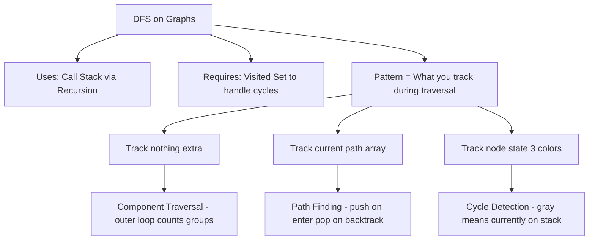
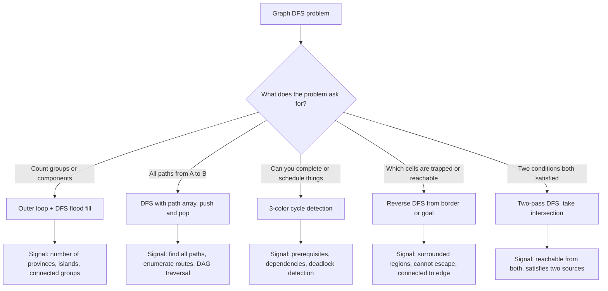

# Graph Traversal (DFS) - Fundamentals

> 📚 **Part of**: [Complete DSA Learning Path](../dsa/00-complete-dsa-path.md)
>
> **Generated**: 2026-03-01
>
> **Duration**: 4-6 days (full-time)
>
> **Prerequisites**:
> - [Graphs - Fundamentals](./graphs-fundamentals.md) — adjacency list, DFS/BFS intro, grid traversal
> - [Binary Trees - Fundamentals](./binary-trees-fundamentals.md) — recursive tree DFS is the foundation
> - [Heaps / Priority Queues](./heaps-priority-queues-fundamentals.md)
> - Recursion & Backtracking (Phase 1)

---

## 1. Overview

You already know DFS. Every time you wrote a recursive tree traversal, that was DFS — you just never had to worry about cycles. Graphs add one new problem: **you can loop forever**. The entire difference between tree DFS and graph DFS is a single visited set.

But once you have the visited set, what you *do* with it — and what else you track during traversal — splits into three distinct patterns: **exploring components**, **collecting paths**, and **detecting cycles**. Mastering each pattern is what this guide is about.

By the end, you'll have a clear mental model for when to use each pattern and exactly how to implement it.

---

## 2. Core Concept & Mental Model

### The Floor Plan Analogy

Think of a graph as a building with rooms (nodes) connected by hallways (edges). You're exploring it with a marker:

- When you enter a room, you **mark the door** so you know you've been there
- You follow one hallway as far as it takes you before backtracking
- When every hallway from a room leads somewhere already marked, you backtrack to the previous room
- The building may have **multiple disconnected wings** — after exhausting one wing, you walk back to the entrance and find another unmarked door

The **marked doors** are your visited set. Without them, a circular hallway (cycle) would spin you forever. With them, you visit every room exactly once.

The three patterns come from what you *carry with you* through the building:
- **Nothing extra** → you're just counting rooms per wing (component traversal)
- **A notepad tracking your current route** → you're collecting all paths from one room to another
- **A sticky note for each room (3 states)** → you're detecting whether any hallway loops back to a room you're still in the middle of exploring

### Concept Map



### Time & Space Complexity

| Operation      | Adjacency List | Grid                 |
| -------------- | -------------- | -------------------- |
| Full traversal | O(V + E)       | O(rows × cols)       |
| Space: visited | O(V)           | O(rows × cols)       |
| Space: stack   | O(V) worst     | O(rows × cols) worst |

---

## 3. Building Blocks — Progressive Learning

### Level 1: Component Traversal

**Why this level matters**
The most common graph DFS problem type: count how many separate groups exist. You solved Number of Islands on a grid already — this is the same idea but on an adjacency list graph. Understanding this level first builds the outer loop + DFS reflex that appears in nearly every graph problem.

**How to think about it**
A single DFS call from one node visits every node reachable from that starting point. That's *one component*. But the graph might have multiple disconnected components — DFS from node 0 will never find nodes only connected to node 4. The outer loop is the fix: scan every node in order, and whenever you find one that hasn't been visited yet, start a new DFS. Each fresh DFS = one new component.

The DFS itself doesn't care about components. It just marks every node it can reach. The outer loop is what *counts* how many times you had to start over.

**Walking through it**

When DFS starts at any node, it marks that node and then immediately recurses into every neighbor it hasn't marked yet — and every neighbor's neighbor, and so on. It doesn't stop until it has exhausted every reachable connection. This means a single DFS call doesn't just visit one node; it claims an entire component. Every node that belongs to the same connected group gets marked in one shot.

The outer loop's only job is to look for nodes that weren't claimed by any previous DFS call. If the outer loop reaches a node and finds it already marked, that node was reachable from some earlier starting point — it already has a home. If the outer loop reaches a node and finds it unmarked, that node has no path to anything previously seen. It must belong to a new group, so the loop starts a fresh DFS from there and increments the count.

This is why the count increments exactly once per component: each time you're forced to start over from an unmarked node, you're discovering a group that's completely disconnected from everything before it. The DFS that follows will mark every member of that group, so the outer loop will never need to start from any of them again.

**The one thing to get right**

You must run the outer loop over *all* nodes, not just nodes that appear in the edge list. A node with no edges still exists and counts as its own component — but it will never be discovered if you only start DFS from nodes you've seen in an edge.

```typescript
function findCircleNum(isConnected: number[][]): number {
  const n = isConnected.length;
  const visited = new Set<number>();
  let provinces = 0;

  function dfs(city: number): void {
    visited.add(city);
    for (let neighbor = 0; neighbor < n; neighbor++) {
      if (isConnected[city][neighbor] === 1 && !visited.has(neighbor)) {
        dfs(neighbor);
      }
    }
  }

  for (let i = 0; i < n; i++) {
    if (!visited.has(i)) {
      dfs(i);    // DFS floods one entire component
      provinces++;  // one DFS from an unvisited node = one component
    }
  }

  return provinces;
}
```

> **Mental anchor**: "Outer loop finds entry points. DFS floods each component. Count how many times you had to start fresh."

---

**→ Bridge to Level 2**: Component traversal doesn't care about the path you took to reach each node — you just mark and move on. But some problems ask you to *collect* every path from source to target. For that, you need to carry the current path with you as you recurse, and undo each step when you backtrack.

### Level 2: Path Finding with Backtracking

**Why this level matters**
Some problems don't just ask "are these nodes connected?" — they ask "what are all the ways to get there?" This requires a fundamentally different relationship with the path array. Instead of a passive visited set that accumulates, you now carry an *active path* that grows as you go deeper and shrinks as you backtrack. This pattern — push on entry, pop on return — is the same backtracking idea from subsets and combinations, now applied to graphs.

**How to think about it**
Picture walking through the building again, but now carrying a notepad where you write down every room you enter. When you reach the target room, you copy what's on the notepad into your results. When you backtrack out of a room, you cross off the last entry. Your notepad always reflects exactly where you currently are.

The critical insight: you're not using a global visited set here (this is a DAG — directed, no cycles, so revisiting isn't a risk). You use the path array itself as the state. Every recursive call adds one node to the path and removes it when done.

**Walking through it**

Graph `[[1,2],[3],[3],[]]` means:
- node 0's neighbors: [1, 2]
- node 1's neighbors: [3]
- node 2's neighbors: [3]
- node 3's neighbors: [] (target)

```
dfs(0, path=[])
  push 0 → path=[0]
  neighbor 1:
    dfs(1, path=[0])
      push 1 → path=[0,1]
      neighbor 3:
        dfs(3, path=[0,1])
          push 3 → path=[0,1,3]
          reached target! save copy: [[0,1,3]]
          pop 3 → path=[0,1]   ← backtrack
      pop 1 → path=[0]         ← backtrack
  neighbor 2:
    dfs(2, path=[0])
      push 2 → path=[0,2]
      neighbor 3:
        dfs(3, path=[0,2])
          push 3 → path=[0,2,3]
          reached target! save copy: [[0,1,3],[0,2,3]]
          pop 3 → path=[0,2]   ← backtrack
      pop 2 → path=[0]         ← backtrack
  pop 0 → path=[]
```

Final result: `[[0,1,3], [0,2,3]]`

**The one thing to get right**

When you reach the target and save the path, save a **copy** — not the array itself. The path array gets modified throughout the recursion. If you save the reference, every saved result will point to the same array, and they'll all look like empty arrays by the time you return.

```typescript
// WRONG — saves a reference to path, which gets mutated
results.push(path);

// CORRECT — saves a snapshot of the current state
results.push([...path]);
```

```typescript
function allPathsSourceTarget(graph: number[][]): number[][] {
  const target = graph.length - 1;
  const results: number[][] = [];

  function dfs(node: number, path: number[]): void {
    path.push(node);

    if (node === target) {
      results.push([...path]);  // save a copy, not the reference
      path.pop();
      return;
    }

    for (const neighbor of graph[node]) {
      dfs(neighbor, path);
    }

    path.pop();  // undo this node before returning to caller
  }

  dfs(0, []);
  return results;
}
```

> **Mental anchor**: "Push on enter, pop on return. Save a copy when you hit the target. The path is live state — it reflects exactly where you are in the recursion."

---

**→ Bridge to Level 3**: The path-finding pattern works on DAGs (directed acyclic graphs) because you'll always eventually reach a node with no outgoing edges. But many real graph problems involve directed graphs that *might* have cycles — dependency graphs, prerequisite chains. For these, you need to detect whether any cycle exists, which requires tracking something the visited set alone can't tell you.

### Level 3: Cycle Detection in Directed Graphs

**Why this level matters**
Course Schedule (207) is one of the most common medium-difficulty graph problems in interviews. Its core question is: do these dependencies form a cycle? If course A requires B, and B requires C, and C requires A — you can never start. Detecting this requires knowing not just "have I seen this node before?" but "am I *currently* exploring this node's subtree?"

**How to think about it**
With an undirected graph, cycle detection is straightforward — if you see a node that's already visited (and it's not your parent), there's a cycle. Directed graphs are harder.

Consider: node 0 → node 2, and node 1 → node 2. If you DFS from 0, then DFS from 1, when you reach node 2 from node 1's path, it's already in `visited`. But that's NOT a cycle — it's just two independent paths converging at node 2. A simple two-state visited check would falsely flag this as a cycle.

The fix is three states — think of traffic lights:
- **White (0)**: unvisited — haven't started here yet
- **Gray (1)**: in progress — currently on the DFS call stack, exploring this node's subtree
- **Black (2)**: fully done — completely explored, no cycle found below

A cycle exists if and only if you reach a **gray** node. Gray means "we started here and haven't finished yet" — finding it again means we've looped back into our own current path.

**Walking through it**

Graph: `0 → 1`, `1 → 2`, `2 → 0` (cycle: 0→1→2→0)

```
color = [0, 0, 0]

dfs(0):
  color[0] = 1 (gray)
  neighbor 1:
    dfs(1):
      color[1] = 1 (gray)
      neighbor 2:
        dfs(2):
          color[2] = 1 (gray)
          neighbor 0:
            color[0] is GRAY → cycle detected! return true
```

Now contrast with: `0 → 2`, `1 → 2` (no cycle — just converging paths)

```
color = [0, 0, 0]

dfs(0):
  color[0] = 1 (gray)
  neighbor 2:
    dfs(2):
      color[2] = 1 (gray)
      no neighbors
      color[2] = 2 (black)  ← done, clean
  color[0] = 2 (black)

dfs(1):  ← outer loop finds this
  color[1] = 1 (gray)
  neighbor 2:
    color[2] is BLACK → already fully explored, no cycle here → skip
  color[1] = 2 (black)
```

The black state is what allows two paths to share a node without falsely reporting a cycle. Black means "I already checked everything under this node and it was clean."

**The one thing to get right**

You must set a node gray *before* recursing into its neighbors, and black *after* all neighbors return. The order matters because the gray state is the cycle signal — it means "this node is open on the stack right now." If you only mark it after, you can't detect the back edge.

```typescript
function canFinish(numCourses: number, prerequisites: number[][]): boolean {
  const graph: number[][] = Array.from({ length: numCourses }, () => []);
  for (const [course, prereq] of prerequisites) {
    graph[prereq].push(course);
  }

  // 0 = unvisited, 1 = in progress (gray), 2 = fully done (black)
  const color = new Array(numCourses).fill(0);

  function dfs(node: number): boolean {
    if (color[node] === 1) return true;   // gray = back edge = cycle
    if (color[node] === 2) return false;  // black = clean subtree, skip

    color[node] = 1;  // mark gray before recursing

    for (const neighbor of graph[node]) {
      if (dfs(neighbor)) return true;
    }

    color[node] = 2;  // mark black after all neighbors explored
    return false;
  }

  for (let i = 0; i < numCourses; i++) {
    if (color[i] === 0 && dfs(i)) return false;
  }

  return true;
}
```

> **Mental anchor**: "White = untouched. Gray = on the stack right now. Black = clean and done. Hit a gray node = cycle. Hit a black node = safe to skip."

---

## 4. Key Patterns

### Pattern 1: Grid DFS — Reverse Flood Fill

**When to Use**:
- Grid problems where the answer is "which cells survive" or "which cells are trapped"
- Keywords: "surrounded", "border", "cannot escape", "fill from edge"
- The trick: instead of looking for trapped cells directly, find all cells that *aren't* trapped (connected to the border) and everything else is the answer

**How to think about it**
Problems like [130. Surrounded Regions](https://leetcode.com/problems/surrounded-regions/) ask you to flip all 'O' cells to 'X' *unless* they connect to the border. Scanning every 'O' for the trapped condition is hard — you'd have to prove a negative. Instead, scan the border first and DFS-mark everything connected to it as "safe." Then a single pass flips everything unmarked.

```typescript
function solve(board: string[][]): void {
  const rows = board.length;
  const cols = board[0].length;

  // Mark all 'O' cells connected to any border cell as safe
  function dfs(r: number, c: number): void {
    if (r < 0 || r >= rows || c < 0 || c >= cols || board[r][c] !== 'O') return;
    board[r][c] = 'S';  // safe marker
    dfs(r + 1, c); dfs(r - 1, c); dfs(r, c + 1); dfs(r, c - 1);
  }

  // Start from all four borders
  for (let r = 0; r < rows; r++) {
    dfs(r, 0);        // left column
    dfs(r, cols - 1); // right column
  }
  for (let c = 0; c < cols; c++) {
    dfs(0, c);        // top row
    dfs(rows - 1, c); // bottom row
  }

  // Final pass: 'S' = safe → restore to 'O'; remaining 'O' = surrounded → flip to 'X'
  for (let r = 0; r < rows; r++) {
    for (let c = 0; c < cols; c++) {
      if (board[r][c] === 'S') board[r][c] = 'O';
      else if (board[r][c] === 'O') board[r][c] = 'X';
    }
  }
}
```

**Complexity**:
- Time: O(rows × cols) — every cell visited at most once
- Space: O(rows × cols) — recursion stack depth in worst case

---

### Pattern 2: Multi-Source DFS — Two-Pass Intersection

**When to Use**:
- "Reachable from both X and Y"
- Two competing conditions that must both be satisfied
- Keywords: "reachable from both", "flows to both", "satisfies both constraints"

**How to think about it**
[417. Pacific Atlantic Water Flow](https://leetcode.com/problems/pacific-atlantic-water-flow/) asks which cells can flow water to *both* the Pacific and Atlantic oceans. Solving this forward (from each cell, does water reach both oceans?) is expensive. The reverse is clean: start DFS from the Pacific border cells and mark everything that can reach Pacific. Do the same for Atlantic. The answer is the intersection — cells marked by both passes.

This "reverse DFS from goal" technique appears whenever you have two sets of source conditions that must both be met.

```typescript
function pacificAtlantic(heights: number[][]): number[][] {
  const rows = heights.length;
  const cols = heights[0].length;

  function dfs(r: number, c: number, visited: boolean[][], prevHeight: number): void {
    if (
      r < 0 || r >= rows || c < 0 || c >= cols ||
      visited[r][c] ||
      heights[r][c] < prevHeight  // water flows down — going up means not reachable
    ) return;
    visited[r][c] = true;
    dfs(r + 1, c, visited, heights[r][c]);
    dfs(r - 1, c, visited, heights[r][c]);
    dfs(r, c + 1, visited, heights[r][c]);
    dfs(r, c - 1, visited, heights[r][c]);
  }

  const pacific  = Array.from({ length: rows }, () => new Array(cols).fill(false));
  const atlantic = Array.from({ length: rows }, () => new Array(cols).fill(false));

  for (let r = 0; r < rows; r++) {
    dfs(r, 0, pacific, heights[r][0]);           // Pacific left border
    dfs(r, cols - 1, atlantic, heights[r][cols - 1]); // Atlantic right border
  }
  for (let c = 0; c < cols; c++) {
    dfs(0, c, pacific, heights[0][c]);           // Pacific top border
    dfs(rows - 1, c, atlantic, heights[rows - 1][c]); // Atlantic bottom border
  }

  const result: number[][] = [];
  for (let r = 0; r < rows; r++) {
    for (let c = 0; c < cols; c++) {
      if (pacific[r][c] && atlantic[r][c]) result.push([r, c]);
    }
  }
  return result;
}
```

**Complexity**:
- Time: O(rows × cols) — two full traversals
- Space: O(rows × cols) — two visited grids

---

## 5. Decision Framework



**When DFS instead of BFS**:
- You need *all* paths, not just the shortest one
- You need to detect cycles
- You're flood-filling a region (component counting) — BFS works too but DFS is simpler to write
- Depth-first order matters (topological sort, post-order processing)

**When BFS instead of DFS**:
- You need the *shortest* path in an unweighted graph
- You need level-by-level distance information
- The graph is very deep (BFS avoids deep recursion stack issues)

---

## 6. Common Gotchas & Edge Cases

**Typical Mistakes**:

1. **Using 2-state visited for directed cycle detection** — Two converging paths sharing a node look like a cycle in a 2-state system. The 3-color algorithm (white/gray/black) is the fix. Gray catches back edges; black lets you safely skip already-explored nodes.

2. **Saving path by reference, not by copy** — `results.push(path)` saves a pointer to the live array. By the time DFS unwinds, the array is empty. Always `results.push([...path])`.

3. **Forgetting the outer loop for disconnected graphs** — DFS from node 0 won't find a component only connected to node 7. Always iterate over all nodes and start DFS from each unvisited one.

4. **Applying grid DFS in the wrong direction** — For "surrounded" or "border-connected" problems, DFS *from the border* toward the interior, not from each interior cell outward. The interior cells don't know whether they're connected to the border; the border cells always know they are.

5. **Not initializing graph entries for isolated nodes** — If a node has no edges, it won't appear in the edge list. Use `for (let i = 0; i < n; i++) graph[i] = []` before adding edges.

**Edge Cases to Always Test**:
- Single node, no edges → 1 component, no cycle
- All nodes fully connected → 1 component
- Linear chain → DFS stack depth = n (could stack overflow on large inputs)
- Self-loop in directed graph `[a, a]` → gray check catches this immediately
- Graph with both a cycle subgraph and a clean subgraph

**Debugging Tips**:
- For cycle detection: print the color array at each step — it should transition 0 → 1 → 2 cleanly without jumping from 0 → 2 or staying at 1
- For path finding: print `path` at the start of each DFS call to see the current state; print `results` each time you push to confirm copies are correct
- For component counting: after DFS, print the visited set — it should contain exactly the nodes you expect in that component

---

## 7. Practice Path

### Starter Problems — Build Intuition

- [ ] [547. Number of Provinces](https://leetcode.com/problems/number-of-provinces/)
  *Outer loop + DFS on an adjacency matrix. This is Number of Islands but without the grid — pure component counting on explicit node connections.*

- [ ] [797. All Paths From Source to Target](https://leetcode.com/problems/all-paths-from-source-to-target/)
  *The cleanest path-finding problem. DAG means no visited set needed — just path array + backtracking.*

### Core Problems — Master the Pattern

- [ ] [207. Course Schedule](https://leetcode.com/problems/course-schedule/)
  *Cycle detection on a directed graph. This is the pattern to internalize — it unlocks topological sort, Course Schedule II, and all dependency problems.*

### Challenge Problems — Test Mastery

- [ ] [130. Surrounded Regions](https://leetcode.com/problems/surrounded-regions/)
  *Reverse flood fill from the border. The key insight is not obvious — work through it carefully.*

- [ ] [417. Pacific Atlantic Water Flow](https://leetcode.com/problems/pacific-atlantic-water-flow/)
  *Two-pass DFS with intersection. Requires combining two separate traversals correctly.*

**Suggested Order**:

1. **547 first** — you've already done Number of Islands on a grid. Now do it on a matrix. The outer loop + component counting pattern becomes automatic.

2. **797 second** — introduces the path array and backtracking. Small input, clear structure. Trace through by hand before coding.

3. **207 third** — the hardest conceptually. Draw the graph, label nodes with colors as you trace DFS manually. The gray/black distinction only makes sense once you've seen it live.

4. **130 and 417 after Graph BFS** — both work with DFS but are hard enough to benefit from also understanding BFS before you tackle them. They're listed here because the technique is DFS, but don't rush them.
