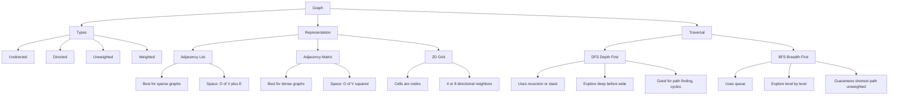
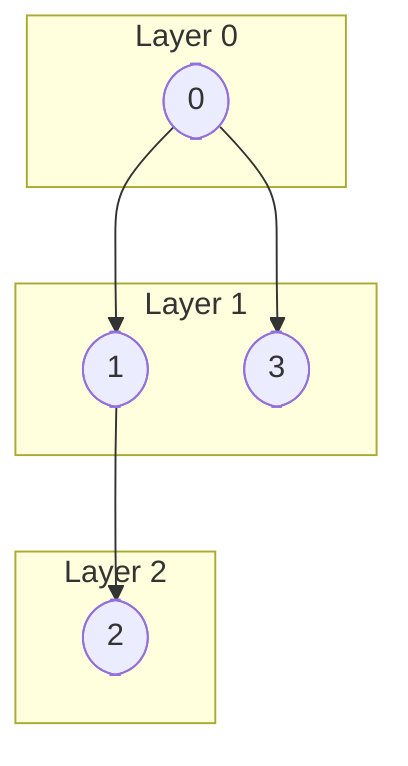
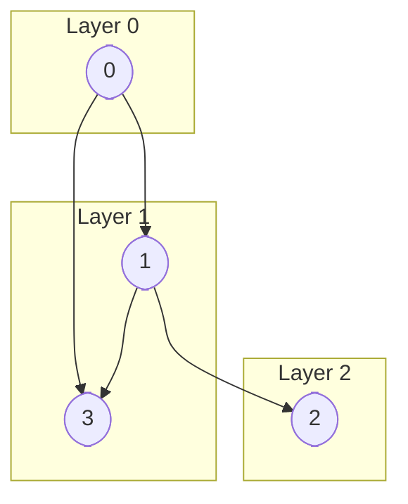
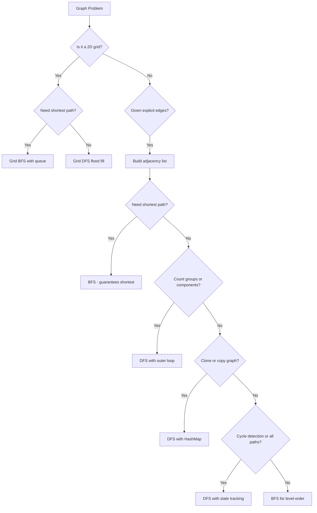

# Graphs - Fundamentals

> 📚 **Part of**: [Complete DSA Learning Path](../dsa/00-complete-dsa-path.md)
>
> **Generated**: 2026-02-24
>
> **Duration**: 4-6 days (full-time)
>
> **Prerequisites**:
> - [Binary Trees](./binary-trees-fundamentals.md) — tree traversal, recursion on nodes
> - [BST](./bst-fundamentals.md) — ordered hierarchical thinking
> - [Heaps / Priority Queues](./heaps-priority-queues-fundamentals.md) — priority-based traversal (used later in Dijkstra)

---

## 1. Overview

Graphs are the most general and powerful data structure in computer science — a collection of nodes (vertices) connected by edges. Nearly everything can be modeled as a graph: city road maps, social networks, dependency chains, game states, and course prerequisites.

In interviews, graph problems are everywhere and often disguised — 2D grids, connection queries, scheduling constraints. Recognizing a graph problem is half the battle.

By the end of this guide you'll know how to represent graphs in code, traverse them with DFS and BFS, and spot graph problems even when they don't look like graphs (grids are graphs!).

---

## 2. Core Concept & Mental Model

### The City Road Map Analogy

Think of a graph as a **city road map**:
- **Nodes (vertices)** = cities
- **Edges** = roads connecting cities
- **Directed** = one-way streets (A → B but not B → A)
- **Undirected** = two-way streets (A ↔ B)
- **Weighted** = roads with travel times or distances

Unlike trees, graphs have **no root** and **can have cycles** — you can drive in a circle forever unless you track where you've been.

**Key insight**: A tree is just a special graph — connected, acyclic, undirected. Everything you know about tree traversal (DFS, BFS) applies directly to graphs. The only new ingredient is the **visited set** to prevent infinite loops from cycles.

### Concept Map



### Key Operations

| Operation            | Adjacency List | Adjacency Matrix |
| -------------------- | -------------- | ---------------- |
| Add vertex           | O(1)           | O(V²)            |
| Add edge             | O(1)           | O(1)             |
| Check if edge exists | O(degree)      | O(1)             |
| Find all neighbors   | O(degree)      | O(V)             |
| Space                | O(V + E)       | O(V²)            |

**When to use each representation**:
- **Adjacency List** → sparse graphs (most interview problems). Use `Map<number, number[]>`
- **Adjacency Matrix** → dense graphs, when O(1) edge lookup matters. Use `boolean[][]`
- **Grid as a graph** → 2D grid problems. Cells are nodes, neighbors are up/down/left/right

---

## 3. Building Blocks - Progressive Learning

### Level 1: Representing a Graph

**Why this level matters**
Every graph algorithm starts from the same foundation: you need a way to answer "given a node, who are its neighbors?" The adjacency list is the answer to almost every interview problem.

**How to think about it**
A graph is just "who connects to who." The adjacency list is a Map where each key is a node and each value is its list of neighbors. Nothing more abstract than a lookup table. You're not computing anything yet, just recording relationships.

Whether you add one direction or both depends on what the edges represent — the problem tells you, not the data. "Roads between cities" means undirected (add both). "Course prerequisites" or "who follows who" means directed (add one).

**Walking through it**

Three edges to add: `0→1`, `1→2`, `0→3`. Each row below is one node's neighbor list.

Each edge `[from, to]` means "`from` can reach `to`" — so only `from`'s neighbor list gains a new entry. `to`'s list is unchanged because the edge says nothing about where `to` can go. (If the graph is [[#The City Road Map Analogy|undirected]] — a two-way street — you'd also push `from` onto `to`'s list.)

After initializing (before any edges):
```
0: []
1: []
2: []
3: []
```

After adding `0→1`:
```
0: [1]   ← updated
1: []
2: []
3: []
```

After adding `1→2`:
```
0: [1]
1: [2]   ← updated
2: []
3: []
```

After adding `0→3`:
```
0: [1, 3]   ← updated again
1: [2]
2: []
3: []
```

That's a directed graph — edge `0→1` only means 0 can reach 1. If the graph were [[#The City Road Map Analogy|undirected]], every edge goes both ways, so each edge updates *two* rows:

```
0: [1, 3]
1: [0, 2]   ← 0→1 also added 0 here
2: [1]      ← 1→2 also added 1 here
3: [0]      ← 0→3 also added 0 here
```

**The one thing to get right**

Say node 3 has no edges. If you skip initialization and only loop over the edge list, you never write a row for node 3:

```
Without initialization:    With initialization:

0: [1]                     0: [1]
1: [2]                     1: [2]
2: []                      2: []
                           3: []   ← this row exists
```

Without initialization: `graph.has(3)` returns `false` and `graph.get(3)` returns `undefined`. Any code that looks up node 3 will act as if it doesn't exist.

A node should exist in the Map because it's a node — not because it happens to connect to something.

```typescript
// n = 4 → nodes are 0, 1, 2, 3
// edges = [[0,1],[1,2],[0,3]]  → the connections to record
// directed returns:   Map { 0→[1,3], 1→[2],    2→[],   3→[]   }
// undirected returns: Map { 0→[1,3], 1→[0,2],  2→[1],  3→[0]  }
function buildAdjacencyList(n: number, edges: number[][]): Map<number, number[]> {
  const graph = new Map<number, number[]>();

  // Initialize all nodes
  for (let i = 0; i < n; i++) {
    graph.set(i, []);
  }

  // Directed (one-way): only from gains a neighbor
  for (const [from, to] of edges) {
    graph.get(from)!.push(to);
  }

  // Undirected (two-way): both nodes gain a neighbor
  // for (const [from, to] of edges) {
  //   graph.get(from)!.push(to);
  //   graph.get(to)!.push(from);
  // }

  return graph;
}
```

> **Mental anchor**: "Adjacency list = Map: each node → its neighbors list."

---

**→ Bridge to Level 2**: Now you can store any graph. But storing it isn't enough — looping over the Map visits nodes in insertion order, not in any connected or meaningful order. To actually explore the graph, you need traversal.

### Level 2: DFS — Following One Path Until It Ends

**Why this level matters**
You need a way to visit every reachable node exactly once. DFS is the simplest: follow each path as far as it goes, then backtrack.

**How to think about it**
DFS is like exploring a building by always taking the first door you haven't tried yet. You exhaust one entire wing before coming back to try other doors. The key difference from tree DFS: trees can't [[#The City Road Map Analogy|cycle]], graphs can. Without a [[#The City Road Map Analogy|visited set]], two connected nodes would bounce you between them forever.

`Map { 0 → [1,3], 1 → [2], 2→[], 3→[] }

**Walking through it**
- Start at 0. 
- Mark visited = `{0}`. Neighbors are `[1, 3]` — take 1 first. 
- Mark visited = `{0, 1}`. Node 1's neighbor is 2 — take it. 
- Mark visited = `{0, 1, 2}`. Node 2 has no unvisited neighbors, so backtrack. 
- Back at 1: nothing left. 
- Back at 0: take 3. 
- Mark visited = `{0, 1, 2, 3}`. 
- Done — every node reached.

**The one thing to get right**
Mark visited *before* recursing into neighbors, not after. If you mark after, a [[#The City Road Map Analogy|cycle]] can bring you back to this node before the first visit finishes — you'll recurse into it again before it's marked, and the loop never ends.

```typescript
function dfs(
  graph: Map<number, number[]>,
  node: number,
  visited: Set<number>
): void {
  if (visited.has(node)) return;
  visited.add(node);

  console.log("Visiting:", node);

  for (const neighbor of graph.get(node) ?? []) {
    dfs(graph, neighbor, visited);
  }
}

// Basic usage: DFS from a single start node.
// This visits every node reachable from start. That's all you need.
const visited = new Set<number>();
dfs(graph, 0, visited);  // visits 0 → 1 → 2 → 3
```

**Extension: what if the graph is disconnected?**

`dfs(graph, 0, visited)` only reaches nodes connected to node 0. If the graph has separate groups with no edges between them, nodes in the other groups are never reached.

The outer loop is the fix — not part of DFS itself, just a wrapper that says: after each DFS finishes, check if any node was still never visited. If so, start another DFS from there. Repeat until every node has been seen.

```typescript
// Only needed when the graph might be disconnected
function visitAllNodes(n: number, graph: Map<number, number[]>): void {
  const visited = new Set<number>();
  for (let node = 0; node < n; node++) {
    if (!visited.has(node)) dfs(graph, node, visited);
  }
}
```

**Extension: early-exit DFS — stop as soon as you find the target**

The basic DFS always visits every reachable node. If you only need to know whether a target exists — not visit everything — you can return a `boolean` and stop the moment you find it.

The key insight is in the `for` loop:

```typescript
for (const neighbor of graph.get(node) ?? []) {
  if (dfs(neighbor)) return true;  // true bubbles all the way up — done
  // false = dead end on this branch, loop continues to next neighbor
}
return false;  // only reached if every branch returned false
```

`false` doesn't propagate — it just lets the loop move to the next neighbor. `true` is the signal that short-circuits everything above it immediately. So a single branch returning `false` doesn't end the search; it just means "try the next door."

```typescript
function hasPath(graph: Map<number, number[]>, start: number, target: number): boolean {
  const visited = new Set<number>();

  function dfs(node: number): boolean {
    if (node === target) return true;   // found — stop here
    if (visited.has(node)) return false;
    visited.add(node);

    for (const neighbor of graph.get(node) ?? []) {
      if (dfs(neighbor)) return true;   // one branch found it — done
    }
    return false;  // exhausted all branches from this node
  }

  return dfs(start);
}
```

Use the void DFS when you need to visit everything (counting components, flood fill). Use the boolean DFS when you only care about reachability.

> **Mental anchor**: "DFS = go deep, mark first, backtrack. Visited set = the only thing stopping cycles from looping forever."

---

**→ Bridge to Level 3**: DFS visits every reachable node, but the order is arbitrary — it follows whichever edges come first. That's fine for counting components or flood-filling a region. But if you need the *shortest* path between two nodes, DFS could wander through a long detour before finding the target. That's what BFS solves.

### Level 3: BFS — Exploring Layer by Layer

**Why this level matters**
DFS doesn't care about distance, so it can't guarantee shortest path. BFS explores nodes in strict order of distance from the start — processing all direct neighbors first, then their neighbors, and so on. This is why BFS *guarantees* the shortest path in [[#The City Road Map Analogy|unweighted]] graphs.

**How to think about it**
BFS uses a queue (FIFO). You start by enqueuing the source node. When you process a node, you enqueue its unvisited neighbors at the back. This means you finish processing every direct neighbor of the source before you ever touch a neighbor's neighbor.

That ordering is what guarantees shortest path: the first time BFS reaches a target node, it got there via the most direct route — because every shorter route was already processed earlier in the queue. A longer route would still be sitting in the back.

DFS has no such guarantee. It dives down one path immediately, potentially reaching the target via a long detour before it ever tries the short route.

**Walking through it**

Here's the graph we're traversing from node `0`:



Notice `1` and `3` are both Layer 1 — BFS finishes both before ever touching `2`. That ordering comes directly from the queue, as you'll see below.

---

**BFS**

```typescript
const visited = new Set<number>();
const distance = new Map<number, number>();

const queue: number[] = [start];
visited.add(start);
distance.set(start, 0);

while (queue.length > 0) {
	const node = queue.shift()!;  // O(n) — acceptable for interviews
	for (const neighbor of graph.get(node) ?? []) {
	  if (!visited.has(neighbor)) {
		visited.add(neighbor);
		distance.set(neighbor, distance.get(node)! + 1);
		queue.push(neighbor);
	  }
	}
}
```

**Initialization — before the loop starts**

```typescript
const queue: number[] = [start]; // queue = [0]
visited.add(start);              // visited = {0}
distance.set(start, 0);          // distance = {0: 0}
```

The start node is seeded into all three structures. It's marked `visited` immediately when enqueued — not when processed — so it can never be re-enqueued later.

```
queue:    [0]
visited:  {0}
distance: {0: 0}
```

---

**Iteration 1** — `node = queue.shift()` pulls **0** off the front

`queue.shift()` removes the first element. `queue` is now `[]`. We look up `graph.get(0)` → neighbors are `[1, 3]`.

Neither `1` nor `3` is in `visited`, so for each:

```typescript
visited.add(neighbor);                           // mark immediately on enqueue
distance.set(neighbor, distance.get(node)! + 1) // distance of 0 was 0, so +1 = 1
queue.push(neighbor);                            // join the back of the queue
```

```
queue:    [1, 3]
visited:  {0, 1, 3}
distance: {0:0, 1:1, 3:1}
```

---

**Iteration 2** — `node = queue.shift()` pulls **1** off the front

`queue` is now `[3]`. Neighbors of `1: [2]`. 

Not in `visited` so continue with: 

```typescript
visited.add(2);
distance.set(2, distance.get(1)! + 1) // distance of 1 was 1, so +1 = 2
queue.push(2);
```

```
queue:    [3, 2]
visited:  {0, 1, 2, 3}
distance: {0:0, 1:1, 2:2, 3:1}
```

`distance.get(node)! + 1` is the key line — each node inherits its distance from whoever discovered it, then adds one. This is how distances accumulate correctly across layers.

---

**Iteration 3** — `node = queue.shift()` pulls **3** off the front

`queue` is now `[2]`. Neighbors of `3`: none. The `for` loop body never runs.

```
queue:    [2]
visited:  {0, 1, 2, 3}    ← unchanged
distance: {0:0, 1:1, 2:2, 3:1}  ← unchanged
```

---

**Iteration 4** — `node = queue.shift()` pulls **2** off the front

`queue` is now `[]`. Neighbors of `2`: none.

```
queue:    []
visited:  {0, 1, 2, 3}
distance: {0:0, 1:1, 2:2, 3:1}
```

`queue.length > 0` is now `false` — the `while` loop exits. BFS returns `distance`, which now holds the shortest path from `0` to every reachable node.

**The one thing to get right**

When I add a node to the queue, I should mark it as visited *at that same moment* — not later when I actually process it.

The reason: there is a gap between when I add a node to the queue and when I get around to processing it. During that gap, other nodes may also discover that same node and try to add it too. If I haven't marked it yet, my `visited` check won't catch that — so the same node ends up in the queue multiple times, and its distance gets overwritten each time, leaving me with the wrong answer.

Marking it the moment I add it closes that gap. Once a node is in `visited`, any future neighbor that tries to add it will see it's already been claimed and skip it.

To see why this matters, add one edge to our graph: `1 → 3`. Now `3` is reachable from both `0` (distance 1) and `1` (distance 2 via the longer path).



The correct shortest distance from `0` to `3` is **1** — the direct edge.


```
queue:    [3, 2, 3]   ← 3 is in here twice
visited:  {0, 1}      ← 3 still not marked
distance: {0:0, 1:1, 3:2}  ← WRONG — was 1, now overwritten to 2
```

When `3` finally gets dequeued, its recorded distance is `2` instead of `1`. No crash — just a silently wrong answer.

---


**Mark-on-enqueue prevents this entirely.**

When I mark a node visited the moment I add it to the queue, any other node that later tries to add it will see it's already in `visited` and skip it. The first path to reach a node wins — and in BFS, the first path is always the shortest. The distance gets set once, correctly, and never touched again.

```typescript
function bfs(
  graph: Map<number, number[]>,
  start: number
): Map<number, number> {
  const visited = new Set<number>();
  const distance = new Map<number, number>();

  const queue: number[] = [start];
  visited.add(start);
  distance.set(start, 0);

  while (queue.length > 0) {
    const node = queue.shift()!;  // O(n) — acceptable for interviews

    for (const neighbor of graph.get(node) ?? []) {
      if (!visited.has(neighbor)) {
        visited.add(neighbor);
        distance.set(neighbor, distance.get(node)! + 1);
        queue.push(neighbor);
      }
    }
  }

  return distance;
}
```

> **Mental anchor**: "Queue = FIFO = level-by-level = shortest distance guaranteed."

#### Grid DFS

In grid problems, the graph is implicit — you never build an adjacency list. Each cell *is* a node, and its neighbors are the four adjacent cells. The visited check becomes a 2D boolean array. Everything else is identical to Level 2's DFS.

```typescript
function gridDFS(
  grid: string[][],
  row: number,
  col: number,
  visited: boolean[][]
): void {
  if (
    row < 0 || row >= grid.length ||
    col < 0 || col >= grid[0].length ||
    visited[row][col] ||
    grid[row][col] === '0'
  ) return;

  visited[row][col] = true;  // mark before recursing

  gridDFS(grid, row - 1, col, visited);
  gridDFS(grid, row + 1, col, visited);
  gridDFS(grid, row, col - 1, visited);
  gridDFS(grid, row, col + 1, visited);
}
```

---

## 4. Key Patterns

### Pattern 1: Island Counting / Flood Fill (Grid DFS)

**When to Use**:
- 2D grid with connected regions of the same value
- "Count groups", "find largest area", "spread/infect"
- Keywords: island, region, province, connected cells, flood

**Template**:

```typescript
// ================================================================
// FLOOD FILL — Grid DFS Template
// Works for: count islands, max area, paint regions, rotting fruit
// ================================================================

function floodFill(
  grid: number[][],
  startRow: number,
  startCol: number,
  targetValue: number,
  visited: boolean[][]
): number {
  // Bounds + validity + visited check — all in one guard
  if (
    startRow < 0 || startRow >= grid.length ||
    startCol < 0 || startCol >= grid[0].length ||
    visited[startRow][startCol] ||
    grid[startRow][startCol] !== targetValue  // only visit matching cells
  ) return 0;

  visited[startRow][startCol] = true;

  // Count this cell + all connected cells
  let area = 1;
  area += floodFill(grid, startRow + 1, startCol, targetValue, visited);
  area += floodFill(grid, startRow - 1, startCol, targetValue, visited);
  area += floodFill(grid, startRow, startCol + 1, targetValue, visited);
  area += floodFill(grid, startRow, startCol - 1, targetValue, visited);

  return area;
}

// Usage: find max island area
function maxAreaOfIsland(grid: number[][]): number {
  const rows = grid.length;
  const cols = grid[0].length;
  const visited = Array.from({ length: rows }, () => new Array(cols).fill(false));
  let maxArea = 0;

  for (let r = 0; r < rows; r++) {
    for (let c = 0; c < cols; c++) {
      if (grid[r][c] === 1 && !visited[r][c]) {
        const area = floodFill(grid, r, c, 1, visited);
        maxArea = Math.max(maxArea, area);
      }
    }
  }

  return maxArea;
}
```

**Complexity**:
- Time: O(rows × cols) — each cell visited at most once
- Space: O(rows × cols) — visited array + recursion stack depth

### Pattern 2: Graph Cloning (DFS + Node Map)

**When to Use**:
- Deep copy of a graph structure
- When you need to map original → new nodes
- Keywords: clone, copy, deep copy

**Template**:

```typescript
// ================================================================
// CLONE GRAPH — DFS + HashMap template
// The HashMap serves two purposes:
//   1. Tracks which nodes have been cloned (visited check)
//   2. Stores the cloned node so neighbors can reference it
// ================================================================

class GraphNode {
  val: number;
  neighbors: GraphNode[];
  constructor(val = 0) {
    this.val = val;
    this.neighbors = [];
  }
}

function cloneGraph(node: GraphNode | null): GraphNode | null {
  if (!node) return null;

  // originalNode → clonedNode
  const cloneMap = new Map<GraphNode, GraphNode>();

  function dfs(original: GraphNode): GraphNode {
    // Already cloned? Return the existing copy
    // This handles cycles — without this check, cyclic graphs would infinite loop
    if (cloneMap.has(original)) return cloneMap.get(original)!;

    // Create the clone (empty neighbors for now)
    const clone = new GraphNode(original.val);

    // CRITICAL: Store in map BEFORE recursing into neighbors
    // If we recurse first, a cycle back to this node would create a new clone
    cloneMap.set(original, clone);

    // Clone all neighbors
    for (const neighbor of original.neighbors) {
      clone.neighbors.push(dfs(neighbor));
    }

    return clone;
  }

  return dfs(node);
}
```

**Complexity**:
- Time: O(V + E) — each node and edge visited once
- Space: O(V) — HashMap stores one entry per node

### Pattern 3: Connected Components (DFS with Outer Loop)

**When to Use**:
- Count distinct groups in a graph
- Check if graph is fully connected (return value = 1)
- "How many separate clusters/networks/groups?"

**Template**:

```typescript
// ================================================================
// CONNECTED COMPONENTS — Full Template
// ================================================================

function countConnectedComponents(n: number, edges: number[][]): number {
  // Build UNDIRECTED adjacency list
  const adj = new Map<number, number[]>();
  for (let i = 0; i < n; i++) adj.set(i, []);

  for (const [a, b] of edges) {
    adj.get(a)!.push(b);  // both directions for undirected
    adj.get(b)!.push(a);
  }

  const visited = new Set<number>();

  function dfs(node: number): void {
    visited.add(node);
    for (const neighbor of adj.get(node)!) {
      if (!visited.has(neighbor)) dfs(neighbor);
    }
  }

  let components = 0;

  for (let i = 0; i < n; i++) {
    if (!visited.has(i)) {
      // Unvisited node = new component
      // DFS will mark every node in this component as visited
      dfs(i);
      components++;
    }
  }

  return components;
}

// Variation: check if graph is a valid tree
// A valid tree has exactly (n-1) edges AND is fully connected (1 component)
function isValidTree(n: number, edges: number[][]): boolean {
  if (edges.length !== n - 1) return false;  // quick check: trees have exactly n-1 edges
  return countConnectedComponents(n, edges) === 1;
}
```

**Complexity**:
- Time: O(V + E)
- Space: O(V) for visited set + O(V) recursion stack

---

## 5. Decision Framework



**Recognition Signals**:
- "Number of islands / regions / groups / provinces" → DFS flood fill
- "Shortest path" in unweighted graph → BFS
- "Clone / copy graph" → DFS + HashMap
- "Connected components / clusters" → DFS with outer loop
- "Can we reach X from Y?" → BFS/DFS, check if target is visited
- Grid + "connected", "spread", "infect", "flow" → think graph

**When NOT to Use Graph traversal**:
- Data is sorted or searchable → binary search
- Linear relationship → two pointers or sliding window
- Need optimal path with edge weights → Dijkstra (advanced graphs)
- Simple parent-child hierarchy without cycles → plain tree traversal

---

## 6. Common Gotchas & Edge Cases

**Typical Mistakes**:

1. **Forgetting the visited set** — The #1 mistake. Without it, any cycle causes infinite recursion. Always initialize `visited` before the first DFS/BFS call.

2. **Building directed when it should be undirected** — For "connected components" and "valid tree" problems, the graph is undirected. Add edges in BOTH directions: `adj[a].push(b); adj[b].push(a)`.

3. **Off-by-one in grid bounds** — The check `row < grid.length` not `row <= grid.length`. Row and col indices are 0-based.

4. **Marking visited too late** — For BFS especially, mark a node as visited when you **enqueue** it, not when you **dequeue** it. Otherwise you enqueue the same node multiple times.

5. **Not initializing adjacency list for all nodes** — Nodes with no edges won't appear in the `edges` array. Initialize all `n` nodes upfront or use `adj.get(node) ?? []`.

**Edge Cases to Always Test**:
- Empty graph: `n = 0` or empty grid → return 0
- Single node, no edges → 1 component
- Fully disconnected: all isolated nodes → n components
- Fully connected: one giant component → 1 component
- Grid: single row `1 × n` or single column `n × 1`
- Self-loop: edge `[a, a]` → visited check handles this

**Debugging Tips**:
- Print the adjacency list before traversal: `console.log([...graph.entries()])`
- Add `console.log("visit:", node)` inside DFS to trace execution
- For grids, visualize which cells are visited using a 2D print
- If you get a stack overflow, your visited set isn't working — check if you're using the right reference

---

## 7. Practice Path

**Problems from Your DSA Guide**:

### Starter Problems — Build Intuition

- [ ] [200. Number of Islands](https://leetcode.com/problems/number-of-islands/)
  *The canonical graph problem. Grid + DFS flood fill + outer loop count.*

- [ ] [695. Max Area of Island](https://leetcode.com/problems/max-area-of-island/)
  *Same pattern as #200, add accumulation — DFS returns area of each island.*

### Core Problems — Master the Pattern

- [ ] [133. Clone Graph](https://leetcode.com/problems/clone-graph/)
  *Introduces adjacency list graph + DFS + HashMap for cycle-safe cloning.*

### Challenge Problems — Test Mastery

- [ ] [323. Number of Connected Components in an Undirected Graph](https://leetcode.com/problems/number-of-connected-components-in-an-undirected-graph/) *(Premium)*
  *Pure connected-components pattern on an explicit graph (not a grid).*

- [ ] [261. Graph Valid Tree](https://leetcode.com/problems/graph-valid-tree/) *(Premium)*
  *Combine connected components check with edge count constraint.*

**Suggested Order**:

1. **200. Number of Islands** — Start here. It's the simplest graph problem. Grid is the graph, DFS is the traversal, outer loop counts components.

2. **695. Max Area of Island** — Immediately after #200. Same pattern, just accumulate area. Builds confidence before moving to explicit graphs.

3. **133. Clone Graph** — Now tackle an explicit adjacency list graph. The HashMap trick here is fundamental for all graph problems.

4. **Return to 323 and 261** after completing the Graph DFS section in your DSA path. These cement connected-components intuition on non-grid graphs.
