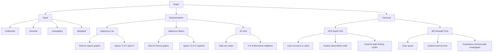
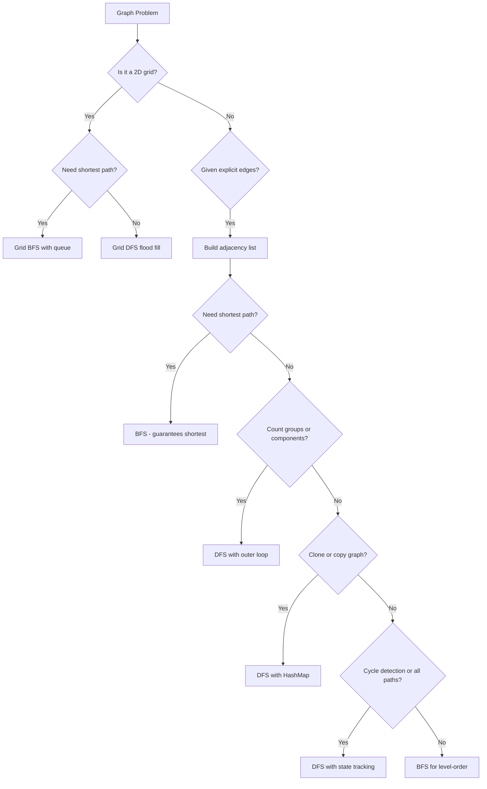

# Graphs - Fundamentals

> 📚 **Part of**: [Complete DSA Learning Path](../dsa/00-complete-dsa-path.md)
>
> **Generated**: 2026-02-24
>
> **Duration**: 4-6 days (full-time)
>
> **Prerequisites**:
> - [Binary Trees](./binary-trees-fundamentals.md) — tree traversal, recursion on nodes
> - [BST](./bst-fundamentals.md) — ordered hierarchical thinking
> - [Heaps / Priority Queues](./heaps-priority-queues-fundamentals.md) — priority-based traversal (used later in Dijkstra)

---

## 1. Overview

Graphs are the most general and powerful data structure in computer science — a collection of nodes (vertices) connected by edges. Nearly everything can be modeled as a graph: city road maps, social networks, dependency chains, game states, and course prerequisites.

In interviews, graph problems are everywhere and often disguised — 2D grids, connection queries, scheduling constraints. Recognizing a graph problem is half the battle.

By the end of this guide you'll know how to represent graphs in code, traverse them with DFS and BFS, and spot graph problems even when they don't look like graphs (grids are graphs!).

---

## 2. Core Concept & Mental Model

### The City Road Map Analogy

Think of a graph as a **city road map**:
- **Nodes (vertices)** = cities
- **Edges** = roads connecting cities
- **Directed** = one-way streets (A → B but not B → A)
- **Undirected** = two-way streets (A ↔ B)
- **Weighted** = roads with travel times or distances

Unlike trees, graphs have **no root** and **can have cycles** — you can drive in a circle forever unless you track where you've been.

**Key insight**: A tree is just a special graph — connected, acyclic, undirected. Everything you know about tree traversal (DFS, BFS) applies directly to graphs. The only new ingredient is the **visited set** to prevent infinite loops from cycles.

### Concept Map



### Key Operations

| Operation | Adjacency List | Adjacency Matrix |
|-----------|---------------|-----------------|
| Add vertex | O(1) | O(V²) |
| Add edge | O(1) | O(1) |
| Check if edge exists | O(degree) | O(1) |
| Find all neighbors | O(degree) | O(V) |
| Space | O(V + E) | O(V²) |

**When to use each representation**:
- **Adjacency List** → sparse graphs (most interview problems). Use `Map<number, number[]>`
- **Adjacency Matrix** → dense graphs, when O(1) edge lookup matters. Use `boolean[][]`
- **Grid as a graph** → 2D grid problems. Cells are nodes, neighbors are up/down/left/right

---

## 3. Building Blocks - Progressive Learning

### Level 1: Simplest Form — Graph Representation

Before you can traverse, you need to represent a graph in memory.

```typescript
// ================================================================
// GRAPH REPRESENTATION: Adjacency List
// Input: n nodes (0 to n-1), edges as pairs [from, to]
// ================================================================

function buildAdjacencyList(n: number, edges: number[][]): Map<number, number[]> {
  const graph = new Map<number, number[]>();

  // STEP 1: Initialize every node with an empty neighbor list
  // Critical: nodes with no edges won't appear in the edges array
  for (let i = 0; i < n; i++) {
    graph.set(i, []);
  }

  // STEP 2: Add each edge
  for (const [from, to] of edges) {
    graph.get(from)!.push(to);  // directed: from → to only

    // For UNDIRECTED graphs, also add the reverse:
    // graph.get(to)!.push(from);
  }

  return graph;
}

// ================================================================
// GRID AS A GRAPH (extremely common in interviews)
// No need to build an explicit adjacency list!
// Neighbors = cells in 4 directions (or 8 for diagonal movement)
// ================================================================

const DIRECTIONS = [
  [-1, 0],  // up
  [1, 0],   // down
  [0, -1],  // left
  [0, 1],   // right
];

// Check if a cell is inside the grid bounds
function inBounds(row: number, col: number, grid: string[][]): boolean {
  return row >= 0 && row < grid.length && col >= 0 && col < grid[0].length;
}
```

### Level 2: Adding Traversal — DFS

```typescript
// ================================================================
// GRAPH DFS — Depth First Search
// Strategy: go as DEEP as possible, then backtrack
// Use: path finding, cycle detection, connected components
// ================================================================

function dfs(
  graph: Map<number, number[]>,
  node: number,
  visited: Set<number>  // CRITICAL: prevents infinite loops from cycles
): void {
  // Already visited? Stop — this is how we handle cycles
  if (visited.has(node)) return;

  // Mark visited BEFORE exploring neighbors
  // If you mark after, you can visit the same node twice in a cycle
  visited.add(node);

  // Process this node (print it, count it, collect it...)
  console.log("Visiting:", node);

  // Recurse into each unvisited neighbor
  for (const neighbor of graph.get(node) ?? []) {
    dfs(graph, neighbor, visited);
    // visited.has check is redundant here since dfs starts with that check
    // but being explicit is fine too
  }
}

// Pattern: outer loop to cover disconnected components
function visitAllNodes(n: number, graph: Map<number, number[]>): void {
  const visited = new Set<number>();

  for (let node = 0; node < n; node++) {
    if (!visited.has(node)) {
      // This node hasn't been reached yet — a new disconnected component!
      dfs(graph, node, visited);
    }
  }
}
```

### Level 3: Full Pattern — BFS + Grid DFS Template

```typescript
// ================================================================
// GRAPH BFS — Breadth First Search
// Strategy: explore level by level (queue, not recursion)
// Key property: BFS guarantees SHORTEST path in unweighted graphs
// ================================================================

function bfs(
  graph: Map<number, number[]>,
  start: number
): Map<number, number> {
  const visited = new Set<number>();
  const distance = new Map<number, number>();

  // Initialize queue with starting node
  const queue: number[] = [start];
  visited.add(start);
  distance.set(start, 0);

  while (queue.length > 0) {
    const node = queue.shift()!;  // dequeue from FRONT (FIFO)
    // Note: queue.shift() is O(n) — acceptable for interviews.
    // For production, use a proper deque (e.g., two-stack queue)

    for (const neighbor of graph.get(node) ?? []) {
      if (!visited.has(neighbor)) {
        visited.add(neighbor);
        // BFS level guarantees this is the shortest distance
        distance.set(neighbor, distance.get(node)! + 1);
        queue.push(neighbor);  // enqueue at BACK
      }
    }
  }

  return distance;
  // If distance.has(target) → reachable from start
  // distance.get(target) → shortest path length
}

// ================================================================
// GRID DFS TEMPLATE
// The most common interview pattern (Number of Islands, etc.)
// ================================================================

function gridDFS(
  grid: string[][],
  row: number,
  col: number,
  visited: boolean[][]
): void {
  // Combined boundary + validity + visited check
  // Put all termination conditions first
  if (
    row < 0 || row >= grid.length ||         // out of bounds (rows)
    col < 0 || col >= grid[0].length ||      // out of bounds (cols)
    visited[row][col] ||                      // already visited
    grid[row][col] === '0'                    // not land (problem-specific)
  ) return;

  visited[row][col] = true;  // mark before recursing

  // 4-directional flood fill
  gridDFS(grid, row - 1, col, visited);  // up
  gridDFS(grid, row + 1, col, visited);  // down
  gridDFS(grid, row, col - 1, visited);  // left
  gridDFS(grid, row, col + 1, visited);  // right
}

// Outer loop pattern for island counting
function countIslands(grid: string[][]): number {
  const rows = grid.length;
  const cols = grid[0].length;
  const visited = Array.from({ length: rows }, () => new Array(cols).fill(false));
  let count = 0;

  for (let r = 0; r < rows; r++) {
    for (let c = 0; c < cols; c++) {
      if (grid[r][c] === '1' && !visited[r][c]) {
        gridDFS(grid, r, c, visited);  // flood fill the entire island
        count++;
      }
    }
  }

  return count;
}

// Time: O(V + E) for graph traversal, O(rows × cols) for grid
// Space: O(V) for visited + O(V) recursion stack
```

---

## 4. Key Patterns

### Pattern 1: Island Counting / Flood Fill (Grid DFS)

**When to Use**:
- 2D grid with connected regions of the same value
- "Count groups", "find largest area", "spread/infect"
- Keywords: island, region, province, connected cells, flood

**Template**:

```typescript
// ================================================================
// FLOOD FILL — Grid DFS Template
// Works for: count islands, max area, paint regions, rotting fruit
// ================================================================

function floodFill(
  grid: number[][],
  startRow: number,
  startCol: number,
  targetValue: number,
  visited: boolean[][]
): number {
  // Bounds + validity + visited check — all in one guard
  if (
    startRow < 0 || startRow >= grid.length ||
    startCol < 0 || startCol >= grid[0].length ||
    visited[startRow][startCol] ||
    grid[startRow][startCol] !== targetValue  // only visit matching cells
  ) return 0;

  visited[startRow][startCol] = true;

  // Count this cell + all connected cells
  let area = 1;
  area += floodFill(grid, startRow + 1, startCol, targetValue, visited);
  area += floodFill(grid, startRow - 1, startCol, targetValue, visited);
  area += floodFill(grid, startRow, startCol + 1, targetValue, visited);
  area += floodFill(grid, startRow, startCol - 1, targetValue, visited);

  return area;
}

// Usage: find max island area
function maxAreaOfIsland(grid: number[][]): number {
  const rows = grid.length;
  const cols = grid[0].length;
  const visited = Array.from({ length: rows }, () => new Array(cols).fill(false));
  let maxArea = 0;

  for (let r = 0; r < rows; r++) {
    for (let c = 0; c < cols; c++) {
      if (grid[r][c] === 1 && !visited[r][c]) {
        const area = floodFill(grid, r, c, 1, visited);
        maxArea = Math.max(maxArea, area);
      }
    }
  }

  return maxArea;
}
```

**Complexity**:
- Time: O(rows × cols) — each cell visited at most once
- Space: O(rows × cols) — visited array + recursion stack depth

### Pattern 2: Graph Cloning (DFS + Node Map)

**When to Use**:
- Deep copy of a graph structure
- When you need to map original → new nodes
- Keywords: clone, copy, deep copy

**Template**:

```typescript
// ================================================================
// CLONE GRAPH — DFS + HashMap template
// The HashMap serves two purposes:
//   1. Tracks which nodes have been cloned (visited check)
//   2. Stores the cloned node so neighbors can reference it
// ================================================================

class GraphNode {
  val: number;
  neighbors: GraphNode[];
  constructor(val = 0) {
    this.val = val;
    this.neighbors = [];
  }
}

function cloneGraph(node: GraphNode | null): GraphNode | null {
  if (!node) return null;

  // originalNode → clonedNode
  const cloneMap = new Map<GraphNode, GraphNode>();

  function dfs(original: GraphNode): GraphNode {
    // Already cloned? Return the existing copy
    // This handles cycles — without this check, cyclic graphs would infinite loop
    if (cloneMap.has(original)) return cloneMap.get(original)!;

    // Create the clone (empty neighbors for now)
    const clone = new GraphNode(original.val);

    // CRITICAL: Store in map BEFORE recursing into neighbors
    // If we recurse first, a cycle back to this node would create a new clone
    cloneMap.set(original, clone);

    // Clone all neighbors
    for (const neighbor of original.neighbors) {
      clone.neighbors.push(dfs(neighbor));
    }

    return clone;
  }

  return dfs(node);
}
```

**Complexity**:
- Time: O(V + E) — each node and edge visited once
- Space: O(V) — HashMap stores one entry per node

### Pattern 3: Connected Components (DFS with Outer Loop)

**When to Use**:
- Count distinct groups in a graph
- Check if graph is fully connected (return value = 1)
- "How many separate clusters/networks/groups?"

**Template**:

```typescript
// ================================================================
// CONNECTED COMPONENTS — Full Template
// ================================================================

function countConnectedComponents(n: number, edges: number[][]): number {
  // Build UNDIRECTED adjacency list
  const adj = new Map<number, number[]>();
  for (let i = 0; i < n; i++) adj.set(i, []);

  for (const [a, b] of edges) {
    adj.get(a)!.push(b);  // both directions for undirected
    adj.get(b)!.push(a);
  }

  const visited = new Set<number>();

  function dfs(node: number): void {
    visited.add(node);
    for (const neighbor of adj.get(node)!) {
      if (!visited.has(neighbor)) dfs(neighbor);
    }
  }

  let components = 0;

  for (let i = 0; i < n; i++) {
    if (!visited.has(i)) {
      // Unvisited node = new component
      // DFS will mark every node in this component as visited
      dfs(i);
      components++;
    }
  }

  return components;
}

// Variation: check if graph is a valid tree
// A valid tree has exactly (n-1) edges AND is fully connected (1 component)
function isValidTree(n: number, edges: number[][]): boolean {
  if (edges.length !== n - 1) return false;  // quick check: trees have exactly n-1 edges
  return countConnectedComponents(n, edges) === 1;
}
```

**Complexity**:
- Time: O(V + E)
- Space: O(V) for visited set + O(V) recursion stack

---

## 5. Decision Framework



**Recognition Signals**:
- "Number of islands / regions / groups / provinces" → DFS flood fill
- "Shortest path" in unweighted graph → BFS
- "Clone / copy graph" → DFS + HashMap
- "Connected components / clusters" → DFS with outer loop
- "Can we reach X from Y?" → BFS/DFS, check if target is visited
- Grid + "connected", "spread", "infect", "flow" → think graph

**When NOT to Use Graph traversal**:
- Data is sorted or searchable → binary search
- Linear relationship → two pointers or sliding window
- Need optimal path with edge weights → Dijkstra (advanced graphs)
- Simple parent-child hierarchy without cycles → plain tree traversal

---

## 6. Common Gotchas & Edge Cases

**Typical Mistakes**:

1. **Forgetting the visited set** — The #1 mistake. Without it, any cycle causes infinite recursion. Always initialize `visited` before the first DFS/BFS call.

2. **Building directed when it should be undirected** — For "connected components" and "valid tree" problems, the graph is undirected. Add edges in BOTH directions: `adj[a].push(b); adj[b].push(a)`.

3. **Off-by-one in grid bounds** — The check `row < grid.length` not `row <= grid.length`. Row and col indices are 0-based.

4. **Marking visited too late** — For BFS especially, mark a node as visited when you **enqueue** it, not when you **dequeue** it. Otherwise you enqueue the same node multiple times.

5. **Not initializing adjacency list for all nodes** — Nodes with no edges won't appear in the `edges` array. Initialize all `n` nodes upfront or use `adj.get(node) ?? []`.

**Edge Cases to Always Test**:
- Empty graph: `n = 0` or empty grid → return 0
- Single node, no edges → 1 component
- Fully disconnected: all isolated nodes → n components
- Fully connected: one giant component → 1 component
- Grid: single row `1 × n` or single column `n × 1`
- Self-loop: edge `[a, a]` → visited check handles this

**Debugging Tips**:
- Print the adjacency list before traversal: `console.log([...graph.entries()])`
- Add `console.log("visit:", node)` inside DFS to trace execution
- For grids, visualize which cells are visited using a 2D print
- If you get a stack overflow, your visited set isn't working — check if you're using the right reference

---

## 7. Practice Path

**Problems from Your DSA Guide**:

### Starter Problems — Build Intuition

- [ ] [200. Number of Islands](https://leetcode.com/problems/number-of-islands/)
  *The canonical graph problem. Grid + DFS flood fill + outer loop count.*

- [ ] [695. Max Area of Island](https://leetcode.com/problems/max-area-of-island/)
  *Same pattern as #200, add accumulation — DFS returns area of each island.*

### Core Problems — Master the Pattern

- [ ] [133. Clone Graph](https://leetcode.com/problems/clone-graph/)
  *Introduces adjacency list graph + DFS + HashMap for cycle-safe cloning.*

### Challenge Problems — Test Mastery

- [ ] [323. Number of Connected Components in an Undirected Graph](https://leetcode.com/problems/number-of-connected-components-in-an-undirected-graph/) *(Premium)*
  *Pure connected-components pattern on an explicit graph (not a grid).*

- [ ] [261. Graph Valid Tree](https://leetcode.com/problems/graph-valid-tree/) *(Premium)*
  *Combine connected components check with edge count constraint.*

**Suggested Order**:

1. **200. Number of Islands** — Start here. It's the simplest graph problem. Grid is the graph, DFS is the traversal, outer loop counts components.

2. **695. Max Area of Island** — Immediately after #200. Same pattern, just accumulate area. Builds confidence before moving to explicit graphs.

3. **133. Clone Graph** — Now tackle an explicit adjacency list graph. The HashMap trick here is fundamental for all graph problems.

4. **Return to 323 and 261** after completing the Graph DFS section in your DSA path. These cement connected-components intuition on non-grid graphs.
