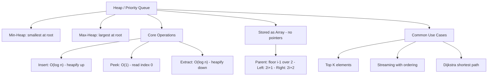
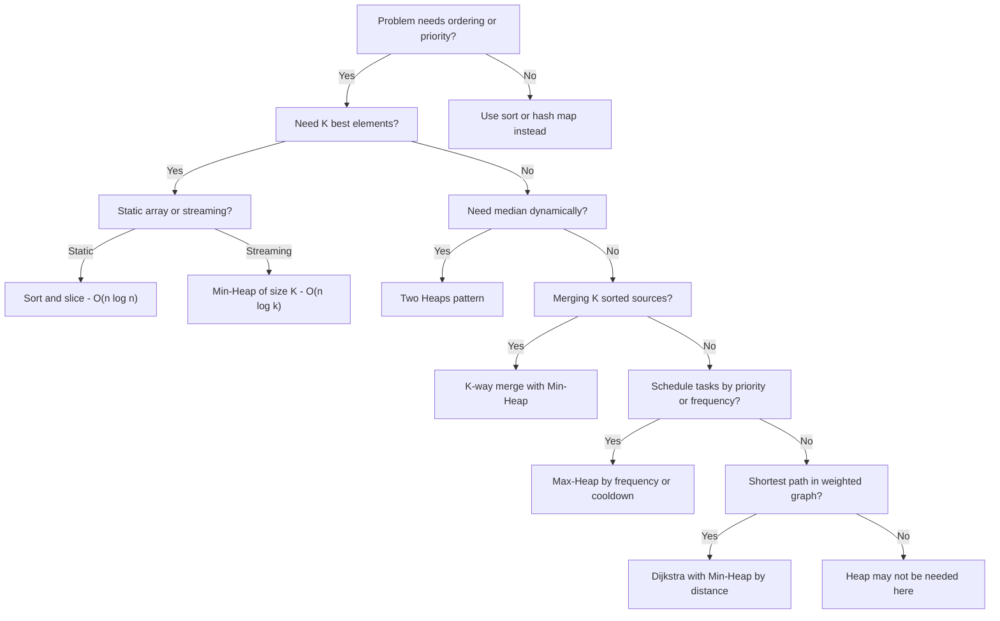

# Heaps / Priority Queues - Fundamentals

> 📚 **Part of**: [Complete DSA Learning Path](../dsa/00-complete-dsa-path.md)
>
> **Generated**: 2026-02-23
>
> **Duration**: 3-4 days (full-time)
>
> **Prerequisites**:
> - [Binary Trees](./binary-trees-fundamentals.md) — hierarchical structure thinking, tree shape
> - [Binary Search Trees](./bst-fundamentals.md) — ordered tree operations, tree property invariants

---

## 1. Overview

A **Heap** (also called a Priority Queue) is a specialized tree-based structure that guarantees one thing: the most "important" element is always at the top, instantly accessible. Think of it as a self-organizing list that automatically promotes the highest-priority item to the front — without keeping everything sorted.

Heaps appear in three interview archetypes: **top-K problems**, **streaming data with ordering**, and **graph algorithms (Dijkstra)**. Mastering the heap unlocks a whole class of "find the best K" problems that would otherwise require full O(n log n) sorting.

**By the end of this guide you'll be able to**:

- Implement a min-heap and max-heap from scratch in TypeScript
- Recognize and apply the three core heap patterns
- Solve Top-K, K-way merge, and two-heaps problems with confidence

---

## 2. Core Concept & Mental Model

### The Analogy: Emergency Room Triage

Imagine a hospital ER. Patients arrive constantly, each assigned a severity score. The nurse's station doesn't care about arrival order — it always sends the most critical patient to the doctor first.

- **Patient arrives** = insert O(log n) — they bubble up to their priority slot
- **Doctor calls next** = extract-min/max O(log n) — remove the root, reorganize
- **Who's next?** = peek O(1) — just look at the top

The heap *is* that triage nurse: always knows the most critical item in O(1), reorganizes in O(log n).

### The Key Property

A **min-heap** guarantees: every parent ≤ its children → minimum is at root
A **max-heap** guarantees: every parent ≥ its children → maximum is at root

This is **NOT** full sorted order — it's *partial* ordering. Only the parent-to-child relationship is guaranteed. Siblings have no ordering relationship.

```
Min-Heap example:
        1           ← always the minimum
      /   \
     3     2
    / \   / \
   7   4 5   6

Array:  [1, 3, 2, 7, 4, 5, 6]
Index:   0  1  2  3  4  5  6
```

### The Array Trick — No Tree Nodes Needed

Heaps are stored as flat arrays. The parent-child relationships are computed with index math:

```
For element at index i:
  Parent:      Math.floor((i - 1) / 2)
  Left child:  (2 * i) + 1
  Right child: (2 * i) + 2
```

No allocating nodes. No pointer chasing. Just array index arithmetic.

### Concept Map



---

## 3. Building Blocks — Progressive Learning

### Level 1: Simplest Form — The Heap is Just an Array with Rules

The most important insight before writing any code: a heap is just an array + two index formulas. No nodes, no pointers, no `new TreeNode()`.

```typescript
// A heap is an array with a structural guarantee.
// That's the whole idea.

class MinHeap {
  private heap: number[] = [];

  // The minimum is ALWAYS at index 0 — that's the whole point
  // This is O(1): just read the front of the array
  peek(): number | undefined {
    return this.heap[0];
  }

  size(): number {
    return this.heap.length;
  }

  isEmpty(): boolean {
    return this.heap.length === 0;
  }

  // These three formulas define the entire heap structure
  // Memorize them — they're everything
  private parent(i: number): number {
    return Math.floor((i - 1) / 2);
  }

  private left(i: number): number {
    return 2 * i + 1;
  }

  private right(i: number): number {
    return 2 * i + 2;
  }

  private swap(i: number, j: number): void {
    [this.heap[i], this.heap[j]] = [this.heap[j], this.heap[i]];
  }
}
```

**What makes this the simplest form**: `heap[0]` is always the answer to "what's the minimum?" — before you've even written heapify. Understanding that the root is always the answer is 90% of the mental model.

---

### Level 2: Adding the Heap Property — Two Directions of Fixing

To maintain the heap property through inserts and extracts, we need two operations:

- **heapify-up** (bubble up): after insert, compare upward toward root
- **heapify-down** (bubble down): after extract, compare downward toward leaves

```typescript
class MinHeap {
  private heap: number[] = [];

  private parent(i: number) { return Math.floor((i - 1) / 2); }
  private left(i: number)   { return 2 * i + 1; }
  private right(i: number)  { return 2 * i + 2; }
  private swap(i: number, j: number) {
    [this.heap[i], this.heap[j]] = [this.heap[j], this.heap[i]];
  }

  peek(): number | undefined { return this.heap[0]; }
  size(): number { return this.heap.length; }

  // INSERT: append to end, then bubble UP
  // Why end? Preserves the "complete binary tree" shape efficiently
  // Why bubble up? The new element might be smaller than its ancestors
  insert(val: number): void {
    this.heap.push(val);                           // Step 1: add to end
    this.heapifyUp(this.heap.length - 1);          // Step 2: fix upward
  }

  // heapify-up: while current < parent, swap them and continue upward
  // Stops when: (a) we reach root (i === 0), OR (b) parent <= current (heap OK)
  private heapifyUp(i: number): void {
    while (i > 0) {
      const p = this.parent(i);
      if (this.heap[p] <= this.heap[i]) break;     // Heap property satisfied
      this.swap(i, p);
      i = p;                                        // Move up to parent's index
    }
  }
}

// Walkthrough: insert [5, 2, 8, 1] one by one
// After insert 5:  [5]
// After insert 2:  [5,2] → heapifyUp(1): parent(1)=0, heap[0]=5 > heap[1]=2 → swap
//                  [2,5]
// After insert 8:  [2,5,8] → heapifyUp(2): parent(2)=0, heap[0]=2 <= heap[2]=8 → stop
//                  [2,5,8]
// After insert 1:  [2,5,8,1] → heapifyUp(3): parent(3)=1, heap[1]=5 > heap[3]=1 → swap
//                  [2,1,8,5] → heapifyUp(1): parent(1)=0, heap[0]=2 > heap[1]=1 → swap
//                  [1,2,8,5] ✓
```

**Mental model for heapify-up**: *"I just joined the company. Am I more important than my manager? If yes, we swap roles and I check with my new manager."*

---

### Level 3: Full Pattern — Complete Heap with Extract

```typescript
// Production-ready MinHeap for LeetCode problems
// All operations with correct complexity

class MinHeap {
  private heap: number[] = [];

  // Index formulas — the structural foundation
  private parent(i: number): number { return Math.floor((i - 1) / 2); }
  private left(i: number): number   { return 2 * i + 1; }
  private right(i: number): number  { return 2 * i + 2; }

  private swap(i: number, j: number): void {
    [this.heap[i], this.heap[j]] = [this.heap[j], this.heap[i]];
  }

  peek(): number | undefined  { return this.heap[0]; }
  size(): number               { return this.heap.length; }
  isEmpty(): boolean           { return this.heap.length === 0; }

  // O(log n) — append + heapify up
  insert(val: number): void {
    this.heap.push(val);
    this.heapifyUp(this.heap.length - 1);
  }

  // O(log n) — remove root, restore heap
  // Critical trick: move the LAST element to the root, then heapify down
  // Why last element? It's the easiest to remove (no gaps), maintains shape
  extractMin(): number | undefined {
    if (this.heap.length === 0) return undefined;
    if (this.heap.length === 1) return this.heap.pop();

    const min = this.heap[0];          // Save answer
    this.heap[0] = this.heap.pop()!;   // Overwrite root with last element
    this.heapifyDown(0);               // Fix the heap downward from root
    return min;
  }

  // Bubble UP: swap with parent while smaller than parent
  private heapifyUp(i: number): void {
    while (i > 0) {
      const p = this.parent(i);
      if (this.heap[p] <= this.heap[i]) break;
      this.swap(i, p);
      i = p;
    }
  }

  // Bubble DOWN: swap with smaller child while larger than a child
  // Always swap with the SMALLER child — this maintains both subtrees
  private heapifyDown(i: number): void 
    const n = this.heap.length;
    while (true) {
      let smallest = i;
      const l = this.left(i);
      const r = this.right(i);

      // Find smallest among: current node, left child, right child
      if (l < n && this.heap[l] < this.heap[smallest]) smallest = l;
      if (r < n && this.heap[r] < this.heap[smallest]) smallest = r;

      if (smallest === i) break;   // Current is already smallest — done

      this.swap(i, smallest);
      i = smallest;                // Continue downward from new position
    }
  }

  // Debugging helper: verify heap property holds for every node
  isValid(): boolean {
    for (let i = 1; i < this.heap.length; i++) {
      const p = this.parent(i);
      if (this.heap[p] > this.heap[i]) return false;
    }
    return true;
  }
}

// MaxHeap is identical with two sign flips:
// heapifyUp:   heap[p] >= heap[i]  (stop if parent >= current)
// heapifyDown: find LARGEST child instead of smallest

// Time Complexity Summary:
// insert:     O(log n) — at most log n swaps traveling up
// extractMin: O(log n) — at most log n swaps traveling down
// peek:       O(1)     — always just read index 0
// Space:      O(n)     — one slot per element

// Quick usage:
const heap = new MinHeap();
heap.insert(5); heap.insert(2); heap.insert(8); heap.insert(1);
heap.peek();        // 1
heap.extractMin();  // 1
heap.peek();        // 2
```

**Visualizing extractMin on `[1, 2, 8, 5]`**:

```
Before: [1, 2, 8, 5]   → tree root = 1 (minimum)

Step 1: Move last element (5) to root, remove last slot
        [5, 2, 8]

Step 2: heapifyDown(0)
        Node 5 vs children: left=2, right=8 → smallest is 2 (index 1)
        Swap: [2, 5, 8]

Step 3: heapifyDown(1)
        Node 5 vs children: left=index 3 (out of bounds) → no children
        Stop.

Result: [2, 5, 8] ✓  —  heap property restored, extracted 1
```

---

## 4. Key Patterns

### Pattern 1: Top-K Elements (Min-Heap of Size K)

**When to Use**:

- "Find K largest elements" / "Find Kth largest"
- "Top K most frequent elements"
- Any "best K" from a stream or large array where K << n

**The counterintuitive insight**: Use a **min-heap** to find K **largest** elements. The min-heap acts as a "bouncer" keeping only your best K candidates. The root shows the weakest candidate — if a new element beats it, swap them in.

```typescript
// Find K largest elements from nums
// Time: O(n log k)  Space: O(k)
// Much better than sort O(n log n) when k is small

function findKLargest(nums: number[], k: number): number[] {
  const minHeap = new MinHeap();

  for (const num of nums) {
    minHeap.insert(num);            // Add every element to heap

    // When heap exceeds size K, evict the smallest
    // This keeps the heap as a "running top K" window
    if (minHeap.size() > k) {
      minHeap.extractMin();         // Goodbye, weakest candidate
    }
  }

  // After processing all nums, heap holds exactly K largest elements
  // heap[0] (the root) IS the Kth largest element
  const result: number[] = [];
  while (!minHeap.isEmpty()) {
    result.push(minHeap.extractMin()!);
  }
  return result.reverse(); // Optional: return in descending order
}

// Example: nums = [3, 2, 1, 5, 6, 4], k = 2
// Process 3: heap = [3]
// Process 2: heap = [2, 3]
// Process 1: heap = [1, 3, 2] → size > 2 → extractMin → heap = [2, 3]
// Process 5: heap = [2, 3, 5] → size > 2 → extractMin(2) → heap = [3, 5]
// Process 6: heap = [3, 5, 6] → size > 2 → extractMin(3) → heap = [5, 6]
// Process 4: heap = [4, 6, 5] → size > 2 → extractMin(4) → heap = [5, 6]
// Result: [5, 6], Kth largest = heap[0] = 5  ✓

// For K smallest: use MAX-heap of size K, evict the largest when size > K
```

**Complexity**:

- Time: O(n log k) — n inserts, each O(log k) since heap size is capped at k
- Space: O(k) — only k elements in the heap at any time

---

### Pattern 2: K-Way Merge

**When to Use**:

- Merging K sorted arrays or linked lists
- "Smallest range covering elements from K lists"
- Streaming from K sorted sources

**Key idea**: A min-heap holds the "current front" of each sorted source. Always extract the global minimum, then advance that source's pointer.

```typescript
// Merge K sorted arrays into one sorted array
// Time: O(n log k) where n = total elements, k = number of arrays
// Space: O(k) for the heap (one representative per array)

interface HeapEntry {
  val: number;
  arrayIdx: number;   // Which of the K source arrays
  elemIdx: number;    // Position within that source array
}

function mergeKSortedArrays(arrays: number[][]): number[] {
  // In practice: implement MinHeap with custom comparator
  // Here we use a sorted array to simulate heap behavior
  const heap: HeapEntry[] = [];
  const result: number[] = [];

  // Initialize: seed one element from each array
  for (let i = 0; i < arrays.length; i++) {
    if (arrays[i].length > 0) {
      heap.push({ val: arrays[i][0], arrayIdx: i, elemIdx: 0 });
    }
  }
  heap.sort((a, b) => a.val - b.val); // Treat as initial heap build

  // Each iteration: extract the minimum, advance its pointer
  while (heap.length > 0) {
    // Extract-min: smallest current frontier element
    const { val, arrayIdx, elemIdx } = heap.shift()!;
    result.push(val);

    // If this source has more elements, add the next one
    const nextIdx = elemIdx + 1;
    if (nextIdx < arrays[arrayIdx].length) {
      heap.push({
        val: arrays[arrayIdx][nextIdx],
        arrayIdx,
        elemIdx: nextIdx
      });
      heap.sort((a, b) => a.val - b.val); // Re-heapify (use proper heap for O(log k))
    }
  }

  return result;
}

// Example: arrays = [[1,4,7], [2,5,8], [3,6,9]]
// Initial heap: [{1,0,0}, {2,1,0}, {3,2,0}]
// Round 1: extract 1, add {4,0,1} → result=[1]
// Round 2: extract 2, add {5,1,1} → result=[1,2]
// Round 3: extract 3, add {6,2,1} → result=[1,2,3]
// ... continues until all elements extracted in sorted order

// NOTE: For LeetCode 23 (Merge K Sorted Lists), same pattern but
// heap entries hold ListNode pointers instead of array indices
```

**Complexity**:

- Time: O(n log k) — n total extractions, each O(log k) since heap has k entries
- Space: O(k) — heap holds exactly one element per source at a time

---

### Pattern 3: Two Heaps (Dynamic Median)

**When to Use**:

- Median from a data stream
- Problems requiring the "middle value" with O(log n) updates
- Anything where you need to split data into balanced lower/upper halves

**Key insight**: Keep two heaps — a max-heap for the lower half and a min-heap for the upper half. The median lives at one (or both) of their roots.

```typescript
// Find median from a data stream
// addNum: O(log n)   findMedian: O(1)

class MedianFinder {
  // Lower half: max-heap (top = largest of smaller numbers)
  // We simulate a max-heap by negating values in a min-heap
  private lowerMaxHeap: number[] = [];   // stores negated values

  // Upper half: min-heap (top = smallest of larger numbers)
  private upperMinHeap: MinHeap = new MinHeap();

  // Invariants we ALWAYS maintain:
  // 1. Every number in lowerMaxHeap <= every number in upperMinHeap
  // 2. |lower.size - upper.size| <= 1  (sizes differ by at most 1)

  addNum(num: number): void {
    // Step 1: Route num to the correct half
    // Default: add to lower (max-heap)
    this.lowerInsert(num);

    // Step 2: Enforce ordering invariant
    // If max of lower > min of upper, move max-of-lower to upper
    if (
      !this.upperMinHeap.isEmpty() &&
      this.lowerPeek()! > this.upperMinHeap.peek()!
    ) {
      this.upperMinHeap.insert(this.lowerExtract()!);
    }

    // Step 3: Rebalance sizes (lower can have at most 1 extra)
    if (this.lowerSize() > this.upperMinHeap.size() + 1) {
      this.upperMinHeap.insert(this.lowerExtract()!);
    } else if (this.upperMinHeap.size() > this.lowerSize()) {
      this.lowerInsert(this.upperMinHeap.extractMin()!);
    }
  }

  findMedian(): number {
    if (this.lowerSize() > this.upperMinHeap.size()) {
      // Odd total: lower has the middle element
      return this.lowerPeek()!;
    }
    // Even total: median is average of the two middle elements
    return (this.lowerPeek()! + this.upperMinHeap.peek()!) / 2;
  }

  // Max-heap via negation trick: negate on insert, un-negate on read
  private lowerInsert(val: number) {
    this.lowerMaxHeap.push(-val);
    this.lowerMaxHeap.sort((a, b) => a - b); // min of negated = max of original
  }
  private lowerExtract(): number | undefined {
    return this.lowerMaxHeap.length ? -this.lowerMaxHeap.shift()! : undefined;
  }
  private lowerPeek(): number | undefined {
    return this.lowerMaxHeap.length ? -this.lowerMaxHeap[0] : undefined;
  }
  private lowerSize(): number { return this.lowerMaxHeap.length; }
}

// Example walkthrough: addNum 5, 2, 8
// After 5: lower=[5]       upper=[]       → median = 5
// After 2: lower=[5,2]     → max(lower)=5, upper empty, sizes ok
//          → rebalance: lower has 2, upper has 0, diff=2 > 1
//          → move max of lower (5) to upper
//          → lower=[2]  upper=[5]         → median = (2+5)/2 = 3.5
// After 8: lower=[2,8]?   → lower.max=8 > upper.min=5 → move 8 to upper
//          lower=[2]       upper=[5,8]    → upper.size > lower.size
//          → move min of upper (5) to lower
//          lower=[2,5]     upper=[8]      → median = lower.max = 5

// Invariant check: lower=[2,5] (max=5), upper=[8] (min=8)
// 5 <= 8 ✓  |sizes: 2 vs 1| = 1 ≤ 1 ✓
```

**Complexity**:

- Time: O(log n) per `addNum`, O(1) for `findMedian`
- Space: O(n) total

---

## 5. Decision Framework



**Recognition Signals — this is a heap problem**:

- "Kth largest/smallest" → min-heap of size K
- "Top K most frequent" → heap with frequency comparator
- "Median from data stream" → two heaps
- "Merge K sorted lists" → K-way merge
- "Task scheduler with cooldown" → max-heap by frequency
- Anywhere you'd sort but need to process elements one-by-one in priority order

**When NOT to Use**:

- **K is large or n is small**: just sort — O(n log n) is fine and simpler
- **Static median**: sort and index — O(n log n) once beats O(n log n) setup
- **Simple min or max**: `Math.min(...arr)` is O(n) and far simpler
- **Need ALL elements sorted**: sort is cleaner than extract-all-from-heap

---

## 6. Common Gotchas & Edge Cases

### Typical Mistakes

**1. Max-heap when you need min-heap for Top-K Largest**

```typescript
// WRONG: "Find K largest" with a max-heap
// You'd fill the heap with all n elements first = O(n log n) and O(n) space
// Then extract K times = fine, but defeats the point

// RIGHT: "Find K largest" with a MIN-heap of size K
// Heap acts as bouncer keeping only the best K candidates
// O(n log k) time, O(k) space — much better when k << n
```

**2. JavaScript has no built-in heap**

```typescript
// Array.sort() is NOT a heap. Re-sorting after each insert is O(n log n)
// per operation, not O(log n). This kills performance in stream problems.
//
// Options for LeetCode:
// - Implement MinHeap from scratch (as above)
// - Use @datastructures-js/priority-queue if allowed
// - For small inputs, sorted array + splice works but note the complexity
```

**3. Swapping with wrong child in heapifyDown**

```typescript
// WRONG: always swap with left child
if (left < n && heap[left] < heap[i]) swap(i, left); // misses right child

// RIGHT: find the smallest among current, left, right — then swap once
let smallest = i;
if (left < n && heap[left] < heap[smallest]) smallest = left;
if (right < n && heap[right] < heap[smallest]) smallest = right;
if (smallest !== i) { swap(i, smallest); i = smallest; }
// Swapping with the SMALLER child preserves the heap property in both subtrees
```

**4. Two Heaps: forgetting the ordering invariant**

```typescript
// After any insert, you MUST check:
// maxHeap.peek() <= minHeap.peek()
// If a number goes to the wrong half, the median calculation breaks silently
// The fix: after routing, check tops and move if necessary
```

**5. Not checking bounds before accessing children**

```typescript
// heapifyDown must check left < n and right < n before comparing
// heap[left] when left >= n returns undefined — comparisons then fail silently
```

### Edge Cases to Always Test

- **Empty heap**: `extractMin()` should return `undefined` or handle gracefully
- **Single element**: insert then extract should work cleanly
- **All identical values**: no infinite loops — comparisons use `<` not `<=`
- **K ≥ n in Top-K**: return all elements (heap never evicts anything)
- **Negative numbers**: heap comparisons work on negatives without changes
- **Two Heaps with one element**: median = that one element (lower has it)

### Debugging Tips

```typescript
// Add inspection helpers to your heap while debugging:
toString(): string {
  return `[${this.heap.join(', ')}]`;
}

// Verify heap invariant holds (golden for catching subtle bugs):
isValid(): boolean {
  for (let i = 1; i < this.heap.length; i++) {
    if (this.heap[this.parent(i)] > this.heap[i]) return false;
  }
  return true;
}

// Common debugging approach for heapifyDown:
// Trace through [6, 3, 5] manually:
// i=0: left=1(3), right=2(5), smallest=1 → swap(0,1) → [3, 6, 5]
// i=1: left=3(OOB), right=4(OOB) → stop
// Result [3, 6, 5] ✓ — if your output differs, the bug is in child selection
```

---

## 7. Practice Path

**Problems from Your DSA Guide**

**Starter Problems** (Build Intuition):

- [ ] [1046. Last Stone Weight](https://leetcode.com/problems/last-stone-weight/) — pure max-heap; just simulate extracting two max stones, colliding, reinserting. No tricks. The clearest possible heap problem.
- [ ] [703. Kth Largest Element in a Stream](https://leetcode.com/problems/kth-largest-element-in-a-stream/) — min-heap of size K for streaming. This one introduces the core "K largest via min-heap" insight.

**Core Problems** (Master the Patterns):

- [ ] [215. Kth Largest Element in an Array](https://leetcode.com/problems/kth-largest-element-in-an-array/) — same Top-K pattern on a static array; nail this cold
- [ ] [973. K Closest Points to Origin](https://leetcode.com/problems/k-closest-points-to-origin/) — Top-K with a custom comparator (distance); generalizes the pattern
- [ ] [347. Top K Frequent Elements](https://leetcode.com/problems/top-k-frequent-elements/) — hash map + heap; classic two-step combination
- [ ] [621. Task Scheduler](https://leetcode.com/problems/task-scheduler/) — max-heap for greedy frequency-based scheduling
- [ ] [355. Design Twitter](https://leetcode.com/problems/design-twitter/) — K-way merge on user feeds

**Challenge Problems** (Test Mastery):

- [ ] [295. Find Median from Data Stream](https://leetcode.com/problems/find-median-from-data-stream/) — two heaps; requires maintaining both invariants simultaneously
- [ ] [23. Merge K Sorted Lists](https://leetcode.com/problems/merge-k-sorted-lists/) *(★ challenge)* — K-way merge where heap entries are linked list nodes

**Suggested Order**:

1. **Start with #1046 Last Stone Weight** — it's the purest heap problem: extract two maximums, compute result, reinsert. Pure max-heap, no tricks. Builds muscle memory.
2. **Then #703 Kth Largest in a Stream** — introduces the min-heap-for-K-largest insight. This mental model unlocks the next three problems.
3. **Then #215 Kth Largest in Array** — same insight, static version. Make sure you can code it in under 10 minutes.
4. **Then #973 K Closest Points** — same pattern, custom comparator. Shows that heaps generalize to any ordering key.
5. **Then #347 Top K Frequent** — combines hash map + heap in a classic two-step. Very common interview pattern.
6. **Then #295 Find Median** — the two-heaps pattern. Save this for last among the first-pass problems; it requires maintaining two invariants at once.
7. **Return to #621, #355, #23** after you've seen some graphs — they share scheduling and merge patterns that become more natural then.

---

> **JavaScript/TypeScript Note**: Unlike Python (`heapq`) or Java (`PriorityQueue`), JavaScript has no built-in heap. In LeetCode TypeScript solutions, you'll implement your own MinHeap class (as shown above) or note the O(log n) operations and use a sorted array as a stand-in for smaller inputs. When mentioning complexity in interviews, always state "assuming O(log n) heap operations" to show you understand the underlying structure.
