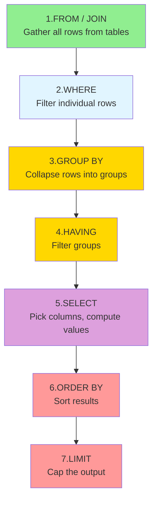
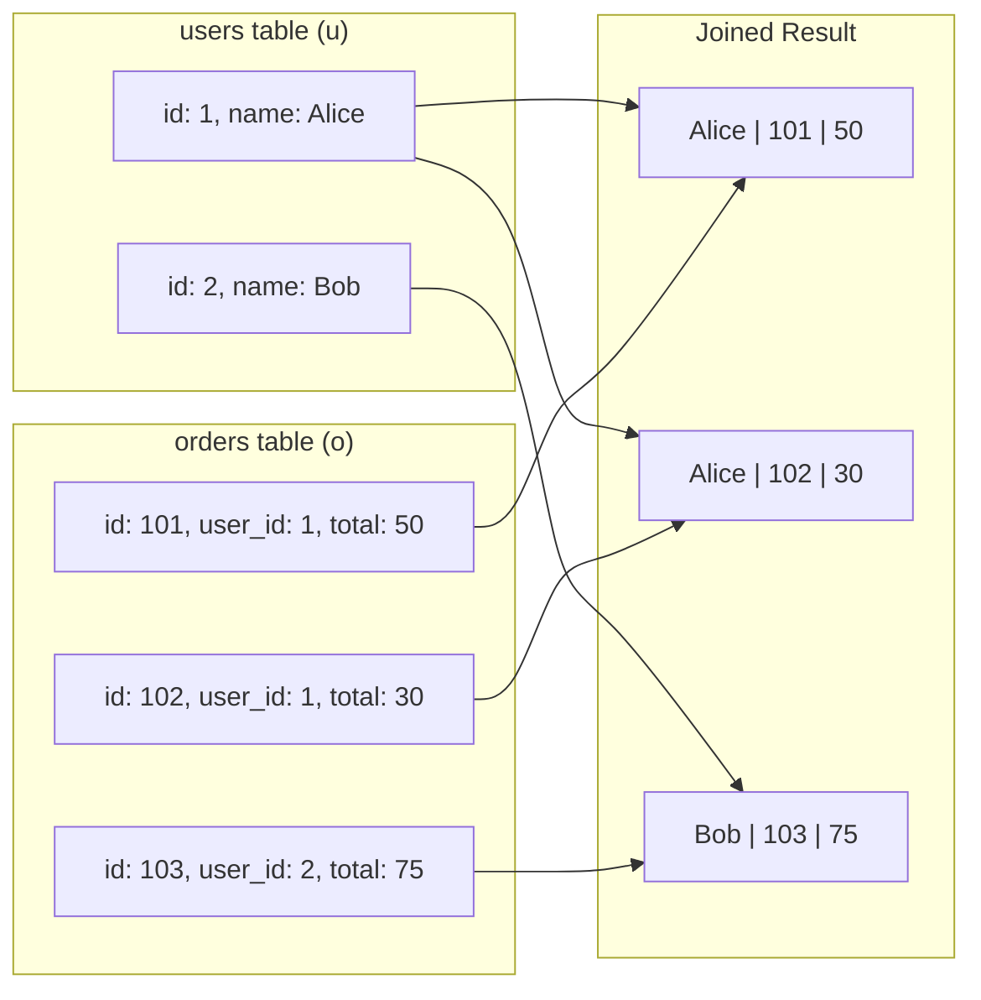
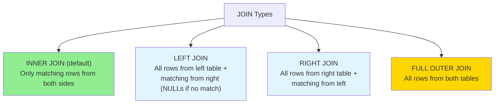
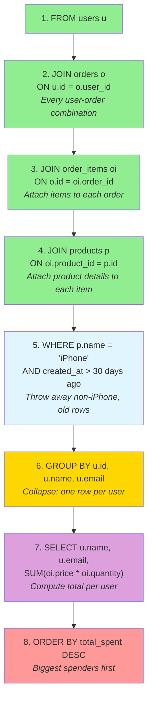
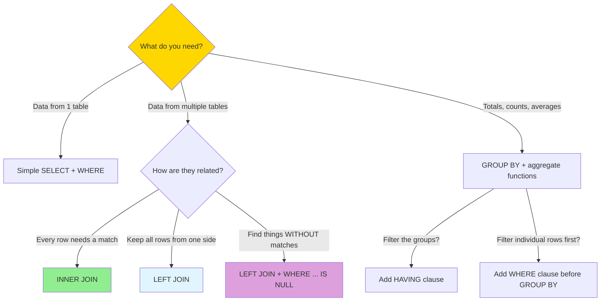

# SQL Fundamentals

> **Part of**: [System Design Study Path](../system-design/00-complete-system-design-path.md)
>
> **Generated**: 2026-02-10
>
> **Context**: Companion to [02-database-types.md](../system-design/02-database-types.md)
>
> **Prerequisites**: Basic programming concepts (variables, loops, functions)

---

## 1. Overview

SQL (Structured Query Language) is how you talk to relational databases. It reads like English but executes in a specific order that differs from how it's written — and that gap is the #1 source of confusion.

**Why this matters**:
- System design interviews require you to model data in SQL and explain queries
- Every backend role expects SQL fluency
- Understanding SQL execution order unlocks the ability to read *any* query

**By the end of this guide**, you'll be able to read complex multi-JOIN queries, understand the execution pipeline, and write queries from scratch.

---

## 2. The Core Mental Model: SQL is a Pipeline

### The Written Order vs Execution Order

This is the single most important thing to understand about SQL.

**You WRITE SQL in this order**:
```sql
SELECT → FROM → JOIN → WHERE → GROUP BY → HAVING → ORDER BY → LIMIT
```

**The database EXECUTES in this order**:
```sql
FROM → JOIN → WHERE → GROUP BY → HAVING → SELECT → ORDER BY → LIMIT
```



**Why this matters**: When you see `SELECT SUM(price) as total`, you might think `total` exists early. It doesn't — it's computed in step 5. That's why you can't use `total` in a `WHERE` clause (step 2 happens before step 5).

---

## 3. Building Blocks - Progressive Learning

### Level 1: Single Table Queries

Start with the simplest possible query — one table, a few filters.

```sql
-- "Show me all pending orders from the last week"

SELECT id, user_id, total, status     -- Step 5: pick these columns
FROM orders                           -- Step 1: start with the orders table
WHERE status = 'pending'              -- Step 2: keep only pending ones
  AND created_at > NOW() - INTERVAL '7 days'  -- still Step 2: also recent
ORDER BY created_at DESC;             -- Step 6: newest first
```

**How to read it (in execution order)**:
1. Go to the `orders` table
2. Keep only rows where `status = 'pending'` AND `created_at` is within 7 days
3. From those rows, grab the `id`, `user_id`, `total`, `status` columns
4. Sort by `created_at`, newest first

**Key concepts**:
- `WHERE` filters happen *before* you pick columns
- `AND` means both conditions must be true
- `DESC` = descending (biggest/newest first), `ASC` = ascending (default)

---

### Level 2: JOINs — Connecting Tables

JOINs are how you combine data from multiple tables. Think of it as **merging spreadsheets on a shared column**.

```sql
-- "Show me each order with the user's name"

SELECT u.name, o.id as order_id, o.total, o.status
FROM users u                          -- Start with users table, alias it "u"
JOIN orders o ON u.id = o.user_id;    -- Attach matching orders, alias "o"
```

**What `JOIN ... ON` does visually**:



**Key concepts**:
- `u` and `o` are **aliases** — short nicknames so you don't write `users.name` every time
- `ON u.id = o.user_id` is the "glue" — it says which column in each table should match
- A user with 2 orders produces 2 rows in the result (Alice appears twice above)
- `JOIN` (aka `INNER JOIN`) only keeps rows where a match exists in *both* tables. A user with zero orders won't appear.

**Types of JOINs**:



```sql
-- LEFT JOIN example: show ALL users, even those with no orders
SELECT u.name, o.id as order_id, o.total
FROM users u
LEFT JOIN orders o ON u.id = o.user_id;

-- Result:
-- Alice | 101 | 50
-- Alice | 102 | 30
-- Bob   | 103 | 75
-- Carol | NULL | NULL    ← Carol has no orders, but still appears
```

---

### Level 3: GROUP BY + Aggregates — Collapsing Rows

`GROUP BY` collapses multiple rows into one row per group, so you can compute things like totals, counts, and averages.

```sql
-- "How much has each user spent in total?"

SELECT u.name, COUNT(o.id) as order_count, SUM(o.total) as total_spent
FROM users u
JOIN orders o ON u.id = o.user_id
GROUP BY u.id, u.name
ORDER BY total_spent DESC;
```

**What happens step by step**:

```
Step 1-2 (FROM + JOIN): Merged rows
┌────────┬──────────┬───────┐sdlkfj
│ u.name │ o.id     │ total │
├────────┼──────────┼───────┤
│ Alice  │ 101      │ 50    │
│ Alice  │ 102      │ 30    │
│ Bob    │ 103      │ 75    │
└────────┴──────────┴───────┘

Step 3 (GROUP BY u.id, u.name): Collapse into groups
┌────────┬─────────────────┐
│ Group  │ Rows in group   │
├────────┼─────────────────┤
│ Alice  │ (101,50)(102,30)│
│ Bob    │ (103,75)        │
└────────┴─────────────────┘

Step 5 (SELECT with aggregates): Compute per group
┌────────┬─────────────┬─────────────┐
│ name   │ order_count │ total_spent │
├────────┼─────────────┼─────────────┤
│ Alice  │ 2           │ 80          │
│ Bob    │ 1           │ 75          │
└────────┴─────────────┴─────────────┘
```

**Key rule**: Every column in `SELECT` must either be in the `GROUP BY` clause OR wrapped in an aggregate function (`SUM`, `COUNT`, `AVG`, `MIN`, `MAX`). You can't select `o.id` after grouping because which `o.id` would it pick? There are multiple per group.

**`HAVING` vs `WHERE`**:
- `WHERE` filters **before** grouping (individual rows)
- `HAVING` filters **after** grouping (the group results)

```sql
-- "Show users who have spent more than $100 total"
SELECT u.name, SUM(o.total) as total_spent
FROM users u
JOIN orders o ON u.id = o.user_id
GROUP BY u.id, u.name
HAVING SUM(o.total) > 100;    -- Can't use WHERE here because
                                -- total_spent doesn't exist yet at WHERE stage
```

---

## 4. Deconstructing the Query from Your Study Guide

Now let's apply everything to the query you asked about:

```sql
SELECT u.name, u.email, SUM(oi.price * oi.quantity) as total_spent
FROM users u
JOIN orders o ON u.id = o.user_id
JOIN order_items oi ON o.id = oi.order_id
JOIN products p ON oi.product_id = p.id
WHERE p.name = 'iPhone'
  AND o.created_at > NOW() - INTERVAL '30 days'
GROUP BY u.id, u.name, u.email
ORDER BY total_spent DESC;
```

### The Execution Pipeline



### Concrete Data Walkthrough

**After all JOINs (steps 1-4)** — one massive merged table:

```
| u.name | u.email      | o.id | o.created_at | oi.price | oi.qty | p.name    |
|--------|------------- |------|--------------|----------|--------|-----------|
| Alice  | alice@x.com  | 101  | 2026-01-15   | 999      | 2      | iPhone    |
| Alice  | alice@x.com  | 101  | 2026-01-15   | 29       | 1      | Case      |
| Alice  | alice@x.com  | 105  | 2026-02-01   | 999      | 1      | iPhone    |
| Bob    | bob@x.com    | 102  | 2026-02-05   | 999      | 1      | iPhone    |
| Bob    | bob@x.com    | 102  | 2026-02-05   | 49       | 1      | Charger   |
| Carol  | carol@x.com  | 103  | 2025-06-01   | 999      | 1      | iPhone    |
```

**After WHERE (step 5)** — only iPhones from last 30 days:

```
| u.name | u.email      | oi.price | oi.qty | p.name |
|--------|------------- |----------|--------|--------|
| Alice  | alice@x.com  | 999      | 2      | iPhone |  ← order 101
| Alice  | alice@x.com  | 999      | 1      | iPhone |  ← order 105
| Bob    | bob@x.com    | 999      | 1      | iPhone |
```

- The "Case" row? Gone (p.name != 'iPhone')
- The "Charger" row? Gone (p.name != 'iPhone')
- Carol's iPhone? Gone (June 2025 is older than 30 days)

**After GROUP BY (step 6) + SELECT (step 7)**:

```
| name  | email        | total_spent            |
|-------|------------- |------------------------|
| Alice | alice@x.com  | (999*2) + (999*1) = 2997 |
| Bob   | bob@x.com    | (999*1) = 999          |
```

**After ORDER BY (step 8)**: Alice first (2997 > 999).

---

## 5. Key Patterns

### Pattern 1: Multi-Table JOIN Chain

**When to use**: You need data scattered across 3+ related tables.

```sql
-- Template: Follow the foreign key chain
SELECT
    a.column1,
    c.column2,
    SUM(b.value) as computed
FROM table_a a
JOIN table_b b ON a.id = b.a_id          -- a → b relationship
JOIN table_c c ON b.id = c.b_id          -- b → c relationship
WHERE c.some_filter = 'value'
GROUP BY a.id, a.column1, c.column2;
```

**How to build it**:
1. Identify which tables hold the data you need
2. Find the foreign key path connecting them
3. JOIN in order, following the foreign keys
4. Each JOIN's `ON` clause links the two tables being connected

### Pattern 2: Aggregate + Filter (GROUP BY + HAVING)

**When to use**: "Find all X that have more than N of Y" or "total/average per group".

```sql
-- "Find products ordered more than 100 times"
SELECT p.name, COUNT(*) as times_ordered
FROM products p
JOIN order_items oi ON p.id = oi.product_id
GROUP BY p.id, p.name
HAVING COUNT(*) > 100              -- filter AFTER grouping
ORDER BY times_ordered DESC;
```

**Common aggregates**:
| Function | Does | Example |
|----------|------|---------|
| `COUNT(*)` | Number of rows in group | How many orders? |
| `COUNT(col)` | Number of non-NULL values | How many have emails? |
| `SUM(col)` | Total | Total revenue |
| `AVG(col)` | Average | Average order size |
| `MIN(col)` | Smallest | Earliest date |
| `MAX(col)` | Largest | Most expensive item |

### Pattern 3: LEFT JOIN + NULL Check (Find Missing Data)

**When to use**: "Find users who have NOT done X" or "find items without Y".

```sql
-- "Find users who have never placed an order"
SELECT u.name, u.email
FROM users u
LEFT JOIN orders o ON u.id = o.user_id
WHERE o.id IS NULL;                -- No matching order exists
```

**Why this works**: `LEFT JOIN` keeps all users even without orders. Users without orders have `NULL` in every `o.*` column. `WHERE o.id IS NULL` isolates exactly those users.

---

## 6. Decision Framework



### Reading Any SQL Query — A Checklist

1. **Start at `FROM`** — what's the main table?
2. **Read each `JOIN`** — what tables are being connected, and on what columns?
3. **Read `WHERE`** — what rows are being filtered out?
4. **Read `GROUP BY`** — are rows being collapsed? Into what groups?
5. **Read `SELECT`** — what columns/computations are in the final output?
6. **Read `ORDER BY`** — how is it sorted?
7. **Read `LIMIT`** — is the output capped?

---

## 7. Common Gotchas & Edge Cases

### Mistake 1: Using WHERE instead of HAVING for aggregates
```sql
-- WRONG: WHERE can't reference aggregate results
SELECT user_id, COUNT(*) as order_count
FROM orders
WHERE COUNT(*) > 5    -- ERROR! COUNT doesn't exist yet at WHERE stage
GROUP BY user_id;

-- RIGHT: Use HAVING for post-group filtering
SELECT user_id, COUNT(*) as order_count
FROM orders
GROUP BY user_id
HAVING COUNT(*) > 5;
```

### Mistake 2: Forgetting GROUP BY columns
```sql
-- WRONG: u.name is not in GROUP BY and not aggregated
SELECT u.name, COUNT(o.id)
FROM users u JOIN orders o ON u.id = o.user_id
GROUP BY u.id;    -- name is missing!

-- RIGHT: Include all selected non-aggregate columns
SELECT u.name, COUNT(o.id)
FROM users u JOIN orders o ON u.id = o.user_id
GROUP BY u.id, u.name;
```

### Mistake 3: JOIN creating duplicate rows
If you JOIN on a one-to-many relationship and then SUM, you might double-count:
```sql
-- If a user has 3 orders and each order has 2 items,
-- you get 6 rows per user after joining all three tables.
-- SUM(o.total) would count each order total multiple times!

-- Fix: aggregate at the right level, or use subqueries
```

### Mistake 4: NULL comparisons
```sql
-- WRONG: NULL is not equal to anything, not even itself
WHERE email = NULL        -- always false!
WHERE email != NULL       -- always false!

-- RIGHT: Use IS NULL / IS NOT NULL
WHERE email IS NULL
WHERE email IS NOT NULL
```

### Edge Cases to Always Consider
- What if a table is empty? (JOINs return no rows)
- What if there are NULL values in JOIN columns? (those rows won't match)
- What if GROUP BY produces zero groups? (empty result set)

---

## 8. Practice Path

These are ordered from simplest to most complex. You can use [SQLBolt](https://sqlbolt.com/) or [LeetCode Database Problems](https://leetcode.com/problemset/database/) to practice.

**Starter (Single Table)**:
- [ ] Write a query to find all orders over $100
- [ ] Write a query to find users created in the last 30 days, sorted by name

**Core (JOINs)**:
- [ ] Show each order with the user's name
- [ ] Show all products that have never been ordered (LEFT JOIN + NULL)
- [ ] Show each product with its total number of orders

**Challenge (GROUP BY + Multi-JOIN)**:
- [ ] Find the top 5 users by total spending
- [ ] Find products ordered more than 10 times in the last month
- [ ] Recreate the query from your study guide from scratch

**Suggested Order**:
1. Start with single-table SELECT + WHERE until it's automatic
2. Then practice 2-table JOINs until you can write them without thinking
3. Then add GROUP BY + aggregates
4. Finally combine everything: multi-JOIN + GROUP BY + HAVING + ORDER BY

---

## 9. Quick Reference

### SQL Execution Order
```
FROM → JOIN → WHERE → GROUP BY → HAVING → SELECT → ORDER BY → LIMIT
```

### JOIN Types
| Type | Keeps |
|------|-------|
| `JOIN` / `INNER JOIN` | Only matching rows from both tables |
| `LEFT JOIN` | All from left + matching from right |
| `RIGHT JOIN` | All from right + matching from left |
| `FULL OUTER JOIN` | All from both tables |

### Aggregate Functions
| Function | Purpose |
|----------|---------|
| `COUNT(*)` | Number of rows |
| `SUM(col)` | Total |
| `AVG(col)` | Average |
| `MIN(col)` / `MAX(col)` | Smallest / Largest |

### Filtering
| Clause | When It Runs | Filters What |
|--------|-------------|--------------|
| `WHERE` | Before GROUP BY | Individual rows |
| `HAVING` | After GROUP BY | Groups/aggregates |

---

## Next Steps

- Read: [02-database-types.md](../system-design/02-database-types.md) — understand when to use SQL vs NoSQL
- Read: [03-cap-theorem.md](../system-design/03-cap-theorem.md) — trade-offs in distributed databases
- Practice: Rewrite the "Design Instagram" queries from the database types guide
- Deep dive: Study PostgreSQL indexing (how databases make queries fast)
