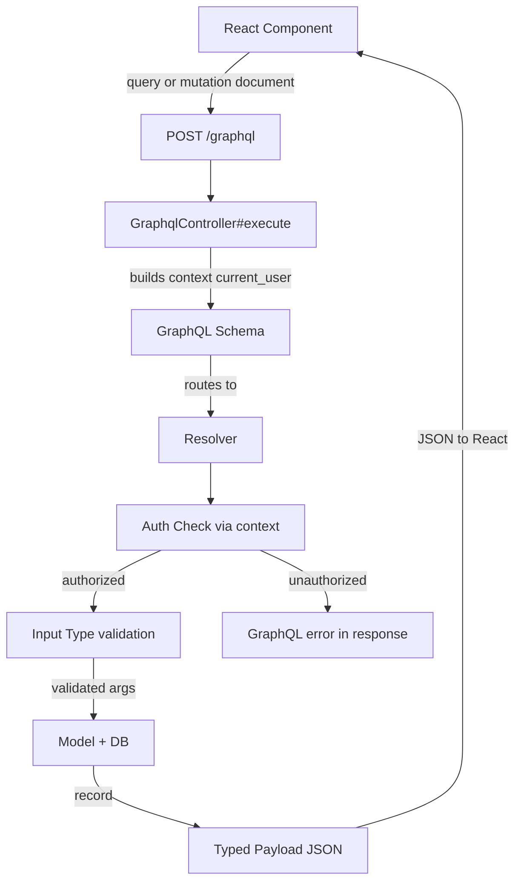
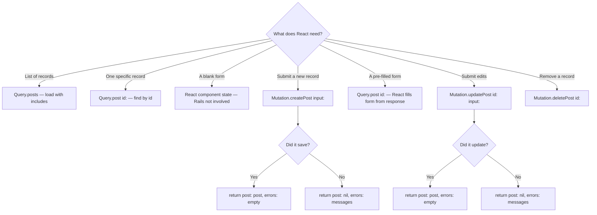

# Rails CRUD + API Building

> **Prerequisites**: Know what HTTP is (request/response). Know what a database table is.
>
> **Companion exercises**: `./01-rails-crud-api/`
>
> **Goal**: Understand not just *what* each Rails piece does, but *why it exists* — so you can explain it, extend it, and debug it under pressure.

---

## 1. Overview

> **Stack**: Rails API-only backend + GraphQL + React frontend. There are no ERB views, no `redirect_to`, no `render :new`. Rails talks exclusively through a single `POST /graphql` endpoint. React owns the UI, form state, and navigation.

When a React component needs data or wants to write something, it sends a GraphQL document to `POST /graphql`. Rails receives it, routes it to the right resolver, the resolver talks to the database through ActiveRecord, and sends back JSON.

Rails doesn't do this magically — it follows a contract. That contract is your GraphQL schema: a typed definition of every read (Query) and write (Mutation) your API supports. Once you internalize the schema as your source of truth, the entire stack becomes predictable.

Every Rails + GraphQL interview will test whether you understand that contract instinctively — not just whether you can copy a scaffold.

---

## 2. Core Concept & Mental Model

### The Traffic Cop Analogy

Think of your Rails app as a city. The **GraphQL schema** is the city's directory — it lists every operation available and what data each one returns. The **GraphqlController** is the city gate — every car (request) enters here with a query or mutation document. The **resolver** is the traffic cop at the specific intersection — it checks who's in the car (auth via context), validates what they're carrying (input types), and directs them to the filing office. The **model** is the city's filing office — the actual data lives there. The **resolver** hands back a typed response — not a view, but a JSON payload React consumes.

The cop never does the filing. The filing office never checks IDs. Everyone has exactly one job.

### Concept Map



### The HTTP Verb Contract

| Verb   | Meaning                                  | Safe? | Idempotent? |
| ------ | ---------------------------------------- | ----- | ----------- |
| GET    | Read only, never changes data            | Yes   | Yes         |
| POST   | Create a new resource                    | No    | No          |
| PATCH  | Partial update of an existing resource   | No    | Yes         |
| PUT    | Full replacement of an existing resource | No    | Yes         |
| DELETE | Remove a resource                        | No    | Yes         |

##### CLAUDE: This needs more attention, why is this important to make this distinction
**Safe** = server state doesn't change. **Idempotent** = calling it twice has the same effect as once.

---

## 3. Building Blocks — Progressive Learning

### Level 1: The GraphQL Contract — How Operations Replace Routes

**Why this level matters**

In REST you define 7 routes. In GraphQL you define **one** route (`POST /graphql`) and then declare every available operation in your schema. If you approach a Rails+GraphQL interview thinking in REST routes, you'll confuse yourself and your interviewer.

**How to think about it**

GraphQL splits all operations into two categories: **Query** (reads, never changes data) and **Mutation** (writes, changes data). React sends a document that names one of these and declares exactly what fields it wants back. Rails routes everything to the GraphQL schema, which dispatches to the right resolver.

The conceptual operations map like this:

```
REST action   →  GraphQL equivalent       Who owns the "form"?
──────────────────────────────────────────────────────────────
index         →  Query.posts              Rails resolver
show          →  Query.post(id:)          Rails resolver
new           →  (doesn't exist in Rails) React component state
create        →  Mutation.createPost      Rails resolver
edit          →  (doesn't exist in Rails) React pre-fills from Query.post
update        →  Mutation.updatePost      Rails resolver
destroy       →  Mutation.deletePost      Rails resolver
```

**`new` and `edit` no longer exist as Rails concerns.** React manages blank/pre-filled form state. Rails only receives the final submitted data via a mutation.

**Walking through it — the single route + schema**

Before reading a single line of code, ask: *what problem is this controller solving?*

In REST, Rails routing IS the dispatcher. `resources :posts` generates 7 routes, each mapped directly to a controller action. The route table decides what runs.

In GraphQL, Rails routing is just a **door**. One route. Everything enters here, and the GraphQL schema takes over as the dispatcher from that point. This controller's only job is: receive the request, unpack the pieces, hand them to the schema, send back whatever the schema returns.

That's it. If you understand that, every line below makes sense.

---

```ruby
# config/routes.rb
Rails.application.routes.draw do
  post '/graphql', to: 'graphql#execute'
end
```

**Why POST, even for reads?**

Your instinct might be: "reads should be GET." That's REST thinking. In GraphQL, even a read (a `query`) is sent as POST — because every operation carries a body: the query document, the variables, the operation name. GET requests technically don't have bodies. POST is consistent and works for everything, so that's what GraphQL uses universally.

---

```ruby
class GraphqlController < ApplicationController
  def execute
```

**Why is this called `execute`?**

It's not `index`, `show`, `create`. Those names are REST conventions tied to HTTP verbs and resource actions. This action has no REST equivalent — it doesn't correspond to one thing, it dispatches to *all* things. `execute` just means: "run whatever GraphQL operation was sent."

---

```ruby
    variables = prepare_variables(params[:variables])
```

**Why does `prepare_variables` need to exist at all?**

This is the one that trips people up. Here's the problem it's solving:

When React sends a GraphQL mutation with user input, it doesn't hardcode the values into the query string. It separates them as *variables*:

```graphql
# The query document (static, reusable)
mutation CreatePost($title: String!, $body: String!) {
  createPost(input: { title: $title, body: $body }) {
    post { id }
    errors
  }
}
```
```json
// The variables (the actual user data, sent separately)
{ "title": "Hello", "body": "World" }
```

Those variables travel as `params[:variables]`. But here's the issue — Rails is an HTTP framework, not a GraphQL framework. It doesn't know what these variables are. Depending on how the client sent the request, `params[:variables]` can arrive in wildly different shapes:

| Client sends it as    | What Rails gives you                               |
| --------------------- | -------------------------------------------------- |
| JSON body (correct)   | Already a Hash `{ "title" => "Hello" }`            |
| A JSON-encoded string | A String `"{\"title\":\"Hello\"}"` — needs parsing |
| Nothing at all        | `nil`                                              |
| Rails form encoding   | An `ActionController::Parameters` object           |

The GraphQL gem's `execute` method expects a plain Hash or nil. Give it a String and it breaks. Give it `ActionController::Parameters` and it may behave unpredictably.

`prepare_variables` normalizes all of these cases into one consistent shape before they touch the schema. It's defensive infrastructure — a translator between "whatever HTTP sent" and "what GraphQL expects." Without it, you'd have a controller that works perfectly in development (where your test client sends clean JSON) and breaks in production when a client sends variables slightly differently.

---

```ruby
    query     = params[:query]
```

This is the GraphQL document itself — the string the client sent. Example:

```
"query { posts { id title author { name } } }"
```

Rails doesn't parse it. It just stores it as a string and hands it to the schema, which parses and validates it.

---

```ruby
    operation = params[:operationName]
```

The GraphQL spec allows a single request body to contain **multiple named operations**:

```graphql
query GetPost { post(id: 1) { title } }
query GetPosts { posts { title } }
```

`operationName` tells the server which one to actually run. In practice, most requests contain one operation and this is either nil or matches it exactly. But it exists because the spec supports batching, and the gem requires the parameter slot to be present.

---

```ruby
    context   = { current_user: current_user }
```

**Why a context hash instead of passing `current_user` as an argument?**

Your resolver chain is deep: schema → mutation → resolver → maybe a sub-resolver for a nested type. If you needed to pass `current_user` as a function argument all the way down, every method signature would carry it.

Context is the solution. It's a Hash that travels with the entire execution. Any resolver at any depth can access it via `context[:current_user]`. You build it once here, at the edge of your app where you have access to the session/token, and it's available everywhere inside the schema automatically.

The `current_user` method on the right side is your standard Rails auth helper — Devise, JWT, session cookie, whatever your app uses. This is the only place in the GraphQL stack where auth *lookup* happens. From here on, resolvers only *check* context, they don't look anything up.

---

```ruby
    result = MyAppSchema.execute(query, variables: variables,
                                        context: context,
                                        operation_name: operation)
```

This is the handoff. Rails is done. The GraphQL gem takes the query string, parses it, validates it against your schema, dispatches to the correct resolver, and runs the execution. `MyAppSchema` is your schema class — it knows about every type, every query field, every mutation. After this line, the schema is driving, not Rails.

---

```ruby
    render json: result
```

**Why always HTTP 200, even on errors?**

This is the part that most surprises people coming from REST. In REST, a validation failure is a `422`. An auth failure is `401`. In GraphQL, **every response is HTTP 200**. Success, failure, auth error — all 200.

Errors don't live in the HTTP status. They live inside the JSON body, in an `errors` array at the top level or in a `errors` field inside a mutation payload. The HTTP layer just says "we received and processed your request." The GraphQL layer says "and here's what happened."

The `result` object knows how to serialize itself to the correct shape:
```json
// Success
{ "data": { "createPost": { "post": { "id": "1" }, "errors": [] } } }

// Business logic failure (wrong channel — payload errors)
{ "data": { "createPost": { "post": null, "errors": ["Title can't be blank"] } } }

// Auth failure (right channel — execution errors)
{ "data": null, "errors": [{ "message": "Not authenticated" }] }
```

React reads the body, not the status code. That's the contract.

```json
// What the React client sends for each operation:

// Reading a list (replaces index action)
query {
  posts { id title publishedAt author { name } }
}

// Reading one record (replaces show action)
query {
  post(id: "5") { id title body author { name } }
}

// Creating (replaces new + create actions)
mutation {
  createPost(input: { title: "Hello", body: "World" }) {
    post { id title }
    errors
  }
}

// Updating (replaces edit + update actions)
mutation {
  updatePost(id: "5", input: { title: "Updated" }) {
    post { id title }
    errors
  }
}

// Deleting (replaces destroy action)
mutation {
  deletePost(id: "5") {
    success
    errors
  }
}
```

**The one thing to get right**

In REST, `new` and `edit` are server-rendered form pages. In GraphQL+React, those don't exist — React owns the form. Rails only ever sees a **mutation with data**, never a "give me a blank form" request. The server-side pair is now just: **query (read)** or **mutation (write)**.

**Scenario 1: Full CRUD schema — all operations available**
```json
// Use when users can do everything: browse, read, create, edit, delete
type Query {
  posts: [Post!]!          # replaces index
  post(id: ID!): Post      # replaces show
}

type Mutation {
  createPost(input: CreatePostInput!): CreatePostPayload!   # replaces create
  updatePost(id: ID!, input: UpdatePostInput!): UpdatePostPayload!  # replaces update
  deletePost(id: ID!): DeletePostPayload!                   # replaces destroy
}
// new + edit don't exist — React manages form state
```

**Scenario 2: Read-only schema — viewers can browse, not write**
```json
// Use for public resources: a blog feed, a product catalog
// Simply don't define Mutation for this type
type Query {
  posts: [Post!]!
  post(id: ID!): Post
}
// No Mutation = no writes possible at the schema level
```

**Scenario 3: Full CRUD minus hard delete (soft-delete pattern)**
```json
// Use when records are soft-deleted (archived flag, not removed from DB)
type Mutation {
  createPost(input: CreatePostInput!): CreatePostPayload!
  updatePost(id: ID!, input: UpdatePostInput!): UpdatePostPayload!
  archivePost(id: ID!): ArchivePostPayload!   // sets archived_at, never destroys
  // No deletePost — hard delete cannot be called, even by accident
}
```

**Scenario 4: Custom operation beyond CRUD**
```json
// Use when a resource needs a non-CRUD action (e.g. publish a draft)
type Mutation {
  publishPost(id: ID!): PublishPostPayload!   # flips published: true, sets published_at
  unpublishPost(id: ID!): PublishPostPayload!
}
```

```ruby
# app/graphql/mutations/publish_post.rb
module Mutations
  class PublishPost < BaseMutation
    argument :id, ID, required: true
    field :post, Types::PostType, null: true
    field :errors, [String], null: false

    def resolve(id:)
      post = current_user.posts.find(id)
      if post.publish!
        { post: post, errors: [] }
      else
        { post: nil, errors: post.errors.full_messages }
      end
    end
  end
end
```

**Scenario 5: Nested resource (comments belong to a post)**
```json
// Use when a resource only makes sense in the context of a parent
// Pass the parent ID as a mutation argument — no nested routes needed
type Mutation {
  createComment(postId: ID!, input: CreateCommentInput!): CreateCommentPayload!
  deleteComment(id: ID!): DeleteCommentPayload!
}
```

> **Mental anchor**: "One route: POST /graphql. Two operation types: Query (reads) and Mutation (writes). No new/edit actions — React owns form state. Schema = your contract."

---

**→ Bridge to Level 2**: Now that you know the single route sends everything to the schema, you need to understand what a resolver does — it's the GraphQL equivalent of a controller action. Each query field and mutation field has a resolver that runs when React asks for it.

### Level 2: Resolvers — What Replaces Controller Actions

**Why this level matters**

Interviewers will show you a resolver and ask: "What does this do?" Or they'll describe a feature and ask: "Which mutations do you need?" If you only know that resolvers "return data," you'll struggle. You need to know how authentication flows through context, how authorization is enforced, and what success vs. failure looks like in a mutation payload.

**How to think about it**

Resolvers map to user *intents* — the same intents as REST actions, but without `new` and `edit` (React owns those). Each resolver: (1) checks auth via context, (2) loads the record, (3) validates/writes, (4) returns a typed payload.

**Walking through it — each resolver explained**

**`Query.posts` — "give me the collection" (replaces `index`)**

```ruby
# app/graphql/types/query_type.rb
field :posts, [Types::PostType], null: false

def posts
  Post.published.recent.includes(:user, :comments)
  # includes because the PostType resolver will access post.user.name
  # Without it: N+1 — one query per post to load the author
end
```

**`Query.post` — "give me this one record" (replaces `show`)**

```ruby
field :post, Types::PostType, null: true do
  argument :id, ID, required: true
end

def post(id:)
  Post.find(id)
  # find raises RecordNotFound -> GraphQL returns null + error
end
```

**`Mutation.createPost` — "save what React submitted" (replaces `new` + `create`)**

React manages the blank form. When the user submits, React sends this mutation. The resolver validates and saves — on failure it returns errors in the payload so React can display them inline.

```ruby
# app/graphql/mutations/create_post.rb
module Mutations
  class CreatePost < BaseMutation
    argument :input, Types::CreatePostInputType, required: true

    field :post,   Types::PostType, null: true
    field :errors, [String],        null: false

    def resolve(input:)
      post = context[:current_user].posts.build(
        title:     input[:title],
        body:      input[:body],
        published: input[:published] || false
      )

      if post.save
        { post: post, errors: [] }
      else
        { post: nil, errors: post.errors.full_messages }
        # No redirect_to. No render :new. React reads errors[] and displays them.
      end
    end
  end
end
```

**`Mutation.updatePost` — "save the edits" (replaces `edit` + `update`)**

React pre-fills the edit form by calling `Query.post` first (its own concern). When the user submits, this mutation runs.

```ruby
module Mutations
  class UpdatePost < BaseMutation
    argument :id,    ID,                         required: true
    argument :input, Types::UpdatePostInputType, required: true

    field :post,   Types::PostType, null: true
    field :errors, [String],        null: false

    def resolve(id:, input:)
      post = context[:current_user].posts.find(id)
      # Scoped to current_user — prevents user A from updating user B's posts (IDOR)

      if post.update(input.to_h.compact)
        { post: post, errors: [] }
      else
        { post: nil, errors: post.errors.full_messages }
      end
    end
  end
end
```

**`Mutation.deletePost` — "remove this record" (replaces `destroy`)**

```ruby
module Mutations
  class DeletePost < BaseMutation
    argument :id, ID, required: true

    field :success, Boolean, null: false
    field :errors,  [String], null: false

    def resolve(id:)
      post = context[:current_user].posts.find(id)
      post.destroy
      { success: true, errors: [] }
    rescue ActiveRecord::RecordNotFound
      { success: false, errors: ["Post not found"] }
    end
  end
end
```

**The full schema + base mutation — seeing the whole picture**

```ruby
# app/graphql/types/mutation_type.rb
module Types
  class MutationType < Types::BaseObject
    field :create_post, mutation: Mutations::CreatePost
    field :update_post, mutation: Mutations::UpdatePost
    field :delete_post, mutation: Mutations::DeletePost
  end
end

# app/graphql/mutations/base_mutation.rb
module Mutations
  class BaseMutation < GraphQL::Schema::Mutation
    # Convenience helper — any resolver can call current_user
    def current_user
      context[:current_user] || raise(GraphQL::ExecutionError, "Not authenticated")
    end
  end
end
```

> **Mental anchor**: "Resolvers replace controller actions. Context carries current_user (auth). Payload carries post + errors (result). No redirect_to. No render :new. React reads the payload and decides what to show."

---

**→ Bridge to Level 3**: The resolver knows what to do, but how does it know which fields from the mutation it's allowed to touch? In REST that's strong params. In GraphQL that's **input types** — a typed schema declaration that whitelist fields before they reach your resolver.

### Level 3: Input Types — The GraphQL Security Layer

**Why this level matters**

The underlying threat is identical to strong params: a malicious client sends `role: "admin"` or `user_id: 99` in the mutation payload, hoping the resolver passes it through to the model. Input types prevent this — you declare an explicit set of allowed fields in the schema itself, and anything outside that set is rejected by the GraphQL layer before your resolver even runs.

**How to think about it**

An input type is a strongly-typed whitelist. You declare it once in the schema. Every mutation that uses it gets the same protection automatically. No field exists unless you explicitly define it.

```
Client sends mutation:
  createPost(input: {
    title: "Hello"
    body:  "World"
    role:  "admin"   ← attacker tries to inject this
  })

GraphQL input type only defines: title, body, published
→ role is rejected at the schema level with an argument error
→ resolver never sees it
```

**Walking through it**

```ruby
# app/graphql/types/create_post_input_type.rb
module Types
  class CreatePostInputType < Types::BaseInputObject
    argument :title,     String,  required: true
    argument :body,      String,  required: true
    argument :published, Boolean, required: false

    # role, user_id, admin — not listed here = cannot be sent
  end
end

# app/graphql/types/update_post_input_type.rb
module Types
  class UpdatePostInputType < Types::BaseInputObject
    argument :title,     String,  required: false
    argument :body,      String,  required: false
    argument :published, Boolean, required: false
    # All optional — only fields the client sends get updated
  end
end
```

```ruby
# In the resolver, input arrives as a typed object — not a raw hash
def resolve(input:)
  post = current_user.posts.build(
    title:     input[:title],
    body:      input[:body],
    published: input[:published] || false
    # input[:role] doesn't exist — the type system removed it
  )
end

# For update: use .to_h.compact to skip nil (unset) fields
def resolve(id:, input:)
  post = current_user.posts.find(id)
  post.update(input.to_h.compact)
end
```

**Array and nested input types**

```ruby
# Array of scalars (tags)
argument :tags, [String], required: false

# Nested input type (comment inside a post mutation)
argument :comments, [Types::CommentInputType], required: false

module Types
  class CommentInputType < Types::BaseInputObject
    argument :body, String, required: true
  end
end
```

**The one thing to get right**

Never pass raw arguments directly to `Post.new` — always go through the input type. And never skip defining an input type for mutations that accept user data. A mutation with no input type is the GraphQL equivalent of `params.permit!`.

```ruby
# NEVER: pass raw args hash directly to model
def resolve(**args)
  Post.new(args)          # no whitelist — mass assignment vulnerability

# ALWAYS: go through a typed input
def resolve(input:)
  Post.new(title: input[:title], body: input[:body])
```

> **Mental anchor**: "Input types are strong params for GraphQL. Declare the allowed fields in the schema — anything else is rejected before your resolver runs."

---

**→ Bridge to Level 4**: The resolver returns data or errors. But GraphQL has two distinct error channels — and using the wrong one is a common mistake that makes debugging painful for React.

### Level 4: Error Handling in GraphQL — Two Error Channels

**Why this level matters**

GraphQL always returns HTTP 200. This surprises people. Whether a mutation succeeded or failed, the HTTP status is 200. Errors live *inside* the JSON body. There are two channels for them — using the wrong one for the wrong situation breaks how React handles failures.

**How to think about it**

```
Channel 1: GraphQL execution errors  (top-level "errors" array)
  → For: authentication failures, schema violations, unhandled exceptions
  → React: the whole operation failed, show a generic error

Channel 2: Payload errors field      (inside the mutation result)
  → For: business logic failures — validation errors, "post not found", etc.
  → React: the mutation ran, but something specific went wrong — show it inline
```

**Walking through it**

```ruby
# Channel 1: Execution error — use for auth failures and system errors
# Raises immediately, resolver stops, goes into top-level "errors" array
def current_user
  context[:current_user] || raise(GraphQL::ExecutionError, "Not authenticated")
end

# Response shape React sees:
# {
#   "data": { "createPost": null },
#   "errors": [{ "message": "Not authenticated", "locations": [...] }]
# }
```

```ruby
# Channel 2: Payload errors — use for validation and business logic failures
# Resolver completes normally, errors are in the mutation's return value
def resolve(input:)
  post = current_user.posts.build(input.to_h)

  if post.save
    { post: post, errors: [] }
  else
    { post: nil, errors: post.errors.full_messages }
    # Response React sees:
    # { "data": { "createPost": { "post": null, "errors": ["Title can't be blank"] } } }
    # React reads errors[] and shows them next to the form field
  end
end
```

**Payload type design — every mutation needs this shape**

```ruby
# Every mutation payload follows the same contract:
# post (or nil on failure) + errors (empty on success, messages on failure)

module Types
  class CreatePostPayload < Types::BaseObject
    field :post,   Types::PostType, null: true   # null on failure
    field :errors, [String],        null: false  # [] on success
  end

  class UpdatePostPayload < Types::BaseObject
    field :post,   Types::PostType, null: true
    field :errors, [String],        null: false
  end

  class DeletePostPayload < Types::BaseObject
    field :success, Boolean, null: false
    field :errors,  [String], null: false
  end
end
```

**Key GraphQL API decisions to mention in interviews:**

- **Always include `errors: [String!]!` in every mutation payload** — React needs a consistent contract
- **Execution errors for auth/schema failures, payload errors for business logic** — mixing them makes React error handling unpredictable
- **Scope finds to `current_user`** — `Post.find(id)` lets any user access any post; `current_user.posts.find(id)` prevents IDOR
- **`includes` in query resolvers** — if the PostType exposes `author`, the resolver must `includes(:user)` or you have an N+1
- **Pagination**: never return unbounded collections — use `first`/`after` cursor arguments with connections

> **Mental anchor**: "GraphQL is always HTTP 200. Auth errors → execution errors (top-level). Validation failures → payload errors field. React reads errors[], not HTTP status."

---

## 4. Decision Framework



---

## 5. Common Gotchas

**1. Returning an execution error for a validation failure**

Raising `GraphQL::ExecutionError` for a validation failure (e.g. blank title) is the wrong channel. It makes React think the whole operation is broken. Return `{ post: nil, errors: post.errors.full_messages }` in the payload instead. Reserve execution errors for auth failures and unexpected exceptions.

**2. N+1 in resolvers**

If `PostType` exposes `author { name }`, every post resolver will fire `User.find(post.user_id)`. Add `includes(:user)` in the query resolver, or use the `graphql-batch` gem's DataLoader pattern for nested fields. This is the #1 GraphQL performance bug.

**3. Input type missing a field = silent nil in the model**

If the client sends `title` but you forgot to declare `argument :title` in the input type, GraphQL drops it silently. The resolver receives `nil` for title, the model saves with a blank title, no error. Always check your input type arguments match what the client sends.

**4. Not scoping find to `current_user`**

`Post.find(id)` lets any authenticated user read or mutate any post by ID. `current_user.posts.find(id)` restricts to posts they own. Skipping this is an IDOR (Insecure Direct Object Reference) vulnerability. Always scope in resolvers.

**5. Forgetting `errors: []` on success**

If a mutation payload returns `{ post: post }` on success without `errors: []`, React can't distinguish between "it worked" and "it failed silently." The contract must be consistent: always return both `post` and `errors`, one of which will be empty.

**6. Not including `:user` when the type needs `author`**

In a query resolver: `Post.published.recent` → if `PostType` exposes `author`, you have N+1. Fix: `Post.published.recent.includes(:user)`. The signal: any association accessed inside a type field requires `includes` in the resolver that loads the collection.

---

## 6. Practice Scenarios

Work through these before your interview. For each, decide: which operation type (Query or Mutation)? what does the input type look like? what does success look like? what does failure look like?

- [ ] "Users can publish a post (flip it from draft to published)" → which mutation? what does the payload return?
- [ ] "Get all posts by a specific user" → Query field or argument filter? how do you scope it to prevent reading other users' posts?
- [ ] "Create a comment nested under a post" → which mutation? how does `postId` arrive — argument or input field?
- [ ] "An admin can delete any post; a regular user can only delete their own" → where does that authorization logic live in the resolver?
- [ ] "A createPost mutation always saves with a blank title" → where's the bug? input type missing the argument? resolver not reading it? model validation not present?

**Companion exercises**: Run `ruby 01-rails-crud-api/level-1-routes-and-verbs.rb` to test your intuition on operations, then work through levels 2 and 3.
