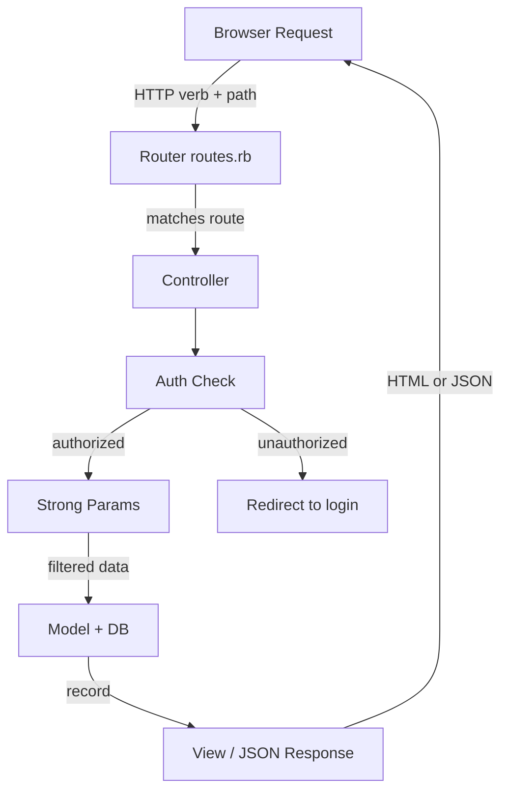
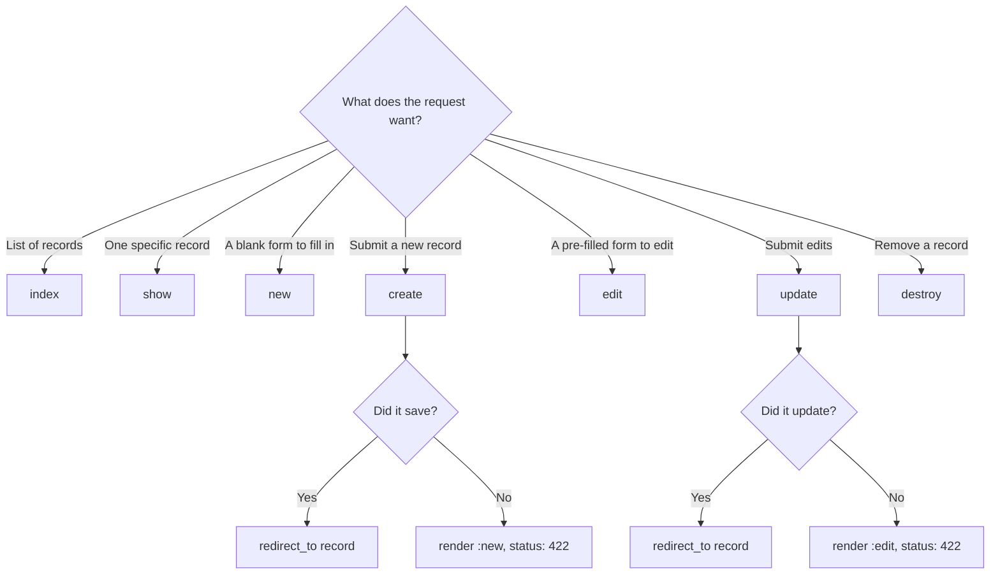

# Rails CRUD + API Building

> **Prerequisites**: Know what HTTP is (request/response). Know what a database table is.
>
> **Companion exercises**: `./01-rails-crud-api/`
>
> **Goal**: Understand not just *what* each Rails piece does, but *why it exists* — so you can explain it, extend it, and debug it under pressure.

---

## 1. Overview

When someone types `https://myapp.com/posts` into a browser and hits Enter, a chain reaction begins. The browser sends an HTTP request. Rails receives it, decides what to do, talks to the database, and sends back a response.

Rails doesn't do this magically — it follows a strict contract. That contract is REST: a set of conventions that maps HTTP verbs and URLs to specific operations. Once you internalize that contract, the entire Rails framework becomes predictable.

Every Rails interview will test whether you understand that contract instinctively — not just whether you can copy a scaffold.

---

## 2. Core Concept & Mental Model

### The Traffic Cop Analogy

Think of your Rails app as a city. The **router** (`routes.rb`) is the city's street signs — it decides which street a car (request) belongs on. The **controller** is the traffic cop at the intersection — it looks at who's in the car (auth), checks if they're allowed through (params), and directs them to their destination (model, then view). The **model** is the city's filing office — the actual data lives there. The **view** is the printed document the clerk hands back.

The cop never does the filing. The filing office never checks IDs. Everyone has exactly one job.

### Concept Map



### The HTTP Verb Contract

| Verb | Meaning | Safe? | Idempotent? |
|------|---------|-------|-------------|
| GET | Read only, never changes data | Yes | Yes |
| POST | Create a new resource | No | No |
| PATCH | Partial update of an existing resource | No | Yes |
| PUT | Full replacement of an existing resource | No | Yes |
| DELETE | Remove a resource | No | Yes |

##### CLAUDE: This needs more attention, why is this important to make this distinction
**Safe** = server state doesn't change. **Idempotent** = calling it twice has the same effect as once.

---

## 3. Building Blocks — Progressive Learning

### Level 1: HTTP Verbs & RESTful Routes — Why the Map Exists

**Why this level matters**

Before you write a single line of controller code, Rails needs to know: when this URL arrives, which action runs? The router makes that decision. If you misunderstand how routes map verbs to actions, you'll get `ActionController::RoutingError` and have no idea why.

**How to think about it**

REST is a convention invented because the web needed a standard language. HTTP already had verbs (GET, POST, etc.) — REST said "let's use them consistently." `GET /posts` always means "give me the list." `POST /posts` always means "create one." `DELETE /posts/5` always means "remove post 5." Once everyone agreed on this, frameworks could generate the whole map automatically.

`resources :posts` in `routes.rb` expands into 7 route definitions at once. That's the entire contract:

```ruby
# What `resources :posts` actually generates:
# Verb    Path              Action   Purpose
# GET     /posts            index    Show all posts
# GET     /posts/new        new      Show the blank creation form
# POST    /posts            create   Save the new post to DB
# GET     /posts/:id        show     Show one specific post
# GET     /posts/:id/edit   edit     Show the edit form for one post
# PATCH   /posts/:id        update   Save edits to one post
# DELETE  /posts/:id        destroy  Remove one post


# There's always two actions for what feels like one operation

new -> create
edit -> update

create | update -> process a form
new | edit -> show a form

```

**Walking through it**

Why GET for both `index` and `new`? Because they're both reads — no data changes. The browser is just asking "show me something."

Why does `new` exist separately from `create`? Because there are two steps: (1) show the user a blank form (new), (2) receive the filled-in form (create). The form needs a page to live on — that's `new`. The submission is a separate request — that's `create`.

Why PATCH and not POST for update? POST means "create something new." PATCH means "modify something that already exists." Using the right verb communicates intent to anyone reading your API.

**The one thing to get right**

`new` and `create` are a pair. `edit` and `update` are a pair. `new`/`edit` are GET (show a form). `create`/`update` are POST/PATCH (process the form). They're always two actions for what feels like one operation.

**Scenario 1: Full CRUD — all 7 routes**
```ruby
# Use when users can do everything: browse, read, create, edit, delete
# config/routes.rb
Rails.application.routes.draw do
  resources :posts
  # → GET    /posts            index
  # → GET    /posts/new        new
  # → POST   /posts            create
  # → GET    /posts/:id        show
  # → GET    /posts/:id/edit   edit
  # → PATCH  /posts/:id        update
  # → DELETE /posts/:id        destroy
end
```

**Scenario 2: Read-only — viewers can browse, not write**
```ruby
# Use for public resources: a blog feed, a product catalog
# config/routes.rb
Rails.application.routes.draw do
  resources :posts, only: %i[index show]
  # → GET /posts        index
  # → GET /posts/:id    show
  # Everything else (create, edit, destroy...) → 404
end
```

**Scenario 3: Full CRUD minus hard delete**
```ruby
# Use when records are soft-deleted (flagged as deleted, not removed from DB)
# config/routes.rb
Rails.application.routes.draw do
  resources :posts, except: %i[destroy]
  # → GET    /posts            index
  # → GET    /posts/new        new
  # → POST   /posts            create
  # → GET    /posts/:id        show
  # → GET    /posts/:id/edit   edit
  # → PATCH  /posts/:id        update
  # (no destroy route — cannot be called, even by accident)
end
```

**Scenario 4: Custom action on top of standard routes**
```ruby
# Use when a resource needs a non-CRUD action (e.g. publish a draft)
# config/routes.rb
Rails.application.routes.draw do
  resources :posts do
    member     { patch :publish }   # PATCH /posts/:id/publish  (acts on one post)
    collection { get   :drafts  }   # GET   /posts/drafts       (acts on all posts)
  end
end
```

**Scenario 5: Nested resource (comments belong to a post)**
```ruby
# Use when a resource only makes sense in the context of a parent
# config/routes.rb
Rails.application.routes.draw do
  resources :posts do
    resources :comments, only: %i[create destroy]
    # → POST   /posts/:post_id/comments/:id   create
    # → DELETE /posts/:post_id/comments/:id   destroy
  end
end
```

> **Mental anchor**: "GET reads. POST creates. PATCH updates. DELETE removes. `resources` is just that rule applied to all 7 actions at once."

---

**→ Bridge to Level 2**: Now that you know which URL triggers which action, you need to understand what each action actually *does* — and more importantly, *why* each of the seven exists as a separate action rather than one big handler.

### Level 2: The Seven Controller Actions — Why Each Exists

**Why this level matters**

Interviewers will show you a controller and ask: "What does this do?" Or they'll describe a feature and ask: "Which actions do you need?" If you only know that `index` lists things, you'll struggle. You need to know the *semantic reason* each action exists.

**How to think about it**

Rails actions map to user *intents*. Users have a limited number of intentions with any resource: browse, read one, fill in a form, submit a form, edit a form, submit edits, delete. Rails gives each intent its own named slot.

**Walking through it — each action explained**

**`index` — "show me the collection"**

The user wants to browse. This action loads a group of records (often filtered/sorted) and passes them to the view. It's a read — never changes data. Always think: "what's the right scope here? Should I filter? Paginate? Eager-load associations?"

```ruby
def index
  @posts = Post.published.recent.includes(:user, :comments)
  # Why includes? Because the view will access post.user.name and
  # post.comments.count — without includes, that's an N+1 query.
end
```

**`show` — "show me this one thing"**

The user clicked on a specific record. This action fetches one record by ID. If it doesn't exist, Rails should raise `RecordNotFound` (which becomes a 404). Notice: `show` doesn't build the object — `set_post` in a `before_action` does that, so it's reused across show/edit/update/destroy.

```ruby
def show
  # @post already set by set_post before_action
  # Just render the view — nothing else to do
end
```

**`new` — "give me a blank form"**

The user clicked "New Post." They need a blank form to fill in. This action builds an empty model object so the form builder has something to bind to. It does NOT save anything. No database write happens here.

```ruby
def new
  @post = Post.new  # blank, unsaved — just gives the form a shape
end
```

**`create` — "save what the user submitted"**

The user filled in the form and hit Submit. The form data arrives as params. This action: (1) filters params (strong params), (2) tries to save, (3) on success redirects; on failure re-renders the form. The reason you re-render (not redirect) on failure is so the user sees their errors without losing what they typed.

```ruby
def create
  @post = current_user.posts.build(post_params)
  if @post.save
    redirect_to @post, notice: "Post created."
    # redirect because the POST is done — GET the new resource
  else
    render :new, status: :unprocessable_entity
    # re-render (not redirect) so @post still has error messages
    # status: :unprocessable_entity needed for Turbo/Hotwire in Rails 7+
  end
end
```

**`edit` — "give me a pre-filled form"**

Like `new`, but the form is pre-filled with the existing record's data. The user wants to change something. Again, no database write — just show the form.

```ruby
def edit
  # @post already set by set_post — the form builder populates itself from @post
end
```

**`update` — "save the edits"**

Like `create`, but for modifying an existing record. The pattern is identical: filter params, try to update, redirect on success or re-render on failure.

```ruby
def update
  if @post.update(post_params)
    redirect_to @post, notice: "Post updated."
  else
    render :edit, status: :unprocessable_entity
  end
end
```

**`destroy` — "remove this record"**

The user confirmed they want to delete. This action destroys the record and redirects to a sensible fallback (the index, usually). There's no "failure" state to re-render — either it destroys or it raises an exception.

```ruby
def destroy
  @post.destroy
  redirect_to posts_path, notice: "Post deleted."
end
```

**The full controller — seeing the whole picture**

```ruby
class PostsController < ApplicationController
  before_action :authenticate_user!
  before_action :set_post, only: %i[show edit update destroy]
  # Why only those four? Because index, new, and create don't need a specific post yet.

  def index
    @posts = Post.published.recent.includes(:user, :comments)
  end

  def show; end   # @post from set_post, view handles the rest

  def new
    @post = Post.new
  end

  def create
    @post = current_user.posts.build(post_params)
    if @post.save
      redirect_to @post, notice: "Post created."
    else
      render :new, status: :unprocessable_entity
    end
  end

  def edit; end   # @post from set_post, view handles the rest

  def update
    if @post.update(post_params)
      redirect_to @post, notice: "Post updated."
    else
      render :edit, status: :unprocessable_entity
    end
  end

  def destroy
    @post.destroy
    redirect_to posts_path, notice: "Post deleted."
  end

  private

  def set_post
    @post = Post.find(params[:id])
    # find raises RecordNotFound if missing -> auto 404
  end

  def post_params
    params.require(:post).permit(:title, :body, :excerpt, :published)
  end
end
```

> **Mental anchor**: "index/show/new/edit are reads. create/update/destroy are writes. new+create are a pair (form then submit). edit+update are a pair (form then submit)."

---

**→ Bridge to Level 3**: The controller knows what to do, but how does it know which data from the form it's allowed to touch? That's the job of strong parameters — the security layer that prevents users from sending rogue fields.

### Level 3: Strong Parameters — The Security Layer

**Why this level matters**

Without strong parameters, a malicious user could submit `post[user_id]=99` in a form and set themselves as the admin, or submit `user[role]=admin` to escalate privileges. This is called **mass assignment vulnerability** — it was a real Rails exploit in 2012 that affected GitHub. Strong params were invented to prevent it.

**How to think about it**

Your controller receives a `params` hash that contains everything the client sent — URL params, form fields, JSON body. The client is untrusted. Before you pass any of that to the model, you must declare an explicit whitelist: "I allow exactly these fields and nothing else."

`require` says "this key must exist in params or raise an error." `permit` says "from the nested hash, only allow these specific keys."

**Walking through it**

```
User submits form with:
  post[title] = "Hello"
  post[body]  = "World"
  post[admin] = true      ← attacker tried to inject this

params = {
  post: {
    title: "Hello",
    body: "World",
    admin: true            ← in params, but not permitted
  }
}

params.require(:post)      => { title: "Hello", body: "World", admin: true }
      .permit(:title, :body)  => { title: "Hello", body: "World" }
                              # admin is silently dropped
```

```ruby
# Simple flat params
def post_params
  params.require(:post).permit(:title, :body, :excerpt, :published)
end

# Array fields (tags, ids)
def post_params
  params.require(:post).permit(:title, :body, tags: [])
  # tags: [] permits an array of scalars
end

# Nested model attributes (accepts_nested_attributes_for)
def post_params
  params.require(:post).permit(
    :title, :body,
    comments_attributes: [:id, :body, :_destroy]
  )
end
```

**The one thing to get right**

Never pass `params[:post]` directly to `Post.new`. Always go through `post_params`. And never use `permit!` (which allows everything) in production — it defeats the entire purpose.

```ruby
# NEVER: mass assignment with raw params
Post.new(params[:post])

# NEVER: permit everything
params.require(:post).permit!

# ALWAYS: explicit whitelist
params.require(:post).permit(:title, :body, :excerpt, :published)
```

> **Mental anchor**: "require says 'this key must exist.' permit says 'only these inner keys get through.' Everything else is silently dropped."

---

**→ Bridge to Level 4**: So far the controller has been responding with HTML views. But what when the client is a mobile app or a JavaScript SPA? It expects JSON. The controller needs to respond differently based on who's asking.

### Level 4: JSON API Mode — The Same Controller, Different Output

**Why this level matters**

Modern apps often serve multiple clients: a web UI, a mobile app, a third-party integration. They all want the same data but in different formats. Rails has a clean way to handle this without duplicating controllers.

**How to think about it**

The request includes a `Content-Type` and `Accept` header that tells Rails what format the client wants. `respond_to` lets you define what to send for each format. For dedicated API controllers (like `Api::V1::PostsController`), skip this — just always render JSON.

**Walking through it**

```ruby
# Hybrid controller — responds to both HTML and JSON
def index
  @posts = Post.published.recent.includes(:user)

  respond_to do |format|
    format.html  # renders app/views/posts/index.html.erb
    format.json { render json: @posts }
  end
end

# Dedicated API controller (simpler — always JSON)
module Api
  module V1
    class PostsController < ApplicationController
      before_action :authenticate_api_user!
      before_action :set_post, only: %i[show update destroy]

      def index
        posts = Post.published.recent.includes(:user)
                    .page(params[:page]).per(25)

        render json: {
          posts: posts.map { |p| serialize_post(p) },
          meta: {
            total_count: posts.total_count,
            current_page: posts.current_page
          }
        }
      end

      def show
        render json: serialize_post(@post)
      end

      def create
        post = current_user.posts.build(post_params)
        if post.save
          render json: serialize_post(post), status: :created
        else
          render json: { errors: post.errors.full_messages },
                 status: :unprocessable_entity
        end
      end

      def update
        if @post.update(post_params)
          render json: serialize_post(@post)
        else
          render json: { errors: @post.errors.full_messages },
                 status: :unprocessable_entity
        end
      end

      def destroy
        @post.destroy
        head :no_content  # 204 — success, no body
      end

      private

      def set_post
        @post = current_user.posts.find(params[:id])
        # Scoped to current_user: prevents user A from accessing user B's posts
        # This is preventing IDOR (Insecure Direct Object Reference)
      end

      def post_params
        params.require(:post).permit(:title, :body, :excerpt, :published)
      end

      def serialize_post(post)
        {
          id: post.id,
          title: post.title,
          body: post.body,
          published: post.published,
          author: post.user.name,
          created_at: post.created_at.iso8601
          # iso8601: "2024-01-15T10:30:00Z" — timezone-safe string format
        }
      end
    end
  end
end
```

**Key API decisions to mention in interviews:**

- **Namespace** (`Api::V1`): allows breaking changes in V2 without affecting V1 clients
- **Pagination**: never return unbounded collections — use `kaminari` or `pagy`
- **Scope finds to current_user**: prevents IDOR attacks
- **`head :no_content`** for DELETE: 204 status, no body — this is the correct REST response
- **`iso8601`** for timestamps: consistent, parseable across all clients
- **`status: :created`** (201) for successful POST: tells client a resource was created

> **Mental anchor**: "HTML controller shows views. API controller renders JSON. Both use the same actions, same strong params, same auth. Only the output format changes."

---

## 4. Decision Framework



---

## 5. Common Gotchas

**1. Re-rendering vs Redirecting on failure**

On failed create/update, you `render :new` (not `redirect_to new_post_path`). Why? Because redirect loses `@post` — the object with its validation errors. The view needs `@post.errors` to show what went wrong.

**2. `status: :unprocessable_entity` on re-render (Rails 7+)**

With Turbo (Rails 7 default), if you `render :new` without `status: 422`, Turbo won't replace the form — it silently swallows the response. Always add `status: :unprocessable_entity`.

**3. Strong params missing a field = silent blank**

If your form submits `title` but you forgot to permit `:title`, the save will succeed with a blank title. No error. The user is confused. Always check your `permit` list matches your form fields.

**4. Scoping find to current_user in APIs**

`Post.find(params[:id])` lets any authenticated user access any post. `current_user.posts.find(params[:id])` restricts to posts they own. Always scope finds in APIs.

**5. `head :no_content` vs `render json: {}`**

For DELETE, return 204 with no body (`head :no_content`). Returning `render json: {}` returns 200 with an empty JSON object — this is technically wrong (200 implies a body with meaningful content).

---

## 6. Practice Scenarios

Work through these before your interview. For each, decide: which action? which verb + path? what does success look like? what does failure look like?

- [ ] "Users can publish a post (flip it from draft to published)" → which action? custom route or standard?
- [ ] "An API endpoint to get all posts by a specific user" → which verb + path? how do you scope it?
- [ ] "Create a comment nested under a post" → nested resource? which controller handles it?
- [ ] "An admin can delete any post; a regular user can only delete their own" → where does that logic live?
- [ ] "The create action always saves with a blank title" → where's the bug? (see `rails-debug-challenge` Scenario 1)

**Companion exercises**: Run `ruby 01-rails-crud-api/level-1-routes-and-verbs.rb` to test your intuition on routes, then work through levels 2 and 3.
