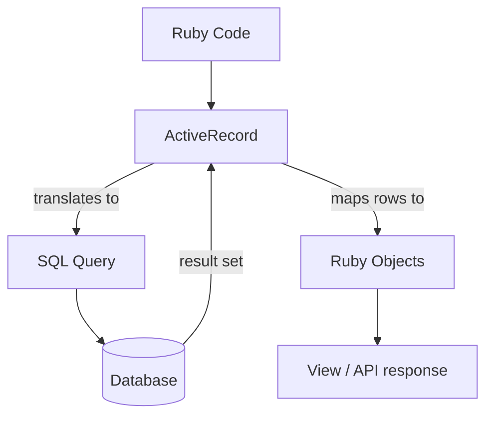
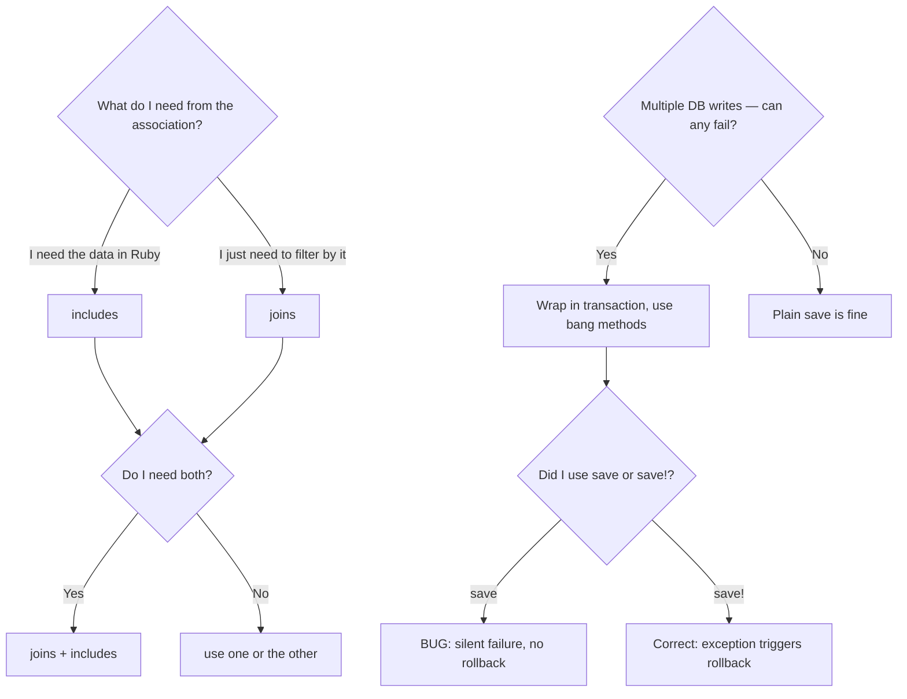

# ActiveRecord: Queries, Includes/Joins, Transactions

> **Prerequisites**: Know what SQL SELECT, JOIN, and transactions are at a conceptual level.
>
> **Companion exercises**: `./02-activerecord-patterns/`
>
> **Goal**: Understand how ActiveRecord translates Ruby to SQL — and where that translation silently creates expensive or dangerous queries.

---

## 1. Overview

ActiveRecord is a translator. You write Ruby method calls; it generates SQL. The problem is the translation is invisible — it happens automatically, and when it's wrong, it's wrong silently. You won't get an error. You'll get a page that loads fine with 5 records and crashes with 500. Or a form that saves successfully but overwrites data it shouldn't touch.

Three topics dominate every Rails backend interview:

1. **N+1 queries** — the most common Rails performance bug
2. **includes vs joins** — the two tools that solve N+1, but for different purposes
3. **Transactions** — how to guarantee that multiple DB writes either all succeed or all roll back

---

## 2. Core Concept & Mental Model

### The Personal Shopper Analogy

Imagine you're a personal shopper with a list of 50 clients. For each client, you need to know their address.

**Without eager loading (N+1)**: You call each client one by one. 50 clients = 50 phone calls. You finish your 50th call after the store has closed.

**With `includes` (eager loading)**: You call HR once. "Give me addresses for clients 1 through 50." One call. Done in a minute.

**With `joins`**: You ask HR to filter the list — "only give me clients who live in New York." HR does the filtering. You get a smaller list. But you still don't have their full contact records — you just have names. If you need addresses too, you need something else.

### What Actually Happens



The translation happens at the moment you call a method that "executes" the query: `.each`, `.first`, `.count`, `.to_a`, etc. Until then, you're just building a query object.

---

## 3. Building Blocks — Progressive Learning

### Level 1: The N+1 Problem — What It Is and Why It Matters

**Why this level matters**

N+1 is the single most common Rails bug in interviews. Interviewers will show you a controller that looks correct, and the only problem is an N+1. If you can't spot it, you've lost points. If you can spot it *and* fix it *and* explain why it's slow, you've won.

**How to think about it**

N+1 means: 1 query to load a collection + 1 query per item in the collection to load a related record. If you have N posts and you access `post.user` inside a loop without eager loading, you're making N+1 trips to the database.

The "1" is the first query. The "+N" is the problem. At 5 records you won't notice. At 500 records, your page takes 3 seconds. At 50,000 records, the database falls over.

**Walking through it**

```
# Database state:
# posts table: 3 rows, each with user_id
# users table: 3 rows

posts = Post.all          # Query 1: SELECT * FROM posts
# => returns 3 post objects, but user is NOT loaded yet

posts.each do |post|
  puts post.user.name     # Query 2 (for post 1): SELECT * FROM users WHERE id = 1
                          # Query 3 (for post 2): SELECT * FROM users WHERE id = 2
                          # Query 4 (for post 3): SELECT * FROM users WHERE id = 3
end

# Total: 4 queries (1 + 3)
# With 100 posts: 101 queries
# With 1000 posts: 1001 queries
```

The loop doesn't look wrong. `post.user.name` looks completely reasonable. That's what makes N+1 dangerous — it's invisible in the code but explosive in production.

```ruby
# BAD — N+1
def index
  @posts = Post.all
  # view calls post.user.name for each post -> N+1
end

# GOOD — eager load with includes
def index
  @posts = Post.includes(:user)
  # includes fires: SELECT * FROM users WHERE id IN (1, 2, 3, ...)
  # All users loaded in one query, then Rails matches them to posts in memory
end
```

**The one thing to get right**

`includes` doesn't change the Ruby interface at all. You still write `post.user.name`. The only difference is that Rails loaded the users ahead of time, so there's nothing to fetch when you access the association.

> **Mental anchor**: "If I access an association inside a loop, I need includes. No exceptions. The loop is the signal."

---

**→ Bridge to Level 2**: `includes` eager-loads associations so you can access them. But what if you don't need to access them — you just need to *filter* by them? That's a different tool with a different tradeoff.

### Level 2: includes vs joins — Two Tools, Two Purposes

**Why this level matters**

"Should I use `includes` or `joins` here?" is a real interview question. They look similar but solve different problems. Using `joins` when you need `includes` means you still have an N+1. Using `includes` when you only need `joins` means you're loading data you'll never use.

**How to think about it**

Ask yourself one question: **Do I need to access the associated data in Ruby?**

- **Yes, I need `post.user.name` in my view** → use `includes`. It loads the association into memory.
- **No, I just need to filter — only posts where the user is an admin** → use `joins`. It runs a SQL JOIN to filter but doesn't load the association into Ruby objects.

**Walking through it**

```ruby
# SCENARIO 1: Show each post and its author's name
# You NEED the user data in the view -> includes

@posts = Post.includes(:user)
# SQL:
#   SELECT * FROM posts
#   SELECT * FROM users WHERE id IN (1, 2, 3, ...)
# post.user.name works with no additional queries

# SCENARIO 2: Only show posts written by admin users
# You DON'T need the user data, just filtering -> joins

@posts = Post.joins(:user).where(users: { role: "admin" })
# SQL:
#   SELECT posts.* FROM posts
#   INNER JOIN users ON users.id = posts.user_id
#   WHERE users.role = 'admin'
# IMPORTANT: post.user still fires a query — joins doesn't load it
```

**The four methods — clear comparison**

```ruby
# includes — smart: picks preload or LEFT JOIN depending on context
Post.includes(:user)

# preload — always 2 separate queries (never a JOIN)
Post.preload(:user)

# eager_load — always LEFT OUTER JOIN (one big query)
Post.eager_load(:user)

# joins — INNER JOIN, filters only, does NOT load the association
Post.joins(:user)

# Combining: filter with joins + load with includes
Post.joins(:user)
    .where(users: { active: true })
    .includes(:user, :comments)
# filters to active users' posts, then loads user + comments for each
```

**The one thing to get right**

`joins` does NOT load the association. After `Post.joins(:user)`, if you write `post.user.name` in a loop, you still have an N+1. `joins` is for filtering the SQL WHERE clause, not for loading data.

```ruby
# TRAP: joins for filtering + accessing the association = N+1
@posts = Post.joins(:user).where(users: { active: true })
@posts.each { |p| puts p.user.name }  # N+1! joins didn't load user

# FIX: add includes to also load the association
@posts = Post.joins(:user).where(users: { active: true }).includes(:user)
@posts.each { |p| puts p.user.name }  # no extra queries
```

> **Mental anchor**: "joins filters. includes loads. If you need both: do both."

---

**→ Bridge to Level 3**: You now know how to read from the database efficiently. But what about writing? Specifically: what happens when you need to write to multiple tables and one of them fails?

### Level 3: Transactions — All or Nothing

**Why this level matters**

Transactions are what separate junior developers from senior ones in interviews. The question isn't whether you've used `save` before — it's whether you know what happens to your data when the second save fails but the first already succeeded.

**How to think about it**

**Analogy**: You're wiring a bank transfer. You debit $100 from account A and credit $100 to account B. If the debit succeeds but the credit fails (say, account B doesn't exist), you've destroyed $100. It left A and never arrived at B.

A transaction wraps both operations in a guarantee: either both happen, or neither happens. If anything inside the block raises an exception, the database rolls back to exactly the state it was in before the block started.

**Walking through it**

```
Before transaction:
  sender.balance   = 500
  receiver.balance = 100

Transaction begins
  Step 1: UPDATE accounts SET balance = 400 WHERE id = sender.id    ✓
  Step 2: UPDATE accounts SET balance = 200 WHERE id = receiver.id  ✗ (error)

Transaction ROLLS BACK:
  sender.balance   = 500  (restored)
  receiver.balance = 100  (never changed)

Without transaction:
  sender.balance   = 400  (deducted, NOT restored)
  receiver.balance = 100  (never received)
  -> $100 is gone forever
```

```ruby
# WRONG: two saves with no transaction
def transfer(sender, receiver, amount)
  sender.update!(balance: sender.balance - amount)    # this succeeds
  receiver.update!(balance: receiver.balance + amount) # this might fail
  # If receiver.update! raises -> sender already lost the money. No rollback.
end

# CORRECT: both in a transaction
def transfer(sender, receiver, amount)
  ActiveRecord::Base.transaction do
    sender.update!(balance: sender.balance - amount)
    receiver.update!(balance: receiver.balance + amount)
    # If EITHER raises, BOTH are rolled back
  end
rescue ActiveRecord::RecordInvalid => e
  false  # transaction already rolled back — just signal failure
end
```

**The one thing to get right**

The transaction only rolls back when an **exception is raised**. `save` returns `false` — no exception, no rollback. `save!` raises `ActiveRecord::RecordInvalid` — exception, rollback. Inside a transaction, always use bang methods.

```ruby
# WRONG: save returns false, transaction does NOT roll back
ActiveRecord::Base.transaction do
  sender.save    # returns false silently
  receiver.save  # runs even though sender failed
end

# CORRECT: save! raises, transaction rolls back
ActiveRecord::Base.transaction do
  sender.save!    # raises if invalid -> everything rolls back
  receiver.save!  # only runs if sender succeeded
end
```

> **Mental anchor**: "Transaction = all or nothing. But only if you use bang methods. save is silent. save! screams."

---

**→ Bridge to Level 4**: Now you know how to query safely and write safely. The last piece: when you need to write many records fast, or fetch specific columns to avoid loading unnecessary data, Rails has specialized tools for that.

### Level 4: Power Queries — When Basic ActiveRecord Is Too Slow

**Why this level matters**

An interview might give you a scenario: "You have 10,000 users and need to send each one an email. How do you load them?" The naive answer loads all 10,000 into memory at once. The right answer uses batching. Knowing these patterns shows you think about production reality, not just correctness.

**Walking through it**

```ruby
# pluck — returns raw values, not model objects. Fast. No object overhead.
Post.published.pluck(:id, :title)
# => [[1, "Hello World"], [2, "Rails is great"]]
# Use when: you need values for display or further queries, not the full object

# select — loads records but only specific columns
Post.select(:id, :title, :published)
# => [#<Post id: 1, title: "Hello World">]
# Unlike pluck, you still get objects — but only those columns are loaded

# find_each — loads records in batches of 1000 (default)
User.find_each(batch_size: 500) do |user|
  WelcomeEmailJob.perform_later(user.id)
end
# NEVER: User.all.each do |user| ... end  <- loads all users into memory at once

# find_in_batches — gives you the whole batch as an array
Post.published.find_in_batches(batch_size: 100) do |batch|
  batch.each { |post| ... }
end

# exists? — much faster than .count > 0 or .any?
Post.exists?(user: current_user, published: true)
# SQL: SELECT 1 FROM posts WHERE ... LIMIT 1  (stops at first match)

# count — aggregate without loading objects
Post.where(published: true).count
# SQL: SELECT COUNT(*) FROM posts WHERE published = true
```

> **Mental anchor**: "pluck for raw values. find_each for large datasets. exists? to check presence. Never .all.each on big tables."

---

## 4. Decision Framework



---

## 5. Common Gotchas

**1. N+1 in the view, not the controller**

The N+1 often happens in the view template, not the controller. The controller loads `@posts` cleanly, but the ERB calls `post.user.name`. The fix is always in the controller: add `includes`.

**2. Counter cache confusion**

`post.comments.count` fires `SELECT COUNT(*)`. With a counter cache column (`comments_count`), `post.comments_count` just reads the column — no query. To use counter cache: add `counter_cache: true` to the `belongs_to` and add a migration for the `_count` column.

**3. `where` with string interpolation = SQL injection**

```ruby
# NEVER: attacker can inject SQL through params[:name]
Post.where("title = '#{params[:title]}'")

# ALWAYS: parameterized
Post.where("title = ?", params[:title])
Post.where(title: params[:title])  # even safer
```

**4. Callbacks run inside transactions**

`after_create` callbacks run inside the same transaction as the save. If your callback enqueues a job, the job might run before the transaction commits — and then `Post.find(id)` in the job raises `RecordNotFound`. Use `after_commit` for job enqueueing.

**5. `update` vs `update_columns`**

`update` runs validations and callbacks. `update_columns` skips both and writes directly to DB. For status transitions where you don't want callbacks to re-fire, `update_columns` is the right tool — but know the tradeoff.

---

## 6. Practice Scenarios

- [ ] A controller does `@posts = Post.all` and the view shows `post.user.name`. What's wrong and how do you fix it?
- [ ] You need all posts by users who are admins. Do you use `includes` or `joins`? Why?
- [ ] Write a transfer method that moves money between two accounts. What happens if the second save fails?
- [ ] A report needs to export 100,000 post titles to CSV. How do you load them without running out of memory?
- [ ] `Post.where("status = '#{params[:status]}'")` — what's the risk and how do you fix it?

**Companion exercises**: Run `ruby 02-activerecord-patterns/level-1-n-plus-one.rb` to identify N+1 bugs, then work through levels 2 and 3.
