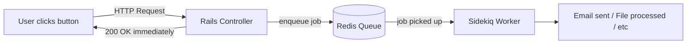
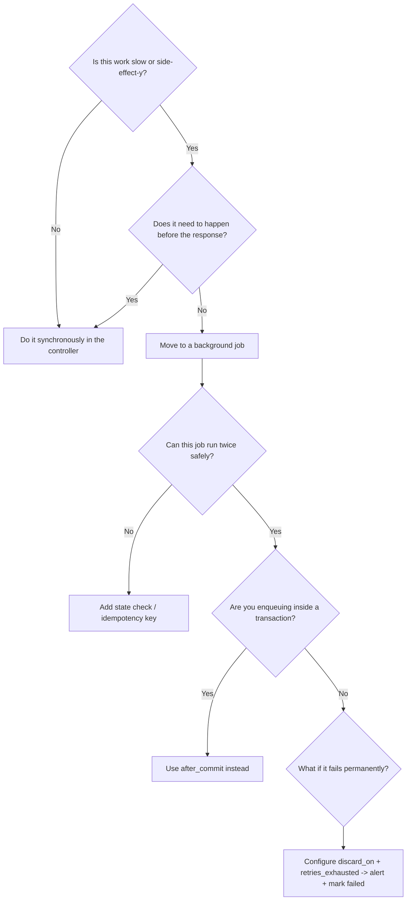

# Background Jobs: Sidekiq & ActiveJob

> **Prerequisites**: Understand what a database transaction is. Know that HTTP is synchronous (request → response in one cycle).
>
> **Companion exercises**: `./03-background-jobs/`
>
> **Goal**: Know when to move work out of the request cycle, how to do it safely, and what can go wrong when you don't think carefully about retries.

---

## 1. Overview

Every HTTP request is a conversation: the user asks something, the server answers. The user's browser waits for that answer. If the server is slow — sending an email, resizing an image, calling a slow third-party API — the user waits too.

Background jobs are the answer. Instead of doing slow work during the HTTP request, you drop a note in a queue and respond immediately. A separate process (the worker) picks up the note and does the work asynchronously.

But dropping a note in a queue introduces new problems: what if the note gets lost? What if the worker crashes halfway through? What if the same note gets delivered twice? This guide is about building systems that handle all of those cases correctly.

---

## 2. Core Concept & Mental Model

### The Note on the Kitchen Counter Analogy

You write a note: "Please bake a cake for tomorrow." You leave it on the counter. You go do other things. Your roommate (the worker) comes home, reads the note, bakes the cake.

**Key questions about this system:**
- What if your roommate misreads the note and starts twice? (duplicate execution)
- What if the oven breaks halfway through? (partial failure)
- What if your roommate is busy and reads it three hours later? (delayed processing)
- What if the note falls behind the microwave? (message loss)

Good background job design answers all of these questions.



**The contract**: The controller's job ends when it enqueues. The worker's job begins when it dequeues.

---

## 3. Building Blocks — Progressive Learning

### Level 1: What Belongs in a Background Job?

**Why this level matters**

Moving everything to a background job makes your app complex. Moving nothing causes your app to be slow. The skill is knowing which work belongs in the request cycle and which doesn't. Interviewers will describe a feature and ask how you'd implement it — this decision is often the right answer to open with.

**How to think about it**

A request should only do what's necessary to respond to the user. Three signals that work belongs in a background job:

1. **It's slow** (> ~100ms): email, image processing, API calls to third parties
2. **It's retryable on failure**: if it can fail and be retried safely, it's a job candidate
3. **The user doesn't need it synchronously**: "we sent you a confirmation email" can say that before the email is actually sent

```ruby
# Without jobs — user waits for all of this
def create
  @user = User.create!(user_params)
  UserMailer.welcome(@user).deliver_now          # ~500ms
  SlackNotifier.ping("New signup: #{@user.email}") # ~200ms
  AnalyticsService.track(@user)                  # ~100ms
  redirect_to root_path                          # user waited ~800ms
end

# With jobs — user gets their response in ~20ms
def create
  @user = User.create!(user_params)
  WelcomeEmailJob.perform_later(@user.id)         # ~2ms (just enqueue)
  SlackNotifyJob.perform_later(@user.id)          # ~2ms
  AnalyticsJob.perform_later(@user.id)            # ~2ms
  redirect_to root_path                           # user waited ~20ms
end
```

**The one thing to get right**

Pass the **ID**, not the object. When you enqueue `WelcomeEmailJob.perform_later(@user)`, Rails serializes the user object into the queue. If the user record changes before the worker runs, the job has stale data. Pass `@user.id` and fetch fresh from the database inside the job.

```ruby
class WelcomeEmailJob < ApplicationJob
  def perform(user_id)
    user = User.find(user_id)   # always find fresh — guaranteed current state
    UserMailer.welcome(user).deliver_now
  end
end
```

> **Mental anchor**: "Jobs are for slow, retryable, non-blocking work. Pass the ID. Find fresh."

---

**→ Bridge to Level 2**: You know what to put in a job. But jobs can fail — network hiccups, database timeouts, third-party API errors. Sidekiq retries them automatically. This is great — unless your job has side effects that happen twice.

### Level 2: Idempotency — Safe to Retry

**Why this level matters**

Sidekiq retries failed jobs automatically. The network can deliver the same message twice in edge cases. Your job **will** run more than once. An idempotent job produces the same result whether it runs once or ten times. A non-idempotent job charges a customer twice, sends three welcome emails, or creates duplicate records.

**How to think about it**

**Analogy**: A light switch. Flipping it "on" when it's already on doesn't create a second "on." That's idempotent. Pressing a doorbell is not idempotent — pressing it twice rings twice.

Your jobs need to be light switches, not doorbells.

**Walking through it**

```ruby
# BAD: not idempotent — double-run creates a duplicate charge
class ChargeUserJob < ApplicationJob
  def perform(user_id, amount)
    user = User.find(user_id)
    Stripe::Charge.create(amount: amount, customer: user.stripe_id)
    # If the job completes the charge but then crashes before Sidekiq marks
    # it done, Sidekiq retries it. User is charged twice.
  end
end

# GOOD: idempotent — check before acting
class ChargeUserJob < ApplicationJob
  def perform(order_id)
    order = Order.find(order_id)
    return if order.charged?         # already done on a previous attempt? skip.

    charge = Stripe::Charge.create(
      amount: order.total_cents,
      customer: order.user.stripe_id,
      idempotency_key: "order-#{order.id}"  # Stripe deduplicates on their end too
    )
    order.update!(charge_id: charge.id, charged_at: Time.current)
  end
end
```

**The three strategies for idempotency:**

```ruby
# Strategy 1: Check current state before acting
return if order.charged?
return if user.welcome_email_sent?

# Strategy 2: Use find_or_create_by — only creates if not already there
Tag.find_or_create_by(name: "rails", post: post)

# Strategy 3: Use external idempotency keys for third-party APIs
Stripe::Charge.create(..., idempotency_key: "charge-#{order.id}")
Twilio::Message.create(..., idempotency_key: "sms-#{notification.id}")
```

**The one thing to get right**

Idempotency comes from the *state check*, not from trying to prevent retries. Don't try to make Sidekiq not retry — Sidekiq retries are a feature, not a bug. Make your job handle being called multiple times gracefully.

> **Mental anchor**: "What happens if this job runs twice? If the answer is 'bad things,' make it check state first."

---

**→ Bridge to Level 3**: Your jobs are idempotent. But there's a timing trap that even experienced Rails developers miss: what happens when you enqueue a job from inside a database transaction?

### Level 3: Transactions and Jobs — The Timing Trap

**Why this level matters**

This is an advanced bug that interviewers love because it's invisible until production and feels impossible to reproduce. The bug: you enqueue a job inside a transaction. The worker picks it up and runs *before the transaction commits*. The job calls `Post.find(id)` and gets `RecordNotFound` — even though the controller created the post just moments ago.

**How to think about it**

A Rails `save` inside a transaction is not committed to the database until the transaction's `END` statement. Sidekiq pulls jobs from Redis nearly instantly. The race condition:

```
Time 0: Transaction begins
Time 1: Post.create!(...)         <- row exists in DB but transaction not committed
Time 2: PostJob.perform_later(id) <- job enqueued in Redis
Time 3: WORKER PICKS UP JOB
Time 4: Post.find(id) -> RECORD NOT FOUND (transaction not committed yet!)
Time 5: Transaction commits       <- too late, job already failed
```

**Walking through it**

```ruby
# The trap: perform_later inside a transaction
def create
  ActiveRecord::Base.transaction do
    @post = Post.create!(post_params)
    NotifyFollowersJob.perform_later(@post.id)  # enqueued before commit!
  end
end
```

**Fix 1: enqueue after the transaction block**

```ruby
def create
  @post = nil
  ActiveRecord::Base.transaction do
    @post = Post.create!(post_params)
  end
  # transaction is committed here
  NotifyFollowersJob.perform_later(@post.id)
end
```

**Fix 2: use `after_commit` in the model**

```ruby
class Post < ApplicationRecord
  after_commit :notify_followers, on: :create

  private

  def notify_followers
    NotifyFollowersJob.perform_later(id)
    # after_commit fires after the transaction commits — record is guaranteed to exist
  end
end
```

**Fix 3: use `after_create_commit` shorthand (Rails 6+)**

```ruby
class Post < ApplicationRecord
  after_create_commit { NotifyFollowersJob.perform_later(id) }
end
```

**The one thing to get right**

`after_create` fires inside the transaction. `after_commit` fires after. For anything that reaches outside the current process (jobs, emails, webhooks), always use `after_commit`.

> **Mental anchor**: "after_create: inside the transaction, record might not be committed. after_commit: transaction is done, record is real. Jobs go in after_commit."

---

**→ Bridge to Level 4**: You know how to enqueue jobs safely and make them idempotent. The last piece is what happens when jobs fail completely — after all retries are exhausted.

### Level 4: Retry Strategy and Dead Letter Queues

**Why this level matters**

A job that fails 5 times is telling you something important. Either there's a bug, the third-party service is down, or the data is in a state the job can't handle. You need to know about it. The dead letter queue is how you capture and investigate these failures.

**How to think about it**

**Analogy**: The post office's "undeliverable mail" bin. If a letter can't be delivered after several attempts, it goes to a special bin for human review — not just thrown away.

```ruby
class ImportDataJob < ApplicationJob
  # Retry on transient errors (network, timeouts) — exponential backoff
  retry_on Net::TimeoutError, Errno::ECONNREFUSED,
           wait: :exponentially_longer, attempts: 5

  # Don't retry on permanent errors (bad data, missing record)
  discard_on ActiveRecord::RecordNotFound
  discard_on CSV::MalformedCSVError

  sidekiq_retries_exhausted do |msg, ex|
    import_id = msg["args"].first
    import = DataImport.find_by(id: import_id)
    import&.update!(status: :failed, error_message: ex.message)
    AdminMailer.import_failed(import).deliver_later
  end

  def perform(import_id)
    import = DataImport.find(import_id)  # raises RecordNotFound -> discarded
    import.process!
  end
end
```

**Queue isolation — why it matters:**

```ruby
# Bad: one queue, slow batch jobs block user-facing jobs
class PostPublishedEmailJob < ApplicationJob
  queue_as :default
end

class NightlyReportJob < ApplicationJob
  queue_as :default  # this 10-minute job blocks email jobs
end

# Good: separate queues by priority
class PostPublishedEmailJob < ApplicationJob
  queue_as :critical  # user is waiting for this
end

class NightlyReportJob < ApplicationJob
  queue_as :low  # can wait
end

# sidekiq.yml — process critical queue 3x more often
# :queues:
#   - [critical, 3]
#   - [default, 1]
#   - [low, 1]
```

> **Mental anchor**: "retry_on for transient errors. discard_on for permanent errors. Dead jobs go to DLQ — always monitor and alert on them."

---

## 4. Decision Framework



---

## 5. Common Gotchas

**1. Passing full objects instead of IDs**

`perform_later(user)` serializes the user at enqueue time. By the time the job runs, the data may be stale. Always pass IDs.

**2. Silently discarding errors**

A job that rescues all exceptions and does nothing with them hides bugs. At minimum, log. Better: `discard_on` specific errors you expect, let unexpected ones retry and eventually alert.

**3. Unbounded job queues**

If producers enqueue faster than workers consume, the queue grows. Set up monitoring on queue depth — a growing queue is an early warning that you need more workers or that a worker is stuck.

**4. Callbacks vs after_commit**

Any `after_create` or `after_save` callback that does network I/O (email, job, webhook) should be `after_commit`. This is a very common senior-level bug question.

**5. `perform_now` in production**

`perform_now` runs the job synchronously in the current request. Fine for tests and debugging. Never use it in production paths where the work is slow — it defeats the entire purpose.

---

## 6. Practice Scenarios

- [ ] "After signup, send a welcome email and post to Slack." Move both to jobs. What do you pass to each job?
- [ ] "Charge the customer when they click 'Confirm Order.'" How do you make the charge job idempotent?
- [ ] "A job creates a report and emails it. The email sometimes times out." Configure retry_on. What should happen after 5 failures?
- [ ] "A Post model enqueues NotifyJob in after_create. In production, jobs sometimes get RecordNotFound." What's the bug? What's the fix?
- [ ] "The nightly report job takes 10 minutes and our user-facing email jobs are delayed by hours." What's wrong? How do you fix it?

**Companion exercises**: Run `ruby 03-background-jobs/level-1-what-goes-in-a-job.rb` to practice the sync vs async decision, then work through levels 2 and 3.
