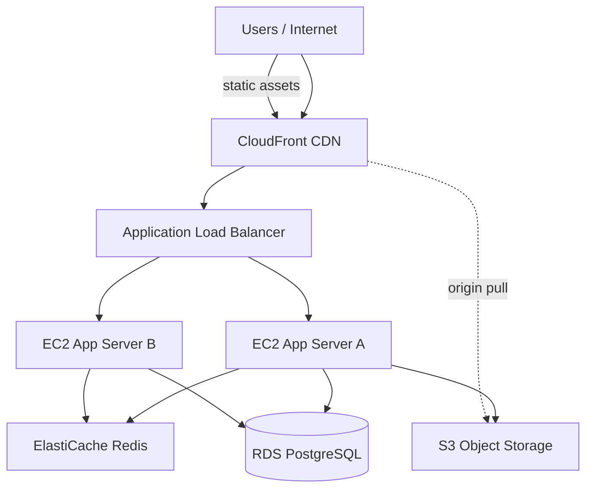
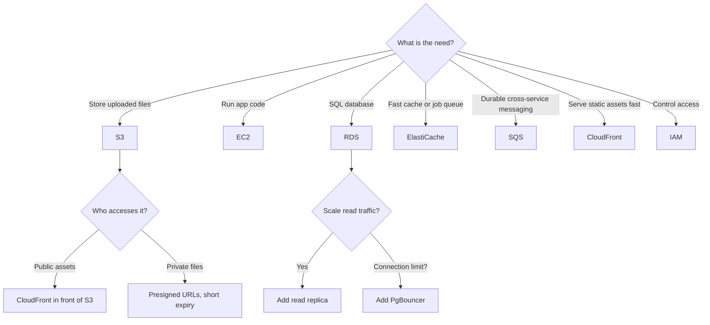

# AWS Fundamentals for Backend Interviews

> **Prerequisites**: Know what a web server is. Know what a database is. Know what HTTP is.
>
> **Companion exercises**: `./04-aws-fundamentals/`
>
> **Goal**: Understand the *why* behind each AWS service — what problem it solves — so you can justify using it in a system design conversation.

---

## 1. Overview

AWS is not just a collection of services you memorize. It's a set of answers to real infrastructure problems. When your Rails app lives on one machine and that machine goes down, everything stops. AWS exists to solve that problem — and the problems that emerge once you've solved that one.

You don't need to be an AWS expert. You need to understand what each core service does and *why* someone would choose it. In a system design interview, you're not configuring — you're reasoning. "I'd put the images in S3 because..." is what they're listening for.

---

## 2. Core Concept & Mental Model

### The City Infrastructure Analogy

Think of AWS as a city's infrastructure:

- **EC2** → the buildings (compute — where your code runs)
- **S3** → the warehouse district (storage — files, images, backups)
- **RDS** → the filing office (managed database — structured records)
- **ElastiCache** → the coffee station on each floor (fast in-memory data access)
- **SQS** → the postal service (messaging — tasks passed between services)
- **ALB** → the traffic roundabout (distributes cars/requests to buildings)
- **CloudFront** → the satellite offices in every neighborhood (content close to users)
- **IAM** → the keycard system (who can access what)
- **VPC** → the city walls + internal roads (network isolation)



---

## 3. Building Blocks — Progressive Learning

### Level 1: S3 — Why Files Don't Live on Your App Server

**Why this level matters**

"How do you handle file uploads?" is in almost every Rails backend interview. The naive answer — save to disk on the app server — breaks the moment you have two app servers. S3 is the correct answer. But you need to be able to explain *why*.

**How to think about it**

Your app server is ephemeral. It can be replaced, scaled out to 10 copies, or terminated by an Auto Scaling Group. Files saved to its local disk disappear when it does. S3 is external, durable (11 nines of durability — that's 0.000000001% chance of losing data per year), and reachable from any app server.

**Walking through it**

```
Naive (breaks at scale):
  User uploads avatar -> App Server A saves to /uploads/avatar.jpg
  Request 2 goes to App Server B -> can't find the file -> 404

With S3:
  User uploads avatar -> App Server A sends to S3 bucket
  Request 2 goes to App Server B -> reads from S3 -> works
```

**Direct upload pattern — why it matters:**

```
Standard upload (slow, expensive):
  1. Browser uploads file to your server (large file = slow)
  2. Server uploads file to S3 (double transfer)
  3. Server responds to browser

Direct upload (fast, scalable):
  1. Browser asks your server for a presigned URL
  2. Browser uploads file directly to S3 (skips your server entirely)
  3. Browser notifies your server of the S3 key
  4. Server saves the reference
```

With direct upload, your server never touches the file bytes. S3 handles the upload, your server just stores the reference.

**Presigned URLs — why they're the right way to serve private files:**

```
Public URL: s3.amazonaws.com/my-bucket/secret-doc.pdf
  -> Anyone with the URL can download it forever

Presigned URL: s3.amazonaws.com/my-bucket/secret-doc.pdf?X-Amz-Expires=900&...
  -> Only valid for 15 minutes, only for this one file
  -> Perfect for "Download your invoice" buttons
```

```ruby
# Rails + ActiveStorage (the right way)
class Post < ApplicationRecord
  has_one_attached :cover_image
  has_many_attached :documents
end

# config/storage.yml
# amazon:
#   service: S3
#   region: us-east-1
#   bucket: my-app-production

# Generate a short-lived URL
url = rails_blob_url(post.cover_image, expires_in: 15.minutes)
```

> **Mental anchor**: "App servers are cattle. S3 is the warehouse that outlasts any one server. Direct upload: browser -> S3 directly. Private files: presigned URLs with expiry."

---

**→ Bridge to Level 2**: S3 stores files. But your app's code has to run somewhere. EC2 provides the compute — and the interesting question is how you make it scale automatically.

### Level 2: EC2 + Load Balancer — Why One Server Is Never Enough

**Why this level matters**

"How would you scale this app?" is the most common system design transition. The answer always involves multiple app servers. Understanding how EC2, ALB, and Auto Scaling Groups work together is the foundation of that answer.

**How to think about it**

One server is a single point of failure. If it goes down — hardware failure, bad deploy, traffic spike — your entire app is down. The solution is multiple servers behind a load balancer. The load balancer distributes incoming requests across all healthy servers. If one dies, the others keep serving.

**The three pieces:**

**Application Load Balancer (ALB)**: Receives all traffic. Checks each app server's health endpoint (`GET /health -> 200`). Routes requests only to healthy servers. Terminates SSL (handles HTTPS).

**EC2 instances**: Each runs a copy of your Rails app (Puma). They're identical — built from the same AMI. Stateless (session state lives in Redis, not in memory on the server).

**Auto Scaling Group (ASG)**: Watches CPU or request count metrics. If average CPU > 70% for 5 minutes, launch a new EC2 instance. If average CPU < 20%, terminate one. You define min/max count.

```
Low traffic:
  ALB -> [EC2 A, EC2 B]  (2 instances, cost is low)

Traffic spike:
  ALB -> [EC2 A, EC2 B, EC2 C, EC2 D]  (ASG launched 2 more)

Traffic drops:
  ALB -> [EC2 A, EC2 B]  (ASG terminated C and D)
```

**Why statelessness matters:** If user A's session is stored in memory on EC2-A, and their next request goes to EC2-B, they're logged out. Sessions must live in a shared store (Redis/ElastiCache) that every server can reach.

> **Mental anchor**: "ALB = traffic cop. ASG = the cop calls for backup when it gets busy. Servers must be stateless — all shared state lives in Redis or the database."

---

**→ Bridge to Level 3**: Your app servers are running and scaling. They all need to talk to the same database. That's RDS.

### Level 3: RDS — Why You Don't Run Your Own Database

**Why this level matters**

Running your own PostgreSQL on an EC2 instance means you're responsible for: backups, software updates, failover, replication, monitoring. RDS handles all of that. But more importantly for interviews: understanding *when* to add a read replica is a key scaling decision.

**How to think about it**

A managed database (RDS) is not just about avoiding operations work. It's about getting production-grade reliability (automated backups, Multi-AZ failover) with minimal configuration.

**The scaling pattern:**

```
Phase 1 (early): single RDS instance
  All reads + writes go to one instance. Simple.

Phase 2 (read-heavy): primary + read replica
  Writes still go to the primary.
  Analytics, reporting, and "best effort" reads go to the replica.
  If you have 10 reads per write, this offloads 90% of load from primary.

Phase 3 (high traffic): connection pooling
  Each Puma thread needs a DB connection.
  10 EC2 instances * 5 Puma workers * 5 threads = 250 connections.
  RDS has a max_connections limit (typically ~100 for small instances).
  PgBouncer pools connections: apps see 250 connections, DB sees 20.
```

**Multi-AZ vs Read Replica:**

| | Multi-AZ | Read Replica |
|--|--|--|
| Purpose | Availability (failover) | Scale reads |
| Lag | Synchronous replication | Asynchronous (slight lag) |
| Reads served? | No (standby, not active) | Yes |
| Failover? | Automatic | Manual promotion |

> **Mental anchor**: "Multi-AZ = insurance (failover). Read replica = performance (offload reads). PgBouncer = when connection count is the bottleneck."

---

**→ Bridge to Level 4**: The database is the slowest part. The fastest thing is not reading from the database at all — reading from cache.

### Level 4: ElastiCache — Redis as the Speed Layer

**Why this level matters**

Redis comes up in almost every system design conversation: cache layer, Sidekiq backend, session store, rate limiting, pub/sub. You need to be able to explain what it is and when to use it.

**How to think about it**

Redis is in-memory — it reads and writes at RAM speed (~1ms vs 50ms for a DB query). It holds data only as long as you tell it to (TTL). It's not the source of truth — the database is. Redis is the cheat sheet you keep on your desk so you don't have to go to the filing cabinet every time.

```
Without Redis:
  Every page load -> DB query (50ms)
  1,000 req/sec -> 50,000ms of DB query time/sec -> DB falls over

With Redis:
  First request -> DB query (50ms) -> store result in Redis for 5 minutes
  Next 999 requests -> Redis read (1ms)
  DB load: 1 query per 5 minutes instead of 1,000/sec
```

**Use cases:**

| Use case | Pattern | TTL |
|----------|---------|-----|
| User profile cache | Cache-aside | 1 hour |
| Session storage | Store in Redis | Session duration |
| Sidekiq job queue | Built-in | Consumed when processed |
| Rate limiting | INCR + EXPIRE | Per-window (1 min) |
| Leaderboards | Sorted sets | N/A |

> **Mental anchor**: "Redis is RAM-speed storage with an expiry date. Use it to avoid hitting the database for data that doesn't change every second."

---

### Level 5: SQS + IAM — Durable Queues and Access Control

**Why this level matters**

SQS comes up when the conversation turns to decoupling services or when durability matters more than speed. IAM comes up as a security best practice you should always mention.

**SQS — When to use it over Redis/Sidekiq:**

```
Sidekiq (Redis-backed):
  + Simple, fast (~5ms latency)
  + Great for Rails-only systems
  - Redis is not designed as a durable message store
  - If Redis crashes without persistence, jobs are lost

SQS:
  + Fully managed, 99.999999999% durable
  + Messages survive server crashes and restarts
  + Naturally decouples services in different languages/frameworks
  - Higher latency (~20-200ms)
  - Polling model (workers poll for messages)
  - More complex setup
```

**Interview answer**: "For a Rails monolith I'd use Sidekiq — simpler and fast. If I need messages to survive infrastructure failures, or if the producer and consumer are different services, I'd use SQS."

**IAM — The Principle of Least Privilege:**

Never hardcode AWS credentials. Use IAM roles attached to EC2 instances.

```
Wrong: hardcode in environment variables
  AWS_ACCESS_KEY_ID=AKIA...
  AWS_SECRET_ACCESS_KEY=...
  -> These can be leaked, are hard to rotate

Right: IAM instance role
  EC2 instance has a role with exactly the permissions it needs:
    - s3:GetObject on my-bucket/*
    - s3:PutObject on my-bucket/*
  Nothing else. No S3 delete. No other buckets. No EC2 permissions.
  The AWS SDK automatically uses the instance role — no credentials in code.
```

> **Mental anchor**: "IAM = least privilege. EC2 gets a role, not credentials. SQS when you need durability or cross-service messaging. Sidekiq when you're staying in Rails."

---

## 4. Decision Framework



---

## 5. Common Gotchas

**1. Saving files to EC2 disk**
Files saved to `/tmp` or app directories on an EC2 instance disappear when the instance is replaced. Always use S3.

**2. Storing sessions in memory**
Multi-server deployments need sessions in a shared store. Use `config.session_store :redis_store` with ElastiCache.

**3. Hardcoding AWS credentials**
Use IAM roles. Hardcoded keys get leaked, can't be easily rotated, and appear in git history.

**4. Forgetting read replica lag**
Read replicas have asynchronous replication — reads may return slightly stale data. Never send a user to a read replica immediately after a write they just made ("read-your-writes" consistency).

**5. S3 is not a filesystem**
You can't append to an S3 object, list "files in a directory" efficiently, or query by content. It's a key-value store of binary objects. For structured queries, use RDS.

---

## 6. Practice Scenarios

- [ ] "Your app saves user avatars to the Rails public directory. You're adding a second server." What breaks? What's the fix?
- [ ] "Your Rails app has 10 Puma threads per server and you have 20 servers. RDS starts refusing connections." What's happening? How do you fix it?
- [ ] "A script on EC2 needs to write files to S3." How do you give it access without putting credentials in the code?
- [ ] "Your API is read-heavy (95% reads). DB CPU is at 80%." What do you add and why?
- [ ] "You need background jobs to survive if Redis goes down." Switch to which service?

**Companion exercises**: Run `ruby 04-aws-fundamentals/level-1-service-matching.rb` to map requirements to the correct AWS service.
