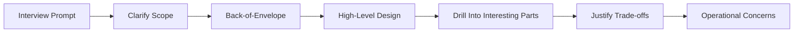
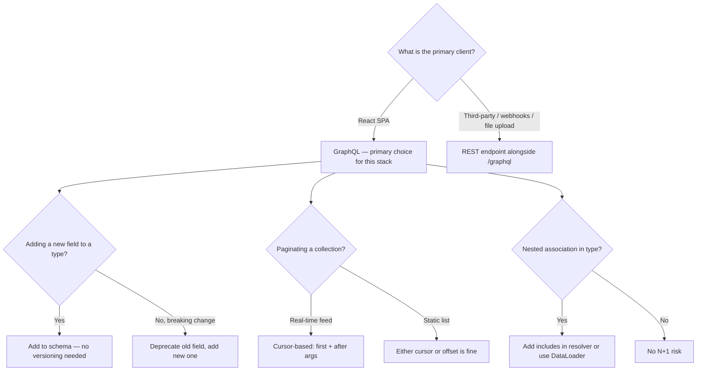

# System Design: API Design, Back-of-Envelope, GraphQL

> **Prerequisites**: Know what HTTP is. Know what a database is. Have read 03-cap-theorem.md and 04-caching-strategies.md in `../system-design/`.
>
> **Companion exercises**: `./05-system-design-api-graphql/`
>
> **Goal**: Learn to open a system design conversation with confidence — clarify, estimate, then design. Understand API choices deeply enough to justify them under pressure.

---

## 1. Overview

A system design interview is not a quiz. There is no single right answer. What the interviewer is evaluating is: do you know how to think about a system? Do you ask the right questions before drawing boxes? Can you justify every decision?

The biggest mistake is picking up a marker and drawing boxes immediately. The most impressive thing you can do is slow down, ask three good questions, do a quick napkin calculation, and *then* start designing — because now your design is grounded in reality.

This guide covers three interconnected skills:
1. **Opening a system design conversation** — what to ask and what to calculate
2. **REST API design** — how to design clean, safe, scalable endpoints
3. **GraphQL schema design** — when to choose it and how to design it well

---

## 2. Core Concept & Mental Model

### The Architect Analogy

A building architect doesn't start drawing walls when a client says "I need a building." They ask: How many people will use it? What will they do inside? What's the budget? What are the load-bearing requirements? Only then do they sketch.

You're the architect. The interview prompt is the client brief. Your questions are the requirements gathering. Your back-of-envelope is the structural engineering. Your diagram is the blueprint.



---

## 3. Building Blocks — Progressive Learning

### Level 1: Clarifying Questions — The Right First Move

**Why this level matters**

Designing for 1,000 users and 1,000,000 users are completely different problems. A system for 1,000 users can run on a single server. A system for 1,000,000 needs a load balancer, cache layer, and potentially a read replica. If you start drawing boxes without clarifying, you might solve the wrong problem.

**How to think about it**

Every system has two dimensions you must clarify: **scale** and **consistency**. Scale tells you what infrastructure you need. Consistency tells you which databases and caching strategies are appropriate.

**Walking through it**

```
Interviewer: "Design a blog platform."

Wrong first move:
  [picks up marker]
  "OK so we have users and posts..."

Right first move:
  "Before I start, I want to make sure I design for the right constraints.
   A few questions:

   Scale:
   - How many users are we targeting? 10K, 1M, 100M?
   - Is this read-heavy or write-heavy? (blogs tend to be 10:1 read:write)
   - What's the expected peak QPS?

   Consistency:
   - How fresh does content need to be? Is eventual consistency OK for posts?
   - Any real-time requirements (live comments, notifications)?

   Scope:
   - Are we designing the whole system or focusing on one component?
   - Should I cover auth, or can we treat that as given?"
```

**The one thing to get right**

You're not stalling — you're demonstrating that you understand that scale and consistency requirements drive all subsequent decisions. A good interviewer will appreciate 60 seconds of questions. A great candidate will reference those answers throughout the design.

> **Mental anchor**: "Scale determines infrastructure. Consistency determines database and cache choices. Scope determines how deep to go."

---

**→ Bridge to Level 2**: Once you know the scale, you need to quantify it. "1 million users" is abstract. "1,200 writes/second at peak" is something you can design for.

### Level 2: Back-of-Envelope Calculations — Making Scale Concrete

**Why this level matters**

Back-of-envelope calculations prove you understand the real-world implications of scale. "We'll have a lot of users" is not useful. "We need to handle 15,000 reads/second at peak, which requires at least 15 app servers or heavy caching" gives you something to design around.

**How to think about it**

You're not computing exact numbers — you're getting the right *order of magnitude*. Is this 10 queries/second or 10,000? That's the question. You need to know whether to reach for a single server or a distributed system.

**Numbers to keep in your head:**

```
Latency:
  In-memory (Redis):       ~1ms
  SSD (DB query, simple):  ~10ms
  Complex DB query:        ~50-100ms
  Across network (region): ~150ms

Throughput (single server, typical Rails app):
  Simple requests:  ~1,000 req/sec
  DB-heavy:         ~100-300 req/sec
  Redis:            ~100,000 req/sec

Storage:
  1 tweet / short text:    ~500 bytes
  1 photo (compressed):    ~300 KB
  1 minute of video (720p):~60 MB

Time:
  1 day =  86,400 seconds  (~100K for easy math)
  1 year = 31.5M seconds   (~30M for easy math)
```

**Walking through an estimate:**

```
"Design Twitter" — storage estimate:

Assumptions (ask or state):
  100M tweets per day
  Each tweet: 280 chars + metadata ≈ 500 bytes
  10% have an image: 10M images/day @ 300KB each

Text storage per day:
  100M * 500B = 50GB/day

Image storage per day:
  10M * 300KB = 3TB/day

Per year:
  Text:   50GB  * 365 ≈ 18TB/year
  Images: 3TB   * 365 ≈ 1PB/year

QPS (peak = 3x average):
  100M tweets/day / 86,400 = ~1,150 writes/sec avg
  Peak writes: ~3,500/sec

Read QPS (10:1 read:write):
  Avg reads: ~11,500/sec
  Peak reads: ~35,000/sec
```

**Saying it out loud in an interview:**

> "Let me do a quick back-of-envelope. Assuming 100 million tweets per day, that's about 1,150 writes per second on average, and maybe 3,500 at peak with 3x multiplier. For storage, each tweet at ~500 bytes puts us at about 50GB of text per day — that's manageable. But images are 3TB per day, so we're talking petabytes of storage at scale. This tells me we need distributed storage — S3 — not local disk. And for read QPS at 35,000/sec, a single database server tops out at maybe 1,000 complex reads/sec, so we need aggressive caching."

> **Mental anchor**: "QPS = daily events / 100,000. Peak = 3x average. Storage = count * size. Order of magnitude is what matters."

---

**→ Bridge to Level 3**: You've clarified scope and estimated scale. Now you design the API. For this stack (Rails + GraphQL + React), GraphQL is the primary choice — but you need to understand REST deeply enough to justify that decision and to know when REST is still the right call.

### Level 3: REST API Design — Know It to Justify GraphQL

**Why this level matters**

Interviewers will ask "why GraphQL over REST?" You can't answer that confidently without understanding REST's strengths and limitations. They also want to see REST depth — pagination strategy, versioning, error format, rate limiting — because these concepts translate directly into GraphQL design decisions.

**How to think about it**

REST maps URLs (resources) to HTTP verbs (operations). Well-designed REST feels obvious to the consumer: the URL names tell you what you're working with, the verb tells you what you're doing.

**Walking through the design decisions:**

**Resource naming: nouns, not verbs**

```
BAD:  POST /createPost       (verb in URL)
BAD:  GET  /getUser?id=5     (redundant verb + query param for ID)

GOOD: POST /posts            (create a post)
GOOD: GET  /users/5          (get user 5)
GOOD: GET  /users/5/posts    (get user 5's posts — nested resource)
```

**Pagination: when offset fails**

```ruby
# Offset-based (simple, breaks on real-time feeds)
GET /posts?page=2&per_page=25

Problem: if 3 new posts are added between page 1 and page 2,
you see 3 duplicate items (they shifted). Fine for static data.
Bad for feeds.

# Cursor-based (stable for moving feeds)
GET /posts?after=post_id_xyz&limit=25

The cursor is opaque — clients don't parse it. You update it.
No duplicates on inserts. This is how Twitter/Instagram do it.
```

**Versioning:**

```ruby
# URL versioning (most common, most explicit)
GET /api/v1/posts
GET /api/v2/posts  # breaking change? add v2, don't touch v1

# The rule: never break existing clients.
# Deprecate v1 with a Sunset header after v2 is stable:
# Sunset: Sat, 31 Dec 2024 23:59:59 GMT
```

**Error format:**

```json
# Consistent error shape — clients can always parse it the same way
{
  "error": {
    "code": "validation_failed",
    "message": "Title can't be blank",
    "field": "title"
  }
}

# Validation errors (422):
{
  "errors": [
    { "field": "title", "message": "can't be blank" },
    { "field": "body",  "message": "is too short" }
  ]
}
```

**Rate limiting:**

```
Headers to return on every request:
  X-RateLimit-Limit:     1000      (max requests per window)
  X-RateLimit-Remaining: 847       (remaining in this window)
  X-RateLimit-Reset:     1704067200 (unix timestamp when window resets)

When over limit (429 Too Many Requests):
  Retry-After: 3600
```

> **Mental anchor**: "Nouns in URLs. Verbs as HTTP methods. Cursor pagination for feeds. Version with /v1/. Consistent error shape. Rate limit with standard headers."

---

**→ Bridge to Level 4**: REST defines a fixed shape per endpoint. GraphQL lets the client declare exactly what it needs — and for a React frontend with diverse data requirements, that flexibility is the key reason to choose it.

### Level 4: GraphQL — The Primary Choice for This Stack

**Why this level matters**

This stack uses GraphQL as its API layer. Interviewers want to see that you can design a schema confidently, explain *why* GraphQL is the right call here, and handle the hard parts — especially the GraphQL version of the N+1 problem.

**How to think about it**

REST has one shape per endpoint: `GET /posts` always returns the same fields. GraphQL lets the client declare exactly what it needs:

```graphql
query {
  post(id: "5") {
    title          # just these fields
    author {
      name         # and this nested field
    }
  }
}
```

This eliminates over-fetching (getting 20 fields when you need 3) and under-fetching (having to make 3 API calls to get data that should come together).

**Why GraphQL is the right fit for Rails + React:**

```
This stack's specific reasons:
  ✓ React components declare exactly what they need — no over-fetching
  ✓ Single endpoint (POST /graphql) — no route proliferation
  ✓ Typed schema = self-documenting contract between Rails and React
  ✓ Add new fields without versioning — React opts in by updating its query
  ✓ Eliminate round trips — fetch post + author + comments in one request

Still reach for REST when:
  - File uploads (use a dedicated REST endpoint alongside /graphql)
  - Public third-party API (REST is more universally understood)
  - Webhooks / callbacks from external services (always REST)
  - Simple one-shot integrations where GraphQL overhead isn't justified
```

**Schema design:**

```graphql
# Types represent your domain objects
type Post {
  id: ID!           # ! means required, never null
  title: String!
  body: String!
  published: Boolean!
  author: User!     # nested type — this is where N+1 lurks
  comments(first: Int, after: String): CommentConnection!
  createdAt: String!
}

type User {
  id: ID!
  name: String!
  email: String!
  posts(first: Int): PostConnection!
}

# Queries (reads)
type Query {
  post(id: ID!): Post
  posts(first: Int, after: String, published: Boolean): PostConnection!
  me: User   # current authenticated user
}

# Mutations (writes) — always take input objects, return payload objects
type Mutation {
  createPost(input: CreatePostInput!): CreatePostPayload!
  updatePost(id: ID!, input: UpdatePostInput!): UpdatePostPayload!
}

input CreatePostInput {
  title: String!
  body: String!
  published: Boolean
}

type CreatePostPayload {
  post: Post           # the created post, null if failed
  errors: [String!]!   # empty on success, messages on failure
}
```

**The N+1 problem in GraphQL:**

```
Query:
  posts {
    title
    author {       <- each post resolver calls User.find(post.user_id)
      name         <- N queries for N posts
    }
  }

This fires: 1 query for posts + N queries for users = N+1

Fix: batch loading (DataLoader pattern)
  Collect all user_ids requested across all post resolvers
  Fire ONE query: User.where(id: [1,2,3,...])
  Map results back to each post

# In Ruby: graphql-batch gem
class UserByIdLoader < GraphQL::Batch::Loader
  def perform(user_ids)
    User.where(id: user_ids).each { |u| fulfill(u.id, u) }
    user_ids.each { |id| fulfill(id, nil) unless fulfilled?(id) }
  end
end
```

> **Mental anchor**: "GraphQL: client asks for exactly what it needs. Schema = types + queries + mutations. N+1 in resolvers = dataloader batch. Input types for mutations, payload types for results."

---

## 4. Decision Framework



---

## 5. Common Gotchas

**1. Offset pagination on high-traffic feeds**

`OFFSET 10000 LIMIT 25` forces the database to scan and discard 10,000 rows. For feeds that update frequently, this is also wrong semantically — posts shift. Use cursor-based pagination for feeds.

**2. Forgetting to version breaking changes**

Removing a field or changing its type in REST without versioning breaks all existing clients. The rule: add, don't change. If you must change, version.

**3. GraphQL over-fetching prevention vs REST over-fetching**

The whole point of GraphQL is that clients ask for what they need. If you're defining resolvers that always return everything, you've lost the benefit. Make resolvers lazy — only load nested data when requested.

**4. N+1 in GraphQL resolvers is the most common GraphQL bug**

Every resolver that loads a `belongs_to` association without batching creates an N+1. Always reach for the DataLoader pattern when building production GraphQL.

**5. Not returning errors in GraphQL mutations**

GraphQL mutations return HTTP 200 even on "business logic" failures (validation errors). The errors array in the payload type is how clients know something went wrong. Always include `errors: [String!]!` in every mutation payload.

---

## 6. Practice Scenarios

- [ ] "Design the API for a blog platform." Clarify, estimate, then design. What do you ask first?
- [ ] "1 million users, 10:1 read:write, posts can be cached for 5 minutes." Estimate peak QPS and decide if caching is necessary.
- [ ] "Mobile apps need only title+author but web needs title+body+comments+tags." REST or GraphQL? Why?
- [ ] "GET /api/v1/posts?user_id=5&status=published&order=recent — paginate this."  Offset or cursor? How do you return pagination metadata?
- [ ] "Design a GraphQL schema for posts and authors." Design types, query, mutation. Where would the N+1 appear?

**Companion exercises**: Run `ruby 05-system-design-api-graphql/level-1-back-of-envelope.rb` to practice calculations, then levels 2 and 3.
