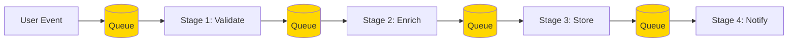
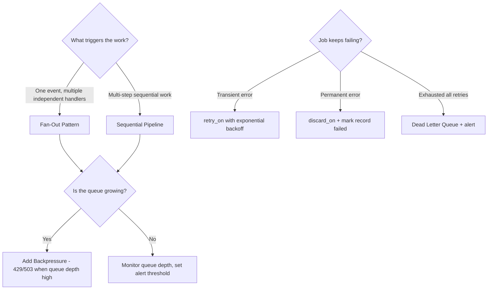

# Scalable Pipelines: System Design Principles

> **Prerequisites**: Read 03-background-jobs.md. Understand what a queue is.
>
> **Companion exercises**: `./06-scalable-pipelines/`
>
> **Goal**: Understand how to move from "one job does everything" to "a chain of small, decoupled, observable stages" — and be able to explain why at every step.

---

## 1. Overview

A background job that does everything is a single point of failure. If it crashes halfway through, you don't know which steps completed. If it's slow, everything it does is slow. If one part fails, it takes the whole thing down.

A scalable pipeline is the opposite: a chain of small, focused stages. Each stage does one thing, hands off to the next, and can fail and retry independently. The failure of stage 3 doesn't undo stage 1 and 2. The slowness of stage 4 doesn't slow down stages 1–3.

This guide is about the five patterns that make pipelines robust at scale — and the vocabulary to explain them in a system design interview.

---

## 2. Core Concept & Mental Model

### The Assembly Line Analogy

An assembly line is a pipeline. Raw materials enter at one end. A worker at each station does exactly one job (weld, paint, inspect). The finished product exits at the other end.

If the painting station breaks, the welding station keeps running (buffer builds up, but work doesn't stop). When painting is fixed, it drains the buffer and catches up. Each station is independently scalable — if painting is the bottleneck, add a second painter.

Your data pipeline should work the same way.



The queues between stages are the buffers that allow independent operation and scaling.

---

## 3. Building Blocks — Progressive Learning

### Level 1: Fan-Out — One Event, Many Consumers

**Why this level matters**

The most common pipeline question is: "When user X does Y, we need to update A, B, and C." Fan-out is the answer. Instead of one big job that does A, B, and C sequentially, you fire one event and three independent jobs each handle one thing. If B fails, A and C still complete.

**How to think about it**

**Analogy**: A starting gun at a race. One shot fires, and 10 runners each start running their own lane. The runners don't know about each other. They run independently.

The key insight: the *producer* (the gun) doesn't know about the *consumers* (the runners). It just fires the event and walks away. This is decoupling.

**Walking through it**

```
User signs up
   |
   v
Event: "user.created" with payload { user_id: 123 }
   |
   +---> WelcomeEmailJob.perform_later(123)
   +---> SlackNotifyJob.perform_later(123)
   +---> SearchIndexJob.perform_later(123)
   +---> AnalyticsJob.perform_later(123)

Each job runs independently.
If SearchIndexJob fails and retries 3 times, WelcomeEmail is already sent.
Failure is isolated.
```

```ruby
# Simple Rails fan-out via after_commit
class User < ApplicationRecord
  after_create_commit :fan_out

  private

  def fan_out
    WelcomeEmailJob.perform_later(id)
    SlackNotifyJob.perform_later(id)
    SearchIndexJob.perform_later(id)
    AnalyticsJob.perform_later(id)
  end
end

# Better at scale: publish to a message bus, let consumers subscribe
# Pub/Sub (AWS SNS, Kafka, Redis Pub/Sub)
class User < ApplicationRecord
  after_create_commit do
    EventBus.publish("user.created", user_id: id)
    # Each subscriber registers independently — producer doesn't know who
  end
end
```

**The one thing to get right**

Fan-out assumes the jobs are **independent**. If job B needs the result of job A, that's not fan-out — that's a pipeline (Level 2). Fan-out is for parallel, independent work.

**Trade-offs to mention:**

```
+ Each consumer is isolated — failure doesn't cascade
+ Each consumer scales independently (more email workers if email is slow)
+ Adding a new consumer requires no change to the producer
- Eventual consistency — all consumers will finish, but not at the same time
- Harder to observe — 4 jobs instead of 1 (use monitoring on each)
- If jobs must happen in a specific order, fan-out is the wrong pattern
```

> **Mental anchor**: "Fan-out = one event, N independent jobs. Producer fires and forgets. Failure is isolated to one consumer. Use when jobs are parallel and independent."

---

**→ Bridge to Level 2**: Fan-out is for parallel work. But some work has natural sequential dependencies: step 2 needs the result of step 1. That's the pipeline pattern.

### Level 2: Sequential Pipeline — Handing Off Between Stages

**Why this level matters**

A common interview scenario: "User uploads a video. We need to transcode it, generate a thumbnail, update the DB, and notify followers. How do you do this?" This is a sequential pipeline — each step depends on the previous one's output.

**How to think about it**

Each step is a separate job that, on success, enqueues the next step. On failure, it retries. The current state of the pipeline is visible in the job queue and in the record's `status` field.

**Walking through it**

```
Upload received
   |
   v
Job 1: ValidateVideoJob(upload_id)
  -> If invalid: mark upload as failed, stop
  -> If valid: enqueue TranscodeJob(upload_id)
   |
   v
Job 2: TranscodeJob(upload_id)
  -> Transcodes the video
  -> On success: enqueue ThumbnailJob(upload_id)
  -> On failure: retry 3x, then mark as failed, alert
   |
   v
Job 3: ThumbnailJob(upload_id)
  -> Generates thumbnail
  -> On success: enqueue NotifyFollowersJob(upload_id)
   |
   v
Job 4: NotifyFollowersJob(upload_id)
  -> Sends notifications
  -> Marks upload as complete
```

```ruby
class ValidateVideoJob < ApplicationJob
  def perform(upload_id)
    upload = VideoUpload.find(upload_id)

    unless valid_format?(upload)
      upload.update!(status: :invalid, error: "unsupported format")
      return  # stop the pipeline here
    end

    upload.update!(status: :validated)
    TranscodeJob.perform_later(upload_id)  # hand off to next stage
  end
end

class TranscodeJob < ApplicationJob
  retry_on TranscodeError, wait: :exponentially_longer, attempts: 5

  def perform(upload_id)
    upload = VideoUpload.find(upload_id)
    result = VideoTranscoder.process(upload.s3_key)
    upload.update!(transcoded_key: result.key, status: :transcoded)
    ThumbnailJob.perform_later(upload_id)
  end
end
```

**The one thing to get right**

Each stage must update the record's status. If the pipeline breaks, you need to know *which stage* failed to retry from that point — not restart from scratch.

**Interview phrase:**

> "I'd model this as a pipeline of jobs, each stage handing off to the next on success. Each stage is small, testable, and independently retryable. The record's status field tracks where we are. A monitoring dashboard on the Sidekiq queue tells me if any stage is backed up."

> **Mental anchor**: "Sequential pipeline = each job triggers the next. Status field tracks progress. Failure is isolated to the failing stage."

---

**→ Bridge to Level 3**: Your pipeline handles one event at a time. But what when you have more events than your workers can process? You need to understand backpressure — and what happens without it.

### Level 3: Backpressure — What Happens When Producers Are Faster Than Consumers

**Why this level matters**

No system design is complete without thinking about what happens at the breaking point. If your API accepts 10,000 requests/second but your workers only process 1,000/second, the queue grows by 9,000 per second. In 10 minutes: 5.4M jobs backed up. In 1 hour: your Redis crashes.

Backpressure is the mechanism that prevents this: you signal producers to slow down when the system is overwhelmed.

**How to think about it**

**Analogy**: A highway on-ramp signal. When the highway is busy, the signal turns red. Cars wait on the ramp. The highway doesn't jam. The signal applies *backpressure* to the ramp.

Your API is the highway. The queue is the ramp. When the queue is too long, start returning 429/503 to slow producers.

**Walking through it**

```
Without backpressure:
  t=0:  queue has 0 jobs, 10 workers
  t=1m: 50K requests/min, workers process 10K/min -> 40K/min net growth
  t=5m: queue has 200K jobs, workers falling behind
  t=10m: Redis OOM, Sidekiq crashes, all jobs lost

With backpressure:
  Queue depth > 10K -> API returns 429 "System busy, retry in 30 seconds"
  Queue depth drops -> API resumes accepting requests
  Workers process at their actual capacity
  No queue explosion
```

```ruby
class PostsController < ApplicationController
  QUEUE_LIMIT = 10_000

  def create
    if Sidekiq::Queue.new("default").size > QUEUE_LIMIT
      render json: { error: "System busy", retry_after: 30 },
             status: :service_unavailable
      return
    end

    post = current_user.posts.create!(post_params)
    ProcessPostJob.perform_later(post.id)
    render json: { id: post.id }, status: :accepted
  end
end
```

**The one thing to get right**

Backpressure is a circuit breaker, not a perfect solution. Implement it with monitoring: "queue depth > X" should alert before it triggers user-facing 429s.

> **Mental anchor**: "Queue depth is your health metric. When it grows unboundedly, producers are faster than consumers. Backpressure = slow the producers. Monitor before it hits users."

---

**→ Bridge to Level 4**: Your pipeline is decoupled and protected from overload. The last piece: what happens to jobs that fail repeatedly?

### Level 4: Dead Letter Queue — When Jobs Exhaust Their Retries

**Why this level matters**

A job that fails 5 times is communicating something important. Maybe there's a bug. Maybe the data is in an invalid state. Maybe a third-party API changed. You need to know about it — immediately, not when a customer calls.

**How to think about it**

**Analogy**: The post office's undeliverable mail bin. After several failed delivery attempts, the letter goes to a special bin. A postal worker reviews it and decides what to do. It's not thrown away — it's held for human review.

```ruby
class ImportDataJob < ApplicationJob
  # Retry on temporary failures (network, timeout)
  retry_on Net::TimeoutError, Errno::ECONNREFUSED,
           wait: :exponentially_longer, attempts: 5

  # Permanent failure (bad data, missing record) — don't retry, discard
  discard_on ActiveRecord::RecordNotFound
  discard_on CSV::MalformedCSVError do |job, error|
    # Log the discard with context so we can investigate
    Rails.logger.error("ImportDataJob discarded: #{error.message}")
    import = DataImport.find_by(id: job.arguments.first)
    import&.update!(status: :failed, error_message: error.message)
  end

  # After all retries exhausted -> dead job -> notify humans
  sidekiq_retries_exhausted do |msg, ex|
    import_id = msg["args"].first
    import = DataImport.find_by(id: import_id)
    import&.update!(status: :dead, error_message: ex.message)
    PagerDuty.trigger("job_dead", job: "ImportDataJob", id: import_id)
  end

  def perform(import_id)
    import = DataImport.find(import_id)
    import.process!
  end
end
```

**The two types of failures:**

| Failure type | Example | Response |
|---|---|---|
| Transient | Network timeout, DB lock | Retry with backoff |
| Permanent | Record deleted, bad CSV | Discard + mark failed |

> **Mental anchor**: "retry_on = might work next time. discard_on = will never work. Dead queue = alert + investigate. Never silently discard without logging."

---

## 4. Decision Framework



---

## 5. Observability — What Interviewers Want to Hear

System design conversations at senior level always end with: "How would you operate this in production?"

```
Metrics to track:
  Queue depth per queue  <- growing = bottleneck
  Job latency (p50/p95)  <- rising = slowdown
  Error rate per job type <- spiking = investigate
  Throughput (jobs/sec)   <- dropping = capacity issue

Alerts:
  Queue depth > 10K for 5 min     -> page on-call
  Error rate > 1% for 10 min      -> page on-call
  Job not consumed in > 30 min    -> worker crashed?
  Dead queue count increasing      -> systematic failure

Dashboard:
  Sidekiq Web UI for development
  Datadog / New Relic for production metrics
  Sentry for error tracking (capture job failures with context)
```

**Interview phrase:**

> "I'd instrument queue depth, job duration, and error rate. A growing queue is the first sign of a bottleneck — usually workers are undersized or there's a slow external dependency. I'd set an alert on queue depth before it reaches user-visible levels. Dead jobs would trigger a PagerDuty alert so we investigate before customers notice."

---

## 6. Common Gotchas

**1. One big job instead of a pipeline**

A job that does 10 things is fragile. If step 7 fails, steps 1–6 are wasted. Split into stages, each handoff creates a checkpoint.

**2. Fan-out when steps are dependent**

"Send email AND update search index AND charge user" looks like fan-out but the charge must happen before the email (you don't email about a successful payment until the payment succeeds). Use pipeline for dependent steps.

**3. Not monitoring queue depth**

You'll find out the queue exploded when customers complain. Set up a CloudWatch/Datadog alert on queue size before that happens.

**4. Swallowing all exceptions in jobs**

```ruby
# BAD: hides bugs
def perform(id)
  DoSomething.call(id)
rescue => e
  nil  # silent failure
end

# GOOD: re-raise so Sidekiq retries and eventually alerts
def perform(id)
  DoSomething.call(id)
rescue ExpectedError => e
  mark_failed(id, e.message)  # handle expected errors explicitly
  # let unexpected errors bubble up to Sidekiq's retry/dead mechanism
end
```

**5. Infinite retry with no dead letter**

Without a dead letter queue, a job that always fails retries forever, consuming worker capacity. Always set `retry: N` (not unlimited) and configure `retries_exhausted`.

---

## 7. Practice Scenarios

- [ ] "When a user publishes a post, notify followers, update the search index, and log analytics." Design the fan-out. What happens if the search index is down?
- [ ] "A video upload must be validated, transcoded, and thumbnailed before the user can share it." Design the sequential pipeline. Where does failure state live?
- [ ] "Your job queue has 500K jobs backed up and workers are at 100% CPU." What do you check first? What do you add?
- [ ] "A charge job fails every time because the customer's card expired." Should it retry? Should it go to DLQ? What do you do with it?
- [ ] "You have a nightly report job and real-time notification jobs in the same queue. Reports take 10 minutes each." What's the problem? How do you fix it?

**Companion exercises**: Run `ruby 06-scalable-pipelines/level-1-patterns.rb` to classify scenarios by pipeline pattern, then level 2 for observability metrics.
