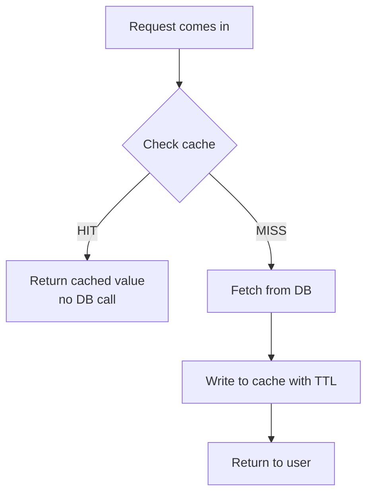
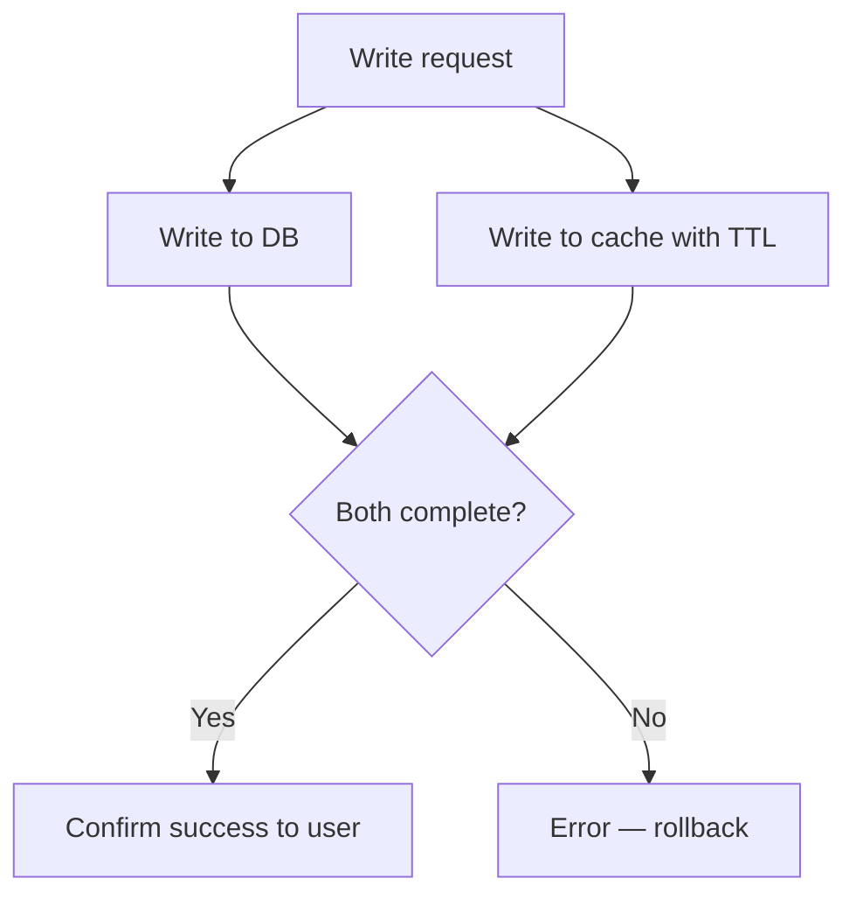
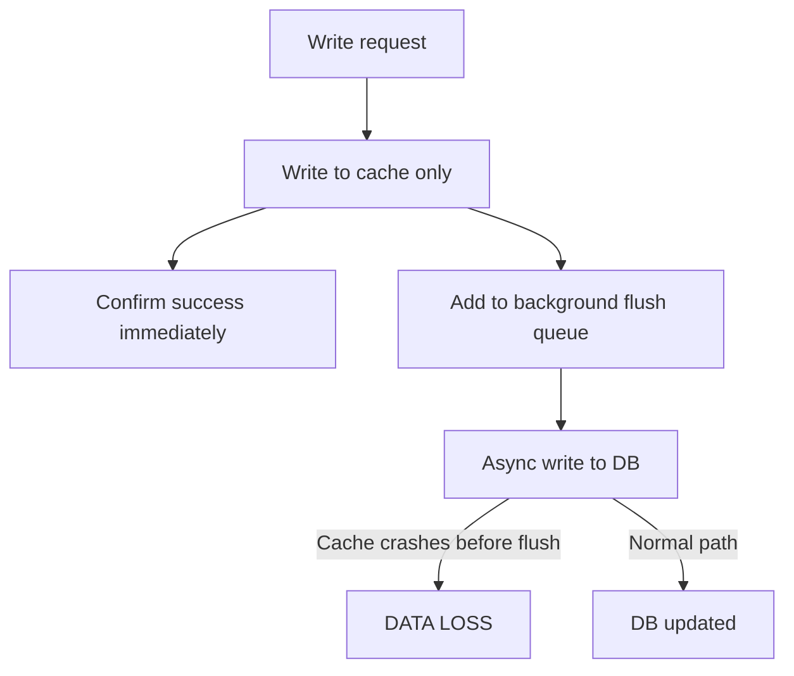
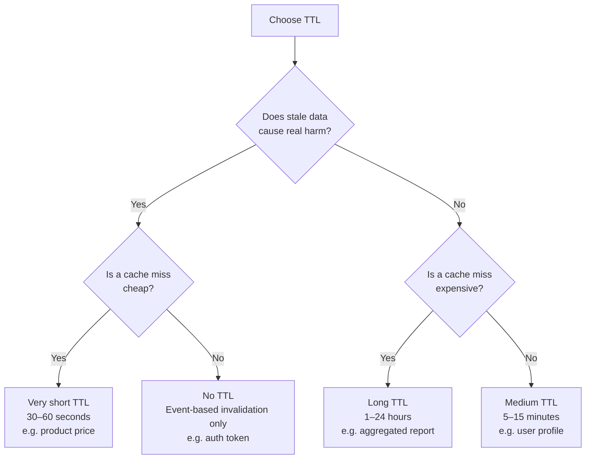
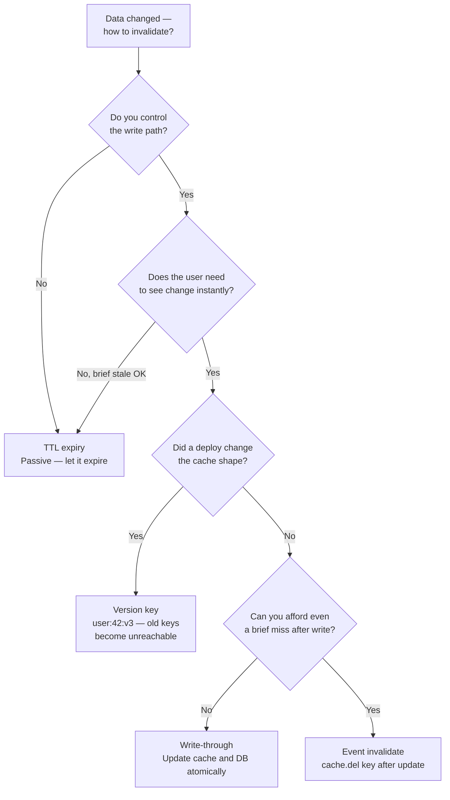
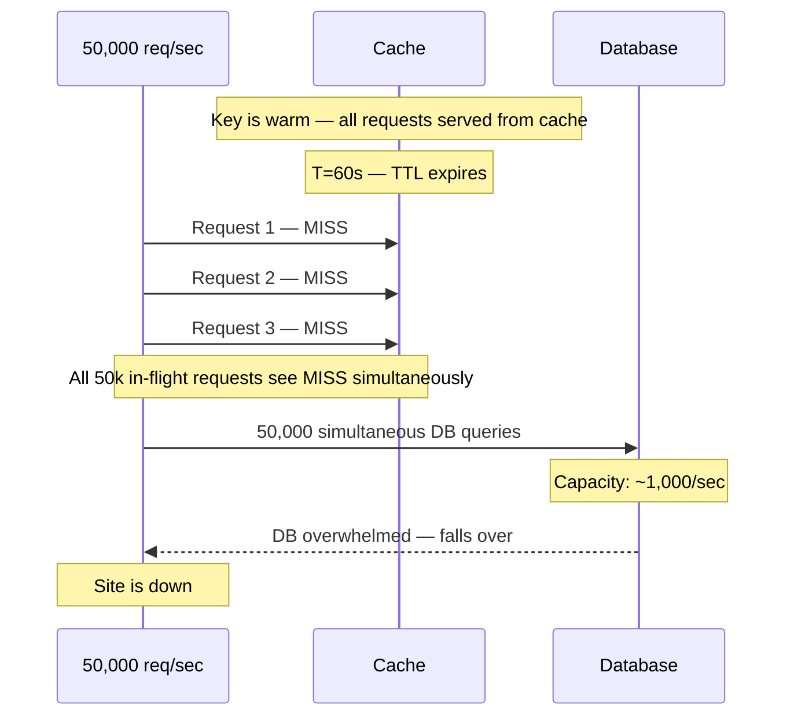
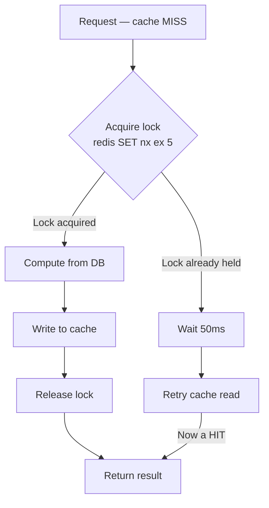
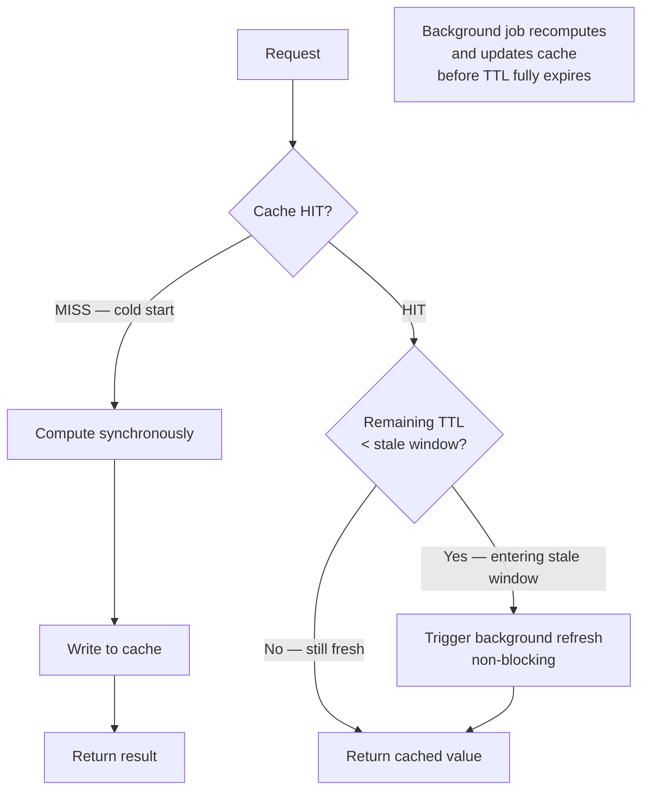
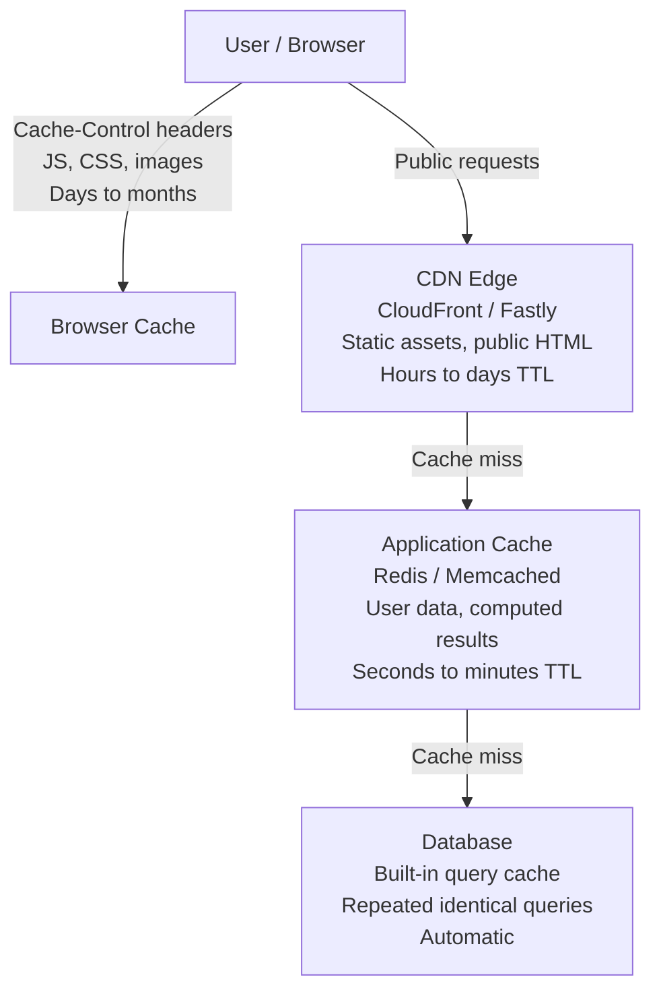
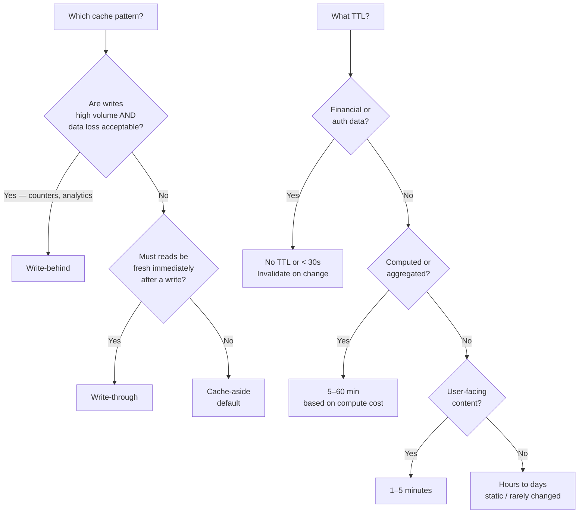

# Caching Concepts: Patterns, TTL, Invalidation, and Failure Modes

> **Goal**: Choose the right cache pattern for each use case, set defensible TTLs, design invalidation strategies, and handle the hard cases — stampede and eviction — without the system falling over.
>
> **Companion exercises**: `level-1-cache-patterns.rb`, `level-2-ttl-and-invalidation.rb`, `level-3-stampede-prevention.rb`

---

## 1. Overview

Caching is the highest-leverage performance tool in distributed systems. A Redis node handles ~100,000 requests/second. A PostgreSQL primary with complex queries handles ~1,000/second. If your system needs 10,000 reads/second, the math is clear: cache or pay for a fleet of database replicas.

But caching introduces its own complexity. Stale data. Cache invalidation. The thundering herd. Eviction under memory pressure. These are not edge cases — they're the normal operating conditions of any high-traffic system. This module builds the vocabulary and decision framework to handle all of them.

---

## 2. Core Concept & Mental Model

### The Library Desk Analogy

Imagine a librarian (your app) who fetches books (data) from a warehouse (your database) far away. Trips to the warehouse are slow and expensive.

**Cache-aside**: The librarian keeps a local shelf. When asked for a book, they check the shelf first. If it's there, they hand it over immediately. If not, they go to the warehouse, bring it back, put it on the shelf, and hand it over. Next time: instant.

**Write-through**: Whenever the librarian updates a book, they update *both* the shelf copy AND the warehouse simultaneously before confirming the update is done. The shelf is always in sync. Every write is slower, but reads are always fast.

**Write-behind**: The librarian updates the shelf immediately and tells you it's done. The warehouse update happens later, in the background. Very fast updates. But if the shelf burns down before the warehouse is updated — that information is gone.

---

## 3. Building Blocks — Progressive Learning

### Level 1: The Three Cache Patterns

**Why this level matters**

Naming a cache pattern is table stakes. The real skill is knowing *which failure mode is acceptable for your data* — and picking the pattern whose failure mode matches. Each pattern fails differently. You're choosing which failure you can live with.

---

#### The decision before you look at any pattern

Ask these three questions in order:

```
1. Can this data be lost on write?
   (counters, likes, analytics — nobody is harmed if a few writes disappear)
   → YES: Write-behind

2. Will users be harmed if they see stale data immediately after their own write?
   (settings page still shows old email, dashboard shows old balance)
   → YES: Write-through

3. Everything else → Cache-aside (the safe default)
```

The patterns below are the implementations of those three answers.

---

#### Cache-aside (lazy loading)

**Mental model**: The cache is a shortcut, not a guarantee. Your DB is always the source of truth. The cache only holds what has actually been asked for — nothing is pre-populated. If it's there, use it. If not, go get it and put it there for next time.



```ruby
def get_user(id)
  cached = redis.get("user:#{id}")
  return JSON.parse(cached) if cached

  user = User.find(id)                              # DB call only on miss
  redis.setex("user:#{id}", 300, user.to_json)      # cache for 5 min
  user
end
```

**Pros**
- Cache only holds data that's actually been requested — no wasted memory on unread data
- DB is always the fallback — cache failure degrades gracefully, never corrupts
- Simple: no coupling between writes and cache state

**Cons — and why they matter**
- **First miss is always slow**: Every new key, every TTL expiry, every deploy flush = a DB call. At high traffic, many simultaneous misses on the same key = stampede (see Level 3).
- **External writes cause invisible staleness**: If anything updates the DB outside your app (cron jobs, migrations, another service, a direct SQL fix), your cache doesn't know. It will serve the stale version until TTL expires — silently, with no error.
- **Cold start after deploy**: If you flush cache on deploy, your first wave of traffic hits the DB entirely cold. At scale, this can take down a DB.

**Pick this when**: General-purpose read caching where the acceptable staleness window is clear. User profiles, blog posts, product descriptions, search results. The data your app reads far more than it writes.

---

#### Write-through

**Mental model**: You pay for reads with writes. Every write is slower because you're updating both the DB and the cache at the same time — but in return, reads are always fast and never stale from your own app's writes. You're making a deliberate trade: write latency for read freshness.



```ruby
def update_user(id, attributes)
  user = User.find(id)
  user.update!(attributes)                          # DB write
  redis.setex("user:#{id}", 300, user.to_json)      # cache write — both before returning
  user
end
```

**Pros**
- Cache is always warm after first write — no cold miss on the next read
- No stale data from your app's own writes — the cache reflects exactly what the DB has

**Cons — and why they matter**
- **Write latency = DB time + cache time**: Your P99 write latency is now the sum of both. Under load, this compounds. If cache is slow, all writes are slow.
- **Wasted memory on write-heavy, read-light paths**: Every write populates the cache, even for data that will never be read. A background job that updates 100k records fills your cache with 100k entries nobody asks for.
- **Consistency risk on partial failure**: If the DB write succeeds but the cache write fails (or vice versa), you have a split-brain problem. You need a rollback strategy, which adds complexity.

**Pick this when**: Data that is written and then immediately re-read — user settings pages, profile updates, financial dashboards. Any path where "I saved it, why doesn't it show my change?" is an unacceptable user experience.

---

#### Write-behind (write-back)

**Mental model**: You're optimizing for write throughput above all else, and you're willing to accept that the DB may lag behind — sometimes significantly. The cache absorbs the writes instantly; the DB catches up in the background. The risk is not staleness — it's data loss if the cache dies before the flush completes.



**Pros**
- Writes are the fastest possible — only one in-memory operation in the hot path
- DB gets batched bulk writes instead of individual queries — better DB throughput
- Can absorb massive write spikes without overwhelming the DB

**Cons — and why they matter**
- **Data loss window**: Anything written to cache but not yet flushed to DB can be lost if the cache node crashes. How much can you lose? That depends on your flush interval. 1 second? 10 seconds? 100k writes/sec × 10 seconds = 1M lost writes on a crash.
- **DB is genuinely stale**: Any query that reads directly from the DB — monitoring, analytics, another service, a support tool — will see old data. This creates invisible inconsistency across your system.
- **Flush mechanism is complex to build correctly**: You need a durable write-ahead log, a reliable queue, crash recovery, and deduplication logic. This is non-trivial. Without it, your "fast writes" are actually "lost writes."

**Pick this when**: High-volume writes where loss of individual records is acceptable. View counters, like counts, leaderboard scores, analytics events, activity logs. **Never for financial transactions, inventory counts, or anything with a unique constraint.**

---

#### Side-by-side: the failure mode you're choosing

| | Cache-aside | Write-through | Write-behind |
|---|---|---|---|
| **You pay cost at** | Read (on miss) | Write (double latency) | Nothing upfront |
| **Failure mode** | Stale reads if DB updated externally | Slow writes; partial failure complexity | Data loss if cache crashes |
| **DB is authoritative?** | Always | Always | No — cache leads |
| **Cache stays warm?** | Only for read keys | Yes, after first write | Yes, always |
| **Safe for financial data?** | Yes | Yes | **No** |
| **Safe for counters/analytics?** | Overkill | Overkill | Yes |

> **Mental anchor**: "Cache-aside = lazy, DB is truth, reads pay the miss cost. Write-through = eager, reads are fast but writes are slow. Write-behind = fire-and-forget, writes are instant but data can be lost. You're not picking a pattern — you're picking which failure mode your data can survive."

---

**-> Bridge to Level 2**: You know which pattern to use. The next question is: how long should the cache entry live, and what happens when the underlying data changes before it expires?

---

### Level 2: TTL and Cache Invalidation

**Why this level matters**

TTL is not a magic number you guess. It's a decision with direct trade-offs: too short and you're hitting the database constantly; too long and users see stale data for an unacceptable window. "How do you choose TTL?" is a real interview question.

---

#### What is TTL?

**TTL (Time-To-Live)** is a number you attach to a cache entry that says: *"this is only valid for N seconds."* When the clock runs out, the entry is automatically deleted from the cache. The next request sees a miss and goes to the database.

```ruby
redis.setex("user:42", 300, user.to_json)   # TTL = 300 seconds (5 minutes)
#                      ^^^
#              key expires in 5 min, then auto-deleted
```

You can also inspect it:

```ruby
redis.ttl("user:42")   # => 247  (seconds remaining)
                        # => -2   (key does not exist)
                        # => -1   (key exists but has NO expiry set)
```

**What TTL is not**: TTL is passive. It doesn't know or care whether the underlying data changed. If a user updates their name at second 1, and the TTL is 300 seconds, the cache will keep serving the old name for another 299 seconds — unless you do something more active about it.

---

#### What is cache invalidation?

**Cache invalidation** is the act of explicitly removing or updating a cache entry *because the underlying data changed* — not waiting for TTL to passively expire it.

```ruby
# After updating a user in the DB, actively invalidate their cache entry
def update_user(id, attributes)
  User.find(id).update!(attributes)   # DB write
  redis.del("user:#{id}")             # explicit invalidation — don't wait for TTL
end
```

Invalidation is *active*. You're telling the cache: "that entry is now wrong, throw it away."

**The two forms:**

| Form | Mechanism | When to use |
|------|-----------|-------------|
| **TTL expiry** | Passive — entry auto-deletes after N seconds | You control the data write path loosely, or brief staleness is acceptable |
| **Explicit delete/update** | Active — `redis.del(key)` or `redis.set(key, new_value)` on every write | You control the write path and users must see changes immediately |

---

#### How TTL and cache invalidation relate

They solve the same problem — stale data — but in different ways:

- **TTL** is the safety net. It guarantees that no entry lives in the cache forever, even if you never explicitly invalidate it. It's your fallback.
- **Cache invalidation** is the precise tool. It cleans up immediately when you know data changed.

In practice, you usually use both together:

```
Set a TTL as a backstop  +  Explicitly delete on write  =  correct data, bounded staleness
```

```
TTL only, no explicit invalidation  =  stale for up to TTL duration after every write
```

```
Explicit invalidation only, no TTL  =  stale forever if a write is ever missed (bug, crash, external update)
```

> **The classic joke**: "There are only two hard problems in computer science: cache invalidation, naming things, and off-by-one errors." The joke lands because explicit invalidation is genuinely hard — you have to know *every place* data can change and ensure *every cache key* that holds that data gets cleaned up. Miss one path and users see stale data with no error, no warning.

The sections below give you the decision tools for both: how to pick the right TTL, and which invalidation strategy to apply to each situation.

---

#### Choosing TTL: the decision tree



#### Reference TTLs — say these in interviews

| Data type | TTL | Notes |
|-----------|-----|-------|
| Static assets (CSS, images) | 24h – 1 year | Invalidate on deploy via content hash |
| Public page HTML | 5–60 minutes | Invalidate on content change |
| User profile data | 5 minutes | |
| Product prices | 30–60 seconds | |
| Session tokens | 15–30 minutes | Match auth timeout |
| Rate limit counters | 60 seconds | Sliding or fixed window |
| Search autocomplete | 10–15 minutes | |
| Homepage feed | 30s – 2 minutes | |

#### Cache invalidation strategies



> **Mental anchor**: "TTL = how stale is OK × how expensive is a miss. Explicit delete on write for data you control. No TTL + event invalidation for auth/security data. Version the key for deploy-time changes."

---

**-> Bridge to Level 3**: TTL creates a ticking clock. When it expires on a high-traffic key, every concurrent request sees a cache miss simultaneously. That's the stampede.

---

### Level 3: Cache Stampede, Eviction, and Where to Cache

**Why this level matters**

The stampede is one of the most dangerous failure modes in distributed systems. It is especially dangerous on popular or viral content — exactly the data with the highest traffic. If you design a caching layer without addressing stampede, you've built a system that fails when you need it most.

#### The cache stampede (thundering herd)



This is NOT a theoretical edge case. It happens on:
- Traffic spikes to viral content (all cached at similar times)
- Deployment cache flushes (all keys deleted at once)
- Marketing campaigns that drive synchronized traffic

---

#### Fix 1: Mutex lock (correct, simple)



```ruby
def get_homepage_feed(user_id)
  key = "feed:#{user_id}"
  cached = redis.get(key)
  return JSON.parse(cached) if cached

  lock_key = "lock:#{key}"
  if redis.set(lock_key, "1", nx: true, ex: 5)    # nx: only if not exists
    begin
      feed = compute_feed(user_id)                 # expensive DB computation
      redis.setex(key, 60, feed.to_json)
      feed
    ensure
      redis.del(lock_key)
    end
  else
    sleep(0.05)
    get_homepage_feed(user_id)                     # retry after brief wait
  end
end
```

**Pro**: Prevents the thundering herd. Simple logic.
**Con**: Waiting requests are blocked. Under very high load, backpressure builds.
**Use**: Moderately-trafficked keys where a brief wait is acceptable.

---

#### Fix 2: Stale-while-revalidate (best for high traffic)



```ruby
def get_with_stale_revalidate(key, ttl, stale_window)
  cached = redis.get(key)
  if cached
    data = JSON.parse(cached)
    remaining_ttl = redis.ttl(key)

    if remaining_ttl < stale_window
      BackgroundRefreshJob.perform_later(key, ttl)  # async, non-blocking
    end

    return data                                      # always return immediately
  end

  # True cold miss — compute synchronously
  data = expensive_compute(key)
  redis.setex(key, ttl, data.to_json)
  data
end

# TTL of 60s, begin background refresh when 10s remain
get_with_stale_revalidate("homepage", 60, 10)
```

**Pro**: Users never wait. Cache is always warm. DB gets one refresh query at a time.
**Con**: Data is served slightly stale during the refresh window.
**Use**: Very high traffic keys where any blocking is unacceptable (homepages, feeds).

---

#### Fix 3: Probabilistic early expiry

```ruby
def get_with_early_expiry(key, ttl, beta = 1.0)
  cached = redis.get(key)
  if cached
    data, expiry = JSON.parse(cached)
    # Probabilistically recompute before actual expiry
    # Higher beta = more aggressive early refresh
    if Time.now.to_f - beta * Math.log(rand) > expiry
      data = recompute_and_cache(key, ttl)
    end
    return data
  end
  recompute_and_cache(key, ttl)
end
```

**Pro**: No thundering herd. No locks. Smooth refresh distribution.
**Con**: Complex math, harder to reason about in production.
**Use**: Academic/theoretical interest — stale-while-revalidate is usually preferred.

---

#### Eviction policies

| Policy | Behavior | Use |
|--------|----------|-----|
| **LRU** (Least Recently Used) | Evict the key not accessed for the longest time | General-purpose caches, sessions, object caches |
| **LFU** (Least Frequently Used) | Evict the key accessed fewest times overall | Content caches where viral/popular items must stay warm |
| **volatile-ttl** | Evict the key with the shortest remaining TTL | Mixed-TTL caches where short-lived keys should go first |
| **noeviction** | Return errors when memory is full | When eviction would cause worse problems than an error |

```
Redis config:
  allkeys-lru       → general app cache
  allkeys-lfu       → content/popularity-based cache
  volatile-ttl      → mixed TTL pool
  noeviction        → distributed lock store
```

---

#### Where to cache



**Decision rule**:
- Public and static? → CDN
- User-specific or computed? → Application cache (Redis)
- Asset with a content hash? → Browser cache with long TTL
- Repeated identical SQL? → DB cache handles it; don't duplicate

> **Mental anchor**: "Stampede = mutex or stale-while-revalidate. LRU for general caches, LFU for popularity-based. CDN for static/public. Redis for per-user/computed. Match the layer to the data's access pattern."

---

## 4. Decision Framework



**Stampede risk?**
Traffic > 1,000 req/sec on any single key AND TTL expiry is possible → address it.
Fix: stale-while-revalidate for high-traffic keys; mutex for moderate traffic.

---

## 5. Common Gotchas

**1. Caching mutable joins**

Caching `Post.includes(:user)` results means updating the user's name requires invalidating every post they've ever written. Cache leaf objects (user, post individually), not joins.

**2. Cache key collisions**

If you use `redis.set("user", data)` for two different user shapes, the second overwrites the first. Always include the ID and a schema version: `user:#{id}:v2`.

**3. Not accounting for cache-warm time after deploy**

If you flush all caches on deploy, the first minutes of traffic after deploy hit the database cold. Use a gradual rollout or pre-warm critical keys during the deploy process.

**4. Using cache to hide database performance problems**

"Our page is slow, add caching" is not a solution — it's concealment. Understand *why* the query is slow. Caching buys time; it doesn't fix the root cause.

**5. Write-behind without a recovery mechanism**

If you use write-behind and your cache node crashes, data is lost. There must be a write-ahead log, a durable queue, or another recovery path for any write-behind architecture.

---

## 6. Practice Scenarios

- [ ] "Your product detail page is making 12 DB queries per request and the page is slow at 5,000 req/sec. Design a caching strategy." (Cache-aside, which queries to cache, TTL per type, stampede risk on product pages)
- [ ] "A user updates their display name. Fifteen minutes later they still see the old name in the header." (Cache invalidation bug — write-through wasn't used, TTL is too long, explicit delete was missing)
- [ ] "Design caching for a real-time stock price widget. The price changes every second." (Short TTL ~1s, stale-while-revalidate, or no cache at all — justify your choice)
- [ ] "Your Redis server is at 95% memory. LRU eviction is dropping session keys. Users are getting logged out." (Wrong eviction policy — volatile-lru should protect session keys, or separate Redis instance for sessions)
- [ ] "Design a caching layer for a news homepage that gets 200,000 requests/second during breaking news." (Stale-while-revalidate, CDN edge caching for anonymous users, short TTL, stampede prevention plan)

**Run the exercises**:
```
ruby level-1-cache-patterns.rb
ruby level-2-ttl-and-invalidation.rb
ruby level-3-stampede-prevention.rb
```
