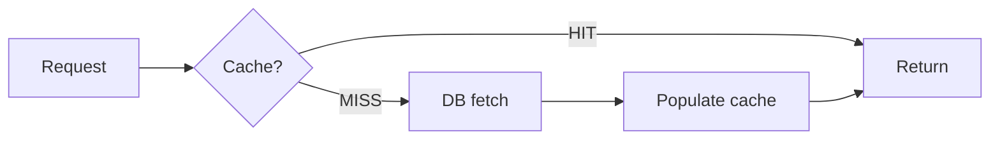
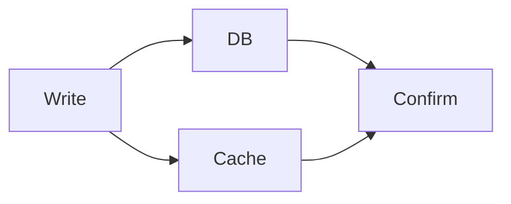
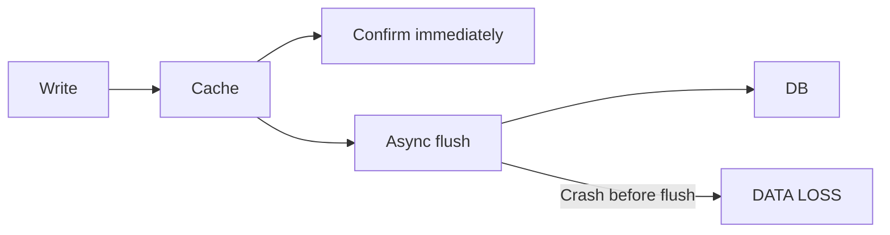

# Level 1: Cache Patterns

> **Goal**: For a given use case, identify the correct cache pattern and understand why the alternatives would fail.

---

## The three patterns

Before you start, write a one-line definition of each pattern in your own words:

**Cache-aside** (check cache → on miss, load from DB and populate):

> _Your definition:_

**Write-through** (on write, update cache AND DB synchronously):

> _Your definition:_

**Write-behind** (on write, update cache only → async DB flush later):

> _Your definition:_

---

## Exercise 1: Pick the right pattern

**Key questions**:
- Can writes accept double latency (cache + DB)? → write-through is viable
- Can a small amount of data loss on writes be tolerated? → write-behind is viable
- Neither? → cache-aside (the safe default)

| Scenario | Pattern | Why not the others? |
|----------|---------|---------------------|
| User profile reads, updated infrequently | | |
| Real-time view counter, 10k increments/sec | | |
| User settings page: must appear immediately on reload after save | | |
| Product catalog, read 100x more than written | | |
| Social post like count, high volume, small loss OK | | |
| User dashboard must reflect changes after save | | |
| Blog post content, rarely updated | | |
| Leaderboard score updates, 50k/sec | | |

---

## Exercise 2: What breaks with the wrong pattern?

Understanding failure modes cements the pattern choices above.

| Scenario + wrong pattern | What breaks |
|--------------------------|-------------|
| Financial ledger using write-behind | |
| Click counter (10k/sec) using write-through | |
| User profile using cache-aside with no invalidation on write | |
| One-time report generation using write-through | |
| Inventory count using write-behind | |

The four failure modes to choose from: **data loss**, **slow writes**, **stale data**, **unnecessary complexity**.

---

## Exercise 3: Cache hit rate math

**Formula**: `db_requests = total_qps × (1 − hit_rate)`

Work through each scenario — show your calculation:

| Total QPS | Hit rate | DB requests/sec | Your work |
|-----------|----------|-----------------|-----------|
| 10,000 | 90% | | |
| 5,000 | 95% | | |
| 1,000 | 80% | | |
| 50,000 | 99% | | |

**Insight**: At 99% hit rate, 50k QPS still sends _____ requests to the DB. Is that a problem?

> _Your answer:_

---

## Exercise 4: Is a cache layer justified?

Assume your DB handles 1,000 complex reads/second. A cache is justified only when DB load WITHOUT cache would exceed that.

**Rule**: `db_requests = total_qps × (1 − hit_rate)`. If db_requests > 1,000 → cache justified.

| Total QPS | Expected hit rate | DB requests | Cache justified? |
|-----------|-------------------|-------------|-----------------|
| 2,000 | 90% | | |
| 2,000 | 0% | | |
| 10,000 | 95% | | |
| 10,000 | 80% | | |
| 500 | 0% | | |

**Follow-up**: You have 2,000 QPS with a 90% hit rate — the cache isn't technically justified by DB load alone. What other reasons might you still want a cache?

> _Your answer:_

---

Answer key

**Exercise 1**
| Scenario | Pattern |
|----------|---------|
| User profile, read-heavy | cache_aside |
| View counter, 10k/sec | write_behind |
| User settings, must appear on reload | write_through |
| Product catalog, read-heavy | cache_aside |
| Post like count, high volume | write_behind |
| Dashboard reflects changes | write_through |
| Blog post, rarely updated | cache_aside |
| Leaderboard, 50k/sec | write_behind |

**Exercise 2**
| Scenario | Failure |
|----------|---------|
| Financial ledger, write-behind | data_loss |
| Click counter, write-through | slow_writes |
| User profile, no invalidation | stale_data |
| One-time report, write-through | unnecessary_complexity |
| Inventory, write-behind | data_loss |

**Exercise 3**
| QPS | Hit rate | DB reqs |
|-----|----------|---------|
| 10,000 | 90% | 1,000 |
| 5,000 | 95% | 250 |
| 1,000 | 80% | 200 |
| 50,000 | 99% | 500 |

**Exercise 4**
| QPS | Hit rate | DB reqs | Justified? |
|-----|----------|---------|------------|
| 2,000 | 90% | 200 | not_justified |
| 2,000 | 0% | 2,000 | justified |
| 10,000 | 95% | 500 | not_justified |
| 10,000 | 80% | 2,000 | justified |
| 500 | 0% | 500 | not_justified |

