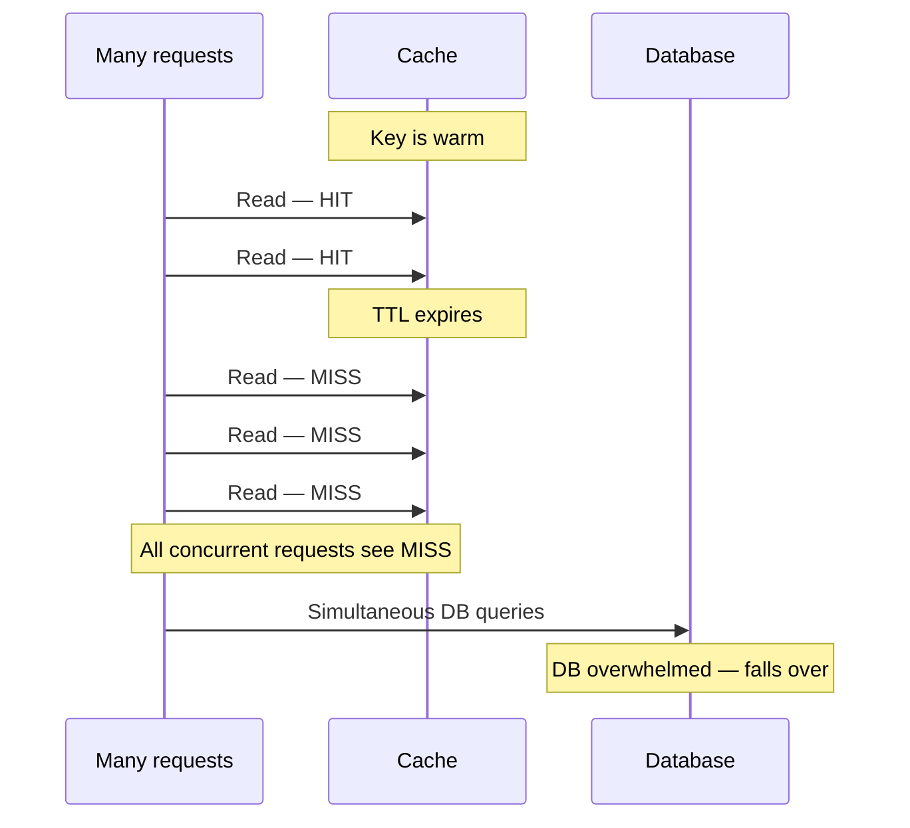
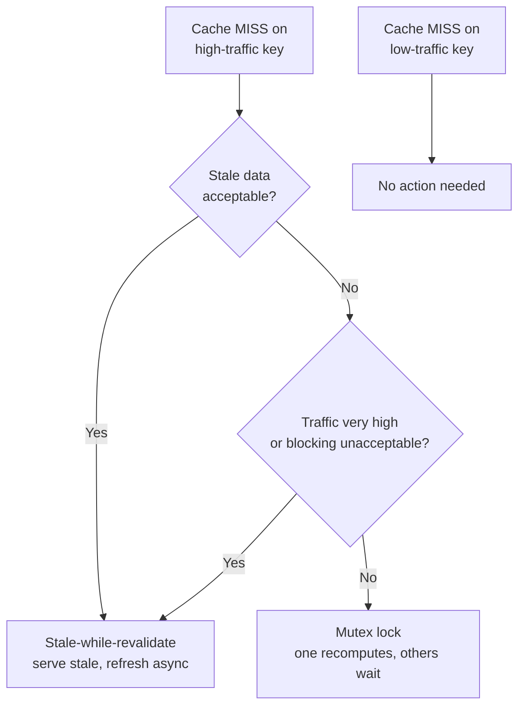

# Level 3: Cache Stampede Prevention and Eviction Policies

> **Goal**: Identify stampede risk, select the correct prevention technique, and choose the right eviction policy for each usage pattern.
>
> **Builds on Level 2**: You know how to set TTLs and invalidate caches. Now handle what happens when a popular key expires and thousands of requests hit the DB simultaneously.

---

## What is a cache stampede?

A **stampede** (also called thundering herd) occurs when a popular cached key expires, and many concurrent requests — all seeing a cache miss — fire the same expensive DB query simultaneously.

**All three conditions must be present for real risk**:
1. High traffic to the key (> ~500 req/sec)
2. The key has a TTL (it will expire)
3. Cache miss is expensive (DB query takes meaningful time)

If any one of these is absent, stampede risk is low.

---

## Exercise 1: Assess stampede risk

| QPS on key | Has TTL? | Miss cost | At risk? |
|------------|----------|-----------|----------|
| 1,000 | Yes | 50ms | |
| 10 | Yes | 200ms | |
| 5,000 | No | 100ms | |
| 2,000 | Yes | 1ms | |
| 800 | Yes | 80ms | |
| 0 | Yes | 500ms | |

**Explain the logic**: Why does a 1ms miss cost eliminate stampede risk even at 2,000 QPS?

> _Your answer:_

---

## Exercise 2: Choose the prevention strategy

- **Stale-while-revalidate**: Serve the stale value immediately; refresh in the background. No waiting. Requires brief stale window to be acceptable.
- **Mutex lock**: One request recomputes, others wait. Ensures freshness. Can cause brief latency spike for waiting requests.
- **Probabilistic expiry**: Randomly refresh the key slightly before it expires, distributing the recompute across time. Good for distributed systems.
- **No action**: If stampede risk is not present, don't add complexity.

| Scenario | Strategy | Why |
|----------|----------|-----|
| Homepage at 50k req/sec, 1 second stale is fine | | |
| User dashboard at 200 req/sec, brief wait is acceptable | | |
| Country dropdown at 5 req/sec, long TTL | | |
| Trending feed at 100k req/sec, must scale | | |
| Search results at 500 req/sec, users expect near-fresh data | | |
| Per-user notification count at 10 req/sec | | |

**Trade-off question**: Mutex lock vs stale-while-revalidate. What do you give up with each?

> _Your answer:_

---

## Exercise 3: Thundering herd impact calculation

When a stampede occurs, how many duplicate DB queries does it generate?

**Formula**: `duplicate_queries = qps × (db_query_time_ms / 1000)` (minimum 1)

All requests arriving within the DB query window see a miss and fire their own query.

| QPS on key | DB query time | Duplicate DB queries | Your calculation |
|------------|---------------|----------------------|-----------------|
| 1,000 | 100ms | | |
| 50,000 | 50ms | | |
| 100 | 200ms | | |
| 1 | 500ms | | |

**Insight**: At 50k QPS with a 50ms query time, you'd fire _____ duplicate DB queries in one stampede event. If your DB handles 1,000 complex reads/sec, what happens?

> _Your answer:_

---

## Exercise 4: Eviction policy

When the cache is full and a new key must be added, which key gets evicted?

- **LRU** (Least Recently Used): Evict the key that hasn't been accessed in the longest time. Good for temporal locality.
- **LFU** (Least Frequently Used): Evict the key accessed least often overall. Good for popularity-based retention — keeps viral content warm.
- **TTL**: Evict keys with the shortest remaining TTL first. Good for mixed-TTL pools.
- **None** (noeviction): Return an error when full. Good when eviction could cause data corruption.

| Cache usage pattern | Eviction policy | Why |
|--------------------|-----------------|-----|
| General user session cache | | |
| News article cache (viral articles should stay warm) | | |
| Mixed cache: some keys expire in 30s, some in 1 hour | | |
| Distributed lock store — eviction = data corruption | | |
| API response cache for different endpoints | | |
| Product page cache — popular products should stay warm | | |

**Follow-up**: Why would you choose LFU over LRU for a news site? Give a concrete example where LRU would fail.

> _Your answer:_

---

Answer key

**Exercise 1**
| QPS | TTL | Miss cost | At risk? |
|-----|-----|-----------|----------|
| 1,000 | Yes | 50ms | at_risk |
| 10 | Yes | 200ms | not_at_risk |
| 5,000 | No | 100ms | not_at_risk |
| 2,000 | Yes | 1ms | not_at_risk |
| 800 | Yes | 80ms | at_risk |
| 0 | Yes | 500ms | not_at_risk |

**Exercise 2**
| Scenario | Strategy |
|----------|----------|
| Homepage 50k rps, stale OK | stale_while_revalidate |
| User dashboard 200 rps | mutex_lock |
| Country dropdown 5 rps | no_action |
| Trending feed 100k rps | stale_while_revalidate |
| Search 500 rps, near-fresh | mutex_lock |
| Per-user notification 10 rps | no_action |

**Exercise 3**
| QPS | Query time | Duplicate queries |
|-----|------------|-------------------|
| 1,000 | 100ms | 100 |
| 50,000 | 50ms | 2,500 |
| 100 | 200ms | 20 |
| 1 | 500ms | 1 |

**Exercise 4**
| Pattern | Policy |
|---------|--------|
| User session cache | lru |
| News article, viral content | lfu |
| Mixed TTL pool | ttl |
| Distributed lock store | none |
| API response cache | lru |
| Product page, popularity-based | lfu |

