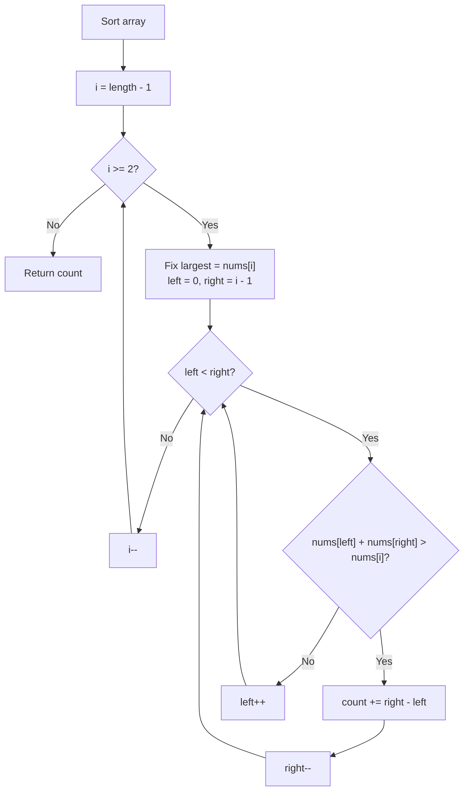
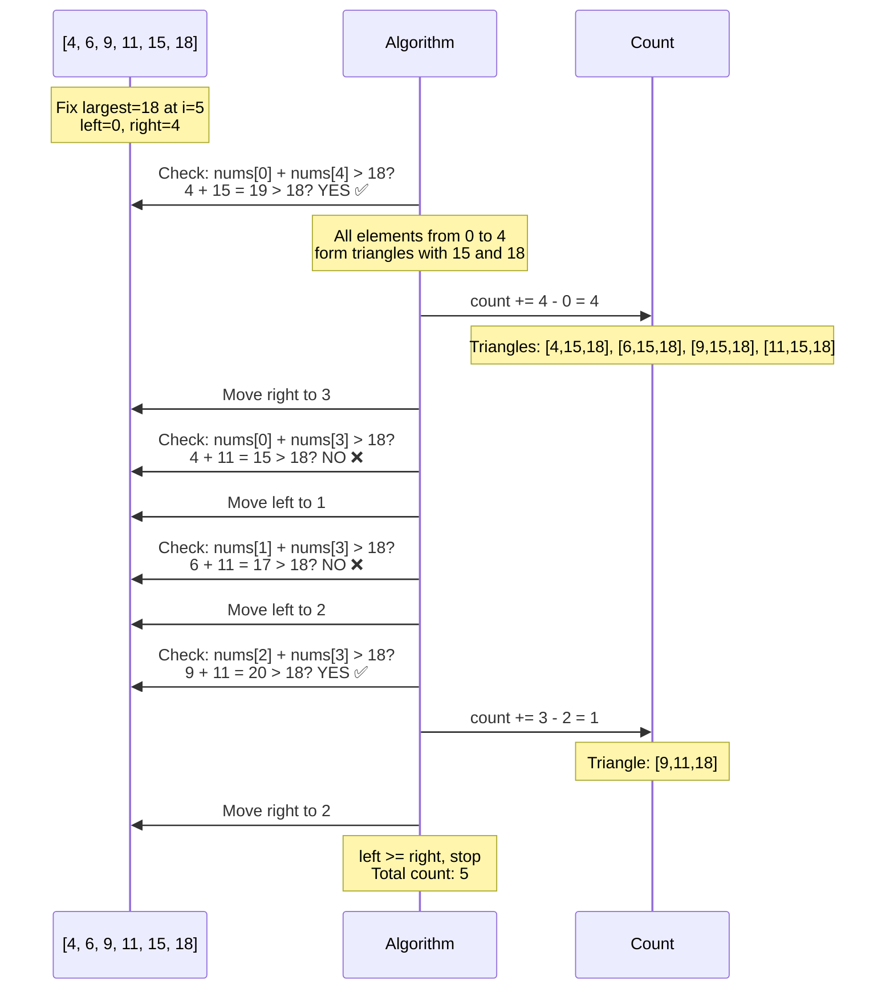
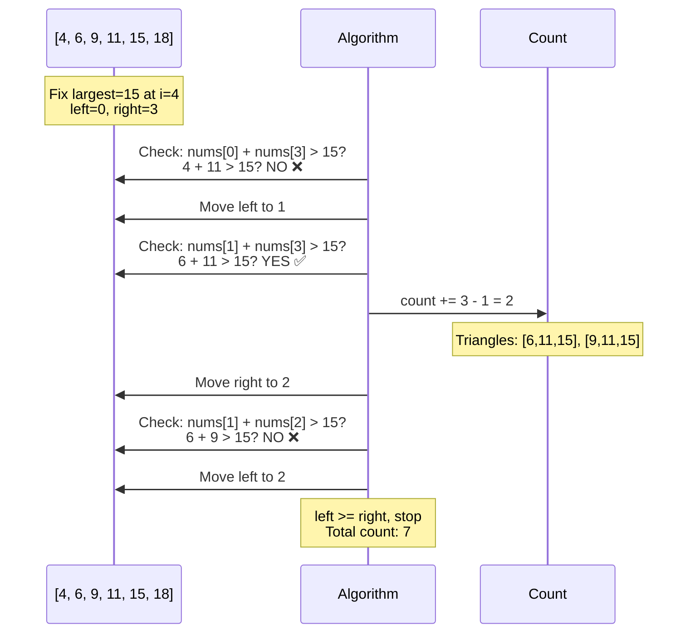
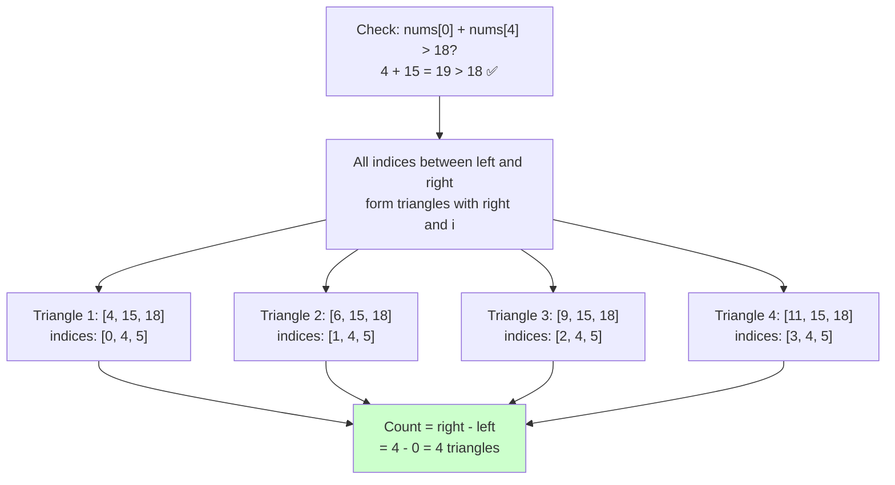
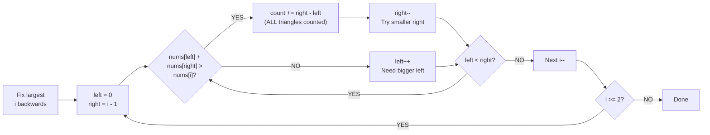

# Triangle Triplet Count - Visual Guide

## The Problem

Count the number of triplets in an array that could form valid triangle sides.

**Triangle inequality:** For sides a, b, c to form a triangle:

- a + b > c
- a + c > b
- b + c > a

## Key Insight: Fix the LARGEST Side!

### Why Sorting Helps

After sorting `[a, b, c]` where `a ≤ b ≤ c`:

- `c` is the **largest side**
- If `a + b > c` (smallest + middle > largest) ✅
- Then the other conditions are **automatically true**:
  - `a + c > b` ✅ (because `c ≥ b`, so `a + c ≥ a + b > c > b`)
  - `b + c > a` ✅ (because `b ≥ a` and `c > 0`)

**Mental Model:** Fix the **largest** side first, then find pairs of smaller sides that satisfy `left + right > largest`.

## The Algorithm



## The Magic: `count += right - left`

This is the **key insight** that makes this problem efficient!

### Why This Works

When `nums[left] + nums[right] > nums[i]` (where `i` is the largest):

```
Array: [left, ..., middle, ..., right, ..., i(largest)]
         ↑                      ↑           ↑
       smallest              2nd largest  largest(fixed)
```

**All elements between `left` and `right` form valid triangles with `nums[right]` and `nums[i]`!**

Why? Because if `nums[left] + nums[right] > nums[i]` (smallest left value works), then:

- `nums[left+1] + nums[right] > nums[i]` ✅
- `nums[left+2] + nums[right] > nums[i]` ✅
- ...
- `nums[right-1] + nums[right] > nums[i]` ✅

All of these are **bigger** than `nums[left]`, so they all satisfy the triangle inequality!

## Step-by-Step Example

Array: `[4, 6, 9, 11, 15, 18]` (already sorted)

### Iteration 1: i=5, largest=18



### Iteration 2: i=4, largest=15



### Detailed Visualization: How `count += right - left` Works



## Why Move Right (not Left)?

When we find a valid triangle:

```
[left, ..., middle, ..., right, ..., i(largest)]
  ✓                      ✓           ✓
```

**We already counted ALL triangles** between `left` and `right` with this `right` value and `nums[i]`.

To find more triangles, we need a **smaller `right`** value, so we move `right--`.

If we moved `left++`, we'd miss triangles!

## Complete Example Trace

Array: `[4, 6, 9, 11, 15, 18]`

| i   | largest | left | right | nums[left] + nums[right] | Valid? | Count Added | Total Count |
| --- | ------- | ---- | ----- | ------------------------ | ------ | ----------- | ----------- |
| 5   | 18      | 0    | 4     | 4 + 15 = 19 > 18         | ✅     | 4 - 0 = 4   | 4           |
| 5   | 18      | 0    | 3     | 4 + 11 = 15 > 18         | ❌     | -           | 4           |
| 5   | 18      | 1    | 3     | 6 + 11 = 17 > 18         | ❌     | -           | 4           |
| 5   | 18      | 2    | 3     | 9 + 11 = 20 > 18         | ✅     | 3 - 2 = 1   | 5           |
| 5   | 18      | 2    | 2     | left >= right, stop      | -      | -           | 5           |
| 4   | 15      | 0    | 3     | 4 + 11 = 15 > 15         | ❌     | -           | 5           |
| 4   | 15      | 1    | 3     | 6 + 11 = 17 > 15         | ✅     | 3 - 1 = 2   | 7           |
| 4   | 15      | 1    | 2     | 6 + 9 = 15 > 15          | ❌     | -           | 7           |
| 4   | 15      | 2    | 2     | left >= right, stop      | -      | -           | 7           |
| 3   | 11      | 0    | 2     | 4 + 9 = 13 > 11          | ✅     | 2 - 0 = 2   | 9           |
| 3   | 11      | 0    | 1     | 4 + 6 = 10 > 11          | ❌     | -           | 9           |
| 3   | 11      | 1    | 1     | left >= right, stop      | -      | -           | 9           |
| 2   | 9       | 0    | 1     | 4 + 6 = 10 > 9           | ✅     | 1 - 0 = 1   | 10          |
| 2   | 9       | 0    | 0     | left >= right, stop      | -      | -           | 10          |

**Final Count: 10 triangles**

Valid triangles:
```
1. [4, 6, 9]
2. [4, 9, 11]
3. [6, 9, 11]
4. [4, 15, 18]
5. [6, 15, 18]
6. [9, 15, 18]
7. [11, 15, 18]
8. [6, 11, 15]
9. [9, 11, 15]
10. [9, 11, 18]
```

## When Invalid: Move Left

```
[left, ..., right, ..., i(largest)]
  ✗ Too small
```

If `nums[left] + nums[right] ≤ nums[i]`, it means `nums[left]` is too small.

We need a **bigger left value**, so we move `left++`.

## Visual Summary



## Correct Code

```typescript
function triangleNumber(nums: number[]): number {
  nums.sort((a, b) => a - b);

  let count = 0;
  // Iterate backwards, fixing the LARGEST element
  for (let i = nums.length - 1; i >= 2; i--) {
    let left = 0;
    let right = i - 1;

    while (left < right) {
      if (nums[left] + nums[right] > nums[i]) {
        // All elements from left to right-1 work with right and i
        count += right - left;
        right--;
      } else {
        left++;
      }
    }
  }
  return count;
}
```

## Time Complexity

- **Sort:** O(n log n)
- **Main algorithm:** O(n²)
  - Outer loop: O(n)
  - Inner while loop: O(n)
- **Total:** O(n²)

This is optimal for this problem!

## Mental Model Summary

1. **Fix the LARGEST side** (iterate backwards from end)
2. **Use two pointers** for the other two sides (left=0, right=i-1)
3. **Key insight:** After sorting, only check `nums[left] + nums[right] > nums[i]`
4. **Magic counting:** When valid, `count += right - left` counts ALL triangles at once
5. **Move right when valid** (we've counted all for this right)
6. **Move left when invalid** (left is too small)
7. **Critical:** We iterate BACKWARDS because fixing the largest element allows the efficient counting trick
