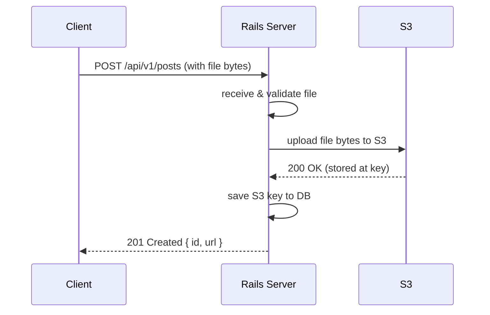
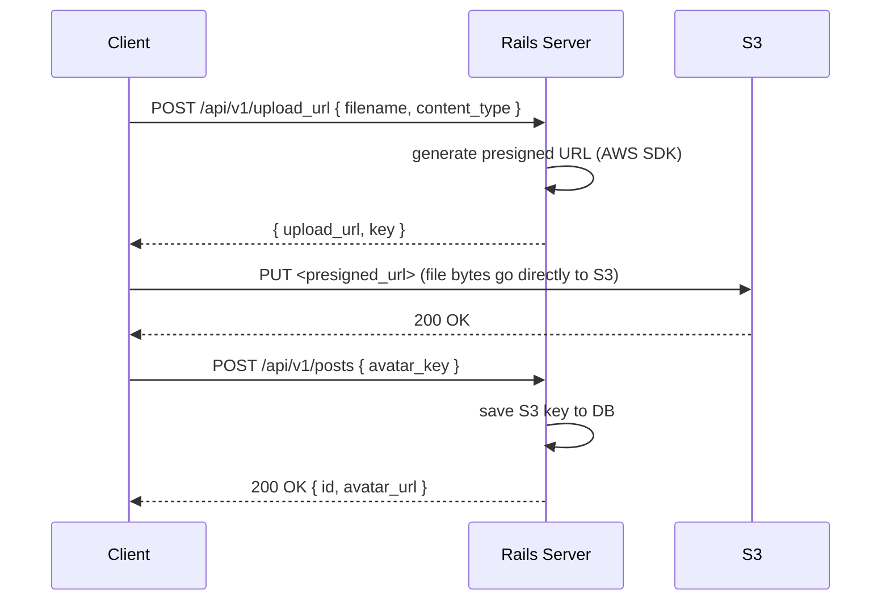

# Lesson 4 — AWS Fundamentals

## The Mental Model

AWS is a collection of managed infrastructure services — think of it as renting pieces of a data center instead of running your own. For a Rails backend, you'll interact with a handful of them constantly:

| Service     | What it is                   | Rails analogy                                                     |
| ----------- | ---------------------------- | ----------------------------------------------------------------- |
| **S3**      | File storage in the cloud    | Like a hard drive, but infinitely scalable and accessible via URL |
| **IAM**     | Identity & Access Management | Who is allowed to do what                                         |
| **SQS**     | Managed job queue            | Like Redis for Sidekiq, but AWS-managed                           |
| **RDS**     | Managed relational database  | Your Postgres/MySQL, but AWS runs the server                      |
| **EC2**     | Virtual servers              | The machine your Rails app runs on                                |
| **ECS/EKS** | Container orchestration      | Running your Docker containers at scale                           |

For this interview prep, we focus on **S3, IAM, and SQS** — the most common in API interviews.

**Why interviewers ask about AWS:** Most production Rails apps run on AWS. Interviewers want to know you understand not just how to write Rails code, but how that code behaves in a real infrastructure — where files live, how secrets are managed, and how background jobs get processed reliably.

---

## Part 1: S3 — File Storage

### What is S3?

S3 (Simple Storage Service) is AWS's file storage. You can store any file — images, videos, PDFs, CSVs — and retrieve them via a URL. It's infinitely scalable and highly durable (AWS replicates your files across multiple physical locations).

S3 organizes files into **buckets** (like top-level folders, globally unique across all of AWS) and **objects** (the files themselves). Each object is identified by a **key** — essentially its path within the bucket:

```
Bucket: my-app-uploads
  Key:  uploads/users/123/avatar.jpg    ← path within the bucket
  Key:  uploads/posts/456/cover.png
```

You never store the actual file in your database — you store the key, and use it to generate a URL when you need to serve the file.

### Two Upload Patterns

This is the most common S3 interview topic. Interviewers want to know you understand the tradeoff between simplicity and performance.

---

**Pattern A: Server-side upload** — client → your Rails server → S3

The file goes through your server first. Rails receives it, then forwards it to S3.

- Simple to implement — Rails handles everything
- **Bottleneck:** large files occupy your server's memory and CPU while transferring
- If 100 users upload simultaneously, your server absorbs all that traffic
- Good for: small files, or cases where you need to process the file before storing it (resize, virus scan, validate contents)



---

**Pattern B: Presigned URL** — client → S3 directly

Rails generates a temporary, cryptographically signed URL. The client uses that URL to upload the file directly to S3 — your server never touches the file bytes.

- Rails stays free to handle other requests
- S3 absorbs the upload traffic, not your server
- The signed URL expires (e.g. 15 minutes), so it can't be reused or shared
- **This is the preferred pattern in modern APIs**
- Good for: large files, video/audio, high-throughput upload endpoints



Rails has three lightweight responsibilities in this flow:
1. **Generate the URL** — a quick cryptographic operation, no file involved
2. **Issue the permission** — the signed URL is the authorization; Rails doesn't verify the upload itself
3. **Save the key** — a single DB write after the client confirms success

**Interview tip:** "I'd use presigned URLs because large files shouldn't pass through the app server — it wastes bandwidth and blocks the server from handling other requests. Rails only handles auth and the key handoff; S3 and the client do the heavy lifting."

---

### In Rails: Active Storage

Active Storage is Rails' built-in abstraction over S3 (and other storage services). It implements the presigned URL pattern for you so you don't have to write the service yourself.

```ruby
# Gemfile
gem 'aws-sdk-s3', '~> 1.0'

# config/storage.yml — tell Rails which S3 bucket to use
amazon:
  service: S3
  access_key_id: <%= ENV['AWS_ACCESS_KEY_ID'] %>
  secret_access_key: <%= ENV['AWS_SECRET_ACCESS_KEY'] %>
  region: us-east-1
  bucket: <%= ENV['S3_BUCKET'] %>

# config/environments/production.rb
config.active_storage.service = :amazon

# app/models/post.rb
class Post < ApplicationRecord
  has_one_attached :cover_image
end
```

#### What Active Storage actually does under the hood

When you add `has_one_attached`, Active Storage manages two of its own DB tables — your `posts` table never stores a file path or S3 key directly:

```
active_storage_blobs       — metadata: filename, content_type, byte size, checksum, S3 key
active_storage_attachments — polymorphic join: connects any model (Post, User, etc.) to a blob
```

A **polymorphic** join table means one table can belong to many different model types. Instead of a separate attachments table per model, Active Storage uses `record_type` and `record_id` to point to any model:

```
record_type | record_id | blob_id
------------|-----------|--------
"Post"      | 1         | 42
"User"      | 5         | 43
```

When you call `.attach` or `.url`, here's what actually happens:

```ruby
# Attaching a file:
post.cover_image.attach(io: file, filename: 'cover.jpg')
# 1. Uploads the file bytes to S3
# 2. Creates an ActiveStorage::Blob with the S3 key + metadata
# 3. Creates an ActiveStorage::Attachment linking that blob to this post

# Generating a URL:
post.cover_image.url
# 1. Looks up the blob to get the S3 key
# 2. Calls the AWS SDK to generate a presigned GET URL
# 3. Returns the temporary URL — same pattern as doing it manually
```

```ruby
post.cover_image.attached?  # check if a file exists

has_one_attached :cover_image   # single file
has_many_attached :photos       # collection of files
```

#### When to use Active Storage vs rolling your own

| | Active Storage | Custom service |
|---|---|---|
| Setup | Minimal | More code |
| Control | Limited | Full |
| Transformations | Built-in (ImageMagick) | You handle it |
| Multi-cloud | Config only | Code changes |
| Good for | Standard file attachments | Custom upload flows, presigned URL APIs |

Active Storage is the right default for most apps. Roll your own when you need to return the presigned URL to the client for direct upload — Active Storage's `.attach` uploads server-side, which defeats the point of Pattern B.

---

### Presigned URL Service (without Active Storage)

Use this when you want the client to upload directly to S3 and need full control over the URL lifecycle:

```ruby
# app/services/s3_presigned_url_service.rb
class S3PresignedUrlService
  EXPIRY = 15.minutes

  def initialize(key:, content_type:)
    @key = key
    @content_type = content_type
  end

  def generate_put_url
    s3_client.presigned_url(
      :put_object,
      bucket: ENV.fetch('S3_BUCKET'),
      key: @key,
      expires_in: EXPIRY.to_i,
      content_type: @content_type
    )
  end

  private

  def s3_client
    @s3_client ||= Aws::S3::Presigner.new(
      client: Aws::S3::Client.new(region: ENV.fetch('AWS_REGION', 'us-east-1'))
    )
  end
end
```

---

## Part 2: IAM — Credentials and Access

### What is IAM?

IAM (Identity and Access Management) is how AWS controls *who* can do *what*. Every call to an AWS service — uploading a file to S3, reading from SQS, querying RDS — must be authenticated and authorized through IAM.

There are two concepts to keep separate:

- **Authentication** — proving who you are (credentials, roles)
- **Authorization** — what you're allowed to do (policies)

**The cardinal rule: never hardcode AWS credentials in your code.**

Credentials can rotate. Code is committed to git. Secrets in git are a breach — and AWS actively scans public repos for leaked keys and will alert you (and sometimes revoke them automatically).

### Credentials: How your Rails app proves who it is

There's a hierarchy from best to worst. Interviewers will specifically ask about this.

**1. IAM Roles (best — no credentials at all)**

When your Rails app runs on EC2 (a virtual machine) or ECS (a container), you attach an IAM role directly to that machine or container. Think of it like a badge — the server itself has an identity, and AWS grants it permissions based on that identity.

```
EC2 instance  → IAM role attached → S3 permissions granted
ECS task      → IAM role attached → S3 permissions granted
```

The AWS SDK automatically picks up the role's credentials from AWS's internal metadata service. No access keys in your code, no secrets to rotate, no risk of accidental exposure.

**2. Environment variables (good for development)**

```bash
AWS_ACCESS_KEY_ID=...
AWS_SECRET_ACCESS_KEY=...
AWS_REGION=us-east-1
```

Store these in a `.env` file (gitignored) locally, or in your hosting platform's environment config in production. The AWS SDK reads these automatically.

**3. Rails credentials (good for Rails apps without IAM roles)**

```bash
rails credentials:edit
```

```yaml
aws:
  access_key_id: ...
  secret_access_key: ...
```

```ruby
Rails.application.credentials.aws[:access_key_id]
```

Encrypted at rest, stored in `credentials.yml.enc`. Safer than `.env` because the encrypted file can be committed — only someone with the master key can decrypt it.

**4. Hardcoded in code (never)**

```ruby
# DO NOT DO THIS
Aws::S3::Client.new(access_key_id: 'AKIA...', secret_access_key: 'abc123')
```

If this ever hits git — even in a private repo — treat it as compromised immediately.

**Interview tip:** "In production I'd use an IAM role attached to the EC2 instance or ECS task — the AWS SDK picks up credentials automatically, there are no keys to rotate or leak. In development I use environment variables via dotenv."

---

## Part 3: IAM — Least Privilege

### What is least privilege?

Every IAM policy should grant **only the permissions the application actually needs** — nothing more. This limits the blast radius if credentials are ever compromised.

Think of it like a key card at an office. A developer gets access to their floor and the kitchen. Not the server room. Not the CEO's office. Not the entire building.

```json
{
  "Version": "2012-10-17",
  "Statement": [
    {
      "Effect": "Allow",
      "Action": ["s3:PutObject", "s3:GetObject", "s3:DeleteObject"],
      "Resource": "arn:aws:s3:::my-app-uploads/*"
    }
  ]
}
```

This policy:
- **Allows:** upload, read, delete objects in one specific bucket
- **Denies by default:** listing bucket contents, deleting the bucket, accessing any other bucket or AWS service
- **Scoped to:** `my-app-uploads` only — not all of S3, not all of AWS

**What NOT to do:**

```json
{
  "Action": "*",    // full admin — can do anything in your AWS account
  "Resource": "*"   // on every resource
}
```

If these credentials leak, an attacker has full control of your AWS account. With least privilege, the worst case is limited to what that one policy allows.

**Interview tip:** "I apply least privilege — the IAM policy for my Rails app only gets `s3:PutObject` and `s3:GetObject` on the specific bucket it needs. Not `s3:*`. Not `*:*`. If the credentials leak, the damage is contained."

---

## Part 4: SQS — Managed Job Queue

### What is SQS?

SQS (Simple Queue Service) is AWS's managed message queue. In Rails, background jobs are typically handled by Sidekiq + Redis — SQS is an alternative where AWS manages the queue infrastructure instead of you managing Redis.

The core idea is the same: your app enqueues a job, a worker picks it up and processes it asynchronously. The difference is operational — with SQS, AWS handles durability, scaling, and availability of the queue itself.

### How it works

```
Rails: SqsJob.perform_later(id)  →  SQS queue (AWS-managed, durable)
                                            ↓
                           Worker polls SQS, picks up the message, calls perform(id)
```

### Visibility Timeout — the key SQS concept

When a worker picks up a message from SQS, SQS doesn't delete it immediately. Instead, it **hides** the message from other workers for a configurable window called the **visibility timeout** (default: 30 seconds).

- If the job **completes** within that window → worker deletes the message → done
- If the job **crashes** and doesn't delete → timeout expires → message becomes visible again → another worker picks it up

This is how SQS guarantees **at-least-once delivery** — jobs will always be retried if they fail, but this also means your jobs need to be **idempotent** (safe to run more than once with the same result).

**Set visibility timeout longer than your longest expected job runtime:**

```
Job takes up to 2 minutes → set visibility timeout to at least 5 minutes
```

If the timeout is too short, SQS will re-deliver the message while the original job is still running — causing duplicate processing.

### SQS as ActiveJob adapter

The Rails interface doesn't change at all — just the adapter:

```ruby
# Gemfile
gem 'aws-sdk-sqs'
gem 'activejob-sqs-adapter'

# config/application.rb
config.active_job.queue_adapter = :sqs

# Your jobs are identical — ActiveJob abstracts the queue backend
class NotificationJob < ApplicationJob
  queue_as :default   # maps to an SQS queue name
  def perform(user_id)
    # same as before
  end
end
```

**SQS vs Sidekiq:**

|             | Sidekiq                            | SQS                        |
| ----------- | ---------------------------------- | -------------------------- |
| Persistence | Redis                              | AWS-managed, durable       |
| Scaling     | You manage Redis                   | Fully managed              |
| Monitoring  | Sidekiq Web UI                     | AWS CloudWatch             |
| Cost        | Redis server cost                  | Pay per message            |
| Guarantee   | At-least-once                      | At-least-once              |
| Best for    | High throughput, complex workflows | AWS-native, simple queuing |

**Interview tip:** "SQS and Sidekiq solve the same problem — async job processing. The choice is operational: if I'm already deep in AWS and don't want to manage Redis, SQS removes that overhead. For high-throughput or complex job workflows, Sidekiq gives more control and better visibility."

---

## Part 5: Security Response — What to Do When Keys Leak

This is a common interview scenario question. Interviewers want to see that you have a clear, ordered response — not panic.

If AWS credentials are accidentally committed to git:

1. **Immediately revoke the key** in the IAM console — treat it as compromised the moment it's seen, before investigating anything else
2. **Check CloudTrail** for any API calls made with that key — CloudTrail is AWS's audit log of every API action taken in your account
3. **Rotate to a new key** — or better, take this opportunity to switch to IAM roles so there are no long-lived keys to leak
4. **Purge from git history** with `git filter-branch` or BFG Repo Cleaner — deleting the commit isn't enough, the key is in the history
5. **Notify your security team** — even if CloudTrail shows no unauthorized usage, the key was exposed and the team needs to know

**Interview tip:** "The first step is to deactivate the key immediately — not after investigating, immediately. A key that's been public even for minutes could have been scraped by bots. Then I'd check CloudTrail to understand what was accessed, and use this as the forcing function to move to IAM roles so there are no keys to leak in the future."

---

## Exercise: Design an S3 Upload Flow

**Scenario:** A user wants to upload a profile picture to your Rails API.

Before looking at any reference material, design the full flow yourself:

1. Walk through each step of the request lifecycle — what does the client send, what does Rails return, where does the file actually go?
2. Decide which upload pattern you'd use (server-side vs presigned URL) and write down your reasoning before choosing.
3. Design the IAM policy for this feature: which specific S3 actions does your Rails app need? Which resource ARN should the policy scope to?

**Guiding questions:**

1. If you use a presigned URL, the client uploads directly to S3 — but how does your Rails app then know the upload succeeded and which S3 key to store on the user record?
2. Where do the AWS credentials live in your Rails app? Walk through the hierarchy from best to worst option and explain why IAM roles are preferred over access keys.
3. A junior developer proposes using `"Action": "s3:*"` on `"Resource": "*"` to "keep it simple". What's wrong with this, and what would you specify instead?

Add the route and service skeleton to your app after working through your design.

---

## AWS Interview Checklist

- [ ] Can you explain the difference between S3 server-side upload and presigned URLs — and when you'd choose each?
- [ ] Where do credentials live? (IAM role → env vars → Rails credentials — never hardcoded)
- [ ] What is least privilege and how do you apply it in an IAM policy?
- [ ] What is SQS and how does it compare to Sidekiq/Redis?
- [ ] What is a visibility timeout and why does it matter?
- [ ] What do you do if a credential is leaked? Walk through the steps in order.
- [ ] What is Active Storage and when would you use it vs a custom presigned URL service?

**Final interview tip — thinking aloud:**

Interviewers asking AWS questions aren't testing whether you've memorized the SDK. They're testing whether you understand *why* things are done a certain way. Always lead with the reason before the solution:

> "I'd use a presigned URL **because** large files shouldn't pass through the app server — it wastes bandwidth and blocks the server. The tradeoff is a slightly more complex flow, but the scalability benefit is worth it for anything beyond small files."

The interviewer wants to hear that you understand tradeoffs, not just that you know the API.

---

## Reference — Check Your Work

Once you've designed the flow yourself, compare against this structured answer.

**Full presigned URL flow:**

1. "I'd use presigned URLs so the file goes directly from client to S3 without passing through my server..."
2. "The client calls `POST /api/v1/upload_url` with the filename and content type..."
3. "Rails generates a presigned PUT URL using the AWS SDK and returns it with the S3 key..."
4. "The client uploads directly to S3 using that URL — my server never sees the bytes..."
5. "After upload, the client sends the S3 key to Rails, which saves it to the user record and returns 200..."
6. "For credentials: I'd use an IAM role on the EC2 instance or ECS task, no access keys in code..."
7. "The IAM policy would allow `s3:PutObject` and `s3:GetObject` on the specific bucket only..."

**Controller action for generating the presigned URL:**

```ruby
def upload_url
  key = "uploads/#{current_user.id}/#{SecureRandom.uuid}/#{params[:filename]}"
  url = S3PresignedUrlService.new(
    key: key,
    content_type: params[:content_type]
  ).generate_put_url

  render json: { upload_url: url, key: key }
end
```

**Minimal IAM policy (least privilege):**

```json
{
  "Version": "2012-10-17",
  "Statement": [
    {
      "Effect": "Allow",
      "Action": ["s3:PutObject", "s3:GetObject"],
      "Resource": "arn:aws:s3:::my-app-uploads/uploads/*"
    }
  ]
}
```
