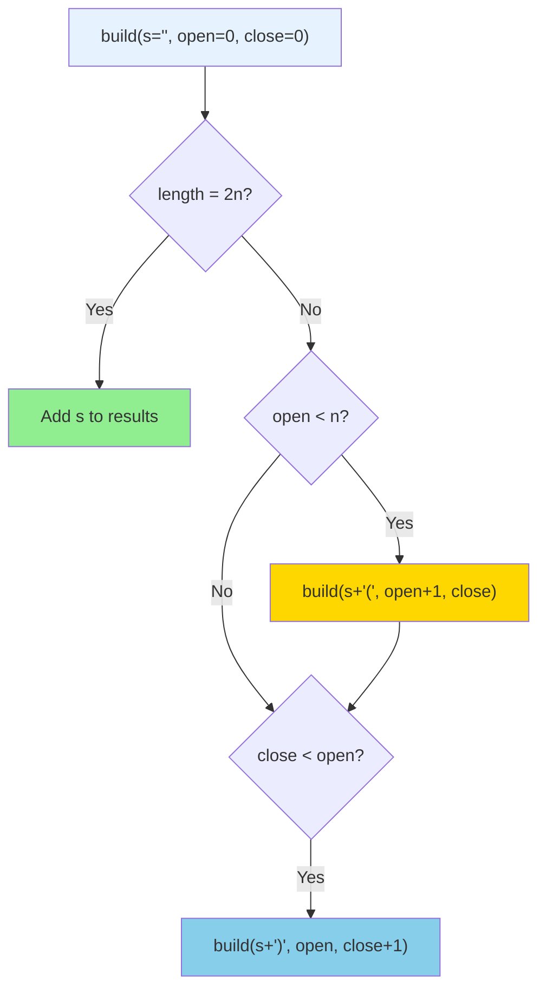
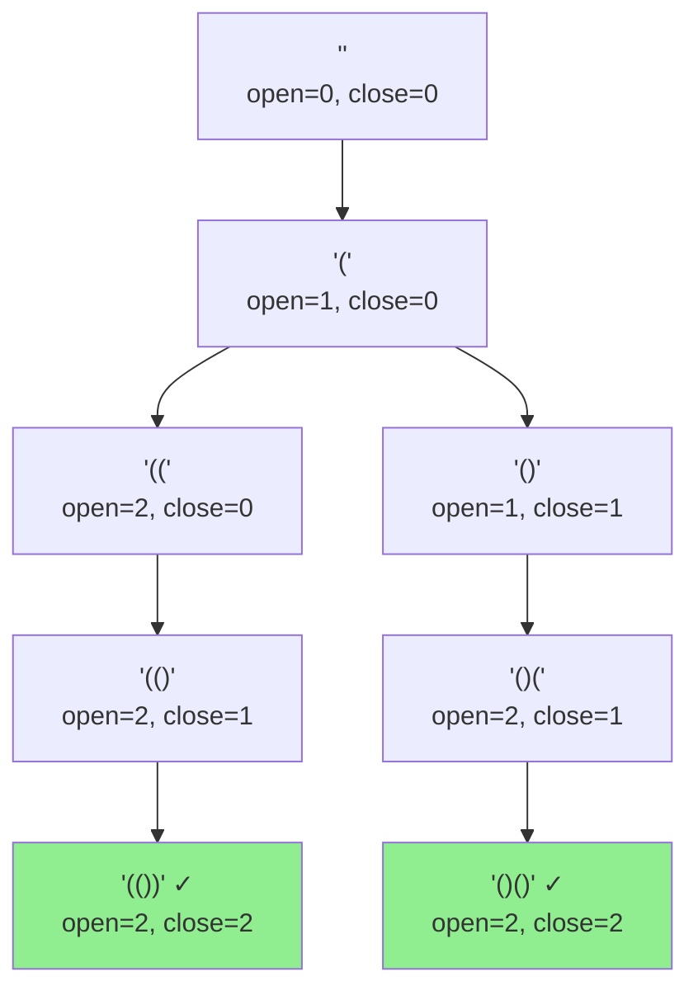
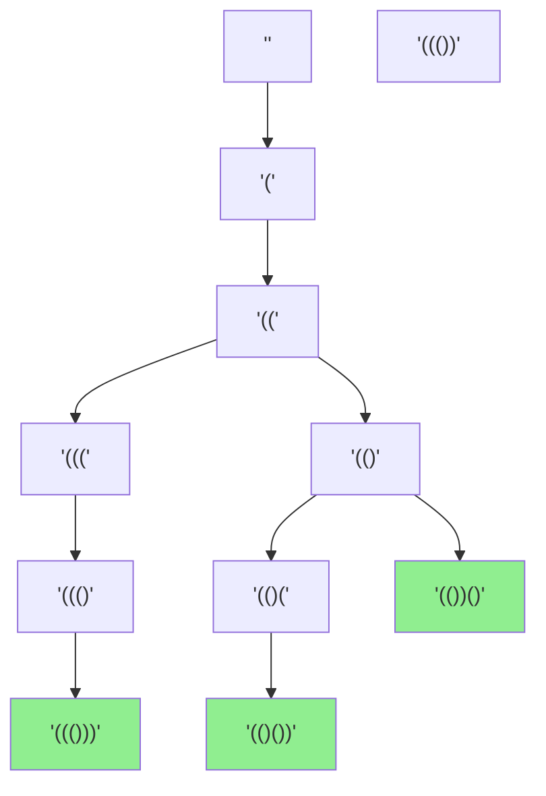
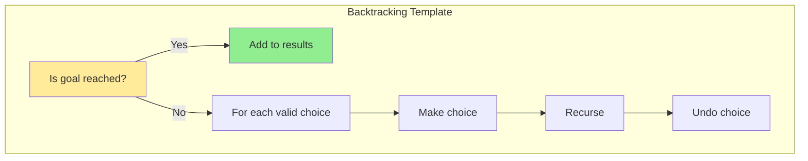

# Generate Parentheses - Solution Guide

> **Prerequisites:** Read [mental-model.md](mental-model.md) first to build your intuition about the problem.

## Problem Statement

Given `n` pairs of parentheses, write a function to generate all combinations of well-formed parentheses.

```
Input: n = 3
Output: ["((()))","(()())","(())()","()(())","()()()"]
```

---

## The Solution: Backtracking

Now that you understand the mental model, let's see how backtracking implements it.

### Core Idea



### The Algorithm

```typescript
function generateParenthesis(n: number): string[] {
    const result: string[] = [];

    function backtrack(current: string, open: number, close: number) {
        // Base case: we've used all n pairs
        if (current.length === 2 * n) {
            result.push(current);
            return;
        }

        // Choice 1: Add '(' if we haven't used all n
        if (open < n) {
            backtrack(current + '(', open + 1, close);
        }

        // Choice 2: Add ')' if it won't exceed open parens
        if (close < open) {
            backtrack(current + ')', open, close + 1);
        }
    }

    backtrack('', 0, 0);
    return result;
}
```

---

## Complete Example: n = 2

Let's trace through the entire recursion tree.

### The Decision Tree



### Step-by-Step Trace

```
Call 1: backtrack("", 0, 0)
  ├─ Length 0 ≠ 4, not done
  ├─ open (0) < n (2)? YES → try adding '('
  │
  └─ Call 2: backtrack("(", 1, 0)
       ├─ Length 1 ≠ 4, not done
       ├─ open (1) < n (2)? YES → try adding '('
       │
       └─ Call 3: backtrack("((", 2, 0)
            ├─ Length 2 ≠ 4, not done
            ├─ open (2) < n (2)? NO → can't add '('
            ├─ close (0) < open (2)? YES → try adding ')'
            │
            └─ Call 4: backtrack("(()", 2, 1)
                 ├─ Length 3 ≠ 4, not done
                 ├─ open (2) < n (2)? NO → can't add '('
                 ├─ close (1) < open (2)? YES → try adding ')'
                 │
                 └─ Call 5: backtrack("(())", 2, 2)
                      ├─ Length 4 = 4, DONE!
                      ├─ Add "(())" to results ✓
                      └─ return

                 ← Backtrack to Call 4
                 └─ return

            ← Backtrack to Call 3
            └─ return

       ← Backtrack to Call 2
       ├─ close (0) < open (1)? YES → try adding ')'
       │
       └─ Call 6: backtrack("()", 1, 1)
            ├─ Length 2 ≠ 4, not done
            ├─ open (1) < n (2)? YES → try adding '('
            │
            └─ Call 7: backtrack("()(", 2, 1)
                 ├─ Length 3 ≠ 4, not done
                 ├─ open (2) < n (2)? NO → can't add '('
                 ├─ close (1) < open (2)? YES → try adding ')'
                 │
                 └─ Call 8: backtrack("()()", 2, 2)
                      ├─ Length 4 = 4, DONE!
                      ├─ Add "()()" to results ✓
                      └─ return

                 ← Backtrack to Call 7
                 └─ return

            ← Backtrack to Call 6
            ├─ close (1) < open (1)? NO → can't add ')'
            └─ return

       ← Backtrack to Call 2
       └─ return

  ← Backtrack to Call 1
  ├─ close (0) < open (0)? NO → can't add ')'
  └─ return

Results: ["(())", "()()"]
```

---

## Visualizing the State Space: n = 3

For `n = 3`, the tree is larger. Here's a partial view:



**Notice:** Every path from root to a green node (length 6) is a valid combination!

---

## Why Backtracking Works

### Key Properties

1. **Explores all valid paths**: Each recursive call represents a choice
2. **Prunes invalid paths**: Constraints prevent exploring bad branches
3. **No duplicates**: The tree structure ensures each path is unique
4. **Automatic backtracking**: Return from recursion naturally "undoes" choices

### The Constraint Guards

```typescript
// Guard 1: Don't exceed budget
if (open < n) {
    backtrack(current + '(', open + 1, close);
}

// Guard 2: Don't close more than open
if (close < open) {
    backtrack(current + ')', open, close + 1);
}
```

These act as **filters** that prevent the tree from growing invalid branches.

---

## Alternative Visualization: Choice Path

For each position in the string, we make a choice:

```
Position: 0  1  2  3  4  5  (for n=3)
Choices:  ?  ?  ?  ?  ?  ?

Example path: "((()))"
Position 0: Choose '(' (open=1, close=0)
Position 1: Choose '(' (open=2, close=0)
Position 2: Choose '(' (open=3, close=0)
Position 3: Choose ')' (open=3, close=1)
Position 4: Choose ')' (open=3, close=2)
Position 5: Choose ')' (open=3, close=3)
```

At each position, both choices might be valid, so we explore both!

---

## Counting Valid Combinations

The number of valid combinations for `n` pairs is the **Catalan number** C(n).

```
C(0) = 1
C(1) = 1
C(2) = 2
C(3) = 5
C(4) = 14
C(5) = 42

Formula: C(n) = (2n)! / ((n+1)! × n!)
```

### Why This Matters

- **n = 10**: 16,796 valid combinations
- **n = 15**: 9,694,845 valid combinations

Backtracking efficiently generates only these valid ones, never exploring the billions of invalid permutations!

---

## Complexity Analysis

### Time Complexity: O(4^n / √n)

**Why?**

- The nth Catalan number is approximately 4^n / (n^(3/2))
- Each valid combination takes O(n) time to build (string concatenation)
- Total: O(4^n / √n)

In practice:
- We explore a tree where each node has at most 2 children
- Maximum depth: 2n
- Not all paths reach the leaves (pruning!)

### Space Complexity: O(n)

- **Recursion stack**: O(n) depth
- **Current string**: O(n) length
- **Result array**: O(4^n / √n × n) but this is output, not auxiliary space

---

## Implementation Variations

### Variation 1: Using String Builder (Java/StringBuilder)

In languages where string concatenation is expensive:

```typescript
function generateParenthesis(n: number): string[] {
    const result: string[] = [];
    const current: string[] = [];

    function backtrack(open: number, close: number) {
        if (current.length === 2 * n) {
            result.push(current.join(''));
            return;
        }

        if (open < n) {
            current.push('(');
            backtrack(open + 1, close);
            current.pop(); // Backtrack!
        }

        if (close < open) {
            current.push(')');
            backtrack(open, close + 1);
            current.pop(); // Backtrack!
        }
    }

    backtrack(0, 0);
    return result;
}
```

**Key difference:** We explicitly **pop** to undo the choice (backtrack).

### Variation 2: Iterative with Stack

```typescript
function generateParenthesis(n: number): string[] {
    const result: string[] = [];
    const stack: [string, number, number][] = [['', 0, 0]];

    while (stack.length > 0) {
        const [current, open, close] = stack.pop()!;

        if (current.length === 2 * n) {
            result.push(current);
            continue;
        }

        if (open < n) {
            stack.push([current + '(', open + 1, close]);
        }

        if (close < open) {
            stack.push([current + ')', open, close + 1]);
        }
    }

    return result;
}
```

**Trade-off:** No recursion stack, but must explicitly manage state tuples.

---

## Common Mistakes

### ❌ Mistake 1: Wrong base case

```typescript
// Wrong: checking counts instead of length
if (open === n && close === n) {
    result.push(current);
    return;
}
```

**Problem:** What if you somehow added extra characters before reaching n?

**Fix:** Use `current.length === 2 * n` as the canonical check.

### ❌ Mistake 2: Swapping the constraints

```typescript
// Wrong order
if (close < n) {  // Should be close < open
    backtrack(current + ')', open, close + 1);
}
```

**Problem:** You could end up with `)()` patterns.

### ❌ Mistake 3: Not returning after base case

```typescript
if (current.length === 2 * n) {
    result.push(current);
    // Missing return!
}

if (open < n) {  // This executes even when length = 2n!
    backtrack(current + '(', open + 1, close);
}
```

**Problem:** Continues execution after finding a valid combination.

### ❌ Mistake 4: Forgetting to increment counts

```typescript
if (open < n) {
    backtrack(current + '(', open, close);  // Forgot +1!
}
```

**Problem:** Infinite recursion or wrong counts.

---

## Edge Cases

### n = 0

```
Input: n = 0
Output: [""]

Why? Zero pairs = empty string (vacuously valid)
```

### n = 1

```
Input: n = 1
Output: ["()"]

Only one valid combination
```

### Large n (n = 10)

```
16,796 valid combinations
Make sure your solution doesn't time out!
Backtracking is efficient enough
```

---

## Debugging Tips

### Print the tree

Add logging to see the exploration:

```typescript
function backtrack(current: string, open: number, close: number, depth: number = 0) {
    console.log('  '.repeat(depth) + `"${current}" (o=${open}, c=${close})`);

    if (current.length === 2 * n) {
        console.log('  '.repeat(depth) + '✓ VALID');
        result.push(current);
        return;
    }

    // ... rest of code
}
```

**Example output for n=2:**

```
"" (o=0, c=0)
  "(" (o=1, c=0)
    "((" (o=2, c=0)
      "(()" (o=2, c=1)
        "(())" (o=2, c=2)
        ✓ VALID
    "()" (o=1, c=1)
      "()(" (o=2, c=1)
        "()()" (o=2, c=2)
        ✓ VALID
```

---

## Testing Your Understanding

Can you answer these without running code?

1. For n=4, what's the first combination generated? (Hint: always choose `(` when possible)

<details>
<summary>Answer</summary>

`"(((())))"`

The leftmost path always adds `(` until open = n, then adds `)` until close = n.

</details>

2. How many recursive calls for n=2?

<details>
<summary>Answer</summary>

8 calls total (including the initial call)

You can count the nodes in the decision tree shown earlier.

</details>

3. What would happen if we removed the `close < open` constraint?

<details>
<summary>Answer</summary>

We'd generate invalid combinations like `")("`, `"))(("`, etc.

The constraint prevents closing before opening.

</details>

---

## Summary: The Backtracking Pattern



For this problem:
- **Goal:** `length = 2n`
- **Choices:** Add `(` or `)`
- **Constraints:** `open < n` and `close < open`
- **State:** `(current_string, open_count, close_count)`

---

## Related Problems

Once you've mastered this, try:

1. **Remove Invalid Parentheses** (LeetCode 301)
2. **Valid Parentheses** (LeetCode 20)
3. **Longest Valid Parentheses** (LeetCode 32)
4. **Different Ways to Add Parentheses** (LeetCode 241)

---

## Final Mental Model

Think of backtracking as:

> **Exploring a tree of choices, pruning invalid branches early, and collecting complete solutions at the leaves.**

For Generate Parentheses:
- Each node = current partial string
- Each edge = add `(` or `)`
- Constraints = prevent invalid edges
- Leaves at depth 2n = valid combinations

You're now ready to implement this yourself!