# Generate Parentheses - Study Guide

#leetcode/22 #pattern/backtracking #pattern/recursion

**LeetCode**: [22. Generate Parentheses](https://leetcode.com/problems/generate-parentheses/)
**Difficulty**: Medium
**Pattern**: Backtracking, Tree Recursion with Constraints

---

## The Problem

Generate all valid combinations of `n` pairs of parentheses.

```
Input: n = 2
Output: ["(())", "()()"]

Input: n = 3
Output: ["((()))", "(()())", "(())()", "()(())", "()()()"]
```

---

## Understanding "Valid"

Before solving, we need to understand what makes parentheses valid:

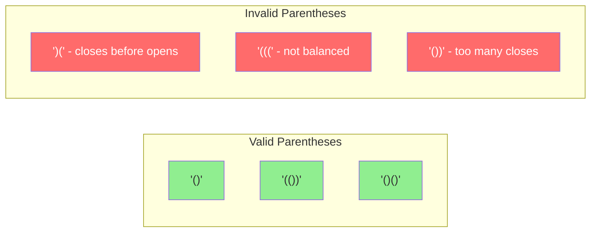

**Key insight**: A string is valid if:
1. Every `)` has a matching `(` before it
2. Total `(` count equals total `)` count

---

## The Brute Force Approach (Why It's Wasteful)

Your first thought might be: "Generate all possible strings of length 2n using `(` and `)`, then filter valid ones."

### Where Does 2^(2n) Come From?

Think of it position by position. For `n=2`, we need strings of length 4:

```
Position:    1    2    3    4
Choices:    ( )  ( )  ( )  ( )
            ↓    ↓    ↓    ↓
            2  × 2  × 2  × 2  = 2^4 = 16 possible strings
```

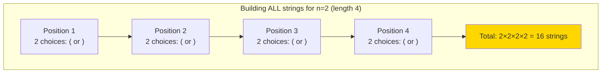

### Brute Force Code

```typescript
// BRUTE FORCE: Generate ALL possible strings, then filter
function bruteForceParentheses(n: number): string[] {
  const length = 2 * n;  // For n=2, length=4
  const allStrings: string[] = [];

  // Generate every possible combination
  function generate(current: string) {
    // Base case: string is complete
    if (current.length === length) {
      allStrings.push(current);
      return;
    }

    // NO constraints - try BOTH choices at every position
    generate(current + '(');  // add open
    generate(current + ')');  // add close
  }

  generate('');

  // NOW filter for valid ones
  return allStrings.filter(isValid);
}

function isValid(s: string): boolean {
  let balance = 0;
  for (const char of s) {
    if (char === '(') balance++;
    else balance--;
    if (balance < 0) return false;  // too many closes
  }
  return balance === 0;  // must be balanced
}
```

### All 16 Strings Generated for n=2

Here's every string the brute force generates:

```
String      Valid?   Why Invalid?
──────────────────────────────────
((((        ✗        Not balanced (4 opens, 0 closes)
((()        ✗        Not balanced (3 opens, 1 close)
(()(        ✗        Not balanced
(())        ✓        VALID!
()((        ✗        Not balanced
()()        ✓        VALID!
())(        ✗        Close before open at position 3
()))        ✗        Too many closes
)(((        ✗        Starts with close (no open to match)
)(()        ✗        Starts with close
)()(        ✗        Starts with close
)())        ✗        Starts with close
))((        ✗        Starts with close
))()        ✗        Starts with close
)))(        ✗        Starts with close
))))        ✗        All closes, no opens
──────────────────────────────────
Total: 16 strings, only 2 valid!
```

### Visualizing the Brute Force Tree

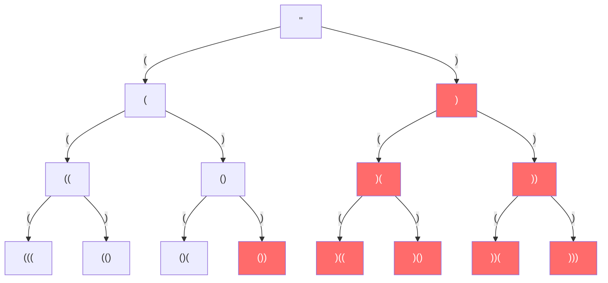

**Notice**: The entire right side of the tree (starting with `)`) is invalid! We're wasting time exploring paths that can **never** lead to valid results.

### The Problem with Brute Force

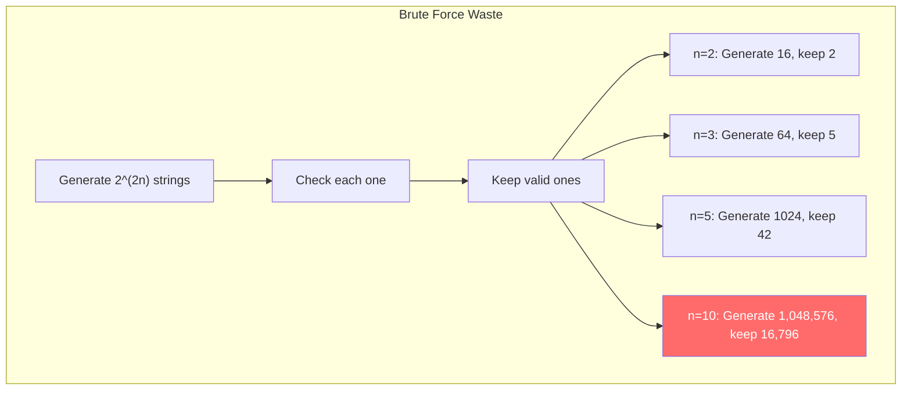

**The ratio of valid to total gets worse as n grows!**

---

## The Key Insight: Build Validity As You Go

Instead of generating everything and filtering, **stop invalid paths before they start**:

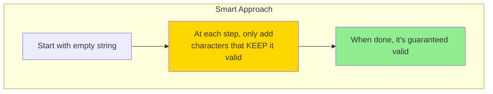

Compare the two trees:

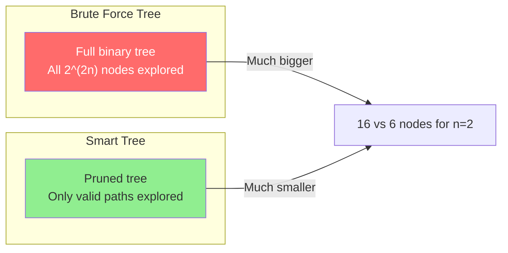

**This is the mental shift**: Don't generate everything and filter. **Prune invalid branches before exploring them.**

---

## Applying the Three Questions Framework

Let's use our recursion framework to think through this problem:

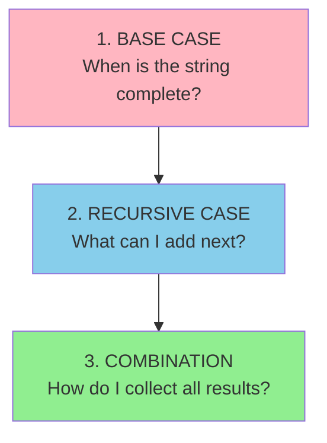

**Question 1: Base Case**
- When is a parentheses string "complete"?
- Answer: When we've placed exactly `n` opens and `n` closes
- That means: `current.length === 2 * n`

**Question 2: Recursive Case (The Hard Part)**
- At each step, what are my choices?
- Can I always add `(`? Can I always add `)`?
- This requires deeper analysis...

**Question 3: Combination**
- We're collecting ALL valid strings
- Use an accumulator array to gather results

---

## Breaking Down the Recursive Case

This is where the problem gets interesting. At each position, you might think you have 2 choices:

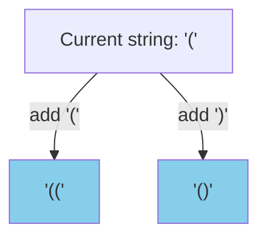

But the choices are **constrained**. Let's figure out the rules.

### Rule 1: When Can I Add `(`?

Think about it: when would adding `(` make the string invalid?

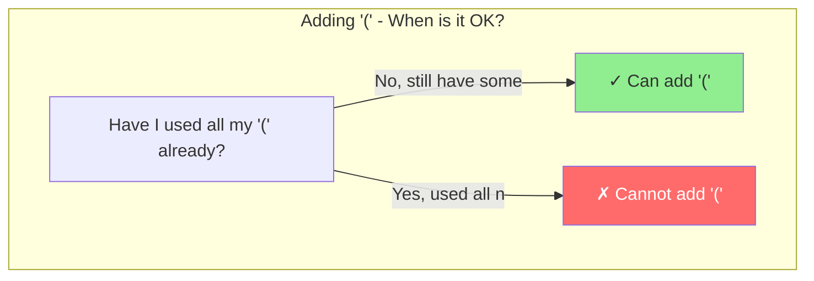

**Rule**: Can add `(` if `openCount < n`

### Rule 2: When Can I Add `)`?

This is trickier. When would adding `)` make the string invalid?

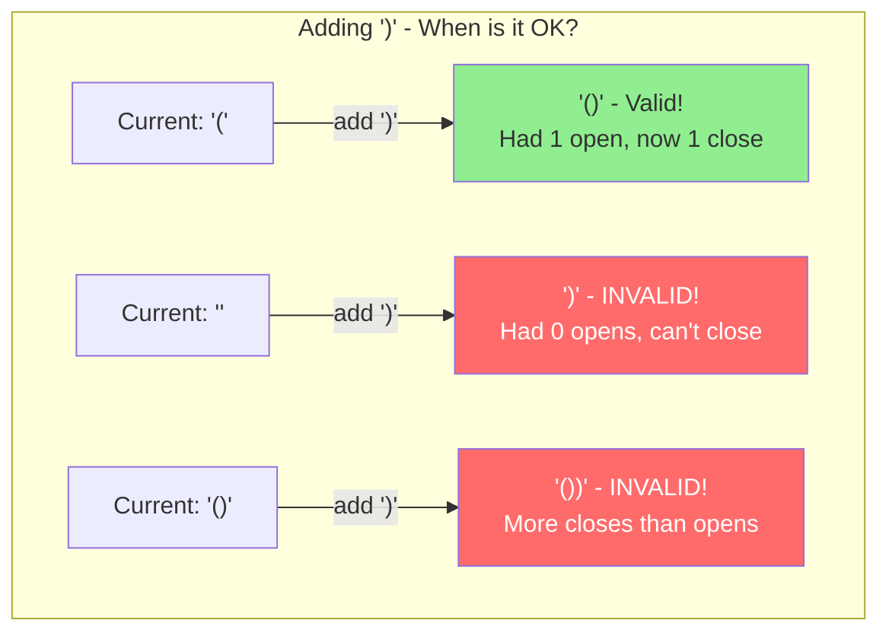

**The pattern**: Adding `)` is only valid if there's an unmatched `(` to close.

**Rule**: Can add `)` if `closeCount < openCount`

---

## Visualizing the Rules Together

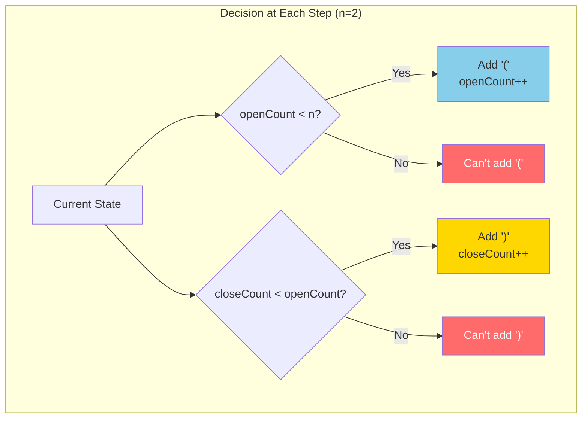

### Why Track `openCount` and `closeCount`?

We need to know:
- How many `(` we've used → `openCount`
- How many `)` we've used → `closeCount`

These two numbers tell us **everything** about validity:

| State | openCount | closeCount | Can add `(`? | Can add `)`? |
|-------|-----------|------------|--------------|--------------|
| `''` | 0 | 0 | Yes (0 < 2) | No (0 < 0 is false) |
| `'('` | 1 | 0 | Yes (1 < 2) | Yes (0 < 1) |
| `'(('` | 2 | 0 | No (2 < 2 is false) | Yes (0 < 2) |
| `'()'` | 1 | 1 | Yes (1 < 2) | No (1 < 1 is false) |
| `'(()'` | 2 | 1 | No | Yes (1 < 2) |
| `'(())'` | 2 | 2 | No | No → DONE! |

---

## The Complete Decision Tree for n=2

Now let's trace through every possible path:

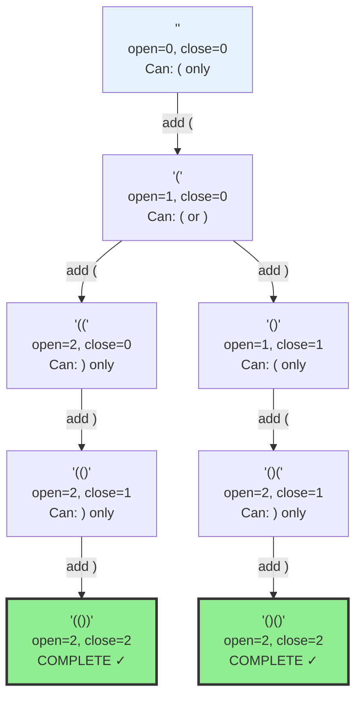

**Notice**: Every path leads to a valid result! That's because we **only took valid steps**.

---

## Tracing Through: What Happens at Each Node

Let's walk through one path in detail:

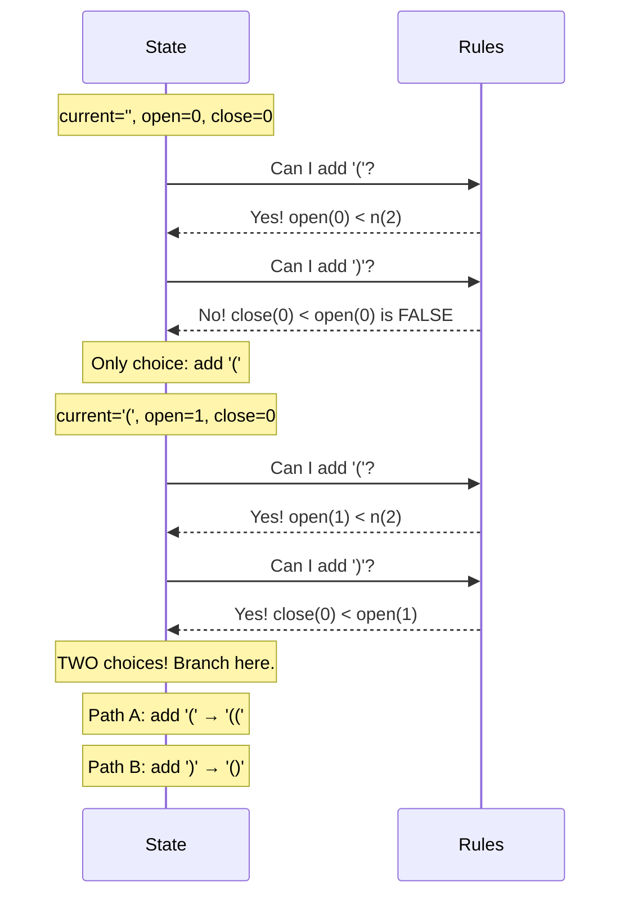

### The Branching Visualized

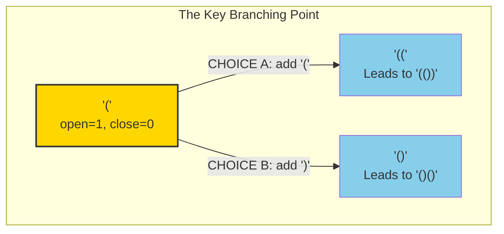

This branching is where recursion shines—we explore BOTH paths, and each eventually reaches a valid result.

---

## Connecting to Recursion Patterns

This problem uses multiple patterns from [[recursion-thinking]]:

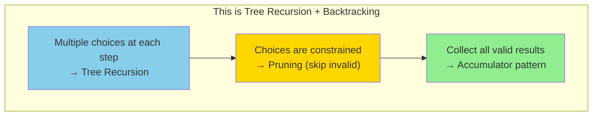

### The Leap of Faith Applied

Remember the leap of faith? Here's how it applies:

> "Assume that `backtrack(current + '(', open + 1, close)` correctly generates all valid completions starting with `current + '('`. I don't need to trace through it—I trust it works."

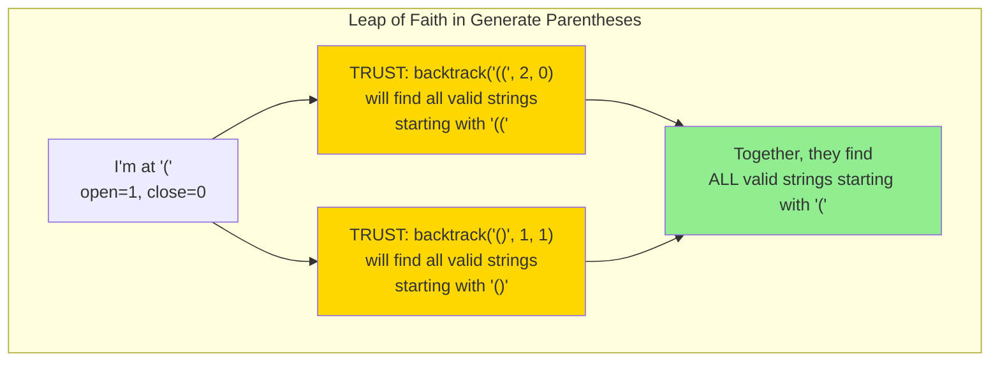

---

## The Complete Mental Process

Here's how to think through this problem from scratch:

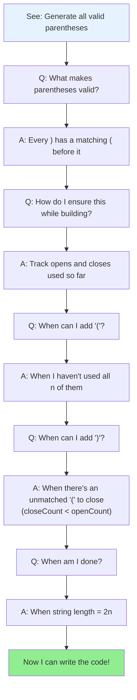

---

## The Solution: Line by Line

```typescript
function generateParenthesis(n: number): string[] {
  const result: string[] = [];  // Accumulator for all valid strings

  // The recursive function
  // Parameters = the STATE at each step
  function backtrack(
    current: string,   // What we've built so far
    open: number,      // How many '(' we've used
    close: number      // How many ')' we've used
  ) {
    // BASE CASE: Is the string complete?
    // We need n opens and n closes, so length = 2n
    if (current.length === 2 * n) {
      result.push(current);  // Save this valid string!
      return;                // Stop this branch
    }

    // RECURSIVE CASE: What can we add next?

    // Choice 1: Try adding '('
    // Allowed if we haven't used all n opens
    if (open < n) {
      // Make the choice and recurse
      // Notice: we pass current + '(' (new string)
      // and open + 1 (one more open used)
      backtrack(current + '(', open + 1, close);
    }

    // Choice 2: Try adding ')'
    // Allowed if there's an unmatched '(' to close
    if (close < open) {
      backtrack(current + ')', open, close + 1);
    }

    // If neither condition is true, this branch is stuck
    // But that can't happen with our rules—we always
    // reach the base case!
  }

  // Start with empty string, 0 opens, 0 closes
  backtrack('', 0, 0);

  return result;
}
```

---

## Why No Explicit Backtracking/Undo?

You might notice we don't have a `current.pop()` or undo step. Why?

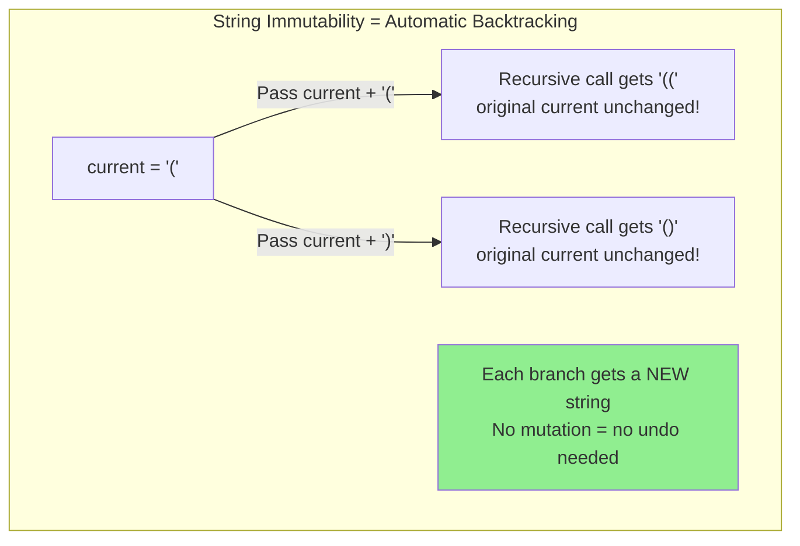

With arrays (like in subsets), you mutate and undo:
```typescript
current.push(item);    // mutate
backtrack(current);
current.pop();         // undo
```

With strings (immutable), each call gets a fresh copy:
```typescript
backtrack(current + '(', ...);  // new string created
backtrack(current + ')', ...);  // another new string
```

---

## Complete Trace for n=2

Here's every recursive call that happens:

```
backtrack('', 0, 0)
├── backtrack('(', 1, 0)
│   ├── backtrack('((', 2, 0)
│   │   └── backtrack('(()', 2, 1)
│   │       └── backtrack('(())', 2, 2) → SAVE '(())'
│   └── backtrack('()', 1, 1)
│       └── backtrack('()(', 2, 1)
│           └── backtrack('()()', 2, 2) → SAVE '()()'
```

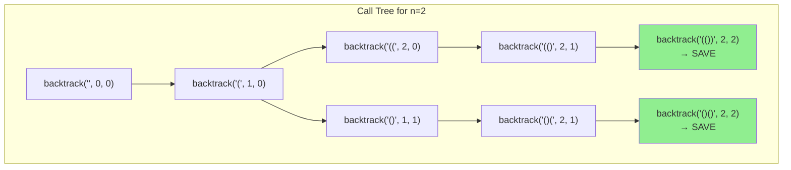

---

## Common Confusions

### "Why `close < open` and not `close < n`?"

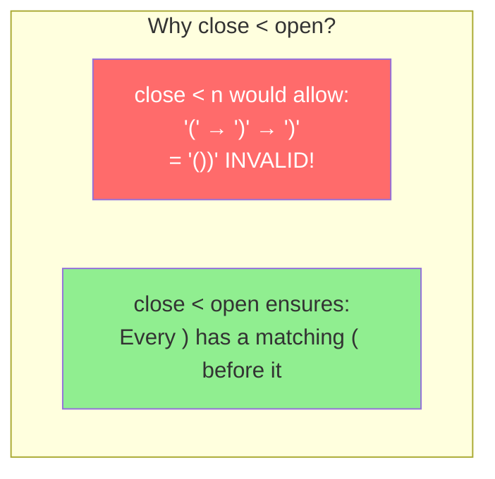

`close < n` only limits total closes. `close < open` ensures **balance**.

### "Why not check validity at the end?"

We could, but it's wasteful:

```mermaid
graph LR
    subgraph "Check at End"
        A1["Generate '((('"]
        A2["Generate '(()'"]
        A3["... all 2^6 = 64 strings"]
        A4["Check each one"]
    end

    subgraph "Check While Building"
        B1["Only valid paths explored"]
        B2["For n=3: only 5 results"]
        B3["Much less work!"]
    end

    style A4 fill:#ff6b6b,color:#fff
    style B3 fill:#90EE90
```

### "What if I forget a constraint?"

Let's see what happens if we forget `close < open`:

```mermaid
graph TD
    A["'' (start)"]
    A -->|"add )"| B["')' INVALID<br/>but we'd continue..."]
    B -->|"add )"| C["'))' INVALID"]
    B -->|"add ("| D["')(' INVALID"]

    style B fill:#ff6b6b,color:#fff
    style C fill:#ff6b6b,color:#fff
    style D fill:#ff6b6b,color:#fff
```

The constraint `close < open` **prevents us from ever entering invalid states**.

---

## Summary: The Mental Model

```mermaid
graph TD
    subgraph "Generate Parentheses Mental Model"
        M1["Start with empty string"]
        M2["At each step, ask:<br/>Can I add '('? Can I add ')'?"]
        M3["Add '(' if: open < n"]
        M4["Add ')' if: close < open"]
        M5["When length = 2n, save result"]
        M6["Recursion explores ALL valid paths"]
    end

    M1 --> M2
    M2 --> M3
    M2 --> M4
    M3 --> M5
    M4 --> M5
    M5 --> M6

    style M3 fill:#87CEEB
    style M4 fill:#FFD700
    style M6 fill:#90EE90
```

**Key Takeaways**:
1. **Build validity in**, don't filter it out
2. **Track state** (open count, close count) to know what's allowed
3. **Trust the recursion**—each branch explores its own path
4. **Constraints prune the tree**—we never explore invalid states

---

## Complexity Analysis

**Time Complexity**: O(4^n / √n) — This is the nth Catalan number
- Much better than brute force O(2^(2n))

**Space Complexity**: O(n)
- Recursion depth is at most 2n
- Each level stores constant space

---

## Related Problems

After mastering this, try:
- [[078-subsets]] - Similar tree recursion, simpler constraints
- [[046-permutations]] - Backtracking with different constraint type
- [[017-letter-combinations]] - Multiple choices at each position
- [[051-n-queens]] - Backtracking with complex validity checks
