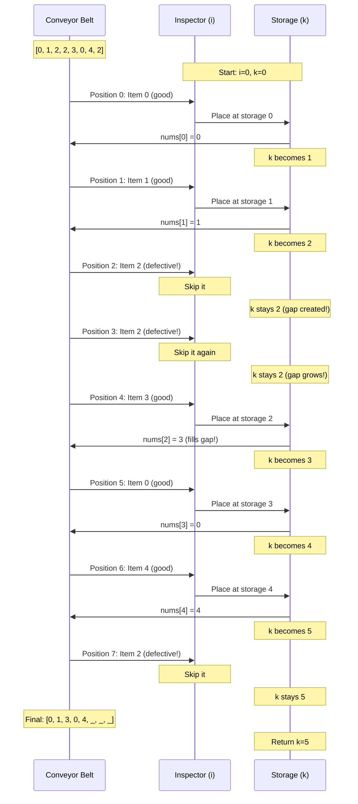
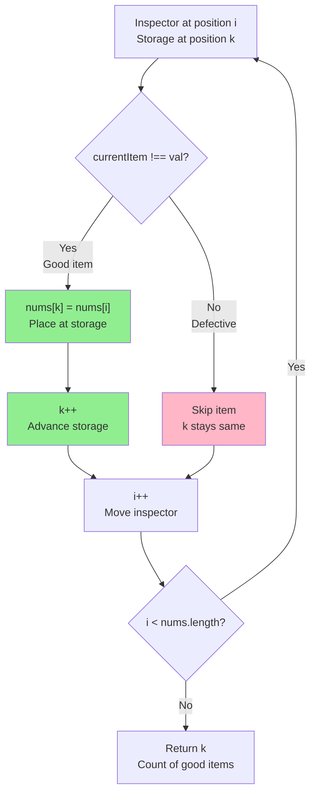

# Remove Element - Mental Model

## The Quality Control Line Analogy

Understanding this problem is like working at a quality control station on a conveyor belt. You're inspecting items one by one, moving good items to the front of the line while leaving defective ones at the back.

### Why This Analogy Works

**The core insight:** You're reorganizing items in-place on a single conveyor belt, collecting good products at the front.

**Perfect mappings:**
- Array = Conveyor belt with numbered positions
- Elements != val = Good products that pass inspection
- Elements == val = Defective products to reject
- Two pointers = Inspector (scanning) + Storage position (placing good items)
- Return value k = How many good products you've collected

**Why this analogy and not others:**
- **In-place constraint** = You can't create a new conveyor belt, must reorganize on the same one
- **Order doesn't matter** = Good products can be rearranged at the front however you want
- **Ignore what's after k** = Once you've counted good products, you don't care about the reject pile at the back
- **Two pointer movement** = Inspector walks down the line, storage position only advances for good items

**The "aha moment":** You don't need to remove defective items by shifting everything—just move good items forward and remember where the good section ends!

---

## Building the Algorithm Step-by-Step

### Step 1: Setting Up the Storage Position

**The analogy:**
Before starting quality control, you need to mark where you'll place the first good item. This is position 0 (the front of the line). As you find good items, you'll place them here and advance the marker.

**What this means in code:**
```typescript
let storageSlot = 0;  // Next position for good items
```

**Why:** The storage position starts at 0 because that's where the first good item should go. It's like a "next available slot" counter—initially pointing to the front of the line.

---

### Step 2: The Inspector Walks the Line

**The analogy:**
An inspector walks down the conveyor belt from start to finish, examining each item one by one. They need to check every single item to determine if it's good or defective.

**Adding to our code:**
```typescript
let storageSlot = 0;

for (let inspector = 0; inspector < nums.length; inspector++) {
    // Inspector is now examining the item at position 'inspector'
    // Next: What should they do with each item?
}
```

**Why:** The loop represents the inspector's journey down the line. The variable `inspector` is their current position—they start at position 0 and walk to the end. They examine every item without skipping.

---

### Step 3: Inspecting Each Item

**The analogy:**
When the inspector examines an item, they check: "Is this defective (equals the defective value)?" If yes, they just walk past it. If no, it's a good item—time to take action!

**Adding the inspection logic:**
```typescript
let storageSlot = 0;

for (let inspector = 0; inspector < nums.length; inspector++) {
    const currentItem = nums[inspector];

    // Is this a good item (not defective)?
    if (currentItem !== val) {
        // Yes! We need to handle this (next step...)
    }
    // If defective (currentItem === val), inspector just walks past
}
```

**Why:** The `if` condition checks whether the current item passes inspection. If `currentItem !== val`, it's good. Otherwise, we do nothing—the inspector simply moves to the next item, leaving the defective one behind.

---

### Step 4: Placing Good Items at the Storage Position

**The analogy:**
When you find a good item, you:
1. Move it to the current storage position (the next available slot at the front)
2. Advance the storage position by 1 (to make room for the next good item)

**The action:**
```typescript
let storageSlot = 0;

for (let inspector = 0; inspector < nums.length; inspector++) {
    const currentItem = nums[inspector];

    if (currentItem !== val) {
        // Place the good item at the storage position
        nums[storageSlot] = currentItem;

        // Advance storage for next good item
        storageSlot++;
    }
}
```

**Why:** When we find a good item at position `inspector`, we copy it to position `storageSlot`. Then we increment `storageSlot`, moving the "next available slot" marker one position forward. This way, good items naturally collect at the front of the array.

**Key insight:** If there are no defective items, `inspector` and `storageSlot` move together (each item stays where it is). When we encounter defective items, `storageSlot` falls behind, creating gaps that later good items will fill.

---

### Step 5: Reporting Results

**The analogy:**
After the inspector finishes examining every item, the storage position tells us exactly how many good items we collected. Everything from position 0 to `storageSlot - 1` contains good items. Everything after that is the reject pile (we don't care about it).

**Final code:**
```typescript
function removeElement(nums: number[], val: number): number {
    let storageSlot = 0;

    for (let inspector = 0; inspector < nums.length; inspector++) {
        if (nums[inspector] !== val) {
            nums[storageSlot] = nums[inspector];
            storageSlot++;
        }
    }

    return storageSlot;  // Count of good items
}
```

**Why:** `storageSlot` naturally counts how many good items we found. Each time we place a good item, we increment it. At the end, it's both:
- The next position where we'd place another good item (if there were more)
- The total count of good items we've collected

---

## Tracing Through an Example

Let's see how the quality control line processes a real conveyor belt:

**Input:** `nums = [3, 2, 2, 3]`, `val = 3` (defective value)

**Initial state:**
```
Conveyor:  [3, 2, 2, 3]
Inspector:  ↑ (position 0)
Storage:    ↑ (position 0)
```

### Inspection Step-by-Step

**Inspector at position 0:**
- Current item: `3`
- Is it defective? `3 === 3` → YES!
- Action: Skip it (walk past, storage stays at 0)

```
Conveyor:  [3, 2, 2, 3]
Inspector:     ↑ (position 1)
Storage:   ↑ (still position 0)
```

**Code state:** `storageSlot = 0` (didn't move)

---

**Inspector at position 1:**
- Current item: `2`
- Is it defective? `2 !== 3` → NO, it's good!
- Action: Place at storage position 0, advance storage to 1

```
Conveyor:  [2, 2, 2, 3]
            ↑ moved here!
Inspector:        ↑ (position 2)
Storage:      ↑ (position 1)
```

**Code:** `nums[0] = 2`, `storageSlot = 1`

---

**Inspector at position 2:**
- Current item: `2`
- Is it defective? `2 !== 3` → NO, it's good!
- Action: Place at storage position 1, advance storage to 2

```
Conveyor:  [2, 2, 2, 3]
               ↑ stays here (coincidence)
Inspector:           ↑ (position 3)
Storage:         ↑ (position 2)
```

**Code:** `nums[1] = 2`, `storageSlot = 2`

---

**Inspector at position 3:**
- Current item: `3`
- Is it defective? `3 === 3` → YES!
- Action: Skip it

```
Conveyor:  [2, 2, 2, 3]
Inspector: Done!
Storage:         ↑ (still position 2)
```

**Code state:** `storageSlot = 2` (didn't move)

---

**Result:** Return `storageSlot = 2`

**Final belt:** `[2, 2, _, _]` (first 2 positions have good items, rest doesn't matter)

---

## The Two-Pointer Dance

Let's visualize what happens when defective items create gaps:

**Input:** `[0, 1, 2, 2, 3, 0, 4, 2]`, `val = 2`



**The pattern:**
- When inspector finds good items, both pointers advance (they "dance together")
- When inspector finds defective items, only inspector advances (creating a gap)
- Good items found later "leapfrog" over defective ones to fill the gaps

---

## Common Misconceptions

### ❌ "I need to actually delete or remove elements"

**Why it's wrong:** The problem says "It is not necessary to consider elements beyond the first k positions." You're just organizing the good items at the front.

**In our analogy:** You don't throw defective items off the belt—you just leave them at the back. The interviewer only checks the front section where you've placed good items.

**In code:**
```typescript
// After processing [3, 2, 2, 3] with val=3:
// nums = [2, 2, 2, 3]  ← positions 2-3 don't matter!
// return 2              ← only first 2 positions checked
```

---

### ❌ "The original order must be preserved"

**Why it's wrong:** The problem explicitly states "The order of the elements may be changed."

**In our analogy:** You can place good items at the front in any order. The quality control station doesn't care if item #5 ends up before item #3, as long as all good items are at the front.

**In code:**
```typescript
// Input: [0, 1, 2, 2, 3, 0, 4, 2], val = 2
// Valid:  [0, 1, 3, 0, 4, _, _, _]  ← what we get
// Also valid: [4, 3, 1, 0, 0, _, _, _]  ← different order, still correct!
```

---

### ❌ "Storage must always be behind inspector"

**Why it's wrong (sort of):** Actually, this is TRUE most of the time! But it's important to understand when they're equal.

**In our analogy:** When there are no defective items, the inspector and storage position move together. They're at the same position, and items stay where they are.

**In code:**
```typescript
// Input: [1, 3, 5, 7], val = 2 (no defective items)
// Inspector=0, Storage=0: nums[0]=1 → Storage becomes 1
// Inspector=1, Storage=1: nums[1]=3 → Storage becomes 2
// Inspector=2, Storage=2: nums[2]=5 → Storage becomes 3
// Inspector=3, Storage=3: nums[3]=7 → Storage becomes 4
```

Storage is never *ahead* of inspector (that would mean writing to positions we haven't read yet). It's either equal (no defective items yet) or behind (found defective items).

---

### ✅ "Storage position only advances when placing good items"

**Why it's right:** This is the core mechanism!

**In our analogy:** The storage marker only moves when you actually place a good item. Defective items don't deserve a spot at the front, so walking past them doesn't advance storage.

**In code:**
```typescript
if (nums[inspector] !== val) {
    nums[storageSlot] = nums[inspector];
    storageSlot++;  // ← ONLY advances here, inside the if
}
// If defective, we skip the if entirely, storageSlot unchanged
```

**Visual:**


---

## Try It Yourself

**Your conveyor belt:**
```typescript
nums = [1, 2, 3, 2, 4]
val = 2
```

**Trace each step:**

1. **Inspector at 0:** Item `1` (good or defective?)
   - Code: `nums[0] !== 2` → ?
   - Action: ?
   - Storage becomes: ?

2. **Inspector at 1:** Item `2` (good or defective?)
   - Code: `nums[1] !== 2` → ?
   - Action: ?
   - Storage becomes: ?

3. **Inspector at 2:** Item `3` (good or defective?)
   - Code: `nums[2] !== 2` → ?
   - Action: Where does `3` get placed?
   - Storage becomes: ?

4. **Inspector at 3:** Item `2` (good or defective?)
   - Action: ?
   - Storage becomes: ?

5. **Inspector at 4:** Item `4` (good or defective?)
   - Action: Where does `4` get placed?
   - Storage becomes: ?

6. **Final result:**
   - First k positions: `[?, ?, ?]`
   - Return value: ?

<details>
<summary>Answer</summary>

1. Inspector 0: `1` is good → Place at storage 0, storage becomes 1
2. Inspector 1: `2` is defective → Skip, storage stays 1
3. Inspector 2: `3` is good → Place at storage 1 (`nums[1] = 3`), storage becomes 2
4. Inspector 3: `2` is defective → Skip, storage stays 2
5. Inspector 4: `4` is good → Place at storage 2 (`nums[2] = 4`), storage becomes 3

**Final:** `[1, 3, 4, _, _]`, return `3`

</details>

---

## Time and Space Complexity

**Time Complexity: O(n)**
- **Analogy:** Inspector walks the entire conveyor belt once, examining each item exactly one time
- **Code:** Single loop from `0` to `nums.length`, each iteration does O(1) work

**Space Complexity: O(1)**
- **Analogy:** No extra conveyor belts, bins, or storage areas needed. Just two position markers (inspector and storage)
- **Code:** Only two variables (`storageSlot` and `inspector`), no arrays or data structures

**Why this beats naive approaches:**
- ❌ Creating new array: O(n) space overhead
- ❌ Shifting after each removal: O(n²) time from repeated shifts
- ✅ Our approach: O(n) time, O(1) space

---

## The Complete Picture

Here's the full algorithm with analogy comments:

```typescript
function removeElement(nums: number[], val: number): number {
    // Set up the storage position at the front of the line
    let storageSlot = 0;

    // Inspector walks the entire conveyor belt
    for (let inspector = 0; inspector < nums.length; inspector++) {
        // Check if the current item passes quality control
        if (nums[inspector] !== val) {
            // Good item! Move it to the next storage slot at the front
            nums[storageSlot] = nums[inspector];

            // Advance storage for the next good item
            storageSlot++;
        }
        // If defective, inspector just walks past it
        // Storage position doesn't move, creating a gap
    }

    // Storage position = count of good items collected
    return storageSlot;
}
```

**The magic:** By the end, positions `0` through `storageSlot - 1` contain exactly the good items, and `storageSlot` is their count. Everything else is the reject pile we ignore!

---

Sources:
- [Remove Element - LeetCode](https://leetcode.com/problems/remove-element/description/)
- [LeetCode Problem 27 Remove Element](https://medium.com/@robertsevan/leetcode-problem-27-remove-element-leetcode-top-interview-150-2ccf28875032)
- [27. Remove Element - In-Depth Explanation](https://algo.monster/liteproblems/27)