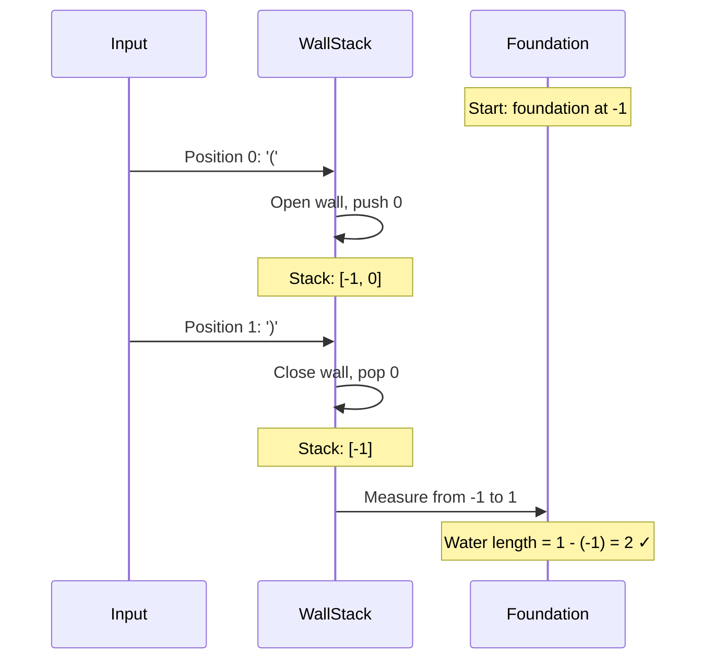
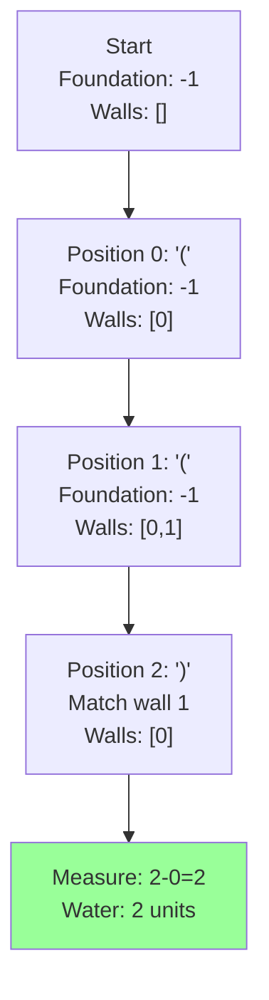
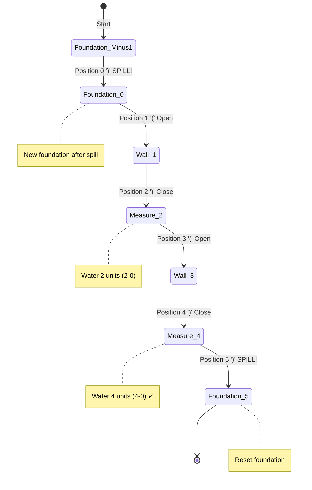

# Longest Valid Parentheses - Mental Model

## The Water Reservoir Analogy

Understanding this problem is like **measuring the longest stretch of contained water between walls**.

Imagine you're walking through a canyon with walls on both sides. Some walls open outward `(`, creating space to hold water. Some walls close inward `)`, sealing off that space. Only when walls properly match (open then close) can you actually contain water. The question is: what's the longest stretch of continuous water you can hold?

### Why This Analogy Works

**The core insight:** Valid parentheses pairs create "containers" just like matching walls create reservoirs that can hold water.

**Perfect mappings:**
- `(` opening parenthesis → **Wall opening outward** (creates space to hold water)
- `)` closing parenthesis → **Wall closing inward** (seals the container)
- Valid pair `()` → **Complete water segment** (contained between matching walls)
- Invalid sequence → **Broken container** (water spills out, can't be measured)
- Longest valid substring → **Longest continuous water stretch**

**Why this analogy and not others:**

1. **Rules map naturally:** You can't close a container before opening it (can't start with `)`)
2. **Physical constraint:** Just like you need an opening wall before a closing wall, you need `(` before `)`
3. **Continuity matters:** Water forms continuous segments - just like we need contiguous substrings
4. **The stack insight:** Walls stack up as you open more containers, and you fill them in reverse order (LIFO)
5. **The aha moment:** When you see "how much water can I hold?", using a foundation marker and measuring distances becomes obvious!

Why not a "matching pairs" or "balancing scales" analogy? Because those don't capture the **positional/distance aspect** - we need to measure LENGTH, not just count matches. Water reservoirs naturally emphasize the span/distance between walls.

## Building from the Ground Up

### The Simplest Case: `"()"`

Let's trace through the simplest valid container:

**Input:** `"()"`

```
Position: 0   1
String:   (   )
```

**Walking through the canyon:**

1. **Position 0 - See `(`:**
   - "I'm at a wall opening outward"
   - "Mark this position (0) - this could be the start of a water container"
   - Foundation marker is at: -1 (before we started)
   - Walls waiting to close: [0]

2. **Position 1 - See `)`:**
   - "I'm at a wall closing inward"
   - "Can I seal a container? Yes! I have an open wall at position 0"
   - Close the container by removing wall position 0
   - "How much water can I hold from the foundation to here?"
   - Foundation is at -1, current position is 1
   - Water length: `1 - (-1) = 2`
   - Walls waiting to close: (empty - foundation marker -1 remains)

**Result:** Longest water stretch = **2**



### Adding Complexity: `"(()"`

Now let's see what happens with nested containers and an incomplete section:

**Input:** `"(()"`

```
Position: 0   1   2
String:   (   (   )
```

**Walking through the canyon:**

1. **Position 0 - See `(`:**
   - Open wall
   - Foundation: -1
   - Walls waiting: [0]

2. **Position 1 - See `(`:**
   - Another open wall (nested container!)
   - Foundation: -1
   - Walls waiting: [0, 1]

3. **Position 2 - See `)`:**
   - Close wall
   - Match with most recent open wall (position 1)
   - Remove wall at position 1
   - Walls waiting: [0]
   - Measure water: from position 0 (current foundation) to position 2
   - Water length: `2 - 0 = 2`

**What happened to position 0?**
The wall at position 0 never got closed! It's like having an open container that never sealed - no water can be held there. But the **inner portion** (from position 1 to 2) did seal properly, creating a 2-unit water segment.

**Result:** Longest water stretch = **2**



### More Complexity: `")()())"`

Now let's handle broken containers that spill, followed by new containers:

**Input:** `")()())"`

```
Position: 0   1   2   3   4   5
String:   )   (   )   (   )   )
```

**Walking through the canyon:**

1. **Position 0 - See `)`:**
   - Close wall, but no open wall to match!
   - **Container is broken** - water spills out
   - This position becomes the new foundation (boundary)
   - Walls waiting: [] (empty, foundation moved to 0)

2. **Position 1 - See `(`:**
   - Open wall (starting fresh container after the spill)
   - Foundation: 0
   - Walls waiting: [1]

3. **Position 2 - See `)`:**
   - Close wall, matches position 1
   - Remove wall 1
   - Walls waiting: [0] (just foundation)
   - Measure: `2 - 0 = 2`
   - Water length so far: 2

4. **Position 3 - See `(`:**
   - Open wall
   - Foundation: 0
   - Walls waiting: [3]

5. **Position 4 - See `)`:**
   - Close wall, matches position 3
   - Remove wall 3
   - Walls waiting: [0] (foundation)
   - Measure: `4 - 0 = 4`
   - Water length: **4** (longest so far!)

6. **Position 5 - See `)`:**
   - Close wall, but no open wall to match!
   - **Container breaks again** - spill
   - Foundation moves to 5
   - Walls waiting: [] (empty)

**Result:** Longest water stretch = **4**

The key insight: positions 1-4 formed a continuous valid container `"()()"`, holding 4 units of water!



## What Just Happened?

We discovered that **tracking the foundation (base of the water reservoir) is crucial**.

When we encounter a closing wall `)` without a matching opening wall, it's like hitting bedrock - water can't exist below that point. That position becomes our new **foundation marker**.

As we build containers above the foundation, we measure the water span from the foundation to our current position. The walls form a **stack** because nested containers close in reverse order (last opened, first closed).

## Why the Foundation Marker Works This Way

Let's understand why we need a foundation marker separate from the wall positions:

**Scenario:** `"()"`

Without a foundation marker:
- Position 0: push wall 0
- Position 1: pop wall 0, stack is empty - how do we measure distance?

**With foundation marker at -1:**
- Position 0: push wall 0
- Position 1: pop wall 0, measure from foundation (-1) to current (1) = 2 ✓

**The foundation represents the "ground level"** - the base from which we measure water height. When containers break (unmatched `)`), we reset the foundation because water can't extend past that spill point.

Think of it like this:
- **Walls in stack** = currently open containers waiting to be sealed
- **Foundation marker** = the ground level / last spill point
- **Distance from foundation** = total continuous water held

### Why Use a Stack for Walls?

Consider nested containers: `"(())"`

```
Position 0: ( → walls [0]
Position 1: ( → walls [0, 1]  (nested inside first container)
Position 2: ) → matches wall 1 (most recent)
Position 3: ) → matches wall 0 (outer container)
```

Containers close in **reverse order** of how they opened - that's exactly what a stack gives us! The most recently opened wall (top of stack) must be closed first.

### Foundation vs Wall Position

| Situation | What Happens | Why |
|-----------|--------------|-----|
| See `(` | Push position to wall stack | Mark where container opens |
| See `)` with matching `(` | Pop wall, measure from foundation | Calculate water span |
| See `)` with no match | Move foundation to current position | Water spills, reset ground level |
| After popping wall | If stack becomes empty, use foundation | Foundation tracks continuous segment |

## Common Misconceptions

### ❌ "Just count matched pairs"

**Why it's wrong:** `"(()))"` has 2 matched pairs, but the longest valid substring is 4, not 4.

Actually, `"(())"` (first 4 chars) forms one continuous container holding 4 units of water. The last `)` causes a spill. We're measuring **distance**, not counting matches.

### ❌ "The stack stores all valid parentheses positions"

**Why it's wrong:** The stack stores **currently open walls** (unmatched `(` positions).

When we seal a container (match with `)`), we **remove** that wall from the stack and measure the water. The stack shrinks as containers close.

### ✅ "The foundation marks the last spill point or starting position"

**Why it's right:** Try `")()"`

- Position 0: `)` causes spill → foundation moves to 0
- Position 1-2: `()` forms container → measure from foundation (0) to position 2 = length 2

The foundation at 0 represents "water can't exist before this point because it spilled."

### ❌ "When the stack is empty after popping, there's no valid substring"

**Why it's wrong:** When stack becomes empty after popping, it means we've successfully closed all containers back to the foundation!

Example: `"()"`
- After popping at position 1, stack is empty
- But we measure from **foundation** (-1) to current (1) = 2 units of water ✓

The foundation is our safety net for measurement.

## Try It Yourself

**Given:** `"()(())"`

Trace through the canyon walk:

1. What happens at each position?
2. What does the wall stack look like at each step?
3. Where is the foundation at each step?
4. When do you measure water? What's the longest stretch?

<details>
<summary>Solution walkthrough</summary>

```
Position: 0   1   2   3   4   5
String:   (   )   (   (   )   )
```

| Position | Char | Action | Walls Stack | Foundation | Water Length | Max |
|----------|------|--------|-------------|------------|--------------|-----|
| Start | - | Initialize | [-1] | -1 | 0 | 0 |
| 0 | `(` | Open wall | [-1, 0] | -1 | - | 0 |
| 1 | `)` | Close wall 0 | [-1] | -1 | 1-(-1)=2 | 2 |
| 2 | `(` | Open wall | [-1, 2] | -1 | - | 2 |
| 3 | `(` | Open wall | [-1, 2, 3] | -1 | - | 2 |
| 4 | `)` | Close wall 3 | [-1, 2] | -1 | 4-2=2 | 2 |
| 5 | `)` | Close wall 2 | [-1] | -1 | 5-(-1)=6 | **6** |

**Answer:** Longest water stretch = **6** (the entire string is one continuous valid container!)

The key: after closing the wall at position 2, we measure from foundation (-1) to position 5, capturing the entire valid substring.

</details>

## The Algorithm in Plain English

**Using our water reservoir framework:**

1. **Set up foundation:** Place a foundation marker at position -1 (before the canyon starts)
   - Push -1 onto the wall stack

2. **Walk through the canyon** (for each character at position i):

   **If you see an opening wall `(`:**
   - Record this wall position by pushing i onto the stack
   - This creates space for a potential water container

   **If you see a closing wall `)`:**
   - **Try to seal a container:** Pop the most recent open wall from the stack
   - **Check what's left in the stack:**

     **If stack is now empty:**
     - This closing wall has no foundation to rest on
     - Water spills! Push current position i as the new foundation

     **If stack is not empty:**
     - Container successfully sealed!
     - Measure water: from current foundation (top of stack) to current position (i)
     - Water length = `i - stack.top()`
     - Update maximum water length if this is longer

3. **Return the maximum water length** found

**Foundation tracking:**
- Foundation starts at -1
- When water spills (unmatched `)`), the spill position becomes the new foundation
- Foundation represents "ground level" - water measures from here

## Complete Solution

```typescript
function longestValidParentheses(s: string): number {
    // Our water reservoir tracking system
    const wallStack: number[] = [];
    let longestWaterStretch = 0;

    // Place foundation marker at -1 (before canyon starts)
    wallStack.push(-1);

    // Walk through the canyon, examining each wall
    for (let position = 0; position < s.length; position++) {
        const wall = s[position];

        if (wall === '(') {
            // Opening wall - creates space to hold water
            // Record this wall position for later matching
            wallStack.push(position);
        } else {
            // Closing wall - attempts to seal a container
            // Remove the most recent open wall
            wallStack.pop();

            if (wallStack.length === 0) {
                // No foundation left! Water spilled out
                // This position becomes the new ground level
                wallStack.push(position);
            } else {
                // Container sealed successfully!
                // Measure water from current foundation to here
                const foundationLevel = wallStack[wallStack.length - 1];
                const waterLength = position - foundationLevel;

                // Track the longest continuous water stretch
                longestWaterStretch = Math.max(longestWaterStretch, waterLength);
            }
        }
    }

    return longestWaterStretch;
}
```

### Tracing the Water Reservoir

Let's trace `"()(())"` through our reservoir system:

**Initial state:**
- wallStack: [-1]
- longestWaterStretch: 0

| Step | Position | Wall | Action | wallStack | Water Measured | longestWaterStretch |
|------|----------|------|--------|-----------|----------------|---------------------|
| Start | - | - | Foundation | [-1] | - | 0 |
| 1 | 0 | `(` | Open wall | [-1, 0] | - | 0 |
| 2 | 1 | `)` | Close, measure | [-1] | 1-(-1)=2 | 2 |
| 3 | 2 | `(` | Open wall | [-1, 2] | - | 2 |
| 4 | 3 | `(` | Open wall (nested) | [-1, 2, 3] | - | 2 |
| 5 | 4 | `)` | Close inner | [-1, 2] | 4-2=2 | 2 |
| 6 | 5 | `)` | Close outer | [-1] | 5-(-1)=6 | **6** |

**Final answer:** The longest water stretch is **6** - the entire string forms one continuous valid container!

The beauty of the reservoir analogy:
- We can visualize containers opening and closing
- Foundation tracking makes sense (ground level for water)
- Measuring distance becomes natural (how much water fits?)
- Stack behavior is intuitive (nested containers close in reverse order)

### Time & Space Complexity

**Time:** O(n) - single walk through the canyon
**Space:** O(n) - wall stack can hold up to n positions in worst case (all opening walls)

This matches the physical intuition: you walk the canyon once, and you might need to track many open containers before they all seal.