# Longest Valid Parentheses - Visual Guide

## Problem Statement

Given a string containing just `(` and `)`, find the length of the **longest valid (well-formed) parentheses substring**.

```
Input: "(()"     → Output: 2   (the valid substring is "()")
Input: ")()())" → Output: 4   (the valid substring is "()()")
Input: "()(("   → Output: 2   (the valid substring is "()")
```

**Key Insight**: We need the longest **contiguous** valid substring, not the total count of matched pairs.

---

## Understanding Validity

### What Makes Parentheses Valid?

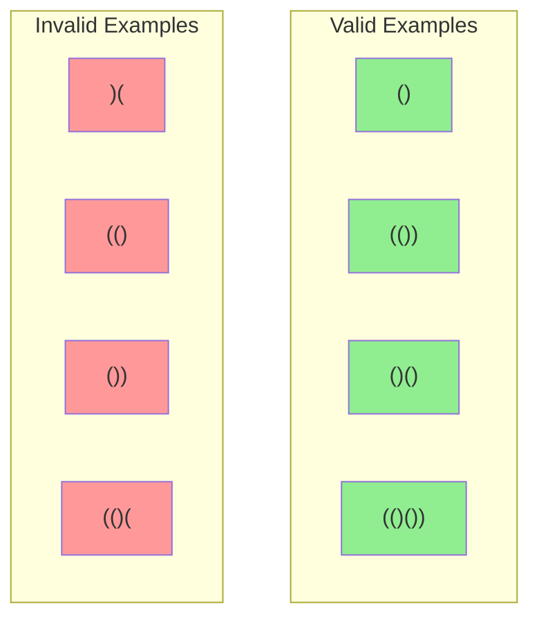

**Rules:**
- Every `)` must have a matching `(` before it
- Every `(` must have a matching `)` after it
- Parentheses must be properly nested

---

## The Stack Approach (Index-Based)

### Core Idea

Instead of storing characters, we store **indices**. This lets us calculate lengths!

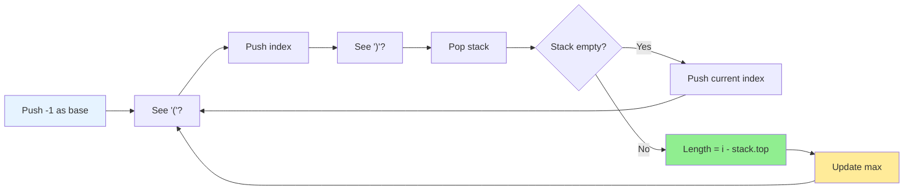

### Why Start with -1?

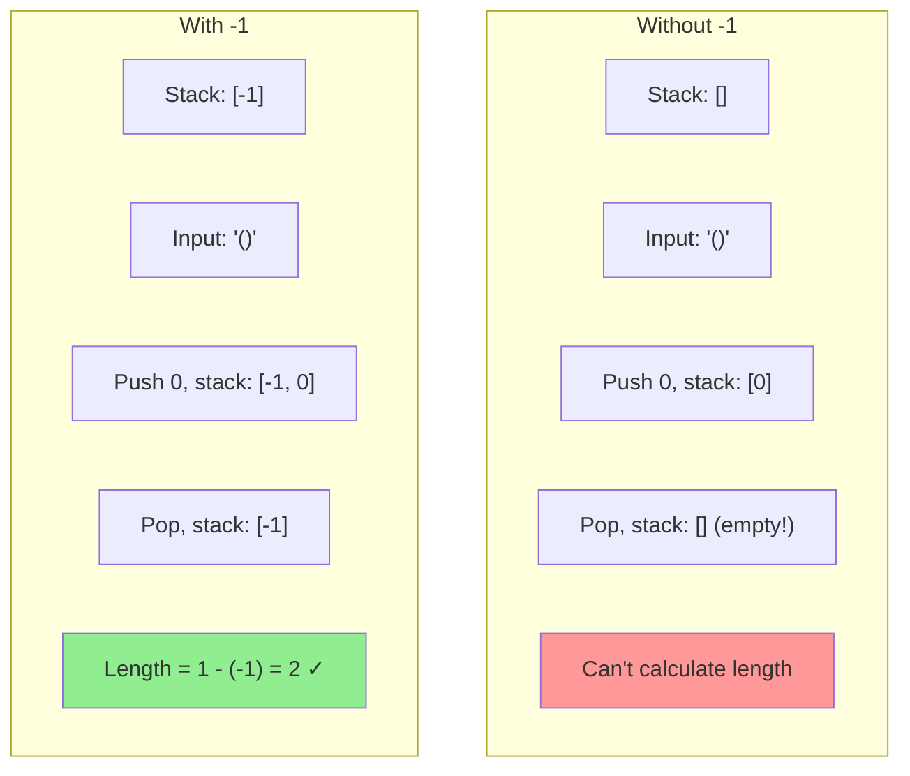

**The -1 serves as the "base" for length calculation.**

---

## Step-by-Step Visual Example

Let's trace: `"()(()"`

### Initial State

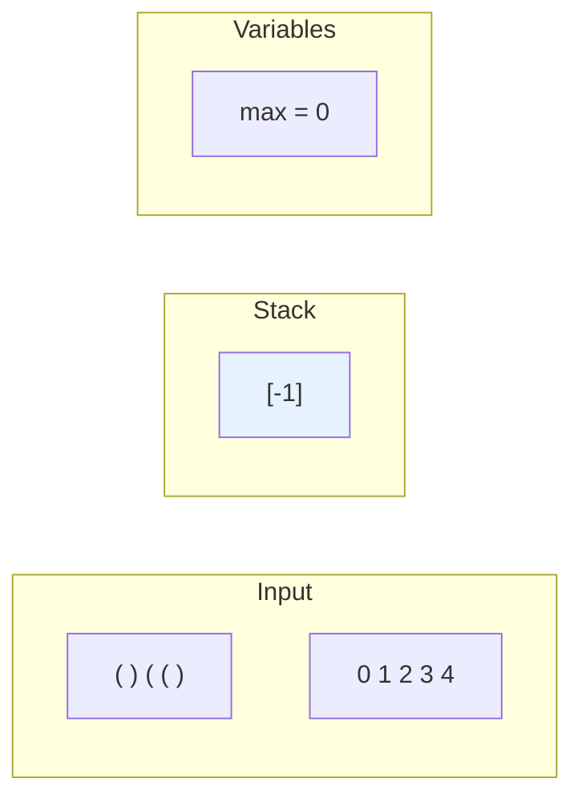

---

### Step 0: i=0, char='('

**Action**: Push index 0

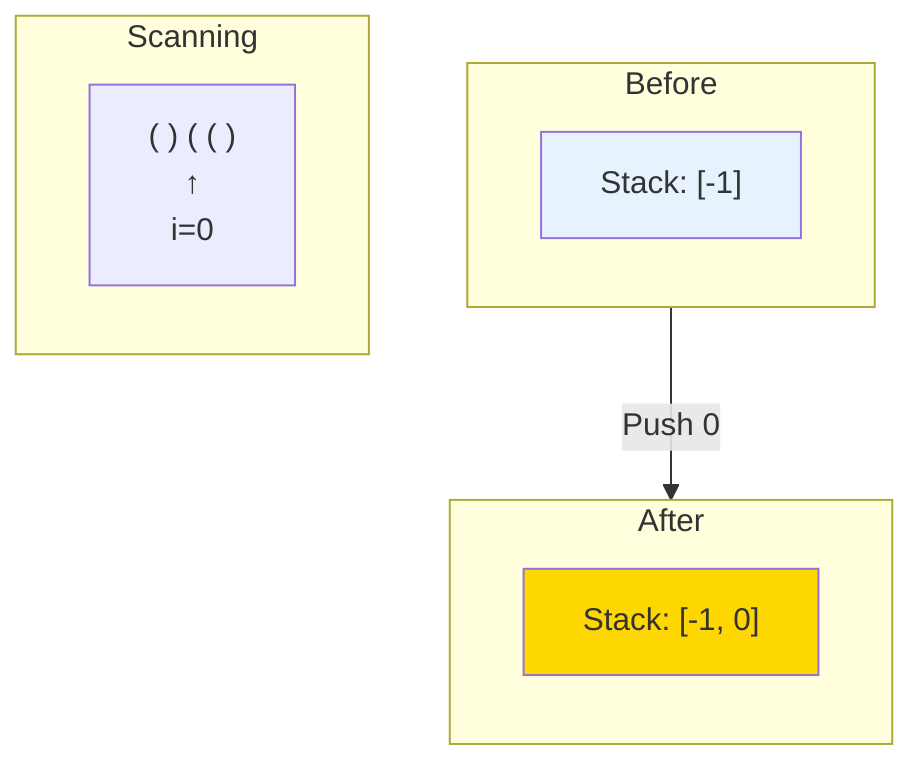

**Stack**: `[-1, 0]` | **max**: `0`

---

### Step 1: i=1, char=')'

**Action**: Pop, then calculate length

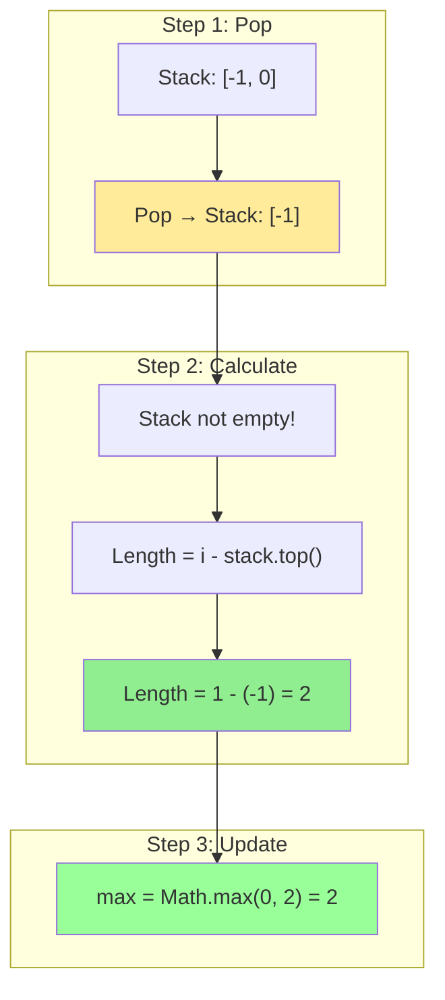

**Stack**: `[-1]` | **max**: `2`

**Key Insight**: We found a valid pair `()` of length 2!

---

### Step 2: i=2, char='('

**Action**: Push index 2

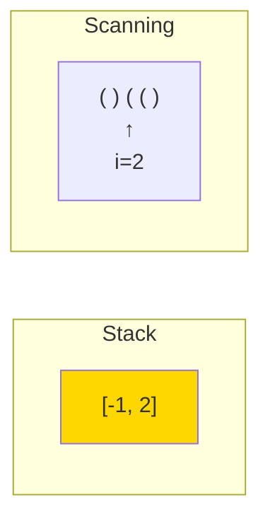

**Stack**: `[-1, 2]` | **max**: `2`

---

### Step 3: i=3, char='('

**Action**: Push index 3

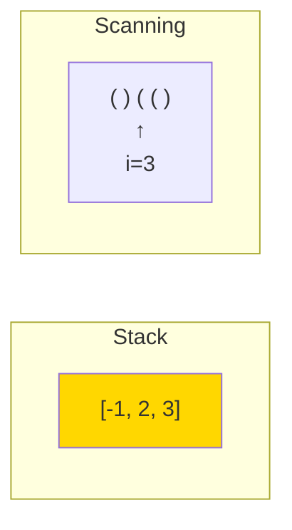

**Stack**: `[-1, 2, 3]` | **max**: `2`

---

### Step 4: i=4, char=')'

**Action**: Pop, then calculate length

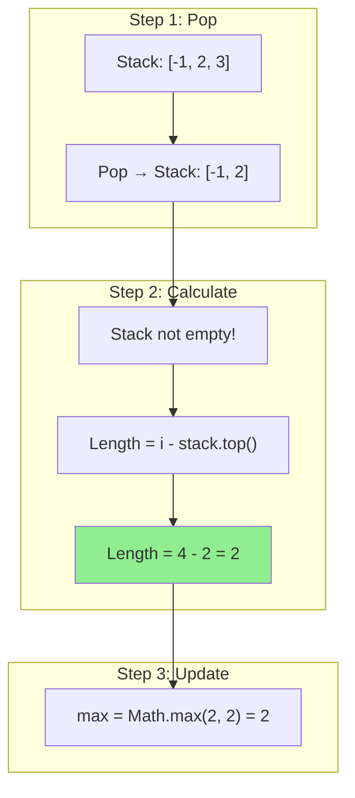

**Stack**: `[-1, 2]` | **max**: `2`

---

### Final Result

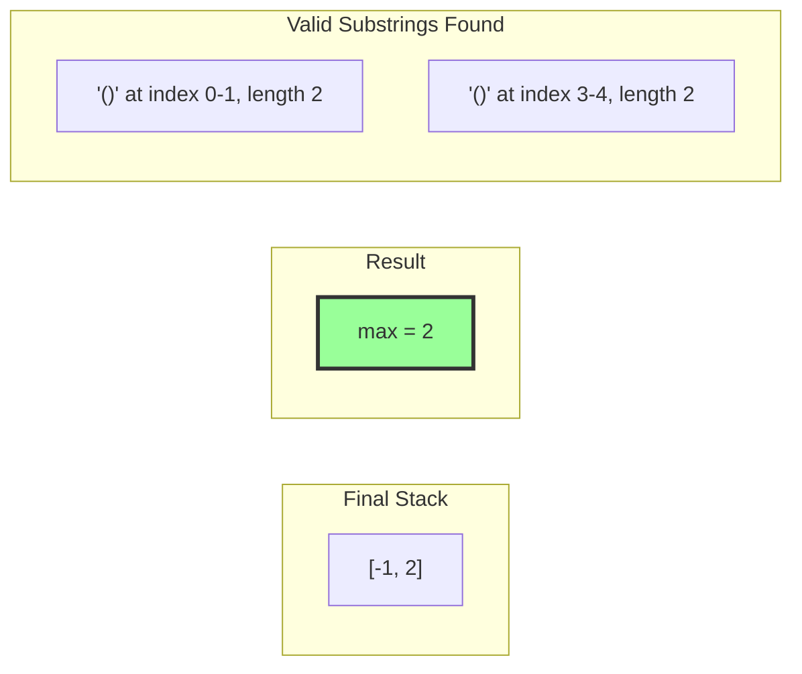

**Answer**: `2`

---

## Why Does the Length Formula Work?

### Understanding `i - stack.top()`

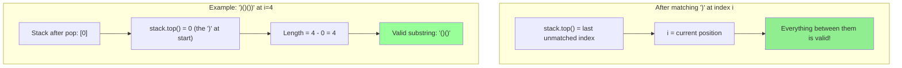

**The stack always contains indices of "boundaries" - unmatched characters that break validity.**

---

## Detailed Example: ")()())"

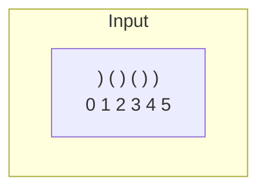

### Trace Table

| i | char | Action | Stack After | Length Calc | max |
|---|------|--------|-------------|-------------|-----|
| - | init | push -1 | [-1] | - | 0 |
| 0 | ) | pop, empty→push 0 | [0] | - | 0 |
| 1 | ( | push 1 | [0, 1] | - | 0 |
| 2 | ) | pop, calc | [0] | 2-0=2 | 2 |
| 3 | ( | push 3 | [0, 3] | - | 2 |
| 4 | ) | pop, calc | [0] | 4-0=4 | **4** |
| 5 | ) | pop, empty→push 5 | [5] | - | 4 |

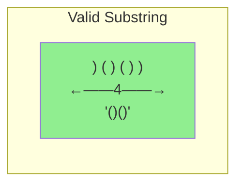

**Answer**: `4`

---

## The Key Insight: Stack as Boundary Tracker

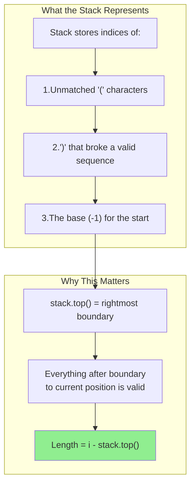

---

## Edge Cases

### Case 1: All Opening - "(((("

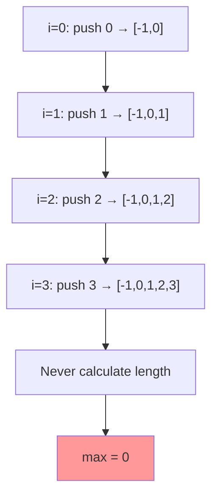

### Case 2: All Closing - "))))"

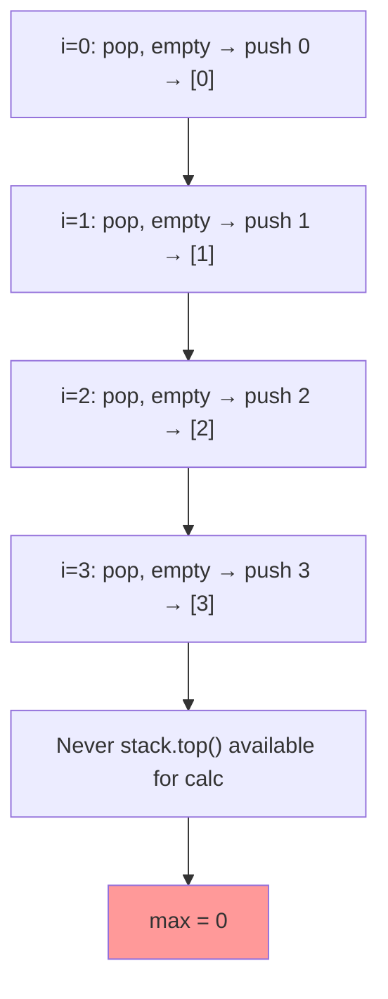

### Case 3: Perfect Match - "(())"

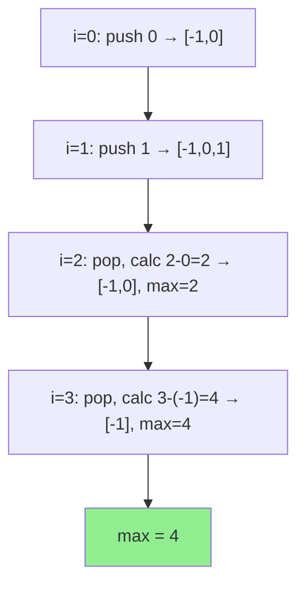

### Case 4: Consecutive Valid - "()()"

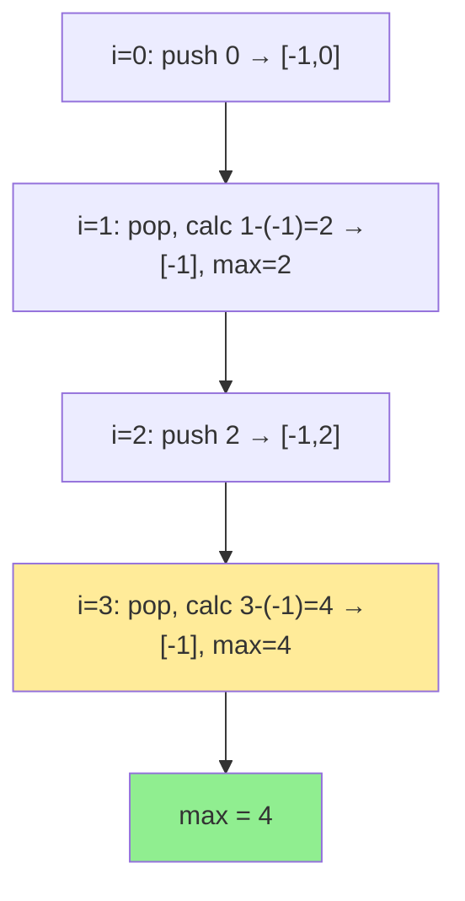

**Key**: After popping at i=3, we reach back to -1, capturing BOTH pairs!

---

## Algorithm Decision Tree

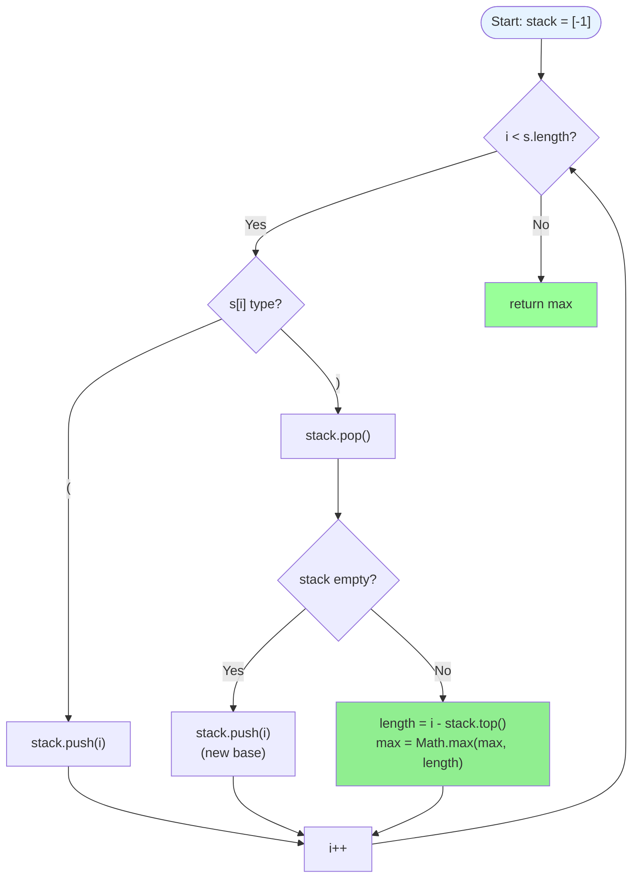

---

## Common Mistakes

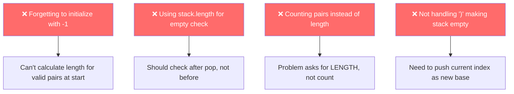

---

## Alternative Approach: Dynamic Programming

### DP Array Definition

`dp[i]` = length of longest valid parentheses **ending at index i**

```mermaid
graph TB
    subgraph "Key Insight"
        K1["Valid strings END with ')'"]
        K2["So dp[i] > 0 only when s[i] = ')'"]
    end

    subgraph "Two Cases for ')'"
        C1["Case 1: s[i-1] = '('<br/>Pattern: '...()'<br/>dp[i] = dp[i-2] + 2"]
        C2["Case 2: s[i-1] = ')'<br/>Pattern: '...))' <br/>Check if matching '(' exists"]
    end

    K1 --> K2 --> C1
    K2 --> C2

    style C1 fill:#87CEEB
    style C2 fill:#FFD700
```

### DP Transition Diagram

```mermaid
graph TB
    subgraph "Case 1: '()' pattern"
        A1["s = '...()'"]
        A2["    i-1 i"]
        A3["dp[i] = dp[i-2] + 2"]
        A4["Add 2 for this pair"]
        A5["Plus any valid before it"]
    end

    subgraph "Case 2: '))' pattern"
        B1["s = '...X...))' "]
        B2["       j    i"]
        B3["j = i - dp[i-1] - 1"]
        B4["If s[j] = '(' → match!"]
        B5["dp[i] = dp[i-1] + 2 + dp[j-1]"]
    end

    A1 --> A2 --> A3 --> A4 --> A5
    B1 --> B2 --> B3 --> B4 --> B5

    style A3 fill:#90EE90
    style B5 fill:#90EE90
```

---

## Alternative Approach: Two-Pass Counter

### The Elegant O(1) Space Solution

```mermaid
graph TB
    subgraph "Left-to-Right Pass"
        L1["Count '(' in left"]
        L2["Count ')' in right"]
        L3["If left == right → valid, update max"]
        L4["If right > left → reset both to 0"]
    end

    subgraph "Right-to-Left Pass"
        R1["Count ')' in right"]
        R2["Count '(' in left"]
        R3["If left == right → valid, update max"]
        R4["If left > right → reset both to 0"]
    end

    subgraph "Why Two Passes?"
        W1["Left pass misses: '(()'"]
        W2["Right pass catches it!"]
    end

    L1 --> L2 --> L3 --> L4
    R1 --> R2 --> R3 --> R4
    L4 --> W1 --> W2

    style L3 fill:#90EE90
    style R3 fill:#90EE90
```

### Example: "(())"

**Left-to-Right:**
```
i=0 '(': left=1, right=0
i=1 '(': left=2, right=0
i=2 ')': left=2, right=1
i=3 ')': left=2, right=2 → max = 4!
```

### Example: "(()" (Left pass misses!)

**Left-to-Right:**
```
i=0 '(': left=1, right=0
i=1 '(': left=2, right=0
i=2 ')': left=2, right=1
End: left ≠ right, never recorded
```

**Right-to-Left:**
```
i=2 ')': right=1, left=0
i=1 '(': right=1, left=1 → max = 2!
i=0 '(': right=1, left=2 → reset
```

---

## Complexity Comparison

| Approach | Time | Space | Difficulty |
|----------|------|-------|------------|
| Stack | O(n) | O(n) | Medium |
| DP | O(n) | O(n) | Hard |
| Two-Pass | O(n) | O(1) | Medium |

```mermaid
graph LR
    subgraph "Recommendation"
        R["Stack approach is most intuitive<br/>Two-pass for interviews (O(1) space)<br/>DP for learning purposes"]
    end

    style R fill:#e6f3ff
```

---

## Summary

```mermaid
flowchart TD
    P["Problem: Longest Valid Parentheses"]

    P --> S1["Stack Approach"]
    P --> S2["DP Approach"]
    P --> S3["Two-Pass Approach"]

    S1 --> K1["Track indices<br/>-1 as base<br/>Length = i - stack.top()"]
    S2 --> K2["dp[i] = valid length ending at i<br/>Two cases for ')'"]
    S3 --> K3["Count left/right<br/>Two directions<br/>O(1) space"]

    style K1 fill:#87CEEB
    style K2 fill:#FFD700
    style K3 fill:#90EE90
```

---

## Try It Yourself

Practice with: `"(()()"`

<details>
<summary>Click to see solution</summary>

**Using Stack:**
```
init: stack = [-1], max = 0
i=0 '(': push 0 → [-1, 0]
i=1 '(': push 1 → [-1, 0, 1]
i=2 ')': pop → [-1, 0], len = 2-0 = 2, max = 2
i=3 '(': push 3 → [-1, 0, 3]
i=4 ')': pop → [-1, 0], len = 4-0 = 4, max = 4

Answer: 4
```

```mermaid
graph LR
    V["( ( ) ( )<br/>  ←—4—→<br/>'()()'"]

    style V fill:#90EE90
```

</details>