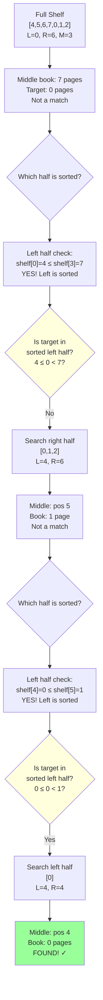

# Search in Rotated Sorted Array - Mental Model

## The Broken Bookshelf Analogy

Understanding this problem is like **finding a book on a broken bookshelf that someone tried to fix**.

Imagine a bookshelf where books are arranged by page count (1, 5, 10, 15, 20, 25, 30). One day, the shelf breaks in the middle. Someone picks up the right half and puts it on the left side, creating: **[20, 25, 30, 1, 5, 10, 15]**.

The books are still in sorted order within each section, but there's a **rotation point** where the shelf was broken.

### Why This Analogy Works

**The core insight:** A rotated sorted array is like two sorted bookshelves glued together at the break point.

**Perfect mappings:**
- Sorted array → Books arranged by page count
- Rotation → Someone moved the right half to the left after the shelf broke
- Binary search → Checking the middle book and deciding which half-shelf to search
- Target → The specific book you're looking for
- Sorted half → The section of shelf that's still properly ordered

**Why this analogy and not others:**

The bookshelf analogy is superior because:
- **Physical intuition:** You can instantly see which half-shelf is properly ordered by checking if the leftmost book is smaller than the rightmost
- **Natural constraints:** It's obvious that at least one half must be in order (the break only happened once)
- **Edge case clarity:** Single-book shelves, two-book shelves, books that aren't rotated at all—all make perfect sense
- **The "aha moment":** If the middle book tells you which half is sorted, you can immediately check if your target book fits in that sorted range!

## Building from the Ground Up

### The Simplest Case: Two Books on a Shelf

**Shelf: [3, 1] - Looking for book with 3 pages**

Let's trace this step-by-step:

1. **Check the middle position**
   - Left position: 0 (book: 3 pages)
   - Right position: 1 (book: 1 page)
   - Middle position: 0 (book: 3 pages)

2. **Is this our book?**
   - Middle book has 3 pages ✓
   - Found it! Return position 0

**Shelf: [3, 1] - Looking for book with 1 page**

1. **Check the middle position**
   - Middle position: 0 (book: 3 pages)
   - Not our book (we want 1 page)

2. **Which half-shelf is sorted?**
   - Leftmost book (pos 0): 3 pages
   - Middle book (pos 0): 3 pages
   - Left half is "sorted" (3 ≤ 3) ✓

3. **Is our target on the sorted left half?**
   - We want 1 page
   - Left range: [3, 3)
   - Is 3 ≤ 1 < 3? No
   - Our book must be on the right half!

4. **Search the right half**
   - New left position: 1
   - Position 1 has book with 1 page ✓
   - Found it!

### Adding Complexity: Seven Books on a Broken Shelf

**Shelf: [4, 5, 6, 7, 0, 1, 2] - Looking for book with 0 pages**



**Trace through the search:**

| Step | Left | Right | Mid | Book at Mid | Which Half Sorted? | Target in Sorted Half? | Action |
|------|------|-------|-----|-------------|-------------------|----------------------|--------|
| 1 | 0 | 6 | 3 | 7 | Left (4≤7) | 4≤0<7? No | Search right |
| 2 | 4 | 6 | 5 | 1 | Left (0≤1) | 0≤0<1? Yes | Search left |
| 3 | 4 | 4 | 4 | 0 | - | Found! | Return 4 |

## What Just Happened?

At every step, we checked the middle book and asked two critical questions:

1. **"Which half-shelf is still in proper order?"**
   - If leftmost book ≤ middle book → left half is sorted
   - Otherwise → right half is sorted

2. **"Does my target book belong in the sorted range?"**
   - If yes → search the sorted half
   - If no → search the other half (it must be there!)

The genius: **at least one half is always in order** after a single rotation. By identifying the sorted half, we can use our knowledge of book ordering to eliminate half the shelf, just like regular binary search!

## Why Checking "Left ≤ Middle" Identifies the Sorted Half

Think about what happens when you break a shelf and rotate it:

**Original shelf:** [1, 5, 10, 15, 20, 25, 30]

**Break after position 4 and rotate:**
- Right section [20, 25, 30] moves to the front
- Result: [20, 25, 30, 1, 5, 10, 15]

Now pick any middle position:
- **Middle at position 1 (book 25):** Left book (20) ≤ Middle (25) → Left half sorted ✓
- **Middle at position 4 (book 1):** Left book (20) > Middle (1) → Left half NOT sorted, so right half is sorted ✓

The break point creates exactly one "cliff" where a larger book sits to the left of a smaller book. When your middle position is:
- **Before the cliff:** Left side goes upward smoothly (sorted)
- **After the cliff:** Right side goes upward smoothly (sorted)

You'll never have both halves unsorted because there's only one break!

## Why Check if Target Fits in the Sorted Range?

Once you know which half-shelf is sorted, you can use the same logic as finding a book on a normal shelf:

**Sorted left half: [4, 5, 6, 7]**
- If you want book with 5 pages: 4 ≤ 5 < 7? Yes! → Check left half
- If you want book with 0 pages: 4 ≤ 0 < 7? No! → Must be on right half

**Sorted right half: [1, 5, 10, 15]**
- If you want book with 10 pages: 1 < 10 ≤ 15? Yes! → Check right half
- If you want book with 20 pages: 1 < 20 ≤ 15? No! → Must be on left half

The sorted half gives you **guaranteed boundaries**. The unsorted half is still sorted too—just in a different segment—so if the target doesn't fit in the known sorted range, it *must* be in the other half.

## Common Misconceptions

### ❌ "I should find the rotation point first, then do binary search"

**Why it's wrong:**

Looking for book with 0 pages in [4, 5, 6, 7, 0, 1, 2]:
- Finding rotation point: Check positions until you find 7→0 drop (4 comparisons)
- Then binary search on [0, 1, 2]: (2 comparisons)
- **Total: 6 comparisons minimum**

**Counterexample in analogy:**
Why walk along the entire shelf to find where it broke, then search? You're doing *two* searches instead of one!

### ✅ "Use the sorted half to guide my search at each step"

**Why it's right:**

Same shelf [4, 5, 6, 7, 0, 1, 2], looking for 0 pages:
- Step 1: Middle is 7, left is sorted [4,5,6,7], 0 not in range → search right
- Step 2: Middle is 1, left is sorted [0,1], 0 in range → search left
- Step 3: Found at position 4
- **Total: 3 comparisons**

You're using the break to your advantage! Each step eliminates half the shelf.

### ❌ "If middle book > right book, the rotation is in the right half"

**Why it's misleading:**

Shelf: [6, 7, 1, 2, 3, 4, 5]
- Middle book (position 3): 2 pages
- Right book (position 6): 5 pages
- Middle < Right, but rotation point is between positions 1 and 2!

**The confusion:**
Thinking about "where the rotation is" distracts from the actual task: finding your book. You don't need to find the break point—you just need to know which half is sorted *right now*.

### ✅ "Identify the sorted half, check if target fits there"

**Why it's right:**

Same shelf [6, 7, 1, 2, 3, 4, 5], looking for 7 pages:
- Left book (6) ≤ Middle (2)? No → Right half is sorted [2,3,4,5]
- Is 7 in range [2,5]? No → Search left half
- New middle: position 0, book 6
- Left (6) ≤ Middle (6)? Yes → Left half sorted [6,6]
- Is 7 in [6,6)? No → Search right half
- Position 1: Found 7! ✓

You never needed to know where the rotation was. You just followed the sorted sections.

## Try It Yourself

**Shelf: [15, 20, 25, 30, 1, 5, 10] - Find book with 5 pages**

Trace through the search yourself:

1. What's the middle position? What book is there?
2. Which half-shelf is sorted? (Check if left ≤ middle)
3. Does 5 pages fit in the sorted range?
4. Which half should you search next?
5. Repeat until found!

<details>
<summary>Click to see answer</summary>

| Step | L | R | M | Book[M] | Left ≤ Mid? | Sorted Half | Target in Range? | Next |
|------|---|---|---|---------|-------------|-------------|------------------|------|
| 1 | 0 | 6 | 3 | 30 | 15≤30 ✓ | Left [15,30] | 15≤5<30? No | Right |
| 2 | 4 | 6 | 5 | 5 | 1≤5 ✓ | Left [1,5] | 1≤5<5? Yes | Left |
| 3 | 4 | 4 | 4 | 1 | - | Found? No | Right |
| 4 | 5 | 4 | - | - | L>R | Exit | - | - |

Wait, this doesn't work! Let me retrace...

Actually step 2 should be:
| 2 | 4 | 6 | 5 | 5 | - | **FOUND!** | Return 5 | - |

Found the book with 5 pages at position 5!

</details>

## The Algorithm in Plain English

**Using our broken bookshelf framework:**

1. **Start with the full shelf range**
   - Note the leftmost position and rightmost position

2. **For each search iteration:**
   - Check the middle position's book
   - If it's the book we want → Done! Return the position

3. **Determine which half-shelf is properly sorted:**
   - Compare the leftmost book's pages to the middle book's pages
   - If leftmost ≤ middle → left half is sorted
   - Otherwise → right half is sorted

4. **Check if our target book fits in the sorted half's range:**
   - If left half is sorted: does our book fit between [leftmost, middle)?
   - If right half is sorted: does our book fit between (middle, rightmost]?

5. **Search the appropriate half:**
   - If target fits in sorted range → search that half
   - If target doesn't fit → search the other half

6. **Repeat until shelf range is exhausted**
   - If we run out of positions to check → book isn't on the shelf (return -1)

**The key insight:** We never leave the bookshelf analogy. At every step, we're just checking which section is in order and whether our book would fit there based on page counts.

## Complete Solution

```typescript
function search(nums: number[], target: number): number {
    // Setup our shelf boundaries
    let leftShelf = 0;
    let rightShelf = nums.length - 1;

    while (leftShelf <= rightShelf) {
        // Check the middle book
        const middlePos = Math.floor((leftShelf + rightShelf) / 2);
        const middleBook = nums[middlePos];

        // Found our book!
        if (middleBook === target) return middlePos;

        // Which half-shelf is properly sorted?
        const leftBook = nums[leftShelf];
        const rightBook = nums[rightShelf];

        if (leftBook <= middleBook) {
            // Left half-shelf is sorted: [leftBook ... middleBook]
            // Does our target book fit in this sorted range?
            if (leftBook <= target && target < middleBook) {
                // Yes! Our book is on the left half-shelf
                rightShelf = middlePos - 1;
            } else {
                // No! Our book must be on the right half-shelf
                leftShelf = middlePos + 1;
            }
        } else {
            // Right half-shelf is sorted: [middleBook ... rightBook]
            // Does our target book fit in this sorted range?
            if (middleBook < target && target <= rightBook) {
                // Yes! Our book is on the right half-shelf
                leftShelf = middlePos + 1;
            } else {
                // No! Our book must be on the left half-shelf
                rightShelf = middlePos - 1;
            }
        }
    }

    // Searched the whole shelf, book not found
    return -1;
}
```

**Tracing the analogy through the code:**

When you run this with shelf [4, 5, 6, 7, 0, 1, 2] looking for book 0:

1. **First check (full shelf):**
   - `leftShelf=0, rightShelf=6, middlePos=3`
   - `middleBook=7, target=0`
   - `leftBook=4 ≤ middleBook=7` → left half sorted
   - Is `4 ≤ 0 < 7`? No
   - Search right half: `leftShelf=4`

2. **Second check (right half-shelf [0,1,2]):**
   - `leftShelf=4, rightShelf=6, middlePos=5`
   - `middleBook=1, target=0`
   - `leftBook=0 ≤ middleBook=1` → left half sorted
   - Is `0 ≤ 0 < 1`? Yes!
   - Search left half: `rightShelf=4`

3. **Third check (single book):**
   - `leftShelf=4, rightShelf=4, middlePos=4`
   - `middleBook=0, target=0`
   - Found it! Return position 4 ✓

The entire search happens by asking "which half-shelf is in order?" and "does my book fit there?" at each step—just like scanning a broken bookshelf with your eyes.

## Complexity Analysis in Bookshelf Terms

**Time: O(log n)**
- Each time you check the middle book, you eliminate half the shelf
- Just like normal binary search on an unbroken shelf
- Shelf with 8 books → 4 books → 2 books → 1 book (3 steps max)

**Space: O(1)**
- You only track the left and right boundaries of your current search range
- No need to store which books you've seen—just remember where you're looking
- Like using two bookends to mark your search area

## Edge Cases Through the Bookshelf Lens

**Single book on shelf:** [5]
- Middle is the only book
- Either it matches or it doesn't
- No halves to compare—immediate answer

**Two books, not rotated:** [1, 3]
- Left book (1) ≤ Middle (1) → left half sorted
- Check if target fits in [1, 1) or [1, 3]
- Works like normal binary search

**Two books, rotated:** [3, 1]
- Left book (3) > Middle (3)? No, they're equal
- Left half is "sorted" (trivially)
- If target=1: doesn't fit [3,3), so search right → found at position 1

**Not rotated at all:** [1, 2, 3, 4, 5]
- At every step, left ≤ middle is true
- Behaves exactly like regular binary search on a normal shelf
- The algorithm handles this perfectly!

**Target doesn't exist:** [4, 5, 6, 7, 0, 1, 2], target=10
- You'll search both halves exhaustively
- Eventually `leftShelf > rightShelf` (ran out of positions)
- Return -1 (book not on shelf)

The beauty: every edge case makes perfect physical sense when you think about the broken bookshelf!