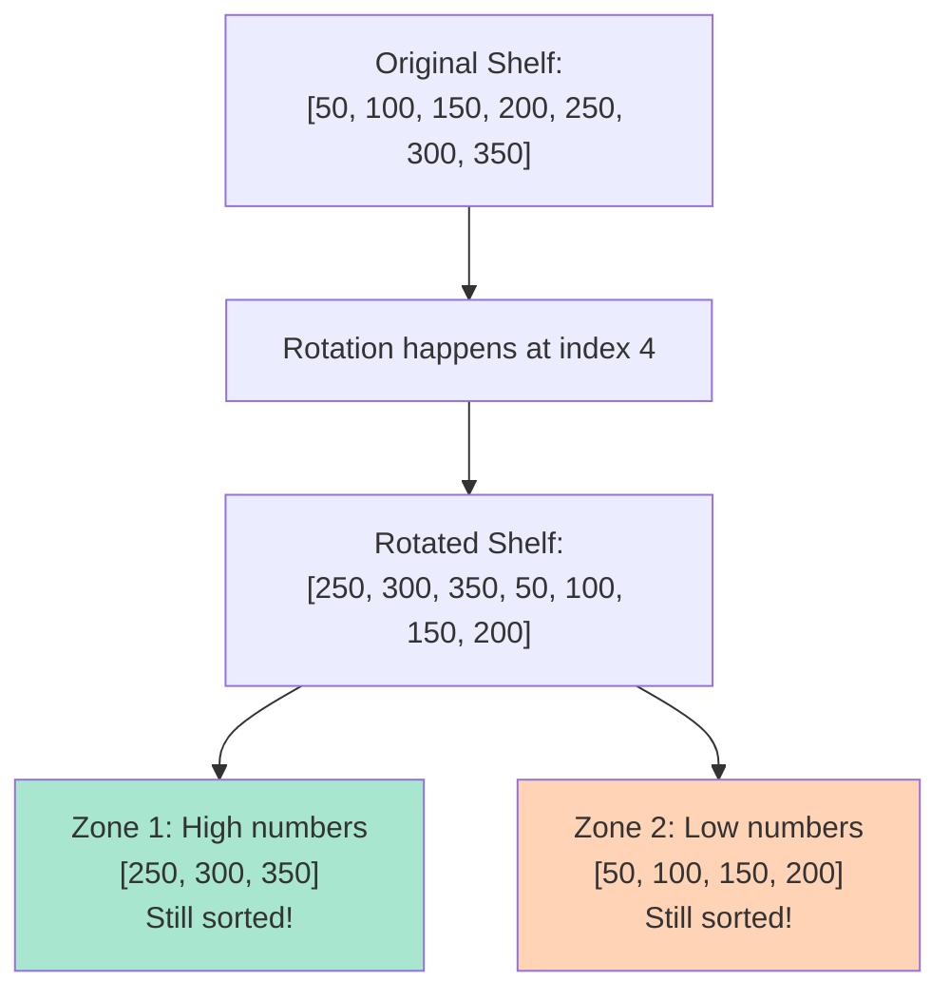
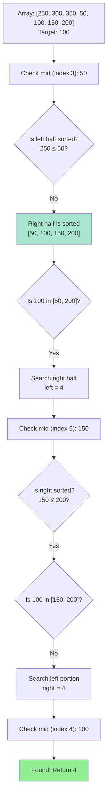

# Search in Rotated Sorted Array - Mental Model

## The Broken Bookshelf Analogy

Understanding this problem is like finding a specific book on a bookshelf that got knocked over and rotated.

**How the analogy maps to the problem:**
- **The bookshelf** → Our sorted array that got rotated
- **Books arranged by page count** → Numbers in ascending order
- **The shelf got knocked and rotated** → Array rotation at some pivot point
- **Finding a book with specific page count** → Finding the target value
- **Checking sections efficiently** → Binary search approach
- **The break point** → Where the rotation happened (where order breaks)

## Understanding the Analogy (No Code Yet!)

### The Setup

Imagine you have a bookshelf with books organized perfectly by page count from left to right: 50, 100, 150, 200, 250, 300, 350 pages.

One day, someone accidentally knocks the shelf, causing some books from the left side to rotate to the right side. Now your shelf looks like: 250, 300, 350, 50, 100, 150, 200.

You need to find a book with a specific page count, but you can't just scan every book (that would be too slow). You need to be smart about which section of the shelf to search.

**The key insight:** Even though the shelf is rotated, BOTH sides still have their own internal order:
- Left section: 250, 300, 350 (still ascending!)
- Right section: 50, 100, 150, 200 (still ascending!)

There's just ONE place where the order breaks—where the rotation happened (between 350 and 50).

### How It Works

When you're standing in front of your rotated bookshelf, you can look at the MIDDLE book and make an intelligent decision about which half to search.

Here's the brilliant realization: **At least ONE half of the shelf will always be properly sorted** (no break point in it).

Let's say you pick up the middle book and examine it. You can determine:

1. **Is the LEFT half properly sorted?** Compare the leftmost book with the middle book. If leftmost < middle, the left half is sorted without any rotation break.

2. **Is the RIGHT half properly sorted?** Compare the middle book with the rightmost book. If middle < rightmost, the right half is sorted without any rotation break.

Once you identify which half is properly sorted, you can use normal logic:
- **If the sorted half could contain your target** (target falls within its range), search that half
- **Otherwise**, the target MUST be in the other half (even though it contains the break point)

This is powerful because you're cutting your search space in HALF each time, just like regular binary search, but you're being smart about handling the rotation.

### Why This Approach

Think about it this way: the rotation creates two sorted "zones" on the shelf. When you pick the middle book, one of these things is ALWAYS true:

- **Scenario A:** The middle book is in the first zone (higher numbers). The left half is purely in this zone (properly sorted), while the right half crosses into the second zone (contains the break).

- **Scenario B:** The middle book is in the second zone (lower numbers). The right half is purely in this zone (properly sorted), while the left half would cross backwards into the first zone (impossible, so left must be sorted).

By identifying which half is properly sorted, you can make a confident decision about where to search next.

### Simple Example Through the Analogy

**Bookshelf:** [250, 300, 350, 50, 100, 150, 200]
**Looking for:** 100 pages

**Step 1: Check the middle book**
- Position 3 (middle of 0-6): 50 pages
- Leftmost book: 250 pages
- Rightmost book: 200 pages

**Step 2: Which half is properly sorted?**
- Is left half sorted? 250 ≤ 50? NO! Left half contains the break point.
- Is right half sorted? 50 ≤ 200? YES! Right half is properly sorted (50, 100, 150, 200).

**Step 3: Could the target be in the sorted half?**
- Target is 100 pages
- Right half ranges from 50 to 200 pages
- Does 100 fall in [50, 200]? YES!

**Step 4: Search the right half**
- New search space: [100, 150, 200] (positions 4-6)
- Middle: 150 pages
- Is right half sorted? 150 ≤ 200? YES!
- Does 100 fall in [150, 200]? NO! Must be in left portion.

**Step 5: Search the left portion**
- New search space: [100] (position 4)
- Middle: 100 pages
- Found it! Return position 4.

Now you understand HOW to solve the problem. Let's translate this to code.

---

## Building the Algorithm Step-by-Step

Now we'll translate each part of our bookshelf mental model into code.

### Step 1: Set Up the Search Boundaries

**In our analogy:** We need to know where our bookshelf starts and ends.

**In code:**
```typescript
function search(nums: number[], target: number): number {
    let left = 0;                    // Leftmost position on shelf
    let right = nums.length - 1;     // Rightmost position on shelf
}
```

**Why:** These pointers represent the current section of the shelf we're examining. We'll adjust them as we narrow down our search.

### Step 2: Keep Searching Until We Find the Book or Run Out of Space

**Adding to our code:**
```typescript
function search(nums: number[], target: number): number {
    let left = 0;
    let right = nums.length - 1;

    while (left <= right) {
        // Keep searching as long as there's space to check
    }

    return -1;  // Book not found on the shelf
}
```

**Why:** The while loop continues as long as we have a valid section to search. When `left > right`, we've exhausted all possibilities.

### Step 3: Find the Middle Book

**In our analogy:** Pick up the book in the middle of our current section to make a decision.

**Adding to our code:**
```typescript
function search(nums: number[], target: number): number {
    let left = 0;
    let right = nums.length - 1;

    while (left <= right) {
        const mid = Math.floor((left + right) / 2);  // Middle position

        // Check if this is the book we're looking for
        if (nums[mid] === target) {
            return mid;  // Found it!
        }
    }

    return -1;
}
```

**Why:** Before doing anything else, check if we got lucky and picked the exact book we need. If so, we're done!

### Step 4: Determine Which Half is Properly Sorted

**In our analogy:** Compare the leftmost book with the middle book to see if the left half is sorted without breaks.

**The key logic:**
```typescript
function search(nums: number[], target: number): number {
    let left = 0;
    let right = nums.length - 1;

    while (left <= right) {
        const mid = Math.floor((left + right) / 2);

        if (nums[mid] === target) {
            return mid;
        }

        // Is the LEFT half properly sorted?
        if (nums[left] <= nums[mid]) {
            // Left half is sorted: [left...mid] has no break point
        } else {
            // Left half has the break point, so RIGHT half must be sorted
        }
    }

    return -1;
}
```

**Why:** If `nums[left] <= nums[mid]`, it means books are ascending from left to middle with no rotation break. Otherwise, the break is in the left half, making the right half sorted.

### Step 5: Check if Target Could Be in the Sorted Half

**In our analogy:** Once we know which half is properly sorted, check if our target book's page count falls within that sorted range.

**For the LEFT half being sorted:**
```typescript
if (nums[left] <= nums[mid]) {
    // Left half is sorted [left...mid]
    // Could target be in this sorted range?
    if (nums[left] <= target && target < nums[mid]) {
        right = mid - 1;  // Yes! Search left half
    } else {
        left = mid + 1;   // No! Must be in right half
    }
}
```

**Why:** If the left half is sorted and contains books from (say) 50 to 200 pages, we can definitively say whether a 100-page book could be there. If yes, search that half. If no, it MUST be in the other half.

**For the RIGHT half being sorted:**
```typescript
else {
    // Right half is sorted [mid...right]
    // Could target be in this sorted range?
    if (nums[mid] < target && target <= nums[right]) {
        left = mid + 1;   // Yes! Search right half
    } else {
        right = mid - 1;  // No! Must be in left half
    }
}
```

**Why:** Same logic, but now we're checking if the target falls within the right half's sorted range.

### Step 6: Complete Algorithm

**In our analogy:** Putting it all together—we repeatedly check the middle, identify the sorted half, determine which side to search, and adjust our boundaries.

**Complete solution:**
```typescript
function search(nums: number[], target: number): number {
    let left = 0;
    let right = nums.length - 1;

    while (left <= right) {
        const mid = Math.floor((left + right) / 2);

        // Found the exact book!
        if (nums[mid] === target) {
            return mid;
        }

        // Is LEFT half properly sorted?
        if (nums[left] <= nums[mid]) {
            // Left half is sorted: check if target is in this range
            if (nums[left] <= target && target < nums[mid]) {
                right = mid - 1;  // Search left half
            } else {
                left = mid + 1;   // Search right half
            }
        } else {
            // RIGHT half must be sorted: check if target is in this range
            if (nums[mid] < target && target <= nums[right]) {
                left = mid + 1;   // Search right half
            } else {
                right = mid - 1;  // Search left half
            }
        }
    }

    return -1;  // Book not found
}
```

---

## Visualizing the Rotated Bookshelf

Here's how the rotated bookshelf creates two sorted zones:



### How Binary Search Adapts to the Break Point



---

## Tracing Through an Example

Let's trace finding the book with **100 pages** on shelf: **[250, 300, 350, 50, 100, 150, 200]**

| Step | Left | Right | Mid | nums[mid] | Analysis | Action |
|------|------|-------|-----|-----------|----------|--------|
| 1 | 0 | 6 | 3 | 50 | Left half (250 ≤ 50)? **NO** → Right is sorted [50-200]<br/>Is 100 in [50, 200]? **YES** | Search right: `left = 4` |
| 2 | 4 | 6 | 5 | 150 | Right half (150 ≤ 200)? **YES** → Right is sorted [150-200]<br/>Is 100 in [150, 200]? **NO** | Search left: `right = 4` |
| 3 | 4 | 4 | 4 | 100 | **nums[mid] === target** | **Found! Return 4** |

**Key Observations:**
- Each step cuts the search space in half
- We correctly identified which half was sorted
- We made decisions based on whether target could be in the sorted range
- Total steps: 3 (much better than checking all 7 books!)

---

## Common Misconceptions

### ❌ "The array is completely unsorted because of rotation"

**Why it's wrong:** While the array isn't fully sorted from start to end, it contains TWO perfectly sorted segments.

**In our analogy:** The bookshelf wasn't scrambled—it was rotated. The books in each zone are still in perfect order. Zone 1 has [250, 300, 350] in ascending order, and Zone 2 has [50, 100, 150, 200] in ascending order.

**In code:** This is why we can still use binary search! We just need to identify which segment we're in.

### ❌ "I need to find the rotation point first, then do binary search"

**Why it's wrong:** You don't need a separate pass to find the rotation point. You handle it while searching.

**In our analogy:** You don't need to find exactly where the shelf broke before looking for your book. You figure out which section is intact and make decisions based on that.

**In code:** The condition `if (nums[left] <= nums[mid])` already tells us which half is properly sorted. We don't need extra work.

### ✅ "At every step, at least one half is guaranteed to be sorted"

**Why it's right:** The rotation creates exactly ONE break point in the entire array. When you split at the middle, at most ONE half can contain that break point—the other half MUST be clean.

**In our analogy:** The shelf broke in one place. When you divide the shelf in half, one side is definitely intact (no break), so you can trust its ordering.

**In code:** This is the foundation of our algorithm. We confidently identify the sorted half and reason about it.

---

## Try It Yourself

**Challenge:** Find the book with **300 pages** on shelf: **[200, 250, 300, 350, 50, 100, 150]**

**Walk through the analogy:**
1. What's the middle book?
2. Which half is properly sorted?
3. Could 300 pages be in the sorted half's range?
4. Which direction do you search?
5. Repeat until found!

**Expected path:**
- Start: left=0, right=6, mid=3 → Book 350
- Left half sorted [200-350], 300 in range? YES → search left
- Next: left=0, right=2, mid=1 → Book 250
- Left half sorted [200-250], 300 in range? NO → search right
- Next: left=2, right=2, mid=2 → Book 300 → **Found!**

**In code, this would return index 2.**

---

## Time Complexity: Why O(log n)?

**In our analogy:** Each time you check the middle book, you eliminate HALF of the remaining shelf from consideration.

- 100 books → check 1, eliminate 50 → 50 left
- 50 books → check 1, eliminate 25 → 25 left
- 25 books → check 1, eliminate 12 → 13 left
- ...and so on

**How many times can you cut in half?** About log₂(n) times. For 100 books, that's only about 7 checks!

**Why this works despite rotation:** Because we're smart about identifying the sorted half at each step, we maintain the same "cut in half" property as regular binary search.

---

## The Key Insight

The brilliant realization is that **rotation doesn't destroy order—it just splits it into two zones**.

By identifying which zone is on which side of your middle point, you can make confident decisions about where to search next, maintaining the O(log n) efficiency of binary search even on a rotated array.

Think of it like a bookshelf that got knocked but not scrambled. The books are still organized; they're just in two segments instead of one continuous segment. Your job is to figure out which segment contains your target book—and you do that by recognizing which half of your current view is intact.
