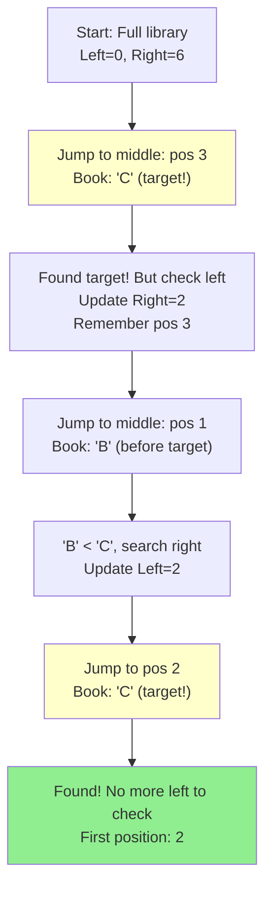
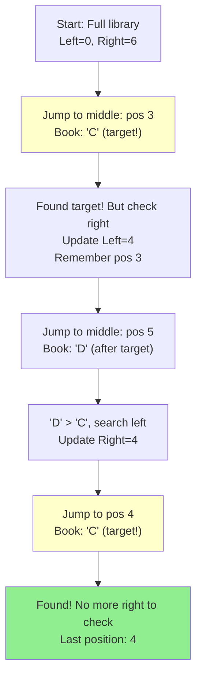

# Find First and Last Position - Mental Model

## The Library Book Collection Analogy

Understanding this problem is like **finding the shelf range where all copies of the same book are stored in a massive library**.

### Why This Analogy Works

**The core insight:** When books are sorted alphabetically and you have multiple identical copies together, you don't need to scan every book—you can use the shelf labels to jump to sections and find where that book's section starts and ends.

**Perfect mappings:**
- Sorted array → Books organized alphabetically on shelves
- Target value → The specific book title you're looking for
- Array indices → Shelf positions (0, 1, 2, 3...)
- Finding first position → Locating the leftmost copy of the book
- Finding last position → Locating the rightmost copy of the book
- Binary search → Reading section labels and jumping to middle shelves
- O(log n) requirement → Can't walk shelf-by-shelf; must use labels to jump efficiently

**Why this analogy and not others:**

This analogy captures the essence of binary search on sorted data better than alternatives:
- **Rules map naturally:** Just like you can't find a book faster than O(log n) in a sorted library using labels, you need binary search for the time constraint
- **Edge cases make sense:** "Book not in library" = return [-1, -1], "only one copy" = both positions are the same
- **The "aha moment":** You realize you need to search TWICE—once looking for the leftmost copy (even if you find the book, keep searching left), and once for the rightmost (keep searching right)
- **Boundary concept is visual:** The "first position" is literally the left boundary of that book's section, "last position" is the right boundary

## Building from the Ground Up

### The Simplest Case: Finding a Single Book

Imagine a tiny library with just 7 books on a shelf:

```
Shelf positions: [0] [1] [2] [3] [4] [5] [6]
Books:           [A] [B] [C] [C] [C] [D] [E]
```

**Task:** Find the shelf range for book "C"

**Walking the shelf (the slow way):**
- Start at position 0: "A" - not C, keep going
- Position 1: "B" - not C, keep going
- Position 2: "C" - Found it! This is the first copy
- Position 3: "C" - Still C, keep tracking
- Position 4: "C" - Still C, keep tracking
- Position 5: "D" - Not C anymore, so position 4 was the last

**Answer:** [2, 4] (Book C occupies positions 2 through 4)

**Problem:** This took 6 steps for 7 books. In a library with 1,000,000 books, this would take forever!

### Using Section Labels (Binary Search)

Now imagine the library has section labels so you can jump to the middle:

```
Shelf positions: [0] [1] [2] [3] [4] [5] [6]
Books:           [A] [B] [C] [C] [C] [D] [E]
                  └────┬───────┘ └────┬────┘
                   Left half   Right half
```

Let's build the algorithm step by step, showing how each library concept translates to code.

## Step 1: Setting Up the Library Labels

**In the library:** We need labels to mark where we're searching (left edge and right edge of our search area).

**In code:**

```typescript
let leftLabel = 0;                    // Start of the library
let rightLabel = shelves.length - 1;  // End of the library
```

For our example: `leftLabel = 0`, `rightLabel = 6`

## Step 2: Jumping to the Middle Shelf

**In the library:** To use section labels efficiently, we jump to the middle position between our left and right labels.

**In code:**

```typescript
const middleShelf = Math.floor((leftLabel + rightLabel) / 2);
```

For our example (leftLabel=0, rightLabel=6): `middleShelf = Math.floor((0 + 6) / 2) = 3`

This is how we "jump" to position 3 instead of walking shelf by shelf!

## Step 3: Reading the Book at That Position

**In the library:** Check what book is at the middle shelf position.

**In code:**

```typescript
const bookAtMiddle = shelves[middleShelf];
```

For our example: `shelves[3] = "C"` (found the target book!)

## Step 4: Making a Decision (The Core Logic)

Now here's where finding the LEFT boundary differs from finding the RIGHT boundary.

### Finding the FIRST Copy (Left Boundary)

**In the library:** When we find book "C" at position 3, we ask: "Could there be copies to the LEFT?"

**In code (left boundary logic):**

```typescript
if (bookAtMiddle === targetBook) {
    // Found the book! But is this the leftmost copy?
    boundaryPosition = middleShelf;  // Remember this as a candidate

    // Check if there are copies to the LEFT
    // by searching the left section
    rightLabel = middleShelf - 1;
}
```

**What this does:**
- Remember position 3 as a potential answer
- Update `rightLabel = 3 - 1 = 2` (search positions 0-2 next)
- This "shrinks" our search area to the left half

### Finding the LAST Copy (Right Boundary)

**In the library:** When we find book "C" at position 3, we ask: "Could there be copies to the RIGHT?"

**In code (right boundary logic):**

```typescript
if (bookAtMiddle === targetBook) {
    // Found the book! But is this the rightmost copy?
    boundaryPosition = middleShelf;  // Remember this as a candidate

    // Check if there are copies to the RIGHT
    // by searching the right section
    leftLabel = middleShelf + 1;
}
```

**What this does:**
- Remember position 3 as a potential answer
- Update `leftLabel = 3 + 1 = 4` (search positions 4-6 next)
- This "shrinks" our search area to the right half

## Step 5: Handling Books That Come Before or After

**In the library:** If the book at the middle shelf is NOT our target, we need to decide which direction to search.

**In code:**

```typescript
if (bookAtMiddle < targetBook) {
    // This book comes BEFORE our target alphabetically
    // Our target must be in the RIGHT section
    leftLabel = middleShelf + 1;
}
else if (bookAtMiddle > targetBook) {
    // This book comes AFTER our target alphabetically
    // Our target must be in the LEFT section
    rightLabel = middleShelf - 1;
}
```

**Example:** At position 1, we find "B" which is less than "C", so we search right (leftLabel = 2).

## Step 6: Keep Looping Until We've Narrowed Down

**In the library:** We keep jumping to middle positions until our labels cross (leftLabel > rightLabel), which means we've checked everywhere.

**In code:**

```typescript
while (leftLabel <= rightLabel) {
    // Jump to middle, read book, make decision
    // (all the code from steps 2-5)
}
```

When `leftLabel > rightLabel`, we've exhausted all possibilities and our `boundaryPosition` holds the answer.

## Putting It All Together: Complete Left Boundary Search

```typescript
function findFirstPosition(shelves: number[], targetBook: number): number {
    let leftLabel = 0;
    let rightLabel = shelves.length - 1;
    let boundaryPosition = -1;  // -1 means "not found"

    while (leftLabel <= rightLabel) {
        // Step 2: Jump to middle
        const middleShelf = Math.floor((leftLabel + rightLabel) / 2);

        // Step 3: Read the book
        const bookAtMiddle = shelves[middleShelf];

        // Step 4 & 5: Make a decision
        if (bookAtMiddle === targetBook) {
            // Found it! Remember and search LEFT for earlier copies
            boundaryPosition = middleShelf;
            rightLabel = middleShelf - 1;
        }
        else if (bookAtMiddle < targetBook) {
            // Book comes before target, search RIGHT
            leftLabel = middleShelf + 1;
        }
        else {
            // Book comes after target, search LEFT
            rightLabel = middleShelf - 1;
        }
    }

    return boundaryPosition;
}
```

**Tracing with `[A, B, C, C, C, D, E]` and target "C":**

| Iteration | leftLabel | rightLabel | middleShelf | bookAtMiddle | Decision | boundaryPosition |
|-----------|-----------|------------|-------------|--------------|----------|------------------|
| 1 | 0 | 6 | 3 | C | Found! Search left (right=2) | 3 |
| 2 | 0 | 2 | 1 | B | B < C, search right (left=2) | 3 |
| 3 | 2 | 2 | 2 | C | Found! Search left (right=1) | 2 |
| Done | 2 | 1 | - | - | left > right, stop | **2** |

**Answer:** Position 2 is the first copy of "C"

## Now for the Right Boundary: Just One Change!

The code is almost identical, with ONE key difference:

```typescript
function findLastPosition(shelves: number[], targetBook: number): number {
    let leftLabel = 0;
    let rightLabel = shelves.length - 1;
    let boundaryPosition = -1;

    while (leftLabel <= rightLabel) {
        const middleShelf = Math.floor((leftLabel + rightLabel) / 2);
        const bookAtMiddle = shelves[middleShelf];

        if (bookAtMiddle === targetBook) {
            // Found it! Remember and search RIGHT for later copies
            boundaryPosition = middleShelf;
            leftLabel = middleShelf + 1;  // ← ONLY DIFFERENCE: search right instead of left
        }
        else if (bookAtMiddle < targetBook) {
            leftLabel = middleShelf + 1;
        }
        else {
            rightLabel = middleShelf - 1;
        }
    }

    return boundaryPosition;
}
```

**Tracing with `[A, B, C, C, C, D, E]` and target "C":**

| Iteration | leftLabel | rightLabel | middleShelf | bookAtMiddle | Decision | boundaryPosition |
|-----------|-----------|------------|-------------|--------------|----------|------------------|
| 1 | 0 | 6 | 3 | C | Found! Search right (left=4) | 3 |
| 2 | 4 | 6 | 5 | D | D > C, search left (right=4) | 3 |
| 3 | 4 | 4 | 4 | C | Found! Search right (left=5) | 4 |
| Done | 5 | 4 | - | - | left > right, stop | **4** |

**Answer:** Position 4 is the last copy of "C"

**The beauty:** Same algorithm, just one line changes depending on which boundary we're finding!

## What About When the Book Isn't in the Library?

```
Shelf positions: [0] [1] [2] [3] [4] [5] [6]
Books:           [A] [B] [D] [D] [D] [E] [F]
```

**Task:** Find book "C"

**In the library:** We keep jumping and narrowing our search, but we never find book "C".

**In code:** The `boundaryPosition` stays at `-1` (our initial value for "not found").

**Tracing the search:**

| Iteration | leftLabel | rightLabel | middleShelf | bookAtMiddle | Decision | boundaryPosition |
|-----------|-----------|------------|-------------|--------------|----------|------------------|
| 1 | 0 | 6 | 3 | D | D > C, search left (right=2) | -1 |
| 2 | 0 | 2 | 1 | B | B < C, search right (left=2) | -1 |
| 3 | 2 | 2 | 2 | D | D > C, search left (right=1) | -1 |
| Done | 2 | 1 | - | - | left > right, stop | **-1** |

**Answer:** -1 (book not found)

**What just happened?** We never hit the `if (bookAtMiddle === targetBook)` condition, so `boundaryPosition` remained -1. This naturally handles the "book not in library" case!

## What Just Happened? The Key Insights

We built the algorithm step-by-step and discovered:

**1. The Core Pattern is Binary Search**
- Jump to middle: `Math.floor((left + right) / 2)`
- Compare: Is the book before, at, or after the target?
- Update labels: Move left or right based on comparison

**2. The Modification: Don't Stop When You Find It**
- Traditional binary search: `if (found) return position`
- Our version: `if (found) { remember position; keep searching }`

**3. The One-Line Difference**
- Left boundary: `rightLabel = middleShelf - 1` (search left after finding)
- Right boundary: `leftLabel = middleShelf + 1` (search right after finding)

**4. Natural Edge Case Handling**
- Not found? `boundaryPosition` stays `-1`
- Only one copy? Both searches find the same position
- All elements are target? Left finds index 0, right finds last index

## Why TWO Searches Work This Way

**Why can't we find both boundaries in one search?**

Imagine you jump to the middle and find book "C" at position 3:

```
[A] [B] [C] [C] [C] [D] [E]
         ^
      Found it!
```

You know "C" exists, but you don't know:
- How many positions to the LEFT have "C"? (Could be 0, could be many)
- How many positions to the RIGHT have "C"? (Could be 0, could be many)

**The library doesn't give you a "count" label**—it only tells you what book is at each position. So you must:
1. Search left: Keep using section labels to find the leftmost "C"
2. Search right: Keep using section labels to find the rightmost "C"

**Why not just walk left/right after finding one copy?**

That would violate the O(log n) requirement! In a library with 1,000,000 books, if 500,000 of them are book "C", you'd walk 500,000 positions. The section labels (binary search) let you jump efficiently to the boundaries.

## From Standard Binary Search to Our Solution

Let's see how our algorithm evolves from the classic binary search you already know.

### Standard Binary Search (Find ANY occurrence)

```typescript
function standardBinarySearch(shelves: number[], targetBook: number): number {
    let left = 0;
    let right = shelves.length - 1;

    while (left <= right) {
        const middle = Math.floor((left + right) / 2);

        if (shelves[middle] === targetBook) {
            return middle;  // ← STOPS immediately when found!
        }
        else if (shelves[middle] < targetBook) {
            left = middle + 1;
        }
        else {
            right = middle - 1;
        }
    }

    return -1;
}
```

**Problem:** This returns as soon as it finds ANY copy of the book. For `[A, B, C, C, C, D, E]`, it might return 2, 3, or 4 - we don't know which copy!

### Modified Binary Search (Find FIRST occurrence)

```typescript
function findFirstOccurrence(shelves: number[], targetBook: number): number {
    let left = 0;
    let right = shelves.length - 1;
    let result = -1;  // ← Track the leftmost position found

    while (left <= right) {
        const middle = Math.floor((left + right) / 2);

        if (shelves[middle] === targetBook) {
            result = middle;        // ← Remember this position
            right = middle - 1;     // ← But keep searching LEFT!
        }
        else if (shelves[middle] < targetBook) {
            left = middle + 1;
        }
        else {
            right = middle - 1;
        }
    }

    return result;
}
```

**The change:** Instead of returning immediately, we remember the position and keep searching left. The last position we remember will be the leftmost!

### Why Walking After Finding Fails

**Naive approach:** "Use standard binary search to find the book, then walk left and right to find boundaries"

```typescript
function naiveSolution(shelves: number[], targetBook: number): number[] {
    // Find ANY occurrence with standard binary search (O(log n))
    let middle = standardBinarySearch(shelves, targetBook);
    if (middle === -1) return [-1, -1];

    // Walk left to find first occurrence (O(n) in worst case!)
    let first = middle;
    while (first > 0 && shelves[first - 1] === targetBook) {
        first--;
    }

    // Walk right to find last occurrence (O(n) in worst case!)
    let last = middle;
    while (last < shelves.length - 1 && shelves[last + 1] === targetBook) {
        last++;
    }

    return [first, last];
}
```

**Example where this fails the time requirement:**

```
Library with 1,000,001 books, all are book "C" except the edges:
[A] [C] [C] [C] ... [C] [C] [C] [D]
    └─── 999,999 copies of C ───┘
```

- Standard binary search finds "C" in ~20 jumps (log₂ 1,000,000 ≈ 20)
- Then you walk left 500,000 steps and right 500,000 steps
- **Total: 1,000,020 steps** ❌ This is O(n), not O(log n)!

**Our approach:**
- Left boundary search: ~20 jumps
- Right boundary search: ~20 jumps
- **Total: ~40 jumps** ✓ This is O(log n)!

**The insight:** Never walk! Use binary search twice with different goals.

## Common Misconceptions

### ❌ "Once I find the target, I can stop searching"

**Why it's wrong:**

In a library:
```
[C] [C] [C] [C] [C]
         ^
   You found C here!
```

If you stop, you'd return position 2 for both first and last. But the actual range is [0, 4]. You found *a* copy, not the boundaries of where all copies live.

### ✅ "Finding the target is just the beginning—now find the edges"

**Why it's right:**

When searching for the left boundary, even if you find book "C" at position 3, you think: "Great, but are there copies at positions 0, 1, 2?" Keep searching left until you can't find any more copies.

### ❌ "I need to track the first position I found and search from there"

**Why it's wrong:**

Each boundary search is **independent**. They both use the same technique of jumping to section labels from the full library. You don't "start from where you found it"—you start from the beginning both times.

### ✅ "I run two complete binary searches with different boundary goals"

**Why it's right:**

Think of them as two separate questions:
1. "Where does book C's section START in the library?" (left boundary)
2. "Where does book C's section END in the library?" (right boundary)

Each question gets answered with a full binary search, just with different "keep left" vs "keep right" logic.

## Try It Yourself

Given this library:

```
Shelf positions: [0] [1] [2] [3] [4] [5] [6] [7] [8]
Books:           [1] [2] [3] [7] [7] [7] [7] [8] [9]
```

**Task:** Find the shelf range for book "7"

**Trace the algorithm manually:**

### Finding First Position of "7"

Fill in this table:

| Iteration | leftLabel | rightLabel | middleShelf = floor((left+right)/2) | bookAtMiddle | Decision | boundaryPosition |
|-----------|-----------|------------|-------------------------------------|--------------|----------|------------------|
| Start | 0 | 8 | ? | ? | ? | -1 |
| 1 | ? | ? | ? | ? | ? | ? |
| 2 | ? | ? | ? | ? | ? | ? |
| ... | ? | ? | ? | ? | ? | ? |

**Questions to guide you:**
1. First jump: `middle = floor((0+8)/2) = ?`
2. What book is at that position?
3. If it's "7", do you search left or right? (Hint: finding FIRST position)
4. If it's not "7", is it less than or greater than "7"? Which way do you search?
5. Keep going until `leftLabel > rightLabel`

### Finding Last Position of "7"

Now trace the same process, but when you find "7", search in the opposite direction!

**Expected answer:** [3, 6]

**Bonus challenge:** What would change in the code if the array was sorted in descending order instead of ascending?

## The Algorithm in Plain English

**Using our library framework:**

### Finding the Left Boundary (First Position):

1. **Start with the full library** (left label = 0, right label = last position)
2. **While you haven't narrowed down to an impossible range:**
   - Jump to the middle shelf position
   - Read the book title at that position
   - **If the book title is less than target:** The target must be in the RIGHT section (update left label)
   - **If the book title is greater than or equal to target:** The target could be HERE or in the LEFT section (update right label, remember this position as a candidate)
3. **Return the leftmost position where you found the target** (or -1 if never found)

### Finding the Right Boundary (Last Position):

1. **Start with the full library** (left label = 0, right label = last position)
2. **While you haven't narrowed down to an impossible range:**
   - Jump to the middle shelf position
   - Read the book title at that position
   - **If the book title is less than or equal to target:** The target could be HERE or in the RIGHT section (update left label, remember this position as a candidate)
   - **If the book title is greater than target:** The target must be in the LEFT section (update right label)
3. **Return the rightmost position where you found the target** (or -1 if never found)

**The key difference:** When you find the exact book:
- Left boundary: Keep searching LEFT (there might be copies earlier on the shelf)
- Right boundary: Keep searching RIGHT (there might be copies later on the shelf)

## Visualizing the Search Process

### Left Boundary Search (Finding the First Copy)



### Right Boundary Search (Finding the Last Copy)



### Complete State Progression

For array `[A, B, C, C, C, D, E]` finding target "C":

| Step | Search Type | Left Label | Right Label | Middle Pos | Book at Middle | Decision | Candidate |
|------|-------------|------------|-------------|------------|----------------|----------|-----------|
| 1 | Left boundary | 0 | 6 | 3 | C | Found! Search left | 3 |
| 2 | Left boundary | 0 | 2 | 1 | B | Too early, search right | 3 |
| 3 | Left boundary | 2 | 2 | 2 | C | Found! This is leftmost | **2** |
| 4 | Right boundary | 0 | 6 | 3 | C | Found! Search right | 3 |
| 5 | Right boundary | 4 | 6 | 5 | D | Too late, search left | 3 |
| 6 | Right boundary | 4 | 4 | 4 | C | Found! This is rightmost | **4** |

**Final answer:** [2, 4]

## The Final Algorithm: Unifying Both Searches

Now we can see that finding the first and last positions are really the **same algorithm** with just one difference. Let's combine them elegantly:

```typescript
function searchRange(nums: number[], target: number): number[] {
    // Ask the library two questions:
    // 1. Where does this book's section START?
    // 2. Where does this book's section END?
    const firstShelfPosition = findLibraryBoundary(nums, target, true);
    const lastShelfPosition = findLibraryBoundary(nums, target, false);

    return [firstShelfPosition, lastShelfPosition];
}

function findLibraryBoundary(
    shelves: number[],
    targetBook: number,
    findingLeftBoundary: boolean
): number {
    let leftLabel = 0;
    let rightLabel = shelves.length - 1;
    let boundaryPosition = -1; // -1 means "book not in library"

    // Keep jumping to section labels until we've narrowed down completely
    while (leftLabel <= rightLabel) {
        // STEP 1: Jump to the middle shelf between our labels
        const middleShelf = Math.floor((leftLabel + rightLabel) / 2);

        // STEP 2: Read what book is at that position
        const bookAtMiddle = shelves[middleShelf];

        // STEP 3: Make a decision based on what we found
        if (bookAtMiddle === targetBook) {
            // Found a copy of the book! Remember this position
            boundaryPosition = middleShelf;

            // THE KEY DIFFERENCE: Which direction do we keep searching?
            if (findingLeftBoundary) {
                // Looking for FIRST copy: check if there are copies to the LEFT
                rightLabel = middleShelf - 1;
            } else {
                // Looking for LAST copy: check if there are copies to the RIGHT
                leftLabel = middleShelf + 1;
            }
        }
        else if (bookAtMiddle < targetBook) {
            // This book comes BEFORE our target alphabetically
            // Our target must be in the RIGHT section
            leftLabel = middleShelf + 1;
        }
        else {
            // This book comes AFTER our target alphabetically
            // Our target must be in the LEFT section
            rightLabel = middleShelf - 1;
        }
    }

    // Return the boundary position we found (or -1 if book not in library)
    return boundaryPosition;
}
```

## Visualizing the Complete Execution

**Given:** `shelves = [A, B, C, C, C, D, E]`, `targetBook = "C"`

### Finding First Position (findingLeftBoundary = true)

```
Initial: leftLabel=0, rightLabel=6, boundaryPosition=-1

Iteration 1:
  middleShelf = floor((0+6)/2) = 3
  bookAtMiddle = shelves[3] = "C" ✓ Found!
  boundaryPosition = 3
  Search LEFT: rightLabel = 3-1 = 2

  Library state:
  [A] [B] [C] [C] [C] [D] [E]
   └────SEARCHING────┘ │   │
        0     2     3 (no longer searching here)

Iteration 2:
  middleShelf = floor((0+2)/2) = 1
  bookAtMiddle = shelves[1] = "B"
  "B" < "C", search RIGHT: leftLabel = 1+1 = 2

  Library state:
  [A] [B] [C] [C] [C] [D] [E]
        │  └─┘
        1   2 (searching only position 2 now)

Iteration 3:
  middleShelf = floor((2+2)/2) = 2
  bookAtMiddle = shelves[2] = "C" ✓ Found!
  boundaryPosition = 2 (update to earlier position!)
  Search LEFT: rightLabel = 2-1 = 1

  Now: leftLabel=2, rightLabel=1 → leftLabel > rightLabel, STOP

Result: boundaryPosition = 2 (first copy of "C")
```

### Finding Last Position (findingLeftBoundary = false)

```
Initial: leftLabel=0, rightLabel=6, boundaryPosition=-1

Iteration 1:
  middleShelf = floor((0+6)/2) = 3
  bookAtMiddle = shelves[3] = "C" ✓ Found!
  boundaryPosition = 3
  Search RIGHT: leftLabel = 3+1 = 4

  Library state:
  [A] [B] [C] [C] [C] [D] [E]
                    │ └──SEARCHING──┘
                    3     4     5   6

Iteration 2:
  middleShelf = floor((4+6)/2) = 5
  bookAtMiddle = shelves[5] = "D"
  "D" > "C", search LEFT: rightLabel = 5-1 = 4

  Library state:
  [A] [B] [C] [C] [C] [D] [E]
                    │  └┘
                    3  4 (searching only position 4 now)

Iteration 3:
  middleShelf = floor((4+4)/2) = 4
  bookAtMiddle = shelves[4] = "C" ✓ Found!
  boundaryPosition = 4 (update to later position!)
  Search RIGHT: leftLabel = 4+1 = 5

  Now: leftLabel=5, rightLabel=4 → leftLabel > rightLabel, STOP

Result: boundaryPosition = 4 (last copy of "C")
```

**Final answer:** `[2, 4]` - Book "C" occupies shelf positions 2 through 4!

## The Beauty of This Approach

**Time Complexity:** O(log n)
- Each boundary search is a binary search: log n jumps
- Two searches: 2 × log n = O(log n)
- Even if the book occupies half the library, we find boundaries in ~40 jumps for 1 million books!

**Space Complexity:** O(1)
- We only need a few labels (left, right, middle, boundary)
- No matter how big the library, we use the same small amount of memory

**The core insight:**
In a sorted library, you don't need to walk shelf-by-shelf to find where a book section starts and ends. Jump to section labels, and let the alphabetical order guide you to both boundaries efficiently!