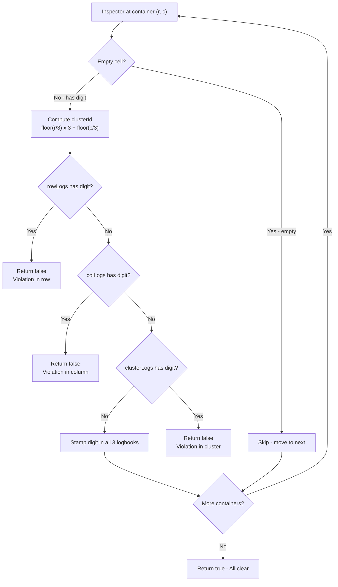

# Valid Sudoku - Mental Model

## The Customs Inspector Analogy

Understanding this problem is like being a customs inspector auditing a 9×9 grid of shipping containers in a bonded warehouse.

## Understanding the Analogy (No Code Yet!)

### The Setup

Imagine a warehouse with a 9×9 grid of shipping containers — 81 containers total, arranged in 9 rows and 9 columns. Each container either holds one specific cargo item (labeled 1 through 9) or sits empty. A previous shift loaded some containers; your job as the customs inspector is to verify that all cargo follows the warehouse's strict regulations.

The warehouse has three regulations that must hold simultaneously:
- **Row regulation:** No two containers in the same horizontal row may hold the same cargo label
- **Column regulation:** No two containers in the same vertical column may hold the same cargo label
- **Cluster regulation:** The warehouse is divided into nine 3×3 clusters (arranged three across and three tall). No two containers within the same cluster may hold the same cargo label

The crucial detail: every container with cargo belongs to exactly three territories at once — its row, its column, and its 3×3 cluster. A container at position (row 5, column 7) belongs to row 5, column 7, and cluster 5 (the middle-right 3×3 block). When you inspect it, you must check all three territories simultaneously.

### The Three Logbooks

You carry three sets of logbooks on your clipboard:
- **Row logbooks:** 9 logbooks, one per horizontal row, recording which cargo labels have been seen in that row
- **Column logbooks:** 9 logbooks, one per vertical column, recording which cargo labels have been seen in that column
- **Cluster logbooks:** 9 logbooks, one per 3×3 cluster, recording which cargo labels have been seen in that cluster

All logbooks start completely empty at the beginning of the audit.

### How It Works

You walk through the warehouse systematically — starting at the top-left container, moving left to right across each row, then dropping down to the next row. For each container you inspect:

1. If the container is **empty**, you skip it — no cargo means no regulation to check, and no logbook to update.
2. If the container has **cargo**, you consult the three relevant logbooks: the logbook for this row, the logbook for this column, and the logbook for this cluster.
3. If the cargo label appears in **any** of the three logbooks, you've found a violation — two containers in the same territory share the same cargo. The audit fails immediately; you stop and report the board as invalid.
4. If the cargo label appears in **none** of the three logbooks, you stamp it into all three logbooks simultaneously and move to the next container.

The professional discipline here: you always check all three logbooks before stamping, and you always stamp all three after clearing. A cargo item that passes one logbook check but fails another is still a violation. Consistency is everything.

### Finding the Right Cluster Logbook

Knowing which cluster logbook to use requires a simple calculation. The nine clusters are arranged in a 3×3 grid of their own:

| | Cols 0–2 | Cols 3–5 | Cols 6–8 |
|---|---|---|---|
| **Rows 0–2** | Cluster 0 | Cluster 1 | Cluster 2 |
| **Rows 3–5** | Cluster 3 | Cluster 4 | Cluster 5 |
| **Rows 6–8** | Cluster 6 | Cluster 7 | Cluster 8 |

To find the cluster for any container at (row, col):
- The **row-band** is which third the row falls into: rows 0–2 → band 0, rows 3–5 → band 1, rows 6–8 → band 2
- The **column-band** is which third the column falls into: same logic
- The cluster ID = row-band × 3 + column-band

Container at (row 5, col 7): row-band = 1, column-band = 2. Cluster = 1×3 + 2 = **5**. That's the middle-right cluster — exactly what the table shows.

### Why This Approach

The elegance of carrying logbooks is that they let you enforce all three regulations in a single left-to-right, top-to-bottom pass through all 81 containers. You never backtrack. You never re-examine a container you already processed. Each container is inspected once, its three logbooks consulted once, and its stamp placed once.

Without the logbooks, you'd have to re-scan the entire row, entire column, and entire cluster for every container you touch — tedious and slow. The logbooks turn "have I seen this cargo before in this territory?" from a full scan into an instant lookup. The audit runs in one smooth pass.

### Simple Example Through the Analogy

Inspecting just the first row of the warehouse:

```
Row 0: [5, 3, ., ., 7, ., ., ., .]
```

- **Container (0,0):** Cargo "5", cluster 0. Row 0 logbook is empty. Column 0 logbook is empty. Cluster 0 logbook is empty. ✓ Stamp "5" in all three.
- **Container (0,1):** Cargo "3", cluster 0. Row 0 logbook has {"5"} — no "3". Column 1 logbook is empty. Cluster 0 logbook has {"5"} — no "3". ✓ Stamp "3" in all three.
- **Container (0,2):** Empty. Skip.
- **Container (0,3):** Empty. Skip.
- **Container (0,4):** Cargo "7", cluster 1. Row 0 logbook has {"5","3"} — no "7". Column 4 logbook is empty. Cluster 1 logbook is empty. ✓ Stamp "7" in all three.

Row 0 complete — no violations. The logbooks now hold memories from this row that will protect against duplicates in later rows.

Now you understand HOW to solve the problem. Let's translate this to code.

---

## How I Think Through This

The problem asks whether a partially-filled Sudoku board is valid — meaning no digit appears twice in the same row, column, or 3×3 box. The key insight is that every filled cell simultaneously belongs to three territories: its row, its column, and its 3×3 block. I create three arrays — `rowLogs`, `colLogs`, and `clusterLogs` — each holding 9 sets, one set per territory. Then I scan every cell with a nested loop, row by row. For each filled cell at position (r, c), I compute its cluster ID using `Math.floor(r/3) * 3 + Math.floor(c/3)`, which maps the nine 3×3 blocks to IDs 0–8. I check all three sets — `rowLogs[r]`, `colLogs[c]`, `clusterLogs[clusterId]` — and if any already contains the current digit, I return false immediately. If none contain it, I add the digit to all three and continue. The discipline that keeps this correct is always checking all three before stamping, and stamping all three when clear — never one without the others. If every cell passes, I return true.

Take the first row: `["5","3",".",".","7",".",".",".","."]`. At cell (0,0), digit "5", clusterId = `floor(0/3)*3 + floor(0/3)` = 0. All three logbooks are empty — stamp "5" into rowLogs[0], colLogs[0], clusterLogs[0]. At cell (0,1), digit "3", clusterId = 0. rowLogs[0] has {"5"} (no "3"), colLogs[1] is empty, clusterLogs[0] has {"5"} (no "3") — clear, stamp "3" in all three. At cell (0,4), digit "7", clusterId = 1. rowLogs[0] has {"5","3"} (no "7"), colLogs[4] is empty, clusterLogs[1] is empty — stamp "7" in all three. Now suppose an illegal board has "5" at cell (1,0): rowLogs[0] still holds {"5","3","7"}, and `rowLogs[0].has("5")` fires immediately — violation caught, return false.

---

## Building the Algorithm Step-by-Step

Now we'll translate each part of the customs inspection into code.

### Step 1: Creating the Logbooks

**In our analogy:** Three sets of logbooks — 9 row logbooks, 9 column logbooks, 9 cluster logbooks — all starting empty.

**In code:**
```typescript
const rowLogs: Set<string>[] = Array.from({length: 9}, () => new Set());
const colLogs: Set<string>[] = Array.from({length: 9}, () => new Set());
const clusterLogs: Set<string>[] = Array.from({length: 9}, () => new Set());
```

**Why:** Each `Set<string>` is one logbook — it records which cargo labels (digits "1"–"9") have been stamped for that territory. We need 9 of each because there are 9 rows, 9 columns, and 9 clusters.

### Step 2: Walking Through the Warehouse

**In our analogy:** The inspector moves left-to-right, then top-to-bottom through all 81 containers.

**Adding to our code:**
```typescript
const rowLogs: Set<string>[] = Array.from({length: 9}, () => new Set());
const colLogs: Set<string>[] = Array.from({length: 9}, () => new Set());
const clusterLogs: Set<string>[] = Array.from({length: 9}, () => new Set());

for (let r = 0; r < 9; r++) {
    for (let c = 0; c < 9; c++) {
        // Inspector is now at container (r, c)
    }
}
```

**Why:** The nested loop visits all 81 containers exactly once. Outer loop for rows, inner loop for columns — matching the left-to-right, top-to-bottom walk.

### Step 3: Skipping Empty Containers

**In our analogy:** If a container is empty, the inspector moves on — no cargo, no check needed.

**Adding to our code:**
```typescript
for (let r = 0; r < 9; r++) {
    for (let c = 0; c < 9; c++) {
        const cargo = board[r][c];

        if (cargo === '.') continue;  // Empty container — skip
    }
}
```

**Why:** The `'.'` character represents an empty cell. These cells don't violate any regulation and don't need to be recorded in any logbook.

### Step 4: Computing the Cluster ID

**In our analogy:** The inspector determines which cluster logbook to consult by finding the row-band and column-band.

**Adding to our code:**
```typescript
for (let r = 0; r < 9; r++) {
    for (let c = 0; c < 9; c++) {
        const cargo = board[r][c];

        if (cargo === '.') continue;

        const clusterId = Math.floor(r / 3) * 3 + Math.floor(c / 3);
    }
}
```

**Why:** `Math.floor(r / 3)` gives the row-band (0, 1, or 2). `Math.floor(c / 3)` gives the column-band (0, 1, or 2). Multiplying row-band by 3 and adding the column-band produces a unique cluster ID from 0 to 8, matching our cluster table.

### Step 5: Checking All Three Logbooks and Stamping

**In our analogy:** Check all three logbooks. If the cargo appears in any, violation — halt. If none, stamp all three and continue.

**Complete algorithm:**
```typescript
function isValidSudoku(board: string[][]): boolean {
    const rowLogs: Set<string>[] = Array.from({length: 9}, () => new Set());
    const colLogs: Set<string>[] = Array.from({length: 9}, () => new Set());
    const clusterLogs: Set<string>[] = Array.from({length: 9}, () => new Set());

    for (let r = 0; r < 9; r++) {
        for (let c = 0; c < 9; c++) {
            const cargo = board[r][c];

            if (cargo === '.') continue;

            const clusterId = Math.floor(r / 3) * 3 + Math.floor(c / 3);

            // Check all three logbooks
            if (rowLogs[r].has(cargo) || colLogs[c].has(cargo) || clusterLogs[clusterId].has(cargo)) {
                return false;  // Violation found!
            }

            // Stamp into all three logbooks
            rowLogs[r].add(cargo);
            colLogs[c].add(cargo);
            clusterLogs[clusterId].add(cargo);
        }
    }

    return true;  // All containers passed inspection
}
```

---

## Tracing Through an Example

Let's trace a violation to see the inspector catch it.

**Board (first two rows, showing a violation):**
```
Row 0: [5, 3, ., ., 7, ., ., ., .]
Row 1: [5, ., ., 1, 9, ., ., ., .]  <- "5" at (1,0) conflicts with (0,0)!
```

| Container | Cargo | ClusterId | rowLogs check | colLogs check | clusterLogs check | Action |
|-----------|-------|-----------|---------------|---------------|-------------------|--------|
| (0,0) | "5" | 0 | empty — pass | empty — pass | empty — pass | Stamp all 3 |
| (0,1) | "3" | 0 | {"5"} no "3" — pass | empty — pass | {"5"} no "3" — pass | Stamp all 3 |
| (0,2) | "." | — | — | — | — | Skip |
| (0,3) | "." | — | — | — | — | Skip |
| (0,4) | "7" | 1 | {"5","3"} no "7" — pass | empty — pass | empty — pass | Stamp all 3 |
| ... | ... | ... | ... | ... | ... | ... |
| (1,0) | "5" | 0 | {"5","3","7"} — **"5" found!** | — | — | **Return false** |

The inspector catches the "5" at (1,0) because `rowLogs[0]` was stamped with "5" when container (0,0) was processed. Same territory, same cargo label — violation halts the audit.

---

## Visual: The Inspection Flowchart



---

## Common Misconceptions

### "I only need to check one logbook at a time"

Wrong. Each container is part of three territories simultaneously. Checking only the row logbook ignores column and cluster violations. A "5" could appear once per row but twice in the same column — that's still invalid.

The inspector must check all three logbooks for every container, not one at a time across separate passes.

### "I need three separate passes — one for rows, one for columns, one for clusters"

Wrong. Three separate passes is unnecessary and inefficient. A single pass with three logbooks catches everything in one walk-through, because the logbooks accumulate memory as you go.

The right discipline: one loop, three sets, one stamp per container after all three checks pass.

### "The cluster formula is complicated — I should hardcode which cells belong to which cluster"

Wrong. The formula `Math.floor(r/3) * 3 + Math.floor(c/3)` naturally produces cluster IDs 0–8 for any (r, c). You don't need lookup tables or special cases — the math handles every container correctly.

Integer division by 3 groups consecutive rows/columns into bands of three. Multiplying one band by 3 and adding the other gives a unique combination — the same logic behind how you'd number boxes on a shelf.

---

## Try It Yourself

**Exercise:** Trace through these three containers and determine if a violation occurs:

```
(0,0) = "9"
(3,0) = "9"   <- Does this violate anything?
(0,6) = "9"   <- Does this violate anything?
```

**Walk through using the analogy:**

1. Inspect (0,0): cargo "9", cluster 0. All logbooks empty — stamp "9" in rowLogs[0], colLogs[0], clusterLogs[0].
2. Inspect (3,0): cargo "9", cluster 3. Check rowLogs[3] (empty — row 3 hasn't been stamped). Check colLogs[0] — has {"9"}! **Violation in column 0 — return false.**
3. We never reach (0,6) because the violation at (3,0) ends the inspection.

**Key insight from the analogy:** The column logbook carries memory from row 0 all the way into the inspection of row 3. That's why column violations are caught even across rows that are far apart. The logbooks don't reset between rows — they persist for the entire audit.
