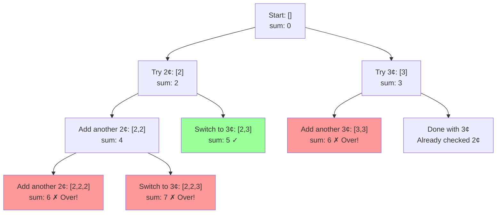
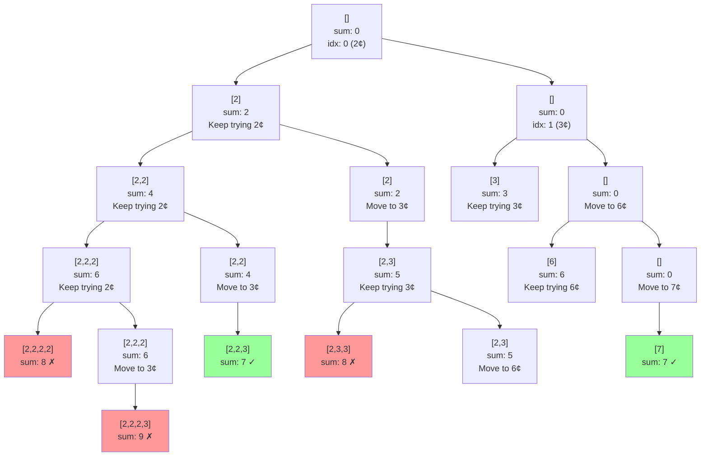

# Combination Sum - Mental Model

## The Vending Machine Analogy

Imagine you're at a vending machine that only accepts exact change. You have unlimited coins of certain denominations (say, 2¢, 3¢, 6¢, and 7¢), and you need to make exactly 7¢.

The catch? **You can use the same coin denomination as many times as you want**, but you need to find **every possible way** to make exact change.

- **Candidates array** = The coin denominations available in your pocket
- **Target** = The exact price you need to pay (7¢)
- **Current combination** = The coins you're currently holding in your hand
- **Recursion** = Deciding "should I add another coin of this type, or move to the next denomination?"

## Building from the Ground Up

### The Simplest Case: candidates = [2], target = 4

You only have 2¢ coins. Can you make 4¢?

```
Start with empty hand: []

Decision 1: Add a 2¢ coin?
  Hand: [2], sum: 2 (need 4)

Decision 2: Add another 2¢ coin?
  Hand: [2, 2], sum: 4 ✓ EXACT! Save this combination.

Decision 3: Could we add more 2¢ coins?
  Would be [2, 2, 2], sum: 6 ✗ Went over!
```

**Found: [[2, 2]]**

### Adding Complexity: candidates = [2, 3], target = 5

Now you have both 2¢ and 3¢ coins.



**Found: [[2, 3]]**

Notice we found [2, 3] but NOT [3, 2] because we have a rule: **once we move past a coin denomination, we never go back**. This prevents duplicates!

### The Full Example: candidates = [2, 3, 6, 7], target = 7



**Found: [[2, 2, 3], [7]]**

## What Just Happened?

We made **two key decisions at every step**:

1. **"Should I add another coin of the SAME denomination?"** (Stay at current index)
   - Only if sum < target
   - This lets us use unlimited copies of each coin

2. **"Should I move to the NEXT denomination?"** (Advance to next index)
   - When we've exhausted the current denomination
   - This prevents duplicates like [2,3] and [3,2]

The magic is in **trying the same coin multiple times before moving on**. It's like saying "let me see how many 2¢ coins I can use before even thinking about 3¢ coins."

## Why the Index Matters

The `idx` parameter tracks which coin denomination we're currently considering. Here's the crucial insight:

**When we add a coin, we DON'T advance the index** because we can use it again!

```typescript
recurse(idx, sum + current, acc);     // Same idx! Can reuse this coin
```

**When we decide we're done with this coin type, we advance the index:**

```typescript
recurse(idx + 1, sum, acc);          // Next idx! Move to next coin
```

This is different from problems where each element can only be used once (like finding subsets).

## Why Not Just Try Every Order?

**❌ Naive Approach:**
Generate all possible orders: [2,3], [3,2], [2,2,3], [2,3,2], [3,2,2]...
Then filter duplicates.

**Problem:** With target=10 and candidates=[1], this would try [1,1,1,1,1,1,1,1,1,1] in 10! = 3,628,800 different orders!

**✅ Our Approach:**
Fix the order by index. Once we move past 2¢ coins, we never go back to them.
We only try [1,1,1,1,1,1,1,1,1,1] once.

**The savings:** For target=7, candidates=[2,3,6,7]:
- Naive: Would generate [2,3], [3,2] separately, then deduplicate
- Our approach: Only generates [2,3] because we process coins in order

## Common Misconceptions

### ❌ "We need to try every combination of coins in every order"
Wrong! If we fix the order (always process candidates left to right), we automatically avoid duplicates.

Example: If candidates=[2,3], we'll find [2,3] when we "try 2¢ then 3¢", but we'll never find [3,2] because once we're at 3¢, we don't go back to 2¢.

### ✅ "We process coins in order, but can use each coin unlimited times"
Correct! We explore "how many 2¢ coins?" completely before moving to 3¢. This gives us both unlimited use AND no duplicates.

### ❌ "When we go over the target, we should backtrack and try different coins"
Not quite! When sum >= target, we don't add more of the current coin, but we DO try moving to the next denomination.

**Example:** candidates=[2,5], target=5

```
[2,2] sum=4 → Try adding another 2¢? No, we'd hit 6
           → Try 5¢ instead? [2,2,5] sum=9 ✗ Over!
```

The code handles this by moving to the next index when sum >= target.

### ✅ "We have two different paths: 'stay' (add same coin) and 'skip' (move to next coin)"
Exactly! At each step we're deciding:
- Path 1: Add this coin again (if sum < target)
- Path 2: Move to next coin type (always try this)

## The Two Recursive Branches

Here's what's happening in the code:

```typescript
if (sum < target) {
  // Path 1: "Add another coin of this type"
  acc.push(current);
  recurse(idx, sum + current, acc);    // Same idx!
  acc.pop();                            // Clean up

  // Path 2: "Move to next coin type"
  recurse(idx + 1, sum, acc);          // Next idx!
}
```

**Why Path 1 first?** We exhaust all possibilities with the current coin before moving on. This is depth-first search.

**Why clean up (pop)?** Because `acc` is shared across all recursive calls. When we come back from a recursive call, we need to remove what we added so the next branch starts fresh.

## Try It Yourself

Trace through candidates=[2, 5], target=7 by hand.

**Questions to answer:**
1. What's the first complete combination we find?
2. Do we ever try [5, 2]? Why or why not?
3. How many times do we call recurse?
4. What combinations do we find?

**Trace this yourself before checking:**

<details>
<summary>Click to see the answer</summary>

```
Start: idx=0 (2¢), sum=0, acc=[]

Branch 1: Add 2¢
  idx=0, sum=2, acc=[2]

  Branch 1.1: Add another 2¢
    idx=0, sum=4, acc=[2,2]

    Branch 1.1.1: Add another 2¢
      idx=0, sum=6, acc=[2,2,2]

      Branch 1.1.1.1: Add another 2¢
        idx=0, sum=8, acc=[2,2,2,2]
        Over target! Check if we can move to 5¢

        Branch 1.1.1.1.1: Move to 5¢
          idx=1, sum=8, acc=[2,2,2,2]
          Over target! Skip

      Branch 1.1.1.2: Move to 5¢
        idx=1, sum=6, acc=[2,2,2]
        Add 5¢: sum=11 ✗ Over!

    Branch 1.1.2: Move to 5¢
      idx=1, sum=4, acc=[2,2]
      Add 5¢: sum=9 ✗ Over!

  Branch 1.2: Move to 5¢
    idx=1, sum=2, acc=[2]

    Branch 1.2.1: Add 5¢
      idx=1, sum=7, acc=[2,5] ✓ FOUND!

Branch 2: Move to 5¢
  idx=1, sum=0, acc=[]

  Branch 2.1: Add 5¢
    idx=1, sum=5, acc=[5]

    Branch 2.1.1: Add another 5¢
      idx=1, sum=10, acc=[5,5] ✗ Over!
```

**Answers:**
1. First combination: [2, 5]
2. We never try [5, 2] because once we move from 2¢ to 5¢, we never go back
3. We call recurse many times (trace shows ~15 calls)
4. We find: [[2, 5]]

</details>

## The Algorithm in Plain English

1. **Start with an empty hand and the first coin denomination**

2. **At each step, make two attempts:**
   - **Attempt A:** If adding this coin wouldn't exceed the target, add it and recurse (staying at the same coin)
   - **Attempt B:** Move to the next coin denomination and recurse

3. **When we run out of coins (idx >= length):**
   - Check if our sum equals the target
   - If yes, save the combination
   - Return and try other possibilities

4. **Backtrack after each attempt:**
   - Remove the coin we just added (pop)
   - This lets us try different combinations with the same path

5. **The ordering rule prevents duplicates:**
   - We never go back to earlier coin denominations
   - [2, 3] is found, but [3, 2] is never attempted

## Complete Solution

```typescript
function combinationSum(candidates: number[], target: number): number[][] {
  const combinations: number[][] = [];

  function tryCoins(coinIndex: number, currentSum: number, hand: number[]) {
    // Base case: ran out of coin types to try
    if (coinIndex >= candidates.length) {
      if (currentSum === target) {
        combinations.push([...hand]); // Found exact change!
      }
      return;
    }

    // Try adding more of the current coin (if we haven't exceeded target)
    if (currentSum < target) {
      const coin = candidates[coinIndex];
      hand.push(coin);                              // Add coin to hand
      tryCoins(coinIndex, currentSum + coin, hand); // Try adding more of same coin
      hand.pop();                                   // Remove it (backtrack)
    }

    // Try moving to the next coin denomination
    tryCoins(coinIndex + 1, currentSum, hand);
  }

  tryCoins(0, 0, []);
  return combinations;
}
```

**Key insights in the code:**

1. **`coinIndex` stays the same** when we add a coin (line with `tryCoins(coinIndex, ...)`)
   - This allows unlimited reuse of the same denomination

2. **We advance `coinIndex`** when moving to next denomination (line with `tryCoins(coinIndex + 1, ...)`)
   - This prevents going back and creating duplicates

3. **We always try both paths** (when sum < target):
   - Path 1: Keep adding current coin
   - Path 2: Move to next coin

4. **Backtracking (`hand.pop()`)** ensures each recursive branch gets a clean slate

5. **We copy the array** when saving (`[...hand]`) because `hand` is mutated throughout

## Time & Space Complexity

**Time: O(N^(T/M))**
- N = number of candidates
- T = target value
- M = minimal value in candidates
- In the worst case (like candidates=[1], target=10), we have a tree of depth 10 where each level branches

**Space: O(T/M)**
- Recursion depth is at most target/minimum_candidate
- The hand array can hold at most target/minimum_candidate coins

**Example:** candidates=[2,3], target=100
- Minimum coin is 2
- Max recursion depth: 100/2 = 50
- Each level explores up to 2 branches (try 2¢ or try 3¢)