# Graph Traversal: Depth-First Search (DFS)

## What is DFS?

Depth-First Search is a graph traversal algorithm that explores as far as possible along each branch before backtracking.

Think of it like exploring a maze: you keep going forward until you hit a dead end, then you backtrack and try a different path.

## The Core Idea

### Exploration Strategy

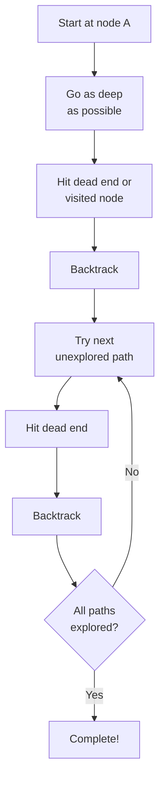

## Visual Example

### The Graph

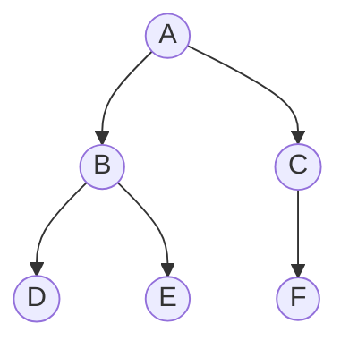

### DFS Traversal Order

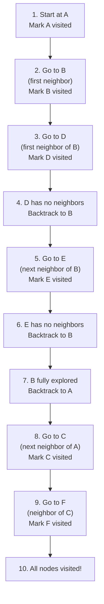

**Order visited**: A → B → D → E → C → F

Notice: We went deep (A → B → D) before going wide!

## DFS Pseudocode Structure

### High-Level Process

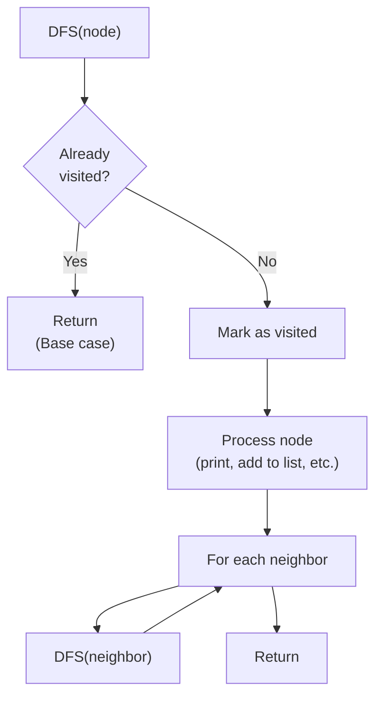

## The Three Key Components

### 1. Visited Tracking

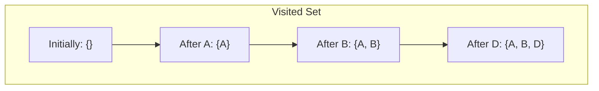

**Why?** Without tracking, we'd revisit nodes infinitely!

### 2. Recursion

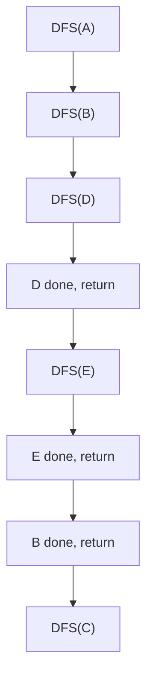

Each recursive call explores one branch completely.

### 3. Backtracking

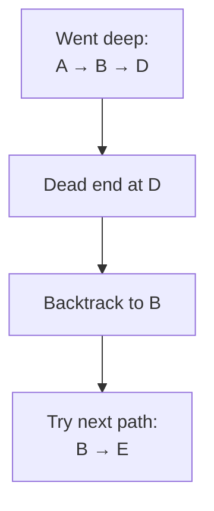

**Backtracking** happens automatically when a recursive call returns!

## Complete Example Trace

### Graph Setup

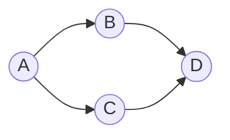

Adjacency List:
```
A → [B, C]
B → [D]
C → [D]
D → []
```

### Execution Trace

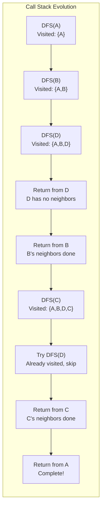

**Key Observation**: D is reached through B first. When C tries to visit D, it's already in visited set!

**Connection to Topological Sort**: This is exactly how we handle the diamond problem - shared dependencies are only processed once!

## DFS with Different Processing Orders

### Pre-order (Process Before Recursing)

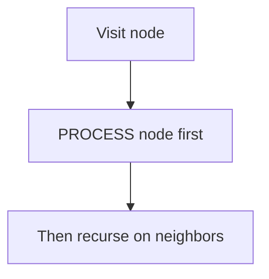

Order for our example: A, B, D, C

### Post-order (Process After Recursing)

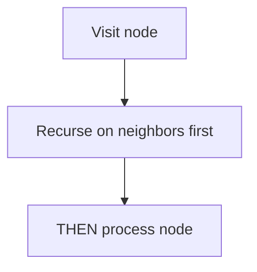

Order for our example: D, B, C, A

**Connection to Topological Sort**: We use post-order! Process dependencies first, then process the task.

## Call Stack Visualization

### Graph

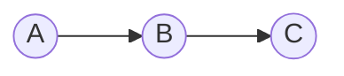

### Stack Evolution

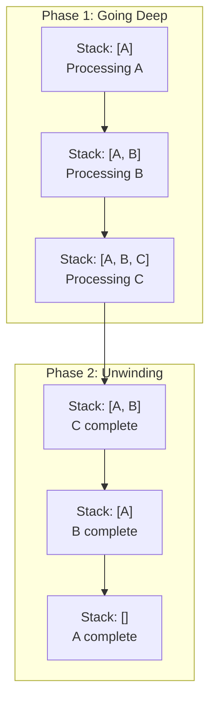

Each stack frame remembers:
- Current node
- Which neighbors have been explored
- Where to return

## DFS for Different Graph Types

### DFS on a Tree

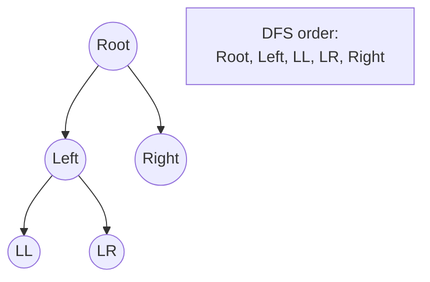

Simpler - no cycles, no visited set needed (can still use for safety).

### DFS on a DAG

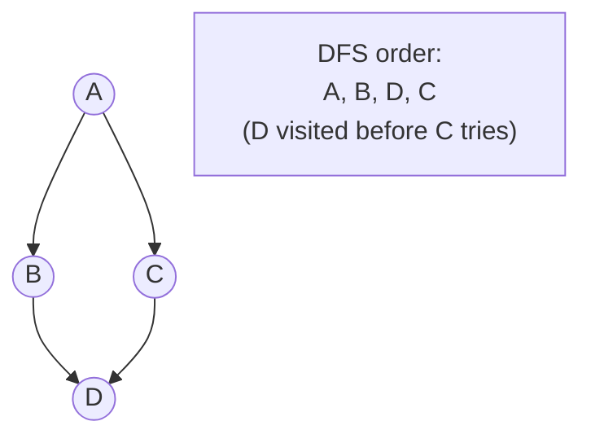

Need visited set - multiple paths to same node.

### DFS on a Cyclic Graph

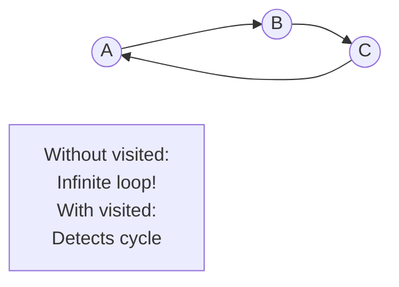

**Critical**: Visited set prevents infinite loops!

## Detecting Cycles with DFS

Use two sets: `visiting` and `visited`.

### States of a Node


### Cycle Detection

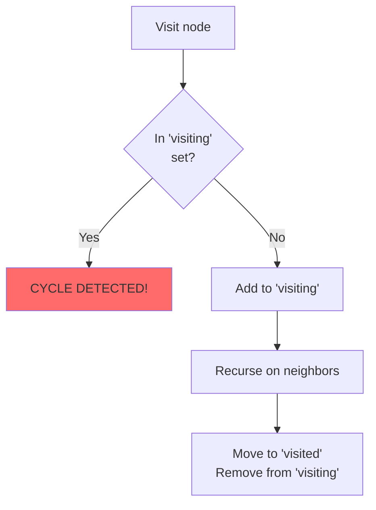

**How it works**:
- If we encounter a node in `visiting`, we've found a path back to it (cycle!)
- Nodes in `visited` are fully explored (safe)

**Connection to Topological Sort**: This detects circular dependencies!

## DFS Applications

### 1. Path Finding

Find if path exists from A to B.

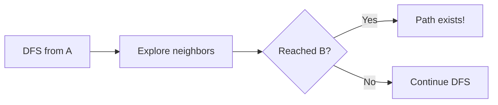

### 2. Connected Components

Find all separate groups in graph.

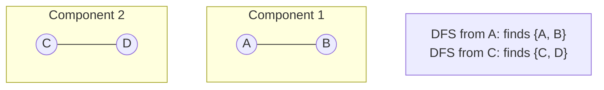

### 3. Topological Sort

Order tasks respecting dependencies (our problem!).

```mermaid
graph LR
    A((A)) --> B((B))
    B --> C((C))

    Note["DFS Post-order:<br/>C, B, A<br/>(Reverse for topo order)"]
```

### 4. Maze Solving

Explore all paths until exit found.

```mermaid
graph TB
    Start["Start"] --> Path1["Try path 1"]
    Path1 --> Dead1["Dead end"]
    Dead1 --> Back["Backtrack"]
    Back --> Path2["Try path 2"]
    Path2 --> Exit["Found exit!"]
```

## DFS Time Complexity

### Analysis

- Visit each node once: O(V)
- Explore each edge once: O(E)
- Total: **O(V + E)**

```mermaid
graph LR
    subgraph "Work Breakdown"
        Nodes["Visit V nodes:<br/>O(V)"]
        Edges["Check E edges:<br/>O(E)"]
    end

    Total["Total: O(V + E)"]

    Nodes --> Total
    Edges --> Total
```

**Why optimal?** Can't do better - must look at each node and edge at least once!

## DFS Space Complexity

### Space Used

1. **Visited set**: O(V)
2. **Call stack**: O(V) in worst case (linear chain)
3. **Adjacency list**: O(V + E) (not counted if given)

```mermaid
graph TB
    subgraph "Worst Case: Linear Chain"
        A((A)) --> B((B))
        B --> C((C))
        C --> D((D))
        D --> E((E))
    end

    Stack["Call stack depth: 5<br/>O(V) space"]
```

Total: **O(V)**

## Iterative DFS (Using Explicit Stack)

Instead of recursion, use a stack data structure.

### Concept

```mermaid
graph TB
    Init["Stack: [A]"] --> Pop1["Pop A<br/>Push neighbors [B, C]"]
    Pop1 --> Stack1["Stack: [B, C]"]
    Stack1 --> Pop2["Pop C<br/>Push neighbors [D]"]
    Pop2 --> Stack2["Stack: [B, D]"]
    Stack2 --> Continue["Continue..."]
```

### Comparison

| Aspect | Recursive DFS | Iterative DFS |
|--------|--------------|---------------|
| **Code** | Cleaner, more intuitive | More verbose |
| **Stack** | Implicit (call stack) | Explicit (data structure) |
| **Stack overflow** | Possible | Controlled |
| **Order** | Exact | May differ slightly |

**For Topological Sort**: Recursive is cleaner and more natural.

## Common DFS Patterns

### Pattern 1: Simple Traversal

```mermaid
graph TB
    DFS["DFS(node)"] --> Mark["Mark visited"]
    Mark --> Neighbors["For each neighbor"]
    Neighbors --> Recurse["If not visited:<br/>DFS(neighbor)"]
```

### Pattern 2: With Processing

```mermaid
graph TB
    DFS["DFS(node)"] --> Mark["Mark visited"]
    Mark --> Process["Process node"]
    Process --> Neighbors["For each neighbor"]
    Neighbors --> Recurse["DFS(neighbor)"]
```

### Pattern 3: Post-order Processing

```mermaid
graph TB
    DFS["DFS(node)"] --> Mark["Mark visited"]
    Mark --> Neighbors["For each neighbor"]
    Neighbors --> Recurse["DFS(neighbor)"]
    Recurse --> Process["Process node AFTER"]
```

**Connection to Topological Sort**: We use Pattern 3 - process after exploring dependencies!

## DFS vs BFS Preview

### DFS (Depth-First)

```mermaid
graph TB
    A((A)) --> B((B))
    A --> C((C))
    B --> D((D))

    Order["Order: A, B, D, C<br/>(Go deep first)"]
```

### BFS (Breadth-First)

```mermaid
graph TB
    A((A)) --> B((B))
    A --> C((C))
    B --> D((D))

    Order["Order: A, B, C, D<br/>(Go wide first)"]
```

DFS: Explore one path completely before trying others
BFS: Explore all neighbors before going deeper

## Common Mistakes

### Mistake 1: Forgetting Visited Set

```mermaid
graph LR
    A((A)) --> B((B))
    B --> A

    Result["Without visited:<br/>Infinite loop!"]

    style Result fill:#ff6b6b
```

### Mistake 2: Checking Visited After Recursing

```mermaid
graph TB
    Wrong["DFS(node)<br/>Process node<br/>Check if visited ❌"]
    Right["DFS(node)<br/>Check if visited<br/>Process node ✅"]
```

**Why wrong?** You'll process the node before realizing it's visited!

### Mistake 3: Not Marking Before Recursing

```mermaid
graph LR
    A((A)) --> B((B))
    B --> C((C))
    C --> A

    Problem["Mark after exploring:<br/>Can cause infinite loops!"]

    style Problem fill:#ff6b6b
```

Mark as visited BEFORE recursing into neighbors!

## Visualizing DFS Path

### Tree View of Exploration

```mermaid
graph TB
    A["Explore A"] --> B["Explore B"]
    A --> C["Explore C"]
    B --> D["Explore D"]
    B --> E["Explore E"]
    C --> F["Explore F"]

    subgraph "DFS Path"
        Path["A → B → D → back → E → back → back → C → F"]
    end
```

Notice the "back" movements - that's backtracking!

## Memory Consideration

### Deep Graph

```mermaid
graph LR
    N1((1)) --> N2((2))
    N2 --> N3((3))
    N3 --> Dots[...]
    Dots --> N1000((1000))

    Stack["Call stack depth:<br/>1000 levels<br/>Might overflow!"]

    style Stack fill:#ffeb99
```

### Wide Graph

```mermaid
graph TB
    Root((Root)) --> C1((Child 1))
    Root --> C2((Child 2))
    Root --> C3((Child 3))
    Root --> Dots[...]
    Root --> C1000((Child 1000))

    Stack["Call stack depth:<br/>2 levels<br/>No problem!"]

    style Stack fill:#90EE90
```

**For Topological Sort**: Depth is the longest dependency chain, usually manageable.

## Key Takeaways

1. **DFS** explores as deep as possible before backtracking
2. Uses **recursion** (or explicit stack) to remember path
3. Needs **visited set** to avoid cycles
4. **Post-order processing** visits children before parent
5. Time complexity: **O(V + E)**
6. Space complexity: **O(V)**
7. Perfect for **topological sort, cycle detection, path finding**

## Connection to Topological Sort

Our topological sort solution IS a DFS with post-order processing:

1. Start DFS from requested tasks
2. For each task, recursively DFS into its dependencies first
3. Mark task as visited
4. Add task to result AFTER all dependencies processed (post-order!)
5. Visited set handles shared dependencies

This ensures dependencies always appear before the tasks that need them!

## Next Steps

Now you understand DFS, the other main traversal method is BFS (Breadth-First Search). While topological sort typically uses DFS, BFS is also used in an alternative algorithm (Kahn's algorithm). Move on to **05-graph-traversal-bfs.md** to complete your traversal knowledge!
