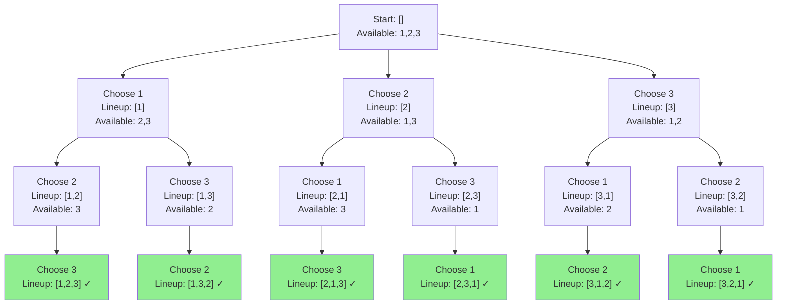
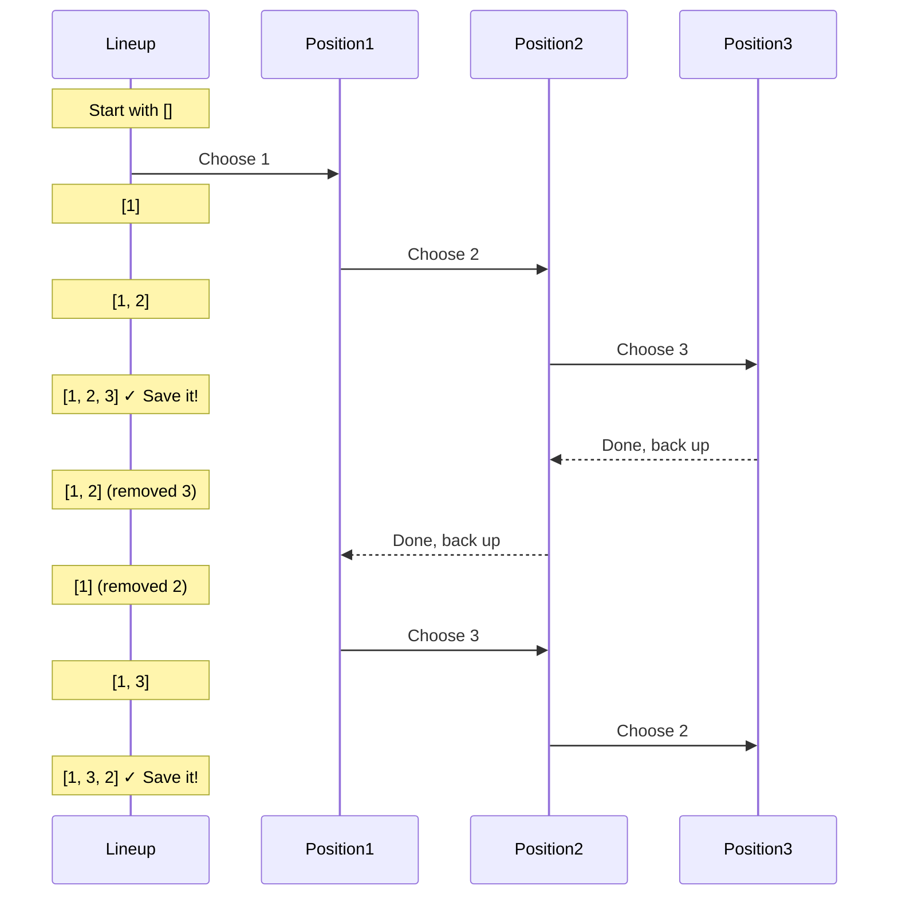

# Permutations - Mental Model

## The Decision Tree Analogy

Imagine you're a judge at a talent show with three contestants: Alice, Bob, and Charlie. You need to create every possible order they could perform in.

At each position in the lineup, you ask: "Who haven't I placed yet?" Then you:
1. **Choose** someone for this position
2. **Explore** what happens when they perform here
3. **Undo** your choice and try someone else

This is like building all possible sequences by making decisions at each step, exploring that path completely, then backing up to try different decisions.

**Mapping to the algorithm:**
- **Contestants** = Numbers in the array `[1, 2, 3]`
- **Performance lineup** = Current permutation being built
- **"Who haven't I placed?"** = Checking which numbers aren't in current lineup yet
- **Trying someone at position** = Adding a number to current permutation
- **Backing up to try others** = Backtracking (removing the last choice)

## Building from the Ground Up

### The Simplest Case: [1]

With just one contestant, there's only one way they can perform:

**Lineup: [1]**

That's it. One person, one order. Done.

### Adding Complexity: [1, 2]

Now we have two contestants. Let's build all possible lineups step by step:

**Decision 1: Who goes first?**

```
Choose Alice (1):
  Performance so far: [1]
  Who goes second? Only Bob (2) left
  Complete lineup: [1, 2] ✓

Choose Bob (2):
  Performance so far: [2]
  Who goes second? Only Alice (1) left
  Complete lineup: [2, 1] ✓
```

**Result: [[1, 2], [2, 1]]**

Notice how we:
1. Made a choice for position 1
2. Made the only remaining choice for position 2
3. Saved that complete lineup
4. Backed up and tried a different person for position 1

### The Full Case: [1, 2, 3]

Now let's see the complete decision tree with three contestants:



**All 6 possible lineups:**
1. [1, 2, 3]
2. [1, 3, 2]
3. [2, 1, 3]
4. [2, 3, 1]
5. [3, 1, 2]
6. [3, 2, 1]

## What Just Happened?

The key insight: **At each position, we try every available choice, explore what happens with that choice, then undo it to try the next choice.**

This creates a tree where:
- Each **level** = a position in the lineup (1st, 2nd, 3rd)
- Each **branch** = a decision (who to place at this position)
- Each **leaf** = a complete permutation

The pattern is:
```
For each position:
  For each person not yet placed:
    Place them → Explore next position → Remove them
```

## Why the Backtracking Pattern Works

Think about walking through a maze with spray paint:

1. **Mark your path** - Add number to current lineup
2. **Walk forward** - Recursively fill next position
3. **Hit a dead end or finish** - Found complete permutation or no more positions
4. **Walk backward** - Remove number from lineup
5. **Try another path** - Try next available number

The spray paint (your current lineup) shows where you've been on THIS path. When you back up, you erase your marks so you can try a fresh path.

### Visualization of Backtracking



## Why Not Use a Different Approach?

### Why not generate all combinations upfront?

Imagine trying to list all possible lineups by hand:
- With 3 people: 3! = 6 lineups (doable)
- With 10 people: 10! = 3,628,800 lineups (not doable!)

Backtracking builds them **one at a time** and **on demand**, which is much more memory-efficient.

### Why not use iteration instead of recursion?

Try writing nested loops for [1, 2, 3]:

```typescript
// This only works for exactly 3 elements
for (let i = 0; i < 3; i++) {
  for (let j = 0; j < 3; j++) {
    if (j === i) continue;
    for (let k = 0; k < 3; k++) {
      if (k === i || k === j) continue;
      output.push([nums[i], nums[j], nums[k]]);
    }
  }
}
```

Now try writing it for ANY number of elements. You can't! You'd need infinite nested loops.

Recursion handles ANY depth automatically.

## Common Misconceptions

### ❌ "We need to track which numbers we've used with a separate boolean array"

**Why it's limiting:**
While a `used` array works, it requires extra space and bookkeeping. There's a cleaner way.

### ✅ "We can check if a number is already in our current lineup"

**Why it's better:**
```typescript
// Check if current lineup already contains this number
if (!currentLineup.includes(nums[i])) {
  // This number is available, use it
}
```

This is simpler and the current lineup naturally tracks what's available.

### ❌ "I need to generate all permutations at once"

**Why it's wrong:**
You build them one at a time through exploration. Each complete path through the tree is one permutation.

### ✅ "I explore each path completely before trying the next"

**Why it's right:**
This is depth-first exploration. You go deep (all the way to a complete lineup) before going wide (trying other first choices).

## Try It Yourself

Trace through `[1, 2]` by hand and answer:

1. What's the first decision point?
2. After choosing 1 first, what choices remain?
3. When do we backtrack?
4. After generating [1, 2], where are we in the tree?
5. What's the second permutation generated?

**Answers:**
1. Who goes in position 1: choose 1 or 2
2. Only 2 remains (can't reuse 1)
3. After saving [1, 2], we backtrack to try the next choice
4. Back at the root, having exhausted the "1 first" branch
5. [2, 1] - now we explore the "2 first" branch

## The Algorithm in Plain English

**Building all possible performance lineups:**

1. Start with an empty lineup and all contestants available
2. If the lineup is complete (all positions filled):
   - Save this lineup to results
   - Return (this path is done)
3. Otherwise, for each available contestant:
   - Add them to the current lineup position
   - Recursively fill the next position (explore this path)
   - Remove them from the lineup (backtrack)
4. Return all saved lineups

**The key steps in each recursive call:**
- **Base case**: Lineup complete? Save it and return
- **Recursive case**: Try each unused number, explore, backtrack

## Complete Solution

```typescript
function permute(nums: number[]): number[][] {
  const allLineups: number[][] = [];

  function buildLineup(currentLineup: number[]) {
    // Base case: We've placed everyone!
    if (currentLineup.length === nums.length) {
      // Save this complete lineup (must copy it)
      allLineups.push([...currentLineup]);
      return;
    }

    // Try each contestant for the current position
    for (const contestant of nums) {
      // Skip if this contestant is already in the lineup
      if (currentLineup.includes(contestant)) {
        continue;
      }

      // Choose: Place this contestant
      currentLineup.push(contestant);

      // Explore: Fill the remaining positions
      buildLineup(currentLineup);

      // Undo: Remove this contestant to try others
      currentLineup.pop();
    }
  }

  buildLineup([]);
  return allLineups;
}
```

### Why `[...currentLineup]` in the base case?

If we just pushed `currentLineup` directly:
```typescript
allLineups.push(currentLineup); // WRONG!
```

We'd be saving a **reference** to the same array that keeps changing. All saved lineups would end up empty (because we backtrack and remove everything).

By creating a copy `[...currentLineup]`, we save a **snapshot** of the lineup at this moment.

### Tracing the execution for [1, 2]:

| Call Stack | currentLineup | Action |
|------------|---------------|--------|
| buildLineup([]) | [] | Try contestant 1 |
| buildLineup([1]) | [1] | Try contestant 2 |
| buildLineup([1,2]) | [1,2] | Complete! Save [1,2] |
| → return | [1] | Backtrack (pop 2) |
| → return | [] | Backtrack (pop 1) |
| buildLineup([]) | [] | Try contestant 2 |
| buildLineup([2]) | [2] | Try contestant 1 |
| buildLineup([2,1]) | [2,1] | Complete! Save [2,1] |
| → return | [2] | Backtrack (pop 1) |
| → return | [] | Backtrack (pop 2) |
| Done | [] | All paths explored |

**Result:** `[[1, 2], [2, 1]]`

## Time and Space Complexity

**Time:** O(n! × n)
- There are n! permutations
- Each permutation takes O(n) to build and copy

**Space:** O(n × n!)
- Storing n! permutations
- Each permutation has n elements
- Plus O(n) for recursion depth

For n=3: 6 permutations, 18 total numbers stored
For n=4: 24 permutations, 96 total numbers stored

The factorial growth makes this expensive for large n, but that's unavoidable since we must generate all permutations.