# Graph Traversal: Breadth-First Search (BFS)

## What is BFS?

Breadth-First Search is a graph traversal algorithm that explores all neighbors at the current depth before moving to nodes at the next depth level.

Think of it like ripples in a pond - you explore outward in expanding circles.

## The Core Idea

### Exploration Strategy

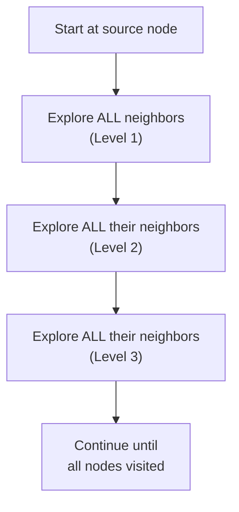

## Visual Example

### The Graph

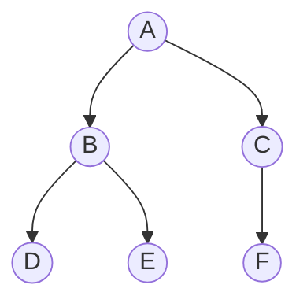

### BFS Traversal by Level

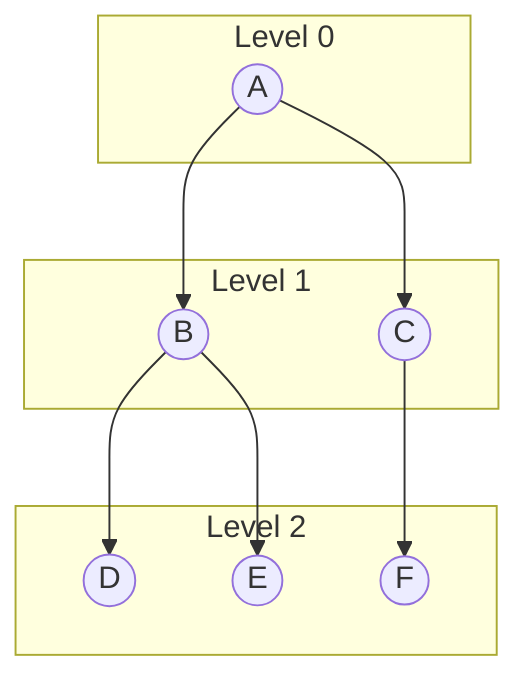

**Order visited**: A → B → C → D → E → F

Notice: We visited ALL nodes at level 1 (B, C) before ANY nodes at level 2 (D, E, F)!

## BFS vs DFS Comparison

### Same Graph, Different Orders

```mermaid
graph TB
    A((A)) --> B((B))
    A --> C((C))
    B --> D((D))

    DFS["DFS order:<br/>A → B → D → C<br/>(Deep first)"]
    BFS["BFS order:<br/>A → B → C → D<br/>(Wide first)"]

    style DFS fill:#ffe6e6
    style BFS fill:#e6f3ff
```

### Visual Difference

**DFS** (Stack/Recursion):
```mermaid
graph LR
    Path["A → B → D<br/>(go deep)"]
    Then["Then backtrack<br/>to explore C"]
```

**BFS** (Queue):
```mermaid
graph LR
    Layer1["A → B and C<br/>(explore layer)"]
    Layer2["Then → D<br/>(next layer)"]
```

## The Queue Data Structure

BFS uses a **queue** (First-In-First-Out).

### Queue Visualization

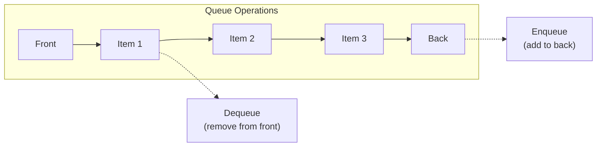

**FIFO**: First node added is first node processed.

### Why Queue?

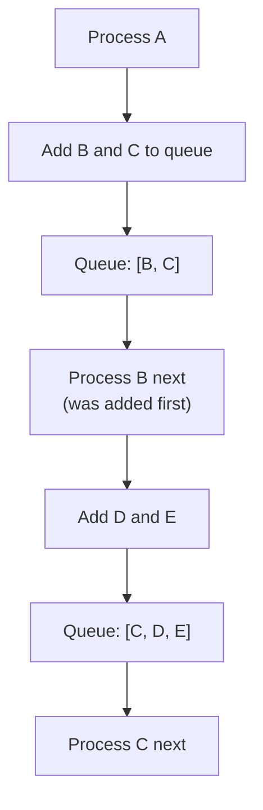

Queue ensures we process in level order!

## BFS Step-by-Step Example

### Graph Setup

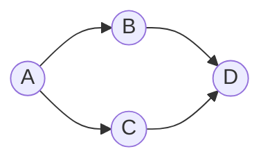

### Execution Trace

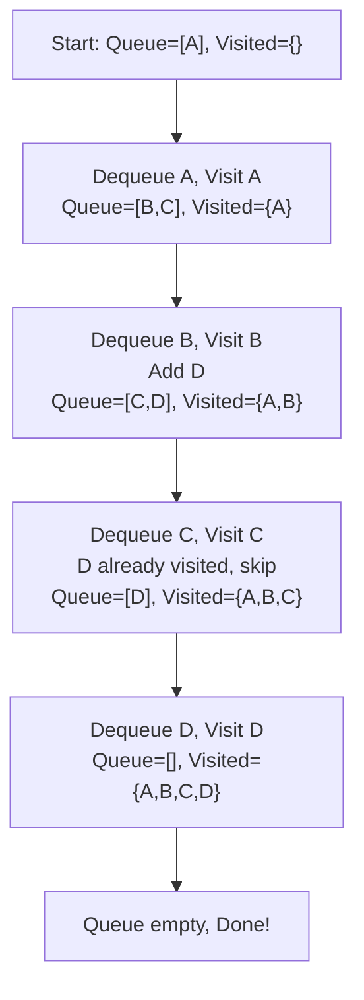

**Order**: A → B → C → D

**Key Observation**: D was enqueued when processing B. When C tries to enqueue D, it's already visited!

## BFS Pseudocode Structure

### High-Level Process

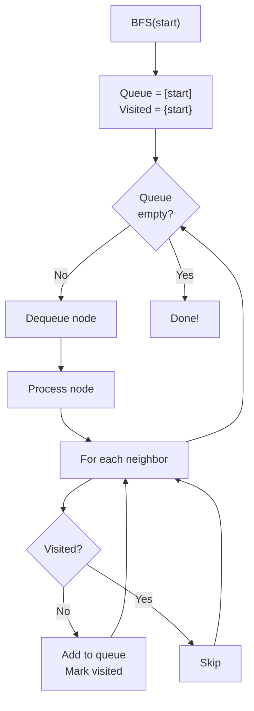

## The Three Key Components

### 1. Queue for Processing Order

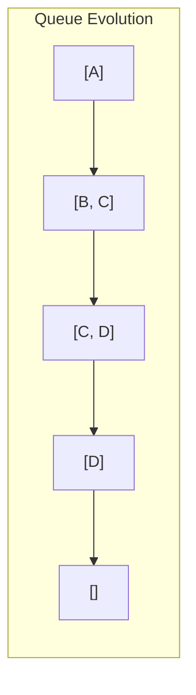

Maintains level-by-level order.

### 2. Visited Set

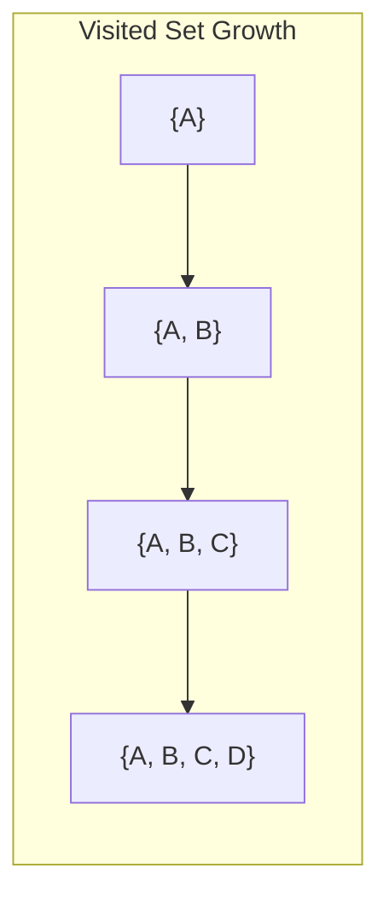

Prevents processing nodes twice.

### 3. Level Tracking (Optional)

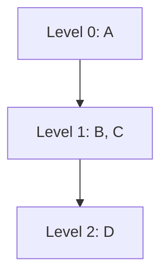

Track distance from start if needed.

## BFS Applications

### 1. Shortest Path in Unweighted Graph

BFS finds the shortest path by number of edges!

```mermaid
graph LR
    A((A)) --> B((B))
    A --> C((C))
    B --> D((D))
    C --> D

    Path1["Path A→B→D: 2 edges"]
    Path2["Path A→C→D: 2 edges"]
    Direct["BFS finds shortest first!"]
```

**Why?** BFS explores by distance, so the first time it reaches a node, that's the shortest path!

### 2. Finding Connected Components

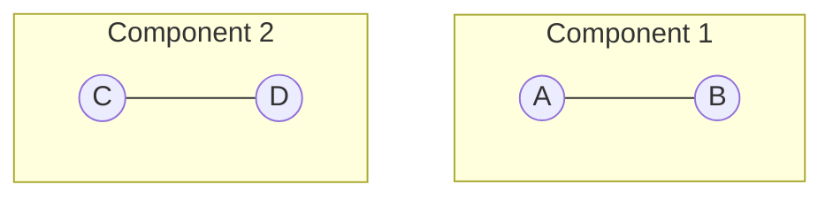

BFS from each unvisited node finds each component.

### 3. Level-Order Tree Traversal

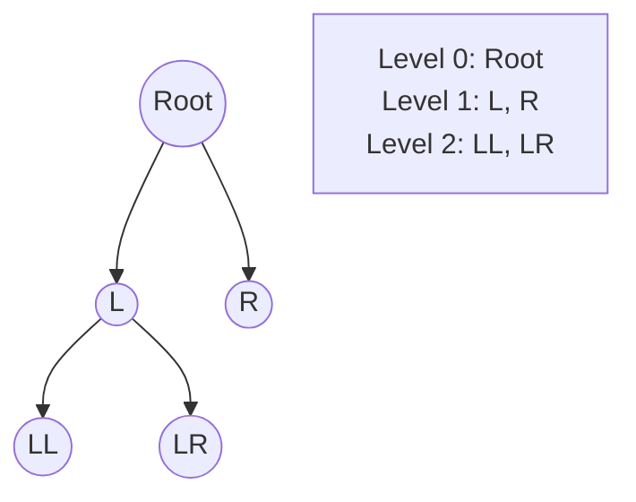

### 4. Topological Sort (Kahn's Algorithm)

Alternative to DFS for topological ordering!

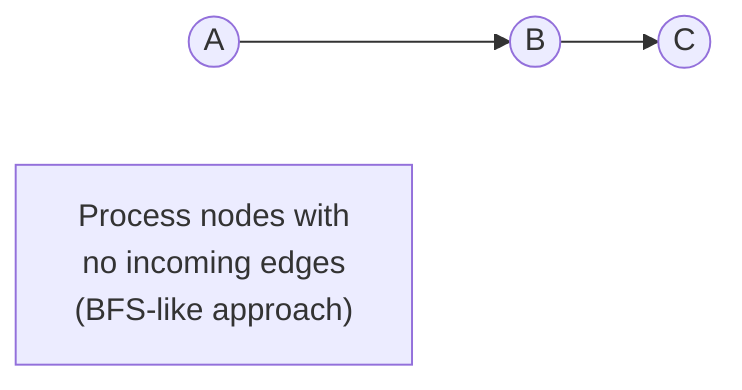

**Connection to Topological Sort**: Kahn's algorithm is BFS-based!

## BFS Time Complexity

Same as DFS:
- Visit each node once: O(V)
- Check each edge once: O(E)
- Total: **O(V + E)**

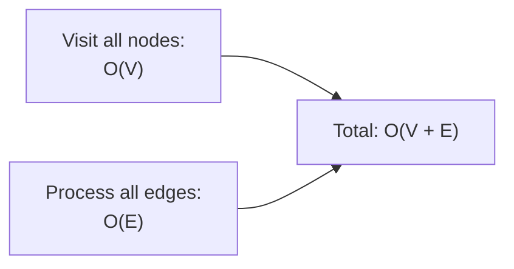

## BFS Space Complexity

### Space Used

1. **Queue**: O(V) worst case
2. **Visited set**: O(V)
3. **Adjacency list**: O(V + E) (if we own it)

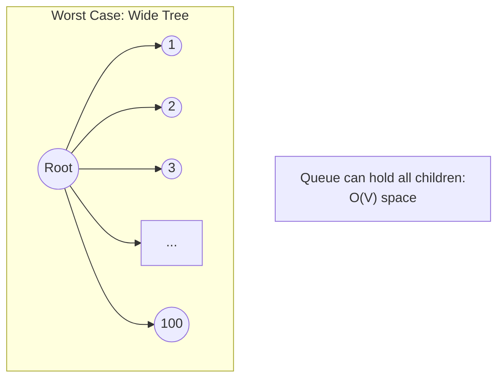

Total: **O(V)**

## BFS vs DFS: When to Use Which?

| Use BFS When... | Use DFS When... |
|----------------|-----------------|
| Finding shortest path | Exploring all paths |
| Level-order processing | Topological sort |
| Closest neighbors first | Detecting cycles |
| Graph is very deep | Graph is very wide |
| Need distance information | Need path information |

### Visualization of Choice

```mermaid
graph TB
    Problem{What do you need?}

    Problem -->|Shortest path| BFS1[BFS]
    Problem -->|Topological order| DFS1[DFS usually]
    Problem -->|Level order| BFS2[BFS]
    Problem -->|Path exists| Either[Either works]
    Problem -->|Detect cycle| DFS2[DFS easier]

    style BFS1 fill:#e6f3ff
    style BFS2 fill:#e6f3ff
    style DFS1 fill:#ffe6e6
    style DFS2 fill:#ffe6e6
```

## Tracking Distance/Level

Often useful to know how far each node is from the start.

### Level Tracking

```mermaid
graph TB
    Start["Level = 0<br/>Queue = [(A, 0)]"] --> P1["Process (A, 0)<br/>Add neighbors at level 1"]
    P1 --> Q1["Queue = [(B, 1), (C, 1)]"]
    Q1 --> P2["Process (B, 1)<br/>Add neighbors at level 2"]
    P2 --> Q2["Queue = [(C, 1), (D, 2)]"]
```

Store level with each node in queue.

### Distance Map

```mermaid
graph LR
    subgraph "Distance from A"
        DA["A: 0"]
        DB["B: 1"]
        DC["C: 1"]
        DD["D: 2"]
    end
```

Map each node to its distance from start.

## BFS for Shortest Path

### Example Graph

```mermaid
graph LR
    A((A)) --> B((B))
    A --> D((D))
    B --> C((C))
    D --> C

    Goal["Find shortest path<br/>from A to C"]
```

### BFS Finds It

```mermaid
graph TB
    S1["Visit A (distance 0)"] --> S2["Visit B, D (distance 1)"]
    S2 --> S3["Visit C (distance 2)<br/>Found C!<br/>Shortest path: A→B→C"]
```

**Guarantee**: First time BFS reaches a node is via the shortest path!

## Kahn's Algorithm (BFS for Topological Sort)

An alternative to DFS for topological sorting.

### Core Idea

```mermaid
graph TB
    Start["Calculate in-degree<br/>for each node"] --> Find["Find nodes with<br/>in-degree 0"]
    Find --> Process["Process those nodes<br/>(add to result)"]
    Process --> Reduce["Reduce in-degree<br/>of neighbors"]
    Reduce --> More{More nodes<br/>with in-degree 0?}
    More -->|Yes| Process
    More -->|No| Check{All nodes<br/>processed?}
    Check -->|Yes| Success["Valid topological order!"]
    Check -->|No| Cycle["Cycle detected!"]

    style Success fill:#90EE90
    style Cycle fill:#ff6b6b
```

### Example

```mermaid
graph LR
    A((A)) --> C((C))
    B((B)) --> C
    C --> D((D))
```

**In-degrees**: A=0, B=0, C=2, D=1

**Steps**:
1. Process A and B (in-degree 0) → reduce C's in-degree to 0
2. Process C → reduce D's in-degree to 0
3. Process D
4. Result: [A, B, C, D] or [B, A, C, D]

**Connection to Topological Sort**: This is the BFS-based approach mentioned in the solution guide!

## Common BFS Patterns

### Pattern 1: Simple Level-Order Traversal

```mermaid
graph TB
    Init["Queue = [start]<br/>Visited = {start}"] --> Loop["While queue not empty"]
    Loop --> Process["Dequeue and process"]
    Process --> Add["Add unvisited neighbors"]
    Add --> Loop
```

### Pattern 2: With Distance Tracking

```mermaid
graph TB
    Init["Queue = [(start, 0)]<br/>Visited = {start}"] --> Loop["While queue not empty"]
    Loop --> Process["Dequeue (node, dist)"]
    Process --> Add["Add neighbors at dist+1"]
    Add --> Loop
```

### Pattern 3: Multi-Source BFS

```mermaid
graph TB
    Init["Queue = [source1, source2, ...]<br/>Visited = {source1, source2, ...}"] --> Loop["Process all sources<br/>simultaneously"]
```

Used for problems like "distance to nearest X".

## BFS Implementation Notes

### Using Array as Queue

```mermaid
graph LR
    Arr["Array: [A, B, C]"] --> Shift["Shift first: A<br/>O(n) operation 😱"]
    Push["Push: O(1)"]

    style Shift fill:#ffeb99
```

**Problem**: Shifting array is slow!

### Using Deque/Circular Buffer

```mermaid
graph LR
    Front["Front pointer"] --> Item1["A"]
    Item1 --> Item2["B"]
    Item2 --> Item3["C"]
    Back["Back pointer"]

    Dequeue["Move front pointer<br/>O(1)"]
    Enqueue["Add at back<br/>O(1)"]
```

**Better**: Constant time operations.

### Using Index Approach

```mermaid
graph TB
    Arr["Array: [A, B, C, D]"] --> Idx["Index = 0"]
    Process["Process arr[index]<br/>Add new items to end<br/>Increment index"]
```

Simpler and works well in practice!

## BFS on Different Graph Types

### BFS on Tree

```mermaid
graph TB
    Root((Root)) --> L((L))
    Root --> R((R))

    Note["Level-order:<br/>Root, L, R"]
```

Natural for trees - visits level by level.

### BFS on DAG

```mermaid
graph TB
    A((A)) --> B((B))
    A --> C((C))
    B --> D((D))
    C --> D

    Note["A, B, C, D or A, C, B, D<br/>(depends on order added)"]
```

Visited set prevents multiple processing.

### BFS on Cyclic Graph

```mermaid
graph LR
    A((A)) --> B((B))
    B --> C((C))
    C --> A

    Note["Visited set<br/>prevents infinite loop"]
```

Critical: Mark visited when ENQUEUING, not when dequeuing!

## Common Mistakes

### Mistake 1: Marking Visited When Dequeuing

```mermaid
graph LR
    Wrong["Dequeue → Check visited → Process ❌"]
    Right["Check visited → Enqueue → Process ✅"]
```

**Why wrong?** Node might be enqueued multiple times before being processed!

### Mistake 2: Using Stack Instead of Queue

```mermaid
graph TB
    Stack["Using Stack<br/>(LIFO)"] --> Actually["Actually doing DFS,<br/>not BFS!"]

    style Actually fill:#ff6b6b
```

### Mistake 3: Not Tracking Visited

```mermaid
graph LR
    A((A)) --> B((B))
    B --> A

    Problem["Without visited:<br/>A and B enqueued infinitely!"]

    style Problem fill:#ff6b6b
```

## BFS Memory Concerns

### Wide Graph (Large Queue)

```mermaid
graph TB
    Root((Root))

    Root --> N1((1))
    Root --> N2((2))
    Root --> N3((3))
    Root --> Dots[...]
    Root --> N1000((1000))

    Queue["Queue size: 1000<br/>High memory!"]

    style Queue fill:#ffeb99
```

### Deep Graph (Small Queue)

```mermaid
graph LR
    N1((1)) --> N2((2))
    N2 --> N3((3))
    N3 --> Dots[...]
    Dots --> N1000((1000))

    Queue["Queue size: 1<br/>Low memory!"]

    style Queue fill:#90EE90
```

**BFS uses more memory on wide graphs, DFS on deep graphs.**

## Bidirectional BFS

Advanced technique for shortest path.

### Concept

```mermaid
graph LR
    Start((Start)) --> M1[...]
    M1 --> Meet((Meet))
    End((End)) --> M2[...]
    M2 --> Meet

    Idea["BFS from both ends<br/>until they meet"]
```

Faster for large graphs - explores less total nodes.

## Key Takeaways

1. **BFS** explores level by level using a queue
2. Uses **queue** (FIFO) for processing order
3. Needs **visited set** to avoid reprocessing
4. **Finds shortest path** in unweighted graphs
5. Time complexity: **O(V + E)**
6. Space complexity: **O(V)**
7. Mark visited when **enqueuing**, not dequeuing
8. Alternative to DFS for some problems

## Connection to Topological Sort

BFS is used in **Kahn's algorithm** for topological sort:
- Calculate in-degree for each node
- Process nodes with in-degree 0 (queue-based)
- Reduce in-degree of neighbors
- Repeat until done

While the main topological sort solution uses DFS, understanding BFS helps you understand alternative approaches and why different algorithms work!

## Next Steps

Now that you understand both DFS and BFS, you're ready to learn about dependencies and ordering specifically. Move on to **06-dependencies-and-ordering.md** to see how these traversal techniques apply to dependency resolution and topological sorting!
