# Pow(x, n) - Visual Guide

## Understanding the Problem

### The Core Idea

Implement `pow(x, n)` which calculates `x` raised to the power `n` (i.e., `x^n`).

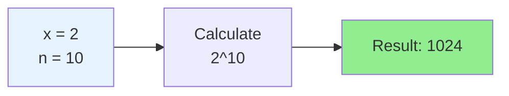

### The Naive Approach

Multiply `x` by itself `n` times:

```
2^10 = 2 × 2 × 2 × 2 × 2 × 2 × 2 × 2 × 2 × 2
       └─────────── 10 multiplications ───────────┘
```

**Problem:** For `n = 1,000,000,000`, this takes a billion operations!

---

## Key Insight: Binary Exponentiation

### The Big Idea

Instead of `n` multiplications, we can do it in `log(n)` multiplications by **squaring**.

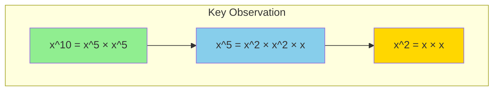

**Why this works:**
- `x^10` needs only 1 multiplication (if we know `x^5`)
- `x^5` needs only 2 multiplications (if we know `x^2`)
- `x^2` needs only 1 multiplication

**Total: 4 multiplications instead of 10!**

---

## The Two Rules

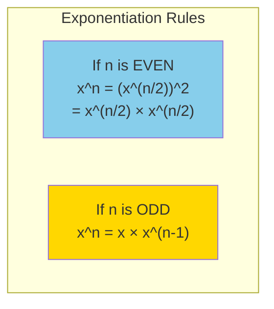

### Why These Rules?

**Even exponent:** `x^10 = x^5 × x^5` — cut the problem in half!

**Odd exponent:** `x^5 = x × x^4` — extract one `x`, now `4` is even

---

## Step-by-Step Example: 2^10

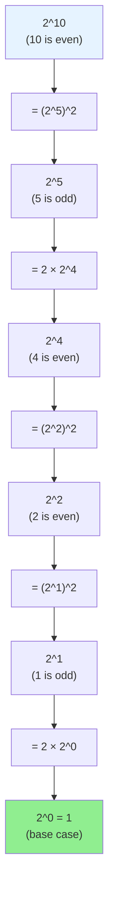

### Unrolling the Computation

```
2^10
= (2^5)^2
= (2 × 2^4)^2
= (2 × (2^2)^2)^2
= (2 × (2 × 2)^2)^2
= (2 × 4^2)^2
= (2 × 16)^2
= 32^2
= 1024 ✓
```

**Only 4 multiplications!**

---

## Handling Edge Cases

### Case 1: n = 0

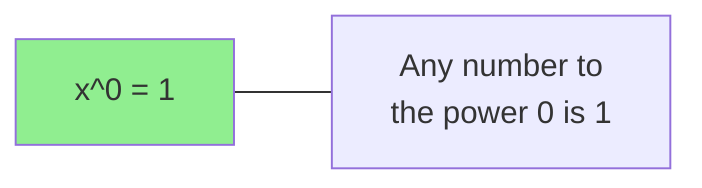

### Case 2: Negative Exponent

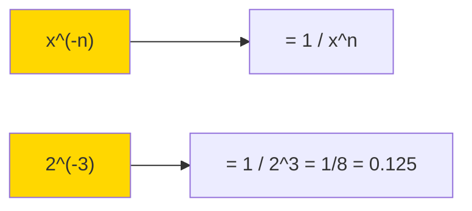

**Strategy:** Convert to positive exponent, then take reciprocal.

### Case 3: Integer Overflow (n = -2^31)

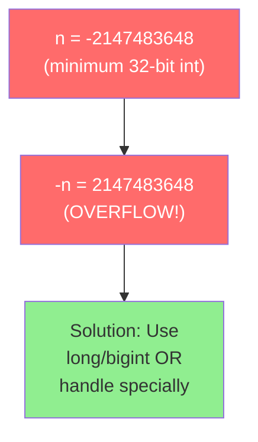

---

## Visualizing the Recursion

### For x=2, n=10

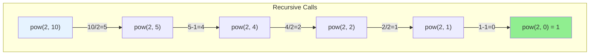

**Depth: O(log n)** — We halve `n` at each even step!

---

## The Binary Connection

### Why "Binary" Exponentiation?

The exponent `n` can be expressed in binary, and each bit tells us whether to include that power of 2.

```
10 in binary = 1010

2^10 = 2^8 × 2^2
       ↑       ↑
      bit 3   bit 1
      (=1)    (=1)
```

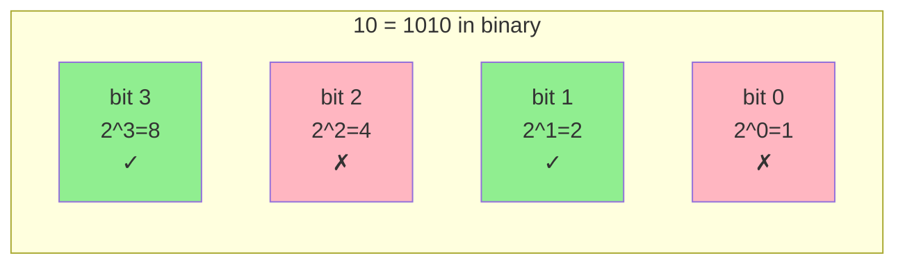

`2^10 = 2^8 × 2^2 = 256 × 4 = 1024`

---

## Iterative Approach

### The Algorithm

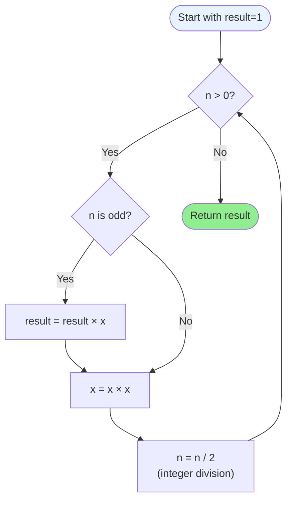

### Trace Through: 2^10

| Step | n | n binary | n odd? | result | x |
|------|---|----------|--------|--------|---|
| 0 | 10 | 1010 | No | 1 | 2 |
| 1 | 5 | 101 | Yes | 1×4=4 | 4 |
| 2 | 2 | 10 | No | 4 | 16 |
| 3 | 1 | 1 | Yes | 4×256=1024 | 256 |
| 4 | 0 | 0 | - | **1024** | - |

Wait, let me recalculate:

| Step | n | n odd? | Action | result | x (after square) |
|------|---|--------|--------|--------|------------------|
| init | 10 | - | - | 1 | 2 |
| 1 | 10 | No | square only | 1 | 4 |
| 2 | 5 | Yes | multiply, square | 4 | 16 |
| 3 | 2 | No | square only | 4 | 256 |
| 4 | 1 | Yes | multiply, square | 1024 | 65536 |
| 5 | 0 | done | return | **1024** | - |

---

## Why This Works: Bit-by-Bit

Each iteration:
1. If current bit of `n` is 1 → multiply result by current power of x
2. Square x (prepare next power)
3. Shift n right by 1 (move to next bit)

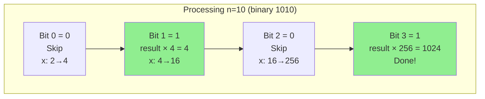

---

## Approach Comparison

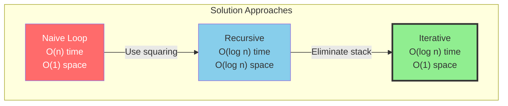

---

## Common Pitfalls

### Pitfall 1: Integer Overflow with -n

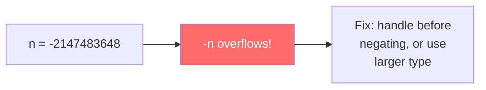

### Pitfall 2: Forgetting x^0 = 1

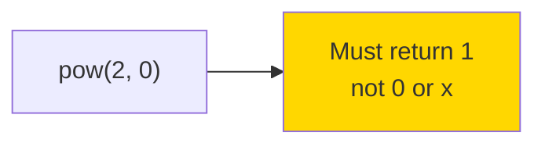

### Pitfall 3: Infinite Loop


---

## Edge Cases Summary

| Input | Expected Output | Why |
|-------|-----------------|-----|
| `pow(2, 0)` | 1 | x^0 = 1 |
| `pow(0, 5)` | 0 | 0^n = 0 (n > 0) |
| `pow(2, -2)` | 0.25 | 2^-2 = 1/4 |
| `pow(-2, 3)` | -8 | Odd power preserves sign |
| `pow(-2, 4)` | 16 | Even power → positive |
| `pow(1, huge)` | 1 | 1^anything = 1 |
| `pow(-1, huge)` | ±1 | Depends on odd/even |

---

## Mental Model Summary

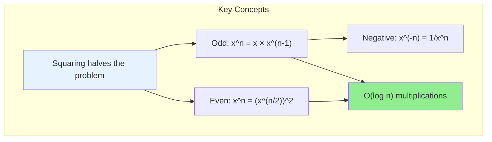

---

## Try It Yourself

Calculate `3^13` using binary exponentiation.

<details>
<summary>Click to see solution</summary>

```
13 in binary = 1101

Breaking down:
- 13 is odd: 3^13 = 3 × 3^12
- 12 is even: 3^12 = (3^6)^2
- 6 is even: 3^6 = (3^3)^2
- 3 is odd: 3^3 = 3 × 3^2
- 2 is even: 3^2 = (3^1)^2
- 1 is odd: 3^1 = 3 × 3^0
- 0 base: 3^0 = 1

Building up:
3^1 = 3
3^2 = 9
3^3 = 27
3^6 = 729
3^12 = 531441
3^13 = 1594323

Answer: 1594323

Multiplications: only 5 instead of 13!
```

</details>