# Climbing Stairs - Visual Guide

## Understanding the Problem

### The Core Idea

You are climbing a staircase with `n` steps. Each time you can climb **1 or 2 steps**. Count the number of distinct ways to reach the top.

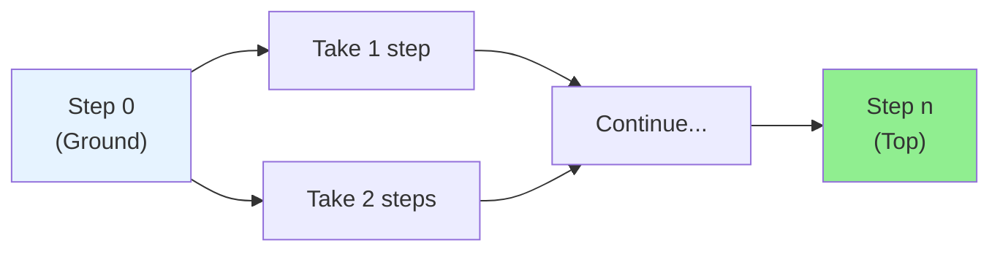

### Staircase Visualization

```
    ┌───┐
    │ 5 │  ← Goal (n=5)
  ┌─┴───┤
  │  4  │
┌─┴─────┤
│   3   │
├───────┤
│   2   │
├───────┤
│   1   │
├───────┤
│   0   │  ← Start (ground)
└───────┘
```

---

## Key Insight: Think Backwards

**The Critical Question:** If I'm standing on step `n`, where could I have come from?

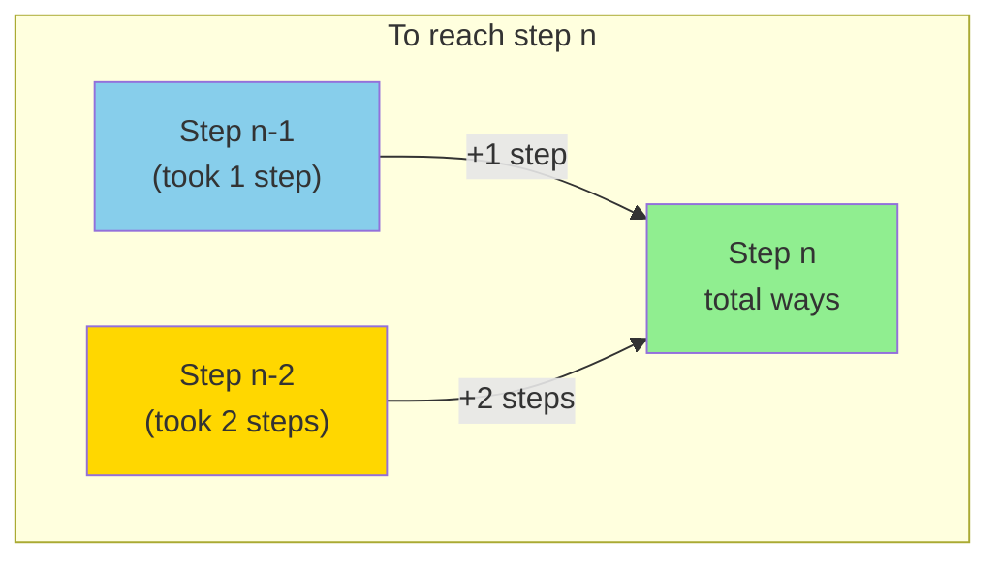

**Formula**: `ways(n) = ways(n-1) + ways(n-2)`

---

## Building the Sequence

### Count Distinct Ways

| n | All possible combinations | Count |
|---|---------------------------|-------|
| 1 | `(1)` | **1** |
| 2 | `(1+1)`, `(2)` | **2** |
| 3 | `(1+1+1)`, `(1+2)`, `(2+1)` | **3** |
| 4 | `(1+1+1+1)`, `(1+1+2)`, `(1+2+1)`, `(2+1+1)`, `(2+2)` | **5** |
| 5 | ... | **8** |

### The Pattern

```
1, 2, 3, 5, 8, 13, 21, ...
```

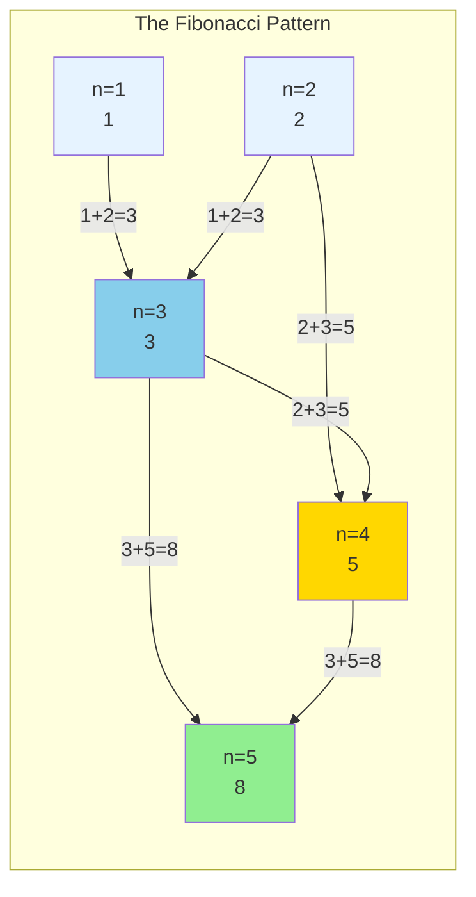

Each count = **sum of the previous two counts**

---

## Why This Works

### The Logic

To reach step 5, I must have come from:
- **Step 4** (then took 1 step) — there are `ways(4)` ways to get to step 4
- **Step 3** (then took 2 steps) — there are `ways(3)` ways to get to step 3

Total ways to step 5 = `ways(4) + ways(3)` = 5 + 3 = **8**

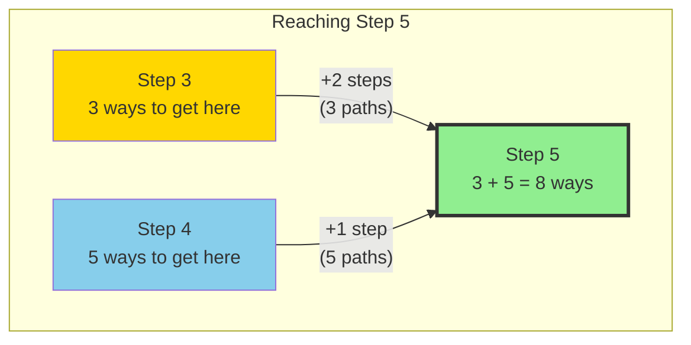

---

## Step-by-Step Example: n = 5

### Enumerate All 8 Paths

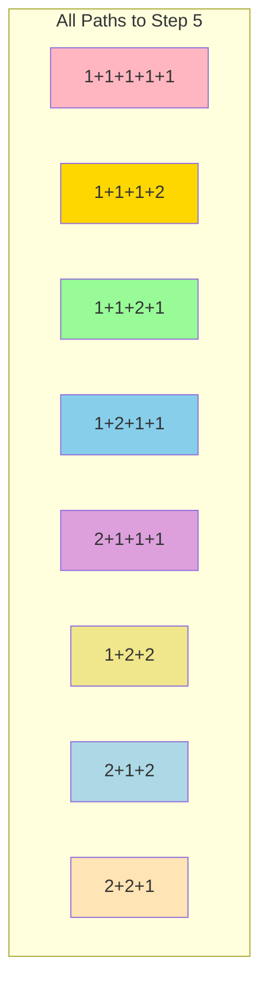

### Build Up From Base Cases

```
ways(1) = 1
ways(2) = 2
ways(3) = ways(2) + ways(1) = 2 + 1 = 3
ways(4) = ways(3) + ways(2) = 3 + 2 = 5
ways(5) = ways(4) + ways(3) = 5 + 3 = 8 ✓
```

---

## Base Cases

### Why Stop at n ≤ 2?

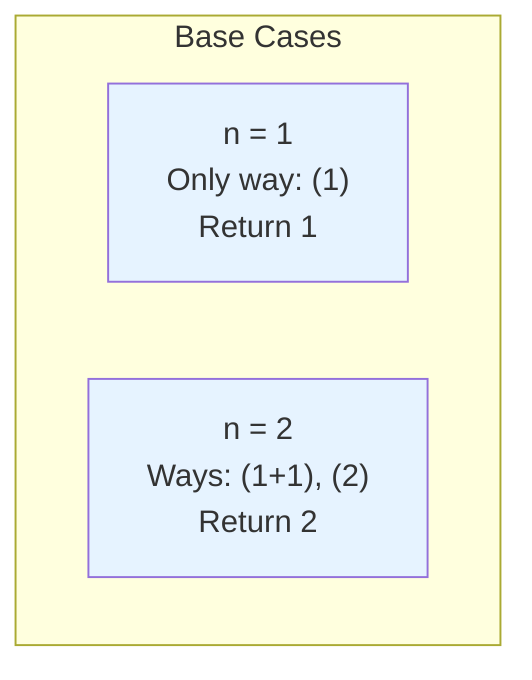

These are **known answers**. You don't need to break them down further.

**Convenient shortcut:** For n ≤ 2, the answer equals n itself!
- `ways(1) = 1`
- `ways(2) = 2`

---

## The Recursion Tree Problem

### Without Memoization

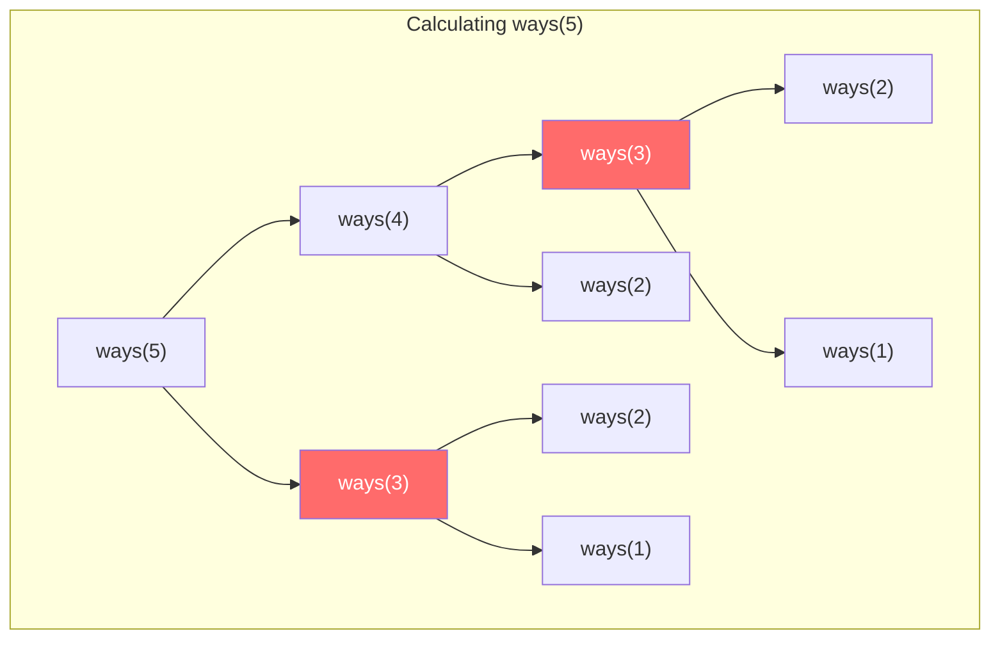

**Problem**: `ways(3)` computed **twice**! For `ways(44)`, this explodes exponentially.

### The Fix: Memoization

Store results you've already computed. Before recursing, check if you already know the answer.

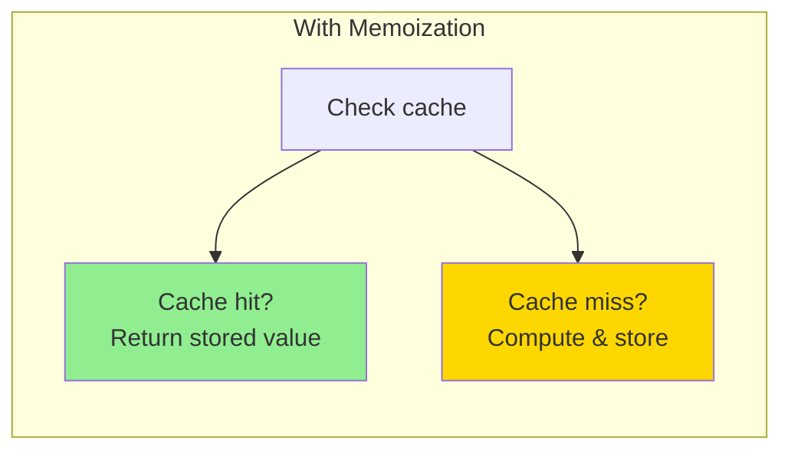

---

## Why Dynamic Programming Works

### Optimal Substructure

The solution to `ways(n)` depends entirely on solutions to smaller problems.

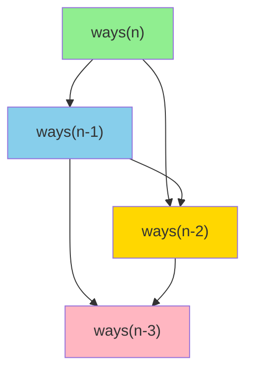

### Overlapping Subproblems

The same subproblems (`ways(3)`, `ways(2)`, etc.) are needed multiple times.

---

## Approach Comparison

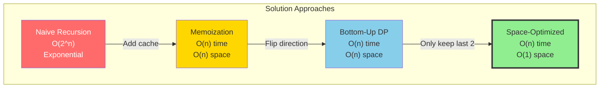

---

## Space Optimization Insight

### Why You Only Need Two Variables

To compute `ways(n)`, you only need:
- `ways(n-1)` — the previous value
- `ways(n-2)` — the value before that

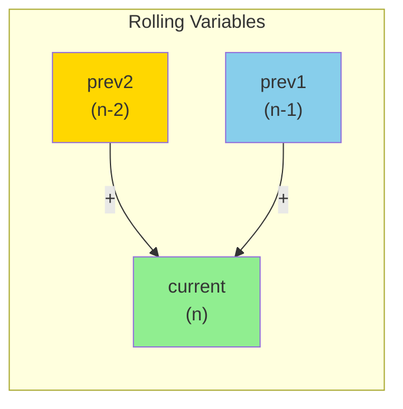

After computing `current`:
- Shift: `prev2 = prev1`, `prev1 = current`
- Repeat

---

## Decision Tree

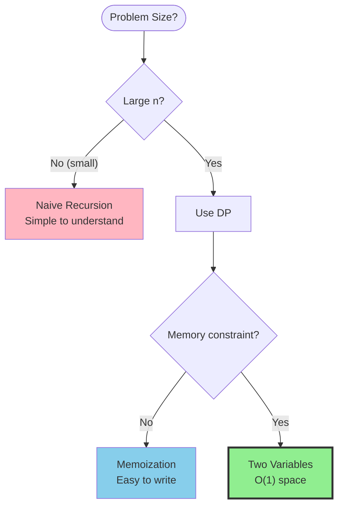

---

## Common Patterns to Remember

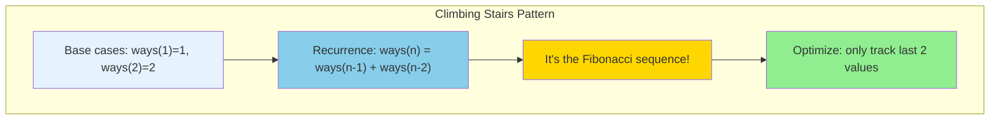

---

## Edge Cases

### n = 1

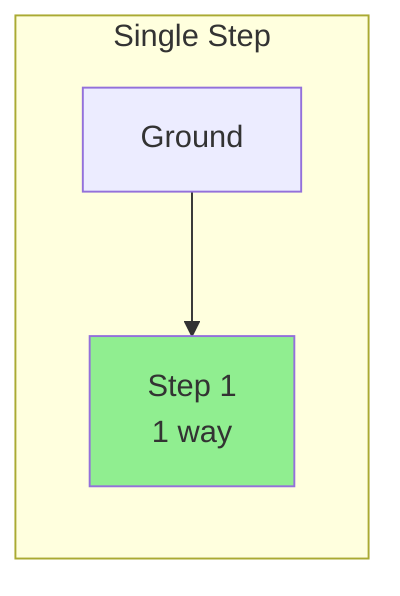

Only one way: take 1 step.

### n = 0 (if allowed)

One way to stay at ground: do nothing. Return 1.

---

## Try It Yourself

Calculate ways for n = 6.

<details>
<summary>Click to see solution</summary>

```
Build up from base cases:

ways(1) = 1
ways(2) = 2
ways(3) = 2 + 1 = 3
ways(4) = 3 + 2 = 5
ways(5) = 5 + 3 = 8
ways(6) = 8 + 5 = 13

Answer: 13 distinct ways
```

</details>

---

## Connection to Fibonacci

The Climbing Stairs problem **is** the Fibonacci sequence, just with different base cases:

| Fibonacci | Climbing Stairs |
|-----------|-----------------|
| F(0) = 0  | ways(1) = 1     |
| F(1) = 1  | ways(2) = 2     |
| F(2) = 1  | ways(3) = 3     |
| F(n) = F(n-1) + F(n-2) | ways(n) = ways(n-1) + ways(n-2) |

`ways(n)` = `F(n+1)` in standard Fibonacci numbering.