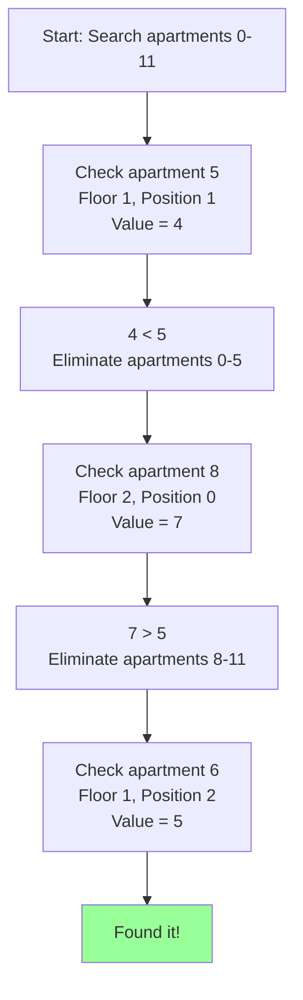
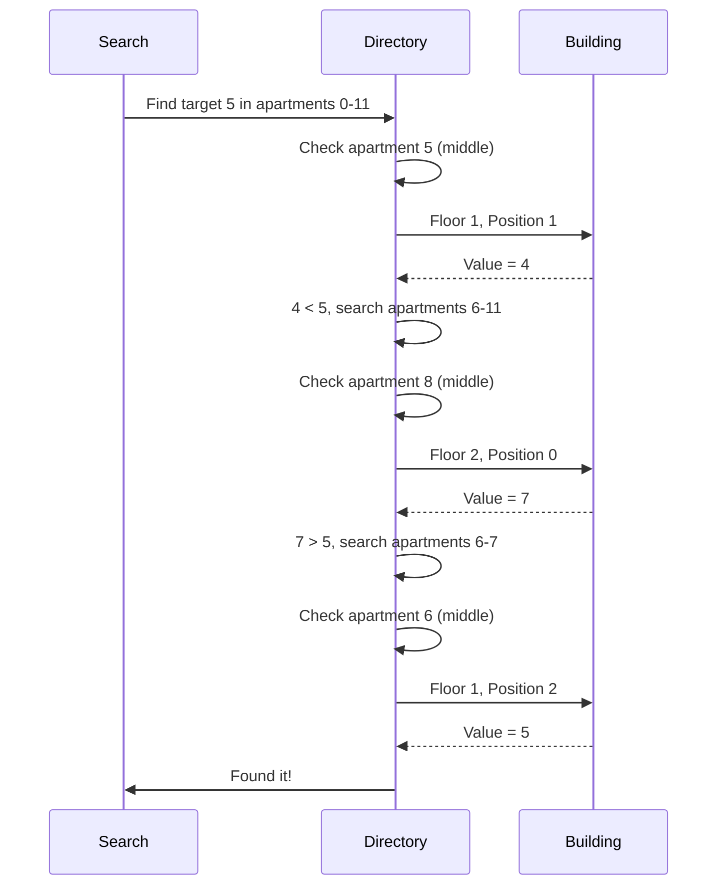

# Search a 2D Matrix - Mental Model

## The Apartment Building

Imagine you're standing in the lobby of an apartment building looking for apartment number 5.

The building has **3 floors**, each with **4 apartments**:

```
Floor 2:  Apartments with values [7, 8, 9, 10]
Floor 1:  Apartments with values [3, 4, 5, 6]
Floor 0:  Apartments with values [1, 2, 2, 2]
```

Each apartment has a number written on the door (the value you're searching for).

**Key property:** As you walk through the building from bottom to top, left to right, the numbers on the doors keep increasing. You never see a lower number after a higher one.

## How the Building Directory Works

The building has a directory in the lobby that numbers every apartment sequentially:

```
Apartment 0:  Floor 0, Position 0  (value: 1)
Apartment 1:  Floor 0, Position 1  (value: 2)
Apartment 2:  Floor 0, Position 2  (value: 2)
Apartment 3:  Floor 0, Position 3  (value: 2)
Apartment 4:  Floor 1, Position 0  (value: 3)
Apartment 5:  Floor 1, Position 1  (value: 4)
Apartment 6:  Floor 1, Position 2  (value: 5)
...and so on
```

**Question 1: How many total apartments are in the building?**

If you have **3 floors** with **4 apartments each**:
- Total apartments = 3 × 4 = **12 apartments**
- They're numbered 0 through 11

**Question 2: If I tell you "apartment 5", how do you find which floor it's on?**

Think about it: Every floor has 4 apartments. So:
- Apartments 0-3 are on floor 0 (that's 4 apartments)
- Apartments 4-7 are on floor 1 (that's another 4)
- Apartments 8-11 are on floor 2 (and another 4)

For apartment 5:
- How many complete floors have we passed? 5 ÷ 4 = **1 complete floor**
- So apartment 5 is on **floor 1**

**Question 3: What position on that floor?**

Apartment 5 is the **2nd apartment** on floor 1 (position 1, since we start counting at 0).

How do we calculate this?
- We've used up 4 apartments to fill floor 0 (apartments 0-3)
- Apartment 5 is at position 5 - 4 = 1

Another way: Use the remainder when dividing by 4.
- 5 % 4 = **1** → position 1 on the floor

**The formulas:**
- **Floor number** = apartment number ÷ apartments per floor (drop the remainder)
- **Position on floor** = apartment number % apartments per floor (just the remainder)

## Searching the Building Efficiently

**The naive way:** Start at apartment 0, check if it's the number you want. No? Check apartment 1. Still no? Check apartment 2... and so on.

For a 12-apartment building, you might check all 12 apartments!

**The smart way:** Since the apartment numbers increase in order, you can use the directory to jump around:

1. **Check the middle apartment first** (apartment 5 or 6)
2. **Compare** the value on that apartment's door to what you're looking for
3. **Eliminate half the building:**
   - If the value is too low, you know your target must be in higher-numbered apartments
   - If the value is too high, you know your target must be in lower-numbered apartments
4. **Repeat** with the remaining half

### Example: Finding value 5

**Setup:**
- Building has apartments 0-11
- You're looking for the apartment with value 5 written on its door

**Iteration 1:**
- Range: apartments 0-11
- Check the middle: (0 + 11) ÷ 2 = apartment 5
- Where is apartment 5?
  - Floor = 5 ÷ 4 = 1
  - Position = 5 % 4 = 1
  - Go to floor 1, position 1
- What value is on the door? **4**
- Is 4 equal to 5? No
- Is 4 less than 5? Yes!
- **Eliminate apartments 0-5.** Your target must be in apartments 6-11.

**Iteration 2:**
- Range: apartments 6-11
- Check the middle: (6 + 11) ÷ 2 = apartment 8
- Where is apartment 8?
  - Floor = 8 ÷ 4 = 2
  - Position = 8 % 4 = 0
  - Go to floor 2, position 0
- What value is on the door? **7**
- Is 7 equal to 5? No
- Is 7 less than 5? No, it's greater!
- **Eliminate apartments 8-11.** Your target must be in apartments 6-7.

**Iteration 3:**
- Range: apartments 6-7
- Check the middle: (6 + 7) ÷ 2 = apartment 6
- Where is apartment 6?
  - Floor = 6 ÷ 4 = 1
  - Position = 6 % 4 = 2
  - Go to floor 1, position 2
- What value is on the door? **5**
- **Found it!**

**We only checked 3 apartments instead of potentially all 12!**



## What You Need to Calculate

To search the building efficiently, you need to know:

### 1. **Total number of apartments**
Formula: `floors × apartments_per_floor`

Example: 3 floors × 4 apartments = 12 total

### 2. **Middle apartment in your current range**
Formula: `(left_apartment + right_apartment) ÷ 2`

Example: Searching apartments 0-11 → (0 + 11) ÷ 2 = 5

### 3. **Which floor an apartment is on**
Formula: `apartment_number ÷ apartments_per_floor` (integer division)

Example: Apartment 5 → 5 ÷ 4 = 1 (floor 1)

### 4. **Which position on that floor**
Formula: `apartment_number % apartments_per_floor` (remainder)

Example: Apartment 5 → 5 % 4 = 1 (position 1)

## Why These Formulas Work

**Think about climbing stairs:**

If each flight has 4 steps and you've climbed 11 steps total:
- How many complete flights have you climbed? 11 ÷ 4 = **2 complete flights**
- How many steps into the current flight? 11 % 4 = **3 steps into the 3rd flight**

Same logic for apartments:
- The division tells you how many complete floors you've passed
- The remainder tells you how far into the current floor you are

## Mapping to the 2D Matrix

Now here's the connection to code:

**The building is actually a nested array:**
```typescript
matrix = [
  [1, 2, 2, 2],   // Floor 0
  [3, 4, 5, 6],   // Floor 1
  [7, 8, 9, 10]   // Floor 2
]
```

**The building directory's apartment numbers are virtual indices** (they don't exist in the data structure).

**When you want to "visit apartment 5":**
1. Calculate which floor: `floor = 5 ÷ 4 = 1`
2. Calculate which position: `position = 5 % 4 = 1`
3. Access the nested array: `matrix[1][1]`
4. Read the value: `4`

You never create a flattened array. The apartment number is just a way of thinking about position, and you use the formulas to convert it to `matrix[floor][position]` whenever you need to actually access a value.

## The Algorithm

Now that you understand the building, here's how to search it in code:

```typescript
function searchMatrix(matrix: number[][], target: number): boolean {
    // Empty building? Nothing to search.
    if (matrix.length === 0 || matrix[0].length === 0) {
        return false;
    }

    // Calculate building dimensions
    const floors = matrix.length;                  // How many floors
    const apartmentsPerFloor = matrix[0].length;   // Apartments on each floor
    const totalApartments = floors * apartmentsPerFloor;  // Total in building

    // Set up our search range (apartment numbers in the directory)
    let leftApartment = 0;
    let rightApartment = totalApartments - 1;

    // Binary search through the apartment directory
    while (leftApartment <= rightApartment) {
        // Find the middle apartment in our current range
        const midApartment = Math.floor((leftApartment + rightApartment) / 2);

        // Calculate which floor this apartment is on
        const floor = Math.floor(midApartment / apartmentsPerFloor);

        // Calculate the position on that floor
        const position = midApartment % apartmentsPerFloor;

        // Go to that apartment and read the value on the door
        const value = matrix[floor][position];

        // Did we find it?
        if (value === target) {
            return true;
        } else if (value < target) {
            // Value is too low. Target must be in higher apartments.
            leftApartment = midApartment + 1;
        } else {
            // Value is too high. Target must be in lower apartments.
            rightApartment = midApartment - 1;
        }
    }

    // Searched all apartments, didn't find it
    return false;
}
```

## Visual Trace

Let's trace through finding `target = 5` in this matrix:

```typescript
matrix = [
  [1, 2, 2, 2],
  [3, 4, 5, 6],
  [7, 8, 9, 10]
]
```

**Initial state:**
- floors = 3, apartmentsPerFloor = 4, totalApartments = 12
- leftApartment = 0, rightApartment = 11

**Iteration 1:**
```typescript
midApartment = Math.floor((0 + 11) / 2) = 5
floor = Math.floor(5 / 4) = 1
position = 5 % 4 = 1
value = matrix[1][1] = 4

4 < 5, so leftApartment = 6
```

**Iteration 2:**
```typescript
midApartment = Math.floor((6 + 11) / 2) = 8
floor = Math.floor(8 / 4) = 2
position = 8 % 4 = 0
value = matrix[2][0] = 7

7 > 5, so rightApartment = 7
```

**Iteration 3:**
```typescript
midApartment = Math.floor((6 + 7) / 2) = 6
floor = Math.floor(6 / 4) = 1
position = 6 % 4 = 2
value = matrix[1][2] = 5

5 == 5, return true!
```



## Key Insights

1. **Virtual numbering:** The apartment numbers (0-11) don't exist in the data. They're a mental model for thinking about sequential positions.

2. **On-the-fly conversion:** We never flatten the array. Every time we need to access a value, we convert the apartment number to `matrix[floor][position]` using the formulas.

3. **Why it works:** The problem guarantees values increase sequentially (each row starts higher than the previous row ends). This is like a building where apartment numbers on doors increase as you go up.

4. **Efficiency:** Binary search means we eliminate half the remaining apartments with each check. For 12 apartments, max 4 checks. For 1000 apartments, max ~10 checks!

## Common Misconceptions

### ❌ "I need to flatten the matrix into a 1D array first"

**No!** That would take extra time and space.

The whole trick is: we THINK about it as a 1D sequence (apartment 0, 1, 2...) but ACCESS it as a 2D structure using the conversion formulas.

### ✅ "The apartment number is just for calculating where to look"

**Exactly!** When you think "apartment 5", you immediately calculate "floor 1, position 1" and access `matrix[1][1]`.

### ❌ "This only works for square matrices"

**No!** It works for any matrix where rows × cols gives you the total. Could be 3×4, 5×7, 100×3, whatever.

### ✅ "The key formulas are division and modulo"

**Yes!** These two operations convert apartment number → floor and position:
- `floor = apartment ÷ apartments_per_floor`
- `position = apartment % apartments_per_floor`

## Edge Cases

**Empty building:**
```typescript
matrix = []
```
No floors, no apartments. Return false immediately.

**Single apartment:**
```typescript
matrix = [[5]]
```
One apartment (apartment 0). Check it. If it matches target, return true. Otherwise false.

**Target doesn't exist:**
```typescript
matrix = [[1,3,5,7],[10,11,16,20]]
target = 13
```
Binary search will narrow down but never find a match. Eventually `leftApartment > rightApartment` and we return false.

---

**Summary:** Think of the 2D matrix as an apartment building with sequential numbering. To search efficiently, use binary search on apartment numbers (virtual indices), converting each apartment number to floor/position using division and modulo to access the actual nested array.