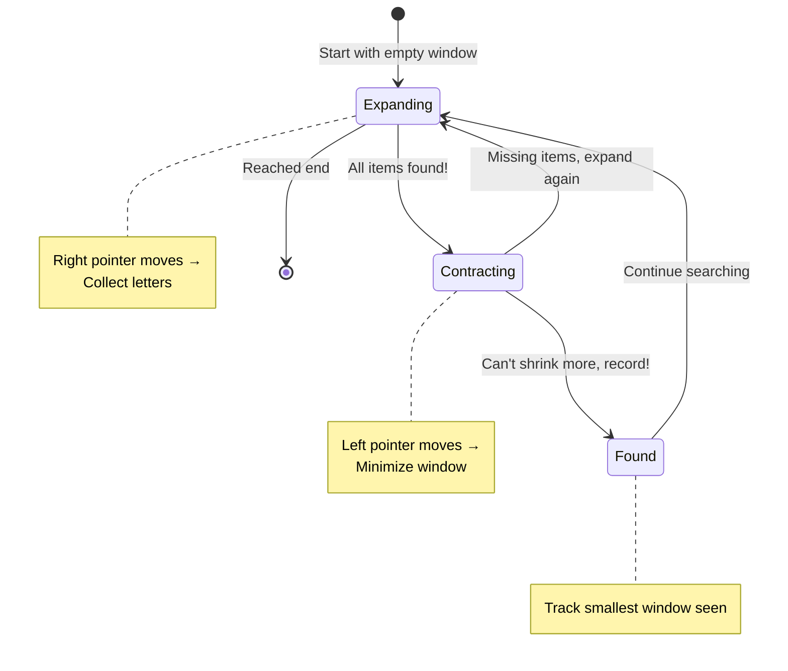

# Minimum Window Substring - Mental Model

## The Adjustable Magnifying Glass Analogy

Imagine you're a detective searching through a long string of random letters on a wall. You have a shopping list of specific letters you need to find (including duplicates). Your magnifying glass can expand and contract - you want to find the smallest viewing window that shows ALL the letters on your shopping list.

**Analogy mapping:**
- The wall of letters = String `s` (original)
- Your shopping list = String `t` (check)
- The magnifying glass = Sliding window (with left and right edges)
- Shopping list items checked off = Frequency counter of found letters
- Shrinking the magnifying glass = Moving left pointer to minimize window
- Expanding the magnifying glass = Moving right pointer to include more letters

## Building from the Ground Up

### The Simplest Case: s = "A", t = "A"

Let's trace through with our magnifying glass:

**Initial state:**
```
Wall:       A
           ↑
         (R&L)
Shopping:  A (need 1)
Found:     {} (have 0)
```

**Step 1: Expand right to include 'A'**
```
Wall:       A
           ↑
         (R&L)
Shopping:  A (need 1)
Found:     {A: 1} (have 1)
Satisfied? YES! ✓
Window: "A" (length 1)
```

We found the smallest window immediately! Can't shrink further.

### Adding Complexity: s = "ADOBECODEBANC", t = "ABC"

Now we need to find A, B, and C (one of each). Let's trace with our adjustable magnifying glass:



**Initial Setup:**
```
Need:    {A: 1, B: 1, C: 1}  ← shopping list
Have:    {}                  ← items collected
Matched: 0 / 3               ← unique letters satisfied
```

#### Phase 1: Expand until we have everything

```
A D O B E C O D E B A N C
L,R
Have: {A:1}  Matched: 1/3

A D O B E C O D E B A N C
L   R
Have: {A:1, D:1}  Matched: 1/3

A D O B E C O D E B A N C
L       R
Have: {A:1, D:1, O:1, B:1}  Matched: 2/3

A D O B E C O D E B A N C
L           R
Have: {A:1, D:1, O:1, B:1, E:1, C:1}  Matched: 3/3 ✓
Window: "ADOBEC" (length 6)
```

**STOP! We have everything! Time to CONTRACT!**

#### Phase 2: Shrink from left while still valid

```
A D O B E C O D E B A N C
L           R
Can we remove 'A'? Let's check:
Need A:1, Have A:1 → If we remove, we'll have A:0 (BREAK!)
NO! We need this A. Can't shrink.

Best window: "ADOBEC" (length 6)
```

#### Phase 3: Continue expanding to find better options

```
A D O B E C O D E B A N C
L               R
Have: {A:1, D:2, O:2, B:1, E:2, C:1}  Matched: 3/3 ✓

Now try contracting:
A D O B E C O D E B A N C
  L             R
Removed 'A' → Have: {A:0, D:2...} Matched: 2/3 ✗
OOPS! Lost validity, stop contracting.

Move right again...

A D O B E C O D E B A N C
  L                   R
Have: {D:2, O:2, B:2, E:2, C:1, A:1}  Matched: 3/3 ✓
Window: "DOBECODEBA" (length 10) - worse than "ADOBEC"

Contract again:
A D O B E C O D E B A N C
    L               R
Removed 'D' → still valid!

A D O B E C O D E B A N C
        L           R
Removed 'O', 'D' → still valid!

A D O B E C O D E B A N C
          L         R
Removed 'B' → Have: {B:1, E:2, C:1, A:1} Matched: 3/3 ✓
Window: "ECODEBA" (length 7) - still worse than "ADOBEC"

Continue this pattern...

Eventually reach:
A D O B E C O D E B A N C
                    L   R
Window: "BANC" (length 4) ← NEW BEST! ✓
```

## What Just Happened?

The key insight: **We alternate between expanding (collecting items) and contracting (minimizing window)**. It's like using a rubber band - stretch it to capture what you need, then squeeze it as tight as possible while keeping everything inside.

The algorithm has two modes:
1. **Hungry mode** (right pointer moving): Expand until shopping list is satisfied
2. **Efficient mode** (left pointer moving): Shrink while keeping shopping list satisfied

## Why Track Counts AND Matched?

This is crucial! Let's understand why we need both:

**The Counts Map** (`have`):
- Tracks how many of EACH letter we have
- Example: `{A: 2, B: 1, C: 3}` means we collected 2 A's, 1 B, 3 C's
- Needed for: Knowing if we can safely remove a letter from the left

**The Matched Counter** (`matched`):
- Tracks how many UNIQUE letters have sufficient quantity
- Example: If need `{A:1, B:1, C:1}` and have `{A:2, B:1, C:0}`, matched = 2
- Why? A is satisfied (2 ≥ 1), B is satisfied (1 ≥ 1), but C is not (0 < 1)
- Needed for: O(1) check if window is valid (matched === required unique letters)

**Why not just check the map every time?**
- Checking if window is valid by comparing every entry in the map = O(26) for English letters
- Using a `matched` counter = O(1) instant check!
- We update `matched` only when a letter's count crosses the required threshold

**Example of matched in action:**
```
Need:    {A: 1, B: 1}
Have:    {A: 0, B: 0}  → matched = 0

Add 'A':
Have:    {A: 1, B: 0}  → matched = 1 (A just became satisfied!)

Add 'A' again:
Have:    {A: 2, B: 0}  → matched = 1 (A was already satisfied, no change)

Remove 'A':
Have:    {A: 1, B: 0}  → matched = 1 (A still satisfied with 1)

Remove 'A':
Have:    {A: 0, B: 0}  → matched = 0 (A just became unsatisfied!)
```

## Why Not Use Two Pointers That Only Move Right?

You might think: "Why not just try every possible window?"

```typescript
// ❌ Naive approach
for (let left = 0; left < s.length; left++) {
  for (let right = left; right < s.length; right++) {
    if (windowHasAllChars(s.slice(left, right + 1), t)) {
      // Check if smallest...
    }
  }
}
// Time: O(n² × m) where m is time to validate each window
```

**Problems:**
1. Checks 91 windows for "ADOBECODEBANC" (13 × 14 / 2)
2. Each validation requires comparing character counts = extra O(26) work
3. Total: O(n²) window attempts × O(26) validation = Very slow!

**Sliding window approach:**
1. Right pointer visits each character once = 13 visits
2. Left pointer visits each character at most once = 13 visits
3. Total visits: 26 for a 13-character string = O(n)
4. Validation is O(1) with `matched` counter!

**Why does sliding window work?**

Once we shrink from the left and break validity, we know:
- Any further shrinking from the same left position will also be invalid
- No need to recheck! Just expand right to find the next valid window
- This eliminates the need to check every possible window

## Common Misconceptions

### ❌ "I need to compare the entire frequency maps to check if window is valid"

**Why it's wrong:**
```typescript
// Checking every character every time
function isValid(have: Map, need: Map): boolean {
  for (let [char, count] of need) {
    if ((have.get(char) || 0) < count) return false;
  }
  return true; // Called potentially n times = O(n × 26)
}
```

This wastes time doing the same comparisons repeatedly!

### ✅ "I maintain a 'matched' counter that updates only when thresholds cross"

```typescript
// Update matched only when crossing threshold
if (have.get(char) === need.get(char)) {
  matched++; // Just crossed the threshold!
}
// Check validity in O(1)
if (matched === requiredUniqueChars) { /* valid! */ }
```

### ❌ "I should reset my pointers when I find a valid window"

**Why it's wrong:**
If you reset to the beginning after finding "ADOBEC", you'd re-explore the same territory looking for the next window. Wasteful!

### ✅ "I continue sliding both pointers forward, never going backwards"

The left pointer's position represents "we've already fully explored all windows starting before this point." Keep moving forward!

### ❌ "I need to track characters not in t"

**Why it's wrong:**
Letters like 'D', 'O', 'E' that aren't in "ABC" don't matter for validity. Adding them to your tracking wastes space.

### ✅ "I only track characters that exist in t"

```typescript
if (need.has(char)) {
  have.set(char, (have.get(char) || 0) + 1);
  // Only update matched for relevant characters
}
```

## Why Shrink Greedily?

When the window becomes valid, why immediately try to shrink it?

**Think about it this way:**
```
Current window: "ADOBEC"
Why not just record it and move on?

Because there might be a better (smaller) window with the same starting position!

Example:
"ADOBEC" is valid (length 6)
Can't shrink (removing 'A' breaks it)

But what if we had: "AADOBEC"?
"AADOBEC" is valid (length 7)
Shrink: "ADOBEC" is valid (length 6)
Shrink: "DOBEC" is invalid - stop!

We found the best window starting at this left position!
```

**The rule:** Once valid, squeeze as much as possible from the left. This guarantees you find the optimal window for each left position before moving on.

## Try It Yourself

Trace through this example with the magnifying glass approach:

```
s = "OUZODYXAZV", t = "XYZ"
```

**Questions to guide you:**
1. Where does the first valid window appear?
2. How many times does the right pointer move before finding validity?
3. After finding the first valid window, what happens when you shrink?
4. What's the final answer?

**Hint:** Track these as you go:
- `need = {X: 1, Y: 1, Z: 1}`
- `have = {}` (update as you expand)
- `matched = 0` (update when counts satisfy needs)
- Best window found

## The Algorithm in Plain English

**Setup:**
1. Create a shopping list (`need`) from string `t` - count how many of each letter you need
2. Create an empty collection basket (`have`) to track what you've collected
3. Place your magnifying glass at the start (`left = 0`, `right = 0`)
4. Track how many unique items on your list are satisfied (`matched = 0`)

**The Search:**
1. **Expand the magnifying glass right:**
   - Look at the letter under the right edge
   - If it's on your shopping list, collect it (increment count in `have`)
   - If you just collected enough of this letter, increment `matched`

2. **While your window has everything you need** (`matched === required`):
   - Record this window if it's the smallest you've seen
   - Try to shrink by moving left edge right
   - If the letter you're about to remove is on the shopping list:
     - Remove it from `have`
     - If this makes you not have enough of it, decrement `matched`

3. **Repeat until the right edge reaches the end of the wall**

4. Return the smallest window you recorded (or empty string if none found)

## The Complete Solution

```typescript
function minWindow(original: string, check: string): string {
  // Shopping list: what letters do we need and how many?
  const shoppingList = new Map<string, number>();
  for (const letter of check) {
    shoppingList.set(letter, (shoppingList.get(letter) || 0) + 1);
  }

  // Collection basket: what have we gathered in current window?
  const basket = new Map<string, number>();

  // How many unique items on shopping list have we satisfied?
  let itemsSatisfied = 0;
  const itemsRequired = shoppingList.size;

  // Magnifying glass edges
  let leftEdge = 0;
  let rightEdge = 0;

  // Track the best (smallest) window found
  let bestWindowStart = 0;
  let bestWindowLength = Infinity;

  // Expand the magnifying glass by moving right edge
  while (rightEdge < original.length) {
    const letterAtRight = original[rightEdge];

    // Collect the letter if it's on our shopping list
    if (shoppingList.has(letterAtRight)) {
      basket.set(letterAtRight, (basket.get(letterAtRight) || 0) + 1);

      // Did we just satisfy this item's requirement?
      if (basket.get(letterAtRight) === shoppingList.get(letterAtRight)) {
        itemsSatisfied++;
      }
    }

    // While we have everything, try to shrink the window
    while (itemsSatisfied === itemsRequired) {
      // Record this window if it's the smallest
      const currentWindowLength = rightEdge - leftEdge + 1;
      if (currentWindowLength < bestWindowLength) {
        bestWindowStart = leftEdge;
        bestWindowLength = currentWindowLength;
      }

      // Try to remove from left edge
      const letterAtLeft = original[leftEdge];

      if (shoppingList.has(letterAtLeft)) {
        // About to lose this letter from basket
        if (basket.get(letterAtLeft) === shoppingList.get(letterAtLeft)) {
          itemsSatisfied--; // We're about to not have enough!
        }
        basket.set(letterAtLeft, basket.get(letterAtLeft)! - 1);
      }

      leftEdge++; // Shrink from left
    }

    rightEdge++; // Expand to the right
  }

  // Return the best window, or empty if none found
  return bestWindowLength === Infinity
    ? ""
    : original.slice(bestWindowStart, bestWindowStart + bestWindowLength);
}
```

## Time and Space Complexity

**Time: O(n + m)**
- Creating shopping list from `check`: O(m) where m = length of check
- Right pointer visits each character once: O(n)
- Left pointer visits each character at most once: O(n)
- Total: O(m + 2n) = O(n + m)

**Space: O(k)**
- Where k = number of unique characters in `check`
- Shopping list map: O(k)
- Basket map: O(k) at most
- Total: O(k), which is at most O(26) for English letters = O(1)

**Why is left pointer "at most once"?**
The left pointer only moves right, never backwards. It starts at 0 and can reach at most position n-1. Therefore, it moves at most n times total across the entire algorithm.

## Key Takeaways

1. **Sliding window works when you can maintain validity incrementally** - adding/removing one character at a time doesn't require rechecking everything
2. **The `matched` counter is the secret** - turns O(26) validation into O(1)
3. **Greedy shrinking is optimal** - once you find a valid window, immediately try to minimize it before expanding further
4. **Only track what matters** - ignore characters not in your shopping list
5. **Two pointers, one direction** - both pointers only move right, never backtrack