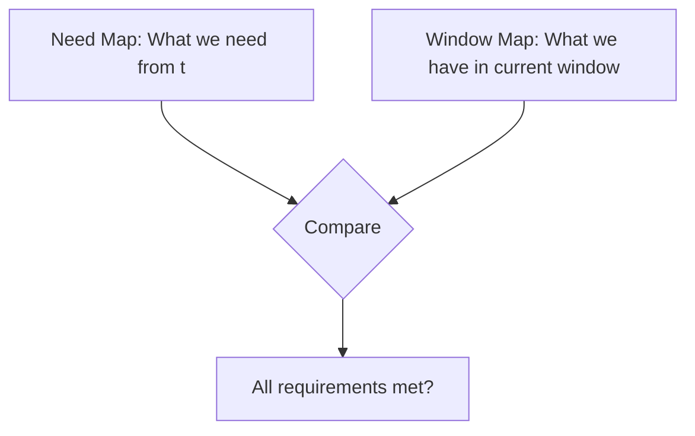
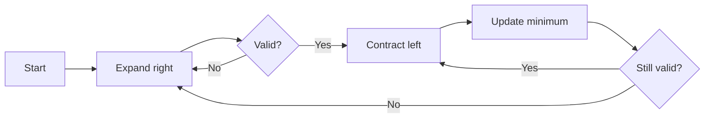

# Minimum Window Substring Study Guide

## Understanding the Problem

Given a string `s` and a string `t`, find the minimum window in `s` that contains all characters from `t` (including duplicates). This is a harder variant of the sliding window pattern because you need to match character frequencies, not just presence.

## Core Mental Models

### 1. The Frequency Matching Challenge

Unlike simpler sliding window problems, this requires matching **character counts**, not just checking if a character exists.

```
s = "ADOBECODEBANC"
t = "ABC"

Valid windows:
"ADOBEC" → has A:1, B:1, C:1 ✓ (length 6)
"CODEBA" → has A:1, B:1, C:1, but also O:1, D:1, E:1 ✓ (length 6)
"BANC"   → has A:1, B:1, C:1 ✓ (length 4) ← smallest!

Invalid windows:
"ADOB" → missing C ✗
"ABC" → doesn't exist as contiguous substring ✗
```

### 2. The Two Maps Pattern

Think of this problem requiring two tracking structures:



**Need Map**: Built from `t` - What counts we need
**Window Map**: Built from current window in `s` - What counts we have

### 3. The Matched Counter Insight

This is the key breakthrough: Don't compare every character count on every iteration. Instead, track **how many unique characters have met their requirement**.

```
t = "AABC"
need = {A: 2, B: 1, C: 1}
need.size = 3 (three unique characters)

Window progression:
{A:1, B:1, C:1} → matched = 2 (only B and C satisfied)
{A:2, B:1, C:1} → matched = 3 (all satisfied) ✓
```

**Valid window when:** `matched === need.size`

### 4. Expand Until Valid, Contract While Valid

This is different from basic sliding window:



**Key difference from basic sliding window:**
- Basic: expand while valid, contract once when invalid
- This: expand until valid, contract fully while valid

### 5. The Increment/Decrement Timing Problem

When does `matched` change? This is subtle:

```typescript
// When ADDING to window:
if (window.get(char) === need.get(char)) {
  matched++; // Just satisfied the requirement
}

// When REMOVING from window:
if (window.get(char) === need.get(char)) {
  matched--; // About to LOSE the requirement (check BEFORE decrement)
}
```

**Critical**: Check equality BEFORE changing the count!

## Visualization of Complete Example

```
s = "ADOBECODEBANC"
t = "ABC"
need = {A:1, B:1, C:1}

Step-by-step window progression:

[A]DOBECODEBANC       → {A:1} matched=1
[ADOB]ECODEBANC       → {A:1,D:1,O:1,B:1} matched=2
[ADOBEC]ODEBANC       → {A:1,D:1,O:1,B:1,E:1,C:1} matched=3 ✓
                         minLen=6, start=0

Contract left while valid:
 [DOBEC]ODEBANC       → {D:1,O:1,B:1,E:1,C:1} matched=2 (lost A)

Continue expanding:
        [CODEB]ANC    → {C:1,O:1,D:1,E:1,B:1} matched=2
           [EBANC]    → {E:1,B:1,A:1,N:1,C:1} matched=3 ✓
                         Contract this!
            [BANC]    → {B:1,A:1,N:1,C:1} matched=3 ✓
                         minLen=4, start=9 (better!)

Contract:
             [ANC]    → {A:1,N:1,C:1} matched=2 (lost B)

Final answer: "BANC"
```

## Key Insights to Consider

### Insight 1: Matched Counts Requirements, Not Characters

**Common mistake**: Counting total characters that exist in `t`

```typescript
// ❌ Wrong thinking
let count = 0;
for (let char of window) {
  if (need.has(char)) count++;
}
if (count === t.length) // This is wrong!
```

**Why it fails:**
- `t = "AA"`, window has `"AB"` → count=1 but we need 2 A's
- `t = "ABC"`, window has `"AABBCC"` → count=6 but we only need 3

**Correct thinking:**
```typescript
// ✅ Correct
if (matched === need.size) // All unique chars satisfied
```

### Insight 2: Check Before You Decrement

When removing from the left side of the window:

```typescript
// ❌ Wrong order
window.set(leftChar, window.get(leftChar) - 1);
if (window.get(leftChar) < need.get(leftChar)) {
  matched--; // Too late! Can't tell if we HAD the requirement
}

// ✅ Correct order
if (window.get(leftChar) === need.get(leftChar)) {
  matched--; // Check BEFORE modifying
}
window.set(leftChar, window.get(leftChar) - 1);
```

### Insight 3: Update Result During Contraction

```typescript
// ❌ Wrong - updates on first valid only
for (let right = 0; right < s.length; right++) {
  // expand...
  if (matched === need.size) {
    updateResult();
  }
}

// ✅ Correct - finds minimum by contracting
while (matched === need.size) {
  updateResult(); // Keep updating as we shrink
  // contract from left...
}
```

### Insight 4: Window Can Have Extra Characters

The window doesn't need to be EXACTLY the characters in `t`. It just needs to CONTAIN all of them.

```
t = "ABC"
Window "ADOBEC" is valid:
- Has A:1 (need 1) ✓
- Has B:1 (need 1) ✓
- Has C:1 (need 1) ✓
- Also has D, O, E (don't care)
```

### Insight 5: Tracking Window vs Tracking Matched

Two levels of tracking:
1. **Window map**: Exact counts of every character in window
2. **Matched counter**: How many requirements are satisfied

Don't confuse them!

```
t = "AABC"
need = {A:2, B:1, C:1}
window = {A:3, B:1, C:1, D:1}

window.size = 4 (four unique chars in window)
need.size = 3 (three unique chars we need)
matched = 3 (all three requirements satisfied)

Valid because: matched === need.size ✓
```

## Common Pitfalls to Avoid

### Pitfall 1: Thinking You Need Exact Match

You don't need the window to be exactly the characters from `t`. You need it to CONTAIN all of them (with correct frequencies).

### Pitfall 2: Comparing Maps Directly

Don't compare the entire maps on every iteration - too slow!

```typescript
// ❌ Too slow - O(m) on each iteration
function mapsEqual(map1, map2) {
  // comparing every entry...
}

// ✅ Fast - O(1) check
if (matched === need.size)
```

### Pitfall 3: Only Tracking Characters From t

You need to track ALL characters in the window to correctly shrink it.

```
Window: "ADOBEC"
If you only track {A:1, B:1, C:1}
When you shrink, you remove 'A' but can't account for 'D', 'O'
You won't know where the window actually is!
```

### Pitfall 4: Unnecessary Complexity

LeetCode 76 asks for **any** minimum window. You don't need:
- Lexicographic comparison (smallest alphabetically)
- All valid windows
- Pretty formatting

Just find shortest!

## Performance Considerations

Think about complexity:
- Building need map: O(m) where m = length of `t`
- Scanning string `s`: O(n) where n = length of `s`
- Each character visited at most twice (once by right, once by left)
- Map operations: O(1) for get/set/has

**Goal**: O(n + m) time, O(m) space

### Why O(n) and Not O(n²)?

Each pointer only moves forward:
- `right` goes from 0 to n: n steps
- `left` goes from 0 to n: n steps
- Total: 2n = O(n)

Even though there's a while loop inside the for loop, `left` never resets!

## Questions to Guide Your Thinking

1. What do you need to track from string `t`?
2. What do you need to track about the current window?
3. How do you know when a window is valid?
4. When do you expand the window vs contract it?
5. How do you avoid checking every character frequency on every step?
6. What's the minimum you need to update when adding/removing a character?
7. When exactly does `matched` increase or decrease?

## Algorithm Approach

### Phase 1: Setup

1. Build the `need` map from string `t`
2. Initialize `window` map (empty)
3. Initialize `matched = 0`
4. Initialize tracking for minimum (length and start position)

### Phase 2: Expand Window

1. Move `right` pointer forward through `s`
2. Add character to `window`
3. If this satisfies a requirement, increment `matched`

### Phase 3: Contract Window

1. While window is valid (`matched === need.size`):
   - Update minimum if current window is smaller
   - Remove leftmost character
   - If this breaks a requirement, decrement `matched`
   - Move `left` pointer forward

### Phase 4: Return Result

Extract substring using saved start position and minimum length

## Edge Cases to Consider

1. **t longer than s**: Return empty string (impossible to find)
2. **s and t same length**: Either exact match or empty string
3. **t has duplicate characters**: Must match frequencies
4. **No valid window exists**: Return empty string
5. **Multiple minimum windows**: Return any one
6. **t is empty**: What should happen? (Usually return empty)
7. **s is empty**: Return empty string

## Next Steps

Once you understand these concepts:
1. Start by building the `need` map
2. Think about what you need to track in the window
3. Figure out when to expand vs when to contract
4. Carefully handle the `matched` counter increment/decrement
5. Remember: check BEFORE you modify counts

The key is understanding that `matched` tracks satisfied requirements (not character counts), and only updating it when requirements change state (from satisfied to unsatisfied or vice versa).